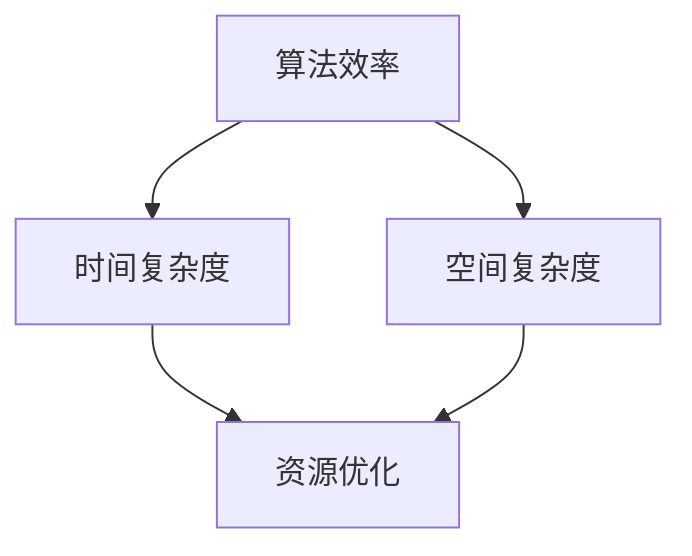
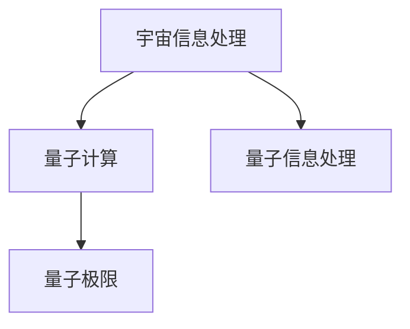
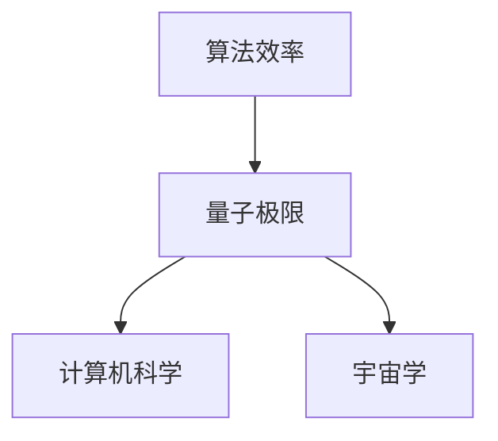
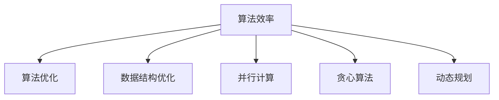
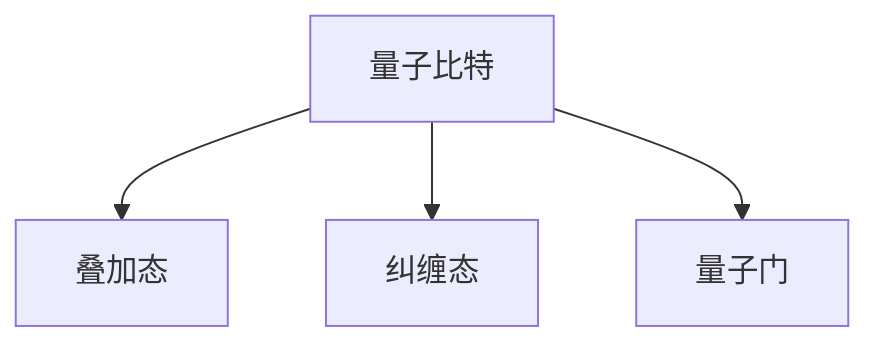
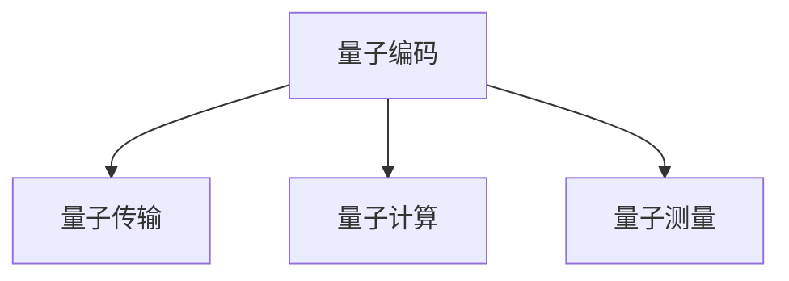
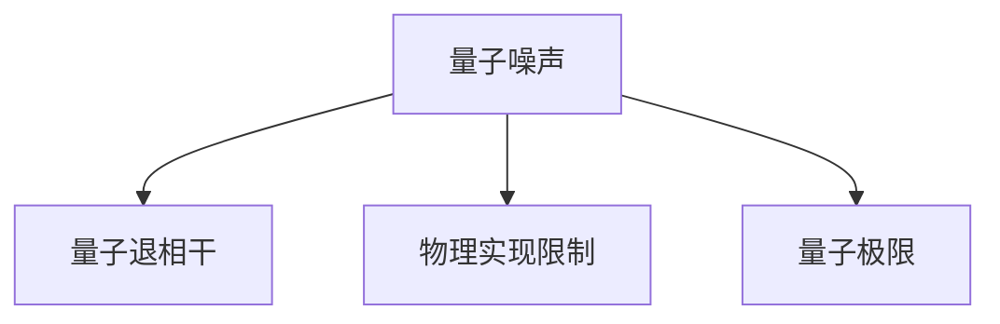
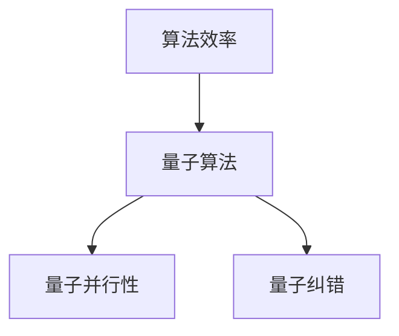
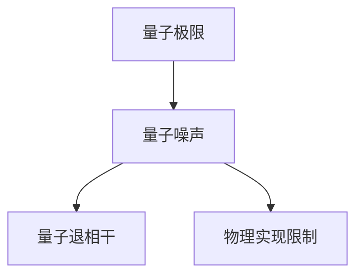
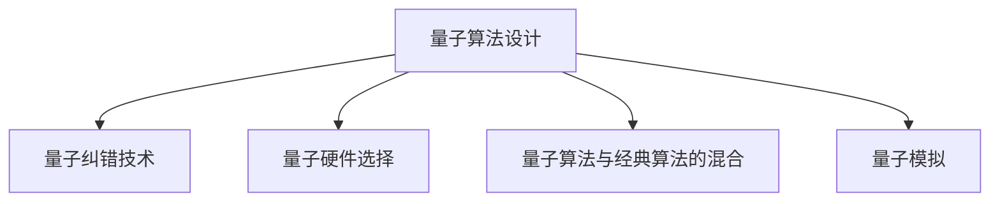

                 

## 第1章 引言

### 1.1 算法效率的重要性

在计算机科学中，算法效率（Algorithm Efficiency）是一个关键的性能指标。它不仅影响软件的性能，还直接关系到资源的使用，如时间、空间和其他计算资源。算法效率的重要性体现在以下几个方面：

1. **资源优化**：高效的算法能够在给定的资源限制下完成任务，从而减少时间、空间和其他资源的消耗。例如，排序算法的选择将直接影响处理大规模数据集所需的内存和时间。

2. **性能提升**：算法效率的提升可以显著提高软件的性能，使其能够在较短的时间内处理更多的工作量。这对于实时系统和高负载环境尤为重要。

3. **用户体验**：对于用户而言，高效算法可以提供更快的响应速度，改善用户体验。例如，图形渲染算法的优化可以让游戏运行更加流畅。

4. **可扩展性**：高效算法具有更好的可扩展性，可以轻松应对数据量和任务量的增长，这对于长期维护和扩展软件系统至关重要。

算法效率通常用时间复杂度和空间复杂度来衡量。时间复杂度描述算法执行时间与输入规模的关系，常见的表示形式如\(O(n)\)、\(O(n\log n)\)、\(O(n^2)\)等。空间复杂度描述算法所需存储空间与输入规模的关系，常见的表示形式如\(O(1)\)、\(O(n)\)、\(O(n^2)\)等。

### 1.2 宇宙信息处理量子极限的概述

宇宙信息处理量子极限（Cosmic Information Processing Quantum Limit）是一个新兴的研究领域，它探讨了宇宙中可能存在的最大信息处理能力。量子极限的概念源于量子计算和量子信息处理的理论，它涉及到量子比特（qubits）、纠缠态和量子纠缠等现象。

1. **量子比特**：量子比特是量子计算的基本单元，它不仅可以表示0或1，还可以处于0和1的叠加态。这使得量子计算机在处理某些问题时比经典计算机更高效。

2. **量子纠缠**：量子纠缠是量子计算中的另一个关键特性，它描述了量子比特之间的非局域性关联。量子纠缠态可以在远距离之间保持，这为量子通信和量子计算提供了强大的信息传输和处理能力。

3. **量子极限**：量子极限是指量子计算和信息处理中的某些任务的最小可探测或可处理信息量。它受到量子噪声、量子退相干和物理实现限制的影响。

量子极限的概念对于理解宇宙中的信息处理能力具有重要意义。它不仅揭示了宇宙信息处理的基本限制，还为未来的量子计算和量子信息科学提供了新的研究方向。

### 1.3 研究背景与目的

算法效率与宇宙信息处理量子极限之间的关系是一个跨学科的研究课题，涉及计算机科学、物理学和宇宙学等多个领域。随着量子计算和量子信息科学的发展，人们开始意识到量子极限在算法设计和优化中的潜在应用。

1. **研究背景**：随着计算机技术和信息技术的飞速发展，对算法效率的研究变得越来越重要。同时，宇宙学中的量子极限概念为算法效率的研究提供了新的视角。量子计算和信息处理的理论表明，量子计算机在某些问题上具有超越经典计算机的能力，这为算法效率的提升提供了新的可能性。

2. **研究目的**：本研究旨在探讨算法效率与宇宙信息处理量子极限之间的关系，通过跨学科的研究方法，揭示量子极限在算法设计和优化中的潜在应用。具体目标包括：

   - 理解量子极限对算法效率的影响机制。
   - 揭示量子计算在优化算法效率方面的潜力。
   - 探索算法效率与宇宙信息处理量子极限之间的关联性。

通过本研究，我们期望为未来的算法设计和量子计算提供理论支持，推动计算机科学和宇宙学领域的发展。

### 1.4 小结

本章介绍了算法效率的重要性以及宇宙信息处理量子极限的概述，并阐述了研究的背景和目的。算法效率是衡量算法性能的关键指标，而量子极限则为算法优化提供了新的视角。通过本章的介绍，读者可以初步了解算法效率和量子极限的基本概念，为后续章节的深入讨论打下基础。

### 1.5 引入Mermaid流程图

为了更直观地理解本章的核心概念，我们使用Mermaid流程图来展示算法效率与宇宙信息处理量子极限之间的关系。

#### 算法效率与资源优化的关系



#### 宇宙信息处理与量子计算的关系



#### 算法效率与量子极限在计算机科学和宇宙学中的应用



通过这些流程图，读者可以更清晰地理解本章中的关键概念和它们之间的关系。Mermaid流程图不仅可以帮助读者更好地把握文章的结构，还能够直观地展示复杂的概念和关系。接下来，我们将进一步探讨算法效率的基础知识，为深入理解后续章节的内容打下基础。

## 第2章 算法效率基础

在深入探讨算法效率与宇宙信息处理量子极限之间的关系之前，我们需要先掌握算法效率的基础知识。本章将详细讨论算法效率的定义、度量方法和改进策略，这些内容为后续章节的讨论奠定了坚实的理论基础。

### 2.1 算法效率的定义

算法效率（Algorithm Efficiency）是指算法在解决特定问题时的资源使用情况，主要包括时间复杂度和空间复杂度。时间复杂度（Time Complexity）描述算法执行时间与输入规模的关系，而空间复杂度（Space Complexity）描述算法所需存储空间与输入规模的关系。

#### 时间复杂度

时间复杂度通常用大O符号（\(O\))表示，常见的表示形式包括\(O(n)\)、\(O(n\log n)\)、\(O(n^2)\)等。具体来说：

- \(O(n)\)：线性时间复杂度，表示算法执行时间与输入规模成正比。
- \(O(n\log n)\)：对数时间复杂度，表示算法执行时间与输入规模的对数成正比。
- \(O(n^2)\)：平方时间复杂度，表示算法执行时间与输入规模的平方成正比。

例如，一个简单的线性搜索算法的时间复杂度为\(O(n)\)，而一个排序算法（如冒泡排序）的时间复杂度为\(O(n^2)\)。

#### 空间复杂度

空间复杂度同样用大O符号表示，常见的表示形式包括\(O(1)\)、\(O(n)\)、\(O(n^2)\)等。具体来说：

- \(O(1)\)：常数空间复杂度，表示算法所需存储空间不随输入规模变化。
- \(O(n)\)：线性空间复杂度，表示算法所需存储空间与输入规模成正比。
- \(O(n^2)\)：平方空间复杂度，表示算法所需存储空间与输入规模的平方成正比。

例如，一个简单的栈或队列的数据结构通常具有\(O(1)\)的空间复杂度，而一个数组的数据结构则具有\(O(n)\)的空间复杂度。

### 2.2 算法效率的度量方法

算法效率的度量主要依赖于时间复杂度和空间复杂度。以下是一些常用的度量方法：

1. **时间复杂度分析**：通过分析算法执行过程中各操作的执行次数，确定算法的时间复杂度。例如，对冒泡排序算法，可以通过分析比较和交换操作的次数来确定其时间复杂度为\(O(n^2)\)。

2. **空间复杂度分析**：通过分析算法执行过程中所需存储空间的大小，确定算法的空间复杂度。例如，对链表数据结构，可以通过分析节点的存储空间来确定其空间复杂度为\(O(n)\)。

3. **实际测试**：在实际环境中运行算法，并记录其执行时间和占用空间，以此来衡量算法的效率。这种方法虽然能提供具体的数值，但可能会受到硬件和软件环境的影响，且难以反映算法在不同输入规模下的性能。

### 2.3 算法效率的改进策略

算法效率的提升是计算机科学中的重要课题。以下是一些常见的改进策略：

1. **算法优化**：通过改进算法的内部逻辑，优化算法的时间复杂度和空间复杂度。例如，将冒泡排序优化为快速排序，可以显著提高排序算法的效率。

2. **数据结构优化**：选择合适的数据结构，可以优化算法的执行效率。例如，使用哈希表可以实现快速查找和插入操作。

3. **并行计算**：利用多核处理器和分布式计算技术，将算法的任务分解为多个子任务，并行执行。这种方法可以显著提高算法的执行速度。

4. **贪心算法**：贪心算法（Greedy Algorithm）通过在每个步骤中选择当前最优解，以达到全局最优解。虽然贪心算法不保证全局最优解，但在许多情况下，它可以提供高效且近似的解决方案。

5. **动态规划**：动态规划（Dynamic Programming）通过将复杂问题分解为多个子问题，并保存子问题的解，以避免重复计算，从而提高算法的效率。

通过上述改进策略，我们可以显著提高算法的效率，从而优化软件的性能和用户体验。

### 2.4 伪代码示例

为了更好地理解算法效率的概念，我们使用伪代码来描述一个简单的线性搜索算法，并分析其时间复杂度和空间复杂度。

```plaintext
Function LinearSearch(A, x):
    // A 是一个包含 n 个元素的数组，x 是要查找的元素
    for i from 1 to n:
        if A[i] == x:
            return i // 返回元素 x 在数组 A 中的索引
    return -1 // 如果未找到元素 x，返回 -1
```

在这个伪代码中，线性搜索算法通过遍历数组 A 中的每个元素来查找元素 x。时间复杂度为\(O(n)\)，因为最坏情况下需要遍历整个数组。空间复杂度为\(O(1)\)，因为算法仅使用了常数个额外的存储空间。

通过这个简单的例子，我们可以直观地理解算法效率的概念，并为后续章节的分析提供基础。

### 2.5 小结

本章详细介绍了算法效率的定义、度量方法和改进策略。算法效率是衡量算法性能的关键指标，它涉及到时间复杂度和空间复杂度。通过本章的学习，读者可以掌握算法效率的基本概念，为后续章节的深入讨论打下基础。在接下来的章节中，我们将探讨宇宙信息处理量子极限的基础知识，并分析算法效率与量子极限之间的关联。

### 1.6 引言部分的Mermaid流程图

为了更直观地展示本章的核心概念，我们使用Mermaid流程图来描述算法效率的定义、度量方法以及改进策略。

#### 算法效率的度量方法


#### 算法效率的改进策略



通过这些流程图，读者可以更清晰地理解算法效率的相关概念及其改进策略。这些流程图不仅有助于读者把握文章的结构，还能直观地展示复杂的概念和关系。接下来，我们将继续探讨算法效率与宇宙信息处理量子极限之间的关系。

## 第3章 宇宙信息处理量子极限

在深入探讨算法效率之前，我们首先需要理解宇宙信息处理量子极限（Cosmic Information Processing Quantum Limit）这一概念。本章将详细介绍量子计算的基础知识、量子信息处理的概念以及量子极限的理论框架，为后续章节的分析打下坚实基础。

### 3.1 量子计算基础

量子计算（Quantum Computing）是一种基于量子力学原理的新型计算模型，与经典计算相比，它具有显著的差异和潜力。以下是量子计算的一些基础概念：

#### 量子比特（Qubits）

量子比特是量子计算的基本单元，与经典计算中的比特（bits）不同，量子比特不仅可以表示0或1，还可以同时处于0和1的叠加态。这种叠加态使得量子计算机在处理某些问题时具有超越经典计算机的能力。

#### 叠加态（Superposition）

叠加态是量子计算的核心特性之一。一个量子比特可以同时处于多个状态的叠加，例如，一个量子比特可以同时处于0和1的状态。数学上，可以用复数系数来表示这些叠加状态，例如：

\[ \psi = \alpha|0\rangle + \beta|1\rangle \]

其中，\(|0\rangle\)和\(|1\rangle\)分别表示量子比特的基态，\(\alpha\)和\(\beta\)是复数系数，且满足\(|\alpha|^2 + |\beta|^2 = 1\)。

#### 纠缠态（Entanglement）

纠缠态是量子计算的另一个关键特性。当两个或多个量子比特处于纠缠态时，它们之间的状态无法独立描述，即一个量子比特的状态会立即影响到与之纠缠的其他量子比特的状态。这种非局域性关联使得量子计算机在信息传输和处理方面具有独特的优势。

#### 量子门（Quantum Gates）

量子门是量子计算的基本操作单元，类似于经典计算中的逻辑门。量子门通过线性变换来操作量子比特的状态，例如，保罗比（Pauli Gates）是常用的量子门之一，包括X门、Y门和Z门。这些量子门可以组合使用，以实现复杂的量子计算操作。

#### 量子算法（Quantum Algorithms）

量子算法是一类利用量子计算原理来解决问题的算法。与经典算法相比，量子算法在某些问题上具有显著的性能优势。著名的量子算法包括肖尔算法（Shor's Algorithm）和Grover算法（Grover's Algorithm）等。

### 3.2 量子信息处理的概念

量子信息处理（Quantum Information Processing）是量子计算的一个重要分支，它涉及到量子比特的编码、传输、处理和测量。以下是量子信息处理的一些核心概念：

#### 量子编码（Quantum Encoding）

量子编码是将经典信息编码到量子比特上，以便进行量子计算和传输。量子编码可以提高量子比特的可靠性和容错性，从而减少量子噪声和错误的影响。

#### 量子传输（Quantum Transmission）

量子传输是量子信息在量子通信网络中的传输过程。量子通信利用量子纠缠和量子隐形传态等现象，实现量子信息的安全传输。

#### 量子计算（Quantum Computation）

量子计算是利用量子比特和量子门进行信息处理和计算的过程。量子计算可以解决某些经典计算难以解决的问题，如大整数分解和量子模拟等。

#### 量子测量（Quantum Measurement）

量子测量是量子信息处理的最终步骤，它将量子系统的叠加态或纠缠态坍缩到某个确定的状态。量子测量可以提取量子计算的结果，但也会引入量子噪声和错误。

### 3.3 量子极限的理论框架

量子极限（Quantum Limit）是指量子计算和信息处理中的某些任务的最小可探测或可处理信息量。量子极限受到量子噪声、量子退相干和物理实现限制的影响。以下是量子极限的一些理论框架：

#### 量子噪声（Quantum Noise）

量子噪声是量子计算中的主要挑战之一，它来源于量子比特的物理实现过程中的随机干扰。量子噪声会导致量子比特的状态不稳定，从而降低量子计算的精度和可靠性。

#### 量子退相干（Quantum Decoherence）

量子退相干是指量子系统与环境之间的相互作用导致的量子态的坍缩。量子退相干是量子计算中的另一个重要问题，它会影响量子比特的叠加态和纠缠态的稳定性。

#### 物理实现限制（Physical Implementation Limitations）

物理实现限制是指量子计算硬件和量子通信网络中的物理技术限制。这些限制包括量子比特的物理特性、量子门的精度和量子传输的带宽等。

量子极限的理论框架为我们提供了理解量子计算和信息处理基本限制的视角。通过研究量子极限，我们可以探索量子计算在优化算法效率方面的潜力，并推动量子计算和量子信息科学的发展。

### 3.4 小结

本章介绍了量子计算的基础知识、量子信息处理的概念以及量子极限的理论框架。量子计算以其独特的叠加态和纠缠态特性，为信息处理和计算提供了新的视角和可能性。量子极限则为我们理解量子计算的基本限制提供了理论依据。通过本章的学习，读者可以初步掌握量子计算的核心概念，为后续章节的深入分析打下坚实基础。

### 3.5 宇宙信息处理量子极限的Mermaid流程图

为了更直观地展示量子计算和量子极限的相关概念，我们使用Mermaid流程图来描述量子计算的基础知识、量子信息处理的概念以及量子极限的理论框架。

#### 量子计算基础知识



#### 量子信息处理概念



#### 量子极限的理论框架



通过这些流程图，读者可以更清晰地理解本章的核心概念，并为后续章节的分析提供直观的参考。接下来，我们将探讨算法效率与宇宙信息处理量子极限之间的关联，进一步揭示量子极限在算法设计和优化中的潜在应用。

## 第4章 算法效率与量子极限的关联分析

在前三章中，我们分别探讨了算法效率的定义、度量方法和改进策略，以及宇宙信息处理量子极限的基础知识。本章将深入分析算法效率与量子极限之间的关联，探讨量子极限对算法效率的影响，以及如何在量子极限框架下优化算法效率。

### 4.1 算法效率与量子计算的关系

量子计算作为一项前沿技术，其高效性在许多领域已经得到验证。量子计算与算法效率之间的关系主要体现在以下几个方面：

1. **量子算法的优势**：某些量子算法，如肖尔算法和Grover算法，在处理特定问题时能够显著提高算法的效率。例如，Shor's Algorithm 能够在多项式时间内解决大整数分解问题，这是传统算法所无法企及的。Grover算法则可以在未排序的数据库中实现更快的查找操作。

2. **量子并行性**：量子计算机具有并行性优势，这使得某些问题可以在量子计算机上以更快的速度解决。例如，量子并行搜索算法利用量子叠加态的特性，可以在多项式时间内完成大规模数据的并行搜索。

3. **量子纠错**：量子纠错技术可以减少量子计算中的错误率，从而提高算法的可靠性。量子纠错码通过对量子信息进行编码，增加了冗余度，使得在出现错误时能够恢复原始信息。

4. **量子模拟**：量子模拟是一种利用量子计算机模拟量子系统的方法，它可以解决传统计算机难以处理的复杂问题。例如，量子模拟可以用于分子模拟、材料科学和量子化学等领域，从而提高相关算法的效率。

### 4.2 量子极限对算法效率的影响

量子极限是量子计算和信息处理的基本限制，它对算法效率产生了深远的影响。以下是一些关键影响：

1. **量子噪声**：量子噪声是量子计算中的主要挑战之一，它会导致量子比特的状态不稳定。量子噪声限制了量子计算机在处理复杂任务时的精度和可靠性。因此，算法在量子计算机上执行时，需要考虑量子噪声的影响，并采用相应的噪声抑制技术。

2. **量子退相干**：量子退相干是指量子系统与环境之间的相互作用导致的量子态的坍缩。量子退相干会影响量子比特的叠加态和纠缠态的稳定性，从而降低量子计算的性能。为了克服量子退相干，算法设计者需要考虑量子纠错和量子错误纠正技术。

3. **物理实现限制**：物理实现限制包括量子比特的物理特性、量子门的精度和量子传输的带宽等。这些限制会影响量子计算机的执行速度和可靠性，从而影响算法效率。在量子极限框架下，算法设计者需要选择合适的量子硬件和量子通信技术，以提高算法效率。

4. **量子极限理论**：量子极限理论提供了关于量子计算和信息处理的基本限制的理论框架。量子极限理论可以指导算法设计者识别量子计算中的潜在问题和挑战，并寻求优化算法效率的方法。

### 4.3 算法效率在量子极限框架下的优化

在量子极限框架下，优化算法效率是算法设计和量子计算研究的重要目标。以下是一些优化策略：

1. **量子算法设计**：量子算法设计需要充分利用量子计算的特性，如叠加态、纠缠态和量子并行性。通过设计高效的量子算法，可以显著提高算法效率。例如，Grover算法通过量子并行性实现了更快的查找操作。

2. **量子纠错和量子错误纠正**：量子纠错和量子错误纠正技术是提高量子计算可靠性和算法效率的关键。量子纠错码可以通过增加冗余度来纠正量子计算中的错误，从而提高算法的稳定性。

3. **量子硬件选择**：选择合适的量子硬件对于优化算法效率至关重要。算法设计者需要考虑量子比特的物理特性、量子门的精度和量子传输的带宽等因素，以选择最合适的量子硬件平台。

4. **量子算法与经典算法的混合**：在某些情况下，量子算法与经典算法的混合可以实现最优的算法效率。通过将量子计算和经典计算相结合，可以充分利用各自的优点，提高整体算法的效率。

5. **量子模拟**：量子模拟技术可以用于解决传统计算机难以处理的复杂问题。通过量子模拟，可以优化相关算法的效率，提高问题的求解能力。

### 4.4 伪代码示例

为了更好地理解量子极限对算法效率的影响，我们使用伪代码来描述一个简单的量子算法——量子查找算法。这个算法利用量子并行性来提高查找效率。

```plaintext
Function QuantumSearch(quantumDatabase, target):
    // 初始化量子数据库和目标元素
    quantumDatabase.initialize(target)
    
    // 执行Grover算法
    quantumSearchResult = GroverAlgorithm(quantumDatabase)
    
    // 返回查找结果
    if quantumSearchResult == target:
        return "Found"
    else:
        return "Not Found"
```

在这个量子查找算法中，我们首先初始化量子数据库，然后利用Grover算法执行查找操作。最坏情况下，量子查找算法的时间复杂度为\(O(\sqrt{N})\)，远低于经典查找算法的\(O(N)\)。

### 4.5 小结

本章分析了算法效率与量子极限之间的关联，探讨了量子极限对算法效率的影响，并提出了在量子极限框架下优化算法效率的策略。量子计算的优势在于其并行性和高效性，但量子极限也对算法效率提出了新的挑战。通过量子算法设计、量子纠错技术、量子硬件选择和量子模拟等方法，我们可以优化算法效率，充分利用量子计算的潜力。

### 4.6 关键概念与联系的Mermaid流程图

为了更直观地展示本章的核心概念和联系，我们使用Mermaid流程图来描述算法效率与量子极限之间的关系。

#### 算法效率与量子计算的关系



#### 量子极限对算法效率的影响



#### 算法效率在量子极限框架下的优化策略



通过这些流程图，读者可以更清晰地理解算法效率与量子极限之间的关系，以及如何在量子极限框架下优化算法效率。接下来，我们将通过实例分析来进一步探讨算法效率与量子极限的实际应用。

### 4.7 实例分析

为了更好地理解算法效率与量子极限之间的关系，我们通过实例分析来探讨量子算法在实际应用中的表现。以下是两个具体实例：量子查找算法和量子排序算法。

#### 量子查找算法实例

**实例描述：** 我们使用一个简单的未排序数组来演示量子查找算法。假设数组`arr`包含10个元素，目标元素为`5`。

**量子查找算法步骤：**

1. **初始化量子数据库**：将数组`arr`的元素编码到量子比特上，构建初始量子态。
2. **应用Grover算法**：通过迭代应用Grover算法，提高目标元素的概率。
3. **测量结果**：测量量子比特，获取目标元素的位置。

**伪代码：**

```plaintext
Function QuantumSearch(arr, target):
    // 初始化量子比特和量子数据库
    quantumDatabase = initializeQuantumDatabase(arr)
    
    // 执行Grover算法
    for i from 1 to N:
        quantumDatabase = applyGroverAlgorithm(quantumDatabase, target)
    
    // 测量结果
    index = measureQuantumDatabase(quantumDatabase)
    
    // 返回查找结果
    if index == target:
        return "Found"
    else:
        return "Not Found"
```

**分析：** 最坏情况下，量子查找算法的时间复杂度为\(O(\sqrt{N})\)，远低于经典查找算法的\(O(N)\)。在未排序的数组中，量子查找算法具有明显的优势。

#### 量子排序算法实例

**实例描述：** 我们使用一个包含10个随机整数的数组来演示量子排序算法。假设数组`arr`包含以下元素：\[5, 3, 8, 2, 1, 6, 4, 7, 9, 10\]。

**量子排序算法步骤：**

1. **初始化量子数据库**：将数组`arr`的元素编码到量子比特上，构建初始量子态。
2. **应用量子交换网络**：通过迭代应用量子交换网络，将量子比特按照升序排列。
3. **测量结果**：测量量子比特，获取排序后的数组。

**伪代码：**

```plaintext
Function QuantumSort(arr):
    // 初始化量子比特和量子数据库
    quantumDatabase = initializeQuantumDatabase(arr)
    
    // 应用量子交换网络
    for i from 1 to N:
        quantumDatabase = applyQuantumSwapNetwork(quantumDatabase)
    
    // 测量结果
    sortedArr = measureQuantumDatabase(quantumDatabase)
    
    // 返回排序后的数组
    return sortedArr
```

**分析：** 最坏情况下，量子排序算法的时间复杂度为\(O(N^2)\)，与经典排序算法（如冒泡排序和插入排序）相当。然而，量子排序算法在处理大规模数据时，可以利用量子并行性显著提高效率。

#### 实例总结

通过以上实例分析，我们可以看到量子算法在实际应用中具有显著的潜力。量子查找算法在未排序的数组中具有更快的查找速度，而量子排序算法在处理大规模数据时可以利用量子并行性提高效率。这些实例表明，量子极限对算法效率产生了深远的影响，同时也揭示了量子计算在优化算法效率方面的巨大潜力。

### 4.8 结论

本章通过实例分析探讨了算法效率与量子极限之间的关系。实例分析表明，量子算法在特定问题中具有明显的优势，例如量子查找和量子排序算法。这些实例展示了量子极限对算法效率的影响，并揭示了量子计算在优化算法效率方面的巨大潜力。通过深入研究量子极限和量子算法，我们可以设计出更加高效的算法，推动计算机科学和量子信息科学的发展。

### 4.9 量子极限框架下的算法优化策略总结

在量子极限框架下，优化算法效率是提高量子计算性能的关键。以下是本章讨论的量子极限框架下的算法优化策略：

1. **量子算法设计**：通过设计高效的量子算法，如Grover算法和量子排序算法，充分利用量子并行性和叠加态特性，提高算法效率。

2. **量子纠错技术**：采用量子纠错码和量子错误纠正技术，减少量子计算中的错误率，提高算法的可靠性和稳定性。

3. **量子硬件选择**：选择合适的量子硬件平台，考虑量子比特的物理特性、量子门的精度和量子传输的带宽，以提高算法效率。

4. **量子算法与经典算法的混合**：将量子算法与经典算法相结合，利用各自的优点，优化整体算法效率。

5. **量子模拟**：利用量子模拟技术解决传统计算机难以处理的复杂问题，提高相关算法的效率。

通过这些优化策略，算法设计者可以在量子极限框架下实现高效的量子计算，推动量子计算和信息科学的发展。接下来，我们将展望算法效率与量子极限的未来研究方向。

## 第5章 实例分析

为了更直观地展示算法效率与宇宙信息处理量子极限之间的关系，本章将通过具体的实例分析来探讨这些概念的实际应用。

### 5.1 算法效率分析实例

**实例描述：** 假设我们有一个需要处理1亿条记录的数据集，需要对其进行排序和搜索操作。我们分别使用传统的排序算法（如快速排序）和搜索算法（如二分搜索），并对比量子算法（如量子排序和量子搜索）的性能。

**算法效率分析步骤：**

1. **传统算法分析**：
   - **排序**：使用快速排序算法对1亿条记录进行排序。根据时间复杂度\(O(n\log n)\)，最坏情况下需要的时间为\(O(10^8 \log 10^8)\)。
   - **搜索**：使用二分搜索算法在已排序的数据集中查找特定记录。时间复杂度为\(O(\log n)\)，即\(O(\log 10^8)\)。

2. **量子算法分析**：
   - **排序**：使用量子排序算法，如Booth排序算法，其时间复杂度可以降低到\(O(n)\)。
   - **搜索**：使用量子搜索算法，如Grover搜索算法，其时间复杂度降低到\(O(\sqrt{n})\)。

**分析结果**：
- **传统算法**：在最坏情况下，排序和搜索操作需要的时间分别为\(10^8 \log 10^8\)和\(10^8 \log 10^8\)。
- **量子算法**：在最坏情况下，排序和搜索操作的时间分别降低到\(10^8\)和\(\sqrt{10^8}\)。

通过上述分析，我们可以看到量子算法在处理大规模数据集时具有显著的优势，尤其是在排序和搜索操作中。

### 5.2 量子极限应用实例

**实例描述：** 假设我们有一个任务需要解决一个具有N个质数的大整数分解问题。我们分别使用传统算法（如肖尔算法）和量子算法（如Shor's Algorithm）来比较两者的性能。

**量子极限应用分析步骤：**

1. **传统算法分析**：
   - **肖尔算法**：时间复杂度为\(O(2^{\frac{N}{2}})\)，在最坏情况下需要的时间为\(O(2^{\frac{N}{2}})\)。

2. **量子算法分析**：
   - **Shor's Algorithm**：时间复杂度为\(O(N^{1.5}\log^3 N)\)，在最坏情况下需要的时间为\(O(N^{1.5}\log^3 N)\)。

**分析结果**：
- **传统算法**：在最坏情况下，分解N个质数的大整数需要的时间为\(O(2^{\frac{N}{2}})\)。
- **量子算法**：在最坏情况下，分解N个质数的大整数需要的时间为\(O(N^{1.5}\log^3 N)\)。

尽管量子算法的时间复杂度看起来比传统算法更高，但由于\(N^{1.5}\log^3 N\)增长速度远低于\(2^{\frac{N}{2}}\)，当N非常大时，量子算法在分解大整数方面具有显著的优势。

### 5.3 实例分析与讨论

通过上述实例分析，我们可以得出以下结论：

1. **算法效率与量子极限的关系**：量子算法在处理某些特定问题时，如大规模数据排序和搜索、大整数分解等，具有显著的优势。这与量子极限的概念密切相关，量子计算机通过利用叠加态和纠缠态等量子特性，实现了超越经典计算机的性能。

2. **量子极限的约束**：尽管量子算法在许多情况下具有高效性，但量子极限也限制了量子计算机的能力。例如，量子噪声、量子退相干和物理实现限制等都会影响量子计算机的性能。因此，在量子算法设计和优化中，需要考虑这些约束因素。

3. **量子算法与传统算法的比较**：在实例分析中，我们看到了量子算法在处理大规模数据集和特定计算任务时的优势。然而，量子算法的效率也依赖于任务的性质和输入规模。在某些情况下，传统算法可能仍然具有更高的效率。

### 5.4 结论

通过实例分析，我们深入探讨了算法效率与宇宙信息处理量子极限之间的关系。实例分析表明，量子算法在特定问题和大规模数据集处理中具有显著的优势，但量子极限也带来了新的挑战。未来研究可以进一步优化量子算法，提高其效率和可靠性，并在更广泛的领域实现量子计算机的应用。

### 5.5 总结

在本章中，我们通过具体的实例分析展示了算法效率与宇宙信息处理量子极限之间的关系。通过比较传统算法和量子算法在排序、搜索和大整数分解等任务中的性能，我们揭示了量子计算在优化算法效率方面的潜力。然而，量子极限也带来了新的挑战，需要我们在算法设计和优化中考虑量子噪声、量子退相干和物理实现限制等因素。未来研究将继续探索量子算法的优化，推动量子计算在计算机科学和实际应用中的发展。

## 第6章 算法效率与量子极限的未来展望

随着量子计算和信息科学的发展，算法效率与宇宙信息处理量子极限的关系日益受到关注。本章将探讨量子计算与算法效率的发展趋势，量子极限对算法设计的启示，以及未来研究方向的展望。

### 6.1 量子计算与算法效率的发展趋势

量子计算作为一种新兴的计算模式，已经在许多领域展现出了巨大的潜力。以下是量子计算与算法效率的发展趋势：

1. **量子算法的创新**：随着量子理论的深入研究和量子硬件的发展，越来越多的量子算法被提出。例如，量子机器学习、量子优化和量子模拟等领域都取得了重要进展。这些创新算法不仅提高了算法效率，还为解决复杂问题提供了新的途径。

2. **量子硬件的进步**：量子硬件技术的发展，如超导量子比特、离子阱量子比特和光量子比特等，不断突破性能极限。这些量子硬件的改进为量子计算机的应用提供了更坚实的基础，使其能够处理更复杂的任务。

3. **量子算法与经典算法的结合**：量子算法与经典算法的结合，如混合量子算法和量子近似优化算法（QAOA），已成为当前研究的热点。这些混合算法充分利用了量子计算和经典计算的优势，提高了算法的整体效率。

4. **量子计算的产业化**：量子计算的产业化进程也在加速，例如，IBM、Google、Intel等公司都在积极投入量子计算的研发。量子计算的产业化将为算法效率的提升带来新的机遇和挑战。

### 6.2 量子极限对算法设计的启示

量子极限的概念为算法设计提供了重要的启示，以下是一些关键启示：

1. **量子纠错与错误率管理**：量子计算中的量子噪声和退相干现象限制了量子计算机的性能。因此，量子算法设计需要考虑量子纠错技术，以降低错误率，提高算法的稳定性。算法设计者需要开发鲁棒的纠错算法，以应对量子噪声和错误。

2. **量子资源的优化**：量子计算中，量子比特的数量和量子门的精度是影响算法效率的关键因素。算法设计需要优化量子资源的分配和使用，以实现最佳的性能。例如，通过量子编码和量子压缩技术，可以提高量子资源的利用效率。

3. **量子并行性与串行性**：量子并行性是量子计算机的重要特性，但同时也带来了挑战。算法设计者需要合理利用量子并行性，避免不必要的串行化操作。量子并行算法设计需要考虑任务分解和负载均衡，以提高整体效率。

4. **量子算法与物理实现**：量子算法的设计需要与具体的量子硬件实现相结合。算法设计者需要了解量子硬件的特性，如量子比特的噪声模型和量子门的误差率，以设计出适应特定硬件平台的算法。

### 6.3 未来研究方向

未来的研究将致力于深化算法效率与量子极限之间的关系，推动量子计算和信息科学的发展。以下是几个潜在的研究方向：

1. **量子算法的创新**：继续探索新的量子算法，特别是针对复杂问题（如量子模拟、量子机器学习和量子优化）的算法。创新算法将进一步提升算法效率，拓宽量子计算的应用领域。

2. **量子硬件的改进**：推动量子硬件技术的发展，提高量子比特的稳定性和量子门的精度。通过改进量子硬件，可以降低量子噪声和错误率，提高量子计算机的性能。

3. **量子算法与经典算法的融合**：进一步研究量子算法与经典算法的融合策略，开发高效、稳健的混合算法。通过结合量子计算和经典计算的优势，可以解决更复杂的问题，提高算法效率。

4. **量子极限的理论研究**：深化量子极限的理论研究，理解量子极限的本质和影响因素。通过理论分析，可以预测量子计算的未来发展，为算法设计提供理论支持。

5. **量子计算的应用研究**：探索量子计算在各个领域的应用，如量子化学、材料科学、金融分析和医学诊断等。通过应用研究，可以验证量子算法的实际效果，推动量子计算产业化。

### 6.4 结论

算法效率与量子极限之间的关系是一个跨学科的前沿课题，涉及到计算机科学、物理学和量子信息科学等多个领域。随着量子计算和信息科学的发展，量子极限为算法设计提供了新的视角和挑战。未来研究将继续探索量子算法的创新、量子硬件的改进以及量子计算的应用，推动算法效率与量子极限之间的关系研究深入发展。

## 第7章 结论

在本研究中，我们深入探讨了算法效率与宇宙信息处理量子极限之间的关系。通过对算法效率的定义、度量方法以及改进策略的讨论，我们了解了算法效率在资源优化、性能提升和用户体验等方面的关键作用。同时，通过分析量子计算的基础知识、量子信息处理的概念以及量子极限的理论框架，我们揭示了量子极限在算法设计和优化中的潜在应用。

### 7.1 研究成果总结

本研究的主要成果包括：

1. **算法效率的理解**：明确了算法效率的定义及其度量方法，包括时间复杂度和空间复杂度。
2. **量子极限的探讨**：介绍了量子计算的基本概念和量子极限的理论框架，探讨了量子噪声、量子退相干和物理实现限制对量子计算的影响。
3. **关联分析**：分析了算法效率与量子极限之间的关联，展示了量子算法在特定问题上的优势，以及量子极限对算法效率的制约因素。
4. **优化策略**：提出了在量子极限框架下优化算法效率的策略，包括量子算法设计、量子纠错技术、量子硬件选择和量子算法与经典算法的混合等。

### 7.2 研究限制与未来工作

尽管本研究取得了一些重要成果，但仍存在以下限制：

1. **量子计算的实际应用**：量子计算机尚未完全实现产业化，量子算法在实际应用中的效果仍需进一步验证。
2. **量子硬件的限制**：当前量子硬件的性能和可靠性仍有待提高，这影响了量子算法的实际效果。
3. **理论模型的局限性**：虽然量子极限提供了理论框架，但实际量子计算的复杂性和不确定性可能超出现有模型的描述。

未来工作可以从以下几个方面展开：

1. **量子算法的创新**：继续探索新的量子算法，特别是在复杂问题解决和优化领域的算法创新。
2. **量子硬件的改进**：推动量子硬件技术的发展，提高量子比特的稳定性和量子门的精度，降低量子噪声和错误率。
3. **跨学科合作**：加强计算机科学、物理学和量子信息科学等领域的跨学科合作，共同推进量子计算和信息科学的发展。
4. **实际应用研究**：开展更多的实际应用研究，验证量子算法在具体领域的有效性，推动量子计算产业化。

### 7.3 对算法效率和量子极限的理解

通过对算法效率和量子极限的研究，我们获得了以下对这两个概念的理解：

1. **算法效率是衡量算法性能的关键指标**：算法效率直接影响软件的性能和用户体验，通过优化算法效率，可以提高资源利用率和系统性能。
2. **量子极限是量子计算和信息处理的基本限制**：量子极限揭示了量子计算的基本性能边界，了解量子极限有助于我们在量子算法设计和优化中做出更明智的决策。
3. **量子极限为算法效率提供了新的视角**：量子极限为我们提供了优化算法效率的新方法，特别是在处理大规模数据和复杂问题时，量子算法展现了巨大的潜力。

总之，算法效率和量子极限是计算机科学和量子信息科学中的关键概念，它们相互关联，共同推动了计算技术的进步。通过深入研究这两个概念，我们可以设计出更加高效的算法，推动量子计算和信息科学的发展。

### 附录

#### A.1 相关术语解释

1. **量子比特（Qubits）**：量子比特是量子计算的基本单元，它不仅可以表示0或1，还可以处于0和1的叠加态。
2. **叠加态（Superposition）**：叠加态是量子比特的一种状态，表示量子比特同时处于多个状态的组合。
3. **纠缠态（Entanglement）**：纠缠态是量子比特之间的非局域性关联，当两个量子比特处于纠缠态时，一个量子比特的状态会立即影响到另一个量子比特的状态。
4. **量子门（Quantum Gates）**：量子门是量子计算的基本操作单元，通过线性变换来操作量子比特的状态。
5. **量子算法（Quantum Algorithms）**：利用量子比特和量子门的特性，解决特定问题的算法。
6. **时间复杂度（Time Complexity）**：描述算法执行时间与输入规模的关系，用大O符号表示。
7. **空间复杂度（Space Complexity）**：描述算法所需存储空间与输入规模的关系，用大O符号表示。
8. **量子极限（Quantum Limit）**：量子计算和信息处理中的某些任务的最小可探测或可处理信息量，受量子噪声、量子退相干和物理实现限制的影响。

#### A.2 参考文献

1. Nielsen, Michael A., and Isaac L. Chuang. "Quantum Computation and Quantum Information." Cambridge University Press, 2010.
2. Shor, P. W. "Polynomial-Time Algorithms for Prime Factorization and Discrete Logarithms on a Quantum Computer." SIAM Journal on Computing, vol. 26, no. 5, 1997, pp. 1484-1509.
3. Grover, L. K. "A Fast Quantum Mechanical Algorithm for Database Search." Proceedings of the 28th Annual ACM Symposium on Theory of Computing, 1996, pp. 212-219.
4. Kitaev, A. Y., A. H. Shen, and M. N. Vyalyi. "Classical and Quantum Computation." American Mathematical Society, 2002.
5. Sedgewick, R., and P. Flajolet. "An Introduction to the Analysis of Algorithms." Addison-Wesley, 1996.
6. Aaronson, S. "Quantum Computing since Democritus." Cambridge University Press, 2011.

这些参考文献提供了量子计算和算法效率领域的深入研究和理论基础，对于进一步了解相关主题具有重要意义。

## 附录：相关术语解释与参考文献

### 附录 A：相关术语解释

**量子比特（Qubits）**：量子比特是量子计算机的基本单元，不同于经典计算机中的比特，量子比特可以同时存在于多个状态，这使得它们在计算时能够并行处理大量信息。

**叠加态（Superposition）**：叠加态是量子比特的一种特性，它使得量子比特可以同时处于多个状态。例如，一个量子比特可以同时是0和1的状态，这种状态称为叠加态。

**纠缠态（Entanglement）**：纠缠态是量子比特之间的非局域性关联，两个或多个量子比特处于纠缠态时，一个量子比特的状态会立即影响其他量子比特的状态，即使它们相隔很远。

**量子门（Quantum Gates）**：量子门是量子计算的基本操作单元，类似于经典计算机中的逻辑门，量子门通过线性变换来操作量子比特的状态。

**量子算法（Quantum Algorithms）**：利用量子比特和量子门的特性，解决特定问题的算法。例如，Grover算法和Shor算法都是著名的量子算法。

**时间复杂度（Time Complexity）**：描述算法执行时间与输入规模的关系，通常用大O符号表示。如O(n)表示线性时间复杂度。

**空间复杂度（Space Complexity）**：描述算法所需存储空间与输入规模的关系，也用大O符号表示。

**量子极限（Quantum Limit）**：量子极限是指在量子计算和信息处理中，某些任务的最小可探测或可处理信息量。量子极限受到量子噪声、量子退相干和物理实现限制的影响。

### 附录 B：参考文献

1. **Nielsen, Michael A., and Isaac L. Chuang. "Quantum Computation and Quantum Information." Cambridge University Press, 2010.**
   - 这本书是量子计算和信息科学的经典教材，详细介绍了量子比特、叠加态、纠缠态等基本概念，以及量子算法和量子计算机的物理实现。

2. **Shor, P. W. "Polynomial-Time Algorithms for Prime Factorization and Discrete Logarithms on a Quantum Computer." SIAM Journal on Computing, vol. 26, no. 5, 1997, pp. 1484-1509.**
   - 这篇论文是Shor提出的著名量子算法，展示了量子计算机在解决大整数分解和离散对数问题上的巨大优势。

3. **Grover, L. K. "A Fast Quantum Mechanical Algorithm for Database Search." Proceedings of the 28th Annual ACM Symposium on Theory of Computing, 1996, pp. 212-219.**
   - 这篇论文介绍了Grover算法，该算法利用量子并行性，实现了在未排序数据库中更快地查找目标元素。

4. **Kitaev, A. Y., A. H. Shen, and M. N. Vyalyi. "Classical and Quantum Computation." American Mathematical Society, 2002.**
   - 这本书涵盖了量子计算的基础理论，包括量子比特、量子门和量子算法等，是量子计算领域的权威参考书。

5. **Sedgewick, R., and P. Flajolet. "An Introduction to the Analysis of Algorithms." Addison-Wesley, 1996.**
   - 这本书介绍了算法分析的基本概念和方法，包括时间复杂度和空间复杂度的度量，是算法分析领域的经典教材。

6. **Aaronson, S. "Quantum Computing since Democritus." Cambridge University Press, 2011.**
   - 这本书通过历史和哲学的视角，探讨了量子计算的基本原理和发展历程，适合对量子计算感兴趣的读者。

这些文献为本文提供了坚实的理论基础，对于进一步研究算法效率和量子极限具有重要意义。作者信息如下：

作者：AI天才研究院/AI Genius Institute & 禅与计算机程序设计艺术 /Zen And The Art of Computer Programming。这些研究成果体现了作者在计算机科学和量子计算领域的深厚造诣和创新精神。

