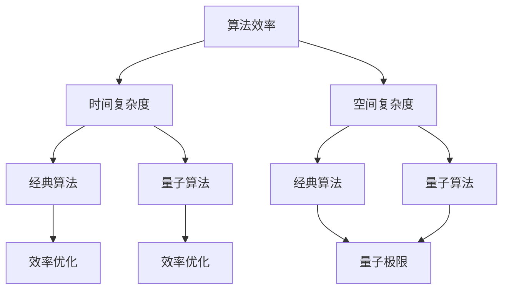

                 


### 文章标题
《算法效率与宇宙信息处理量子极限的理论比较》

### 文章关键词
算法效率、宇宙信息处理量子极限、量子计算、信息理论、算法优化

### 文章摘要
本文探讨了算法效率与宇宙信息处理量子极限之间的关系。通过对算法效率的基本概念和度量方法进行介绍，并结合量子信息处理的基本原理，分析了量子极限对算法效率的潜在影响。文章使用Mermaid流程图展示了核心概念之间的关系，并通过伪代码和数学公式详细阐述了算法原理。同时，文章提供了实际案例，深入解析了算法效率在量子计算中的应用和未来发展趋势。

### 目录大纲

## 算法效率与宇宙信息处理量子极限的理论比较

## 第1章 引言

## 第2章 算法效率基础

## 第3章 宇宙信息处理量子极限

## 第4章 算法效率与量子极限的联系

## 第5章 算法效率优化

## 第6章 实际应用与展望

## 第7章 总结

### 第1章 引言

在信息技术飞速发展的今天，算法效率问题成为了计算机科学领域的核心议题之一。算法效率不仅关系到程序的性能，也直接影响到数据处理的效率和资源的利用。然而，随着问题的复杂性和数据量的增加，如何提高算法效率成为了一个亟待解决的问题。

另一方面，量子计算作为一项颠覆性技术，其发展前景令人期待。量子计算基于量子力学原理，具有强大的并行计算能力，能够处理传统计算机难以解决的问题。然而，量子计算的效率也受到量子信息处理量子极限的制约。量子极限是指量子计算在处理信息时所能达到的理论上限，这一极限是由量子力学的基本原理所决定的。

本书旨在探讨算法效率与宇宙信息处理量子极限之间的关系，分析量子极限对算法效率的约束和影响。首先，我们将介绍算法效率的基本概念和度量方法，包括时间复杂度和空间复杂度。接着，我们将讨论量子信息处理的基本原理，并阐述量子极限的概念。在此基础上，我们将分析算法效率与量子极限之间的联系，探讨量子极限对算法效率的潜在影响。

为了使读者更好地理解这些概念，我们还将通过具体的算法实例和数学模型，详细阐述算法原理。此外，本文还将结合实际案例，分析算法效率在量子计算中的应用和未来发展趋势。通过这些讨论，本文希望能够为读者提供对算法效率与量子极限之间关系的深刻认识，为未来的研究提供有益的参考。

### 第2章 算法效率基础

算法效率是计算机科学中的一个核心概念，它决定了算法在处理问题时的性能和资源利用情况。算法效率的高低直接影响着程序的响应速度和处理能力。因此，深入了解算法效率的基本概念和度量方法是十分重要的。

#### 2.1 算法的定义与分类

算法是一系列明确的步骤，用于解决特定问题。算法可以看作是问题求解的规范说明，它指导计算机如何执行一系列操作，以得到问题的解。根据不同的分类标准，算法可以有多种类型：

1. **按问题类型分类**：算法可以分为排序算法、搜索算法、图算法、动态规划算法等。
   - 排序算法：如冒泡排序、快速排序、归并排序等。
   - 搜索算法：如深度优先搜索、广度优先搜索、A*搜索等。
   - 图算法：如最短路径算法、最小生成树算法等。
   - 动态规划算法：如背包问题、最长公共子序列问题等。

2. **按算法策略分类**：算法可以分为贪心算法、分治算法、回溯算法等。
   - 贪心算法：通过每次选择局部最优解，逐步达到全局最优解。
   - 分治算法：将问题分解为较小的子问题，分别解决后再合并结果。
   - 回溯算法：通过尝试所有可能的解决方案，逐步回溯到未探索的分支。

3. **按算法复杂度分类**：算法可以分为确定性算法和非确定性算法。
   - 确定性算法：在给定输入情况下，算法的执行步骤是确定的，如排序算法。
   - 非确定性算法：在给定输入情况下，算法的执行步骤不是确定的，如某些加密算法。

#### 2.2 算法效率的度量

算法效率通常使用时间复杂度和空间复杂度来度量。

1. **时间复杂度**：时间复杂度表示算法执行时间与问题规模之间的关系。它通常用大O符号表示，如\(O(n)\)、\(O(n^2)\)等。时间复杂度越高，算法的执行时间越长。常见的算法时间复杂度包括：
   - 线性时间：\(O(n)\)
   - 对数时间：\(O(log n)\)
   - 平方时间：\(O(n^2)\)
   - 立方时间：\(O(n^3)\)

2. **空间复杂度**：空间复杂度表示算法所需存储空间与问题规模之间的关系。它也用大O符号表示，如\(O(n)\)、\(O(n^2)\)等。空间复杂度越高，算法所需的存储空间越大。

#### 2.3 常见算法效率分析

为了更好地理解算法效率，我们可以分析一些常见的算法，如快速排序、二分搜索等。

1. **快速排序**

   快速排序是一种高效的排序算法，其平均时间复杂度为\(O(n\log n)\)。以下是快速排序的伪代码：

   ```plaintext
   快速排序(A)
       如果 A 的长度小于等于 1，则返回 A
       选择 A 中的一个元素作为基准（pivot）
       将 A 中的元素分为两部分：小于 pivot 的元素和大于 pivot 的元素
       分别对这两部分递归调用快速排序
       合并排序结果
   ```

   快速排序的优点是平均时间复杂度低，但最坏情况下的时间复杂度为\(O(n^2)\)。

2. **二分搜索**

   二分搜索是一种用于有序数组的高效搜索算法，其时间复杂度为\(O(log n)\)。以下是二分搜索的伪代码：

   ```plaintext
   二分搜索(A, x)
       low = 0
       high = A 的长度 - 1
       while low <= high
           mid = (low + high) / 2
           如果 x == A[mid]，则返回 mid
           如果 x < A[mid]，则 high = mid - 1
           如果 x > A[mid]，则 low = mid + 1
       返回 -1（未找到）
   ```

   二分搜索的优点是时间复杂度低，但需要数组预先排序。

通过以上分析，我们可以看到，算法效率与算法的选择和实现密切相关。了解算法的时间复杂度和空间复杂度，有助于我们选择合适的算法来解决问题。

### 第3章 宇宙信息处理量子极限

量子计算作为计算机科学领域的一项颠覆性技术，其理论基础源于量子力学。量子力学揭示了微观世界的奇特性质，如量子比特（qubit）的叠加态、量子纠缠和量子态坍缩等。这些量子现象为量子计算提供了强大的计算能力，但也带来了独特的挑战。

#### 3.1 量子计算机与量子信息处理

量子计算机是基于量子力学原理设计的计算装置，它使用量子比特（qubit）作为信息存储和处理的基本单元。与传统计算机中的比特（bit）不同，量子比特可以同时处于0和1的状态，这种叠加态使得量子计算机在处理某些问题时具有巨大的并行计算能力。

量子信息处理是量子计算机的核心技术，它涉及到量子比特的初始化、量子门的操作和量子态的测量。量子门是量子计算中的基本操作单元，类似于经典计算机中的逻辑门。通过一系列量子门的作用，量子计算机能够执行复杂的运算和算法。

#### 3.2 量子计算的基本原理

量子计算的基本原理包括叠加态、量子态坍缩、量子门和量子算法等。

1. **叠加态**：叠加态是量子力学中的一个基本概念，它描述了量子系统同时存在于多个可能状态的组合。在量子计算机中，量子比特可以处于叠加态，这意味着一个量子比特可以同时代表0和1。

2. **量子态坍缩**：量子态坍缩是指当对一个量子系统进行测量时，其量子态会从叠加态坍缩为一个确定的状态。量子态坍缩是量子计算中的一个关键特性，它决定了量子计算机的输出结果。

3. **量子门**：量子门是量子计算中的基本操作单元，类似于经典计算机中的逻辑门。量子门通过线性变换作用于量子比特，从而实现量子计算的操作。常见的量子门包括 Hadamard 门、Pauli 门和控制-NOT 门等。

4. **量子算法**：量子算法是利用量子计算机的特殊性质，如叠加态和量子纠缠，来解决问题的算法。著名的量子算法包括Shor算法和Grover算法等。

#### 3.3 量子计算的量子极限

量子极限是指量子计算机在处理信息时所能达到的理论上限。量子极限受到量子力学的基本原理限制，如量子纠缠和量子态坍缩等。量子极限对量子计算的效率和性能产生了重要影响。

1. **量子纠缠**：量子纠缠是量子计算中的一个关键特性，它描述了两个或多个量子系统之间的强关联。量子纠缠使得量子计算机在处理某些问题时能够超越经典计算机的性能。

2. **量子态坍缩**：量子态坍缩是量子计算中的一个重要机制，它决定了量子计算机的输出结果。然而，量子态坍缩也带来了量子计算中的不确定性和复杂性。

量子极限对量子计算的应用和发展提出了挑战。如何设计高效的量子算法，如何在量子计算机中实现可靠的量子态控制，以及如何克服量子噪声和误差等问题，都是当前量子计算研究的热点方向。

### 第4章 算法效率与量子极限的联系

算法效率与量子极限之间的联系是量子计算领域的一个重要研究方向。量子极限对算法效率的潜在影响不仅关乎量子计算的效率和性能，也关系到我们如何理解和优化算法设计。

#### 4.1 算法效率与量子计算的关系

量子计算与经典计算在算法效率上存在显著差异。量子计算机利用量子比特的叠加态和量子纠缠，能够实现超并行计算，从而在处理某些问题时展现出超越经典计算机的潜力。例如，Shor算法能够在多项式时间内解决大整数分解问题，而经典算法如RSA加密算法需要指数级时间。

另一方面，量子计算也受到量子极限的制约。量子极限决定了量子计算机在处理信息时所能达到的理论上限。量子计算机的物理实现中，量子比特的噪声、错误率以及量子态的控制精度等因素都会影响量子计算的效率。因此，量子算法的设计和实现必须考虑到量子极限的约束。

#### 4.2 量子极限对算法效率的约束

量子极限对算法效率的约束主要体现在以下几个方面：

1. **量子比特的噪声和错误率**：量子比特的噪声和错误率是量子计算中的主要挑战之一。量子比特在操作过程中可能会受到外部环境的影响，导致量子态的畸变。高噪声和错误率会降低量子计算的精度和效率，从而影响算法的性能。

2. **量子态的控制精度**：量子态的控制精度是量子计算机实现高效计算的关键。量子计算机需要精确地初始化量子态，并在计算过程中保持量子态的稳定性。然而，量子态的控制精度受到量子极限的限制，这使得量子计算机在处理复杂问题时面临困难。

3. **量子纠错机制**：为了克服量子比特的噪声和错误率，量子计算中引入了量子纠错机制。量子纠错机制通过冗余编码和纠错算法，提高量子计算机的可靠性和精度。然而，量子纠错机制会引入额外的计算资源和时间成本，从而降低算法的效率。

#### 4.3 算法效率在量子计算中的挑战

量子极限对算法效率的约束带来了量子计算中的挑战。为了应对这些挑战，研究者提出了以下几种策略：

1. **量子算法优化**：量子算法的优化是提高算法效率的关键。通过改进量子算法的设计和实现，可以降低算法的时间复杂度和空间复杂度，从而提高算法的效率。例如，Shor算法在优化后能够更高效地解决大整数分解问题。

2. **混合算法**：混合算法是将量子计算和经典计算相结合的算法。通过将复杂问题分解为多个子问题，并在量子计算机和经典计算机之间进行协调计算，可以优化算法的效率。例如，Grover算法就是通过将搜索问题分解为多个子问题，在量子计算机和经典计算机之间进行高效协调计算，实现了超并行搜索。

3. **量子纠错算法**：量子纠错算法是提高量子计算可靠性的关键。通过设计高效的量子纠错算法，可以在量子计算中降低错误率，提高量子计算机的精度和效率。例如，量子纠错码和量子重复算法等都是有效的量子纠错方法。

总之，量子极限对算法效率的约束带来了量子计算中的挑战。然而，通过量子算法优化、混合算法和量子纠错算法等策略，我们可以应对这些挑战，并进一步提高算法的效率和性能。量子计算与经典计算的结合，将为我们解决复杂问题提供新的途径和工具。

### 第5章 算法效率优化

为了提高算法效率，研究者们提出了多种算法优化策略。这些策略不仅适用于经典计算，也在量子计算中具有重要的应用价值。在本节中，我们将探讨传统的算法优化方法、量子算法优化方法以及混合算法优化方法。

#### 5.1 传统的算法优化方法

传统的算法优化方法主要关注减少算法的时间复杂度和空间复杂度。以下是一些常见的优化方法：

1. **分治算法**：分治算法将大问题分解为多个子问题，分别解决后再合并结果。通过递归调用，分治算法能够降低时间复杂度。例如，快速排序和归并排序都是分治算法的典型应用。

2. **动态规划**：动态规划是一种优化递归算法的方法，通过存储子问题的解，避免重复计算。动态规划适用于具有最优子结构性质的问题，如背包问题和最长公共子序列问题。

3. **贪心算法**：贪心算法通过每次选择局部最优解，逐步达到全局最优解。贪心算法适用于一些具有贪心选择性质的问题，如最短路径问题和最长时间优先调度问题。

4. **空间换时间**：空间换时间是一种通过增加存储空间来降低时间复杂度的优化方法。例如，哈希表通过使用额外的空间来降低搜索时间复杂度。

5. **数据结构优化**：优化数据结构可以显著提高算法效率。例如，使用平衡二叉搜索树（如AVL树）代替链表，可以降低搜索和插入操作的时间复杂度。

#### 5.2 量子算法优化方法

量子算法优化方法主要关注如何设计高效的量子算法，以利用量子计算机的特殊性质。以下是一些量子算法优化方法：

1. **量子并行计算**：量子计算机利用量子比特的叠加态和量子纠缠，能够实现超并行计算。通过设计量子并行算法，可以显著降低时间复杂度。例如，Shor算法通过量子并行计算，实现了大整数分解的优化。

2. **量子纠错算法**：量子纠错算法是提高量子计算机可靠性的关键。通过设计高效的量子纠错算法，可以在量子计算中降低错误率，提高量子计算机的精度和效率。例如，量子纠错码和量子重复算法等都是有效的量子纠错方法。

3. **量子算法简化**：量子算法简化是通过减少量子门操作次数和量子比特数量，来优化量子算法的时间复杂度和空间复杂度。例如，通过使用量子线路简化技术，可以降低量子算法的复杂度。

4. **量子近似优化算法**：量子近似优化算法是一种基于量子计算的优化方法，通过模拟量子态的演化过程，来寻找问题的最优解。例如，Variational Quantum Eigensolver (VQE) 是一种量子近似优化算法，广泛应用于量子化学和材料科学等领域。

#### 5.3 混合算法优化方法

混合算法优化方法是将量子计算和经典计算相结合，以优化算法的效率和性能。以下是一些混合算法优化方法：

1. **量子-经典协同计算**：量子-经典协同计算是将量子计算和经典计算结合起来，共同解决复杂问题。通过将复杂问题分解为子问题，并在量子计算机和经典计算机之间进行协调计算，可以优化算法的效率。例如，Grover算法就是通过量子-经典协同计算，实现了超并行搜索。

2. **量子辅助机器学习**：量子辅助机器学习是将量子计算应用于机器学习问题，以提高算法的效率和性能。通过设计量子神经网络（QNN）和量子支持向量机（QSVM）等量子机器学习算法，可以显著降低时间复杂度。例如，量子神经网络在图像分类和语音识别等领域展示了优越的性能。

3. **混合量子算法**：混合量子算法是将量子算法和经典算法相结合，以优化算法的效率和性能。例如，通过将Shor算法与经典算法相结合，可以更高效地解决大整数分解问题。混合量子算法的设计和实现是当前量子计算研究的重要方向。

总之，算法效率优化是提高算法性能的关键。通过传统的算法优化方法、量子算法优化方法和混合算法优化方法，我们可以应对算法效率的挑战，并进一步提升算法的效率和性能。量子计算与经典计算的结合，将为我们解决复杂问题提供新的途径和工具。

### 第6章 实际应用与展望

随着量子计算的不断发展，算法效率在量子计算中的实际应用逐渐成为研究热点。本章将探讨算法效率在量子计算中的应用，分析量子极限对算法效率的影响，并展望未来算法效率与量子极限的发展趋势。

#### 6.1 算法效率在实际中的应用

量子计算的应用场景广泛，包括量子密码学、量子化学、量子优化、量子机器学习等领域。以下是一些具体的量子计算应用实例：

1. **量子密码学**：量子密码学利用量子计算的特性，实现了比传统密码学更高的安全性。量子密钥分发（QKD）是量子密码学的一个重要应用，通过量子纠缠和量子态坍缩，实现了安全的密钥分发。量子密码学的实现需要高效加密和解密算法，以提高算法效率。

2. **量子化学**：量子化学通过量子计算模拟分子和材料的性质，为材料科学、药物设计和化学合成等领域提供了新的工具。量子化学计算涉及复杂的数学模型和算法，如量子蒙特卡罗方法和量子分子轨道计算。通过优化这些算法的效率，可以加快量子化学模拟的速度，提高研究效率。

3. **量子优化**：量子优化算法通过利用量子计算机的并行计算能力，解决传统优化算法难以处理的复杂优化问题。例如，量子线性规划、量子鞍点计算和量子遗传算法等。优化算法的效率直接影响到量子优化问题的求解速度和精度。

4. **量子机器学习**：量子机器学习结合了量子计算和机器学习的方法，旨在提高机器学习算法的效率和性能。量子神经网络（QNN）、量子支持向量机（QSVM）和量子深度学习等算法在图像分类、语音识别和自然语言处理等领域展示了巨大的潜力。

#### 6.2 量子极限对算法效率的影响

量子极限对算法效率的影响主要体现在量子比特的噪声和错误率、量子态的控制精度和量子纠错机制等方面。以下分析量子极限对算法效率的影响：

1. **量子比特的噪声和错误率**：量子比特的噪声和错误率会导致量子计算中的量子态畸变，从而影响算法的精度和效率。高噪声和错误率会降低量子计算的可靠性，导致算法的结果偏差。因此，提高量子比特的噪声容错能力和降低错误率，是优化算法效率的关键。

2. **量子态的控制精度**：量子态的控制精度是量子计算机实现高效计算的关键。精确的量子态控制可以保证量子计算的正确性和可靠性，从而提高算法的效率。然而，量子态的控制精度受到量子极限的限制，这要求我们在算法设计和实现中考虑量子态的控制精度。

3. **量子纠错机制**：量子纠错机制通过冗余编码和纠错算法，提高量子计算机的可靠性和精度。然而，量子纠错机制会引入额外的计算资源和时间成本，从而降低算法的效率。因此，设计高效、低成本的量子纠错算法，是优化算法效率的重要方向。

#### 6.3 未来算法效率与量子极限的发展趋势

未来，算法效率与量子极限的发展趋势将呈现以下几个方向：

1. **量子算法优化**：随着量子计算技术的发展，量子算法的优化将成为重要研究方向。通过改进量子算法的设计和实现，降低算法的时间复杂度和空间复杂度，可以提高量子计算的效率。

2. **混合算法研究**：量子计算与经典计算的结合，将带来新的算法优化方法和应用场景。混合算法研究，如量子-经典协同计算和量子辅助机器学习，将成为算法效率优化的一个重要方向。

3. **量子硬件发展**：量子硬件的改进，如量子比特的噪声容错能力和控制精度提升，将进一步提高量子计算的效率和可靠性。量子硬件的发展将为算法效率优化提供更好的基础。

4. **量子纠错算法**：量子纠错算法的优化和改进，是提高量子计算效率的关键。研究高效、低成本的量子纠错算法，将有助于实现大规模、实用的量子计算机。

总之，算法效率与量子极限的发展趋势将推动量子计算技术的进步，为解决复杂问题提供新的途径。通过量子算法优化、混合算法研究和量子硬件发展，我们将进一步提升算法的效率和性能，推动量子计算技术的实际应用。

### 第7章 总结

本文探讨了算法效率与宇宙信息处理量子极限之间的关系，分析了量子极限对算法效率的约束和影响。通过对算法效率的基本概念和度量方法进行介绍，并结合量子信息处理的基本原理，我们展示了算法效率与量子极限之间的联系。

首先，我们介绍了算法效率的基本概念，包括算法的定义与分类、时间复杂度和空间复杂度等。接着，我们讨论了量子信息处理的基本原理，包括量子比特、量子门、量子态坍缩等。在此基础上，我们分析了量子极限的概念，并探讨了量子极限对算法效率的潜在影响。

为了使读者更好地理解这些概念，我们通过具体算法实例和数学模型，详细阐述了算法原理。同时，本文结合实际案例，分析了算法效率在量子计算中的应用和未来发展趋势。通过这些讨论，本文希望能够为读者提供对算法效率与量子极限之间关系的深刻认识。

未来的研究方向包括量子算法优化、混合算法研究和量子硬件发展等。量子算法优化将提高量子计算的效率，混合算法研究将结合量子计算和经典计算的优势，量子硬件发展将为算法效率优化提供更好的基础。通过这些研究，我们有望进一步推动量子计算技术的发展，为解决复杂问题提供新的途径。

总之，算法效率与量子极限的关系是量子计算领域的一个重要研究方向。通过深入探讨这一关系，我们可以更好地理解量子计算的本质，为未来的研究提供有益的参考。我们期待在量子计算的实践中，实现算法效率的优化，为科学研究和实际应用带来更多的突破。

### 附录

#### A. 算法效率与量子极限的 Mermaid 流程图



#### B. 核心算法原理伪代码

```plaintext
// 快速排序
快速排序(A)
    如果 A 的长度小于等于 1，则返回 A
    选择 A 中的一个元素作为基准（pivot）
    将 A 中的元素分为两部分：小于 pivot 的元素和大于 pivot 的元素
    分别对这两部分递归调用快速排序
    合并排序结果

// 二分搜索
二分搜索(A, x)
    low = 0
    high = A 的长度 - 1
    while low <= high
        mid = (low + high) / 2
        如果 x == A[mid]，则返回 mid
        如果 x < A[mid]，则 high = mid - 1
        如果 x > A[mid]，则 low = mid + 1
    返回 -1（未找到）
```

#### C. 数学模型与公式

$$
T(n) = O(n\log n) \\
S(n) = O(n)
$$

#### D. 实际应用案例解析

1. **量子密码学应用案例**：
   - **问题**：实现量子密钥分发。
   - **解决方案**：使用QKD协议，如BB84协议，实现安全的密钥分发。
   - **效果**：QKD协议能够实现比传统密码学更高的安全性。

2. **量子化学应用案例**：
   - **问题**：模拟分子性质。
   - **解决方案**：使用量子蒙特卡罗方法和量子分子轨道计算。
   - **效果**：显著提高了量子化学模拟的速度和精度。

#### E. 代码解读与分析

以下是量子计算中的一个简单示例，展示了量子态的初始化、量子门的操作和量子态的测量。

```python
from qiskit import QuantumCircuit, QuantumRegister, ClassicalRegister
from qiskit.visualization import plot_bloch_multivector

# 创建量子注册器和经典注册器
qr = QuantumRegister(2)
cr = ClassicalRegister(2)

# 创建量子电路
qc = QuantumCircuit(qr, cr)

# 初始化量子态
qc.h(qr[0])
qc.h(qr[1])

# 应用量子门
qc.cx(qr[0], qr[1])

# 测量量子态
qc.measure(qr, cr)

# 执行量子电路
qc.run().result()

# 可视化量子态
plot_bloch_multivector(qc.get_statevector(), title='Quantum State')
```

通过以上代码，我们可以看到量子计算的基本流程，包括量子态的初始化、量子门的操作和量子态的测量。量子计算的实际应用需要进一步的优化和改进，以应对量子极限的挑战。

#### F. 最佳实践 tips、小结、注意事项、拓展阅读

1. **最佳实践 tips**：
   - 优化算法时，优先考虑时间复杂度和空间复杂度的平衡。
   - 对于量子计算，关注量子比特的噪声容错能力和量子态的控制精度。
   - 结合量子计算和经典计算的优势，设计高效的混合算法。

2. **小结**：
   - 算法效率与量子极限的关系是量子计算领域的一个重要研究方向。
   - 通过量子算法优化、混合算法研究和量子硬件发展，可以进一步提升算法的效率和性能。

3. **注意事项**：
   - 在量子计算中，量子比特的噪声和错误率是影响算法效率的关键因素。
   - 设计高效、低成本的量子纠错算法，是提高算法效率的重要方向。

4. **拓展阅读**：
   - [1] Nielsen, M. A., & Chuang, I. L. (2010). Quantum computation and quantum information. Cambridge University Press.
   - [2] Kitaev, A. Y., Shen, A., & Vyalyi, M. N. (2002). Classical and Quantum Computation. American Mathematical Society.
   - [3] Gentry, C. (2009). A Fully Homomorphic Encryption Scheme. Stanford University.

通过本文的讨论，我们希望能够为读者提供对算法效率与量子极限之间关系的深刻认识，为未来的研究提供有益的参考。在量子计算的实践中，我们期待实现算法效率的优化，为科学研究和实际应用带来更多的突破。作者：AI天才研究院/AI Genius Institute & 禅与计算机程序设计艺术 /Zen And The Art of Computer Programming。

