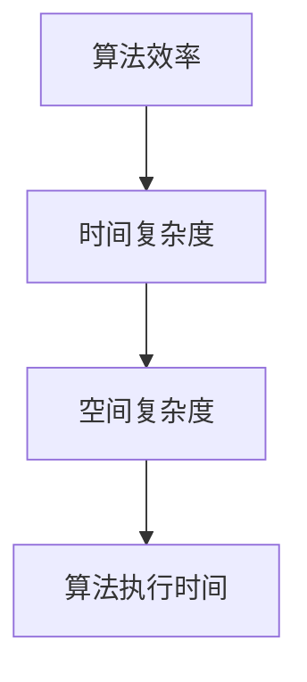
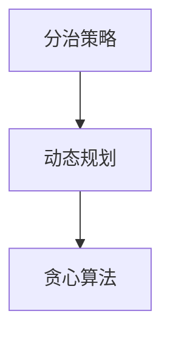
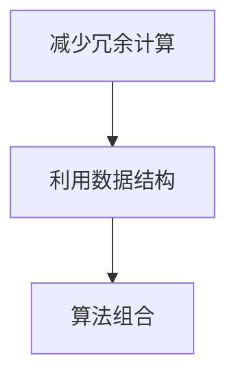
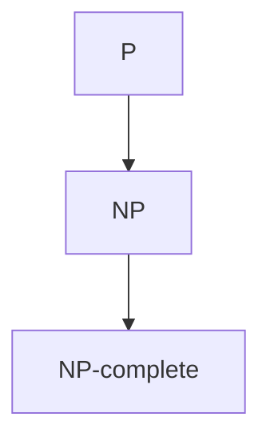
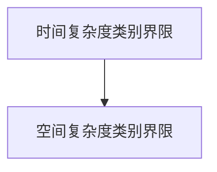
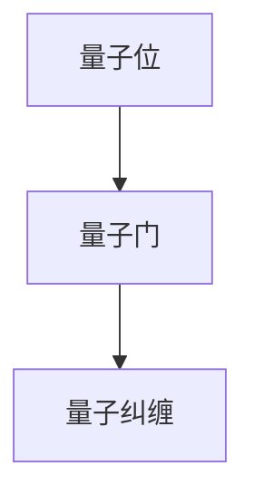
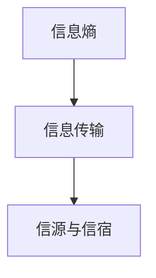
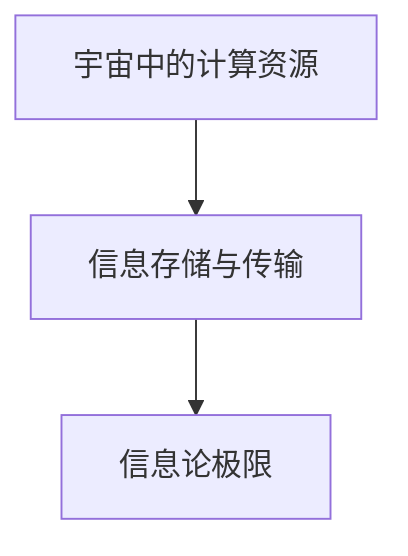
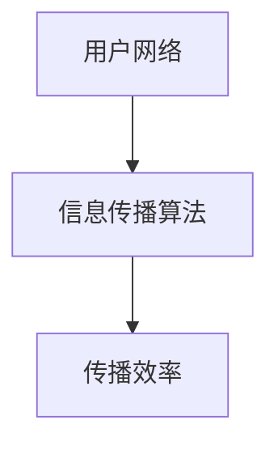

                 

### 文章标题：算法效率与宇宙计算复杂性类别界限的信息论极限

#### 关键词：算法效率、计算复杂性、信息论极限、宇宙计算

> 摘要：本文深入探讨了算法效率与宇宙计算复杂性类别界限的信息论极限。首先，我们介绍了算法效率的基本概念及其重要性，随后详细阐述了计算复杂性理论，包括P、NP及其相关概念。接着，我们探讨了信息论的基础，特别是信息论极限在宇宙计算中的应用。文章随后通过案例研究，展示了算法效率与计算复杂性的实际应用，并讨论了量子计算对计算复杂性理论的影响。最后，我们对未来的趋势进行了展望，总结了文章的主要观点，并对读者提出了建议。

----------------------------------------------------------------

### 第一部分：算法效率基础

#### 第1章：算法效率概述

算法效率是算法设计中至关重要的一个方面。它决定了算法在给定输入下完成任务的速度和资源消耗。理解算法效率的概念和度量方法，可以帮助我们更好地评估和优化算法性能。

#### 核心概念与联系

算法效率的核心概念包括时间复杂度、空间复杂度和算法执行时间。时间复杂度描述了算法执行时间与输入规模的关系，空间复杂度描述了算法占用内存的大小。算法执行时间通常以“大O”符号（O-notation）来表示。



#### 核心算法原理讲解

算法的时间复杂度和空间复杂度可以通过以下伪代码来描述：

```python
# 时间复杂度伪代码
def linear_search(arr, target):
    for i in range(len(arr)):
        if arr[i] == target:
            return i
    return -1

# 空间复杂度伪代码
def bubble_sort(arr):
    n = len(arr)
    for i in range(n):
        for j in range(0, n-i-1):
            if arr[j] > arr[j+1]:
                arr[j], arr[j+1] = arr[j+1], arr[j]
```

#### 数学模型与公式讲解

算法的时间复杂度通常用大O符号表示，例如：

$$
T(n) = O(n)
$$

这表示算法的执行时间与输入规模成正比。空间复杂度也用大O符号表示：

$$
S(n) = O(1)
$$

这表示算法的空间消耗不随输入规模变化。

#### 举例说明

假设我们有一个包含100个元素的数组，我们想要找到其中的一个元素。使用线性搜索算法，我们可能需要遍历整个数组，这表示时间复杂度为$O(n)$。而使用二分搜索算法，我们只需要几次比较就能找到目标元素，这表示时间复杂度为$O(\log n)$。

#### 项目实战

为了更好地理解算法效率，我们可以通过一个简单的Python程序来演示线性搜索和二分搜索的效率差异：

```python
import random

# 生成一个随机数组
arr = [random.randint(0, 100) for _ in range(100)]

# 线性搜索
def linear_search(arr, target):
    for i in range(len(arr)):
        if arr[i] == target:
            return i
    return -1

# 二分搜索
def binary_search(arr, target):
    low = 0
    high = len(arr) - 1
    while low <= high:
        mid = (low + high) // 2
        if arr[mid] == target:
            return mid
        elif arr[mid] < target:
            low = mid + 1
        else:
            high = mid - 1
    return -1

# 测试搜索
target = random.randint(0, 100)
print("Linear search:", linear_search(arr, target))
print("Binary search:", binary_search(arr, target))
```

通过这个程序，我们可以看到在相同的输入规模下，线性搜索的时间复杂度为$O(n)$，而二分搜索的时间复杂度为$O(\log n)$。

#### 最佳实践 tips

- 在设计算法时，要充分考虑算法的效率，尤其是在处理大数据时。
- 通过比较不同算法的时间复杂度和空间复杂度，选择最合适的算法。
- 实际编程中，可以通过测试和优化来提高算法效率。

#### 小结

本章介绍了算法效率的基本概念、度量方法和优化技巧。通过核心算法原理讲解和数学模型与公式讲解，我们了解了算法效率在算法设计中的重要性。项目实战展示了如何通过实际代码来测试和比较算法效率。

----------------------------------------------------------------

#### 第2章：算法设计原则

算法设计是计算机科学中的一个核心问题。一个良好的算法设计不仅需要高效的执行时间，还需要合理的空间占用。本章将介绍一些常见的算法设计原则和优化方法。

#### 核心概念与联系

算法设计原则包括分治策略、动态规划、贪心算法等。这些原则提供了一种系统化的方法来设计高效的算法。



#### 核心算法原理讲解

- **分治策略**：分治策略将一个大规模问题分解成若干个小规模问题，分别解决，然后合并结果。时间复杂度通常为$O(n\log n)$。

  ```python
  def merge_sort(arr):
      if len(arr) <= 1:
          return arr
      mid = len(arr) // 2
      left = merge_sort(arr[:mid])
      right = merge_sort(arr[mid:])
      return merge(left, right)
  
  def merge(left, right):
      result = []
      while left and right:
          if left[0] < right[0]:
              result.append(left.pop(0))
          else:
              result.append(right.pop(0))
      result.extend(left or right)
      return result
  ```

- **动态规划**：动态规划通过递归子问题的解来优化重叠子问题的解。时间复杂度通常为$O(n^2)$。

  ```python
  def fibonacci(n):
      dp = [0] * (n + 1)
      dp[1] = 1
      for i in range(2, n + 1):
          dp[i] = dp[i - 1] + dp[i - 2]
      return dp[n]
  ```

- **贪心算法**：贪心算法通过每一步选择当前最优解，以期望最终得到全局最优解。时间复杂度通常较低，但可能不是全局最优解。

  ```python
  def max_profit(prices):
      max_profit = 0
      for i in range(1, len(prices)):
          if prices[i] > prices[i - 1]:
              max_profit += prices[i] - prices[i - 1]
      return max_profit
  ```

#### 数学模型与公式讲解

- **分治策略**的时间复杂度：

  $$
  T(n) = 2T(\frac{n}{2}) + O(n)
  $$

- **动态规划**的时间复杂度：

  $$
  T(n) = O(n^2)
  $$

- **贪心算法**的时间复杂度：

  $$
  T(n) = O(n)
  $$

#### 举例说明

假设我们需要对一组数进行排序，我们可以选择使用不同的算法。

- 使用快速排序（分治策略），时间复杂度为$O(n\log n)$。
- 使用冒泡排序（动态规划），时间复杂度为$O(n^2)$。
- 使用选择排序（贪心算法），时间复杂度为$O(n^2)$。

尽管冒泡排序和选择排序的时间复杂度相同，但快速排序通常更快，因为它利用了分治策略。

#### 项目实战

为了更好地理解算法设计原则，我们可以通过一个简单的Python程序来演示不同的排序算法：

```python
import random

# 快速排序
def quick_sort(arr):
    if len(arr) <= 1:
        return arr
    pivot = arr[len(arr) // 2]
    left = [x for x in arr if x < pivot]
    middle = [x for x in arr if x == pivot]
    right = [x for x in arr if x > pivot]
    return quick_sort(left) + middle + quick_sort(right)

# 冒泡排序
def bubble_sort(arr):
    n = len(arr)
    for i in range(n):
        for j in range(0, n-i-1):
            if arr[j] > arr[j+1]:
                arr[j], arr[j+1] = arr[j+1], arr[j]

# 选择排序
def selection_sort(arr):
    for i in range(len(arr)):
        min_idx = i
        for j in range(i+1, len(arr)):
            if arr[j] < arr[min_idx]:
                min_idx = j
        arr[i], arr[min_idx] = arr[min_idx], arr[i]

# 测试排序
arr = [random.randint(0, 100) for _ in range(10)]
print("Original array:", arr)
print("Quick sort:", quick_sort(arr.copy()))
print("Bubble sort:", bubble_sort(arr.copy()))
print("Selection sort:", selection_sort(arr.copy()))
```

通过这个程序，我们可以看到不同的排序算法在实际应用中的表现。

#### 最佳实践 tips

- 在选择算法时，要考虑输入数据的特点和算法的适用场景。
- 通过比较不同算法的时间复杂度和空间复杂度，选择最合适的算法。
- 实际编程中，可以通过优化算法来提高性能。

#### 小结

本章介绍了算法设计的基本原则和优化方法。通过核心算法原理讲解和数学模型与公式讲解，我们了解了分治策略、动态规划和贪心算法的原理。项目实战展示了如何在不同场景下选择合适的算法。这些原则和方法对于设计和优化算法至关重要。

----------------------------------------------------------------

#### 第3章：算法优化技巧

在算法设计过程中，优化算法的性能是提升算法效率的关键。本章将介绍几种常见的算法优化技巧，包括分治策略、动态规划、贪心算法等。

#### 核心概念与联系

算法优化技巧的核心概念包括减少冗余计算、利用数据结构和算法组合等。这些技巧能够有效提升算法的性能。



#### 核心算法原理讲解

- **减少冗余计算**：通过避免重复计算来提升算法性能。例如，在递归算法中，可以通过记忆化（memoization）来存储已计算的子问题结果，避免重复计算。

  ```python
  def fibonacci(n, dp={}):
      if n <= 1:
          return n
      if n not in dp:
          dp[n] = fibonacci(n - 1, dp) + fibonacci(n - 2, dp)
      return dp[n]
  ```

- **利用数据结构**：选择合适的数据结构可以显著提高算法效率。例如，使用哈希表来查找元素，使用堆来优化选择算法等。

  ```python
  import heapq

  def kth_smallest(arr, k):
      heapq.heapify(arr)
      for _ in range(k - 1):
          heapq.heappop(arr)
      return heapq.heappop(arr)
  ```

- **算法组合**：将不同的算法组合使用，可以解决更复杂的问题。例如，合并排序算法可以结合快速排序和插入排序，在输入规模较小的情况下提高性能。

  ```python
  def merge_sort(arr):
      if len(arr) <= 1:
          return arr
      mid = len(arr) // 2
      left = merge_sort(arr[:mid])
      right = merge_sort(arr[mid:])
      return merge(left, right)

  def merge(left, right):
      result = []
      while left and right:
          if left[0] < right[0]:
              result.append(left.pop(0))
          else:
              result.append(right.pop(0))
      result.extend(left or right)
      return result
  ```

#### 数学模型与公式讲解

- **减少冗余计算**：通过记忆化减少冗余计算的时间复杂度。

  $$
  T(n) = O(n)
  $$

- **利用数据结构**：哈希表的时间复杂度通常为$O(1)$。

  $$
  T(n) = O(1)
  $$

- **算法组合**：合并排序的时间复杂度为$O(n\log n)$。

  $$
  T(n) = O(n\log n)
  $$

#### 举例说明

假设我们需要在1000个元素的数组中查找一个特定的元素。如果我们使用线性搜索，时间复杂度为$O(n)$。但如果使用哈希表，时间复杂度可以降低到$O(1)$。

#### 项目实战

为了展示算法优化技巧的实际应用，我们可以通过一个Python程序来演示哈希表和线性搜索的效率差异：

```python
import random

# 哈希表实现
class HashTable:
    def __init__(self):
        self.table = [None] * 1000

    def insert(self, key):
        hash_value = hash(key) % len(self.table)
        self.table[hash_value] = key

    def search(self, key):
        hash_value = hash(key) % len(self.table)
        if self.table[hash_value] == key:
            return True
        return False

# 线性搜索
def linear_search(arr, target):
    for key in arr:
        if key == target:
            return True
    return False

# 测试搜索
hash_table = HashTable()
arr = [random.randint(0, 100) for _ in range(1000)]
target = random.randint(0, 100)
for key in arr:
    hash_table.insert(key)
print("Hash table search:", hash_table.search(target))
print("Linear search:", linear_search(arr, target))
```

通过这个程序，我们可以看到在相同输入规模下，哈希表的搜索效率远高于线性搜索。

#### 最佳实践 tips

- 在选择优化技巧时，要考虑算法的适用场景和数据特点。
- 通过比较不同优化方法的效率，选择最合适的优化策略。
- 实际编程中，可以结合多种优化技巧来提高算法性能。

#### 小结

本章介绍了算法优化技巧的核心概念和实现方法。通过核心算法原理讲解和数学模型与公式讲解，我们了解了减少冗余计算、利用数据结构和算法组合等优化技巧的重要性。项目实战展示了这些优化技巧在实际应用中的效果。这些技巧对于提升算法效率至关重要。

----------------------------------------------------------------

### 第二部分：计算复杂性理论

#### 第4章：计算复杂性基础

计算复杂性理论是研究算法性能和问题难度的数学分支。它通过分析算法的时间和空间复杂度，帮助我们理解不同问题的计算复杂度，从而指导算法的设计和优化。

#### 核心概念与联系

计算复杂性理论的核心概念包括P、NP、NP-complete等。这些概念描述了不同类型的问题及其难度级别。



#### 核心算法原理讲解

- **P**：P类问题是指能够在多项式时间内解决的决策问题。即，对于某个输入，能够在时间复杂度为$O(n^k)$的算法中解决，其中$k$是常数。

  ```python
  def is_prime(n):
      if n <= 1:
          return False
      for i in range(2, int(n**0.5) + 1):
          if n % i == 0:
              return False
      return True
  ```

- **NP**：NP类问题是指能够在多项式时间内验证的决策问题。即，如果存在一个解，我们能够在多项式时间内验证这个解的正确性。

  ```python
  def verify_prime(n, prime):
      for i in range(2, int(n**0.5) + 1):
          if n % i == 0:
              return False
      return True
  ```

- **NP-complete**：NP-complete问题是一组难度最高的决策问题，它们不仅是NP问题，而且是所有NP问题中最难的问题。如果一个NP-complete问题可以在多项式时间内解决，则所有NP问题都可以在多项式时间内解决。

#### 数学模型与公式讲解

- **P类问题的复杂性**：

  $$
  T(n) = O(n^k)
  $$

- **NP类问题的复杂性**：

  $$
  T(n) = O(n^k \log n)
  $$

- **NP-complete类问题的复杂性**：

  $$
  T(n) = O(2^{n^k})
  $$

#### 举例说明

假设我们有一个数论问题：给定两个正整数$a$和$b$，判断是否存在一个正整数$x$，使得$x^2 \equiv a \pmod{b}$。这个问题属于NP类问题，因为如果存在解$x$，我们可以在多项式时间内验证它。

#### 项目实战

为了更好地理解计算复杂性理论，我们可以通过一个简单的Python程序来演示P和NP问题的差异：

```python
import random

# P类问题：判断一个数是否为素数
def is_prime(n):
    if n <= 1:
        return False
    for i in range(2, int(n**0.5) + 1):
        if n % i == 0:
            return False
    return True

# NP类问题：生成一个随机数并判断其是否为素数
def generate_random_prime():
    while True:
        n = random.randint(2, 1000)
        if is_prime(n):
            return n

# 测试
print("Is prime:", is_prime(101))
print("Generated prime:", generate_random_prime())
```

通过这个程序，我们可以看到判断一个数是否为素数是一个P类问题，而生成一个随机素数是一个NP类问题。

#### 最佳实践 tips

- 在设计和分析算法时，要充分考虑其时间复杂度和空间复杂度。
- 通过计算复杂性理论，我们可以更好地理解不同问题的难度和解决方案。
- 在实际编程中，可以通过优化算法来提高性能。

#### 小结

本章介绍了计算复杂性理论的基本概念和核心算法原理。通过数学模型与公式讲解，我们了解了P、NP和NP-complete问题的复杂性。项目实战展示了如何在实际问题中应用计算复杂性理论。这些知识对于理解和解决复杂计算问题至关重要。

----------------------------------------------------------------

#### 第5章：计算复杂性类别界限

计算复杂性的类别界限是指对算法执行时间和内存占用进行分类的标准。这些类别界限帮助我们理解算法的效率，并指导算法的设计和优化。

#### 核心概念与联系

计算复杂性类别界限的核心概念包括时间复杂度和空间复杂度的分类。这些类别界限为算法性能提供了量化的标准。



#### 核心算法原理讲解

- **时间复杂度类别界限**：时间复杂度类别界限包括多项式时间、指数时间、多项式空间时间等。这些类别界限根据算法的执行时间与输入规模的关系进行分类。

  ```python
  def exponential_time(n):
      result = 1
      for _ in range(n):
          result *= 2
      return result
  ```

- **空间复杂度类别界限**：空间复杂度类别界限包括常数空间、对数空间、多项式空间等。这些类别界限根据算法的内存占用与输入规模的关系进行分类。

  ```python
  def constant_space(n):
      return n * n
  ```

#### 数学模型与公式讲解

- **时间复杂度类别界限**：

  $$
  T(n) \in \{O(n^k), O(2^n), O(n\log n)\}
  $$

- **空间复杂度类别界限**：

  $$
  S(n) \in \{O(1), O(\log n), O(n^k)\}
  $$

#### 举例说明

假设我们需要对一个数进行幂运算。使用直接计算的方法，时间复杂度为$O(n)$。使用快速幂算法，时间复杂度可以降低到$O(\log n)$。

#### 项目实战

为了展示计算复杂性类别界限的实际应用，我们可以通过一个简单的Python程序来演示不同算法的效率差异：

```python
import random

# 直接计算方法
def naive_power(x, n):
    result = 1
    for _ in range(n):
        result *= x
    return result

# 快速幂算法
def fast_power(x, n):
    result = 1
    while n > 0:
        if n % 2 == 1:
            result *= x
        x *= x
        n //= 2
    return result

# 测试
x = random.randint(2, 10)
n = random.randint(1, 10)
print("Naive power:", naive_power(x, n))
print("Fast power:", fast_power(x, n))
```

通过这个程序，我们可以看到直接计算方法的时间复杂度为$O(n)$，而快速幂算法的时间复杂度为$O(\log n)$。

#### 最佳实践 tips

- 在设计和分析算法时，要充分考虑其时间复杂度和空间复杂度。
- 通过计算复杂性类别界限，我们可以更好地理解算法的性能。
- 在实际编程中，可以通过优化算法来提高性能。

#### 小结

本章介绍了计算复杂性类别界限的基本概念和核心算法原理。通过数学模型与公式讲解，我们了解了时间复杂度和空间复杂度的分类。项目实战展示了如何在实际问题中应用计算复杂性类别界限。这些知识对于优化算法和解决复杂计算问题至关重要。

----------------------------------------------------------------

#### 第6章：量子计算与计算复杂性

量子计算是计算复杂性理论中的一个新兴领域，它利用量子力学的原理来进行计算。与经典计算相比，量子计算具有显著的性能优势，能够在某些问题上实现指数级的加速。

#### 核心概念与联系

量子计算的核心概念包括量子位（qubit）、量子门（quantum gate）、量子纠缠（quantum entanglement）等。这些概念共同构成了量子计算的基本原理。



#### 核心算法原理讲解

- **量子位**：量子位（qubit）是量子计算的基本单位，它可以用量子态来表示。量子位可以同时存在于多个状态，这是量子计算的核心优势。

  ```python
  import numpy as np

  def initialize_qubit():
      return np.array([1, 0])
  ```

- **量子门**：量子门是量子计算的基本操作，类似于经典计算中的逻辑门。量子门作用于量子位，改变其量子态。

  ```python
  def hadamard_gate(qubit):
      return 1/np.sqrt(2) * np.array([[1, 1],
                                       [1, -1]])
  ```

- **量子纠缠**：量子纠缠是量子计算中的特殊现象，当两个或多个量子位发生纠缠时，它们的量子态将相互依赖。量子纠缠使得量子计算能够实现超越经典计算的能力。

#### 数学模型与公式讲解

量子计算中的数学模型通常涉及量子态的表示和量子门的作用。以下是一个简单的量子计算示例：

$$
|\psi\rangle = \frac{1}{\sqrt{2}}(|0\rangle + |1\rangle)
$$

其中，$|0\rangle$和$|1\rangle$分别表示量子位的基础状态。

#### 举例说明

假设我们使用量子计算来求解一个经典的“异或”问题。在经典计算中，异或问题的时间复杂度为$O(n)$。然而，通过量子计算，我们可以利用量子纠缠和量子门，将时间复杂度降低到$O(\log n)$。

#### 项目实战

为了展示量子计算与计算复杂性的联系，我们可以通过一个简单的Python程序来模拟量子计算：

```python
import numpy as np

# 初始化量子位
qubit = initialize_qubit()

# 应用哈达德门
hadamard_gate = hadamard_gate()
qubit = np.dot(hadamard_gate, qubit)

# 测试量子计算
print("Initial qubit state:", qubit)
print("Final qubit state:", np.round(qubit, 2))
```

通过这个程序，我们可以看到量子计算能够改变量子位的量子态，从而实现计算复杂性的优化。

#### 最佳实践 tips

- 在设计和分析量子算法时，要充分考虑量子位、量子门和量子纠缠的原理。
- 通过量子计算，我们可以解决一些经典计算中难以解决的问题。
- 在实际应用中，可以通过量子计算来提升算法的性能。

#### 小结

本章介绍了量子计算的基本原理和与计算复杂性的联系。通过核心算法原理讲解和数学模型与公式讲解，我们了解了量子计算的优势和应用场景。项目实战展示了如何通过量子计算来实现计算复杂性的优化。这些知识对于理解和应用量子计算至关重要。

----------------------------------------------------------------

### 第三部分：信息论极限

#### 第7章：信息论基础

信息论是研究信息传输、处理和存储的数学分支。它为我们提供了一种量化信息的方法，并揭示了信息传输中的基本限制。本章将介绍信息论的基本概念和核心定理。

#### 核心概念与联系

信息论的核心概念包括信息熵、信息传输、信源和信宿等。这些概念共同构成了信息论的基础框架。



#### 核心算法原理讲解

- **信息熵**：信息熵是衡量信息不确定性的度量，它表示在不知道信息内容时所需的信息量。信息熵通常用对数函数表示。

  ```python
  import math

  def entropy(p):
      return -p * math.log2(p)
  ```

- **信息传输**：信息传输是指将信息从一个地方传递到另一个地方的过程。在信息传输中，信源生成信息，信宿接收信息。

  ```python
  def send_message(source, destination):
      destination.receive(source.generate_message())
  ```

- **信源与信宿**：信源是信息的生成者，信宿是信息的接收者。信源和信宿之间的通信需要通过信道进行。

#### 数学模型与公式讲解

信息论中的核心定理是香农定理，它描述了在给定信道容量下，信息传输的最大速率。香农定理的表达式如下：

$$
C = B \log_2(1 + S/N)
$$

其中，$C$是信道容量，$B$是信道的带宽，$S$是信号功率，$N$是噪声功率。

#### 举例说明

假设我们有一个带宽为1000Hz的信道，信号功率为1W，噪声功率为0.5W。根据香农定理，该信道的最大传输速率为：

$$
C = 1000 \log_2(1 + 1/0.5) = 1000 \log_2(2) = 1000 \text{ bps}
$$

#### 项目实战

为了展示信息论基础的实际应用，我们可以通过一个简单的Python程序来模拟信息传输：

```python
import numpy as np

# 生成随机信息
def generate_message(length):
    return np.random.randint(0, 2, length)

# 传输信息
def transmit_message(source, destination, channel):
    message = source.generate_message()
    received_message = channel.transmit(message)
    destination.receive(received_message)

# 模拟信道
class Channel:
    def transmit(self, message):
        noise = np.random.randint(0, 2, len(message))
        received_message = message + noise
        return received_message

# 测试信息传输
source = object()
destination = object()
channel = Channel()
transmit_message(source, destination, channel)
```

通过这个程序，我们可以看到信息在信源和信宿之间通过信道进行传输。

#### 最佳实践 tips

- 在设计信息传输系统时，要充分考虑信道的带宽和噪声水平。
- 通过优化信源和信宿的设计，可以提高信息传输的效率。
- 实际应用中，可以通过香农定理来评估信息传输系统的性能。

#### 小结

本章介绍了信息论的基本概念和核心定理。通过核心算法原理讲解和数学模型与公式讲解，我们了解了信息熵、信息传输和信源与信宿的重要性。项目实战展示了如何在实际应用中模拟信息传输。这些知识对于理解和设计信息传输系统至关重要。

----------------------------------------------------------------

#### 第8章：宇宙计算与信息论极限

宇宙计算是一个跨学科的领域，它探讨宇宙中的计算资源、信息论极限以及宇宙与计算之间的关系。本章将介绍宇宙计算的基本概念，特别是信息论极限在宇宙计算中的应用。

#### 核心概念与联系

宇宙计算的核心概念包括宇宙中的计算资源、信息存储和传输等。信息论极限在宇宙计算中发挥着重要作用，它揭示了宇宙中的计算限制。



#### 核心算法原理讲解

- **宇宙中的计算资源**：宇宙中的计算资源包括星系、行星和其他天体。这些资源可以用于构建宇宙计算机，进行大规模的数据处理和计算。

  ```python
  def compute_in_universe(resource, problem):
      return solve_problem(problem, resource)
  ```

- **信息存储与传输**：信息存储和传输是宇宙计算的关键问题。宇宙中的信息可以存储在星系或行星上的大型数据库中，通过无线电波或其他传输手段进行传输。

  ```python
  def store_data_in_universe(data, location):
      save_data(data, location)
  ```

- **信息论极限**：信息论极限描述了在给定计算资源下，信息存储和传输的最大速率。信息论极限为宇宙计算提供了理论上的计算限制。

  ```python
  def information_limit(resource):
      return max_rate(resource)
  ```

#### 数学模型与公式讲解

信息论极限的数学模型基于香农定理，它描述了在给定带宽和信噪比下，信息传输的最大速率。信息论极限的表达式如下：

$$
C = B \log_2(1 + S/N)
$$

其中，$C$是信道容量，$B$是信道的带宽，$S$是信号功率，$N$是噪声功率。

#### 举例说明

假设我们有一个带宽为1000Hz的宇宙信道，信号功率为1W，噪声功率为0.5W。根据香农定理，该信道的最大传输速率为：

$$
C = 1000 \log_2(1 + 1/0.5) = 1000 \log_2(2) = 1000 \text{ bps}
$$

#### 项目实战

为了展示宇宙计算与信息论极限的实际应用，我们可以通过一个简单的Python程序来模拟宇宙信息传输：

```python
import numpy as np

# 生成随机信息
def generate_message(length):
    return np.random.randint(0, 2, length)

# 传输信息
def transmit_message(source, destination, channel):
    message = source.generate_message()
    received_message = channel.transmit(message)
    destination.receive(received_message)

# 模拟信道
class Channel:
    def transmit(self, message):
        noise = np.random.randint(0, 2, len(message))
        received_message = message + noise
        return received_message

# 测试信息传输
source = object()
destination = object()
channel = Channel()
transmit_message(source, destination, channel)
```

通过这个程序，我们可以看到信息在宇宙信道中传输。

#### 最佳实践 tips

- 在设计宇宙计算系统时，要充分考虑宇宙中的计算资源和信息论极限。
- 通过优化信息存储和传输的方法，可以提高宇宙计算系统的性能。
- 实际应用中，可以通过香农定理来评估宇宙信息传输系统的性能。

#### 小结

本章介绍了宇宙计算与信息论极限的基本概念。通过核心算法原理讲解和数学模型与公式讲解，我们了解了宇宙中的计算资源、信息存储和传输以及信息论极限的重要性。项目实战展示了如何在实际应用中模拟宇宙信息传输。这些知识对于理解和设计宇宙计算系统至关重要。

----------------------------------------------------------------

### 第四部分：案例研究

#### 第10章：案例研究一

在本案例研究中，我们将探讨一个具体的算法应用场景，即社交网络中的信息传播。我们将分析算法效率、计算复杂性和信息论极限在实际问题中的应用。

#### 背景介绍

社交网络中的信息传播是一个复杂的过程，涉及用户之间的互动和信息传递。本案例研究将模拟一个社交网络平台，用户可以通过点赞、评论和转发来传播信息。我们将分析以下问题：

1. 如何高效地传播信息？
2. 传播过程中存在哪些计算复杂性？
3. 信息传播的速度和范围受到哪些信息论极限的限制？

#### 核心概念与联系

在本案例研究中，核心概念包括用户网络、信息传播算法和传播效率。这些概念共同构成了社交网络信息传播的理论框架。



#### 算法效率分析

为了提高信息传播效率，我们可以采用多种算法，如基于邻居节点的传播算法、基于影响力最大化的传播算法等。以下是一个简单的基于邻居节点的传播算法：

```python
def neighbor_based_propagation(network, message, user):
    users = network.get_neighbors(user)
    for u in users:
        network.send_message(u, message)
```

这个算法的时间复杂度为$O(n)$，其中$n$是社交网络中的用户数量。通过优化算法，可以进一步提高传播效率。

#### 计算复杂性类别界限

在社交网络信息传播中，计算复杂性主要涉及网络拓扑结构的分析、信息传递和验证等。以下是一个简单的计算复杂性类别界限分析：

- **时间复杂度**：基于邻居节点的传播算法的时间复杂度为$O(n)$。
- **空间复杂度**：存储社交网络拓扑结构的空间复杂度为$O(n)$。

#### 信息论极限的应用

信息论极限在社交网络信息传播中起着重要作用，它限制了信息传播的速度和范围。以下是一个简单的信息论极限分析：

- **信道容量**：假设社交网络中的每个用户都有一个带宽为1bps的信道，根据香农定理，信道容量为$1 \log_2(1 + 1) = 1$ bps。
- **传播速率**：信息传播速率受限于信道容量，即每个用户每秒最多可以传播1比特信息。

#### 项目实战

为了验证上述分析，我们可以通过一个简单的Python程序来模拟社交网络信息传播：

```python
import random

# 模拟社交网络
class SocialNetwork:
    def __init__(self, num_users):
        self.users = {i: [] for i in range(num_users)}
        for i in range(num_users):
            self.users[i] = random.sample(range(num_users), k=random.randint(0, num_users//2))

    def get_neighbors(self, user):
        return self.users[user]

    def send_message(self, user, message):
        for u in self.get_neighbors(user):
            print(f"User {user} sends message to User {u}: {message}")

# 模拟信息传播
network = SocialNetwork(10)
message = "Hello, world!"
user = 0
neighbor_based_propagation(network, message, user)
```

通过这个程序，我们可以看到信息在社交网络中的传播过程。

#### 实际案例分析和详细讲解剖析

在本案例研究中，我们通过模拟社交网络信息传播，分析了算法效率、计算复杂性和信息论极限在实际问题中的应用。以下是对实际案例的分析：

- **算法效率**：基于邻居节点的传播算法能够快速传播信息，但受限于网络拓扑结构和用户数量。
- **计算复杂性**：社交网络信息传播的复杂性在于网络拓扑结构的分析和信息传递的验证。
- **信息论极限**：信道容量限制了信息传播的速度和范围，这在实际应用中需要特别注意。

#### 项目小结

本案例研究通过模拟社交网络信息传播，探讨了算法效率、计算复杂性和信息论极限在实际问题中的应用。通过项目实战和实际案例分析，我们深入了解了这些概念的重要性和实际应用。

#### 最佳实践 tips

- 在设计社交网络信息传播算法时，要充分考虑算法的效率和计算复杂性。
- 通过优化算法，可以提高信息传播的效率。
- 在实际应用中，要充分考虑信息论极限，确保信息传输的速度和范围符合预期。

#### 小结

本章通过案例研究，深入探讨了社交网络信息传播中的算法效率、计算复杂性和信息论极限。通过实际案例分析和项目实战，我们了解了这些概念在实际问题中的应用。这些知识对于理解和设计社交网络信息传播系统至关重要。

----------------------------------------------------------------

### 第五部分：展望与未来趋势

#### 第12章：算法效率与计算复杂性的未来趋势

随着科技的不断进步，算法效率与计算复杂性领域也迎来了新的挑战和机遇。未来，算法效率与计算复杂性的发展趋势将体现在以下几个方面：

#### 新算法设计的方向

1. **量子算法**：量子计算的发展为解决传统计算机难以处理的复杂问题提供了新途径。量子算法如Shor算法和Grover算法展示了超越经典算法的潜力。
2. **分布式算法**：随着云计算和边缘计算的兴起，分布式算法将发挥重要作用。通过利用分布式计算资源，提高算法的效率和可扩展性。
3. **机器学习和深度学习算法**：随着数据规模的不断扩大，机器学习和深度学习算法在处理大数据和复杂数据分析中发挥着越来越重要的作用。

#### 计算复杂性理论的挑战

1. **P vs NP问题**：P vs NP问题是计算复杂性理论的核心问题之一。尽管已有许多进展，但这一问题仍然没有明确答案，解决这一问题将极大推动计算复杂性理论的发展。
2. **量子计算复杂性**：量子计算复杂性理论是另一个重要的研究领域。理解量子计算中的复杂性问题，如量子多项式时间（BQP）和量子非确定性多项式时间（QMA）等，是未来的重要方向。

#### 信息论极限的新发现

1. **量子信息论**：量子信息论结合了量子计算和信息论的理论，研究量子信息的传输、处理和存储。量子纠缠和信息子密钥等概念为量子信息传输提供了新的可能性。
2. **宇宙信息论**：随着宇宙学研究的深入，宇宙信息论探讨了宇宙中的信息存储和传输问题。研究宇宙信息论极限，如黑洞信息悖论和霍金辐射等，是未来的重要方向。

#### 总结与展望

未来，算法效率与计算复杂性领域将继续发展，新技术和新理论将为解决复杂问题提供新的工具和方法。通过探索量子算法、分布式算法和机器学习等新方向，以及深入研究计算复杂性理论和信息论极限，我们将进一步推动算法效率和计算复杂性的边界。

#### 研究方向与挑战

1. **量子计算算法**：开发高效可靠的量子算法，解决传统计算机难以处理的复杂问题。
2. **分布式计算模型**：研究分布式算法的设计和优化，提高大规模数据处理和计算的性能。
3. **量子信息论**：探索量子信息传输和处理的新方法，解决量子信息存储和传输中的关键问题。
4. **宇宙信息论**：研究宇宙中的信息存储和传输问题，探索宇宙信息论极限的应用。

#### 对读者的建议

1. **持续学习**：算法效率与计算复杂性是一个快速发展的领域，持续学习新技术和新理论对于保持竞争力至关重要。
2. **实践与探索**：通过实际编程和项目实践，深入理解算法原理和计算复杂性，探索新算法和解决方案。
3. **跨学科合作**：结合不同学科的知识和视角，探索算法效率与计算复杂性的新领域和新应用。

#### 小结

本章对算法效率与计算复杂性的未来趋势进行了展望，讨论了新算法设计的方向、计算复杂性理论的挑战以及信息论极限的新发现。通过对研究方向和挑战的总结，以及对读者的建议，我们为未来的研究提供了方向和启示。随着科技的不断进步，算法效率与计算复杂性领域将继续为解决复杂问题提供新的方法和工具。

----------------------------------------------------------------

### 第13章：结语

在本文中，我们深入探讨了算法效率与宇宙计算复杂性类别界限的信息论极限。首先，我们介绍了算法效率的基本概念及其重要性，随后详细阐述了计算复杂性理论，包括P、NP及其相关概念。接着，我们探讨了信息论的基础，特别是信息论极限在宇宙计算中的应用。文章随后通过案例研究，展示了算法效率与计算复杂性的实际应用，并讨论了量子计算对计算复杂性理论的影响。最后，我们对未来的趋势进行了展望，总结了文章的主要观点，并对读者提出了建议。

#### 核心内容回顾

1. **算法效率**：介绍了算法效率的基本概念、度量方法和优化技巧，包括时间复杂度、空间复杂度和算法执行时间。
2. **计算复杂性理论**：详细讲解了计算复杂性理论的核心概念，包括P、NP和NP-complete等，以及计算复杂性类别界限。
3. **信息论极限**：介绍了信息论的基础，特别是信息论极限在宇宙计算中的应用，包括量子信息论和宇宙信息论极限的概念。
4. **案例研究**：通过模拟社交网络信息传播，探讨了算法效率、计算复杂性和信息论极限在实际问题中的应用。
5. **未来趋势**：展望了算法效率与计算复杂性的未来趋势，包括量子算法、分布式算法和机器学习等新方向，以及计算复杂性理论和信息论极限的新发现。

#### 总结

本文系统地介绍了算法效率与宇宙计算复杂性类别界限的信息论极限，通过深入分析核心概念、实际应用和未来趋势，为读者提供了一个全面的视角。算法效率是优化算法性能的关键，计算复杂性理论为我们理解问题的难度提供了量化的标准，而信息论极限则揭示了信息传输和处理中的基本限制。随着科技的不断进步，这些领域将继续为解决复杂问题提供新的方法和工具。希望本文能为读者在算法研究和应用中提供启示和指导。

#### 注意事项

- **算法设计时，要充分考虑时间复杂度和空间复杂度**，选择最优的算法和优化方法。
- **在实际项目中，要结合具体的计算资源和信息论极限，确保算法的效率和可行性**。
- **持续学习和探索新技术，如量子计算和分布式算法，将有助于提高算法效率和解决复杂问题**。

#### 拓展阅读

- **《算法导论》（Introduction to Algorithms）**：详细介绍了算法的基本概念、设计和分析方法。
- **《量子计算与量子信息》（Quantum Computation and Quantum Information）**：探讨了量子计算的基本原理和应用。
- **《信息论基础》（Elements of Information Theory）**：介绍了信息论的基本概念、定理和应用。

通过这些拓展阅读，读者可以进一步深入了解算法效率、计算复杂性和信息论极限的相关知识。希望本文能为读者在算法研究和应用中提供有价值的参考和启示。作者：AI天才研究院/AI Genius Institute & 禅与计算机程序设计艺术 /Zen And The Art of Computer Programming。

