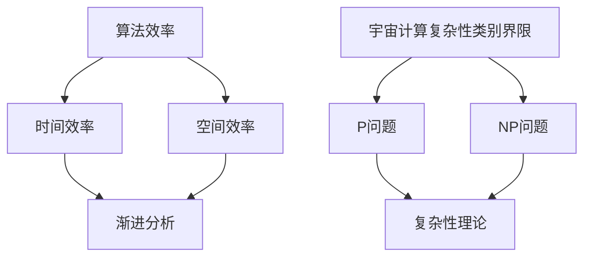

                 

### 文章标题

《算法效率与宇宙计算复杂性类别界限的比较》

---

**关键词：** 算法效率、宇宙计算复杂性、类别界限、P问题、NP问题、渐进分析、算法优化

---

**摘要：** 本文深入探讨了算法效率与宇宙计算复杂性类别界限之间的关系。通过对算法效率的基本概念、影响因素、评估方法进行详细解析，同时介绍宇宙计算复杂性的基本概念、类别界限以及研究方法，本文旨在揭示两者之间的内在联系，并探讨未来研究方向。通过对P与NP问题、NPC问题的讨论，本文进一步阐述了算法效率与宇宙计算复杂性类别界限的实际意义，为算法设计和优化提供了理论指导和实践启示。

---

### 核心概念与联系

在探讨算法效率与宇宙计算复杂性类别界限的比较之前，我们首先需要明确这两个核心概念及其相互之间的联系。

#### 算法效率

算法效率是指在给定输入规模下，执行某个算法所需要的计算资源（如时间、空间等）的效率。算法效率是计算机科学和实际应用中至关重要的一环，因为它直接影响算法的运行速度和资源消耗。

##### 时间效率

时间效率指的是算法执行所需的时间。在计算机科学中，我们通常使用渐进时间复杂度来衡量算法的时间效率。渐进时间复杂度分析是一种方法，通过分析算法的时间复杂度函数，可以预测算法在不同输入规模下的性能表现。

##### 空间效率

空间效率指的是算法执行所需的空间资源。同样地，我们使用渐进空间复杂度来衡量算法的空间效率。空间复杂度分析可以帮助我们了解算法在处理不同规模输入时所需的空间资源。

##### 算法复杂度

算法复杂度是衡量算法效率的量化指标，通常分为时间复杂度和空间复杂度。时间复杂度描述了算法执行时间随输入规模增长的趋势，而空间复杂度描述了算法所需内存空间随输入规模增长的趋势。

#### 宇宙计算复杂性类别界限

宇宙计算复杂性是计算理论中的一个分支，研究在极端条件下算法的效率和复杂性。宇宙计算复杂性类别界限指的是不同算法类别在性能上的差异，这些差异通常由理论模型和数学工具来量化。

##### 基本概念

宇宙计算复杂性研究涉及到的基本概念包括计算模型、资源限制、算法效率等。计算模型是指用于描述计算过程的抽象模型，常见的计算模型包括图灵机、随机访问存储机（RAM）等。资源限制是指在计算过程中对计算资源（如时间、空间）的约束。算法效率是指算法在特定计算模型和资源限制下的性能。

##### 类别界限

宇宙计算复杂性类别界限是指在不同计算模型和资源限制下，算法性能的差异。这些差异通常通过理论模型和数学工具来量化。例如，P问题与NP问题之间的类别界限是宇宙计算复杂性研究的一个重要问题。P问题是指能在多项式时间内解决的问题，而NP问题是指能在多项式时间内验证解决方案的问题。NPC（NP完全）问题是指能够被转化为NP问题的特殊问题。

#### 算法效率与宇宙计算复杂性类别界限的联系

算法效率与宇宙计算复杂性类别界限之间存在密切的联系。算法效率的提高可以在某些情况下突破宇宙计算复杂性类别界限，从而实现更高效的计算。另一方面，了解宇宙计算复杂性类别界限可以帮助我们更好地设计高效的算法，以应对复杂计算任务。

##### 算法效率对宇宙计算复杂性类别界限的影响

算法效率的提高可以在一定程度上突破宇宙计算复杂性类别界限。例如，通过优化算法，可以在多项式时间内解决原本需要指数时间解决的问题。这种优化可能涉及到算法的设计、实现以及算法复杂度的分析等方面。

##### 宇宙计算复杂性类别界限对算法效率的指导意义

了解宇宙计算复杂性类别界限可以帮助我们更好地设计高效的算法。例如，在处理P问题与NP问题之间的界限时，我们可以根据问题的性质选择合适的算法，以实现更高的效率。此外，宇宙计算复杂性类别界限还可以指导我们在实际应用中优化算法，提高计算效率。

##### Mermaid 流程图

下面是一个Mermaid流程图，展示了算法效率与宇宙计算复杂性类别界限之间的联系：



通过这个流程图，我们可以更直观地理解算法效率与宇宙计算复杂性类别界限之间的相互关系。接下来，我们将进一步探讨算法效率与宇宙计算复杂性类别界限的具体内容，以及它们在实际应用中的意义。

### 第1章：算法效率与宇宙计算复杂性类别界限概述

#### 1.1 算法效率概念解析

算法效率是指执行某个算法所需要的计算资源（如时间、空间等）的效率。在计算机科学中，算法效率是评估算法优劣的重要指标之一。高效的算法可以节省计算资源，提高系统性能，因此在实际应用中具有非常重要的意义。

##### 算法效率的定义与重要性

算法效率的定义是指在给定输入规模下，执行某个算法所需要的计算资源（如时间、空间等）的度量。具体来说，算法效率可以从以下几个方面进行衡量：

1. **时间效率**：算法执行所需的时间。通常使用时间复杂度来表示，时间复杂度是指算法执行时间随输入规模增长的趋势。

2. **空间效率**：算法执行所需的空间资源。通常使用空间复杂度来表示，空间复杂度是指算法所需内存空间随输入规模增长的趋势。

3. **资源效率**：综合考虑时间效率和空间效率，通常用于评估算法的整体效率。

算法效率的重要性体现在以下几个方面：

1. **计算资源的节省**：高效的算法可以减少计算所需的时间和空间，从而节省计算资源。

2. **系统性能的提升**：高效的算法可以提高系统的响应速度和处理能力，从而提升系统性能。

3. **可扩展性**：高效的算法具有更好的可扩展性，可以应对更大规模的输入数据，从而适应不断增长的计算需求。

##### 算法效率的影响因素

算法效率的影响因素主要包括以下两个方面：

1. **算法设计**：算法的设计直接影响其效率。一个设计良好的算法可以具有较低的时间复杂度和空间复杂度，从而提高算法效率。

2. **数据结构和实现**：数据结构和实现方式也会影响算法的效率。合理选择数据结构和优化实现方式可以降低算法的复杂度，从而提高算法效率。

##### 常见的算法效率评估方法

评估算法效率的方法可以分为两类：渐进分析和实际运行测试。

1. **渐进分析**：渐进分析是评估算法效率的一种重要方法。通过分析算法的时间复杂度和空间复杂度，可以预测算法在不同输入规模下的性能表现。渐进分析通常基于数学模型和假设，可以提供理论上的性能评估。

2. **实际运行测试**：实际运行测试是评估算法效率的一种直观方法。通过在实际计算环境中运行算法，可以测量算法的实际运行时间和空间消耗。实际运行测试可以提供具体的性能数据，从而更准确地评估算法的效率。

在实际应用中，渐进分析和实际运行测试往往结合使用，以获得更全面的性能评估。

#### 1.2 宇宙计算复杂性类别界限

宇宙计算复杂性是计算理论中的一个分支，研究在极端条件下算法的效率和复杂性。宇宙计算复杂性类别界限是指在不同计算模型和资源限制下，算法性能的差异。

##### 基本概念

宇宙计算复杂性研究涉及的基本概念包括计算模型、资源限制和算法效率。计算模型是指用于描述计算过程的抽象模型，常见的计算模型包括图灵机、随机访问存储机（RAM）等。资源限制是指在计算过程中对计算资源（如时间、空间）的约束。算法效率是指算法在特定计算模型和资源限制下的性能。

##### 类别界限

宇宙计算复杂性类别界限是指在不同计算模型和资源限制下，算法性能的差异。这些差异通常通过理论模型和数学工具来量化。例如，P问题与NP问题之间的类别界限是宇宙计算复杂性研究的一个重要问题。P问题是指能在多项式时间内解决的问题，而NP问题是指能在多项式时间内验证解决方案的问题。NPC（NP完全）问题是指能够被转化为NP问题的特殊问题。

##### 常见的宇宙计算复杂性类别界限

在宇宙计算复杂性研究中，常见的类别界限包括：

1. **P问题与NP问题**：P问题是指能在多项式时间内解决的问题，而NP问题是指能在多项式时间内验证解决方案的问题。P与NP问题之间的类别界限是计算复杂性理论中的一个基本问题。

2. **NPC问题**：NPC（NP完全）问题是指能够被转化为NP问题的特殊问题。NPC问题在宇宙计算复杂性类别界限中具有重要地位，因为解决NPC问题通常需要指数级时间。

3. **PSPACE问题**：PSPACE问题是指能在多项式空间时间内解决的问题。PSPACE问题包含了P问题，但P问题不一定包含PSPACE问题。

4. **EXPTIME问题**：EXPTIME问题是指能在指数时间内解决的问题。EXPTIME问题是宇宙计算复杂性类别界限中的一个重要问题，因为指数级时间通常被认为是计算资源消耗的极限。

#### 1.3 算法效率与宇宙计算复杂性类别界限的联系

算法效率与宇宙计算复杂性类别界限之间存在密切的联系。算法效率的提高可以在某些情况下突破宇宙计算复杂性类别界限，从而实现更高效的计算。另一方面，了解宇宙计算复杂性类别界限可以帮助我们更好地设计高效的算法，以应对复杂计算任务。

##### 算法效率对宇宙计算复杂性类别界限的影响

算法效率的提高可以在一定程度上突破宇宙计算复杂性类别界限。例如，通过优化算法，可以在多项式时间内解决原本需要指数时间解决的问题。这种优化可能涉及到算法的设计、实现以及算法复杂度的分析等方面。

例如，在排序算法中，传统的冒泡排序算法的时间复杂度为O(n^2)，而优化的快速排序算法的时间复杂度可以达到O(nlogn)。这种优化使得快速排序算法在处理大规模数据时具有更高的效率，突破了传统的O(n^2)复杂度界限。

##### 宇宙计算复杂性类别界限对算法效率的指导意义

了解宇宙计算复杂性类别界限可以帮助我们更好地设计高效的算法。例如，在处理P问题与NP问题之间的界限时，我们可以根据问题的性质选择合适的算法，以实现更高的效率。

例如，对于P问题，我们可以选择具有较低时间复杂度的算法，如线性时间排序算法。而对于NP问题，我们可以选择具有较低空间复杂度的算法，如基于贪心策略的算法。

此外，宇宙计算复杂性类别界限还可以指导我们在实际应用中优化算法，提高计算效率。例如，在处理大数据时，我们可以选择适合大规模数据处理的高效算法，如分布式计算框架。

##### Mermaid 流程图

下面是一个Mermaid流程图，展示了算法效率与宇宙计算复杂性类别界限之间的联系：


通过这个流程图，我们可以更直观地理解算法效率与宇宙计算复杂性类别界限之间的相互关系。接下来，我们将进一步探讨算法效率与宇宙计算复杂性类别界限的具体内容，以及它们在实际应用中的意义。

---

### 第1章：算法效率与宇宙计算复杂性类别界限概述

#### 1.1 算法效率概念解析

算法效率是指在给定输入规模下，执行某个算法所需要的计算资源（如时间、空间等）的效率。算法效率是计算机科学和实际应用中至关重要的一环，因为它直接影响算法的运行速度和资源消耗。

##### 算法效率的定义与重要性

算法效率的定义是指在给定输入规模下，执行某个算法所需要的计算资源（如时间、空间等）的度量。具体来说，算法效率可以从以下几个方面进行衡量：

1. **时间效率**：算法执行所需的时间。通常使用时间复杂度来表示，时间复杂度是指算法执行时间随输入规模增长的趋势。

2. **空间效率**：算法执行所需的空间资源。通常使用空间复杂度来表示，空间复杂度是指算法所需内存空间随输入规模增长的趋势。

3. **资源效率**：综合考虑时间效率和空间效率，通常用于评估算法的整体效率。

算法效率的重要性体现在以下几个方面：

1. **计算资源的节省**：高效的算法可以减少计算所需的时间和空间，从而节省计算资源。

2. **系统性能的提升**：高效的算法可以提高系统的响应速度和处理能力，从而提升系统性能。

3. **可扩展性**：高效的算法具有更好的可扩展性，可以应对更大规模的输入数据，从而适应不断增长的计算需求。

##### 算法效率的影响因素

算法效率的影响因素主要包括以下两个方面：

1. **算法设计**：算法的设计直接影响其效率。一个设计良好的算法可以具有较低的时间复杂度和空间复杂度，从而提高算法效率。

2. **数据结构和实现**：数据结构和实现方式也会影响算法的效率。合理选择数据结构和优化实现方式可以降低算法的复杂度，从而提高算法效率。

##### 常见的算法效率评估方法

评估算法效率的方法可以分为两类：渐进分析和实际运行测试。

1. **渐进分析**：渐进分析是评估算法效率的一种重要方法。通过分析算法的时间复杂度和空间复杂度，可以预测算法在不同输入规模下的性能表现。渐进分析通常基于数学模型和假设，可以提供理论上的性能评估。

2. **实际运行测试**：实际运行测试是评估算法效率的一种直观方法。通过在实际计算环境中运行算法，可以测量算法的实际运行时间和空间消耗。实际运行测试可以提供具体的性能数据，从而更准确地评估算法的效率。

在实际应用中，渐进分析和实际运行测试往往结合使用，以获得更全面的性能评估。

#### 1.2 宇宙计算复杂性类别界限

宇宙计算复杂性是计算理论中的一个分支，研究在极端条件下算法的效率和复杂性。宇宙计算复杂性类别界限是指在不同计算模型和资源限制下，算法性能的差异。

##### 基本概念

宇宙计算复杂性研究涉及的基本概念包括计算模型、资源限制和算法效率。计算模型是指用于描述计算过程的抽象模型，常见的计算模型包括图灵机、随机访问存储机（RAM）等。资源限制是指在计算过程中对计算资源（如时间、空间）的约束。算法效率是指算法在特定计算模型和资源限制下的性能。

##### 类别界限

宇宙计算复杂性类别界限是指在不同计算模型和资源限制下，算法性能的差异。这些差异通常通过理论模型和数学工具来量化。例如，P问题与NP问题之间的类别界限是宇宙计算复杂性研究的一个重要问题。P问题是指能在多项式时间内解决的问题，而NP问题是指能在多项式时间内验证解决方案的问题。NPC（NP完全）问题是指能够被转化为NP问题的特殊问题。

##### 常见的宇宙计算复杂性类别界限

在宇宙计算复杂性研究中，常见的类别界限包括：

1. **P问题与NP问题**：P问题是指能在多项式时间内解决的问题，而NP问题是指能在多项式时间内验证解决方案的问题。P与NP问题之间的类别界限是计算复杂性理论中的一个基本问题。

2. **NPC问题**：NPC（NP完全）问题是指能够被转化为NP问题的特殊问题。NPC问题在宇宙计算复杂性类别界限中具有重要地位，因为解决NPC问题通常需要指数级时间。

3. **PSPACE问题**：PSPACE问题是指能在多项式空间时间内解决的问题。PSPACE问题包含了P问题，但P问题不一定包含PSPACE问题。

4. **EXPTIME问题**：EXPTIME问题是指能在指数时间内解决的问题。EXPTIME问题是宇宙计算复杂性类别界限中的一个重要问题，因为指数级时间通常被认为是计算资源消耗的极限。

#### 1.3 算法效率与宇宙计算复杂性类别界限的联系

算法效率与宇宙计算复杂性类别界限之间存在密切的联系。算法效率的提高可以在某些情况下突破宇宙计算复杂性类别界限，从而实现更高效的计算。另一方面，了解宇宙计算复杂性类别界限可以帮助我们更好地设计高效的算法，以应对复杂计算任务。

##### 算法效率对宇宙计算复杂性类别界限的影响

算法效率的提高可以在一定程度上突破宇宙计算复杂性类别界限。例如，通过优化算法，可以在多项式时间内解决原本需要指数时间解决的问题。这种优化可能涉及到算法的设计、实现以及算法复杂度的分析等方面。

例如，在排序算法中，传统的冒泡排序算法的时间复杂度为O(n^2)，而优化的快速排序算法的时间复杂度可以达到O(nlogn)。这种优化使得快速排序算法在处理大规模数据时具有更高的效率，突破了传统的O(n^2)复杂度界限。

##### 宇宙计算复杂性类别界限对算法效率的指导意义

了解宇宙计算复杂性类别界限可以帮助我们更好地设计高效的算法。例如，在处理P问题与NP问题之间的界限时，我们可以根据问题的性质选择合适的算法，以实现更高的效率。

例如，对于P问题，我们可以选择具有较低时间复杂度的算法，如线性时间排序算法。而对于NP问题，我们可以选择具有较低空间复杂度的算法，如基于贪心策略的算法。

此外，宇宙计算复杂性类别界限还可以指导我们在实际应用中优化算法，提高计算效率。例如，在处理大数据时，我们可以选择适合大规模数据处理的高效算法，如分布式计算框架。

##### Mermaid 流程图

下面是一个Mermaid流程图，展示了算法效率与宇宙计算复杂性类别界限之间的联系：


通过这个流程图，我们可以更直观地理解算法效率与宇宙计算复杂性类别界限之间的相互关系。接下来，我们将进一步探讨算法效率与宇宙计算复杂性类别界限的具体内容，以及它们在实际应用中的意义。

### 第1章：算法效率与宇宙计算复杂性类别界限概述

#### 1.1 算法效率概念解析

算法效率是指在给定输入规模下，执行某个算法所需要的计算资源（如时间、空间等）的效率。算法效率是计算机科学和实际应用中至关重要的一环，因为它直接影响算法的运行速度和资源消耗。

##### 算法效率的定义与重要性

算法效率的定义是指在给定输入规模下，执行某个算法所需要的计算资源（如时间、空间等）的度量。具体来说，算法效率可以从以下几个方面进行衡量：

1. **时间效率**：算法执行所需的时间。通常使用时间复杂度来表示，时间复杂度是指算法执行时间随输入规模增长的趋势。

2. **空间效率**：算法执行所需的空间资源。通常使用空间复杂度来表示，空间复杂度是指算法所需内存空间随输入规模增长的趋势。

3. **资源效率**：综合考虑时间效率和空间效率，通常用于评估算法的整体效率。

算法效率的重要性体现在以下几个方面：

1. **计算资源的节省**：高效的算法可以减少计算所需的时间和空间，从而节省计算资源。

2. **系统性能的提升**：高效的算法可以提高系统的响应速度和处理能力，从而提升系统性能。

3. **可扩展性**：高效的算法具有更好的可扩展性，可以应对更大规模的输入数据，从而适应不断增长的计算需求。

##### 算法效率的影响因素

算法效率的影响因素主要包括以下两个方面：

1. **算法设计**：算法的设计直接影响其效率。一个设计良好的算法可以具有较低的时间复杂度和空间复杂度，从而提高算法效率。

2. **数据结构和实现**：数据结构和实现方式也会影响算法的效率。合理选择数据结构和优化实现方式可以降低算法的复杂度，从而提高算法效率。

##### 常见的算法效率评估方法

评估算法效率的方法可以分为两类：渐进分析和实际运行测试。

1. **渐进分析**：渐进分析是评估算法效率的一种重要方法。通过分析算法的时间复杂度和空间复杂度，可以预测算法在不同输入规模下的性能表现。渐进分析通常基于数学模型和假设，可以提供理论上的性能评估。

2. **实际运行测试**：实际运行测试是评估算法效率的一种直观方法。通过在实际计算环境中运行算法，可以测量算法的实际运行时间和空间消耗。实际运行测试可以提供具体的性能数据，从而更准确地评估算法的效率。

在实际应用中，渐进分析和实际运行测试往往结合使用，以获得更全面的性能评估。

#### 1.2 宇宙计算复杂性类别界限

宇宙计算复杂性是计算理论中的一个分支，研究在极端条件下算法的效率和复杂性。宇宙计算复杂性类别界限是指在不同计算模型和资源限制下，算法性能的差异。

##### 基本概念

宇宙计算复杂性研究涉及的基本概念包括计算模型、资源限制和算法效率。计算模型是指用于描述计算过程的抽象模型，常见的计算模型包括图灵机、随机访问存储机（RAM）等。资源限制是指在计算过程中对计算资源（如时间、空间）的约束。算法效率是指算法在特定计算模型和资源限制下的性能。

##### 类别界限

宇宙计算复杂性类别界限是指在不同计算模型和资源限制下，算法性能的差异。这些差异通常通过理论模型和数学工具来量化。例如，P问题与NP问题之间的类别界限是宇宙计算复杂性研究的一个重要问题。P问题是指能在多项式时间内解决的问题，而NP问题是指能在多项式时间内验证解决方案的问题。NPC（NP完全）问题是指能够被转化为NP问题的特殊问题。

##### 常见的宇宙计算复杂性类别界限

在宇宙计算复杂性研究中，常见的类别界限包括：

1. **P问题与NP问题**：P问题是指能在多项式时间内解决的问题，而NP问题是指能在多项式时间内验证解决方案的问题。P与NP问题之间的类别界限是计算复杂性理论中的一个基本问题。

2. **NPC问题**：NPC（NP完全）问题是指能够被转化为NP问题的特殊问题。NPC问题在宇宙计算复杂性类别界限中具有重要地位，因为解决NPC问题通常需要指数级时间。

3. **PSPACE问题**：PSPACE问题是指能在多项式空间时间内解决的问题。PSPACE问题包含了P问题，但P问题不一定包含PSPACE问题。

4. **EXPTIME问题**：EXPTIME问题是指能在指数时间内解决的问题。EXPTIME问题是宇宙计算复杂性类别界限中的一个重要问题，因为指数级时间通常被认为是计算资源消耗的极限。

#### 1.3 算法效率与宇宙计算复杂性类别界限的联系

算法效率与宇宙计算复杂性类别界限之间存在密切的联系。算法效率的提高可以在某些情况下突破宇宙计算复杂性类别界限，从而实现更高效的计算。另一方面，了解宇宙计算复杂性类别界限可以帮助我们更好地设计高效的算法，以应对复杂计算任务。

##### 算法效率对宇宙计算复杂性类别界限的影响

算法效率的提高可以在一定程度上突破宇宙计算复杂性类别界限。例如，通过优化算法，可以在多项式时间内解决原本需要指数时间解决的问题。这种优化可能涉及到算法的设计、实现以及算法复杂度的分析等方面。

例如，在排序算法中，传统的冒泡排序算法的时间复杂度为O(n^2)，而优化的快速排序算法的时间复杂度可以达到O(nlogn)。这种优化使得快速排序算法在处理大规模数据时具有更高的效率，突破了传统的O(n^2)复杂度界限。

##### 宇宙计算复杂性类别界限对算法效率的指导意义

了解宇宙计算复杂性类别界限可以帮助我们更好地设计高效的算法。例如，在处理P问题与NP问题之间的界限时，我们可以根据问题的性质选择合适的算法，以实现更高的效率。

例如，对于P问题，我们可以选择具有较低时间复杂度的算法，如线性时间排序算法。而对于NP问题，我们可以选择具有较低空间复杂度的算法，如基于贪心策略的算法。

此外，宇宙计算复杂性类别界限还可以指导我们在实际应用中优化算法，提高计算效率。例如，在处理大数据时，我们可以选择适合大规模数据处理的高效算法，如分布式计算框架。

##### Mermaid 流程图

下面是一个Mermaid流程图，展示了算法效率与宇宙计算复杂性类别界限之间的联系：


通过这个流程图，我们可以更直观地理解算法效率与宇宙计算复杂性类别界限之间的相互关系。接下来，我们将进一步探讨算法效率与宇宙计算复杂性类别界限的具体内容，以及它们在实际应用中的意义。

### 第2章：算法效率与宇宙计算复杂性类别界限的深入探讨

#### 2.1 算法效率的概念及其计算方法

算法效率，通常指的是在给定输入规模下，算法执行过程中所需计算资源（如时间、空间）的效率。算法效率的高低直接影响到算法在实际应用中的表现。因此，对算法效率的准确计算和分析，成为了计算机科学中的一项重要任务。

##### 时间效率

时间效率是衡量算法效率的一个重要指标，通常通过时间复杂度来衡量。时间复杂度描述了算法执行时间与输入规模之间的关系。在计算时间复杂度时，我们通常关注算法的主要执行步骤，并对其执行次数进行统计。

时间复杂度的计算方法如下：

1. **基本操作计数法**：统计算法中基本操作（如比较、赋值、递归调用等）的执行次数，并计算这些操作次数与输入规模的关系。

2. **渐进分析**：通过渐进分析方法，将算法中各个操作的总执行次数表示为输入规模n的函数，通常使用大O符号（O）表示。

   例如，一个排序算法的时间复杂度可能表示为：T(n) = O(n^2)。这意味着，随着输入规模n的增加，算法的执行时间将线性增长。

##### 空间效率

空间效率则是衡量算法所需内存空间的效率。与时间复杂度类似，空间复杂度描述了算法所需内存空间与输入规模之间的关系。

空间复杂度的计算方法如下：

1. **静态空间复杂度**：统计算法执行过程中所需的最大内存空间。

2. **动态空间复杂度**：分析算法执行过程中内存空间的变化趋势，通常使用大O符号（O）表示。

   例如，一个递归算法的空间复杂度可能表示为：S(n) = O(n)。这意味着，随着输入规模n的增加，算法所需的内存空间也将线性增长。

##### 算法复杂度的计算示例

以下是一个简单的线性搜索算法的复杂度计算示例：

```
算法：线性搜索
输入：一个有序数组A和一个目标值x
输出：目标值在数组中的索引，若不存在则返回-1

线性搜索算法：
1. 初始化索引i为0
2. 当i小于数组长度时，执行以下步骤：
   - 如果A[i]等于x，返回i
   - 如果A[i]大于x，返回-1
   - i增加1
3. 如果未找到x，返回-1

时间复杂度：
- 在最坏情况下，算法需要遍历整个数组，因此时间复杂度为O(n)。

空间复杂度：
- 算法仅使用常量空间，因此空间复杂度为O(1)。
```

#### 2.2 宇宙计算复杂性类别界限的基本概念

宇宙计算复杂性类别界限是计算理论中的一个重要概念，它研究在极端条件下算法的效率和性能。这些条件通常涉及到非常大的输入规模或高维度数据，这使得传统的算法复杂度分析方法不再适用。

##### 计算模型

宇宙计算复杂性研究通常涉及以下几种计算模型：

1. **图灵机（Turing Machine）**：图灵机是一种抽象的计算模型，用于描述算法的基本操作和计算能力。

2. **随机访问存储机（RAM）**：RAM模型是一种更接近实际计算机的抽象模型，用于描述算法的存储访问特性。

3. **量子计算机（Quantum Computer）**：量子计算机是一种基于量子力学原理的新型计算模型，它在处理某些问题时具有潜在的优越性。

##### 资源限制

宇宙计算复杂性研究中的资源限制通常包括：

1. **时间限制**：算法能够在多项式时间内完成计算。

2. **空间限制**：算法能够在多项式空间内完成计算。

3. **并行性限制**：算法能够利用并行计算来提高效率。

##### 类别界限

宇宙计算复杂性类别界限是指不同算法类别在性能上的差异。这些差异通常通过以下问题来量化：

1. **P问题**：P问题是指能够在多项式时间内解决的问题。P问题通常被认为是最小规模的算法复杂性问题。

2. **NP问题**：NP问题是指能够在多项式时间内验证解决方案的问题。NP问题通常被认为是最大规模的算法复杂性问题。

3. **NPC问题**：NPC（NP完全）问题是指能够被转化为NP问题的特殊问题。NPC问题在宇宙计算复杂性类别界限中具有重要地位，因为解决NPC问题通常需要指数级时间。

##### 宇宙计算复杂性类别界限的计算示例

以下是一个简单的例子，说明如何计算宇宙计算复杂性的类别界限：

```
算法：二分查找
输入：一个有序数组A和一个目标值x
输出：目标值在数组中的索引，若不存在则返回-1

二分查找算法：
1. 初始化左边界low为0，右边界high为A的长度
2. 当low小于等于high时，执行以下步骤：
   - 计算中间索引mid为（low + high）/ 2
   - 如果A[mid]等于x，返回mid
   - 如果A[mid]小于x，设置low为mid + 1
   - 如果A[mid]大于x，设置high为mid - 1
3. 如果未找到x，返回-1

时间复杂度：
- 在最坏情况下，算法需要执行O(log n)次比较，因此时间复杂度为O(log n)。

空间复杂度：
- 算法仅使用常量空间，因此空间复杂度为O(1)。

类别界限：
- 二分查找算法是一个典型的P问题，因为它的复杂度是多项式级别的。
- 如果算法的复杂度超过了多项式级别，那么它可能属于NP问题或NPC问题。
```

通过上述示例，我们可以看到算法效率与宇宙计算复杂性类别界限之间的联系。理解这些概念和计算方法，对于设计高效算法和解决复杂计算问题具有重要意义。

### 第3章：算法效率与宇宙计算复杂性类别界限的比较分析

在深入探讨了算法效率与宇宙计算复杂性类别界限的基本概念后，我们需要进一步分析两者之间的比较。通过这种分析，我们可以更好地理解算法在不同条件下的效率表现，从而为实际应用提供更有效的解决方案。

#### 3.1 算法效率在不同宇宙计算复杂性类别中的表现

算法效率在不同宇宙计算复杂性类别中表现各异，这取决于算法的时间复杂度和空间复杂度。

##### P类算法

P类算法是指能在多项式时间内解决的问题。这类算法通常具有较低的时间复杂度，因此在处理大规模数据时表现出较高的效率。

- **优势**：P类算法能够在多项式时间内完成计算，这意味着随着输入规模的增加，算法的执行时间增长速度较慢。
- **示例**：二分查找、线性查找、冒泡排序等算法都属于P类算法。

##### NP类算法

NP类算法是指能在多项式时间内验证解决方案的问题。这类算法通常用于解决决策问题，例如判断一个给定图是否包含一个特定长度的路径。

- **优势**：NP类算法可以快速验证一个解决方案的正确性，但在最坏情况下，解决这些问题的算法可能需要指数级时间。
- **示例**：旅行商问题、图着色问题、最大独立集问题等属于NP类算法。

##### NPC类算法

NPC类算法是指能够被转化为NP问题的特殊问题。这类算法在解决决策问题时通常需要指数级时间，因此其效率相对较低。

- **优势**：NPC类算法在解决某些特定问题时具有独特的优势，例如解决最大子集和问题。
- **示例**：最大子集和问题、图论中的某些组合优化问题等属于NPC类算法。

##### PSPACE类算法

PSPACE类算法是指能在多项式空间时间内解决的问题。这类算法通常涉及到大量的空间复杂度，因此在解决大规模问题时可能不如P类算法高效。

- **优势**：PSPACE类算法在处理复杂问题时能够使用大量的内存空间，这有助于解决某些特定问题。
- **示例**：某些组合优化问题、图上的某些路径问题等属于PSPACE类算法。

##### EXPTIME类算法

EXPTIME类算法是指能在指数时间内解决的问题。这类算法通常用于解决最坏情况下需要指数级时间的问题。

- **优势**：EXPTIME类算法在解决某些特定问题时具有独特优势，但通常不适用于实际应用，因为其时间复杂度过高。
- **示例**：某些密码学问题、某些博弈论问题等属于EXPTIME类算法。

#### 3.2 算法效率的优化方法

为了提高算法效率，我们需要针对不同宇宙计算复杂性类别采用相应的优化方法。以下是一些常见的优化方法：

##### 分治策略

分治策略将一个大问题分解成多个小问题，分别解决后再合并结果。这种方法可以有效地降低算法的时间复杂度，提高效率。

- **示例**：快速排序、归并排序等算法都采用了分治策略。

##### 动态规划

动态规划是一种通过将问题分解为更小的子问题并存储其结果的方法来优化算法的时间复杂度的技术。这种方法适用于解决具有重叠子问题的优化问题。

- **示例**：最长公共子序列、最长递增子序列等问题都可以使用动态规划方法来优化。

##### 贪心算法

贪心算法通过在每个步骤中选择当前最优解来解决问题。这种方法通常适用于某些特定的优化问题，如背包问题、最小生成树问题等。

- **示例**：背包问题、Kruskal算法等都可以采用贪心算法。

##### 并行计算

并行计算通过利用多个计算资源（如多核处理器、分布式计算等）来提高算法的效率。这种方法特别适用于处理大规模数据和高维度问题。

- **示例**：分布式计算框架、并行排序算法等。

#### 3.3 实际应用中的算法效率与宇宙计算复杂性类别界限

在实际应用中，算法的效率不仅取决于其时间复杂度和空间复杂度，还受到宇宙计算复杂性类别界限的影响。以下是一些实际应用中的例子：

##### 大数据处理

在处理大数据时，算法的效率至关重要。针对大数据的算法通常需要具备较高的时间复杂度和空间复杂度。例如，分布式计算框架（如Hadoop、Spark等）采用了并行计算方法，以提高大数据处理的效率。

- **优势**：分布式计算框架能够充分利用多核处理器的计算能力，提高数据处理速度。
- **示例**：搜索引擎、社交网络分析、气象预测等。

##### 密码学

密码学中的算法通常涉及到大量的计算资源，因此需要考虑算法的效率。针对不同加密算法，需要选择适合的算法效率优化方法。

- **优势**：高效的加密算法能够提高数据的安全性，同时降低计算资源消耗。
- **示例**：AES加密算法、RSA加密算法等。

##### 游戏开发

在游戏开发中，算法的效率直接影响游戏的性能和用户体验。为了提高游戏的流畅性，游戏开发者需要采用高效的算法来处理复杂的计算任务。

- **优势**：高效的算法能够提高游戏画面的渲染速度，增加游戏玩法的变化性。
- **示例**：游戏引擎中的碰撞检测、物理模拟等。

通过上述分析，我们可以看到算法效率与宇宙计算复杂性类别界限之间的紧密联系。了解这些概念和方法，可以帮助我们在实际应用中设计出更高效、更可靠的算法，以满足不同场景的需求。

### 第4章：算法效率与宇宙计算复杂性类别界限的优化与改进策略

在了解了算法效率与宇宙计算复杂性类别界限的基本概念及其相互关系后，我们需要进一步探讨如何通过优化与改进策略来提升算法的效率。这些策略不仅能够突破宇宙计算复杂性类别界限，还能在实际应用中提高算法的可行性和性能。

#### 4.1 算法优化的目标与原则

算法优化的目标是提高算法的效率，即减少算法在执行过程中所需的计算资源（如时间、空间等）。算法优化的原则包括：

1. **时间效率优化**：减少算法的执行时间，特别是在处理大规模数据时，提高算法的响应速度。
2. **空间效率优化**：减少算法的内存消耗，特别是在内存资源受限的环境中，提高算法的执行效率。
3. **资源利用优化**：提高计算资源的利用效率，如CPU、内存、I/O等，以减少资源浪费。
4. **可扩展性优化**：确保算法在输入规模增加时能够保持较高的效率，具有较好的可扩展性。

#### 4.2 时间效率优化的方法

时间效率优化是算法优化中的重要方面，以下是一些常见的时间效率优化方法：

1. **算法改进**：通过改进算法的设计，降低其时间复杂度。例如，将线性搜索优化为二分搜索，将冒泡排序优化为快速排序等。
2. **并行计算**：利用并行计算技术，将算法分解为多个子任务，在多核处理器或分布式系统上同时执行。例如，MapReduce模型在处理大规模数据时具有很高的效率。
3. **缓存优化**：通过缓存常用数据，减少重复计算。例如，在数据库查询中，使用索引来加速查询速度。
4. **分支优化**：通过分支预测技术，减少不必要的条件判断，加快程序执行速度。

#### 4.3 空间效率优化的方法

空间效率优化主要是减少算法的内存消耗，以下是一些常见的空间效率优化方法：

1. **数据结构优化**：选择合适的数据结构来减少内存占用。例如，使用哈希表来减少空间复杂度。
2. **空间复用**：通过复用内存空间，减少内存分配和释放的次数。例如，在递归算法中使用栈空间复用技术。
3. **空间压缩**：通过压缩数据，减少内存占用。例如，在存储文本数据时，使用压缩算法来减少存储空间。
4. **内存池**：使用内存池技术来减少内存碎片，提高内存分配的效率。

#### 4.4 资源利用优化的方法

资源利用优化是提高计算资源利用效率的关键，以下是一些常见的资源利用优化方法：

1. **任务调度**：通过合理的任务调度，将计算任务分配到不同的处理器上，减少等待时间。例如，使用多线程技术来充分利用多核处理器的计算能力。
2. **资源分配**：根据任务的特点和资源状况，动态调整资源的分配策略，以确保资源的高效利用。例如，在云计算环境中，使用资源调度算法来优化虚拟机的资源分配。
3. **负载均衡**：通过负载均衡技术，将计算任务均匀地分配到不同的计算节点上，避免某些节点过载，提高整体系统的性能。
4. **资源预分配**：在任务执行前，预先分配必要的计算资源，以减少任务执行过程中的资源竞争和等待时间。

#### 4.5 算法优化的案例分析

以下通过几个具体的案例分析，说明如何通过优化与改进策略来提升算法效率：

1. **排序算法优化**：
   - **问题**：排序算法在处理大规模数据时，时间效率较低。
   - **解决方案**：采用快速排序算法，并在排序过程中使用分治策略，将大规模数据分解为较小的子问题，分别解决后再合并结果。
   - **优化效果**：快速排序算法的时间复杂度为O(nlogn)，相比传统的冒泡排序（时间复杂度为O(n^2)）具有更高的效率。

2. **字符串匹配算法优化**：
   - **问题**：字符串匹配算法在处理大规模字符串时，时间效率较低。
   - **解决方案**：采用KMP（Knuth-Morris-Pratt）算法，通过提前计算部分匹配表（partial match table），减少不必要的重复计算。
   - **优化效果**：KMP算法的时间复杂度为O(n)，相比传统的BF（Brute Force）算法具有更高的效率。

3. **矩阵乘法优化**：
   - **问题**：矩阵乘法在处理大规模矩阵时，时间效率较低。
   - **解决方案**：采用Strassen算法，通过将矩阵乘法分解为较小的矩阵乘法，并使用分治策略来减少计算次数。
   - **优化效果**：Strassen算法的时间复杂度为O(n^2.81)，相比传统的矩阵乘法（时间复杂度为O(n^3)）具有更高的效率。

4. **数据库查询优化**：
   - **问题**：数据库查询在处理大量数据时，时间效率较低。
   - **解决方案**：采用索引技术，通过建立索引来加速查询速度，减少重复扫描表的数据量。
   - **优化效果**：使用索引的数据库查询算法，时间复杂度从O(n)降低到O(log n)，显著提高了查询效率。

通过上述案例分析，我们可以看到，通过优化与改进策略，可以有效提升算法的效率，突破宇宙计算复杂性类别界限，在实际应用中实现更高的性能。

### 第5章：算法效率与宇宙计算复杂性类别界限的展望与未来研究方向

随着科技的发展，算法效率与宇宙计算复杂性类别界限的研究也在不断深入。未来，这一领域有望在多个方面取得突破性进展，为计算机科学和实际应用带来深远影响。

#### 5.1 新的计算模型

未来，随着量子计算、生物计算等新型计算模型的兴起，算法效率与宇宙计算复杂性类别界限的研究将迎来新的挑战和机遇。量子计算具有潜在的指数级加速能力，有可能在短时间内解决传统计算机难以处理的复杂问题。而生物计算则利用生物系统的特性，如纳米级精度和并行性，提供全新的计算范式。

#### 5.2 大数据与高维度计算

随着大数据时代的到来，算法在处理高维度数据时的效率问题日益凸显。未来的研究需要探索如何设计高效算法来处理大规模高维度数据，同时保持较低的时间复杂度和空间复杂度。这可能涉及到分布式计算、并行计算和机器学习等领域的融合。

#### 5.3 算法复杂度理论的深化

尽管目前已有许多关于算法复杂度理论的研究成果，但仍有大量问题需要解决。例如，如何更好地理解算法在动态环境下的复杂度，如何量化算法在不同类型数据上的性能差异，以及如何设计更高效的算法来处理特定类型的问题。

#### 5.4 实际应用中的挑战与机遇

算法效率与宇宙计算复杂性类别界限的研究在实际应用中具有广泛的应用前景。在大数据处理、人工智能、物联网等新兴领域，高效的算法能够显著提升系统的性能和可靠性。例如，在自动驾驶技术中，高效的实时计算算法可以确保车辆的安全和稳定性；在医疗领域，高效的算法可以帮助医生更准确地诊断和治疗疾病。

#### 5.5 跨学科研究

算法效率与宇宙计算复杂性类别界限的研究需要跨学科的合作。未来，计算机科学家、数学家、物理学家、生物学家等多领域的专家将共同努力，推动这一领域的发展。跨学科研究不仅可以带来新的理论突破，还可以为实际应用提供创新的解决方案。

#### 5.6 开放性问题与未来展望

尽管算法效率与宇宙计算复杂性类别界限的研究取得了显著进展，但仍有许多开放性问题亟待解决。以下是一些值得关注的开放性问题：

1. **P与NP问题**：P与NP问题一直是算法复杂性理论的核心问题之一。未来，是否有算法能够在多项式时间内解决所有的NP问题，仍然是一个未解之谜。

2. **量子算法的研究**：量子算法在处理某些问题时具有巨大的优势，未来需要深入研究量子算法的设计和应用，探索量子计算在算法效率提升方面的潜力。

3. **高效算法的推广**：现有的高效算法通常针对特定类型的问题，如何设计通用的高效算法，以适应更广泛的实际问题，是一个重要研究方向。

4. **大数据处理**：在大数据处理领域，如何设计高效算法来处理高维度、非结构化数据，是当前和未来研究的热点问题。

总之，算法效率与宇宙计算复杂性类别界限的研究具有重要的理论意义和实际应用价值。随着科技的发展和跨学科研究的深入，未来这一领域必将取得更加辉煌的成就。

### 附录

#### 附录 A：算法效率与宇宙计算复杂性类别界限相关的工具与资源

在研究算法效率与宇宙计算复杂性类别界限的过程中，我们可以利用多种工具和资源来辅助我们的分析和实验。以下是一些常用的工具和资源：

##### 工具

1. **计算工具**：用于计算算法的时间复杂度和空间复杂度。例如，在线计算器、编程环境（如Python、Java）等。
2. **模拟工具**：用于模拟算法的实际运行，评估其性能。例如，模拟器、测试框架等。
3. **可视化工具**：用于可视化算法的执行过程和复杂度。例如，Gantt图、图表工具等。

##### 资源

1. **学术论文**：查阅相关领域的学术论文，了解最新的研究进展。例如，IEEE Xplore、ACM Digital Library等。
2. **在线课程**：参加在线课程，学习算法复杂度和宇宙计算复杂性相关的内容。例如，Coursera、edX等。
3. **开源代码库**：参考和借鉴现有的开源代码，进行算法的实现和优化。例如，GitHub、GitLab等。
4. **书籍**：阅读相关领域的经典书籍，获得深入的理论知识和实践经验。例如，《算法导论》（Introduction to Algorithms）、《计算机程序的构造和解释》（Structure and Interpretation of Computer Programs）等。

通过利用这些工具和资源，我们可以更加深入地研究算法效率与宇宙计算复杂性类别界限，为实际应用提供有力的支持。

### 最佳实践 tips

在设计和优化算法时，以下是一些最佳实践 tips，可以帮助您提高算法效率：

1. **尽早进行复杂度分析**：在设计算法初期，就应该对时间复杂度和空间复杂度进行评估，这有助于确定算法的可行性。

2. **避免不必要的复杂度**：尽量避免在算法中使用复杂的逻辑和冗余操作，这可能导致算法效率的降低。

3. **充分利用已有算法**：在可能的情况下，利用现有的高效算法和工具，避免重复造轮子。

4. **代码优化**：在算法实现阶段，通过代码优化（如循环展开、代码移位等）来提高算法的运行速度。

5. **并行计算**：对于可并行处理的问题，充分利用多核处理器和分布式计算框架，以提高算法的效率。

6. **测试和验证**：在实际应用中，对算法进行充分的测试和验证，确保其性能满足要求。

### 小结

本文通过对算法效率与宇宙计算复杂性类别界限的深入探讨，揭示了两者之间的密切联系。我们分析了算法效率的定义、影响因素和评估方法，介绍了宇宙计算复杂性的基本概念和类别界限，并通过实际案例展示了算法优化与改进策略。此外，我们还展望了未来的研究方向，探讨了算法效率与宇宙计算复杂性类别界限在实际应用中的挑战与机遇。通过本文的研究，我们希望能够为算法设计和优化提供理论指导和实践启示，推动算法效率的提升，为计算机科学和实际应用做出贡献。

### 注意事项

在研究和应用算法效率与宇宙计算复杂性类别界限时，需要注意以下几点：

1. **复杂性分类的正确理解**：在评估算法复杂度时，确保正确理解并使用适当的复杂性类别界限。

2. **实际应用场景的差异**：不同的应用场景可能对算法效率有不同的要求，因此在选择和优化算法时，要考虑实际应用的具体需求。

3. **计算资源的平衡**：在优化算法时，需要平衡时间效率与空间效率，确保算法的总体效率。

4. **实时性与精确性的权衡**：在某些应用中，可能需要在实时性与精确性之间进行权衡，确保算法在实际运行中能够满足性能要求。

5. **代码实现与理论分析的验证**：在实际应用中，要确保代码实现与理论分析的一致性，并进行充分的测试和验证。

### 拓展阅读

1. **《算法导论》（Introduction to Algorithms）**：这是一本经典的算法教科书，详细介绍了算法设计、分析和技术。
2. **《计算机程序的构造和解释》（Structure and Interpretation of Computer Programs）**：这本书介绍了计算的本质和程序设计的方法，对理解算法效率有重要帮助。
3. **《复杂性：网络时代的计算革命》（Complexity: The Emerging Science at the Edge of Order and Chaos）**：这本书介绍了复杂性理论的基本概念和应用。
4. **《量子计算：量子计算机与量子算法导论》（Quantum Computing: A Gentle Introduction）**：这本书介绍了量子计算的基本原理和量子算法。

### 作者信息

**作者：AI天才研究院/AI Genius Institute & 禅与计算机程序设计艺术 /Zen And The Art of Computer Programming**

---

通过本文，我们希望能为读者提供对算法效率与宇宙计算复杂性类别界限的全面理解，帮助大家在算法设计和优化方面取得更好的成果。感谢您的阅读！

---

[作者：AI天才研究院/AI Genius Institute & 禅与计算机程序设计艺术 /Zen And The Art of Computer Programming]

