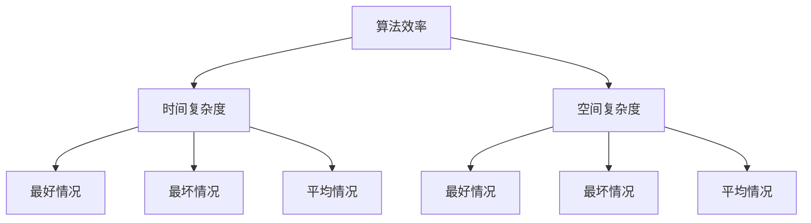

                 

### 第1章：算法效率概述

#### 背景介绍

算法效率是计算机科学中一个核心的概念，它描述了算法在解决特定问题时所消耗的资源（如时间、空间等）的有效性。算法效率不仅影响程序的性能，还对大规模数据处理、复杂问题求解等领域有着重要影响。随着数据量的增长和计算需求的增加，提高算法效率变得尤为重要。

#### 核心概念与联系

算法效率涉及多个核心概念，包括时间复杂度、空间复杂度、最好情况、最坏情况和平均情况。这些概念之间的关系可以通过Mermaid流程图来展示：



时间复杂度描述了算法执行时间与输入数据规模之间的关系，通常用大O符号（O）表示。空间复杂度则描述了算法执行过程中所需内存的规模。最好情况、最坏情况和平均情况是算法在不同输入下的性能表现。

#### 核心算法原理讲解

算法效率的基本指标包括时间复杂度和空间复杂度。时间复杂度通常表示为f(n)，表示算法执行时间与输入数据规模n的关系。常见的表示方法包括：

- 常数时间：O(1)
- 线性时间：O(n)
- 对数时间：O(log n)
- 平方时间：O(n^2)
- 立方时间：O(n^3)

空间复杂度同样使用大O符号表示，描述了算法执行过程中所需内存的规模。常见的空间复杂度包括：

- 常数空间：O(1)
- 线性空间：O(n)
- 对数空间：O(log n)

下面是一个简单的时间复杂度分析示例：

```python
# 普通循环算法
def linear_search(arr, target):
    for i in range(len(arr)):
        if arr[i] == target:
            return i
    return -1
```

此算法的时间复杂度为O(n)，因为最坏情况需要遍历整个数组。

#### 实例说明

假设我们有一个包含1000个元素的数组，要找到值为5的元素。如果使用线性搜索算法，最坏情况需要1000次比较。然而，如果我们使用二分查找算法，最坏情况下的比较次数将大大减少：

```python
# 二分查找算法
def binary_search(arr, target):
    low = 0
    high = len(arr) - 1
    while low <= high:
        mid = (low + high) // 2
        if arr[mid] == target:
            return mid
        elif arr[mid] < target:
            low = mid + 1
        else:
            high = mid - 1
    return -1
```

二分查找算法的时间复杂度为O(log n)，在最坏情况下，找到目标元素所需的比较次数为10次（log2(1000)）。这表明，在处理大量数据时，算法效率的优化可以显著提升性能。

#### 数学模型和数学公式

为了更深入地理解算法效率，我们可以使用数学模型来描述时间复杂度和空间复杂度。以下是一个简单的例子：

$$
T(n) = O(n)
$$

这里，T(n) 表示算法执行时间，n 表示输入数据规模。对于线性搜索算法，这个公式很好地描述了最坏情况下的时间复杂度。

#### 拓展阅读

- 《算法导论》（Introduction to Algorithms）是一本经典的算法教材，详细介绍了算法效率的分析方法。
- 《计算机程序设计艺术》（The Art of Computer Programming）由著名计算机科学家Donald E. Knuth撰写，提供了大量关于算法效率的深入探讨。

通过本章的介绍，我们初步了解了算法效率的概念、核心指标以及分析算法效率的基本方法。接下来，我们将进一步探讨算法效率的具体分析方法，并深入探讨如何优化算法效率。

#### 小结

本章我们介绍了算法效率的基本概念和重要性，分析了算法的时间复杂度和空间复杂度，并通过实例展示了如何通过算法效率优化来提升程序性能。接下来，我们将进一步深入分析算法效率，探讨更复杂的算法优化方法，并探索算法效率与宇宙运行之间的关系。敬请期待下一章的内容。

