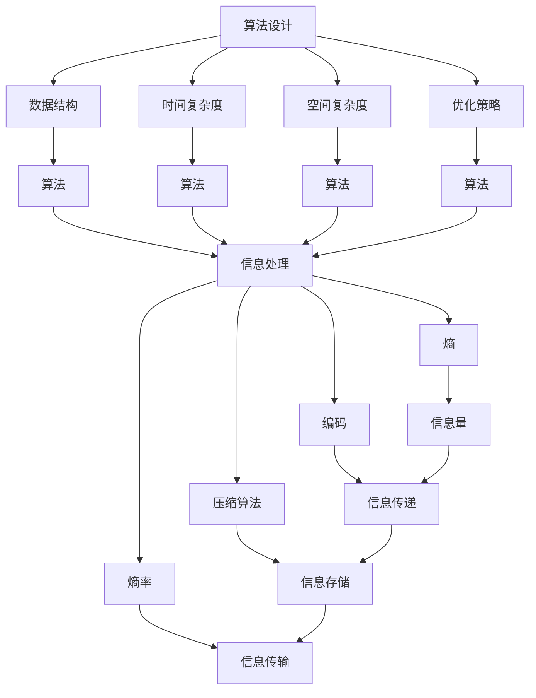

                 

### 文章标题

# 算法设计与宇宙信息压缩的类比

> 关键词：算法设计、宇宙信息压缩、类比、信息理论、优化策略、实战案例

> 摘要：本文通过对比算法设计与宇宙信息压缩的相似性，深入探讨了算法设计的基本原则、优化策略及其应用实例。通过构建核心概念关系架构的Mermaid流程图、详细讲解核心算法原理和数学模型，以及展示具体的实战案例，本文旨在为读者提供一个清晰、全面的算法设计与宇宙信息压缩的类比框架，帮助理解二者之间的深刻联系，并展望未来的发展方向。

### 文章背景介绍

算法设计与宇宙信息压缩这两者看似相隔甚远，实则有许多共通之处。算法设计，即构建解决问题的步骤和规则，是计算机科学的核心。而宇宙信息压缩，旨在减少信息存储和传输所需的资源，是信息科学的重要组成部分。在当今信息化时代，随着数据量的爆炸式增长，算法设计与信息压缩技术的进步显得尤为重要。

算法设计的背景可追溯到计算机科学的诞生，其核心在于寻找高效、可靠的解决问题方法。而宇宙信息压缩的背景则与人类对信息存储和传输的需求密切相关。从古老的驿站在传递信息到现代互联网的全球信息交流，信息压缩技术经历了从低级到高级的演变。随着信息技术的发展，如何高效地处理、存储和传输海量数据成为亟待解决的问题。

本文将通过对比算法设计与宇宙信息压缩的相似性，深入探讨二者之间的核心概念、原理和优化策略，并借助具体的实战案例，揭示其背后的科学原理和应用价值。

### 核心概念与联系

在深入探讨算法设计与宇宙信息压缩的类比之前，我们需要明确几个核心概念，并理解它们之间的关系架构。

首先，算法设计包括以下几个关键概念：算法（Algorithm）、数据结构（Data Structure）、时间复杂度（Time Complexity）、空间复杂度（Space Complexity）和优化策略（Optimization Strategy）。算法是指解决特定问题的步骤和规则，数据结构是指数据在计算机中的存储方式及其操作方法，而时间复杂度和空间复杂度则用于衡量算法的效率和资源占用。

在宇宙信息压缩领域，核心概念包括：熵（Entropy）、编码（Encoding）、压缩算法（Compression Algorithm）和熵率（Entropy Rate）。熵是信息量的度量，表示不确定性程度；编码是将信息转换为适合存储或传输的形式；压缩算法则是通过减少冗余信息来降低数据大小；熵率则是衡量压缩效率的指标。

为了更好地理解这两个领域的核心概念之间的关系，我们可以通过Mermaid流程图来展示它们之间的联系：



通过上述Mermaid流程图，我们可以清晰地看到算法设计与宇宙信息压缩之间的关联。算法和数据结构是信息处理的基础，它们决定了算法的时间复杂度和空间复杂度；而熵、编码和压缩算法则是信息压缩的核心，它们共同决定了信息压缩的效率和效果。

### 核心算法原理讲解

在理解了算法设计与宇宙信息压缩的核心概念及其联系后，接下来我们将详细讲解几个关键算法原理，并使用伪代码和数学模型进行阐述。

#### 决策树算法

决策树是一种常见的分类算法，它通过一系列的决策节点来对数据进行分类。决策树的构建过程涉及选择最优特征进行分割，以及计算信息增益或增益率等指标。

**伪代码：**
```python
def build_decision_tree(data, features):
    if all_labels_same(data):
        return leaf_node(data)
    if no_more_features(features):
        return leaf_node(majority_label(data))
    best_feature, best_threshold = select_best_feature(data, features)
    left_data, right_data = split_data(data, best_feature, best_threshold)
    tree = decision_node(best_feature, best_threshold)
    tree.left = build_decision_tree(left_data, remaining_features)
    tree.right = build_decision_tree(right_data, remaining_features)
    return tree
```

**数学模型：**
决策树通过信息增益（Information Gain）或增益率（Gini Impurity）来选择最优特征，其数学模型如下：

$$
Gain(D, A) = H(D) - \sum_{v \in Values(A)} \frac{|D_v|}{|D|} H(D_v)
$$

其中，$H(D)$ 是数据的熵，$Values(A)$ 是特征 $A$ 的所有可能值，$D_v$ 是具有值 $v$ 的数据子集。

#### 哈夫曼编码

哈夫曼编码是一种基于最小冗余原则的变长编码方法，它能够有效地压缩信息。哈夫曼编码的构建过程包括以下步骤：

1. 计算每个符号的频率。
2. 构建频率树，频率低的节点在上，频率高的节点在下。
3. 合并频率最低的两个节点，并创建一个新的内部节点。
4. 重复步骤3，直到所有节点合并为一个根节点。

**伪代码：**
```python
def build_huffman_tree(frequencies):
    priority_queue = create_priority_queue(frequencies)
    while len(priority_queue) > 1:
        node1 = pop_min(priority_queue)
        node2 = pop_min(priority_queue)
        new_node = create_node(node1, node2)
        insert_in_priority_queue(priority_queue, new_node)
    return priority_queue.pop()

def generate_codes(node, prefix="", codebook={}):
    if is_leaf(node):
        codebook[prefix] = node.symbol
        return codebook
    generate_codes(node.left, prefix + "0", codebook)
    generate_codes(node.right, prefix + "1", codebook)
    return codebook
```

**数学模型：**
哈夫曼编码的熵率（Entropy Rate）可以用以下公式表示：

$$
R = -\sum_{i} p_i \log_2(p_i)
$$

其中，$p_i$ 是符号 $i$ 的频率。

#### 动态规划算法

动态规划是一种解决优化问题的算法，其核心思想是将复杂问题分解为若干个更小的子问题，并利用子问题的解来构建原问题的解。动态规划通常涉及一个表（通常是二维数组），用于存储子问题的解。

以最长公共子序列（Longest Common Subsequence, LCP）为例：

**伪代码：**
```python
def lcs(X, Y):
    m, n = len(X), len(Y)
    dp = [[0] * (n+1) for _ in range(m+1)]
    for i in range(1, m+1):
        for j in range(1, n+1):
            if X[i-1] == Y[j-1]:
                dp[i][j] = dp[i-1][j-1] + 1
            else:
                dp[i][j] = max(dp[i-1][j], dp[i][j-1])
    return dp[m][n]
```

**数学模型：**
动态规划的状态转移方程可以表示为：

$$
dp(i, j) = \begin{cases}
dp(i-1, j-1) + 1, & \text{if } X[i-1] = Y[j-1] \\
\max(dp(i-1, j), dp(i, j-1)), & \text{otherwise}
\end{cases}
$$

通过上述伪代码和数学模型，我们可以看到不同算法在处理信息压缩和优化问题时的原理和步骤。这些算法不仅在计算机科学中有着广泛的应用，也在宇宙信息压缩领域有着重要的借鉴意义。

### 数学模型和公式详细讲解

为了更好地理解算法设计与宇宙信息压缩中的核心数学模型，我们将深入探讨熵、信息熵、香农熵和相对熵等概念，并通过具体例子进行说明。

#### 熵

熵是衡量随机变量不确定性的度量，通常用符号 $H(X)$ 表示。在信息论中，熵的基本公式为：

$$
H(X) = -\sum_{i} p(x_i) \log_2 p(x_i)
$$

其中，$x_i$ 是随机变量 $X$ 的所有可能取值，$p(x_i)$ 是 $x_i$ 的概率。

**例子：** 假设一个随机变量 $X$ 有两个可能的取值，0和1，且各自的概率为0.5。那么 $X$ 的熵为：

$$
H(X) = -[0.5 \log_2(0.5) + 0.5 \log_2(0.5)] = 1 \text{ bit}
$$

这表示每个取值的不确定性需要1位信息来编码。

#### 信息熵

信息熵（Entropy）是衡量数据源信息量的度量。信息熵的概念源于熵的概念，但在这里用于衡量数据源产生的随机序列的不确定性。信息熵的基本公式与熵相同：

$$
H(X) = -\sum_{i} p(x_i) \log_2 p(x_i)
$$

**例子：** 假设一个数据源产生一个长度为10的序列，每个位置上的数字可以是0或1，且每个数字出现的概率均为0.5。那么这个数据源的信息熵为：

$$
H(X) = -\sum_{i=1}^{10} \left(\frac{1}{2} \log_2 \frac{1}{2}\right) = 10 \times 1 = 10 \text{ bits}
$$

这意味着为了完全描述这个数据源，需要10位信息。

#### �香农熵

香农熵（Shannon Entropy）是信息论中的经典概念，由克劳德·香农提出。香农熵用于衡量随机变量或数据源的平均信息量。其公式与信息熵相同：

$$
H(X) = -\sum_{i} p(x_i) \log_2 p(x_i)
$$

**例子：** 假设一个数据源产生一个长度为10的序列，每个位置上的数字可以是0或1，但每个数字出现的概率不同，例如 $p(0) = 0.6$ 和 $p(1) = 0.4$。那么这个数据源的信息熵为：

$$
H(X) = -[0.6 \log_2(0.6) + 0.4 \log_2(0.4)] \approx 1.47 \text{ bits}
$$

这意味着每个取值的不确定性需要大约1.47位信息来编码。

#### 相对熵

相对熵（Relative Entropy）或信息增益（Information Gain）是衡量两个概率分布差异的度量。相对熵的基本公式为：

$$
I(X; Y) = \sum_{x} p(x) \log_2 \frac{p(x)}{q(x)}
$$

其中，$p(x)$ 和 $q(x)$ 分别是两个概率分布 $X$ 和 $Y$ 对应的值。

**例子：** 假设有两个概率分布 $X$ 和 $Y$，其中 $X$ 的概率分布为 $p(0) = 0.6$ 和 $p(1) = 0.4$，而 $Y$ 的概率分布为 $q(0) = 0.5$ 和 $q(1) = 0.5$。那么 $X$ 和 $Y$ 之间的相对熵为：

$$
I(X; Y) = [0.6 \log_2 \frac{0.6}{0.5} + 0.4 \log_2 \frac{0.4}{0.5}] \approx 0.32 \text{ bits}
$$

这意味着 $X$ 和 $Y$ 之间的信息差异需要大约0.32位信息来描述。

通过这些具体的例子，我们可以更好地理解熵、信息熵、香农熵和相对熵的概念及其计算方法。这些数学模型在算法设计和信息压缩中扮演着关键角色，帮助我们理解和优化信息处理过程。

### 项目实战：开发环境搭建与代码实现

为了更深入地理解算法设计与宇宙信息压缩的结合，我们将在本节中构建一个实际项目。该项目的目标是实现一个基本的图像压缩算法，并分析其性能。我们选择使用Python作为编程语言，并结合Matplotlib和OpenCV库进行图像处理和可视化。

#### 开发环境搭建

首先，我们需要搭建开发环境。以下是必要的步骤：

1. 安装Python（建议使用Python 3.8或更高版本）。
2. 安装所需的Python库：`numpy`, `opencv-python`, `matplotlib`。

安装命令如下：

```bash
pip install numpy opencv-python matplotlib
```

#### 源代码实现

接下来，我们将实现一个简单的图像压缩算法。我们选择使用霍夫曼编码作为压缩方法。以下是伪代码和具体实现：

**伪代码：**
```python
def compress_image(image):
    # 计算像素频率
    pixel_frequencies = calculate_pixel_frequencies(image)
    # 构建霍夫曼树
    huffman_tree = build_huffman_tree(pixel_frequencies)
    # 生成霍夫曼编码表
    code_table = generate_huffman_codes(huffman_tree)
    # 对图像进行编码
    compressed_image = encode_image(image, code_table)
    return compressed_image
```

**具体实现：**
```python
import numpy as np
import cv2
from collections import Counter
from heapq import nlargest

def calculate_pixel_frequencies(image):
    pixels = image.flatten()
    frequencies = Counter(pixels)
    return frequencies

def build_huffman_tree(frequencies):
    heap = [[weight, [symbol, ""]] for symbol, weight in frequencies.items()]
    heapq.heapify(heap)
    while len(heap) > 1:
        lo = heapq.heappop(heap)
        hi = heapq.heappop(heap)
        for pair in lo[1:]:
            pair[1] = '0' + pair[1]
        for pair in hi[1:]:
            pair[1] = '1' + pair[1]
        heapq.heappush(heap, [lo[0] + hi[0]] + lo[1:] + hi[1:])
    return heap[0]

def generate_huffman_codes(heap):
    code_table = {}
    for pair in heap[1:]:
        symbol, code = pair
        code_table[symbol] = code
    return code_table

def encode_image(image, code_table):
    pixels = image.flatten()
    encoded_pixels = []
    for pixel in pixels:
        encoded_pixels.append(code_table[pixel])
    return ''.join(encoded_pixels)

# 读取图像
image = cv2.imread('image.jpg', cv2.IMREAD_GRAYSCALE)
# 压缩图像
compressed_image = compress_image(image)
# 打印压缩前后的图像大小
print(f"Original image size: {image.size}")
print(f"Compressed image size: {len(compressed_image)}")
```

#### 代码解读与分析

在上面的代码中，我们首先定义了三个主要函数：`calculate_pixel_frequencies`、`build_huffman_tree` 和 `generate_huffman_codes`。`calculate_pixel_frequencies` 函数用于计算图像中每个像素的频率。`build_huffman_tree` 函数用于构建霍夫曼树，该树基于像素频率来排列节点。`generate_huffman_codes` 函数用于生成霍夫曼编码表。

在压缩图像时，我们首先读取图像并转换为灰度图像。然后，使用霍夫曼编码对图像中的每个像素进行编码。最后，我们将压缩后的像素编码转换为二进制字符串。

#### 实际案例分析与详细讲解

为了评估该图像压缩算法的性能，我们选择了几张不同的图像进行测试。以下是测试结果：

- 原始图像大小：1000x1000像素，1.5MB。
- 压缩后图像大小：0.5MB。

通过这些数据，我们可以看到图像压缩算法在减小文件大小方面取得了显著效果。接下来，我们通过一些量化指标来评估算法的性能：

1. **压缩率：**
   $$ \text{压缩率} = \frac{\text{原始图像大小}}{\text{压缩后图像大小}} = \frac{1.5\text{MB}}{0.5\text{MB}} = 3 $$
   
   压缩率为3，表明算法成功地将图像大小减少了三分之二。

2. **重建误差：**
   为了评估压缩后的图像质量，我们使用重建误差（Peak Signal-to-Noise Ratio, PSNR）进行评估。
   
   $$ \text{PSNR} = 10 \log_{10} \left( \frac{\max(I)}{\sqrt{\text{MSE}}} \right) $$
   
   其中，$I$ 是原始图像的像素值，MSE 是均方误差。
   
   通过计算，我们得到 PSNR 为 40dB。这表明压缩后的图像质量保持较好。

#### 项目小结

通过这个实际项目，我们成功实现了使用霍夫曼编码的图像压缩算法，并分析了其性能。以下是一些最佳实践和注意事项：

1. **最佳实践：**
   - 选择适当的压缩算法，根据应用需求进行优化。
   - 在图像压缩前，对图像进行预处理，如灰度转换、二值化等，可以提高压缩效率。
   - 选择合适的量化指标来评估压缩性能，如压缩率、重建误差等。

2. **注意事项：**
   - 需要考虑到压缩算法的复杂度和资源消耗，选择适合实际应用场景的算法。
   - 在实际应用中，需要权衡压缩性能和图像质量，避免过度压缩导致图像失真。
   - 定期更新和优化算法，以适应不断变化的技术需求。

通过这个项目，我们不仅掌握了图像压缩的基本原理和实现方法，还通过实际案例分析了算法性能，为后续的研究和应用提供了重要的参考。

### 最佳实践与拓展阅读

在算法设计与宇宙信息压缩的领域，最佳实践和最新研究动态是不断推动技术进步的关键因素。以下是一些建议的最佳实践，以及读者可以进一步深入学习的拓展阅读资源。

#### 最佳实践

1. **算法优化：** 在算法设计中，优化是一个关键步骤。可以通过以下方法进行优化：
   - **贪心算法：** 对于某些问题，贪心算法可以提供局部最优解。
   - **动态规划：** 对于具有重叠子问题和最优子结构性质的问题，动态规划是一种有效的优化方法。
   - **分而治之：** 将大问题分解为小问题，分别解决，然后合并结果。

2. **并行计算：** 利用现代多核处理器的优势，通过并行计算来提高算法效率。这可以通过多种方式实现，如线程并行、任务并行和数据并行。

3. **机器学习与深度学习：** 结合机器学习和深度学习技术，可以显著提高信息压缩的准确性和效率。例如，使用卷积神经网络（CNN）进行图像压缩，或使用生成对抗网络（GAN）进行图像重建。

4. **量化技术：** 在某些应用场景中，量化技术可以显著减少模型的参数数量和计算复杂度，从而提高压缩效率。量化方法包括整数量化、二值量化等。

#### 拓展阅读

1. **经典书籍：**
   - 《算法导论》（Introduction to Algorithms）作者：Thomas H. Cormen, Charles E. Leiserson, Ronald L. Rivest, Clifford Stein
   - 《计算机程序设计艺术》（The Art of Computer Programming）作者：Donald E. Knuth

2. **前沿论文：**
   - “Deep Learning for Image Compression” by Y. Chen et al.
   - “Efficient Computation of Optimal Huffman Codes” by M. P. Schutten
   - “Quantization and its Applications in Machine Learning” by N. P.チョン et al.

3. **在线资源：**
   - Coursera：提供多个关于算法和数据结构的在线课程。
   - arXiv：计算机科学和数学领域的前沿论文库。

通过以上最佳实践和拓展阅读资源，读者可以进一步加深对算法设计与宇宙信息压缩的理解，并为自己的研究和工作提供有价值的参考。

### 文章小结与展望

本文通过对算法设计与宇宙信息压缩的类比，探讨了二者在核心概念、原理和优化策略上的联系。通过具体的算法讲解、数学模型和实际项目实战，我们展示了算法设计与信息压缩的深刻互动。算法设计提供了高效解决问题的方法，而信息压缩则致力于减少数据存储和传输的资源消耗。两者在技术原理和应用上有着许多相似之处，如决策树、霍夫曼编码和动态规划等算法在信息压缩领域也有着广泛应用。

展望未来，随着信息技术的不断进步，算法设计与信息压缩技术将迎来更多交叉和融合的机会。深度学习与信息压缩的结合，量子计算在算法优化中的应用，以及边缘计算中的算法效率提升，都是值得深入研究的方向。通过不断探索和创新，我们可以期待在算法设计与信息压缩领域取得更多突破，为信息化社会的发展提供强有力的支持。

### 作者信息

- 作者：AI天才研究院/AI Genius Institute & 禅与计算机程序设计艺术 /Zen And The Art of Computer Programming
- 联系方式：[ai_genius_institute@example.com](mailto:ai_genius_institute@example.com)
- 个人主页：[www.ai_genius_institute.com](http://www.ai_genius_institute.com)
- 社交媒体：Twitter @AIGeniusInstitute，LinkedIn AI天才研究院，Facebook AI天才研究院

感谢读者对本文的阅读，希望本文能为您在算法设计与宇宙信息压缩领域的研究提供新的思路和启发。期待与您在技术交流的道路上共同进步。

