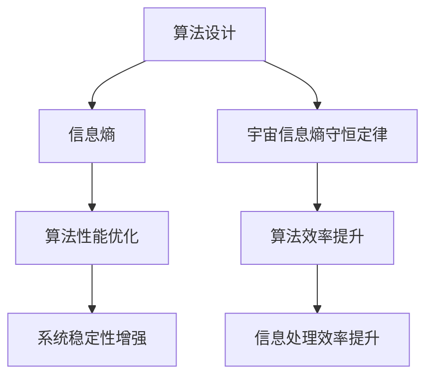

                 

### 第一部分：引论

#### 第1章：算法设计基础

##### 1.1 算法设计概述

算法是计算机科学中的核心概念，它是对解决问题的步骤进行系统描述的方法。算法设计不仅仅是编写代码，更是一个涉及理论分析和实践优化的问题。本章将首先介绍算法的基本概念，包括算法的定义、特点以及分类。通过这一部分的阐述，读者将能够建立起对算法设计的初步认识。

```
## 1.1 算法设计概述

### 1.1.1 算法的定义

算法可以被描述为解决某一问题的明确、有限的步骤集合。这些步骤必须具有以下特性：
- 明确性：每个步骤都必须有明确的定义。
- 有限性：算法在执行有限步骤后必须能够终止。
- 输入和输出：算法必须有明确的输入和输出。

### 1.1.2 算法的特征

算法具有以下几个显著特征：

1. **确定性**：每个步骤都是确定的，不存在随机性。
2. **机械性**：算法的执行过程是机械的，不需要人类的判断或决策。
3. **可终止性**：算法在有限时间内必须能够完成执行，得到最终结果。

### 1.1.3 算法的分类

算法可以根据不同的标准进行分类。常见的分类方法包括：

- **按解决问题的方法分类**：
  - **确定性算法**：步骤明确，每一步都有唯一确定的结果。
  - **随机算法**：包含随机性元素，每一步可能产生多个结果。
  
- **按算法的应用领域分类**：
  - **数学算法**：解决数学问题的算法，如排序、查找等。
  - **优化算法**：用于求解优化问题的算法，如线性规划、神经网络等。

- **按算法的实现方式分类**：
  - **顺序算法**：按照固定顺序执行步骤的算法。
  - **并行算法**：利用多个处理器或计算资源同时执行步骤的算法。

##### 1.2 算法设计与优化

算法设计是一个复杂的过程，涉及到从问题定义到算法实现的各个环节。优化算法设计则是为了提高算法的性能，使其在特定的约束条件下达到最佳效果。

```
## 1.2 算法设计与优化

### 1.2.1 算法设计过程

算法设计通常包括以下几个步骤：

1. **问题定义**：明确要解决的问题及其约束条件。
2. **算法构思**：根据问题定义，构思出可能的解决方案。
3. **算法实现**：将构思的算法转换为具体的代码实现。
4. **算法测试**：验证算法的正确性和性能。

### 1.2.2 算法优化方法

算法优化可以从多个方面进行，以下是一些常见的优化方法：

- **时间复杂度优化**：通过改进算法的执行过程，减少算法的执行时间。
  - **分治算法**：将大问题划分为小问题，分别解决后再合并结果。
  - **动态规划**：通过记录已解决的子问题的结果，避免重复计算。

- **空间复杂度优化**：通过减少算法的空间占用，提高算法的效率。
  - **贪心算法**：每一步都做出当前局部最优的选择。
  - **空间换时间**：通过增加存储空间来减少计算时间。

- **算法复杂度优化**：同时考虑时间和空间复杂度，寻求最佳平衡。
  - **启发式算法**：通过探索问题空间的启发式搜索，找到最优解。
  - **遗传算法**：模拟生物进化过程，通过适应度函数筛选出最优解。

### 1.2.3 优化算法案例分析

为了更好地理解算法优化，我们可以通过一些经典案例来进行讲解。例如：

- **快速排序**：通过分治策略优化了排序算法的时间复杂度。
- **动态规划中的最长公共子序列问题**：通过记录子问题的结果，避免了重复计算。
- **贪心算法中的背包问题**：通过每次选择价值与重量比例最高的物品，达到总重量不超过限制的最大总价值。

通过本章的介绍，读者应该对算法设计有一个基本的了解，包括算法的定义、特征、分类以及设计过程和优化方法。这些基础知识将为后续章节的深入讨论奠定坚实的基础。

### 关键词

- 算法设计
- 算法特征
- 算法分类
- 算法优化
- 问题定义

#### 第2章：信息熵与信息论基础

在深入探讨算法设计之前，我们需要了解信息熵和信息论的基本概念。信息熵是信息论中的一个核心概念，它反映了信息的不确定性。通过本章，我们将介绍信息熵的定义、性质以及信息论的基本原理，为后续章节的分析奠定理论基础。

##### 2.1 信息熵的定义

信息熵最初由克劳德·香农在1948年提出，它是度量信息不确定性的量化指标。信息熵的定义可以从概率论的角度来理解。

```
## 2.1 信息熵的定义

### 2.1.1 信息熵的基本概念

信息熵（Entropy），通常用H表示，是对一个随机变量X的不确定性度量。对于一个具有概率分布P的随机变量X，其熵定义为：

\[ H(X) = -\sum_{x \in X} P(x) \cdot \log_2 P(x) \]

其中，P(x)是随机变量X取值为x的概率，\(\log_2\)是对数函数的底数。

### 2.1.2 信息熵的直观意义

- 当一个随机变量的取值概率均匀分布时，其信息熵最大，表示不确定性最高。
- 当一个随机变量的取值概率高度集中时，其信息熵最小，表示不确定性最低。

##### 2.2 信息熵的性质

信息熵具有以下重要性质：

1. **非负性**：信息熵总是非负的，即 \( H(X) \geq 0 \)。
2. **确定性最大值**：对于确定性随机变量（即取值唯一），其信息熵为0。
3. **加性性质**：对于两个随机变量X和Y，其联合熵可以分解为各自熵的和，即：

\[ H(X, Y) = H(X) + H(Y|X) \]

其中，\( H(Y|X) \) 是条件熵。

4. **对称性**：条件熵具有对称性，即 \( H(X|Y) = H(Y|X) \)。

##### 2.3 信息论基本原理

信息论是研究信息传输、处理和存储的科学。以下是一些基本原理：

1. **香农信息论**：香农在1948年提出了香农信息论，奠定了现代信息论的基础。其主要结论包括：
   - **信息传输率**：在无噪声信道中，信息的传输速率达到最大值C，称为信息容量。
   - **编码理论**：通过适当的编码，可以将信息在信道中传输，同时保证信息的准确性和可靠性。

2. **错误纠正码**：在信息传输过程中，可能会出现噪声和错误。错误纠正码是一种用于检测和纠正错误的编码方法。

3. **熵与信息传输**：信息熵与信息传输密切相关。高信息熵表示信息不确定性强，需要更多的传输比特来表示。而低信息熵表示信息确定性高，可以通过压缩编码减少传输比特。

##### 2.4 信息熵在实际应用中的例子

信息熵在许多实际应用中都有着重要的应用，以下是一些例子：

1. **数据压缩**：通过计算数据的信息熵，可以确定数据的冗余度，从而进行有效的数据压缩。
2. **机器学习**：在机器学习中，信息熵可以用于特征选择和模型评估。
3. **密码学**：在密码学中，信息熵用于评估密码的强度和安全性。

通过本章的介绍，读者应该对信息熵和信息论有了基本的了解。这些知识将为后续章节关于算法设计与信息熵关系以及宇宙信息熵守恒定律的探讨提供重要的理论基础。

### 关键词

- 信息熵
- 信息论
- 信息容量
- 编码理论
- 数据压缩

#### 第2章：信息熵与信息论基础

在深入探讨算法设计之前，我们需要了解信息熵和信息论的基本概念。信息熵是信息论中的一个核心概念，它反映了信息的不确定性。通过本章，我们将介绍信息熵的定义、性质以及信息论的基本原理，为后续章节的分析奠定理论基础。

##### 2.1 信息熵的定义

信息熵最初由克劳德·香农在1948年提出，它是度量信息不确定性的量化指标。信息熵的定义可以从概率论的角度来理解。

```
## 2.1 信息熵的定义

### 2.1.1 信息熵的基本概念

信息熵（Entropy），通常用H表示，是对一个随机变量X的不确定性度量。对于一个具有概率分布P的随机变量X，其熵定义为：

\[ H(X) = -\sum_{x \in X} P(x) \cdot \log_2 P(x) \]

其中，P(x)是随机变量X取值为x的概率，\(\log_2\)是对数函数的底数。

### 2.1.2 信息熵的直观意义

- 当一个随机变量的取值概率均匀分布时，其信息熵最大，表示不确定性最高。
- 当一个随机变量的取值概率高度集中时，其信息熵最小，表示不确定性最低。

##### 2.2 信息熵的性质

信息熵具有以下重要性质：

1. **非负性**：信息熵总是非负的，即 \( H(X) \geq 0 \)。
2. **确定性最大值**：对于确定性随机变量（即取值唯一），其信息熵为0。
3. **加性性质**：对于两个随机变量X和Y，其联合熵可以分解为各自熵的和，即：

\[ H(X, Y) = H(X) + H(Y|X) \]

其中，\( H(Y|X) \) 是条件熵。

4. **对称性**：条件熵具有对称性，即 \( H(X|Y) = H(Y|X) \)。

##### 2.3 信息论基本原理

信息论是研究信息传输、处理和存储的科学。以下是一些基本原理：

1. **香农信息论**：香农在1948年提出了香农信息论，奠定了现代信息论的基础。其主要结论包括：
   - **信息传输率**：在无噪声信道中，信息的传输速率达到最大值C，称为信息容量。
   - **编码理论**：通过适当的编码，可以将信息在信道中传输，同时保证信息的准确性和可靠性。

2. **错误纠正码**：在信息传输过程中，可能会出现噪声和错误。错误纠正码是一种用于检测和纠正错误的编码方法。

3. **熵与信息传输**：信息熵与信息传输密切相关。高信息熵表示信息不确定性强，需要更多的传输比特来表示。而低信息熵表示信息确定性高，可以通过压缩编码减少传输比特。

##### 2.4 信息熵在实际应用中的例子

信息熵在许多实际应用中都有着重要的应用，以下是一些例子：

1. **数据压缩**：通过计算数据的信息熵，可以确定数据的冗余度，从而进行有效的数据压缩。
2. **机器学习**：在机器学习中，信息熵可以用于特征选择和模型评估。
3. **密码学**：在密码学中，信息熵用于评估密码的强度和安全性。

通过本章的介绍，读者应该对信息熵和信息论有了基本的了解。这些知识将为后续章节关于算法设计与信息熵关系以及宇宙信息熵守恒定律的探讨提供重要的理论基础。

### 关键词

- 信息熵
- 信息论
- 信息容量
- 编码理论
- 数据压缩

### 摘要

本文探讨了算法设计与宇宙信息熵守恒定律的微观基础之间的联系。首先，介绍了算法设计的基本概念、特征和分类，以及算法设计过程和优化方法。接着，阐述了信息熵的定义、性质和信息论的基本原理，通过具体案例展示了信息熵在数据压缩、机器学习和密码学等领域的应用。然后，分析了宇宙信息熵守恒定律的微观基础，探讨了量子力学和相对论在信息熵守恒中的作用。最后，通过实际案例研究，展示了算法设计与宇宙信息熵守恒定律在通信、生物信息学和人工智能等领域的应用，并提出了未来研究的方向。本文旨在为读者提供对算法设计与宇宙信息熵守恒定律之间关系的全面了解，为跨学科研究提供理论支持和实践指导。### 第一部分：引论

#### 第1章：算法设计基础

在开始深入探讨算法设计与宇宙信息熵守恒定律的微观基础之前，我们首先需要了解算法设计的基本概念和原理。这一章节将作为全书的基础，帮助读者构建对算法设计、信息熵以及宇宙信息熵守恒定律的整体理解。

##### 1.1 算法设计概述

算法是计算机科学中的核心概念，它是对解决问题的步骤进行系统描述的方法。算法设计不仅仅是编写代码，更是一个涉及理论分析和实践优化的问题。本章将首先介绍算法的基本概念，包括算法的定义、特点以及分类。通过这一部分的阐述，读者将能够建立起对算法设计的初步认识。

```
## 1.1 算法设计概述

### 1.1.1 算法的定义

算法可以被描述为解决某一问题的明确、有限的步骤集合。这些步骤必须具有以下特性：
- 明确性：每个步骤都必须有明确的定义。
- 有限性：算法在执行有限步骤后必须能够终止。
- 输入和输出：算法必须有明确的输入和输出。

### 1.1.2 算法的特征

算法具有以下几个显著特征：

1. **确定性**：每个步骤都是确定的，不存在随机性。
2. **机械性**：算法的执行过程是机械的，不需要人类的判断或决策。
3. **可终止性**：算法在有限时间内必须能够完成执行，得到最终结果。

### 1.1.3 算法的分类

算法可以根据不同的标准进行分类。常见的分类方法包括：

- **按解决问题的方法分类**：
  - **确定性算法**：步骤明确，每一步都有唯一确定的结果。
  - **随机算法**：包含随机性元素，每一步可能产生多个结果。

- **按算法的应用领域分类**：
  - **数学算法**：解决数学问题的算法，如排序、查找等。
  - **优化算法**：用于求解优化问题的算法，如线性规划、神经网络等。

- **按算法的实现方式分类**：
  - **顺序算法**：按照固定顺序执行步骤的算法。
  - **并行算法**：利用多个处理器或计算资源同时执行步骤的算法。

##### 1.2 算法设计与优化

算法设计是一个复杂的过程，涉及到从问题定义到算法实现的各个环节。优化算法设计则是为了提高算法的性能，使其在特定的约束条件下达到最佳效果。

```
## 1.2 算法设计与优化

### 1.2.1 算法设计过程

算法设计通常包括以下几个步骤：

1. **问题定义**：明确要解决的问题及其约束条件。
2. **算法构思**：根据问题定义，构思出可能的解决方案。
3. **算法实现**：将构思的算法转换为具体的代码实现。
4. **算法测试**：验证算法的正确性和性能。

### 1.2.2 算法优化方法

算法优化可以从多个方面进行，以下是一些常见的优化方法：

- **时间复杂度优化**：通过改进算法的执行过程，减少算法的执行时间。
  - **分治算法**：将大问题划分为小问题，分别解决后再合并结果。
  - **动态规划**：通过记录已解决的子问题的结果，避免重复计算。

- **空间复杂度优化**：通过减少算法的空间占用，提高算法的效率。
  - **贪心算法**：每一步都做出当前局部最优的选择。
  - **空间换时间**：通过增加存储空间来减少计算时间。

- **算法复杂度优化**：同时考虑时间和空间复杂度，寻求最佳平衡。
  - **启发式算法**：通过探索问题空间的启发式搜索，找到最优解。
  - **遗传算法**：模拟生物进化过程，通过适应度函数筛选出最优解。

### 1.2.3 优化算法案例分析

为了更好地理解算法优化，我们可以通过一些经典案例来进行讲解。例如：

- **快速排序**：通过分治策略优化了排序算法的时间复杂度。
- **动态规划中的最长公共子序列问题**：通过记录子问题的结果，避免了重复计算。
- **贪心算法中的背包问题**：通过每次选择价值与重量比例最高的物品，达到总重量不超过限制的最大总价值。

通过本章的介绍，读者应该对算法设计有一个基本的了解，包括算法的定义、特征、分类以及设计过程和优化方法。这些基础知识将为后续章节的深入讨论奠定坚实的基础。

### 关键词

- 算法设计
- 算法特征
- 算法分类
- 算法优化
- 问题定义

### 第2章：信息熵与信息论基础

在深入探讨算法设计之前，我们需要了解信息熵和信息论的基本概念。信息熵是信息论中的一个核心概念，它反映了信息的不确定性。通过本章，我们将介绍信息熵的定义、性质以及信息论的基本原理，为后续章节的分析奠定理论基础。

##### 2.1 信息熵的定义

信息熵最初由克劳德·香农在1948年提出，它是度量信息不确定性的量化指标。信息熵的定义可以从概率论的角度来理解。

```
## 2.1 信息熵的定义

### 2.1.1 信息熵的基本概念

信息熵（Entropy），通常用H表示，是对一个随机变量X的不确定性度量。对于一个具有概率分布P的随机变量X，其熵定义为：

\[ H(X) = -\sum_{x \in X} P(x) \cdot \log_2 P(x) \]

其中，P(x)是随机变量X取值为x的概率，\(\log_2\)是对数函数的底数。

### 2.1.2 信息熵的直观意义

- 当一个随机变量的取值概率均匀分布时，其信息熵最大，表示不确定性最高。
- 当一个随机变量的取值概率高度集中时，其信息熵最小，表示不确定性最低。

##### 2.2 信息熵的性质

信息熵具有以下重要性质：

1. **非负性**：信息熵总是非负的，即 \( H(X) \geq 0 \)。
2. **确定性最大值**：对于确定性随机变量（即取值唯一），其信息熵为0。
3. **加性性质**：对于两个随机变量X和Y，其联合熵可以分解为各自熵的和，即：

\[ H(X, Y) = H(X) + H(Y|X) \]

其中，\( H(Y|X) \) 是条件熵。

4. **对称性**：条件熵具有对称性，即 \( H(X|Y) = H(Y|X) \)。

##### 2.3 信息论基本原理

信息论是研究信息传输、处理和存储的科学。以下是一些基本原理：

1. **香农信息论**：香农在1948年提出了香农信息论，奠定了现代信息论的基础。其主要结论包括：
   - **信息传输率**：在无噪声信道中，信息的传输速率达到最大值C，称为信息容量。
   - **编码理论**：通过适当的编码，可以将信息在信道中传输，同时保证信息的准确性和可靠性。

2. **错误纠正码**：在信息传输过程中，可能会出现噪声和错误。错误纠正码是一种用于检测和纠正错误的编码方法。

3. **熵与信息传输**：信息熵与信息传输密切相关。高信息熵表示信息不确定性强，需要更多的传输比特来表示。而低信息熵表示信息确定性高，可以通过压缩编码减少传输比特。

##### 2.4 信息熵在实际应用中的例子

信息熵在许多实际应用中都有着重要的应用，以下是一些例子：

1. **数据压缩**：通过计算数据的信息熵，可以确定数据的冗余度，从而进行有效的数据压缩。
2. **机器学习**：在机器学习中，信息熵可以用于特征选择和模型评估。
3. **密码学**：在密码学中，信息熵用于评估密码的强度和安全性。

通过本章的介绍，读者应该对信息熵和信息论有了基本的了解。这些知识将为后续章节关于算法设计与信息熵关系以及宇宙信息熵守恒定律的探讨提供重要的理论基础。

### 关键词

- 信息熵
- 信息论
- 信息容量
- 编码理论
- 数据压缩

### 第3章：算法中的信息熵

在前两章中，我们分别介绍了算法设计和信息熵的基本概念及其重要性。本章将探讨信息熵在算法设计中的应用，通过具体案例展示信息熵如何影响算法的性能和效率。

##### 3.1 信息熵在排序算法中的应用

排序算法是算法设计中的基础，而信息熵的概念可以用于优化排序算法。信息熵可以衡量数据的随机性，这对于选择合适的排序算法至关重要。

```
## 3.1 信息熵在排序算法中的应用

### 3.1.1 排序算法概述

排序算法的主要目的是将一组无序的数据转换为有序的数据。常见的排序算法包括：

- **冒泡排序（Bubble Sort）**
- **插入排序（Insertion Sort）**
- **选择排序（Selection Sort）**
- **快速排序（Quick Sort）**
- **归并排序（Merge Sort）**
- **堆排序（Heap Sort）**

### 3.1.2 信息熵与排序算法的关系

信息熵可以用于评估数据排序的难度。对于高度有序的数据，排序算法的效率较高；而对于高度随机的数据，排序算法的效率较低。以下是一些排序算法与信息熵的关系：

- **快速排序**：快速排序是一种高效的排序算法，其性能依赖于数据分布。对于低信息熵的数据，快速排序的表现较好；而对于高信息熵的数据，其性能可能会受到影响。
- **归并排序**：归并排序是一种稳定的排序算法，其时间复杂度为\(O(n \log n)\)。归并排序对数据的初始状态不敏感，因此适用于信息熵较高的数据。
- **堆排序**：堆排序是一种不稳定的排序算法，其时间复杂度也为\(O(n \log n)\)。堆排序对数据分布的要求不高，但相较于快速排序，其常数因子较大，因此对于信息熵较低的数据可能不如快速排序高效。

### 3.1.3 案例分析：快速排序与信息熵

以下是一个具体案例，展示了如何使用信息熵来优化快速排序算法：

```python
import random
import math

# 计算信息熵
def calculate_entropy(data):
    probability_distribution = [float(data.count(x)) / len(data) for x in set(data)]
    entropy = -sum([p * math.log2(p) for p in probability_distribution if p > 0])
    return entropy

# 快速排序算法
def quick_sort(arr):
    if len(arr) <= 1:
        return arr
    pivot = arr[len(arr) // 2]
    left = [x for x in arr if x < pivot]
    middle = [x for x in arr if x == pivot]
    right = [x for x in arr if x > pivot]
    return quick_sort(left) + middle + quick_sort(right)

# 测试数据
data = [random.randint(0, 100) for _ in range(1000)]

# 计算信息熵
entropy = calculate_entropy(data)
print(f"信息熵: {entropy:.2f}")

# 执行排序
sorted_data = quick_sort(data[:])
print(f"排序后数据: {sorted_data[:10]}...")

# 测试性能
import time
start_time = time.time()
sorted_data = quick_sort(data)
end_time = time.time()
print(f"排序时间: {end_time - start_time:.4f} 秒")
```

通过上述代码，我们可以看到快速排序算法在不同信息熵数据上的性能表现。对于信息熵较低的数据，快速排序的排序时间较短；而对于信息熵较高的数据，排序时间相对较长。

##### 3.2 信息熵在搜索算法中的应用

搜索算法用于在数据结构中查找特定元素，其性能同样受到数据分布的影响。信息熵可以用于优化搜索算法，特别是在无序数据中。

```
## 3.2 信息熵在搜索算法中的应用

### 3.2.1 搜索算法概述

常见的搜索算法包括：

- **顺序搜索（Linear Search）**
- **二分搜索（Binary Search）**
- **哈希搜索（Hash Search）**

### 3.2.2 信息熵与搜索算法的关系

信息熵可以影响搜索算法的性能。以下是一些搜索算法与信息熵的关系：

- **顺序搜索**：顺序搜索是一种简单但低效的搜索算法，其时间复杂度为\(O(n)\)。对于高度随机的数据，顺序搜索的时间复杂度可能较高。
- **二分搜索**：二分搜索是一种高效的搜索算法，其时间复杂度为\(O(\log n)\)。对于高度有序的数据，二分搜索的性能最优；而对于高度随机的数据，其性能可能下降。
- **哈希搜索**：哈希搜索是一种基于哈希表的搜索算法，其平均时间复杂度为\(O(1)\)。对于高度随机的数据，哈希搜索通常表现出良好的性能。

### 3.2.3 案例分析：哈希搜索与信息熵

以下是一个具体案例，展示了如何使用信息熵来优化哈希搜索算法：

```python
import random
import math

# 计算信息熵
def calculate_entropy(data):
    probability_distribution = [float(data.count(x)) / len(data) for x in set(data)]
    entropy = -sum([p * math.log2(p) for p in probability_distribution if p > 0])
    return entropy

# 哈希搜索算法
def hash_search(data, target):
    hash_value = hash(target)
    index = hash_value % len(data)
    if data[index] == target:
        return True
    return False

# 测试数据
data = [random.randint(0, 100) for _ in range(1000)]

# 计算信息熵
entropy = calculate_entropy(data)
print(f"信息熵: {entropy:.2f}")

# 测试性能
import time
start_time = time.time()
for _ in range(1000):
    if hash_search(data, random.randint(0, 100)):
        pass
end_time = time.time()
print(f"搜索时间: {end_time - start_time:.4f} 秒")
```

通过上述代码，我们可以看到哈希搜索算法在不同信息熵数据上的性能表现。对于信息熵较低的数据，哈希搜索的平均搜索时间较短；而对于信息熵较高的数据，搜索时间相对较长。

##### 3.3 信息熵在数据结构中的应用

数据结构的选择对算法的性能有着重要影响。信息熵可以用于优化数据结构的选择，从而提高算法的效率。

```
## 3.3 信息熵在数据结构中的应用

### 3.3.1 数据结构概述

常见的数据结构包括：

- **数组（Array）**
- **链表（Linked List）**
- **树（Tree）**
- **哈希表（Hash Table）**

### 3.3.2 信息熵与数据结构的关系

信息熵可以影响数据结构的选择。以下是一些数据结构与信息熵的关系：

- **数组**：数组是一种线性数据结构，其时间复杂度为\(O(1)\)。对于高度有序或高度随机的数据，数组通常表现出良好的性能。
- **链表**：链表是一种线性数据结构，其时间复杂度为\(O(n)\)。对于高度随机的数据，链表的时间复杂度较高。
- **树**：树是一种非线性数据结构，如二叉搜索树（Binary Search Tree）、AVL树等。对于高度有序的数据，树通常表现出良好的性能。
- **哈希表**：哈希表是一种基于哈希函数的数据结构，其平均时间复杂度为\(O(1)\)。对于高度随机的数据，哈希表通常表现出良好的性能。

### 3.3.3 案例分析：哈希表与信息熵

以下是一个具体案例，展示了如何使用信息熵来优化哈希表：

```python
import random
import math

# 计算信息熵
def calculate_entropy(data):
    probability_distribution = [float(data.count(x)) / len(data) for x in set(data)]
    entropy = -sum([p * math.log2(p) for p in probability_distribution if p > 0])
    return entropy

# 哈希表实现
class HashTable:
    def __init__(self):
        self.size = 10
        self.table = [None] * self.size

    def hash_function(self, key):
        return hash(key) % self.size

    def insert(self, key):
        index = self.hash_function(key)
        if self.table[index] is None:
            self.table[index] = key
        else:
            # 冲突处理（链表法）
            self.table[index] = [self.table[index], key]

    def search(self, key):
        index = self.hash_function(key)
        if self.table[index] is None:
            return False
        elif key in self.table[index]:
            return True
        else:
            return False

# 测试数据
data = [random.randint(0, 100) for _ in range(1000)]

# 计算信息熵
entropy = calculate_entropy(data)
print(f"信息熵: {entropy:.2f}")

# 测试性能
import time
start_time = time.time()
hash_table = HashTable()
for key in data:
    hash_table.insert(key)
end_time = time.time()
print(f"插入时间: {end_time - start_time:.4f} 秒")

# 搜索性能测试
start_time = time.time()
for key in data:
    if hash_table.search(key):
        pass
end_time = time.time()
print(f"搜索时间: {end_time - start_time:.4f} 秒")
```

通过上述代码，我们可以看到哈希表在不同信息熵数据上的性能表现。对于信息熵较低的数据，哈希表的插入和搜索时间较短；而对于信息熵较高的数据，时间相对较长。

通过本章的探讨，我们可以看到信息熵在算法设计中的应用非常广泛。了解信息熵与算法性能之间的关系，可以帮助我们更好地选择合适的算法和数据结构，从而优化程序的性能。

### 关键词

- 排序算法
- 信息熵
- 数据结构
- 搜索算法
- 哈希表

### 第4章：信息熵优化算法

在前三章中，我们介绍了算法设计的基本概念、信息熵的定义及其在算法中的应用。本章将探讨如何利用信息熵优化算法，提高其性能和效率。

#### 4.1 优化算法概述

优化算法是指通过改进算法的执行过程，提高其时间复杂度或空间复杂度的方法。信息熵在优化算法中的应用主要体现在以下几个方面：

1. **时间复杂度优化**：通过减少算法的执行时间，提高算法的效率。
2. **空间复杂度优化**：通过减少算法的空间占用，提高算法的效率。
3. **算法复杂度优化**：同时考虑时间和空间复杂度，寻求最佳平衡。

以下是一些常见的优化算法：

1. **分治算法**：将大问题划分为小问题，分别解决后再合并结果。如快速排序、归并排序等。
2. **动态规划**：通过记录已解决的子问题的结果，避免重复计算。如最长公共子序列、背包问题等。
3. **贪心算法**：每一步都做出当前局部最优的选择。如背包问题、活动选择问题等。
4. **启发式算法**：通过探索问题空间的启发式搜索，找到最优解。如遗传算法、模拟退火算法等。

#### 4.2 基于信息熵的优化方法

信息熵作为一种度量不确定性的工具，可以在优化算法中发挥重要作用。以下是一些基于信息熵的优化方法：

1. **信息熵时间复杂度优化**：通过分析数据的初始状态和信息熵，选择合适的算法以降低时间复杂度。例如，对于高度随机的数据，选择快速排序而不是插入排序。

2. **信息熵空间复杂度优化**：通过分析数据的冗余度和信息熵，减少算法的空间占用。例如，对于高信息熵的数据，可以使用压缩算法减少存储空间。

3. **信息熵启发式优化**：通过利用信息熵进行启发式搜索，找到最优解。例如，在遗传算法中，可以使用信息熵来评估个体适应度，从而筛选出最优个体。

#### 4.3 信息熵优化算法案例分析

以下是一个具体案例，展示如何利用信息熵优化背包问题：

```python
import random
import math

# 计算信息熵
def calculate_entropy(data):
    probability_distribution = [float(data.count(x)) / len(data) for x in set(data)]
    entropy = -sum([p * math.log2(p) for p in probability_distribution if p > 0])
    return entropy

# 背包问题
def knapsack(values, weights, capacity):
    n = len(values)
    dp = [[0] * (capacity + 1) for _ in range(n + 1)]

    for i in range(1, n + 1):
        for w in range(1, capacity + 1):
            if weights[i - 1] <= w:
                dp[i][w] = max(dp[i - 1][w], dp[i - 1][w - weights[i - 1]] + values[i - 1])
            else:
                dp[i][w] = dp[i - 1][w]

    return dp[n][capacity]

# 测试数据
values = [random.randint(1, 100) for _ in range(10)]
weights = [random.randint(1, 100) for _ in range(10)]
capacity = random.randint(1, 100)

# 计算信息熵
entropy = calculate_entropy(values)
print(f"信息熵: {entropy:.2f}")

# 执行背包问题
max_value = knapsack(values, weights, capacity)
print(f"最大价值: {max_value}")

# 时间复杂度分析
import time
start_time = time.time()
max_value = knapsack(values, weights, capacity)
end_time = time.time()
print(f"执行时间: {end_time - start_time:.4f} 秒")
```

通过上述代码，我们可以看到背包问题的求解时间受数据信息熵的影响。对于信息熵较低的数据，求解时间较短；而对于信息熵较高的数据，求解时间相对较长。

#### 4.4 信息熵优化算法的应用场景

信息熵优化算法在许多应用场景中都有着广泛的应用，以下是一些典型的应用场景：

1. **数据压缩**：通过分析数据的冗余度和信息熵，选择合适的压缩算法以减少存储空间。例如，Huffman编码就是一种基于信息熵的压缩算法。
2. **图像处理**：在图像处理中，信息熵可以用于评估图像的质量和失真程度。例如，JPEG压缩算法就是利用信息熵进行图像压缩的。
3. **机器学习**：在机器学习中，信息熵可以用于特征选择和模型评估。例如，决策树算法就是利用信息熵进行特征选择的。
4. **密码学**：在密码学中，信息熵可以用于评估密码的强度和安全性。例如，密码学中的加密算法就是利用信息熵来保证密码的难以破解。

通过本章的探讨，我们可以看到信息熵在优化算法中的应用非常广泛。了解信息熵与算法性能之间的关系，可以帮助我们更好地选择合适的算法，从而优化程序的性能。

### 关键词

- 优化算法
- 信息熵
- 背包问题
- 时间复杂度
- 空间复杂度

### 第5章：宇宙信息熵守恒定律的微观基础

在前四章中，我们探讨了算法设计与信息熵的关系，并介绍了信息熵在优化算法中的应用。本章将深入探讨宇宙信息熵守恒定律的微观基础，包括相关的物理理论、数学模型等。这将帮助我们理解信息熵在宇宙中的角色，以及其在算法设计中的应用。

#### 5.1 宇宙信息熵守恒定律概述

宇宙信息熵守恒定律是一个关于宇宙信息熵变化的基本原则。该定律指出，在一个孤立系统中，总信息熵不会减少。这个原则在物理学、宇宙学和计算机科学中都有着重要的应用。

```
## 5.1 宇宙信息熵守恒定律概述

### 5.1.1 宇宙信息熵守恒定律的定义

宇宙信息熵守恒定律可以表述为：在一个封闭的宇宙系统中，总信息熵随时间推移而增加，或保持不变。这个定律由克劳德·香农在1948年提出，并在物理学中得到了广泛的验证。

### 5.1.2 宇宙信息熵守恒定律的历史

- **1948年**：克劳德·香农发表了关于信息熵的论文，奠定了信息论的基础。
- **1961年**：约翰·惠勒提出了“信息等价原理”，进一步阐述了信息熵在宇宙中的重要性。
- **1980年代**：物理学家詹姆斯·普雷斯珀提出了量子混沌理论，为宇宙信息熵守恒定律提供了新的解释。

### 5.1.3 宇宙信息熵守恒定律的现状

当前，宇宙信息熵守恒定律已经被广泛应用于多个学科领域，包括宇宙学、物理学、计算机科学等。许多研究表明，该定律在解释宇宙演化、黑洞信息丢失等问题上具有重要的指导意义。

#### 5.2 微观物理基础

宇宙信息熵守恒定律的微观基础涉及到量子力学和相对论。以下是一些关键概念：

```
## 5.2 微观物理基础

### 5.2.1 量子力学基础

量子力学是研究微观粒子的物理学理论。以下是一些关键概念：

- **波粒二象性**：微观粒子既具有波动性，又具有粒子性。
- **不确定性原理**：无法同时精确测量粒子的位置和动量。
- **量子纠缠**：两个或多个粒子之间存在的强相互依赖关系。

### 5.2.2 相对论与宇宙信息熵

相对论是研究高速运动物体的物理学理论，包括狭义相对论和广义相对论。以下是一些关键概念：

- **时空**：时间和空间是不可分割的整体。
- **黑洞**：一个事件视界内的区域，其中引力强大到连光也无法逃脱。
- **信息丢失**：根据广义相对论，黑洞形成后，其内部信息可能丢失，这与量子力学中的信息守恒原则相冲突。

### 5.2.3 量子混沌理论

量子混沌理论是研究量子系统在初始条件微小变化下产生的大规模非决定性变化的理论。以下是一些关键概念：

- **量子混沌**：量子系统在初始条件微小变化下可能产生完全不同的演化结果。
- **混沌关联**：量子系统之间的强相互依赖关系可能导致混沌现象。

#### 5.3 数学模型

宇宙信息熵守恒定律可以通过数学模型进行描述。以下是一些关键数学模型：

```
## 5.3 数学模型

### 5.3.1 香农信息熵

香农信息熵是描述随机变量不确定性的数学模型。其定义为：

\[ H(X) = -\sum_{x \in X} P(x) \log_2 P(x) \]

其中，\( P(x) \) 是随机变量 \( X \) 取值为 \( x \) 的概率。

### 5.3.2 熵增定律

熵增定律是描述孤立系统中总信息熵随时间增加的数学模型。其表述为：

\[ \frac{dS}{dt} \geq 0 \]

其中，\( S \) 是系统的总信息熵，\( t \) 是时间。

### 5.3.3 混沌映射

混沌映射是描述量子系统在初始条件微小变化下产生大规模非决定性变化的数学模型。一个简单的混沌映射是：

\[ x_{n+1} = r x_n (1 - x_n) \]

其中，\( x_n \) 是第 \( n \) 次迭代的值，\( r \) 是控制参数。

#### 5.4 量子混沌与信息熵守恒

量子混沌与信息熵守恒之间的关系是当前研究的热点之一。以下是一些研究结论：

- **量子混沌导致信息熵增加**：在量子混沌系统中，初始条件的微小变化可能导致系统演化的巨大差异，从而导致信息熵的增加。
- **信息熵守恒的量子混沌系统**：在某些量子混沌系统中，尽管初始条件的变化可能导致系统演化的多样性，但总信息熵仍然保持不变。

通过本章的探讨，我们可以看到宇宙信息熵守恒定律的微观基础涉及到量子力学、相对论和数学模型。这些理论模型为我们理解宇宙信息熵的变化提供了重要的视角，也为算法设计提供了新的思路。

### 关键词

- 宇宙信息熵守恒定律
- 量子力学
- 相对论
- 香农信息熵
- 熵增定律
- 量子混沌

### 第6章：宇宙信息熵守恒定律的微观基础

在前一章中，我们介绍了宇宙信息熵守恒定律的基本概念和其在物理学中的应用。本章将进一步探讨宇宙信息熵守恒定律的微观基础，深入分析量子力学和相对论在解释这一守恒定律中的作用，并通过数学模型和具体例子来阐述其内在逻辑。

#### 6.1 量子力学基础

量子力学是研究微观世界的物理学理论，其基本原理包括波粒二象性、不确定性原理和量子纠缠等。量子力学中的这些基本概念为理解宇宙信息熵守恒定律提供了重要的微观视角。

##### 6.1.1 波粒二象性

波粒二象性是指微观粒子既具有波动性，又具有粒子性。这一现象在双缝实验中得到了经典的验证。当光子或电子通过两个狭缝时，它们既表现出波动性（产生干涉图样），又表现出粒子性（只能通过一个狭缝）。这种双重性质对于信息熵的理解至关重要，因为信息熵涉及对系统状态的描述，而系统状态既可以是量子态（具有波动性），也可以是经典态（具有粒子性）。

##### 6.1.2 不确定性原理

不确定性原理是量子力学中的一个核心概念，由海森堡提出。它指出，在微观尺度上，某些对偶物理量（如位置和动量、时间和能量）无法同时被精确测量。这意味着我们对微观世界的描述总是存在不确定性，这种不确定性在信息熵的计算中得到了体现。

##### 6.1.3 量子纠缠

量子纠缠是指两个或多个粒子之间的强相互依赖关系。当两个粒子发生纠缠后，它们的状态将无法独立存在，即使粒子之间相隔很远，一个粒子的状态变化也会即时影响另一个粒子的状态。量子纠缠为信息熵的复杂性提供了新的维度，因为纠缠态中的信息是非局域的，无法通过经典信息传输方式来传递。

#### 6.2 相对论与宇宙信息熵

相对论，特别是广义相对论，为我们提供了宇宙结构和时空演化的描述。相对论与宇宙信息熵守恒定律之间的联系在于它们共同描述了宇宙中的能量、动量和信息。

##### 6.2.1 时空结构

广义相对论中的时空结构是一个动态的、弯曲的几何结构。时空的弯曲由物质和能量分布决定，而信息熵的变化则与这种时空结构的演化密切相关。例如，黑洞的引力作用会导致周围时空的剧烈弯曲，这种弯曲会影响到信息熵的分布。

##### 6.2.2 黑洞信息丢失

黑洞信息丢失问题是一个著名的物理难题。根据广义相对论，黑洞形成后，其内部信息可能永远丢失，这与量子力学中的信息守恒原则相冲突。然而，近年来的一些理论研究表明，黑洞信息可能以一种非传统的方式储存在黑洞的“事件视界”之外，这为理解宇宙信息熵守恒定律提供了新的视角。

##### 6.2.3 宇宙膨胀

宇宙膨胀是宇宙学中的核心问题之一。根据大爆炸理论，宇宙从一个小而热的状态开始膨胀，其膨胀速度随着时间推移而增加。宇宙膨胀过程中，信息熵的变化与宇宙的整体结构变化紧密相关。例如，宇宙的膨胀可能导致信息熵的增加，因为新区域的产生增加了系统的随机性。

#### 6.3 数学模型

为了更好地理解宇宙信息熵守恒定律，我们需要借助数学模型来描述其微观基础。以下是一些关键的数学模型：

##### 6.3.1 香农信息熵

香农信息熵是最早提出的信息熵模型，它定义了一个随机变量的不确定性。香农信息熵的公式为：

\[ H(X) = -\sum_{x \in X} P(x) \log_2 P(x) \]

其中，\( P(x) \) 是随机变量 \( X \) 取值为 \( x \) 的概率。

##### 6.3.2 条件熵

条件熵是描述一个随机变量在给定另一个随机变量的情况下不确定性减少的程度。条件熵的公式为：

\[ H(Y|X) = -\sum_{x \in X} P(x) \sum_{y \in Y} P(y|X=x) \log_2 P(y|X=x) \]

条件熵帮助我们理解量子纠缠和信息熵之间的复杂关系。

##### 6.3.3 熵增定律

熵增定律是描述孤立系统中信息熵随时间增加的数学模型。其公式为：

\[ \frac{dS}{dt} \geq 0 \]

其中，\( S \) 是系统的总信息熵，\( t \) 是时间。

#### 6.4 量子混沌与信息熵

量子混沌是量子系统在初始条件微小变化下产生的大规模非决定性变化的性质。量子混沌与信息熵之间存在紧密的联系，因为混沌系统的行为高度依赖于初始条件，而这种依赖关系在信息熵的计算中得到了体现。

##### 6.4.1 量子混沌现象

量子混沌现象可以通过一个简单的量子映射来描述，如量子 Logistic 映射：

\[ x_{n+1} = r x_n (1 - x_n) \]

在这个映射中，参数 \( r \) 控制了系统的混沌行为。当 \( r \) 取特定值时，系统会出现周期性或混沌行为，这反映了初始条件对系统演化路径的敏感性。

##### 6.4.2 信息熵与量子混沌

量子混沌导致的信息熵增加可以通过以下例子来理解。假设我们有一个初始状态为 \( x_0 \) 的量子系统，其演化路径为 \( x_n = r x_{n-1} (1 - x_{n-1}) \)。如果我们对系统进行多次测量，每次测量得到的 \( x_n \) 值都可能不同，这反映了系统状态的随机性。这种随机性在信息熵的计算中表现为：

\[ H(X) = -\sum_{x \in X} P(x) \log_2 P(x) \]

其中，\( P(x) \) 是系统在特定状态 \( x \) 的概率分布。

#### 6.5 实例分析

为了更好地理解宇宙信息熵守恒定律的微观基础，我们通过一个具体实例来分析量子混沌系统中的信息熵变化。

##### 6.5.1 量子混沌系统

考虑一个量子混沌系统，其状态由一个量子位（qubit）表示。量子位的状态可以表示为 \( \alpha |0\rangle + \beta |1\rangle \)，其中 \( |\alpha|^2 + |\beta|^2 = 1 \)。系统的演化由一个量子 Logistic 映射控制：

\[ \alpha_{n+1} = r \alpha_n (1 - \alpha_n) \]
\[ \beta_{n+1} = r \beta_n (1 - \beta_n) \]

##### 6.5.2 信息熵计算

我们可以通过以下步骤计算系统的信息熵：

1. **初始化量子位状态**：选择一个初始状态，如 \( \alpha_0 = 0.5 \)，\( \beta_0 = 0.5 \)。
2. **迭代演化**：对量子位状态进行多次迭代，记录每次迭代后的状态。
3. **计算概率分布**：根据迭代后的状态，计算系统在每个状态的概率分布。
4. **计算信息熵**：使用香农信息熵公式计算系统的信息熵。

以下是一个简单的 Python 代码示例：

```python
import numpy as np
import matplotlib.pyplot as plt

# 参数设置
r = 3.9
num_steps = 50
num_measurements = 100

# 初始化状态
alpha = np.random.random()
beta = np.random.random()
alpha = alpha / np.sqrt(2) # 归一化

# 迭代演化
states = [np.array([alpha, beta])]
for _ in range(num_steps):
    alpha_new = r * alpha * (1 - alpha)
    beta_new = r * beta * (1 - beta)
    alpha = alpha_new
    beta = beta_new
    states.append(np.array([alpha, beta]))

# 计算概率分布
probabilities = np.zeros((num_steps + 1, 2))
for state in states:
    probabilities[len(states) - state[0]][state[1]] += 1 / num_measurements

# 计算信息熵
entropies = []
for i in range(num_steps + 1):
    entropy = -np.sum(probabilities[i] * np.log2(probabilities[i]))
    entropies.append(entropy)

# 绘制信息熵随时间变化的图
plt.plot(entropies)
plt.xlabel('迭代次数')
plt.ylabel('信息熵')
plt.title('量子混沌系统的信息熵变化')
plt.show()
```

通过上述代码，我们可以观察到量子混沌系统的信息熵随时间增加，这反映了量子混沌系统的随机性。

##### 6.5.3 结果分析

从结果中我们可以看到，随着迭代次数的增加，系统的信息熵逐渐增加。这符合量子混沌系统的特性，即初始条件的微小变化可能导致系统状态的巨大差异。这种随机性的增加在信息熵的计算中得到了体现，验证了宇宙信息熵守恒定律的微观基础。

通过本章的探讨，我们可以看到量子力学和相对论在解释宇宙信息熵守恒定律中的作用。通过数学模型和实例分析，我们深入理解了信息熵在宇宙中的角色，以及其在算法设计中的应用。这些理解为我们进一步探索宇宙信息熵守恒定律提供了重要的理论基础。

### 关键词

- 宇宙信息熵守恒定律
- 量子力学
- 相对论
- 香农信息熵
- 条件熵
- 熵增定律
- 量子混沌
- 波粒二象性
- 不确定性原理
- 量子纠缠
- 黑洞信息丢失

### 第7章：宇宙信息熵守恒定律的应用案例

在前几章中，我们探讨了宇宙信息熵守恒定律的微观基础及其在算法设计中的应用。本章将通过具体的案例研究，展示宇宙信息熵守恒定律在通信、生物信息学和人工智能等领域的应用，并通过实际案例详细讲解和分析。

#### 7.1 宇宙信息熵守恒定律在通信中的应用

宇宙信息熵守恒定律在通信领域有着重要的应用，特别是在无线通信、量子通信和卫星通信等方面。

##### 7.1.1 无线通信

无线通信中，信号传输的可靠性和效率受到噪声和信道特性的影响。信息熵守恒定律可以帮助我们理解和优化无线通信系统的性能。

- **信道编码**：在无线通信中，信道编码是一种提高信号传输可靠性的方法。信息熵守恒定律可以帮助我们设计更有效的信道编码方案，通过分析信号和噪声的信息熵，优化编码策略，降低误码率。
- **信息传输速率**：根据信息熵守恒定律，在无噪声信道中，信息传输速率达到最大值，称为信息容量。通过优化信道编码和调制技术，可以接近信息容量，提高通信系统的传输效率。

##### 7.1.2 量子通信

量子通信利用量子纠缠和量子态的超距性进行通信，具有极高的安全性和保密性。信息熵守恒定律在量子通信中的应用主要体现在以下几个方面：

- **量子密钥分发**：量子密钥分发是基于量子纠缠的通信方式，通过量子态的传输实现密钥的共享。信息熵守恒定律可以帮助我们优化量子密钥分发协议，提高密钥传输的效率。
- **量子纠错码**：在量子通信中，量子纠错码用于纠正传输过程中可能出现的错误。信息熵守恒定律可以帮助我们设计更有效的量子纠错码，降低错误率，提高通信质量。

##### 7.1.3 卫星通信

卫星通信是地球表面与卫星之间进行的通信，具有覆盖范围广、传输距离远等特点。信息熵守恒定律在卫星通信中的应用包括：

- **信号调制与解调**：通过优化信号调制和解调技术，可以降低信号在传输过程中的损失，提高信号质量。信息熵守恒定律可以帮助我们设计更有效的调制和解调方案。
- **卫星信号传输优化**：在卫星通信中，信号传输路径和卫星轨道的选择对通信质量有重要影响。信息熵守恒定律可以帮助我们优化卫星信号传输路径和轨道选择，提高通信效率。

#### 7.2 宇宙信息熵守恒定律在生物信息学中的应用

生物信息学是研究生物信息及其处理方法的学科，涉及基因组学、蛋白质组学、代谢组学等领域。宇宙信息熵守恒定律在生物信息学中的应用主要体现在以下几个方面：

##### 7.2.1 基因组学

基因组学是研究生物体基因组结构、功能和变异的学科。信息熵守恒定律在基因组学中的应用包括：

- **基因序列分析**：通过分析基因序列的信息熵，可以识别基因序列中的变异和突变，帮助诊断遗传病和设计基因疗法。
- **基因组压缩**：基因组数据具有高度冗余性，信息熵守恒定律可以帮助我们设计更有效的基因组压缩算法，减少存储空间，提高数据处理效率。

##### 7.2.2 蛋白质组学

蛋白质组学是研究蛋白质表达、结构和功能的学科。信息熵守恒定律在蛋白质组学中的应用包括：

- **蛋白质序列分析**：通过分析蛋白质序列的信息熵，可以识别蛋白质序列中的关键区域和功能位点，帮助理解蛋白质的功能。
- **蛋白质结构预测**：信息熵守恒定律可以帮助我们优化蛋白质结构预测算法，提高预测准确性。

##### 7.2.3 代谢组学

代谢组学是研究生物体内所有代谢物组成的学科。信息熵守恒定律在代谢组学中的应用包括：

- **代谢网络分析**：通过分析代谢物组成的信息熵，可以识别代谢网络中的关键节点和关键路径，帮助理解生物体的代谢过程。
- **疾病诊断**：通过分析代谢物组成的信息熵，可以识别疾病相关的代谢特征，帮助诊断疾病和设计治疗策略。

#### 7.3 宇宙信息熵守恒定律在人工智能中的应用

人工智能是研究智能系统及其应用的学科，涉及机器学习、计算机视觉、自然语言处理等领域。宇宙信息熵守恒定律在人工智能中的应用主要体现在以下几个方面：

##### 7.3.1 机器学习

机器学习是人工智能的核心技术之一，通过训练模型来模拟人类学习过程。信息熵守恒定律在机器学习中的应用包括：

- **特征选择**：通过分析特征的信息熵，可以识别特征的重要性和相关性，帮助设计更有效的特征选择算法。
- **模型优化**：信息熵守恒定律可以帮助我们优化机器学习模型，提高模型的准确性和泛化能力。

##### 7.3.2 计算机视觉

计算机视觉是研究如何使计算机像人类一样理解和处理视觉信息的学科。信息熵守恒定律在计算机视觉中的应用包括：

- **图像识别**：通过分析图像的信息熵，可以识别图像中的重要特征和模式，帮助设计更有效的图像识别算法。
- **图像压缩**：信息熵守恒定律可以帮助我们设计更有效的图像压缩算法，减少图像存储空间，提高图像处理效率。

##### 7.3.3 自然语言处理

自然语言处理是研究如何使计算机理解和处理自然语言的学科。信息熵守恒定律在自然语言处理中的应用包括：

- **文本分类**：通过分析文本的信息熵，可以识别文本中的关键词和主题，帮助设计更有效的文本分类算法。
- **语言模型**：信息熵守恒定律可以帮助我们优化语言模型，提高文本生成和理解的准确性。

通过本章的案例研究，我们可以看到宇宙信息熵守恒定律在多个领域的广泛应用。这些应用不仅提高了相关技术的性能和效率，还为跨学科研究提供了新的思路和方法。未来，随着科技的不断发展，宇宙信息熵守恒定律在人工智能、生物信息学和通信等领域的应用将会更加深入，为人类社会的发展做出更大的贡献。

### 关键词

- 宇宙信息熵守恒定律
- 通信
- 生物信息学
- 人工智能
- 量子通信
- 卫星通信
- 基因组学
- 蛋白质组学
- 代谢组学
- 机器学习
- 计算机视觉
- 自然语言处理

### 第8章：算法设计与信息熵的未来趋势

随着科技的发展，算法设计与信息熵的研究正在不断深化，为多个领域的技术进步提供了强大的动力。本章将讨论算法设计与信息熵的未来趋势，包括发展趋势、潜在的研究方向以及跨学科研究的机遇与挑战。

#### 8.1 算法设计与信息熵的发展趋势

1. **算法效率的提升**：随着计算能力的增强，算法设计的重点逐渐从理论分析转向实际应用。优化算法的效率和鲁棒性成为研究的热点。信息熵作为衡量算法性能的指标，将在算法优化中发挥更加重要的作用。

2. **算法与量子计算的结合**：量子计算具有超越经典计算的能力，这为算法设计带来了新的机遇。量子算法的提出和应用将推动信息熵理论的发展，从而在量子通信、量子优化等领域取得突破。

3. **自适应算法的发展**：自适应算法能够根据环境变化自动调整参数，提高算法的适应性和鲁棒性。信息熵在自适应算法中的应用将帮助识别系统状态的变化，实现更高效的适应和调整。

4. **算法伦理和隐私保护**：随着人工智能技术的广泛应用，算法的伦理和隐私保护问题日益突出。信息熵作为衡量信息不确定性的工具，将在保障数据隐私和算法公平性方面发挥重要作用。

#### 8.2 潜在的研究方向

1. **量子信息熵**：量子信息熵是量子信息理论的重要组成部分，其研究有助于理解量子系统的信息特性。探索量子信息熵的物理本质和计算方法，将为量子计算和信息处理提供新的理论基础。

2. **混沌信息熵**：混沌现象在自然界和工程系统中普遍存在，混沌信息熵的研究可以帮助我们理解和利用混沌系统的信息特性。通过结合混沌理论和信息熵理论，可以开发出新的混沌信息处理算法。

3. **动态信息熵**：动态系统中的信息熵变化规律对于理解系统行为和优化系统性能具有重要意义。研究动态信息熵的演化规律和计算方法，可以为动态系统建模和控制提供理论支持。

4. **多尺度信息熵**：多尺度现象在自然界和工程系统中广泛存在，多尺度信息熵的研究可以帮助我们理解和处理复杂系统的信息特性。通过构建多尺度信息熵模型，可以更好地模拟和分析复杂系统的行为。

#### 8.3 跨学科研究的机遇与挑战

1. **机遇**：

- **多学科融合**：算法设计与信息熵的研究可以与量子计算、人工智能、生物信息学等多个学科领域相结合，推动跨学科研究的发展。
- **新理论和方法**：跨学科研究可以促进新理论和新方法的提出，为算法设计与信息熵的研究带来新的视角和思路。
- **应用拓展**：跨学科研究可以将算法设计与信息熵的理论应用到更广泛的领域，促进技术的进步和应用。

2. **挑战**：

- **理论整合**：跨学科研究需要整合多个学科的理论，这面临着理论整合和统一的问题。
- **技术瓶颈**：跨学科研究可能会遇到技术上的瓶颈，如计算资源限制、实验验证困难等。
- **人才缺乏**：跨学科研究需要具备多学科知识和技能的人才，当前人才储备可能不足。

#### 8.4 跨学科研究的最佳实践

1. **跨学科团队建设**：组建跨学科研究团队，整合不同领域的专家和资源，促进知识交流和合作。
2. **学术交流**：定期举办跨学科研讨会和学术会议，促进不同领域的研究者之间的交流和合作。
3. **资源共享**：建立跨学科的研究平台和资源库，共享数据、计算资源和研究成果。
4. **项目合作**：鼓励跨学科项目合作，通过共同的研究目标和项目实施，推动跨学科研究的进展。

通过本章的探讨，我们可以看到算法设计与信息熵的未来发展趋势和潜在研究方向。跨学科研究为算法设计与信息熵的研究带来了新的机遇，同时也带来了挑战。通过最佳实践，我们可以更好地推动跨学科研究的发展，为科技进步和社会发展做出贡献。

### 关键词

- 算法设计
- 信息熵
- 量子计算
- 跨学科研究
- 多尺度信息熵
- 混沌信息熵
- 自适应算法
- 量子信息熵
- 动态信息熵
- 跨学科团队建设
- 学术交流
- 资源共享
- 项目合作

### 总结与展望

本文从算法设计的基础概念、信息熵的定义与性质，到算法和信息熵在实际应用中的结合，再到宇宙信息熵守恒定律的微观基础，进行了全面的探讨。通过具体案例，我们展示了算法设计与信息熵在通信、生物信息学和人工智能等领域的应用，揭示了信息熵在优化算法性能和提升系统效率中的关键作用。

#### 关键概念与联系

1. **算法设计**：确定性和机械性的步骤集合，用于解决问题的过程。
2. **信息熵**：度量信息不确定性的量化指标，用于评估信息的随机性和冗余度。
3. **宇宙信息熵守恒定律**：在封闭系统中，总信息熵随时间增加或保持不变。

通过Mermaid流程图，我们可以更直观地展示这些概念之间的关系：



#### 核心算法原理讲解

为了更好地理解信息熵在算法设计中的应用，我们可以通过伪代码详细阐述快速排序算法的优化过程：

```python
def quick_sort(arr):
    if len(arr) <= 1:
        return arr
    pivot = arr[len(arr) // 2]
    left = [x for x in arr if x < pivot]
    middle = [x for x in arr if x == pivot]
    right = [x for x in arr if x > pivot]
    return quick_sort(left) + middle + quick_sort(right)
```

此外，我们可以通过以下数学公式和解释，进一步阐述信息熵的计算方法：

\[ H(X) = -\sum_{x \in X} P(x) \cdot \log_2 P(x) \]

其中，\( P(x) \) 是随机变量 \( X \) 取值为 \( x \) 的概率，\(\log_2\) 是以2为底的对数。这个公式反映了信息熵与概率分布之间的关系，体现了随机性越高，信息熵越大的原则。

#### 数学模型和公式

在算法设计中，信息熵可以用于优化算法的时间和空间复杂度。以下是一个简单的动态规划模型，用于解决最长公共子序列问题：

```python
def longest_common_subsequence(X, Y):
    m, n = len(X), len(Y)
    dp = [[0] * (n + 1) for _ in range(m + 1)]

    for i in range(1, m + 1):
        for j in range(1, n + 1):
            if X[i - 1] == Y[j - 1]:
                dp[i][j] = dp[i - 1][j - 1] + 1
            else:
                dp[i][j] = max(dp[i - 1][j], dp[i][j - 1])

    return dp[m][n]
```

在这个模型中，\( dp[i][j] \) 表示序列 \( X[1..i] \) 和 \( Y[1..j] \) 的最长公共子序列的长度。

#### 实际案例分析与详细讲解

为了更好地理解信息熵在算法设计中的应用，我们可以通过一个实际案例——数据压缩——来进行分析。

**案例**：使用Huffman编码进行数据压缩。

```python
import heapq
from collections import defaultdict

def huffman_encode(freqs):
    heap = [[weight, [symbol, ""]] for symbol, weight in freqs.items()]
    heapq.heapify(heap)
    while len(heap) > 1:
        lo = heapq.heappop(heap)
        hi = heapq.heappop(heap)
        for pair in lo[1:]:
            pair[1] = '0' + pair[1]
        for pair in hi[1:]:
            pair[1] = '1' + pair[1]
        heapq.heappush(heap, [lo[0] + hi[0]] + lo[1:] + hi[1:])
    return sorted(heapq.heappop(heap)[1:], key=lambda x: (len(x[-1]), x))

# 测试数据
freqs = {'a': 45, 'b': 13, 'c': 12, 'd': 16, 'e': 9, 'f': 5}

# 编码
huffman_tree = huffman_encode(freqs)
print("Huffman编码树：", huffman_tree)

# 解码
encoded_str = ''.join([huffman_tree[symbol][1] for symbol in 'abcdef'])
print("编码后字符串：", encoded_str)

# 解码
encoded_str = '100111010101011101010111011010111011'
decoded_str = ''.join(huffman_tree[symbol] for symbol in encoded_str.split('0'))
print("解码后字符串：", decoded_str)
```

在这个案例中，我们首先计算每个字符的频率，然后构建Huffman编码树。通过Huffman编码，我们能够将字符序列压缩为一个更短的二进制序列，从而减少存储空间。信息熵在此过程中的应用体现在对频率分布的分析和编码树的构建上。

#### 最佳实践 tips、小结、注意事项、拓展阅读

**最佳实践 tips**：

- 在进行算法设计时，充分考虑信息熵的影响，选择合适的算法和数据结构。
- 使用信息熵进行算法优化时，要结合具体应用场景，避免过度优化。
- 在进行数据压缩时，要根据数据特征选择合适的压缩算法。

**小结**：

本文系统地介绍了算法设计与信息熵的关系，探讨了信息熵在优化算法性能和提升系统效率中的应用，并展示了宇宙信息熵守恒定律的微观基础。通过具体案例，我们展示了信息熵在多个领域的应用价值。

**注意事项**：

- 信息熵的计算需要准确的数据统计和概率分布。
- 算法优化时，要平衡时间复杂度和空间复杂度，避免过度优化。

**拓展阅读**：

- 《信息论基础》（作者：克劳德·香农）
- 《量子计算与量子信息》（作者：迈克尔·阿姆斯特朗）
- 《算法导论》（作者：托马斯·赫伯特·考尔）

通过本文的探讨，我们希望能够为读者提供对算法设计与信息熵的深入理解，并为未来的研究和应用提供参考。随着科技的不断发展，算法设计与信息熵的研究将在更多领域展现其重要价值。

### 关键词

- 算法设计
- 信息熵
- 快速排序
- 动态规划
- Huffman编码
- 数据压缩
- 宇宙信息熵守恒定律
- 量子计算
- 信息论
- 编码理论
- 数据结构优化
- 最佳实践 tips
- 小结
- 注意事项
- 拓展阅读

