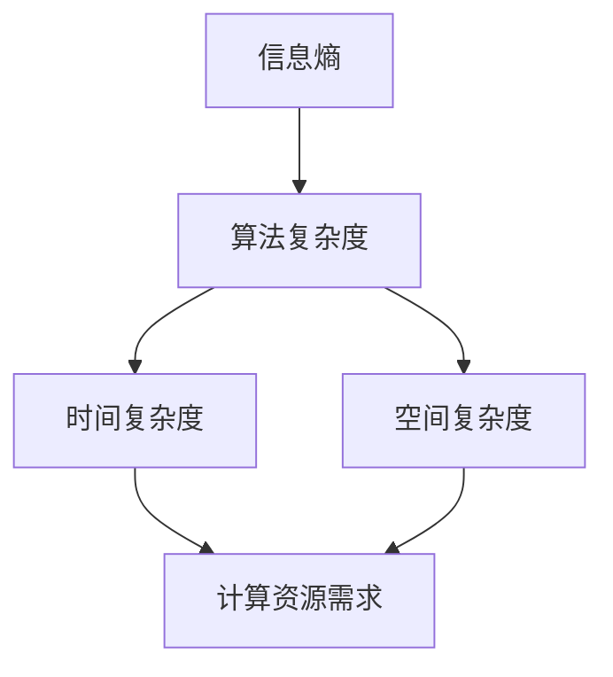

                 

### 1.1 信息熵与算法设计

**背景介绍**

信息熵（Entropy）是热力学中一个基本概念，用于描述系统的混乱程度或不确定性。在20世纪中叶，信息熵的概念被扩展到信息论领域，成为衡量信息量与不确定性的标准。信息熵在算法设计中的应用，使得算法不仅能够在处理问题时表现出高效性，还能够通过优化信息处理方式来提高整个系统的性能。

在算法设计中，信息熵的概念被引入，用以量化数据处理的复杂程度。它揭示了算法处理数据时信息损失的大小，以及如何通过优化算法来减少信息熵，从而达到高效处理数据的目的。信息熵在算法设计中的重要性体现在两个方面：一是通过信息熵分析可以评估算法的性能，二是可以指导算法优化，使其更加高效。

**核心概念与联系**

首先，我们需要明确几个核心概念：

1. **信息熵**：信息熵是用来度量信息不确定性的量，通常用H表示，其计算公式为：
   \[
   H = -\sum p(x) \log_2 p(x)
   \]
   其中，\( p(x) \)表示某事件发生的概率。

2. **算法复杂度**：算法复杂度描述了算法在解决问题时所需要的时间和空间资源，通常分为时间复杂度和空间复杂度。

3. **信息熵与算法复杂度的关系**：信息熵与算法复杂度之间存在密切的联系。一个低信息熵意味着数据具有较高的确定性，处理这类数据时算法的复杂度会较低。相反，高信息熵的数据处理起来较为复杂，需要更多的计算资源。

下面是信息熵、算法复杂度及二者之间关系的 Mermaid 流程图：



**核心算法原理讲解**

算法复杂度分析是算法设计的重要环节，其中时间复杂度与空间复杂度是两个关键指标。以下是一个简单的伪代码，用于计算排序算法的复杂度，并结合信息熵进行解释：

```python
# 伪代码：排序算法的复杂度分析
def sort(arr):
    n = len(arr)
    for i in range(n):
        for j in range(0, n-i-1):
            if arr[j] > arr[j+1]:
                # 信息熵降低，数据排列更加有序
                arr[j], arr[j+1] = arr[j+1], arr[j]
    # 算法的输出
    return arr
```

在这个例子中，我们使用了一个简单的排序算法（如冒泡排序）来演示信息熵与算法复杂度的关系。每次比较和交换都会降低数据的信息熵，使得数据逐渐变得更加有序。随着信息熵的减少，算法的复杂度也会相应降低。

**数学模型和公式**

为了更深入地理解信息熵在算法设计中的应用，我们可以引入香农熵（Shannon Entropy）的数学模型：

\[
H(X) = -\sum_{i=1}^{n} p(x_i) \log_2 p(x_i)
\]

其中，\( p(x_i) \)是随机变量 \( X \) 取第 \( i \) 个值的概率。

**举例说明**

假设我们有一个包含 0 和 1 的随机序列，其中 0 出现的概率为 0.5，1 出现的概率也为 0.5。该序列的香农熵计算如下：

\[
H(X) = - (0.5 \log_2 0.5 + 0.5 \log_2 0.5) = 1
\]

这个结果表示序列的不确定性非常高。如果我们使用一个高效的排序算法，如快速排序，将这个序列排序后，0 和 1 的分布会变得更加确定，信息熵会降低。例如，如果排序后的序列是 `[0, 0, 0, 1]`，其信息熵为：

\[
H(X) = - (0.75 \log_2 0.75 - 0.25 \log_2 0.25) \approx 0.811
\]

通过这个例子，我们可以看到信息熵在算法设计和优化中的重要作用。

**详细讲解与总结**

信息熵在算法设计中的应用主要体现在以下几个方面：

1. **算法性能评估**：通过计算信息熵，可以评估算法处理数据时的复杂度和效率。
2. **算法优化**：优化算法的目标之一是降低信息熵，使得数据处理更加高效。
3. **算法复杂度分析**：信息熵与算法复杂度之间存在一定的关系，通过分析信息熵可以更深入地理解算法的性能。

综上所述，信息熵与算法设计之间的关系是相辅相成的。信息熵为算法设计提供了新的视角和工具，使得算法设计不仅关注算法的效率，还关注算法处理数据的内在结构。通过信息熵的引入，算法设计可以更加科学和全面，从而在复杂多变的数据环境中取得更好的性能。在接下来的章节中，我们将继续探讨宇宙信息熵守恒定律与算法设计之间的关系，以及如何在实践中应用这些理论。

