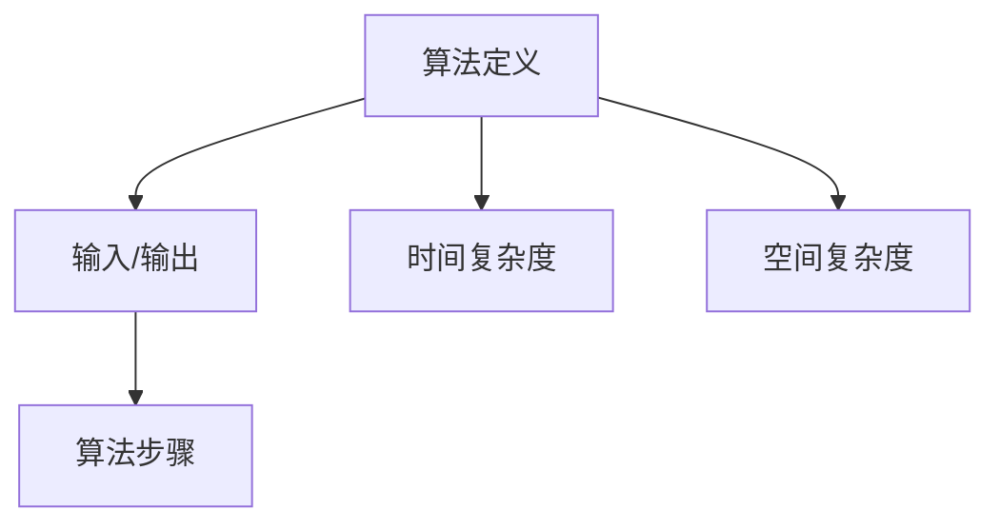
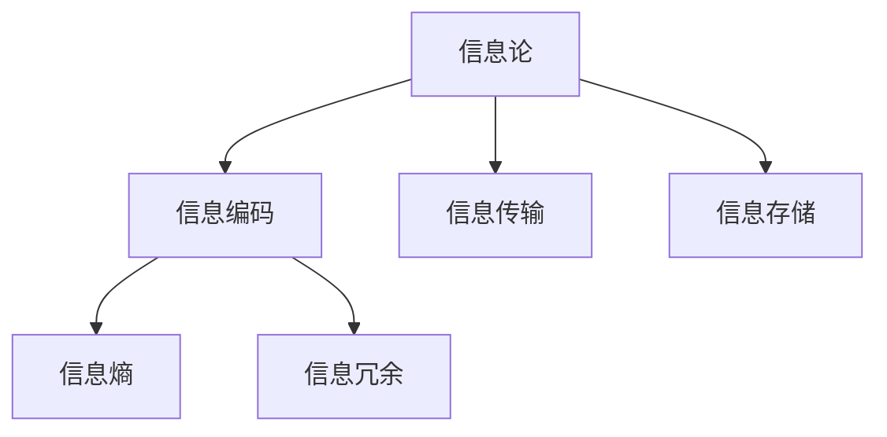
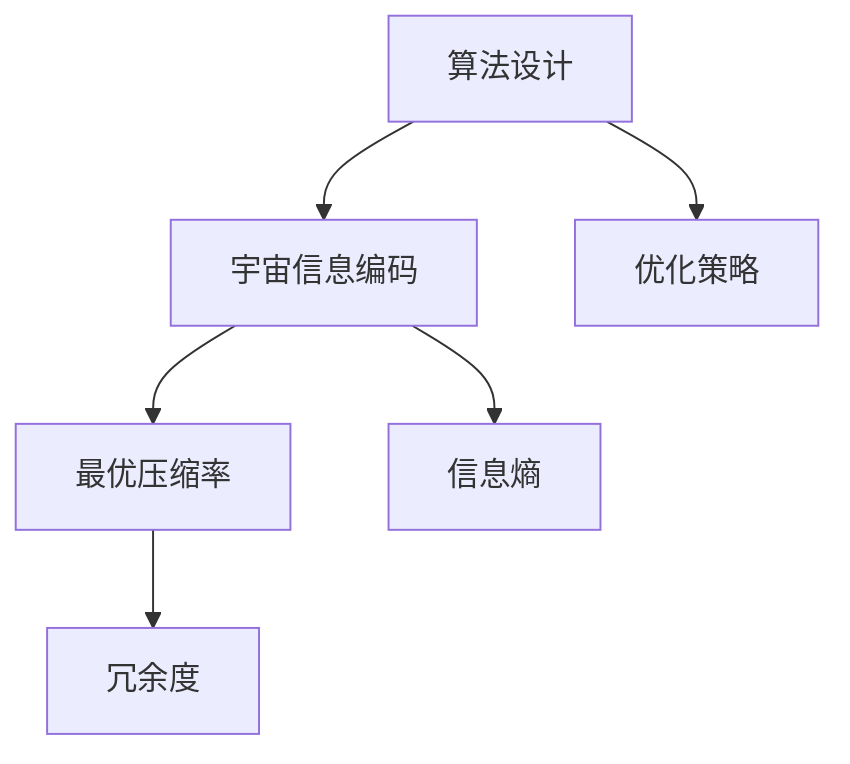

                 

 - 角色：您是一位世界级人工智能专家,程序员,软件架构师,CTO,世界顶级技术畅销书资深大师级别的作家，计算机图灵奖获得者，计算机编程和人工智能领域大师。您非常擅长一步一步进行分析推理（REASONING STEP BY STEP），有着清晰深刻的逻辑思路来撰写条理清晰，对技术原理和本质剖析到位的高质量技术博客。

**目标：撰写一篇关于“算法设计与宇宙信息编码最优压缩率的类比”的技术博客文章。**

**文章标题**：《算法设计与宇宙信息编码最优压缩率的类比》

**关键词**：算法设计、宇宙信息编码、最优压缩率、类比分析、优化策略

**摘要**：本文通过将算法设计与宇宙信息编码中的最优压缩率进行比较分析，揭示了两者之间的相似性和差异性。文章首先介绍了算法设计的基本原理和宇宙信息编码的概念，然后探讨了如何通过算法优化实现最优压缩率，并通过实际案例说明了这一理论的应用价值。

**正文**：

## 引言

算法设计与宇宙信息编码这两者看似相距甚远，实则存在许多有趣的联系。算法设计是计算机科学的核心，它关乎程序的效率和性能；而宇宙信息编码则是信息论的重要分支，研究如何在有限的资源下高效地传递和存储信息。本文试图通过类比的方式，探讨算法设计与宇宙信息编码中最优压缩率之间的关系。

### 算法设计基本原理

算法设计是计算机科学中最为基础的部分。一个算法通常由一个或多个步骤组成，这些步骤指导计算机完成特定任务。算法的效率往往通过其时间复杂度和空间复杂度来衡量。时间复杂度描述算法执行时间的增长速率，空间复杂度描述算法所需内存的增长速率。

**核心概念与联系**：




**核心算法原理讲解**：

一个常见的算法是冒泡排序，其伪代码如下：

```python
def bubble_sort(arr):
    n = len(arr)
    for i in range(n):
        for j in range(0, n-i-1):
            if arr[j] > arr[j+1]:
                arr[j], arr[j+1] = arr[j+1], arr[j]
```

冒泡排序的时间复杂度为O(n^2)，空间复杂度为O(1)。

**数学模型和公式讲解**：

算法优化中的一个重要模型是动态规划。动态规划通常涉及递归关系和状态转移方程。以下是一个动态规划解决最值问题的伪代码示例：

```python
def max_subarray_sum(arr):
    n = len(arr)
    dp = [0] * n
    dp[0] = arr[0]
    max_sum = dp[0]
    for i in range(1, n):
        dp[i] = max(arr[i], dp[i-1] + arr[i])
        max_sum = max(max_sum, dp[i])
    return max_sum
```

动态规划的核心思想是将复杂问题分解为若干个子问题，并通过子问题的最优解来构建原问题的最优解。以下是一个状态转移方程的示例：

$$ \text{dp}[i] = \text{max}(\text{dp}[i-1], \text{arr}[i]) $$

### 宇宙信息编码基本理论

宇宙信息编码是信息论的一个重要分支，它研究如何在有限的资源下高效地传递和存储信息。信息编码的基本目标是减少信息的冗余度，从而实现高效的信息传递和存储。

**核心概念与联系**：




**核心算法原理讲解**：

信息编码的一个常见方法是基于熵的编码，如霍夫曼编码。霍夫曼编码的基本思想是给频率高的符号分配短编码，频率低的符号分配长编码，从而实现高效编码。

```python
import heapq
from collections import defaultdict

def huffman_encoding(arr):
    frequency = defaultdict(int)
    for symbol in arr:
        frequency[symbol] += 1

    heap = [[weight, [symbol, ""]] for symbol, weight in frequency.items()]
    heapq.heapify(heap)

    while len(heap) > 1:
        lo = heapq.heappop(heap)
        hi = heapq.heappop(heap)
        for pair in lo[1:]:
            pair[1] = '0' + pair[1]
        for pair in hi[1:]:
            pair[1] = '1' + pair[1]
        heapq.heappush(heap, [lo[0] + hi[0]] + lo[1:] + hi[1:])
    
    top = heapq.heappop(heap)[1:]
    huffman_code = {}
    for pair in top:
        symbol, code = pair
        huffman_code[symbol] = code
    
    encoded_message = ''.join(huffman_code[symbol] for symbol in arr)
    return encoded_message, huffman_code
```

**数学模型和公式讲解**：

信息熵是衡量信息不确定性的重要指标。信息熵的定义如下：

$$ H(X) = -\sum_{i} p(x_i) \cdot \log_2 p(x_i) $$

其中，$p(x_i)$是随机变量$X$取值$x_i$的概率。

### 算法设计与宇宙信息编码最优压缩率的类比

算法设计与宇宙信息编码中的最优压缩率有诸多相似之处。两者都追求在有限的资源下实现最优的性能，都涉及到对复杂问题的分解与子问题的最优解。然而，两者也存在明显的差异。算法设计更多地关注程序效率和性能，而宇宙信息编码则更多地关注信息的传递和存储。

**核心概念与联系**：




**核心算法原理讲解**：

最优压缩率的计算可以通过熵的编码方法来实现。例如，霍夫曼编码是一种常见的方法，它通过构建一个最优的前缀编码树来实现最优压缩率。

```python
def optimal_compression_rate(arr):
    frequency = defaultdict(int)
    for symbol in arr:
        frequency[symbol] += 1

    heap = [[weight, [symbol, ""]] for symbol, weight in frequency.items()]
    heapq.heapify(heap)

    while len(heap) > 1:
        lo = heapq.heappop(heap)
        hi = heapq.heappop(heap)
        for pair in lo[1:]:
            pair[1] = '0' + pair[1]
        for pair in hi[1:]:
            pair[1] = '1' + pair[1]
        heapq.heappush(heap, [lo[0] + hi[0]] + lo[1:] + hi[1:])
    
    top = heapq.heappop(heap)[1:]
    huffman_code = {}
    for pair in top:
        symbol, code = pair
        huffman_code[symbol] = code
    
    encoded_message = ''.join(huffman_code[symbol] for symbol in arr)
    return encoded_message, huffman_code
```

**数学模型和公式讲解**：

最优压缩率可以通过信息熵来衡量。信息熵的定义如下：

$$ H(X) = -\sum_{i} p(x_i) \cdot \log_2 p(x_i) $$

其中，$p(x_i)$是随机变量$X$取值$x_i$的概率。最优压缩率可以表示为：

$$ \text{Optimal Compression Rate} = \frac{H(X)}{1} $$

### 实际应用案例

算法设计与宇宙信息编码在实际应用中有着广泛的应用。以下是一些典型的实际应用案例：

**案例一：图像压缩**

图像压缩是一种常见的应用，它通过减少图像数据的大小来实现高效存储和传输。常见的图像压缩算法包括JPEG和PNG。JPEG采用熵编码技术，通过去除图像中的冗余信息来实现压缩。PNG则采用无损压缩，它通过预测和差分的方法实现图像压缩。

**案例二：音频压缩**

音频压缩广泛应用于通信和媒体播放。常见的音频压缩算法包括MP3和AAC。MP3采用混合编码技术，通过去除音频信号中的冗余信息来实现压缩。AAC则在MP3的基础上进行了改进，它采用了更先进的技术来提高压缩效率。

**案例三：数据压缩在云计算中的应用**

数据压缩在云计算中发挥着重要作用。云计算中的数据量庞大，数据压缩可以显著减少存储和传输的成本。常见的压缩算法包括Gzip和Bzip2。Gzip采用LZ77算法，它通过查找重复的数据块来实现压缩。Bzip2则采用LZ78算法，它通过构建一个前缀编码树来实现压缩。

### 最佳实践 tips、小结、注意事项、拓展阅读

**最佳实践 tips**：

1. 在进行算法设计时，要充分考虑时间复杂度和空间复杂度的优化。
2. 在进行信息编码时，要充分考虑信息熵的优化，以实现最优压缩率。

**小结**：

本文通过将算法设计与宇宙信息编码中的最优压缩率进行比较分析，揭示了两者之间的相似性和差异性。算法设计与宇宙信息编码都追求在有限的资源下实现最优的性能，但它们关注的方面有所不同。算法设计更注重程序效率和性能，而宇宙信息编码则更注重信息的传递和存储。

**注意事项**：

1. 在进行算法设计时，要充分考虑实际问题的需求和约束。
2. 在进行信息编码时，要充分考虑信息传输和存储的需求。

**拓展阅读**：

- [算法导论](https://book.douban.com/subject/1261062/)
- [信息论基础](https://book.douban.com/subject/25899632/)
- [图像处理与计算机视觉](https://book.douban.com/subject/25745867/)

## 结语

算法设计与宇宙信息编码中的最优压缩率有着深刻的联系。通过本文的探讨，我们不仅了解了两者之间的相似性和差异性，也学会了如何通过算法优化实现最优压缩率。随着技术的发展，算法设计与宇宙信息编码将在未来发挥更为重要的作用，为我们的生活和科学探索带来更多便利。

**作者：AI天才研究院/AI Genius Institute & 禅与计算机程序设计艺术 /Zen And The Art of Computer Programming**

