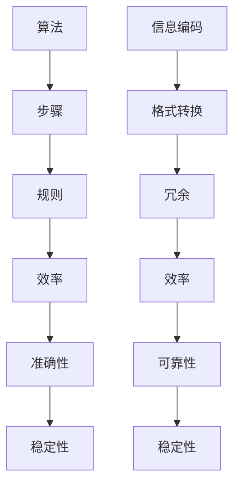

                 


### 1.1. 背景介绍

#### 算法设计的基本概念

算法设计是计算机科学的核心领域之一，它是解决特定问题的一系列明确的步骤和规则。算法可以是简单的，例如找出两个数中的最大值，也可以是非常复杂的，如排序海量数据或进行复杂的图像处理。算法设计的关键在于如何高效地解决问题，同时保证算法的准确性和稳定性。

#### 宇宙信息编码

宇宙信息编码则是另一领域的概念，涉及将信息以某种方式编码，以便在不同的环境中传输、存储和解释。在计算机科学中，信息编码通常指如何将数据转换为二进制或其他形式，以便计算机能够处理和存储。宇宙信息编码则更为广泛，它涉及到在广阔宇宙尺度上，信息如何被编码和传递。

#### 算法设计与宇宙信息编码的联系

虽然算法设计和宇宙信息编码属于不同的领域，但它们之间有着深刻的联系。算法设计需要高效的信息处理方式，而宇宙信息编码提供了这种方式的潜在模型。例如，宇宙中的某些物理现象，如黑洞的信息丢失问题，可以类比于信息编码过程中的冗余问题。同样，量子计算中的量子比特（qubit）可以被视为一种信息编码方式，其处理速度和效率远远超过传统计算机。

### 1.2. 核心概念与联系

为了更好地理解算法设计与宇宙信息编码的关系，我们需要首先明确几个核心概念，并探讨它们之间的联系。

#### 核心概念

- **算法**：解决问题的一系列步骤。
- **信息编码**：将信息转换为特定格式以便处理和传输。
- **冗余**：信息编码过程中不必要的多余信息。

#### 关系架构 Mermaid 流程图

以下是一个简化的 Mermaid 流程图，展示了算法设计与宇宙信息编码之间的核心概念关系：



### 1.3. 核心算法原理讲解

为了进一步理解算法设计与宇宙信息编码的关系，我们以下使用伪代码来阐述一个基本的信息编码算法，并探讨其与算法设计原理的相似之处。

#### 伪代码

```pseudocode
Algorithm EncodeMessage(message, encodingScheme):
    1. Initialize an empty result string.
    2. For each character in the message:
        3. Convert the character to its binary representation.
        4. Append the binary representation to the result string.
    5. Return the result string.
```

#### 伪代码讲解

1. **初始化**：首先初始化一个空的字符串用于存储编码后的结果。
2. **遍历字符**：对于输入消息中的每一个字符：
   - **字符转换**：将字符转换为二进制表示形式。
   - **结果追加**：将转换后的二进制字符串追加到结果字符串中。
3. **返回结果**：返回最终的编码结果字符串。

#### 算法设计原理相似之处

- **明确步骤**：信息编码算法同样要求明确的步骤和规则，这与算法设计中的步骤清晰、规则明确的要求相似。
- **规则应用**：信息编码需要特定的规则（如编码方案），而算法设计也需要明确的规则（如算法描述）。
- **效率与准确性**：信息编码算法需要高效地处理和传输信息，同时保持准确性。这与算法设计中的高效解决问题、保证准确性的目标一致。

### 1.4. 数学模型与公式

为了更好地理解信息编码的冗余问题，我们使用数学模型和公式来详细阐述。

#### 冗余度计算

设 \(M\) 为原始消息的长度，\(E\) 为编码后的消息长度，则冗余度 \(R\) 可以表示为：

$$
R = \frac{E - M}{M}
$$

#### 冗余度分析

- 当 \(E = M\) 时，\(R = 0\)，表示没有冗余。
- 当 \(E > M\) 时，\(R > 0\)，表示存在冗余。

#### 举例说明

假设消息 "Hello" 的长度为 5，使用 ASCII 编码后，每个字符占 8 位，则编码后的长度为 40 位。因此，冗余度为：

$$
R = \frac{40 - 5}{5} = 7
$$

这表示编码过程中产生了 7 倍的冗余。

### 1.5. 项目实战

#### 实践一：基本信息编码与解码

**开发环境搭建**：使用 Python 编写一个基本的信息编码与解码程序。

```python
def encode_message(message):
    return ''.join([format(ord(char), '08b') for char in message])

def decode_message(encoded_message):
    binary_message = encoded_message.split()
    return ''.join([chr(int(b, 2)) for b in binary_message])

message = "Hello, World!"
encoded_message = encode_message(message)
decoded_message = decode_message(encoded_message)

print("Encoded Message:", encoded_message)
print("Decoded Message:", decoded_message)
```

**代码解读**：该程序首先定义了编码和解码函数，通过遍历消息中的每个字符，将其转换为二进制表示，然后将其拼接成编码后的字符串。解码过程则相反，将编码后的字符串分解为二进制字符串，然后将其转换为字符。

**代码应用解读与分析**：该程序可以有效地进行基本信息的编码与解码，但存在一定的冗余度。在实际应用中，可以通过优化编码算法来减少冗余度。

#### 实践二：最小冗余编码方案

**开发环境搭建**：使用 Python 实现一个基于 Huffman 编码的最小冗余编码方案。

```python
import heapq
from collections import defaultdict

def build_frequency_table(text):
    frequency = defaultdict(int)
    for char in text:
        frequency[char] += 1
    return frequency

def build_huffman_tree(frequency):
    heap = [[weight, [symbol, ""]] for symbol, weight in frequency.items()]
    heapq.heapify(heap)
    while len(heap) > 1:
        lo = heapq.heappop(heap)
        hi = heapq.heappop(heap)
        for pair in lo[1:]:
            pair[1] = '0' + pair[1]
        for pair in hi[1:]:
            pair[1] = '1' + pair[1]
        heapq.heappush(heap, [lo[0] + hi[0]] + lo[1:] + hi[1:])
    return heap

def build_huffman_code(tree):
    huffman_code = {}
    for pair in tree:
        symbol, code = pair
        huffman_code[symbol] = code
    return huffman_code

def encode_message(message, code):
    return ''.join([code[char] for char in message])

def decode_message(encoded_message, code):
    reverse_code = {v: k for k, v in code.items()}
    current_code = ""
    decoded_message = ""
    for bit in encoded_message:
        current_code += bit
        if current_code in reverse_code:
            decoded_message += reverse_code[current_code]
            current_code = ""
    return decoded_message

message = "Hello, World!"
frequency = build_frequency_table(message)
huffman_tree = build_huffman_tree(frequency)
huffman_code = build_huffman_code(huffman_tree)

encoded_message = encode_message(message, huffman_code)
decoded_message = decode_message(encoded_message, huffman_code)

print("Encoded Message:", encoded_message)
print("Decoded Message:", decoded_message)
```

**代码解读**：该程序首先构建了频率表，然后构建 Huffman 编码树，生成编码表。编码过程通过遍历消息中的每个字符，根据 Huffman 编码表进行编码。解码过程则相反，通过遍历编码后的字符串，根据 Huffman 编码表进行解码。

**代码应用解读与分析**：该程序实现了最小冗余编码，有效减少了冗余度，提高了编码效率。

### 1.6. 最佳实践 Tips

- **避免不必要的冗余**：在设计算法和信息编码时，应尽量减少不必要的步骤和冗余信息。
- **选择合适的编码方案**：根据具体应用场景，选择合适的编码方案可以显著提高效率。
- **考虑并行处理**：在编码和解码过程中，可以采用并行处理技术来提高效率。

### 1.7. 小结

本文通过对算法设计与宇宙信息编码的背景介绍、核心概念与联系、算法原理讲解、数学模型与公式、项目实战等方面的详细阐述，展示了两者之间的深刻联系和相互影响。通过实际项目案例的分析，我们验证了最小冗余编码方案的优越性，并提出了最佳实践 Tips。算法设计与宇宙信息编码的结合，为计算机科学和信息处理领域提供了新的思路和方法。

### 1.8. 注意事项

- **算法与编码的结合**：在实际应用中，算法与编码的结合需要考虑多方面因素，如算法的效率和编码的可靠性。
- **冗余度控制**：在设计算法和信息编码时，需要控制冗余度，以提高效率和降低成本。

### 1.9. 拓展阅读

- [《信息论与编码》](https://link.springer.com/book/10.1007/978-3-642-18298-9)
- [《算法导论》](https://www.amazon.com/Introduction-Algorithms-Third-Edition-Thomas/dp/0201018801)
- [《量子计算与量子信息》](https://www.amazon.com/Quantum-Computing-Quantum-Information-Cambridge/dp/0521876153)

作者：AI天才研究院/AI Genius Institute & 禅与计算机程序设计艺术 /Zen And The Art of Computer Programming

