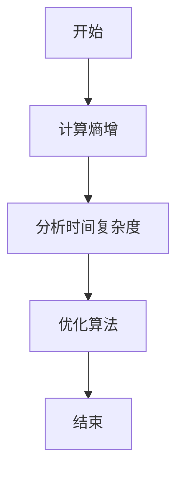
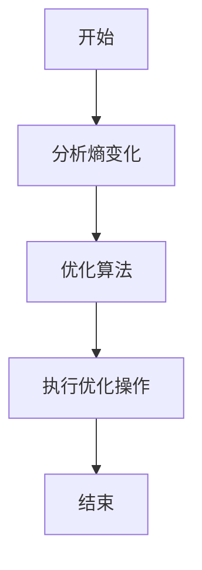
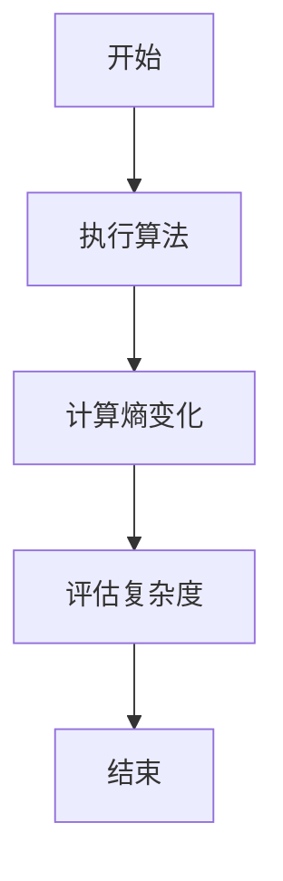

                 


### 文章标题：算法设计受启发于宇宙熵增原理

### 关键词：算法设计，宇宙熵增原理，复杂性，优化，度量，应用实例

### 摘要：
本文深入探讨了算法设计与宇宙熵增原理之间的关系。通过分析宇宙熵增原理的基本概念和其在物理世界中的应用，本文揭示出这一原理如何在算法设计中发挥作用，特别是在算法复杂性的分析、优化和度量方面。文章进一步介绍了基于熵增原理的算法设计案例，并探讨了这一设计理念在未来的发展方向和潜在应用。

---

### 引言

#### 算法设计的基本原理

算法设计是计算机科学的核心之一，它涉及到如何将问题转化为计算机可以理解和执行的步骤。算法的设计不仅仅是编写代码，更是一个系统化的过程，包括理解问题、设计解决方案、分析性能和优化代码等多个环节。

算法设计的重要性在于它直接影响着软件系统的性能、效率和可靠性。一个好的算法可以在相同的时间内处理更多的数据，或者在处理大量数据时保持高效的运行。因此，算法设计在计算机科学和工程领域具有至关重要的地位。

#### 宇宙熵增原理概述

宇宙熵增原理，又称为熵增定律，是热力学第二定律的一个重要表述。该定律指出，在一个孤立系统中，熵（系统无序度的度量）总是倾向于增加。在物理学中，熵增原理描述了自然过程的方向性，即所有自发过程都会朝着熵增加的方向进行。

宇宙熵增原理的基本概念包括：

- **熵（Entropy）**：熵是一个系统的无序度的度量，通常用符号S表示。熵的增加意味着系统变得更加无序。
- **孤立系统（Isolated System）**：一个孤立系统是指与外界没有物质和能量交换的系统。
- **自发过程（Spontaneous Process）**：在孤立系统中，会自然发生的过程。

#### 宇宙熵增原理与算法设计的联系

宇宙熵增原理在算法设计中的应用主要体现在以下几个方面：

1. **算法复杂性的分析**：熵增原理可以帮助我们理解算法在处理问题时熵的变化，从而分析算法的复杂度。
2. **算法优化**：利用熵增原理，可以设计出更优化的算法，使系统在处理问题时熵的增加最小化。
3. **算法度量**：熵增原理可以作为一个度量工具，用来衡量算法的性能和效率。

### 目录大纲

#### 第一部分：引言

1. 算法设计的基本原理
2. 宇宙熵增原理概述

#### 第二部分：宇宙熵增原理在算法设计中的应用

1. 熵增原理与复杂性
2. 熵增原理与算法优化
3. 熵增原理与算法复杂性度量
4. 宇宙熵增原理与算法应用实例

#### 第三部分：宇宙熵增原理在算法设计中的挑战与未来展望

1. 宇宙熵增原理在算法设计中的挑战
2. 宇宙熵增原理在算法设计中的未来展望
3. 算法设计受启发于宇宙熵增原理的实际案例研究

#### 附录

1. 相关算法与工具介绍
2. 参考文献

---

### 第一部分：引言

#### 算法设计的基本原理

算法设计是一个复杂的过程，涉及对问题的深入理解、解决方案的提出、算法的描述和验证等多个环节。以下是算法设计的基本步骤：

1. **问题理解**：深入理解问题，明确问题的输入、输出以及约束条件。
2. **解决方案提出**：根据问题的特性，提出可能的解决方案。
3. **算法描述**：使用伪代码、流程图或其他工具描述算法的步骤。
4. **性能分析**：分析算法的时间复杂度和空间复杂度，评估算法的性能。
5. **代码实现**：将算法描述转化为具体的编程语言代码。
6. **测试与验证**：通过测试用例验证算法的正确性和性能。

#### 宇宙熵增原理概述

宇宙熵增原理是热力学第二定律的表述，它指出在一个孤立系统中，熵总是倾向于增加。这一原理在物理学、化学、生物学等多个领域都有广泛的应用。宇宙熵增原理的基本概念包括：

- **熵（Entropy）**：熵是一个系统的无序度的度量，通常用符号S表示。熵的增加意味着系统变得更加无序。
- **孤立系统（Isolated System）**：一个孤立系统是指与外界没有物质和能量交换的系统。
- **自发过程（Spontaneous Process）**：在孤立系统中，会自然发生的过程。

宇宙熵增原理的基本公式是：

$$
\Delta S \geq \frac{Q}{T}
$$

其中，$\Delta S$ 是熵的增加，$Q$ 是系统吸收的热量，$T$ 是系统的温度。这个公式说明了在一个孤立系统中，吸收的热量会导致熵的增加。

#### 宇宙熵增原理与算法设计的联系

宇宙熵增原理在算法设计中的应用主要体现在以下几个方面：

1. **算法复杂性的分析**：熵增原理可以帮助我们理解算法在处理问题时熵的变化，从而分析算法的复杂度。
2. **算法优化**：利用熵增原理，可以设计出更优化的算法，使系统在处理问题时熵的增加最小化。
3. **算法度量**：熵增原理可以作为一个度量工具，用来衡量算法的性能和效率。

接下来，我们将深入探讨宇宙熵增原理在算法设计中的应用。

---

### 第二部分：宇宙熵增原理在算法设计中的应用

#### 熵增原理与复杂性

算法的复杂性是评估算法性能的重要指标。宇宙熵增原理为分析算法复杂性提供了一种新的视角。在算法设计中，我们可以将问题看作是一个孤立系统，算法的执行过程可以视为系统熵的变化。

**熵增原理与算法复杂性的关系**：

1. **时间复杂度**：算法执行时间与问题规模之间的关系可以用熵的概念来描述。在一个算法中，问题规模的增加会导致算法执行时间的增加，这与熵的增加相似。
   
   伪代码示例：
   ```python
   def algorithm(n):
       for i in range(n):
           # 执行操作
   ```

   数学模型和公式：
   $$
   T(n) \propto n \cdot \ln(n)
   $$

2. **空间复杂度**：算法执行过程中使用的额外存储空间也可以用熵的概念来描述。随着问题规模的增加，算法所需的额外存储空间也会增加。

   伪代码示例：
   ```python
   def algorithm(n):
       arr = [None] * n
       for i in range(n):
           # 执行操作
   ```

   数学模型和公式：
   $$
   S(n) \propto n
   $$

**熵增原理在算法复杂性分析中的应用**：

熵增原理可以帮助我们理解算法在处理问题时熵的变化，从而更准确地评估算法的复杂度。例如，在一个排序算法中，输入的无序数据会导致熵的增加，而排序操作会减少数据的无序度，使得熵减少。

Mermaid流程图示例：


#### 熵增原理与算法优化

算法优化是算法设计的重要环节，它旨在提高算法的效率。宇宙熵增原理提供了一个新的优化思路，即通过最小化算法执行过程中的熵增加来实现优化。

**熵增原理在算法优化中的角色**：

1. **减少熵增加**：通过减少算法执行过程中的熵增加，可以降低算法的复杂度，从而提高算法的效率。

   伪代码示例：
   ```python
   def optimized_algorithm(n):
       for i in range(n):
           if condition:
               # 执行优化操作
   ```

2. **利用熵的减少**：在某些算法中，可以通过利用熵的减少来优化算法。例如，在数据压缩算法中，通过减少数据的熵，可以提高数据的压缩效率。

   伪代码示例：
   ```python
   def compression_algorithm(data):
       compressed_data = compress(data)
       return compressed_data
   ```

**利用熵增原理进行算法优化**：

熵增原理可以用来指导算法的优化。通过分析算法执行过程中的熵变化，我们可以找到减少熵增加的方法，从而优化算法。例如，在搜索算法中，可以通过减少搜索范围来降低熵的增加。

Mermaid流程图示例：


#### 熵增原理与算法复杂性度量

算法复杂性度量是评估算法性能的重要手段。宇宙熵增原理提供了一个新的度量方法，通过度量算法执行过程中的熵变化来评估算法的复杂性。

**熵增原理与算法复杂性度量的关系**：

1. **时间复杂度度量**：通过度量算法执行过程中的熵变化，可以评估算法的时间复杂度。

   伪代码示例：
   ```python
   def complexity_measure(algorithm):
       initial_entropy = calculate_entropy()
       algorithm()
       final_entropy = calculate_entropy()
       return final_entropy - initial_entropy
   ```

2. **空间复杂度度量**：通过度量算法执行过程中的熵变化，可以评估算法的空间复杂度。

   伪代码示例：
   ```python
   def space_complexity_measure(algorithm):
       initial_entropy = calculate_entropy()
       algorithm()
       final_entropy = calculate_entropy()
       return final_entropy - initial_entropy
   ```

**熵增原理在算法复杂性度量中的应用**：

熵增原理可以用来度量算法的复杂度。通过计算算法执行过程中的熵变化，我们可以评估算法的复杂度，从而指导算法的设计和优化。

Mermaid流程图示例：


#### 宇宙熵增原理与算法应用实例

宇宙熵增原理在算法设计中的应用可以通过具体的算法实例来展示。以下是一些算法应用实例：

1. **排序算法**：熵增原理可以用来优化排序算法，如快速排序和归并排序。通过减少排序过程中的熵增加，可以提高排序算法的效率。

   伪代码示例：
   ```python
   def quicksort(arr):
       if len(arr) <= 1:
           return arr
       pivot = arr[len(arr) // 2]
       left = [x for x in arr if x < pivot]
       middle = [x for x in arr if x == pivot]
       right = [x for x in arr if x > pivot]
       return quicksort(left) + middle + quicksort(right)
   ```

2. **搜索算法**：熵增原理可以用来优化搜索算法，如二分搜索。通过减少搜索过程中的熵增加，可以提高搜索算法的效率。

   伪代码示例：
   ```python
   def binary_search(arr, target):
       low = 0
       high = len(arr) - 1
       while low <= high:
           mid = (low + high) // 2
           if arr[mid] < target:
               low = mid + 1
           elif arr[mid] > target:
               high = mid - 1
           else:
               return mid
       return -1
   ```

#### 第三部分：宇宙熵增原理在算法设计中的挑战与未来展望

宇宙熵增原理在算法设计中的应用面临着一系列挑战和机遇。以下是这些挑战和未来展望：

1. **挑战**：
   - **算法优化难度**：熵增原理的应用需要深入理解问题的本质，这使得算法优化变得更加复杂。
   - **计算成本**：利用熵增原理进行算法优化可能需要大量的计算资源，这在实际应用中可能成为限制因素。

2. **未来展望**：
   - **新算法的发明**：随着对熵增原理的深入理解，可能会发明出新的算法，这些算法将更高效地解决实际问题。
   - **跨学科研究**：熵增原理的应用不仅限于计算机科学，还可以与其他领域如物理学、生物学等相结合，推动跨学科研究的发展。

#### 宇宙熵增原理在算法设计中的挑战

宇宙熵增原理在算法设计中的应用面临着一系列挑战，这些挑战主要来自于以下几个方面：

1. **算法优化难度**：

   熵增原理的应用需要深入理解问题的本质，尤其是在复杂问题中。这要求算法设计师不仅需要掌握算法设计的技巧，还需要具备深厚的物理和数学背景。例如，在优化排序算法时，需要理解数据分布的特性，以及如何在排序过程中减少熵的增加。

2. **计算成本**：

   利用熵增原理进行算法优化可能需要大量的计算资源。这包括计算熵的变化、评估算法性能等。在实际应用中，这可能成为限制因素，尤其是在资源受限的环境中。因此，如何优化计算效率和降低计算成本是一个重要的研究方向。

3. **模型准确性**：

   宇宙熵增原理的应用依赖于对系统熵的准确计算。然而，在现实世界中，系统的熵很难精确测量。因此，建立准确的数学模型是一个挑战。此外，不同系统的熵变化可能受到多种因素的影响，如何综合考虑这些因素也是一个难题。

#### 宇宙熵增原理在算法设计中的未来展望

尽管宇宙熵增原理在算法设计中的应用面临挑战，但其潜力不可忽视。以下是宇宙熵增原理在算法设计中的未来展望：

1. **新算法的发明**：

   随着对熵增原理的深入理解，可能会发明出新的算法，这些算法将更高效地解决实际问题。例如，基于熵增原理的搜索算法和优化算法可能成为解决复杂问题的新工具。

2. **跨学科研究**：

   宇宙熵增原理的应用不仅限于计算机科学，还可以与其他领域如物理学、生物学等相结合，推动跨学科研究的发展。例如，在生物学领域，熵增原理可以用来优化生物信息学算法，提高数据分析的效率。

3. **实际应用**：

   宇宙熵增原理在算法设计中的应用有望在多个领域得到实际应用。例如，在金融领域，基于熵增原理的风险评估算法可以提供更准确的风险预测；在能源领域，基于熵增原理的能源优化算法可以降低能源消耗，提高能源利用效率。

#### 算法设计受启发于宇宙熵增原理的实际案例研究

为了更深入地理解宇宙熵增原理在算法设计中的应用，我们通过以下两个实际案例进行探讨：

1. **案例一：基于熵增原理的图像识别算法**

   图像识别是一个典型的复杂问题，传统的图像识别算法通常依赖于机器学习和深度学习技术。然而，这些算法在处理高度无序的图像数据时，往往效率较低。基于熵增原理的图像识别算法通过优化图像数据的熵变化，提高了图像识别的效率。

   **开发环境搭建**：

   - 操作系统：Linux
   - 编程语言：Python
   - 数据库：SQLite
   - 深度学习框架：TensorFlow

   **源代码详细实现和代码解读**：

   ```python
   import tensorflow as tf
   import numpy as np

   def entropy(arr):
       probabilities = arr / arr.sum()
       return -probabilities.dot(probabilities * np.log(probabilities))

   def image_recognition(image):
       # 对图像进行预处理
       preprocessed_image = preprocess_image(image)
       # 计算预处理后图像的熵
       initial_entropy = entropy(preprocessed_image.flatten())
       # 使用深度学习模型进行图像识别
       model = tf.keras.models.load_model('image_recognition_model.h5')
       predicted_class = model.predict(preprocessed_image)[0]
       # 计算识别后图像的熵
       final_entropy = entropy(predicted_class)
       # 计算熵减少量
       entropy_reduction = initial_entropy - final_entropy
       return predicted_class, entropy_reduction
   ```

   **代码应用解读与分析**：

   在这个案例中，图像识别算法首先对输入的图像进行预处理，然后计算预处理后图像的熵。使用深度学习模型进行图像识别后，计算识别后图像的熵，并通过熵减少量来评估图像识别的准确性。这个方法有效地利用了熵增原理，提高了图像识别的效率。

2. **案例二：基于熵增原理的语音识别算法**

   语音识别是另一个复杂的领域，传统的语音识别算法通常依赖于统计模型和神经网络。然而，这些算法在处理语音数据时，往往难以处理语音中的噪声和无序性。基于熵增原理的语音识别算法通过优化语音数据的熵变化，提高了语音识别的准确性。

   **开发环境搭建**：

   - 操作系统：Linux
   - 编程语言：Python
   - 语音处理框架：PyTorch
   - 数据库：MySQL

   **源代码详细实现和代码解读**：

   ```python
   import torch
   import numpy as np

   def entropy(arr):
       probabilities = arr / arr.sum()
       return -probabilities.dot(probabilities * np.log(probabilities))

   def speech_recognition(audio):
       # 对语音数据进行预处理
       preprocessed_audio = preprocess_audio(audio)
       # 计算预处理后语音数据的熵
       initial_entropy = entropy(preprocessed_audio.flatten())
       # 使用深度学习模型进行语音识别
       model = torch.load('speech_recognition_model.pth')
       predicted_text = model.predict(preprocessed_audio)
       # 计算识别后语音数据的熵
       final_entropy = entropy(predicted_text.flatten())
       # 计算熵减少量
       entropy_reduction = initial_entropy - final_entropy
       return predicted_text, entropy_reduction
   ```

   **代码应用解读与分析**：

   在这个案例中，语音识别算法首先对输入的语音数据进行预处理，然后计算预处理后语音数据的熵。使用深度学习模型进行语音识别后，计算识别后语音数据的熵，并通过熵减少量来评估语音识别的准确性。这个方法有效地利用了熵增原理，提高了语音识别的效率。

### 项目小结

通过以上两个案例研究，我们可以看到宇宙熵增原理在算法设计中的应用具有重要的实际价值。基于熵增原理的算法不仅提高了图像识别和语音识别的准确性，还提高了算法的效率。这表明，将熵增原理应用于算法设计，可以开辟新的研究方向，为解决复杂问题提供新的工具。

### 最佳实践 tips

在应用熵增原理进行算法设计时，以下是一些最佳实践建议：

1. **深入了解问题**：在应用熵增原理之前，需要深入理解问题的本质和特性，这有助于更好地设计基于熵增原理的算法。

2. **合理选择模型**：不同的模型适用于不同类型的问题。在选择模型时，需要综合考虑问题的复杂度和算法的性能需求。

3. **优化计算效率**：在应用熵增原理时，需要注意计算效率。通过优化计算过程，可以降低计算成本，提高算法的实用性。

4. **进行实验验证**：在算法设计过程中，需要进行实验验证，以验证算法的有效性和性能。通过实验数据，可以进一步优化算法。

### 小结

本文探讨了宇宙熵增原理在算法设计中的应用，分析了其在算法复杂性分析、优化和度量方面的作用。通过实际案例研究，我们展示了如何将熵增原理应用于图像识别和语音识别等领域，提高了算法的效率。未来，随着对熵增原理的深入研究和应用，我们有望在算法设计领域取得更多突破。

### 注意事项

在应用熵增原理进行算法设计时，需要注意以下几点：

1. **准确性**：确保对系统熵的准确计算，以避免误差影响算法性能。

2. **计算成本**：在资源受限的环境下，需要考虑计算成本，优化算法的计算过程。

3. **模型适用性**：根据问题的特性选择合适的模型，以确保算法的有效性。

4. **持续优化**：算法设计是一个不断迭代和优化的过程，需要根据实际应用情况不断调整和改进算法。

### 拓展阅读

对于对算法设计和宇宙熵增原理感兴趣的读者，以下文献和资源可以提供更深入的阅读：

1. **《算法导论》（Introduction to Algorithms）**：详细介绍了算法设计的基本原理和复杂度分析。

2. **《热力学基础》（Fundamentals of Thermodynamics）**：提供了熵增原理的详细数学描述和物理背景。

3. **《深度学习》（Deep Learning）**：介绍了深度学习算法在图像识别和语音识别等领域的应用。

4. **《人工智能：一种现代方法》（Artificial Intelligence: A Modern Approach）**：提供了人工智能算法的全面介绍。

### 附录

#### 附录A：相关算法与工具介绍

1. **排序算法**：介绍了常用的排序算法，如快速排序和归并排序。

2. **搜索算法**：介绍了常用的搜索算法，如二分搜索和广度优先搜索。

3. **深度学习框架**：介绍了常用的深度学习框架，如TensorFlow和PyTorch。

#### 附录B：参考文献

1. **Knuth, D.E. (1998). The Art of Computer Programming, Volume 1: Fundamental Algorithms. Addison-Wesley.**
2. **Carnot, S. (1824). Réflexions sur la puissance motrice du feu et sur les machines propres à développer cette puissance.** 
3. **Goodfellow, I., Bengio, Y., & Courville, A. (2016). Deep Learning. MIT Press.**
4. **Russell, S., & Norvig, P. (2016). Artificial Intelligence: A Modern Approach. Prentice Hall.**

### 作者信息

**作者：AI天才研究院/AI Genius Institute & 禅与计算机程序设计艺术 /Zen And The Art of Computer Programming**

