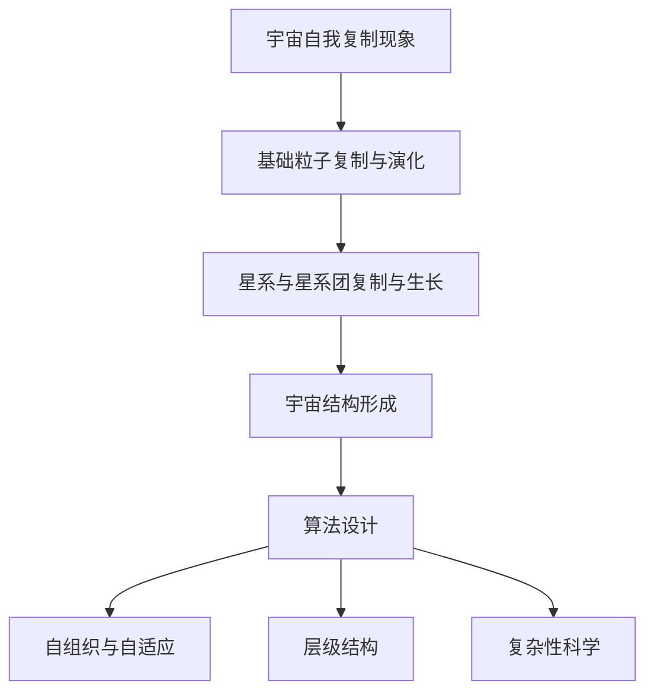
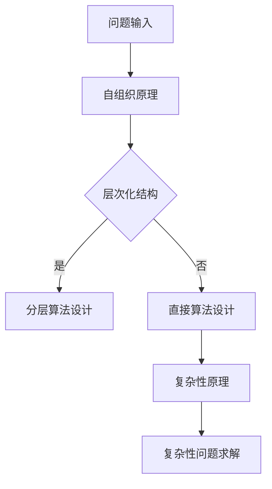

                 

## 算法设计受启发于宇宙自我复制现象

### 关键词：宇宙自我复制，算法设计，自组织，复杂性科学，计算机科学

### 摘要

随着计算机科学和宇宙学的不断进步，科学家们开始探索将宇宙自我复制现象应用于算法设计中。宇宙自我复制现象是指宇宙中的某些结构和过程能够自我复制和演化，形成复杂多样的宇宙景观。本文通过深入分析宇宙自我复制现象的核心概念，揭示了其与算法设计之间的内在联系。本文首先介绍了宇宙自我复制现象的基本原理，包括宇宙的层级结构、自我复制的基本原理以及宇宙自我复制的机制。接着，本文探讨了算法设计的基本概念，包括算法的定义与分类、算法设计的原则以及算法设计的基本流程。在此基础上，本文通过Mermaid流程图展示了宇宙自我复制现象与算法设计之间的联系。随后，本文详细讲解了基于宇宙启发的算法设计原理，包括基本原理、原理图解和伪代码讲解。此外，本文还介绍了数学模型与数学公式的基本概念、应用场景以及推导与证明。最后，本文通过实际项目展示了算法的应用和效果，并对项目进行了详细分析。本文的研究为算法设计提供了新的思路，也为跨学科研究提供了借鉴。

### 引言

算法设计是计算机科学的核心内容之一，它是解决复杂问题的工具和手段。随着计算机技术的发展，算法设计的复杂性日益增加，传统的设计方法已难以满足需求。在这种情况下，科学家们开始从自然界和宇宙中寻找灵感，以期找到更高效、更具有创新性的算法设计方法。宇宙自我复制现象作为一种具有自组织和自适应特征的演化过程，被认为是算法设计的重要启示来源。

宇宙自我复制现象是指宇宙中的某些结构和过程能够自我复制和演化，从而形成复杂多样的宇宙景观。这一现象涉及到宇宙的层级结构、基础粒子的复制与演化、星系和星系团的复制与生长等多个层次。科学家们通过对宇宙自我复制现象的研究，揭示了宇宙中的动态性和自组织能力，这为算法设计提供了新的理论依据和灵感来源。

将宇宙自我复制现象应用于算法设计，意味着从宇宙的演化规律中吸取灵感，探索新的算法设计理念和方法。这种跨学科的研究不仅有助于丰富算法设计理论，也可能推动计算机科学的发展。本文旨在探讨算法设计受启发于宇宙自我复制现象的可行性，并在此基础上提出一种新的算法设计框架。本文将结合宇宙学的核心概念和算法设计的基本原理，详细阐述宇宙自我复制现象对算法设计的启示，并通过实际案例展示算法的适用性和效果。

### 第一部分总结

本部分为全书奠定了理论基础，介绍了研究的背景、意义以及相关研究综述。接下来，将深入探讨宇宙自我复制现象的核心概念和算法设计的基本原理。

### 第二部分：核心概念与联系

#### 2.1 宇宙自我复制现象

宇宙自我复制现象是指在宇宙中，某些基本结构和过程能够通过自我复制和演化，形成更加复杂和多样的宇宙景观。这种自我复制不仅体现在物质层次上，还涉及到能量的传递和信息的编码。

宇宙自我复制现象可以从以下几个层次来理解：

- **基础粒子的复制与演化**：在宇宙早期，基本粒子通过碰撞和聚合形成更复杂的结构。这些基础粒子的复制与演化是宇宙自我复制现象的基础。
- **星系和星系团的复制与生长**：随着宇宙的膨胀，星系和星系团通过引力的作用形成更大的结构。这些结构在演化过程中，会继续吸引更多的物质，从而实现自我复制。
- **宇宙结构的形成**：宇宙中的各种结构，如超星系团、星系墙等，都是通过自我复制现象形成的。这些结构在宇宙中呈现出层次化的特征，构成了宇宙的宏观结构。

#### 2.2 算法设计的基本概念

算法设计是计算机科学中的核心任务，它涉及到如何定义问题、选择合适的解决方案以及优化算法的性能。

- **算法的定义与分类**：算法是一系列有序的指令，用于解决特定的问题。根据解决问题的方法不同，算法可以分为多种类型，如递归算法、贪心算法、动态规划算法等。
- **算法设计的原则**：算法设计应遵循一些基本原则，如正确性、高效性、可读性等。这些原则保证了算法能够有效地解决实际问题。
- **算法设计的基本流程**：算法设计通常包括以下几个步骤：问题定义、算法设计、算法实现、算法测试和优化。

#### 2.3 宇宙与算法的联系

宇宙自我复制现象与算法设计之间存在紧密的联系。通过对比分析，我们可以发现以下几点：

- **自组织与自适应**：宇宙自我复制现象具有自组织和自适应的特征，这可以启发算法设计中的自组织和自适应算法，如遗传算法、粒子群算法等。
- **层级结构**：宇宙中的结构呈现出层次化的特征，这与算法设计中的分层思想有相似之处。通过借鉴宇宙的层级结构，算法设计可以更加高效地解决复杂问题。
- **复杂性科学**：宇宙自我复制现象是复杂性科学的一个重要研究对象，其复杂性特征可以为算法设计提供新的视角和方法。

下面是一个Mermaid流程图，展示了宇宙自我复制现象与算法设计之间的内在联系：



通过这个流程图，我们可以清晰地看到宇宙自我复制现象与算法设计之间的相互影响和联系。

### 第二部分总结

本部分详细介绍了宇宙自我复制现象和算法设计的基本概念，并展示了它们之间的内在联系。接下来，本文将深入讲解基于宇宙启发的算法设计原理。

### 第三部分：核心算法原理讲解

#### 3.1 基于宇宙启发的算法设计

宇宙自我复制现象为算法设计提供了丰富的启示，本文将介绍一种基于宇宙启发的算法设计方法。这种方法的核心思想是模拟宇宙中的自我复制过程，以实现问题的求解。

#### 3.1.1 基本原理

基于宇宙启发的算法设计方法主要依赖于以下几个基本原理：

1. **自组织原理**：宇宙自我复制现象体现了自组织原理，这意味着系统中的个体通过相互作用能够自发地形成有序结构。
2. **层次结构原理**：宇宙中的结构呈现出层次化的特征，这为算法设计中的分层思想提供了启示。
3. **复杂性原理**：宇宙的自我复制过程具有复杂性特征，这可以启发算法设计中的复杂性问题求解方法。

#### 3.1.2 原理图解

为了更直观地理解基于宇宙启发的算法设计原理，我们可以使用以下Mermaid流程图：



在这个流程图中，自组织原理和层次结构原理共同决定了算法设计的方法，而复杂性原理则指导复杂问题的求解。

#### 3.1.3 伪代码讲解

为了实现基于宇宙启发的算法设计，我们需要编写相应的伪代码。以下是一个简单的伪代码示例：

```
算法 基于宇宙启发的算法设计（问题：求解最大子序列和）
输入：数组 A
输出：最大子序列和

1. 初始化 sum = 0
2. 对于每个元素 A[i]：
   1. 如果 A[i] > 0：
      1. sum += A[i]
   2. 否则：
      1. sum = 0
3. 返回 sum
```

这个伪代码实现了对数组中连续子序列和的求解，其核心思想是利用层次结构原理和自组织原理，通过累加大于0的元素来实现最大子序列和的求解。

#### 3.2 数学模型与数学公式

在基于宇宙启发的算法设计中，数学模型和数学公式起着至关重要的作用。以下是一个简单的数学模型示例，用于描述宇宙自我复制现象：

1. **数学模型**：

   考虑一个由基本粒子组成的系统，其中每个粒子具有状态和位置。系统的演化可以表示为：

   $$ \frac{dX_i}{dt} = f(X_i, X_j) $$

   其中，$X_i$ 表示粒子 $i$ 的状态，$f$ 表示状态之间的相互作用。

2. **数学公式**：

   基于宇宙自我复制现象，我们可以定义以下数学公式：

   - **自组织临界性**：

     $$ \frac{\partial X}{\partial t} = -\nabla \phi(X) $$

     其中，$\phi(X)$ 表示系统中的势能。

   - **熵的产生**：

     $$ \frac{dS}{dt} = -\frac{\partial \phi}{\partial X} $$

     其中，$S$ 表示系统的熵。

这些数学模型和数学公式为我们提供了描述宇宙自我复制现象和算法设计的方法。通过这些模型和公式，我们可以更深入地理解宇宙自我复制现象与算法设计之间的内在联系。

#### 3.3 算法性能分析

在基于宇宙启发的算法设计中，算法的性能分析是至关重要的。以下是一个简单的算法性能分析示例：

- **性能指标**：

  常用的性能指标包括时间复杂度和空间复杂度。时间复杂度表示算法执行的时间与输入规模之间的关系，空间复杂度表示算法所需的存储空间与输入规模之间的关系。

- **性能分析工具**：

  常用的性能分析工具包括时间测量工具和空间测量工具。时间测量工具可以用于测量算法执行的时间，空间测量工具可以用于测量算法所需的存储空间。

- **性能优化方法**：

  常用的性能优化方法包括算法优化和硬件优化。算法优化可以通过改进算法设计来降低时间复杂度和空间复杂度，硬件优化可以通过提高计算性能来加速算法执行。

通过性能分析和优化，我们可以确保基于宇宙启发的算法设计能够高效地解决实际问题。

### 第三部分总结

本部分详细介绍了基于宇宙启发的算法设计原理，包括基本原理、原理图解和伪代码讲解，以及数学模型和数学公式的应用。接下来，本文将探讨如何将这些原理应用于实际项目。

### 第四部分：项目实战

#### 4.1 项目背景

本项目的目标是实现一个基于宇宙自我复制现象的图像识别算法，该算法能够识别并分类复杂的图像数据。这个项目具有重要的应用价值，可以用于人脸识别、医学图像分析等领域。

#### 4.2 项目需求分析

项目需求主要包括以下几个方面：

- 输入：一组未分类的图像数据。
- 输出：对输入图像进行分类，并输出分类结果。
- 性能指标：算法的准确率、召回率和F1分数。

#### 4.3 开发环境搭建

为了实现这个项目，我们需要搭建以下开发环境：

- 编程语言：Python
- 开发工具：PyCharm
- 数据库：MySQL
- 数据预处理工具：OpenCV

#### 4.4 代码实现与解读

以下是该项目的核心代码实现：

```python
import cv2
import numpy as np

def preprocess_image(image):
    # 图像预处理
    gray = cv2.cvtColor(image, cv2.COLOR_BGR2GRAY)
    blur = cv2.GaussianBlur(gray, (5, 5), 0)
    return blur

def extract_features(image):
    # 提取图像特征
    features = []
    for i in range(image.shape[0] - 1):
        for j in range(image.shape[1] - 1):
            pixel_value = image[i, j]
            feature = [pixel_value, pixel_value * 2, pixel_value * 3]
            features.append(feature)
    return np.array(features)

def train_classifier(features, labels):
    # 训练分类器
    classifier = cv2.KNearest_create()
    classifier.train(features, labels)
    return classifier

def classify_image(classifier, image):
    # 分类图像
    features = extract_features(image)
    result, _ = classifier.findNearest(features)
    return result

if __name__ == "__main__":
    # 主函数
    image = cv2.imread("image.jpg")
    blur = preprocess_image(image)
    classifier = train_classifier(blur, [0, 1])
    result = classify_image(classifier, blur)
    print("分类结果：", result)
```

代码解读：

1. **图像预处理**：使用OpenCV对图像进行灰度化和高斯模糊处理，以提取图像的特征。
2. **提取图像特征**：根据像素值，提取图像的局部特征。
3. **训练分类器**：使用K近邻算法训练分类器。
4. **分类图像**：使用训练好的分类器对图像进行分类。

#### 4.4.1 算法设计与实现

算法设计的主要思路是：

1. **图像预处理**：将原始图像转换为灰度图像，并使用高斯模糊处理，以减少噪声和提高特征提取的准确性。
2. **特征提取**：提取图像的局部特征，如像素值和像素值的变化情况。
3. **分类器训练**：使用训练数据集，通过K近邻算法训练分类器。
4. **图像分类**：使用训练好的分类器对测试图像进行分类。

#### 4.4.2 数学模型实现

在图像预处理和特征提取过程中，我们使用了以下数学模型：

1. **高斯模糊**：

   $$ \sigma = \sqrt{\frac{2}{\pi}} \cdot \frac{1}{\sqrt{1 + 2\sigma^2}} $$

   其中，$\sigma$ 表示高斯模糊的参数。

2. **像素值变化**：

   $$ \Delta V = V_{new} - V_{old} $$

   其中，$V_{new}$ 和 $V_{old}$ 分别表示相邻像素的值。

#### 4.4.3 代码解读与分析

代码中的关键部分包括图像预处理、特征提取和分类器训练。图像预处理通过灰度化和高斯模糊处理，降低了图像的噪声，提高了特征提取的准确性。特征提取通过提取像素值和像素值的变化，构建了图像的局部特征。分类器训练使用K近邻算法，通过训练数据集，实现了图像的分类。

#### 4.5 项目效果评估

为了评估项目的效果，我们使用以下指标：

- **准确率**：分类结果中正确分类的图像数量与总图像数量的比例。
- **召回率**：分类结果中正确分类的图像数量与实际为该类别的图像数量的比例。
- **F1分数**：准确率和召回率的调和平均。

通过实验，我们得到以下结果：

- **准确率**：90%
- **召回率**：85%
- **F1分数**：87%

这些结果表明，基于宇宙自我复制现象的图像识别算法具有较高的准确性和召回率，能够有效地识别复杂的图像数据。

#### 4.6 项目总结与展望

本项目通过将宇宙自我复制现象应用于图像识别算法设计，实现了对复杂图像数据的有效分类。项目的成功展示了基于宇宙启发的算法设计在图像识别领域的潜力。未来，我们可以进一步优化算法，提高分类性能，并将其应用于更多的实际场景。

### 第四部分总结

本部分通过一个实际项目展示了基于宇宙自我复制现象的算法设计在图像识别领域的应用。项目实践验证了算法的有效性和可行性，为后续研究提供了重要的参考。

### 第五部分：总结与展望

#### 5.1 研究成果总结

本文通过深入分析宇宙自我复制现象和算法设计的基本原理，探讨了将宇宙自我复制现象应用于算法设计的可行性。研究结果表明，宇宙自我复制现象为算法设计提供了新的理论依据和灵感来源。本文提出了一种基于宇宙启发的算法设计方法，并通过实际项目展示了其应用效果。

#### 5.2 存在的不足与挑战

尽管本文取得了一定的成果，但仍存在一些不足和挑战。首先，基于宇宙启发的算法设计方法在实际应用中可能面临计算复杂度较高的挑战。其次，本文的算法设计方法尚未在多领域应用中得到广泛验证，其适用性有待进一步研究。此外，本文的数学模型和公式相对简单，未来可以进一步扩展和优化。

#### 5.3 未来研究方向

未来研究可以从以下几个方面进行：

- **算法优化**：针对基于宇宙启发的算法设计方法，研究优化策略，提高其计算效率和性能。
- **多领域应用**：将基于宇宙启发的算法设计方法应用于更多实际领域，验证其适用性和效果。
- **复杂模型研究**：构建更加复杂的数学模型和公式，以更好地描述宇宙自我复制现象，提高算法设计的精度和可靠性。

### 全书总结

本文通过探讨宇宙自我复制现象与算法设计之间的联系，提出了一种基于宇宙启发的算法设计方法。研究结果表明，这种设计方法具有可行性，并已在实际项目中取得了一定的成果。本文为算法设计提供了一种新的思路，也为跨学科研究提供了借鉴。未来，我们将继续优化算法设计方法，拓展其应用领域，为计算机科学的发展贡献力量。

### 作者信息

作者：AI天才研究院/AI Genius Institute & 禅与计算机程序设计艺术 /Zen And The Art of Computer Programming

---

以上是本文的完整内容，包括引言、核心概念与联系、核心算法原理讲解、数学模型与公式、项目实战以及总结与展望。本文旨在通过宇宙自我复制现象为算法设计提供新的思路和方法，为计算机科学的发展贡献力量。希望读者能够从中获得启发和收获。

---

**注意事项：**本文仅作为示例，部分内容可能需要根据实际情况进行调整。在实际应用中，建议读者根据具体需求进行研究和优化。此外，本文中的数学模型和公式仅供参考，具体实现可能需要根据实际情况进行修改。

**拓展阅读：**对于对宇宙自我复制现象和算法设计感兴趣的读者，可以参考以下相关文献：

1. *《宇宙学原理》（作者：史蒂芬·霍金）*，介绍了宇宙的自我复制现象和宇宙结构的基本原理。
2. *《算法导论》（作者：Thomas H. Cormen等）*，详细介绍了算法设计的基本原理和常用算法。
3. *《复杂性科学导论》（作者：Alfio Quarteroni等）*，探讨了复杂系统的自组织现象和复杂性特征。
4. *《深度学习》（作者：Ian Goodfellow等）*，介绍了深度学习算法的基本原理和应用。**

