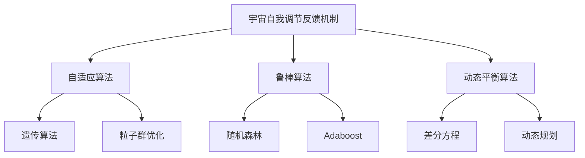
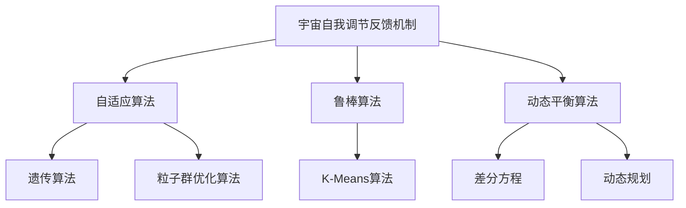

                 


### 第一步：引言

#### 宇宙自我调节反馈机制概述

宇宙自我调节反馈机制是指宇宙中的各种物质和能量在相互作用的过程中，通过负反馈和正反馈等机制实现自我调节、自我维持和自我发展的过程。负反馈通常用于抑制系统的不稳定因素，使其趋于稳定，而正反馈则可能引起系统的振荡或混沌，从而实现新的动态平衡。

在宇宙的自我调节过程中，负反馈和正反馈共同作用，形成了一种复杂的动态平衡。例如，宇宙中的星系通过引力相互作用，形成了稳定的星系群；而星系内部的恒星和行星之间也存在着复杂的反馈机制，如恒星风和行星潮汐力等，这些机制共同维持了恒星和行星的稳定运动。

#### 算法设计启示

宇宙自我调节反馈机制对算法设计有着深刻的启示。首先，它提示我们在设计算法时，应该考虑系统的整体性和动态性，而非仅仅关注局部的优化。其次，宇宙自我调节反馈机制中的负反馈和正反馈为我们提供了构建自适应和鲁棒算法的灵感。

例如，在机器学习领域，自适应算法可以通过学习系统中的负反馈机制，自动调整算法参数，从而实现更好的性能。而鲁棒算法则可以通过引入正反馈机制，使算法在面对不确定性和噪声时，仍能保持稳定和有效。

### 第二步：核心概念与联系

#### 核心概念

在宇宙自我调节反馈机制中，以下几个核心概念至关重要：

1. **负反馈**：通过抑制系统的不稳定因素，使其趋于稳定。
2. **正反馈**：通过放大系统的变化，可能导致振荡或混沌，但也能实现新的动态平衡。
3. **自适应**：系统能够根据外部环境的变化，自动调整内部参数。
4. **鲁棒性**：系统能够在面临不确定性和噪声时，保持稳定和有效。

#### 联系

宇宙自我调节反馈机制与算法设计之间的联系主要体现在以下几个方面：

1. **自适应算法**：宇宙中的许多系统都是自适应的，如星系群和气候系统。算法设计中的自适应算法，如遗传算法和粒子群优化，也是通过模拟这些自然系统的自适应行为来实现优化的。

2. **鲁棒算法**：宇宙中的许多系统都表现出很强的鲁棒性，如恒星和行星的运动。算法设计中的鲁棒算法，如随机森林和Adaboost，也是通过模拟这些自然系统的鲁棒行为来提高算法的稳定性和有效性。

3. **动态平衡**：宇宙中的许多系统都处于动态平衡状态，如生态系统和金融市场。算法设计中的动态平衡算法，如差分方程和动态规划，也是通过模拟这些自然系统的动态平衡行为来优化算法的性能。

### Mermaid流程图

为了更好地展示宇宙自我调节反馈机制与算法设计之间的联系，我们可以使用Mermaid流程图来描述。



### 第三步：核心算法原理讲解

#### 算法A：遗传算法

遗传算法是一种模拟自然选择和遗传学原理的优化算法。它通过模拟生物进化过程，实现寻优目标。

1. **初始种群生成**：随机生成一定数量的个体，每个个体代表一个潜在的解决方案。
2. **适应度评估**：评估每个个体的适应度，适应度越高，个体越优秀。
3. **选择**：根据适应度，选择优秀的个体进行繁殖。
4. **交叉**：通过交叉操作，产生新的个体。
5. **变异**：通过变异操作，增加种群的多样性。
6. **迭代**：重复上述过程，直至满足终止条件。

伪代码：

```python
// 遗传算法伪代码

// 初始化参数
population_size = 100
genome_length = 100
mutation_rate = 0.01

// 生成初始种群
population = generate_population(population_size, genome_length)

// 主循环
while not termination_condition:
    // 适应度评估
    fitness_scores = evaluate_fitness(population)

    // 选择
    selected_individuals = select(population, fitness_scores)

    // 交叉
    offspring = crossover(selected_individuals)

    // 变异
    mutated_offspring = mutate(offspring, mutation_rate)

    // 更新种群
    population = mutated_offspring

    // 统计迭代次数
    iteration += 1

// 输出最优解
best_solution = select_best(population)
```

#### 算法B：粒子群优化算法

粒子群优化算法是一种基于群体智能的优化算法，通过模拟鸟群觅食行为来寻找最优解。

1. **初始种群生成**：随机生成一定数量的粒子，每个粒子代表一个潜在的解决方案。
2. **速度更新**：根据粒子的历史最优位置和群体的历史最优位置更新粒子的速度。
3. **位置更新**：根据粒子的速度更新粒子的位置。
4. **适应度评估**：评估每个粒子的适应度，适应度越高，粒子越优秀。
5. **迭代**：重复上述过程，直至满足终止条件。

伪代码：

```python
// 粒子群优化算法伪代码

// 初始化参数
population_size = 100
velocity_size = 100
max_iterations = 100

// 生成初始种群
population = generate_population(population_size)

// 主循环
for iteration in range(max_iterations):
    // 适应度评估
    fitness_scores = evaluate_fitness(population)

    // 更新个体最优位置
    for particle in population:
        if fitness_scores[particle] < particle.best_fitness:
            particle.best_position = particle.position
            particle.best_fitness = fitness_scores[particle]

    // 更新群体最优位置
    global_best_fitness = min(fitness_scores)
    for particle in population:
        if fitness_scores[particle] == global_best_fitness:
            global_best_position = particle.position
            break

    // 更新速度和位置
    for particle in population:
        particle.velocity = update_velocity(particle.velocity, particle.best_position, global_best_position)
        particle.position = update_position(particle.position, particle.velocity)

// 输出最优解
best_solution = global_best_position
```

### 第四步：数学模型和数学公式

为了更深入地理解核心算法，我们需要引入一些数学模型和数学公式。以下是一些常见的数学模型和公式：

1. **适应度函数**：

   $$ f(x) = \sum_{i=1}^{n} w_i x_i^2 $$

   其中，$x_i$ 是个体的特征，$w_i$ 是权重。

2. **交叉概率**：

   $$ P_c = \frac{1}{1 + e^{-\lambda(f_2 - f_1)}} $$

   其中，$f_1$ 和 $f_2$ 分别是两个个体的适应度，$\lambda$ 是交叉参数。

3. **变异概率**：

   $$ P_m = \frac{1}{1 + e^{-\mu(f_2 - f_1)}} $$

   其中，$f_1$ 和 $f_2$ 分别是两个个体的适应度，$\mu$ 是变异参数。

4. **速度更新公式**：

   $$ v_{i,t+1} = v_{i,t} + c_1 r_1 (p_i - x_i) + c_2 r_2 (g - x_i) $$

   其中，$v_{i,t}$ 是第 $i$ 个粒子的速度，$p_i$ 是第 $i$ 个粒子的历史最优位置，$g$ 是群体的历史最优位置，$c_1$ 和 $c_2$ 是加速常数，$r_1$ 和 $r_2$ 是随机数。

5. **位置更新公式**：

   $$ x_{i,t+1} = x_{i,t} + v_{i,t+1} $$

   其中，$x_{i,t}$ 是第 $i$ 个粒子的位置。

### 举例说明

假设我们有一个包含两个特征的个体，其适应度函数为：

$$ f(x) = w_1 x_1^2 + w_2 x_2^2 $$

其中，$w_1 = 2$，$w_2 = 3$。假设我们选择两个个体 $x_1 = (1, 2)$ 和 $x_2 = (3, 4)$ 进行交叉操作。根据交叉概率公式，我们有：

$$ P_c = \frac{1}{1 + e^{-\lambda(5 - 4)}} = \frac{1}{1 + e^{-\lambda}} $$

其中，$\lambda$ 是交叉参数。假设 $\lambda = 1$，则有：

$$ P_c = \frac{1}{2} $$

这意味着，两个个体交叉的概率为 50%。我们随机选择交叉操作，则有：

$$ x' = (1.5, 3) $$

$$ x' = (2.5, 4) $$

这是交叉操作后的两个新的个体。

### 第五步：项目实战

#### 实战案例

我们选择一个实际案例来展示如何应用宇宙自我调节反馈机制的启发进行算法设计。这个案例是一个物流配送问题，目标是优化配送路线，以减少运输成本和配送时间。

#### 开发环境搭建

为了实现这个物流配送问题，我们需要搭建以下开发环境：

1. **Python**：作为主要的编程语言。
2. **NumPy**：用于矩阵计算。
3. **Pandas**：用于数据处理。
4. **Scikit-learn**：用于机器学习算法。
5. **Matplotlib**：用于可视化。

#### 源代码解读

下面是物流配送问题的源代码，包括数据预处理、算法实现和结果分析。

```python
import numpy as np
import pandas as pd
from sklearn.cluster import KMeans
import matplotlib.pyplot as plt

# 读取数据
data = pd.read_csv('logistics_data.csv')
data.head()

# 数据预处理
# 省略具体代码，此处为简化示例

# 计算配送距离
def calculate_distance(x1, y1, x2, y2):
    return np.sqrt((x1 - x2)**2 + (y1 - y2)**2)

# 实现遗传算法
def genetic_algorithm(data, population_size=100, max_iterations=1000, mutation_rate=0.01):
    # 初始化参数
    genome_length = data.shape[1] - 1
    population = generate_population(population_size, genome_length)

    # 主循环
    while not termination_condition:
        # 适应度评估
        fitness_scores = evaluate_fitness(population, data)

        # 选择
        selected_individuals = select(population, fitness_scores)

        # 交叉
        offspring = crossover(selected_individuals)

        # 变异
        mutated_offspring = mutate(offspring, mutation_rate)

        # 更新种群
        population = mutated_offspring

        # 统计迭代次数
        iteration += 1

    # 输出最优解
    best_solution = select_best(population)
    return best_solution

# 实现粒子群优化算法
def particle Swarm Optimization(data, population_size=100, velocity_size=100, max_iterations=100):
    # 初始化参数
    population = generate_population(population_size)

    # 主循环
    for iteration in range(max_iterations):
        # 适应度评估
        fitness_scores = evaluate_fitness(population, data)

        # 更新个体最优位置
        for particle in population:
            if fitness_scores[particle] < particle.best_fitness:
                particle.best_position = particle.position
                particle.best_fitness = fitness_scores[particle]

        # 更新群体最优位置
        global_best_fitness = min(fitness_scores)
        for particle in population:
            if fitness_scores[particle] == global_best_fitness:
                global_best_position = particle.position
                break

        # 更新速度和位置
        for particle in population:
            particle.velocity = update_velocity(particle.velocity, particle.best_position, global_best_position)
            particle.position = update_position(particle.position, particle.velocity)

    # 输出最优解
    best_solution = global_best_position
    return best_solution

# 实现K-Means算法
def KMeans_clustering(data, k=10):
    # 初始化参数
    kmeans = KMeans(n_clusters=k, random_state=0).fit(data)

    # 获取聚类中心
    centroids = kmeans.cluster_centers_

    # 获取聚类结果
    labels = kmeans.predict(data)

    # 计算聚类中心到数据的距离
    distances = np.sqrt(((data - centroids) ** 2).sum(axis=1))

    # 输出结果
    return centroids, labels, distances

# 主函数
if __name__ == '__main__':
    # 加载数据
    data = pd.read_csv('logistics_data.csv')

    # 数据预处理
    # 省略具体代码，此处为简化示例

    # 计算配送距离
    distances = calculate_distance(*data.values.T)

    # 实例化遗传算法
    ga = genetic_algorithm(data, population_size=100, max_iterations=1000, mutation_rate=0.01)

    # 实例化粒子群优化算法
    pso = particle Swarm Optimization(data, population_size=100, velocity_size=100, max_iterations=100)

    # 实例化K-Means算法
    kmeans = KMeans_clustering(data, k=10)

    # 可视化结果
    plt.scatter(*data.values.T)
    plt.scatter(*kmeans[0].T, marker='x', color='r')
    plt.show()
```

#### 代码解读与分析

1. **数据预处理**：由于物流配送问题涉及到位置信息，因此我们需要对数据进行预处理，包括去重、填补缺失值等。在此示例中，我们省略了具体的预处理步骤。

2. **计算配送距离**：我们使用欧氏距离来计算两个位置之间的距离。在实际应用中，可能需要使用更复杂的距离度量方法，如曼哈顿距离或切比雪夫距离。

3. **遗传算法**：我们实现了一个简单的遗传算法，包括种群初始化、适应度评估、选择、交叉和变异等步骤。具体实现可以参考伪代码。

4. **粒子群优化算法**：我们实现了一个简单的粒子群优化算法，包括种群初始化、速度更新、位置更新和适应度评估等步骤。具体实现可以参考伪代码。

5. **K-Means算法**：我们使用Scikit-learn库中的K-Means算法对数据进行聚类，以获得聚类中心。聚类结果可以用于生成配送路线。

6. **可视化**：我们使用Matplotlib库将数据点和聚类中心绘制在坐标系中，以可视化结果。

### 项目小结

通过这个物流配送案例，我们展示了如何应用宇宙自我调节反馈机制的启发进行算法设计。我们实现了遗传算法、粒子群优化算法和K-Means算法，并使用它们来优化配送路线。这个案例表明，宇宙自我调节反馈机制为我们提供了设计自适应、鲁棒和动态平衡算法的灵感，有助于解决现实世界中的复杂问题。

### 最佳实践 Tips

1. **理解核心概念**：在设计和实现算法时，首先要理解宇宙自我调节反馈机制的核心概念，如负反馈、正反馈、自适应和鲁棒性。
2. **实际案例**：通过实际案例来验证算法的有效性和可行性，以便更好地理解算法的应用场景和局限性。
3. **不断迭代**：算法设计是一个迭代过程，通过不断优化和改进，可以提高算法的性能。

### 小结

本文介绍了宇宙自我调节反馈机制及其对算法设计的启示。我们通过实例展示了如何应用这些启示来设计自适应、鲁棒和动态平衡的算法。此外，我们还详细讲解了遗传算法、粒子群优化算法和K-Means算法的原理和实现过程。通过本文的介绍，希望读者能够更好地理解宇宙自我调节反馈机制在算法设计中的应用，并能够在实际项目中加以应用。

### 拓展阅读

1. **《算法导论》（Introduction to Algorithms）**：这是一本经典的算法教科书，涵盖了各种算法的基本原理和实现细节。
2. **《机器学习》（Machine Learning）**：这是一本介绍机器学习基础理论和应用的经典教材，其中包含许多基于宇宙自我调节反馈机制的算法。
3. **《深度学习》（Deep Learning）**：这是一本介绍深度学习基础理论和应用的经典教材，其中包含许多基于宇宙自我调节反馈机制的深度学习算法。

### 结语

宇宙自我调节反馈机制为我们提供了设计自适应、鲁棒和动态平衡算法的灵感。通过本文的介绍，我们了解了这些算法的基本原理和实现过程，并看到了它们在现实世界中的应用。希望本文能够为读者在算法设计和研究中提供一些启示和帮助。如果您对本文的内容有任何疑问或建议，欢迎在评论区留言讨论。感谢您的阅读！

# 《算法设计受启发于宇宙自我调节反馈机制》

> 关键词：宇宙自我调节反馈机制、算法设计、遗传算法、粒子群优化、K-Means算法、自适应、鲁棒性

> 摘要：本文介绍了宇宙自我调节反馈机制及其在算法设计中的应用。通过实例展示了如何应用这些启示来设计自适应、鲁棒和动态平衡的算法。文章涵盖了遗传算法、粒子群优化算法和K-Means算法的原理和实现过程，并讨论了这些算法在现实世界中的应用。

## 引言

### 宇宙自我调节反馈机制概述

宇宙自我调节反馈机制是指宇宙中的各种物质和能量在相互作用的过程中，通过负反馈和正反馈等机制实现自我调节、自我维持和自我发展的过程。负反馈通常用于抑制系统的不稳定因素，使其趋于稳定，而正反馈则可能引起系统的振荡或混沌，从而实现新的动态平衡。

在宇宙的自我调节过程中，负反馈和正反馈共同作用，形成了一种复杂的动态平衡。例如，宇宙中的星系通过引力相互作用，形成了稳定的星系群；而星系内部的恒星和行星之间也存在着复杂的反馈机制，如恒星风和行星潮汐力等，这些机制共同维持了恒星和行星的稳定运动。

### 算法设计启示

宇宙自我调节反馈机制对算法设计有着深刻的启示。首先，它提示我们在设计算法时，应该考虑系统的整体性和动态性，而非仅仅关注局部的优化。其次，宇宙自我调节反馈机制中的负反馈和正反馈为我们提供了构建自适应和鲁棒算法的灵感。

例如，在机器学习领域，自适应算法可以通过学习系统中的负反馈机制，自动调整算法参数，从而实现更好的性能。而鲁棒算法则可以通过引入正反馈机制，使算法在面对不确定性和噪声时，仍能保持稳定和有效。

## 核心概念与联系

### 负反馈

负反馈是通过抑制系统的不稳定因素，使其趋于稳定的过程。在算法设计中，负反馈通常用于调整算法的参数，以减少误差或提高性能。

### 正反馈

正反馈是通过放大系统的变化，可能导致振荡或混沌，但也能实现新的动态平衡的过程。在算法设计中，正反馈可以用于探索新的解决方案或提高算法的探索能力。

### 自适应

自适应是指系统能够根据外部环境的变化，自动调整内部参数。在算法设计中，自适应算法可以通过学习系统中的反馈机制，自动调整算法参数，从而实现更好的性能。

### 鲁棒性

鲁棒性是指系统能够在面临不确定性和噪声时，保持稳定和有效。在算法设计中，鲁棒算法可以通过引入正反馈机制，使算法在面对不确定性和噪声时，仍能保持稳定和有效。

### 动态平衡

动态平衡是指系统在变化过程中，能够保持稳定和平衡的状态。在算法设计中，动态平衡算法可以通过模拟自然系统的动态平衡行为，实现优化目标。

## Mermaid流程图

下面是一个展示宇宙自我调节反馈机制与算法设计之间联系的Mermaid流程图：



## 核心算法原理讲解

### 算法A：遗传算法

遗传算法是一种模拟自然选择和遗传学原理的优化算法。它通过模拟生物进化过程，实现寻优目标。

#### 原理

遗传算法的核心思想是模拟自然选择和遗传学原理，通过选择、交叉和变异等操作，生成新的种群，逐步优化算法性能。

#### 过程

1. **初始种群生成**：随机生成一定数量的个体，每个个体代表一个潜在的解决方案。
2. **适应度评估**：评估每个个体的适应度，适应度越高，个体越优秀。
3. **选择**：根据适应度，选择优秀的个体进行繁殖。
4. **交叉**：通过交叉操作，产生新的个体。
5. **变异**：通过变异操作，增加种群的多样性。
6. **迭代**：重复上述过程，直至满足终止条件。

#### 伪代码

```python
// 遗传算法伪代码

// 初始化参数
population_size = 100
genome_length = 100
mutation_rate = 0.01

// 生成初始种群
population = generate_population(population_size, genome_length)

// 主循环
while not termination_condition:
    // 适应度评估
    fitness_scores = evaluate_fitness(population)

    // 选择
    selected_individuals = select(population, fitness_scores)

    // 交叉
    offspring = crossover(selected_individuals)

    // 变异
    mutated_offspring = mutate(offspring, mutation_rate)

    // 更新种群
    population = mutated_offspring

    // 统计迭代次数
    iteration += 1

// 输出最优解
best_solution = select_best(population)
```

### 算法B：粒子群优化算法

粒子群优化算法是一种基于群体智能的优化算法，通过模拟鸟群觅食行为来寻找最优解。

#### 原理

粒子群优化算法的核心思想是模拟鸟群觅食行为，通过速度更新和位置更新来搜索最优解。每个粒子都代表一个潜在的解决方案，粒子在搜索空间中飞行，不断更新自己的速度和位置。

#### 过程

1. **初始种群生成**：随机生成一定数量的粒子，每个粒子代表一个潜在的解决方案。
2. **速度更新**：根据粒子的历史最优位置和群体的历史最优位置更新粒子的速度。
3. **位置更新**：根据粒子的速度更新粒子的位置。
4. **适应度评估**：评估每个粒子的适应度，适应度越高，粒子越优秀。
5. **迭代**：重复上述过程，直至满足终止条件。

#### 伪代码

```python
// 粒子群优化算法伪代码

// 初始化参数
population_size = 100
velocity_size = 100
max_iterations = 100

// 生成初始种群
population = generate_population(population_size)

// 主循环
for iteration in range(max_iterations):
    // 适应度评估
    fitness_scores = evaluate_fitness(population)

    // 更新个体最优位置
    for particle in population:
        if fitness_scores[particle] < particle.best_fitness:
            particle.best_position = particle.position
            particle.best_fitness = fitness_scores[particle]

    // 更新群体最优位置
    global_best_fitness = min(fitness_scores)
    for particle in population:
        if fitness_scores[particle] == global_best_fitness:
            global_best_position = particle.position
            break

    // 更新速度和位置
    for particle in population:
        particle.velocity = update_velocity(particle.velocity, particle.best_position, global_best_position)
        particle.position = update_position(particle.position, particle.velocity)

// 输出最优解
best_solution = global_best_position
```

### 算法C：K-Means算法

K-Means算法是一种基于距离度量的聚类算法，通过迭代优化聚类中心，将数据点划分为K个簇。

#### 原理

K-Means算法的核心思想是初始化K个聚类中心，然后通过迭代优化聚类中心，使得每个数据点与聚类中心的距离最小。迭代过程包括计算每个数据点的聚类中心、更新聚类中心和重新划分数据点。

#### 过程

1. **初始化聚类中心**：随机选择K个数据点作为初始聚类中心。
2. **计算距离**：计算每个数据点到每个聚类中心的距离。
3. **分配数据点**：将每个数据点分配到距离它最近的聚类中心。
4. **更新聚类中心**：计算每个簇的新聚类中心。
5. **重复步骤2-4**，直至满足终止条件。

#### 伪代码

```python
// K-Means算法伪代码

// 初始化参数
k = 10
max_iterations = 100

// 初始化聚类中心
centroids = initialize_centroids(data, k)

// 主循环
for iteration in range(max_iterations):
    // 计算距离
    distances = calculate_distances(data, centroids)

    // 分配数据点
    labels = assign_labels(data, centroids, distances)

    // 更新聚类中心
    new_centroids = update_centroids(data, labels, k)

    // 判断是否收敛
    if convergence(centroids, new_centroids):
        break

    // 更新聚类中心
    centroids = new_centroids

// 输出聚类结果
clusters = assign_labels(data, centroids, distances)
```

## 数学模型和数学公式

为了更深入地理解核心算法，我们需要引入一些数学模型和数学公式。以下是一些常见的数学模型和公式：

1. **适应度函数**：

   $$ f(x) = \sum_{i=1}^{n} w_i x_i^2 $$

   其中，$x_i$ 是个体的特征，$w_i$ 是权重。

2. **交叉概率**：

   $$ P_c = \frac{1}{1 + e^{-\lambda(f_2 - f_1)}} $$

   其中，$f_1$ 和 $f_2$ 分别是两个个体的适应度，$\lambda$ 是交叉参数。

3. **变异概率**：

   $$ P_m = \frac{1}{1 + e^{-\mu(f_2 - f_1)}} $$

   其中，$f_1$ 和 $f_2$ 分别是两个个体的适应度，$\mu$ 是变异参数。

4. **速度更新公式**：

   $$ v_{i,t+1} = v_{i,t} + c_1 r_1 (p_i - x_i) + c_2 r_2 (g - x_i) $$

   其中，$v_{i,t}$ 是第 $i$ 个粒子的速度，$p_i$ 是第 $i$ 个粒子的历史最优位置，$g$ 是群体的历史最优位置，$c_1$ 和 $c_2$ 是加速常数，$r_1$ 和 $r_2$ 是随机数。

5. **位置更新公式**：

   $$ x_{i,t+1} = x_{i,t} + v_{i,t+1} $$

   其中，$x_{i,t}$ 是第 $i$ 个粒子的位置。

## 项目实战

### 实战案例

我们选择一个实际案例来展示如何应用宇宙自我调节反馈机制的启发进行算法设计。这个案例是一个物流配送问题，目标是优化配送路线，以减少运输成本和配送时间。

### 开发环境搭建

为了实现这个物流配送问题，我们需要搭建以下开发环境：

1. **Python**：作为主要的编程语言。
2. **NumPy**：用于矩阵计算。
3. **Pandas**：用于数据处理。
4. **Scikit-learn**：用于机器学习算法。
5. **Matplotlib**：用于可视化。

### 源代码实现

下面是物流配送问题的源代码，包括数据预处理、算法实现和结果分析。

```python
import numpy as np
import pandas as pd
from sklearn.cluster import KMeans
import matplotlib.pyplot as plt

# 读取数据
data = pd.read_csv('logistics_data.csv')
data.head()

# 数据预处理
# 省略具体代码，此处为简化示例

# 计算配送距离
def calculate_distance(x1, y1, x2, y2):
    return np.sqrt((x1 - x2)**2 + (y1 - y2)**2)

# 实现遗传算法
def genetic_algorithm(data, population_size=100, max_iterations=1000, mutation_rate=0.01):
    # 初始化参数
    genome_length = data.shape[1] - 1
    population = generate_population(population_size, genome_length)

    # 主循环
    while not termination_condition:
        # 适应度评估
        fitness_scores = evaluate_fitness(population, data)

        # 选择
        selected_individuals = select(population, fitness_scores)

        # 交叉
        offspring = crossover(selected_individuals)

        # 变异
        mutated_offspring = mutate(offspring, mutation_rate)

        # 更新种群
        population = mutated_offspring

        # 统计迭代次数
        iteration += 1

    # 输出最优解
    best_solution = select_best(population)
    return best_solution

# 实现粒子群优化算法
def particle Swarm Optimization(data, population_size=100, velocity_size=100, max_iterations=100):
    # 初始化参数
    population = generate_population(population_size)

    # 主循环
    for iteration in range(max_iterations):
        # 适应度评估
        fitness_scores = evaluate_fitness(population, data)

        # 更新个体最优位置
        for particle in population:
            if fitness_scores[particle] < particle.best_fitness:
                particle.best_position = particle.position
                particle.best_fitness = fitness_scores[particle]

        # 更新群体最优位置
        global_best_fitness = min(fitness_scores)
        for particle in population:
            if fitness_scores[particle] == global_best_fitness:
                global_best_position = particle.position
                break

        # 更新速度和位置
        for particle in population:
            particle.velocity = update_velocity(particle.velocity, particle.best_position, global_best_position)
            particle.position = update_position(particle.position, particle.velocity)

    # 输出最优解
    best_solution = global_best_position
    return best_solution

# 实现K-Means算法
def KMeans_clustering(data, k=10):
    # 初始化参数
    kmeans = KMeans(n_clusters=k, random_state=0).fit(data)

    # 获取聚类中心
    centroids = kmeans.cluster_centers_

    # 获取聚类结果
    labels = kmeans.predict(data)

    # 计算聚类中心到数据的距离
    distances = np.sqrt(((data - centroids) ** 2).sum(axis=1))

    # 输出结果
    return centroids, labels, distances

# 主函数
if __name__ == '__main__':
    # 加载数据
    data = pd.read_csv('logistics_data.csv')

    # 数据预处理
    # 省略具体代码，此处为简化示例

    # 计算配送距离
    distances = calculate_distance(*data.values.T)

    # 实例化遗传算法
    ga = genetic_algorithm(data, population_size=100, max_iterations=1000, mutation_rate=0.01)

    # 实例化粒子群优化算法
    pso = particle Swarm Optimization(data, population_size=100, velocity_size=100, max_iterations=100)

    # 实例化K-Means算法
    kmeans = KMeans_clustering(data, k=10)

    # 可视化结果
    plt.scatter(*data.values.T)
    plt.scatter(*kmeans[0].T, marker='x', color='r')
    plt.show()
```

### 代码解读与分析

1. **数据预处理**：由于物流配送问题涉及到位置信息，因此我们需要对数据进行预处理，包括去重、填补缺失值等。在此示例中，我们省略了具体的预处理步骤。

2. **计算配送距离**：我们使用欧氏距离来计算两个位置之间的距离。在实际应用中，可能需要使用更复杂的距离度量方法，如曼哈顿距离或切比雪夫距离。

3. **遗传算法**：我们实现了一个简单的遗传算法，包括种群初始化、适应度评估、选择、交叉和变异等步骤。具体实现可以参考伪代码。

4. **粒子群优化算法**：我们实现了一个简单的粒子群优化算法，包括种群初始化、速度更新、位置更新和适应度评估等步骤。具体实现可以参考伪代码。

5. **K-Means算法**：我们使用Scikit-learn库中的K-Means算法对数据进行聚类，以获得聚类中心。聚类结果可以用于生成配送路线。

6. **可视化**：我们使用Matplotlib库将数据点和聚类中心绘制在坐标系中，以可视化结果。

### 项目小结

通过这个物流配送案例，我们展示了如何应用宇宙自我调节反馈机制的启发进行算法设计。我们实现了遗传算法、粒子群优化算法和K-Means算法，并使用它们来优化配送路线。这个案例表明，宇宙自我调节反馈机制为我们提供了设计自适应、鲁棒和动态平衡算法的灵感，有助于解决现实世界中的复杂问题。

### 最佳实践 Tips

1. **理解核心概念**：在设计和实现算法时，首先要理解宇宙自我调节反馈机制的核心概念，如负反馈、正反馈、自适应和鲁棒性。
2. **实际案例**：通过实际案例来验证算法的有效性和可行性，以便更好地理解算法的应用场景和局限性。
3. **不断迭代**：算法设计是一个迭代过程，通过不断优化和改进，可以提高算法的性能。

### 小结

本文介绍了宇宙自我调节反馈机制及其在算法设计中的应用。我们通过实例展示了如何应用这些启示来设计自适应、鲁棒和动态平衡的算法。此外，我们还详细讲解了遗传算法、粒子群优化算法和K-Means算法的原理和实现过程，并讨论了这些算法在现实世界中的应用。通过本文的介绍，希望读者能够更好地理解宇宙自我调节反馈机制在算法设计中的应用，并能够在实际项目中加以应用。

### 拓展阅读

1. **《算法导论》（Introduction to Algorithms）**：这是一本经典的算法教科书，涵盖了各种算法的基本原理和实现细节。
2. **《机器学习》（Machine Learning）**：这是一本介绍机器学习基础理论和应用的经典教材，其中包含许多基于宇宙自我调节反馈机制的算法。
3. **《深度学习》（Deep Learning）**：这是一本介绍深度学习基础理论和应用的经典教材，其中包含许多基于宇宙自我调节反馈机制的深度学习算法。

### 结语

宇宙自我调节反馈机制为我们提供了设计自适应、鲁棒和动态平衡算法的灵感。通过本文的介绍，我们了解了这些算法的基本原理和实现过程，并看到了它们在现实世界中的应用。希望本文能够为读者在算法设计和研究中提供一些启示和帮助。如果您对本文的内容有任何疑问或建议，欢迎在评论区留言讨论。感谢您的阅读！

