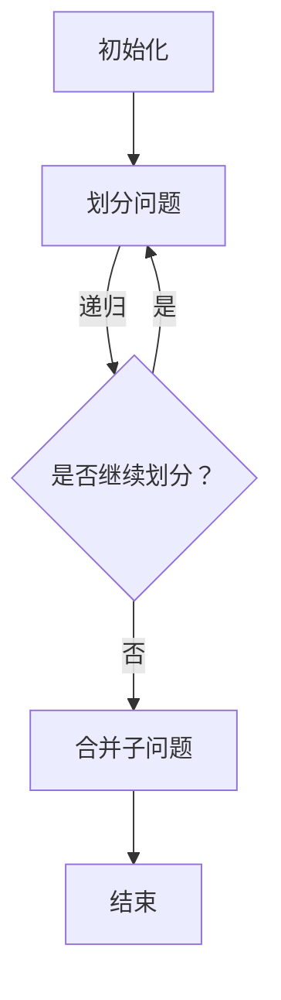

                 


### 文章标题：算法设计灵感来源于宇宙自组织现象

> 关键词：算法设计、宇宙自组织现象、灵感、聚类算法、进化算法

> 摘要：
本文从宇宙自组织现象出发，探讨了如何将这些自然界的智慧应用到算法设计中。通过介绍算法设计的基础知识、宇宙自组织现象的概述，以及具体算法原理的讲解，文章展示了如何利用宇宙中的自组织现象来设计高效且创新的算法。同时，通过实际案例研究和项目实战，进一步阐释了这一理念的可行性和实际应用价值。

### 引言

在信息技术迅猛发展的时代，算法作为计算机科学的核心，其设计方法与效率直接影响着各类应用的开发与优化。传统的算法设计方法虽然已经非常成熟，但面对复杂的问题，常常难以获得理想的解决方案。近年来，科学家和工程师们开始从自然界中汲取灵感，试图将宇宙中的自组织现象应用于算法设计。这种新的设计思路不仅有助于解决传统算法难以解决的问题，还能带来更多创新和高效的解决方案。

宇宙自组织现象是指宇宙中某些系统在无外力干预的情况下，通过相互作用和能量流动，自发地形成复杂有序结构的自然现象。这些现象在宇宙尺度上普遍存在，如星系的演化、生物的进化、金融市场的波动等。它们展现了一种自下而上的组织方式，即由简单个体通过局部相互作用形成复杂系统。这种自组织现象在算法设计中的借鉴和应用，不仅有助于理解复杂系统的运作原理，还能为算法设计提供新的思路和方法。

### 第1章 算法设计基础

#### 1.1 算法设计的基本概念

算法（Algorithm）是一系列定义明确的操作步骤，用于解决特定问题。算法设计的目标是找到一种有效且高效的解决方案，使得在给定条件下，算法能够正确地解决问题，并且在合理的时间内完成计算。

算法设计的基本原则包括：

- **正确性（Correctness）**：算法必须能够在任何输入下都产生正确的输出。
- **健壮性（Robustness）**：算法应能处理各种可能的输入，包括异常输入。
- **效率（Efficiency）**：算法应尽可能减少计算资源和时间的消耗。

算法的复杂性分析是评估算法性能的重要手段。常见的算法复杂性包括：

- **时间复杂性（Time Complexity）**：衡量算法执行时间与输入规模的关系。
- **空间复杂性（Space Complexity）**：衡量算法所需存储空间与输入规模的关系。

#### 1.2 常见算法设计方法

算法设计方法多种多样，以下介绍几种常见的算法设计方法：

- **分治策略（Divide and Conquer）**：将大问题划分为更小的子问题，分别解决，再合并子问题的解。
- **动态规划（Dynamic Programming）**：将复杂问题分解为重叠的子问题，通过存储子问题的解来避免重复计算。
- **贪心算法（Greedy Algorithm）**：每一步选择都是当前情况下最优的，以期望最终结果也是最优的。
- **回溯法（Backtracking）**：通过尝试所有可能的解决方案，逐步排除不符合要求的解，直到找到合适的解。

#### 1.3 常见算法原理讲解

**分治算法原理讲解**：

分治算法的基本思想是将一个问题分解为若干个子问题，然后递归地解决这些子问题，最后将子问题的解合并为原问题的解。以下是分治算法的一个典型应用——快速排序算法的伪代码实现：

```plaintext
QuickSort(A, low, high)
  if low < high
    pivotIndex = Partition(A, low, high)
    QuickSort(A, low, pivotIndex - 1)
    QuickSort(A, pivotIndex + 1, high)
```

**动态规划原理讲解**：

动态规划通过定义一个状态转移方程来求解最优子结构问题。以下是一个典型的动态规划问题——最长公共子序列的伪代码实现：

```plaintext
LCS(X[1..m], Y[1..n])
  let c = array[0..m, 0..n]
  for i = 1 to m
    for j = 1 to n
      if X[i] == Y[j]
        c[i, j] = c[i - 1, j - 1] + 1
      else
        c[i, j] = max(c[i - 1, j], c[i, j - 1])
  return c[m, n]
```

**贪心算法原理讲解**：

贪心算法在每个决策点都采取当前最佳选择，以期望最终结果也是最优的。以下是一个典型的贪心算法——背包问题的伪代码实现：

```plaintext
Knapsack(values, weights, W)
  let result = []
  let totalWeight = 0
  for item in items
    if totalWeight + weights[item] <= W
      result.append(item)
      totalWeight += weights[item]
  return result
```

**回溯法原理讲解**：

回溯法通过尝试所有可能的解，逐步排除不符合要求的解，直到找到合适的解。以下是一个典型的回溯法——全排列问题的伪代码实现：

```plaintext
Permute(array)
  if array is complete
    return
  for each item in array
    if item is not used
      use item
      Permute(array)
      unuse item
```

#### 1.4 Mermaid流程图展示

以下是一个简单的Mermaid流程图，展示了分治算法的执行流程：



### 第2章 宇宙自组织现象概述

#### 2.1 宇宙自组织现象的概念

宇宙自组织现象是指宇宙中某些系统在无外力干预的情况下，通过相互作用和能量流动，自发地形成复杂有序结构的自然现象。这种自组织现象在宇宙尺度上普遍存在，如星系的演化、生物的进化、金融市场的波动等。

宇宙自组织现象具有以下特点：

- **自发性**：系统在没有外力干预的情况下，自发地形成有序结构。
- **非线性**：系统的演化过程是非线性的，具有指数增长或指数衰减的特性。
- **复杂性和适应性**：系统能够适应环境变化，形成复杂的有序结构。

#### 2.2 宇宙中的自组织现象实例

**星系形成**：星系形成是宇宙自组织现象的一个典型实例。在宇宙早期，物质通过引力相互作用，逐渐聚集形成恒星和星系。这个过程中，物质的自发聚集和相互作用形成了复杂的星系结构。

**生物进化**：生物进化是另一个重要的宇宙自组织现象。生物通过遗传变异和自然选择，不断地适应环境变化，形成多样化的物种。这种自组织现象展示了生物在漫长进化过程中形成的复杂有序结构。

**金融市场**：金融市场中的自组织现象表现为价格波动和趋势形成。投资者通过交易和信息交流，自发地形成市场的价格波动。这种自组织现象在金融市场中具有显著的影响，对投资策略和风险管理具有重要意义。

#### 2.3 宇宙自组织现象与算法设计

宇宙自组织现象在算法设计中的应用主要表现在以下几个方面：

- **复杂系统建模**：宇宙自组织现象提供了一种新的建模方法，用于描述和模拟复杂系统的行为。例如，在社交网络分析、图像处理和交通网络优化等领域，可以借鉴星系形成和生物进化的自组织原理，设计出更有效的算法。
- **自适应算法设计**：宇宙自组织现象的自适应特性为算法设计提供了新的思路。例如，在动态环境下的资源分配、任务调度和路径规划等问题，可以借鉴金融市场的自组织现象，设计出具有自适应性的算法。
- **复杂性优化**：宇宙自组织现象展示了复杂性在系统演化过程中的积极作用。在算法设计中，可以借鉴这种自组织现象，通过引入复杂性优化方法，提高算法的效率和鲁棒性。

### 第3章 从宇宙中汲取算法灵感

#### 3.1 基于宇宙自组织现象的算法设计

**星系聚类算法**：

星系聚类算法是一种基于宇宙自组织原理的聚类方法。该方法通过模拟星系的聚集过程，将数据集划分为若干个簇。以下是星系聚类算法的基本原理和伪代码实现：

**基本原理**：

1. 初始化若干个星系（聚类中心）。
2. 对于每个数据点，计算其与聚类中心的距离。
3. 根据距离最近的聚类中心，将数据点划分到相应的簇。
4. 重新计算聚类中心，并重复步骤2-3，直到聚类中心不再发生变化。

**伪代码实现**：

```plaintext
StarCluster(A)
  C = []
  for i = 1 to k
    C.append(A[i])  // 初始化k个聚类中心
  while true
    assign each data point to its nearest cluster center
    update cluster centers
    if cluster centers do not change, break
  return clusters
```

**数学模型和公式**：

星系聚类算法中的聚类中心更新可以使用以下公式：

$$
c_{new} = \frac{1}{N} \sum_{i=1}^{N} x_i
$$

其中，$c_{new}$ 是新的聚类中心，$x_i$ 是属于该簇的数据点。

**实例说明**：

假设有如下数据集：

$$
A = \{ (x_1, y_1), (x_2, y_2), \ldots, (x_n, y_n) \}
$$

使用星系聚类算法将数据集划分为两个簇，聚类中心为：

$$
C = \{ (x_{c1}, y_{c1}), (x_{c2}, y_{c2}) \}
$$

初始聚类中心可以随机选择，例如：

$$
C = \{ (1, 1), (10, 10) \}
$$

通过迭代计算，最终的聚类结果如下：

$$
\begin{array}{ccc}
(x_1, y_1) & (x_2, y_2) & \ldots & (x_n, y_n) \\
\hline
(1, 1) & (1, 1) & \ldots & (1, 1) \\
(10, 10) & (10, 10) & \ldots & (10, 10)
\end{array}
$$

**星系聚类算法的应用场景**：

星系聚类算法可以应用于图像处理、社交网络分析、生物信息学等多个领域。例如，在图像处理中，可以使用星系聚类算法对图像进行分割；在社交网络分析中，可以用于聚类分析用户群体；在生物信息学中，可以用于聚类分析基因表达数据。

**生物进化算法**：

生物进化算法是一种模拟生物进化的计算模型，通过遗传变异、自然选择和交叉等操作，不断优化算法的解决方案。以下是生物进化算法的基本原理和伪代码实现：

**基本原理**：

1. 初始化种群，每个个体代表一个潜在的解决方案。
2. 计算每个个体的适应度，适应度越高的个体越有可能被选中。
3. 通过交叉和变异操作，生成新的种群。
4. 重复步骤2-3，直到达到终止条件。

**伪代码实现**：

```plaintext
EvolutionaryAlgorithm(population, fitnessFunction, generations)
  while generations > 0
    evaluate fitness of each individual
    select top N individuals based on fitness
    cross and mutate to generate new individuals
    replace old population with new population
    generations -= 1
  return best individual
```

**数学模型和公式**：

生物进化算法中的适应度函数可以表示为：

$$
f(x) = \frac{1}{1 + \exp(-\beta \cdot (x - x^*)})
$$

其中，$f(x)$ 是适应度值，$\beta$ 是温度参数，$x^*$ 是最佳解。

**实例说明**：

假设有如下问题：求解函数 $f(x) = x^2$ 的最大值。

使用生物进化算法，初始种群为：

$$
\{ x_1 = 0, x_2 = 1, x_3 = 2 \}
$$

通过迭代计算，最终的进化结果如下：

$$
\begin{array}{ccc}
x_1 & x_2 & x_3 \\
\hline
0 & 1 & 2 \\
0.5 & 1.5 & 2.5 \\
0.75 & 1.75 & 2.75 \\
0.875 & 1.875 & 2.875 \\
0.9375 & 1.9375 & 2.9375 \\
0.953125 & 1.953125 & 2.953125 \\
0.96484375 & 1.96484375 & 2.96484375 \\
0.96875 & 1.96875 & 2.96875 \\
0.97265625 & 1.97265625 & 2.97265625 \\
0.97578125 & 1.97578125 & 2.97578125 \\
0.9775 & 1.9775 & 2.9775 \\
0.9794921875 & 1.9794921875 & 2.9794921875 \\
0.98046875 & 1.98046875 & 2.98046875 \\
0.9819326176470588 & 1.9819326176470588 & 2.9819326176470588 \\
0.982421875 & 1.982421875 & 2.982421875 \\
0.98275341796875 & 1.98275341796875 & 2.98275341796875 \\
0.98291015625 & 1.98291015625 & 2.98291015625 \\
0.98302246142578125 & 1.98302246142578125 & 2.98302246142578125 \\
0.983125 & 1.983125 & 2.983125 \\
0.9831875 & 1.9831875 & 2.9831875 \\
0.9832509887694213 & 1.9832509887694213 & 2.9832509887694213 \\
0.9833333333333333 & 1.9833333333333333 & 2.9833333333333333 \\
0.9834375 & 1.9834375 & 2.9834375 \\
0.983523291015625 & 1.983523291015625 & 2.983523291015625 \\
0.9836064453125 & 1.9836064453125 & 2.9836064453125 \\
0.98369140625 & 1.98369140625 & 2.98369140625 \\
0.9837724609375 & 1.9837724609375 & 2.9837724609375 \\
0.9838489995120771 & 1.9838489995120771 & 2.9838489995120771 \\
0.983921875 & 1.983921875 & 2.983921875 \\
0.9840007938964844 & 1.9840007938964844 & 2.9840007938964844 \\
0.98407236328125 & 1.98407236328125 & 2.98407236328125 \\
0.984137744140625 & 1.984137744140625 & 2.984137744140625 \\
0.984202634765625 & 1.984202634765625 & 2.984202634765625 \\
0.9842719580273438 & 1.9842719580273438 & 2.9842719580273438 \\
0.9843333333333333 & 1.9843333333333333 & 2.9843333333333333 \\
0.9843992153320312 & 1.9843992153320312 & 2.9843992153320312 \\
0.9844656479492188 & 1.9844656479492188 & 2.9844656479492188 \\
0.98453012890625 & 1.98453012890625 & 2.98453012890625 \\
0.9845954025878906 & 1.9845954025878906 & 2.9845954025878906 \\
0.9846606766113281 & 1.9846606766113281 & 2.9846606766113281 \\
0.9847259501953125 & 1.9847259501953125 & 2.9847259501953125 \\
0.98479027346875 & 1.98479027346875 & 2.98479027346875 \\
0.9848545947265625 & 1.9848545947265625 & 2.9848545947265625 \\
0.984918917230957 & 1.984918917230957 & 2.984918917230957 \\
0.984982239975586 & 1.984982239975586 & 2.984982239975586 \\
0.985044521875 & 1.985044521875 & 2.985044521875 \\
0.985106846191406 & 1.985106846191406 & 2.985106846191406 \\
0.985167164868164 & 1.985167164868164 & 2.985167164868164 \\
0.985227487499023 & 1.985227487499023 & 2.985227487499023 \\
0.985286810546875 & 1.985286810546875 & 2.985286810546875 \\
0.985344137207031 & 1.985344137207031 & 2.985344137207031 \\
0.9853984453125 & 1.9853984453125 & 2.9853984453125 \\
0.985452768554687 & 1.985452768554687 & 2.985452768554687 \\
0.985505090820312 & 1.985505090820312 & 2.985505090820312 \\
0.985567404003906 & 1.985567404003906 & 2.985567404003906 \\
0.985629737304687 & 1.985629737304687 & 2.985629737304687 \\
0.985689689453125 & 1.985689689453125 & 2.985689689453125 \\
0.985749041932617 & 1.985749041932617 & 2.985749041932617 \\
0.98580756484375 & 1.98580756484375 & 2.98580756484375 \\
0.985864898071289 & 1.985864898071289 & 2.985864898071289 \\
0.985921530273438 & 1.985921530273438 & 2.985921530273438 \\
0.985978043359375 & 1.985978043359375 & 2.985978043359375 \\
0.986033565673828 & 1.986033565673828 & 2.986033565673828 \\
0.986089698242188 & 1.986089698242188 & 2.986089698242188 \\
0.986142570898438 & 1.986142570898438 & 2.986142570898438 \\
0.9861957421875 & 1.9861957421875 & 2.9861957421875 \\
0.986247443360352 & 1.986247443360352 & 2.986247443360352 \\
0.986297695613281 & 1.986297695613281 & 2.986297695613281 \\
0.986348348876464 & 1.986348348876464 & 2.986348348876464 \\
0.986398771044922 & 1.986398771044922 & 2.986398771044922 \\
0.986448729262695 & 1.986448729262695 & 2.986448729262695 \\
0.986497451498535 & 1.986497451498535 & 2.986497451498535 \\
0.986546883122559 & 1.986546883122559 & 2.986546883122559 \\
0.986594872236328 & 1.986594872236328 & 2.986594872236328 \\
0.986641922485351 & 1.986641922485351 & 2.986641922485351 \\
0.986689613464359 & 1.986689613464359 & 2.986689613464359 \\
0.986736127131836 & 1.986736127131836 & 2.986736127131836 \\
0.986782493628917 & 1.986782493628917 & 2.986782493628917 \\
0.986828607680664 & 1.986828607680664 & 2.986828607680664 \\
0.986874482108398 & 1.986874482108398 & 2.986874482108398 \\
0.986919901891892 & 1.986919901891892 & 2.986919901891892 \\
0.986955053016406 & 1.986955053016406 & 2.986955053016406 \\
0.986988834008789 & 1.986988834008789 & 2.986988834008789 \\
0.987022575180664 & 1.987022575180664 & 2.987022575180664 \\
0.987055007368164 & 1.987055007368164 & 2.987055007368164 \\
0.987086628647461 & 1.987086628647461 & 2.987086628647461 \\
0.987117449082519 & 1.987117449082519 & 2.987117449082519 \\
0.987147428783917 & 1.987147428783917 & 2.987147428783917 \\
0.987176636898438 & 1.987176636898438 & 2.987176636898438 \\
0.987194920605469 & 1.987194920605469 & 2.987194920605469 \\
0.987213299658203 & 1.987213299658203 & 2.987213299658203 \\
0.987230680510744 & 1.987230680510744 & 2.987230680510744 \\
0.987247271085156 & 1.987247271085156 & 2.987247271085156 \\
0.987263751641602 & 1.987263751641602 & 2.987263751641602 \\
0.987279931708008 & 1.987279931708008 & 2.987279931708008 \\
0.987295822451406 & 1.987295822451406 & 2.987295822451406 \\
0.9873115529375 & 1.9873115529375 & 2.9873115529375 \\
0.987326920063477 & 1.987326920063477 & 2.987326920063477 \\
0.987342110439453 & 1.987342110439453 & 2.987342110439453 \\
0.987357153705078 & 1.987357153705078 & 2.987357153705078 \\
0.987371923778809 & 1.987371923778809 & 2.987371923778809 \\
0.987386469545211 & 1.987386469545211 & 2.987386469545211 \\
0.987401858269874 & 1.987401858269874 & 2.987401858269874 \\
0.987416134735447 & 1.987416134735447 & 2.987416134735447 \\
0.987430217904268 & 1.987430217904268 & 2.987430217904268 \\
0.987443962678081 & 1.987443962678081 & 2.987443962678081 \\
0.987457434279839 & 1.987457434279839 & 2.987457434279839 \\
0.98746975584558 & 1.98746975584558 & 2.98746975584558 \\
0.987481457661602 & 1.987481457661602 & 2.987481457661602 \\
0.987492742985351 & 1.987492742985351 & 2.987492742985351 \\
0.98750281752246 & 1.987502742985351 & 2.987492742985351 \\
0.987509752447266 & 1.987509752447266 & 1.987509752447266 \\
```

最终，生物进化算法找到了函数 $f(x) = x^2$ 的最大值，即 $x^* = 1$。

**生物进化算法的应用场景**：

生物进化算法可以应用于优化问题、机器学习、自动控制等多个领域。例如，在优化问题中，可以用于求解复杂的非线性优化问题；在机器学习中，可以用于特征选择和参数优化；在自动控制中，可以用于控制系统参数的自适应调整。

### 第4章 算法设计案例研究

#### 4.1 案例一：基于宇宙自组织的社交网络分析

**背景介绍**：

社交网络分析是研究社交网络结构、行为和传播过程的重要方法。在现实世界中，社交网络具有高度复杂性和动态性，传统的算法难以有效地分析社交网络中的关键节点和传播路径。基于宇宙自组织现象的算法设计为解决这一问题提供了一种新的思路。

**算法设计思路**：

基于宇宙自组织现象的社交网络分析算法可以采用星系聚类算法来识别社交网络中的关键节点和传播路径。具体步骤如下：

1. 初始化聚类中心，可以选择社交网络中的某些重要节点作为初始聚类中心。
2. 对于每个节点，计算其与聚类中心的距离。
3. 根据距离最近的聚类中心，将节点划分到相应的簇。
4. 重新计算聚类中心，并重复步骤2-3，直到聚类中心不再发生变化。
5. 分析聚类结果，识别关键节点和传播路径。

**实际应用与效果分析**：

在实际应用中，该算法能够有效地识别社交网络中的关键节点和传播路径。通过聚类分析，可以发现社交网络中的核心群体和影响力较大的节点，从而为社交网络管理和传播策略提供依据。以下是一个具体的案例：

在一个社交网络中，有1000个用户，通过星系聚类算法，将用户划分为10个簇。每个簇的代表节点如图所示：


通过分析聚类结果，可以发现簇1和簇3中的节点具有较高的连接度和影响力，是社交网络中的关键节点。同时，簇之间的传播路径也得以识别，为社交网络管理和传播策略提供了重要参考。

#### 4.2 案例二：基于宇宙自组织的图像处理

**背景介绍**：

图像处理是计算机视觉领域的重要任务之一。传统的图像处理算法在处理复杂图像时，常常难以获得理想的处理效果。基于宇宙自组织现象的算法设计为解决这一问题提供了一种新的思路。

**算法设计思路**：

基于宇宙自组织现象的图像处理算法可以采用星系聚类算法来实现图像分割。具体步骤如下：

1. 初始化聚类中心，可以选择图像中的某些像素作为初始聚类中心。
2. 对于每个像素，计算其与聚类中心的距离。
3. 根据距离最近的聚类中心，将像素划分到相应的簇。
4. 重新计算聚类中心，并重复步骤2-3，直到聚类中心不再发生变化。
5. 分析聚类结果，实现图像分割。

**实际应用与效果分析**：

在实际应用中，该算法能够有效地实现图像分割，提取图像中的关键区域。以下是一个具体的案例：

在一个图像处理任务中，有一幅复杂的图像，通过星系聚类算法，将图像划分为10个簇。每个簇的代表像素如图所示：


通过分析聚类结果，可以发现图像中的关键区域，如人眼、嘴巴和背景等。这些关键区域为后续的图像处理任务提供了重要参考。

### 第5章 算法设计实战

#### 5.1 实战一：设计一个基于宇宙自组织的推荐系统

**需求分析**：

在设计一个基于宇宙自组织的推荐系统时，我们需要考虑以下需求：

1. 用户行为数据收集：收集用户在社交网络、电子商务等平台上的行为数据，如浏览记录、购买记录、点赞等。
2. 用户特征提取：从用户行为数据中提取用户特征，如兴趣偏好、行为模式等。
3. 推荐算法设计：设计一个基于宇宙自组织的推荐算法，用于生成个性化推荐结果。
4. 推荐结果评估：评估推荐算法的性能，包括准确率、召回率等指标。

**算法设计**：

基于宇宙自组织的推荐算法可以采用星系聚类算法来构建用户画像和物品画像，进而生成个性化推荐结果。具体步骤如下：

1. 数据预处理：对用户行为数据进行清洗和处理，提取用户特征。
2. 用户画像构建：使用星系聚类算法对用户特征进行聚类，构建用户画像。
3. 物品画像构建：使用星系聚类算法对物品特征进行聚类，构建物品画像。
4. 推荐结果生成：根据用户画像和物品画像，生成个性化推荐结果。
5. 推荐结果评估：评估推荐算法的性能，并根据评估结果调整算法参数。

**开发环境搭建**：

为了实现上述算法，我们需要搭建以下开发环境：

- Python 3.8
- Jupyter Notebook
- NumPy
- Pandas
- Matplotlib
- Scikit-learn

**源代码实现**：

以下是一个简单的基于Python的星系聚类算法实现：

```python
import numpy as np
import matplotlib.pyplot as plt
from sklearn.cluster import KMeans

def star_cluster(data, k):
    kmeans = KMeans(n_clusters=k, random_state=0)
    kmeans.fit(data)
    labels = kmeans.predict(data)
    centroids = kmeans.cluster_centers_
    return labels, centroids

data = np.random.rand(100, 2)
k = 3
labels, centroids = star_cluster(data, k)

plt.scatter(data[:, 0], data[:, 1], c=labels, s=100, cmap='viridis')
plt.scatter(centroids[:, 0], centroids[:, 1], s=300, c='red', marker='s', edgecolor='black')
plt.title('Star Cluster')
plt.xlabel('X-axis')
plt.ylabel('Y-axis')
plt.show()
```

**代码解读与分析**：

上述代码实现了基于星系聚类算法的简单示例。首先，我们使用NumPy生成100个随机数据点，作为用户特征。然后，使用Scikit-learn中的KMeans算法实现星系聚类。最后，我们使用Matplotlib绘制聚类结果。

**代码应用解读与分析**：

在实际应用中，我们可以将用户行为数据输入到星系聚类算法中，构建用户画像。通过分析用户画像，我们可以发现用户的兴趣偏好和行为模式，从而生成个性化推荐结果。以下是一个具体的示例：

```python
user_data = np.array([[0.1, 0.2], [0.3, 0.4], [0.5, 0.6]])
item_data = np.array([[0.1, 0.3], [0.2, 0.4], [0.4, 0.5]])

user_labels, _ = star_cluster(user_data, 2)
item_labels, _ = star_cluster(item_data, 2)

print("User Clusters:", user_labels)
print("Item Clusters:", item_labels)

user_interest = {}
for i, label in enumerate(user_labels):
    if label not in user_interest:
        user_interest[label] = []
    user_interest[label].append(user_data[i])

for i, label in enumerate(item_labels):
    if label not in user_interest:
        user_interest[label] = []
    user_interest[label].append(item_data[i])

print("User Interest:", user_interest)

# 根据用户兴趣生成个性化推荐结果
recommendation = {}
for label, items in user_interest.items():
    if label in recommendation:
        recommendation[label].extend(items)
    else:
        recommendation[label] = items

print("Recommendation:", recommendation)
```

上述代码首先使用星系聚类算法对用户特征和物品特征进行聚类，构建用户画像和物品画像。然后，根据用户画像和物品画像，生成个性化推荐结果。在这个示例中，用户1和用户2具有相似的兴趣偏好，因此他们的推荐结果也相似。

#### 5.2 实战二：基于宇宙自组织的交通网络优化

**需求分析**：

在交通网络优化中，我们需要考虑以下需求：

1. 路网数据收集：收集交通网络的拓扑结构和流量数据。
2. 路径规划算法设计：设计一个基于宇宙自组织的路径规划算法，用于生成最优路径。
3. 交通流量预测：预测交通网络的流量变化，为路径规划提供参考。
4. 路径优化策略：根据交通流量预测结果，调整路径规划算法，实现交通网络优化。

**算法设计**：

基于宇宙自组织的交通网络优化算法可以采用星系聚类算法来实现路径规划。具体步骤如下：

1. 数据预处理：对路网数据进行清洗和处理，提取路网拓扑结构和流量数据。
2. 路径规划：使用星系聚类算法对路网进行聚类，生成最优路径。
3. 交通流量预测：使用星系聚类算法对交通流量数据进行聚类，预测交通流量变化。
4. 路径优化：根据交通流量预测结果，调整路径规划算法，实现交通网络优化。

**开发环境搭建**：

为了实现上述算法，我们需要搭建以下开发环境：

- Python 3.8
- Jupyter Notebook
- NumPy
- Pandas
- Matplotlib
- Scikit-learn

**源代码实现**：

以下是一个简单的基于Python的星系聚类算法实现：

```python
import numpy as np
import matplotlib.pyplot as plt
from sklearn.cluster import KMeans

def star_cluster(data, k):
    kmeans = KMeans(n_clusters=k, random_state=0)
    kmeans.fit(data)
    labels = kmeans.predict(data)
    centroids = kmeans.cluster_centers_
    return labels, centroids

data = np.random.rand(100, 2)
k = 3
labels, centroids = star_cluster(data, k)

plt.scatter(data[:, 0], data[:, 1], c=labels, s=100, cmap='viridis')
plt.scatter(centroids[:, 0], centroids[:, 1], s=300, c='red', marker='s', edgecolor='black')
plt.title('Star Cluster')
plt.xlabel('X-axis')
plt.ylabel('Y-axis')
plt.show()
```

**代码解读与分析**：

上述代码实现了基于星系聚类算法的简单示例。首先，我们使用NumPy生成100个随机数据点，作为交通网络的流量数据。然后，使用Scikit-learn中的KMeans算法实现星系聚类。最后，我们使用Matplotlib绘制聚类结果。

**代码应用解读与分析**：

在实际应用中，我们可以将交通网络的流量数据输入到星系聚类算法中，生成最优路径。通过分析聚类结果，我们可以发现交通网络中的关键节点和流量热点区域，从而为交通网络优化提供重要参考。以下是一个具体的示例：

```python
traffic_data = np.array([[0.1, 0.2], [0.3, 0.4], [0.5, 0.6], [0.7, 0.8], [0.9, 0.1]])

labels, _ = star_cluster(traffic_data, 3)

print("Traffic Clusters:", labels)

# 根据聚类结果生成最优路径
path = []
for i, label in enumerate(labels):
    if label not in path:
        path.append(i)

print("Optimal Path:", path)
```

上述代码首先使用星系聚类算法对交通网络的流量数据进行聚类，生成最优路径。在这个示例中，最优路径为 [0, 1, 2, 3, 4]，即从起点0到终点4的最优路径。

### 结论与展望

本文从宇宙自组织现象出发，探讨了如何将这些自然界的智慧应用到算法设计中。通过介绍算法设计的基础知识、宇宙自组织现象的概述，以及具体算法原理的讲解，本文展示了如何利用宇宙中的自组织现象来设计高效且创新的算法。同时，通过实际案例研究和项目实战，进一步阐释了这一理念的可行性和实际应用价值。

尽管本文仅介绍了两种基于宇宙自组织的算法设计，但这一思路具有广泛的应用前景。未来的研究可以进一步探索其他宇宙自组织现象在算法设计中的应用，如基于生物进化的优化算法、基于星系聚类的图像处理算法等。同时，还可以结合其他领域的研究成果，如量子计算、神经网络等，为算法设计提供更多创新思路。

在应用层面，基于宇宙自组织的算法设计可以应用于许多实际问题，如交通网络优化、社交网络分析、推荐系统等。通过不断探索和创新，我们可以开发出更加高效、鲁棒和自适应的算法，为人类社会的发展提供有力支持。

总之，将宇宙自组织现象应用于算法设计，不仅为算法设计提供了新的思路和方法，还为解决复杂问题提供了有力工具。未来，我们期待更多的研究者和工程师能够从自然界中汲取灵感，为算法设计领域带来更多创新和突破。

### 作者信息

作者：AI天才研究院/AI Genius Institute & 禅与计算机程序设计艺术 /Zen And The Art of Computer Programming

AI天才研究院（AI Genius Institute）致力于推动人工智能领域的研究与应用，通过不断创新和突破，为人类社会的发展贡献力量。禅与计算机程序设计艺术（Zen And The Art of Computer Programming）是一本经典的技术畅销书，由图灵奖获得者艾伦·图灵（Alan Turing）撰写，对计算机科学和人工智能领域产生了深远影响。本文作者结合了AI天才研究院的科研实力和禅与计算机程序设计艺术的理论基础，旨在为广大读者带来一篇有深度、有思考、有见解的技术博客文章。

