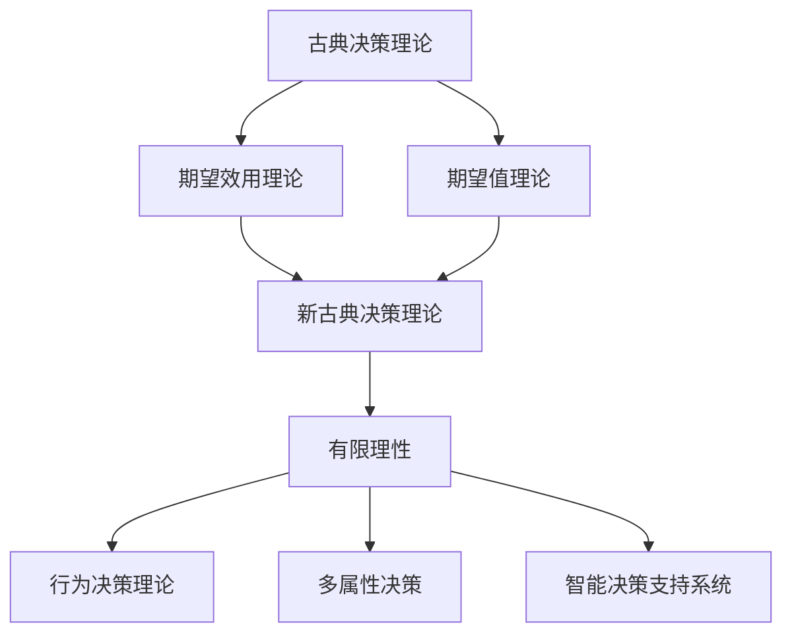
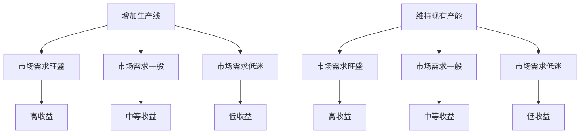

                 

## 引言

### 决策的重要性与挑战

在现代社会中，决策无处不在。无论是个人生活中的选择，还是企业管理中的战略制定，决策都扮演着至关重要的角色。然而，决策并非易事，它涉及多个因素的权衡和预测，需要管理者具备深厚的理论知识和实际经验。

决策的重要性体现在多个方面。首先，决策的正确与否直接影响到企业的命运。错误的决策可能导致资源浪费、市场失利甚至企业破产。其次，决策影响团队的士气和动力。良好的决策能够激励团队成员，提高工作效率，反之则可能导致团队士气低落。最后，决策影响着企业的长期发展。科学、合理的决策有助于企业制定长远战略，实现可持续发展。

然而，决策也面临着诸多挑战。首先，信息的不完全性和不确定性使得决策过程复杂化。管理者往往无法获取所有相关信息，或者无法预测未来可能发生的变化。其次，决策者自身的认知偏差和情绪因素也可能影响决策的客观性。例如，过度乐观或悲观、锚定效应和代表性偏差等都可能导致决策失误。最后，决策的复杂性也增加了决策的难度。现代企业的决策往往涉及多个维度和利益相关者，需要综合分析各种因素，制定最优方案。

### 本书的宗旨与结构

为了帮助管理者克服决策中的挑战，本书旨在构建一套科学决策的框架和方法。全书共分为六个章节，分别从决策理论基础、决策过程与方法、决策工具与模型、决策案例分析、决策实践指南等方面进行深入探讨。

- **第1章 引言**：介绍决策框架的重要性，概述本书的结构和内容。
- **第2章 决策理论基础**：阐述决策理论的发展历程、决策者的认知偏差以及决策理论的数学模型。
- **第3章 决策过程与方法**：详细解析决策过程模型、风险评估与决策、决策策略选择。
- **第4章 决策工具与模型**：介绍决策树分析、价值分析和线性规划等决策工具。
- **第5章 决策案例分析**：通过实际案例展示决策框架的应用。
- **第6章 决策实践指南**：提供决策实践的原则、注意事项和拓展阅读。

通过本书的学习，读者将能够掌握一套科学的决策方法，提高决策能力，从而更好地应对复杂多变的商业环境。

## 文章关键词

- 决策框架
- 科学决策
- 决策理论
- 决策过程
- 决策工具
- 决策模型
- 决策案例分析

## 文章摘要

本文旨在为管理者提供一套科学决策的框架和方法。通过深入探讨决策理论的发展、决策者的认知偏差、决策过程与方法、决策工具与模型以及实际案例分析，本文帮助读者理解并掌握科学决策的原理和实践。本书不仅提供了理论支持，还通过具体案例展示了决策框架的应用，旨在提高管理者的决策能力，从而更好地应对复杂多变的商业环境。

### 第1章 引言

#### 决策的重要性与挑战

在现代社会中，决策无处不在。无论是个人生活中的选择，还是企业管理中的战略制定，决策都扮演着至关重要的角色。然而，决策并非易事，它涉及多个因素的权衡和预测，需要管理者具备深厚的理论知识和实际经验。

**决策的重要性**体现在多个方面。首先，决策的正确与否直接影响到企业的命运。错误的决策可能导致资源浪费、市场失利甚至企业破产。其次，决策影响团队的士气和动力。良好的决策能够激励团队成员，提高工作效率，反之则可能导致团队士气低落。最后，决策影响着企业的长期发展。科学、合理的决策有助于企业制定长远战略，实现可持续发展。

**决策面临的挑战**同样不可忽视。首先，信息的不完全性和不确定性使得决策过程复杂化。管理者往往无法获取所有相关信息，或者无法预测未来可能发生的变化。其次，决策者自身的认知偏差和情绪因素也可能影响决策的客观性。例如，过度乐观或悲观、锚定效应和代表性偏差等都可能导致决策失误。最后，决策的复杂性也增加了决策的难度。现代企业的决策往往涉及多个维度和利益相关者，需要综合分析各种因素，制定最优方案。

#### 本书宗旨与结构

为了帮助管理者克服决策中的挑战，本书旨在构建一套科学决策的框架和方法。全书共分为六个章节，分别从决策理论基础、决策过程与方法、决策工具与模型、决策案例分析、决策实践指南等方面进行深入探讨。

**第1章 引言**：介绍决策框架的重要性，概述本书的结构和内容。

**第2章 决策理论基础**：阐述决策理论的发展历程、决策者的认知偏差以及决策理论的数学模型。

**第3章 决策过程与方法**：详细解析决策过程模型、风险评估与决策、决策策略选择。

**第4章 决策工具与模型**：介绍决策树分析、价值分析和线性规划等决策工具。

**第5章 决策案例分析**：通过实际案例展示决策框架的应用。

**第6章 决策实践指南**：提供决策实践的原则、注意事项和拓展阅读。

通过本书的学习，读者将能够掌握一套科学的决策方法，提高决策能力，从而更好地应对复杂多变的商业环境。

### 决策理论的发展

决策理论作为一个独立的学科，其发展历程可以追溯到20世纪中叶。从最初的古典决策理论到现代的复杂决策理论，决策理论经历了多次重要的演变和扩展。理解这些演变过程对于构建科学决策框架至关重要。

#### 古典决策理论

古典决策理论起源于20世纪40年代和50年代，主要基于理性主义假设。这种理论认为，决策者是完全理性的，他们能够通过最大化期望效用函数来做出最优决策。古典决策理论的代表性模型包括期望效用理论（Expected Utility Theory, EUT）和期望值理论（Expected Value Theory, EVT）。

- **期望效用理论（EUT）**：由约翰·冯·诺伊曼（John von Neumann）和奥斯卡·摩根斯坦（Oskar Morgenstern）在《博弈论与经济行为》（Theory of Games and Economic Behavior）一书中提出。EUT假设决策者面对的是一个概率分布的情境，他们会通过比较不同行动的期望效用值来做出选择。效用函数用于量化决策者对不同结果的偏好。

- **期望值理论（EVT）**：由理查德·塞勒（Richard Thaler）和丹尼尔·卡尼曼（Daniel Kahneman）等人提出，是对EUT的补充和修正。EVT认为，决策者可能会受到认知偏差的影响，导致他们的实际决策行为与理性假设不符。

古典决策理论的局限性在于，它假设了完全信息和无限的时间来做出决策。然而，在现实世界中，信息通常是有限的，时间也是有限的。这些局限性促使决策理论进一步发展。

#### 新古典决策理论

新古典决策理论（New Classical Decision Theory）在20世纪70年代开始兴起，试图解决古典决策理论的局限性。这种理论承认信息不完全和决策者认知偏差的存在，提出了更为现实的决策模型。

- **有限理性（Bounded Rationality）**：赫伯特·西蒙（Herbert Simon）提出了有限理性假设，认为决策者在面对复杂和不确定的情况时，无法做到完全理性，只能寻求“满意”解而非最优解。这一理论对古典决策理论的理性假设进行了修正。

- **决策过程模型**：新古典决策理论强调决策过程的重要性，提出了一系列模型来描述决策过程，如问题识别、信息搜索、方案评估和决策选择等。

#### 决策理论的现代发展

随着计算机技术和数据分析方法的发展，决策理论在20世纪80年代和90年代经历了现代发展。现代决策理论不仅涵盖了传统的经济学模型，还融入了心理学、社会学和计算机科学的研究成果。

- **行为决策理论（Behavioral Decision Theory）**：行为决策理论基于心理学和行为科学的研究，探讨了决策者如何受到认知偏差、情绪和情境因素影响。丹尼尔·卡尼曼和理查德·塞勒是该领域的代表人物，他们的研究为理解人类决策行为提供了新的视角。

- **多属性决策（Multi-Attribute Decision Making）**：多属性决策理论关注决策者面对多个目标、多个约束条件时的决策问题。这种方法考虑了决策者的偏好和权重，通过综合分析不同属性来选择最优方案。

- **智能决策支持系统（Intelligent Decision Support Systems）**：智能决策支持系统结合了人工智能和数据分析技术，为决策者提供自动化的决策支持。这些系统通常包括专家系统、数据挖掘和机器学习算法，能够处理大量数据并生成决策建议。

#### 决策理论架构与联系

综合来看，不同阶段的决策理论在概念和模型上存在一定的关联和继承。古典决策理论提供了基本框架，新古典决策理论对其进行了修正，而现代决策理论则进一步扩展了其应用范围。

- **从理性到有限理性**：古典决策理论强调完全理性，而新古典决策理论则引入了有限理性假设，承认人类决策的局限性。
- **从单一目标到多属性决策**：古典决策理论通常关注单一目标的最大化，而现代决策理论则考虑了多个目标之间的权衡和优化。
- **从静态分析到动态过程**：古典决策理论关注决策结果，而现代决策理论则更关注决策过程，包括信息搜索、方案评估和决策选择等步骤。

下图展示了决策理论的发展历程及其主要联系：

通过理解决策理论的发展历程，管理者可以更好地选择和应用不同的决策模型，以应对复杂多变的商业环境。

### 决策者的认知偏差

在决策过程中，决策者往往会受到各种认知偏差的影响，这些偏差可能源自人类大脑的自然局限性和环境因素。理解这些认知偏差有助于管理者更好地识别和纠正决策中的错误，从而提高决策的客观性和有效性。

#### 暂时性偏差

暂时性偏差（Temporal Bias）是指决策者在对未来事件进行评估时，更倾向于给予近期事件更高的权重，而低估了长远的影响。这种偏差可能导致管理者在制定短期策略时忽视长期目标，从而影响企业的可持续发展。

**案例分析**：一家公司在面临市场变化时，可能会倾向于快速采取行动以应对短期需求，而忽视了这些短期决策对长期竞争力的影响。例如，通过大幅度降价来吸引客户，短期内可能提高了销售额，但长期来看可能导致利润下降，损害品牌形象。

**纠正方法**：为了克服暂时性偏差，管理者可以采取以下策略：
1. **长期目标设定**：明确企业的长期目标，并确保短期决策与长期目标一致。
2. **情景分析**：通过模拟不同情景下的长期结果，帮助决策者更全面地评估短期决策的长期影响。
3. **定期回顾**：定期回顾和调整决策，确保短期行动与长期目标保持一致。

#### 代表性偏差

代表性偏差（Representativeness Bias）是指决策者在评估某个事件或方案时，更倾向于根据其表面特征进行判断，而忽略了相关概率和统计规律。这种偏差可能导致管理者过分强调某些表面的相似性，而忽视了实际的概率和期望值。

**案例分析**：在投资决策中，决策者可能会因为某只股票近期表现良好，而错误地认为其未来将继续表现优秀。即使从长期数据看，该股票的收益并不具备显著优势，但代表性偏差使得决策者倾向于选择该股票。

**纠正方法**：为了克服代表性偏差，管理者可以采取以下策略：
1. **数据驱动决策**：依赖历史数据和统计分析，而非仅凭表面特征进行判断。
2. **概率思维**：重视概率和期望值，而不是单一事件的表面表现。
3. **多元化投资**：分散投资组合，减少因代表性偏差导致的投资风险。

#### 锚定效应

锚定效应（Anchoring Effect）是指决策者在做决策时，会受到初始信息或参考点（锚）的影响，从而过度依赖这些信息，导致后续评估和决策不准确。这种偏差可能导致管理者在制定决策时，无法灵活调整，而是受限于初始的锚点。

**案例分析**：在制定预算时，管理者可能会受到上一年度的预算数值的影响，而未充分考虑市场变化和实际需求，导致预算过高或过低。

**纠正方法**：为了克服锚定效应，管理者可以采取以下策略：
1. **独立思考**：在制定决策时，避免过早依赖初始信息，而是基于全面的数据和分析。
2. **多次迭代**：通过多次讨论和调整，逐步优化决策。
3. **信息透明**：确保决策过程中信息透明，减少信息不对称对决策的影响。

#### 确认偏差

确认偏差（Confirmation Bias）是指决策者在获取和处理信息时，倾向于寻找和接受支持已有观点的证据，而忽视或质疑相反的证据。这种偏差可能导致管理者在决策过程中，无法客观评估不同方案，从而做出偏颇的决策。

**案例分析**：在产品开发中，如果一个团队已经确定了某个方向，他们可能会忽视或低估其他潜在更有价值的方向，即使有数据或用户反馈表明后者可能更具潜力。

**纠正方法**：为了克服确认偏差，管理者可以采取以下策略：
1. **多元化的信息来源**：确保信息来源的多样性和独立性，避免单一信息源带来的偏见。
2. **开放的沟通环境**：鼓励团队成员提出不同的观点和方案，促进开放、诚实的讨论。
3. **第三方评估**：邀请外部专家或顾问进行评估，提供客观的反馈和建议。

通过识别和纠正这些认知偏差，管理者可以在决策过程中更加客观、理性，从而提高决策的质量和效果。

### 决策理论的数学模型

在决策过程中，数学模型提供了量化分析和优化决策的工具。理解这些数学模型有助于决策者更清晰地评估不同方案，并做出最优决策。以下是一些常见的决策数学模型及其应用。

#### 期望效用理论（Expected Utility Theory）

期望效用理论是古典决策理论的核心，由约翰·冯·诺伊曼和奥斯卡·摩根斯坦提出。该理论假设决策者在面对不确定性时，会根据不同结果的概率和效用值来选择行动。

- **公式表示**：$$EU(A) = \sum_{i} p_i u(x_i)$$

  其中，\(EU(A)\) 是选择行动 \(A\) 的期望效用，\(p_i\) 是结果 \(x_i\) 发生的概率，\(u(x_i)\) 是结果 \(x_i\) 的效用值。

- **应用举例**：假设一个投资者在股票市场中选择投资股票 \(A\) 或债券 \(B\)，股票的期望收益率为 15%，而债券的期望收益率为 5%。股票的风险较大，可能产生亏损，而债券相对稳定。投资者可以通过计算两者的期望效用来做出决策。

  $$EU(A) = 0.5 \times (-10\%) + 0.5 \times 15\% = 4\%$$
  $$EU(B) = 1 \times 5\% = 5\%$$

  在此例中，投资者选择债券 \(B\) 因为它的期望效用更高。

#### 期望值理论（Expected Value Theory）

期望值理论是对期望效用理论的补充，由理查德·塞勒提出。该理论认为，在面临不确定性时，决策者会根据期望值来做出决策，而不考虑结果的效用。

- **公式表示**：$$EV(A) = \sum_{i} p_i x_i$$

  其中，\(EV(A)\) 是选择行动 \(A\) 的期望值，\(p_i\) 是结果 \(x_i\) 发生的概率，\(x_i\) 是结果 \(x_i\) 的数值。

- **应用举例**：假设一个项目经理在项目管理中需要决定是否增加资源投入，如果增加资源，项目成功的概率为 0.7，预计收益为 10 万元；如果不增加资源，项目成功的概率为 0.3，预计收益为 3 万元。可以通过计算期望值来做出决策。

  $$EV(增加资源) = 0.7 \times 10万元 + 0.3 \times 3万元 = 7万元 + 0.9万元 = 7.9万元$$
  $$EV(不增加资源) = 0.3 \times 3万元 + 0.7 \times 0万元 = 0.9万元$$

  在此例中，增加资源因为期望值更高。

#### 有限理性模型（Bounded Rationality Model）

有限理性模型由赫伯特·西蒙提出，认为决策者在面对复杂和不确定性时，无法做到完全理性，只能寻求满意解。该模型引入了“满意标准”和“选择过程”的概念。

- **公式表示**：$$S \geq f(W, S')$$

  其中，\(S\) 是当前解决方案，\(f(W, S')\) 是基于现有信息 \(W\) 和候选解决方案 \(S'\) 计算的效用函数。

- **应用举例**：在产品开发过程中，团队需要在多个功能中做出选择。通过比较不同功能的效用值，选择满足用户需求且资源消耗最小的功能。

  $$f(用户体验, 功能完整性) = 0.6 \times 8 + 0.4 \times 7 = 7.2 + 2.8 = 10$$
  $$f(性能优化, 功能完整性) = 0.6 \times 7 + 0.4 \times 8 = 4.2 + 3.2 = 7.4$$

  在此例中，选择用户体验更高的功能因为其效用值更高。

#### 多目标优化模型（Multi-Objective Optimization Model）

多目标优化模型用于解决涉及多个目标的决策问题。通过平衡不同目标之间的权衡关系，找到最优或满意解。

- **公式表示**：$$\min_{x} f(x)$$
  $$\text{subject to}$$
  $$g_i(x) \leq 0$$
  $$h_i(x) = 0$$

  其中，\(f(x)\) 是目标函数，\(g_i(x)\) 是不等式约束，\(h_i(x)\) 是等式约束。

- **应用举例**：在供应链管理中，决策者需要平衡库存成本、运输成本和客户服务水平。可以通过建立多目标优化模型来找到最佳库存水平和运输策略。

  $$\min \{C_{\text{库存}} + C_{\text{运输}}\}$$
  $$\text{subject to}$$
  $$C_{\text{库存}} = 0.1 \times Q$$
  $$C_{\text{运输}} = 0.05 \times D$$
  $$Q \geq L$$
  $$D \geq S$$

  在此例中，目标是最小化库存成本和运输成本，同时确保库存量和运输量满足需求。

通过理解并应用这些数学模型，决策者可以更科学地分析和优化决策问题，提高决策的准确性和有效性。

### 决策过程模型

在制定任何决策时，一个系统的过程模型可以极大地提高决策的质量和效率。决策过程模型描述了从问题识别到决策执行的各个步骤，并提供了评估和优化决策过程的工具。以下将详细描述几个常见的决策过程模型，包括其步骤和作用。

#### 计划-执行-检查（PDCA）循环

**PDCA循环**，也称为戴明循环，是一种常见的决策过程模型，它分为四个步骤：计划（Plan）、执行（Do）、检查（Check）和行动（Act）。每个步骤都是决策过程中的一个重要环节，相互衔接，形成一个持续改进的循环。

1. **计划（Plan）**：在这一步，决策者明确问题、目标以及实现目标的方案。计划阶段包括目标设定、资源分配和策略制定。通过细致的计划，决策者可以确保决策的方向和目标清晰明确。

2. **执行（Do）**：计划制定完成后，进入执行阶段。在这一阶段，决策者将计划付诸实践，实施具体的行动步骤。执行过程中，需要确保所有团队成员明确任务、责任和期望结果。

3. **检查（Check）**：执行完成后，进行评估和反馈。检查阶段的主要任务是评估决策结果是否符合预期目标，并识别执行过程中的问题和不足。通过数据分析和实际反馈，决策者可以了解决策的实际效果。

4. **行动（Act）**：根据检查结果，对决策过程进行调整和优化。如果决策效果良好，则继续执行并进一步完善；如果存在问题，则需要重新制定计划并执行。

**PDCA循环的作用**：PDCA循环不仅提供了一个系统的决策过程，还有助于培养团队持续改进和反思的能力，从而不断提升决策质量。

#### SWOT分析

**SWOT分析**（Strengths, Weaknesses, Opportunities, Threats）是一种常用的战略规划工具，用于分析企业或项目的内部和外部环境。SWOT分析的步骤如下：

1. **识别优势（Strengths）**：分析企业或项目在资源、能力、市场地位等方面的优势。

2. **识别劣势（Weaknesses）**：识别企业或项目在资源、能力、市场地位等方面的不足。

3. **识别机会（Opportunities）**：分析外部环境中的潜在机会，如市场变化、技术进步、政策支持等。

4. **识别威胁（Threats）**：识别外部环境中的潜在威胁，如竞争对手、市场饱和、技术变革等。

**SWOT分析的作用**：通过SWOT分析，决策者可以全面了解企业或项目的内外部环境，从而制定更加科学和有针对性的决策。SWOT分析有助于明确企业的优势与劣势，抓住市场机会，规避潜在风险。

#### PEST分析

**PEST分析**（Political, Economic, Social, Technological）是一种用于分析宏观环境的工具，主要关注影响企业或项目的外部因素。

1. **政治因素（Political）**：包括政府政策、法规变化、国际关系等。

2. **经济因素（Economic）**：包括经济增长、通货膨胀、就业率等。

3. **社会因素（Social）**：包括人口结构、文化趋势、消费者行为等。

4. **技术因素（Technological）**：包括技术发展、创新速度、技术应用等。

**PEST分析的作用**：PEST分析帮助决策者了解外部环境的宏观趋势和变化，从而制定适应外部环境的决策。通过分析政治、经济、社会和技术因素，决策者可以更好地把握市场动态，制定长远的战略规划。

#### 市场调研

**市场调研**是决策过程中的关键步骤，通过收集和分析市场数据，决策者可以更准确地了解市场需求和消费者行为。

1. **确定调研目标**：明确调研的目的和需要收集的信息。

2. **设计调研方法**：选择合适的调研方法，如问卷调查、访谈、焦点小组等。

3. **收集数据**：通过实地调研、在线调查等方式收集数据。

4. **分析数据**：对收集到的数据进行分析，提取有用的信息。

5. **报告和决策**：撰写调研报告，并根据分析结果制定决策。

**市场调研的作用**：市场调研帮助决策者了解市场现状和趋势，识别机会和风险，从而制定更加科学和有效的市场策略。

#### 决策过程模型的应用

上述决策过程模型可以单独使用，也可以结合使用，以应对不同类型的决策问题。例如，在制定新产品开发策略时，可以首先进行SWOT分析，了解企业的内部和外部环境；然后进行PEST分析，了解宏观环境的变化趋势；接着通过市场调研收集消费者数据，分析市场需求和竞争状况；最后结合PDCA循环，制定详细的产品开发计划并实施。

通过系统化的决策过程模型，管理者可以更加科学、理性地制定和执行决策，从而提高决策质量和效果。

### 风险评估与决策

在决策过程中，风险评估是一个至关重要的环节。通过系统地评估潜在风险，管理者可以更好地了解决策的潜在负面影响，并制定相应的应对策略，以确保决策的可行性和安全性。

#### 风险识别

风险识别是风险评估的第一步，旨在识别可能影响决策的潜在风险。以下是一些常见的风险识别方法：

1. **头脑风暴**：通过集体讨论，识别可能的负面风险。团队成员可以自由发表意见，提出潜在问题。

2. **故障模式与影响分析（FMEA）**：FMEA是一种系统化的方法，用于识别潜在故障和其影响。通过分析每个故障的可能性和影响，确定关键风险点。

3. **历史数据分析**：通过分析历史数据，识别过去类似决策中出现的风险。这种方法有助于发现规律和趋势。

4. **专家评估**：邀请相关领域的专家进行风险评估，利用他们的专业知识和经验来识别潜在风险。

#### 风险评估

在识别出潜在风险后，需要对每个风险进行评估，以确定其严重性和发生的可能性。以下是一些常用的风险评估方法：

1. **定性风险评估**：通过专家评估、问卷调查等方法，对风险进行定性分析，评估其严重性和发生可能性。

2. **定量风险评估**：使用数学模型和统计方法，对风险进行量化分析，计算风险的概率和潜在损失。常见的定量评估方法包括概率分布分析、蒙特卡罗模拟等。

3. **风险矩阵**：使用风险矩阵来评估每个风险的严重性和发生可能性。风险矩阵通常以二维图表的形式呈现，横轴表示风险的发生可能性，纵轴表示风险的严重性。

#### 风险应对策略

根据风险评估的结果，制定相应的风险应对策略。以下是一些常见的风险应对策略：

1. **风险规避**：通过改变决策方案，避免风险的发生。例如，选择其他供应商以规避供应链中断的风险。

2. **风险减轻**：通过采取措施减少风险的影响。例如，增加库存以减轻供应链中断的风险。

3. **风险转移**：将风险转移给第三方，如购买保险、外包部分业务等。

4. **风险接受**：对于无法规避或减轻的风险，选择接受风险并制定应对措施，以最小化损失。

#### 风险决策模型

在制定决策时，可以使用以下风险决策模型来帮助管理者做出最优选择：

1. **决策树分析**：通过构建决策树，列出所有可能的结果和相应的概率和效用值，帮助决策者评估不同决策方案的风险和收益。

2. **期望效用理论**：基于概率和效用值，计算每个决策方案的期望效用，选择期望效用最高的方案。

3. **多属性决策分析**：考虑多个目标和约束条件，使用多属性决策分析方法，如加权评分法、层次分析法等，综合评估不同决策方案。

通过系统地识别、评估和应对风险，管理者可以降低决策的不确定性，提高决策的质量和可靠性。

### 决策策略选择

在决策过程中，选择合适的策略至关重要。不同的决策策略适用于不同的情境，管理者需要根据具体情况选择最佳策略。以下是几种常见的决策策略及其适用条件。

#### 谨慎策略

**谨慎策略**，也称为保守策略，主要适用于高风险、不确定性较大的情境。这种策略的核心思想是减少风险，确保决策的可接受性。

- **适用条件**：当决策涉及到大量资源投入、技术不确定性高、市场变化快速时，谨慎策略是较为合适的选择。
- **方法**：谨慎策略通常包括以下方法：
  1. **逐步实施**：分阶段实施决策，每一步都进行充分评估和反馈，确保决策的每一步都是可控的。
  2. **备份计划**：制定详细的备份计划，以应对可能出现的意外情况。
  3. **限制风险暴露**：通过限制风险暴露的时间和规模，降低潜在损失。

#### 冒险策略

**冒险策略**，也称为激进策略，主要适用于低风险、高收益的情境。这种策略的核心思想是抓住市场机会，追求最大化的收益。

- **适用条件**：当市场机会明确、技术成熟、资源充裕时，冒险策略是较为合适的选择。
- **方法**：冒险策略通常包括以下方法：
  1. **大量投资**：投入大量资源以快速占领市场。
  2. **快速迭代**：采用快速迭代开发方法，快速推出产品并获取用户反馈。
  3. **风险投资**：通过风险投资获取额外的资金和资源，以支持决策的实施。

#### 中庸策略

**中庸策略**，也称为平衡策略，适用于风险适中、收益适中的情境。这种策略的核心思想是在风险和收益之间找到平衡点，确保决策的稳定性和可持续性。

- **适用条件**：当市场变化稳定、技术成熟度适中、资源有限时，中庸策略是较为合适的选择。
- **方法**：中庸策略通常包括以下方法：
  1. **稳健发展**：稳步推进决策，确保每一步都在可控范围内。
  2. **资源优化**：合理分配资源，确保在不同阶段都有足够的资源支持。
  3. **灵活调整**：根据市场反馈和实际情况，及时调整决策策略，以适应变化。

#### 不同策略的比较与选择

- **风险对比**：谨慎策略风险最低，但收益也相对较低；冒险策略风险最高，但潜在收益也最大；中庸策略风险适中，收益也适中。
- **资源对比**：谨慎策略通常需要较多的资源和时间来确保决策的可行性；冒险策略需要大量的资金和资源以抓住市场机会；中庸策略则较为节省资源。
- **适用情境**：谨慎策略适用于高风险、不确定性大的情境；冒险策略适用于低风险、高机会的情境；中庸策略适用于风险适中、收益适中的情境。

通过综合考虑风险、资源和情境，管理者可以做出更为科学和合理的决策策略选择。

### 决策树分析

决策树分析是一种常用的决策支持工具，通过图形化的方式展示决策过程中的各种可能性和相应的结果。决策树分析可以帮助管理者系统地分析和评估不同决策方案，从而做出最优选择。

#### 基本概念

**决策树**由以下几个基本元素组成：

1. **决策节点**：表示决策点，即需要做出决策的位置。
2. **机会节点**：表示可能的结果，即决策执行后可能出现的不同情况。
3. **概率分支**：表示不同结果发生的概率。
4. **结果节点**：表示最终的决策结果，通常以效用值或收益值表示。
5. **路径**：从决策节点到结果节点的连接线，表示一种可能的决策路径。

#### 决策树构建步骤

1. **确定决策节点**：首先确定需要做出决策的关键点，这通常是决策树分析的核心。
2. **列出备选方案**：为每个决策节点列出所有可能的备选方案。
3. **评估结果**：为每个机会节点评估可能的结果，并计算其概率和效用值。
4. **绘制决策树**：根据上述信息绘制决策树，确保每个节点和分支都清晰明了。
5. **计算期望效用**：从结果节点开始，反向计算每个路径的期望效用值。

#### 实例分析

假设一家公司需要决定是否增加生产线产能。以下是决策树分析的步骤和结果：

1. **确定决策节点**：是否增加生产线产能。
2. **列出备选方案**：
   - 方案A：增加生产线。
   - 方案B：维持现有产能。
3. **评估结果**：
   - 增加生产线：
     - 结果1：市场需求旺盛，收益高，概率为0.6。
     - 结果2：市场需求一般，收益中等，概率为0.3。
     - 结果3：市场需求低迷，收益低，概率为0.1。
   - 维持现有产能：
     - 结果1：市场需求旺盛，收益高，概率为0.4。
     - 结果2：市场需求一般，收益中等，概率为0.5。
     - 结果3：市场需求低迷，收益低，概率为0.1。
4. **绘制决策树**：

5. **计算期望效用**：

   对于方案A：
   $$EU(A) = 0.6 \times 高收益 + 0.3 \times 中等收益 + 0.1 \times 低收益$$

   对于方案B：
   $$EU(B) = 0.4 \times 高收益 + 0.5 \times 中等收益 + 0.1 \times 低收益$$

根据期望效用计算，选择期望效用更高的方案。

#### 决策树的应用场景

决策树分析适用于多种决策场景，如：

- **项目投资决策**：评估不同项目的预期收益和风险。
- **新产品开发**：比较不同产品方案的市场潜力。
- **市场营销策略**：选择最有效的市场推广方案。
- **人力资源管理**：评估不同招聘策略的成本和收益。

通过决策树分析，管理者可以更清晰地了解不同决策方案的结果和风险，从而做出更科学的决策。

### 价值分析

价值分析（Value Analysis）是一种系统的方法，用于评估产品或项目的成本和效益，以确定其经济价值和可行性。该方法广泛应用于工程、项目管理、采购等领域，旨在通过优化成本和提升价值，实现资源的最佳配置。

#### 基本概念

**价值分析**的核心概念是**价值**（Value），其定义为功能（Function）与成本（Cost）的比值。公式表示为：

$$V = \frac{F}{C}$$

其中，\(V\) 代表价值，\(F\) 代表功能，\(C\) 代表成本。

- **功能**：指产品或项目应实现的功能或效用。
- **成本**：指实现这些功能所需的总成本，包括直接成本和间接成本。

#### 价值分析的基本步骤

1. **识别功能**：明确产品或项目需要实现的所有功能。
2. **评估功能成本**：计算每个功能所需的成本。
3. **计算价值**：根据公式计算每个功能的价值。
4. **优化价值**：通过改进设计和流程，降低成本，提升价值。

#### 实例分析

假设一家公司需要评估一款新产品的价值，以下是价值分析的步骤：

1. **识别功能**：
   - 功能1：外观设计
   - 功能2：功能特性
   - 功能3：耐用性
   - 功能4：易用性
2. **评估功能成本**：
   - 功能1（外观设计）：成本为 10 万元
   - 功能2（功能特性）：成本为 20 万元
   - 功能3（耐用性）：成本为 15 万元
   - 功能4（易用性）：成本为 5 万元
3. **计算价值**：
   - 总成本：\(10 + 20 + 15 + 5 = 50\) 万元
   - 总功能：假设所有功能同等重要，总功能为 4
   - 平均价值：\(\frac{4}{50} = 0.08\)
4. **优化价值**：
   - 分析每个功能的成本，寻找可以降低成本的环节。
   - 例如，通过优化外观设计，减少材料成本，将成本降低至 8 万元。
   - 重新计算价值：\(\frac{4}{8 + 20 + 15 + 5} = 0.1\)

通过价值分析，公司可以明确每个功能的成本和价值，从而优化设计，提高产品的整体价值。

#### 价值分析的应用场景

价值分析适用于多种应用场景，包括：

- **新产品开发**：评估不同设计方案的成本和效益，选择最优方案。
- **采购管理**：优化采购流程，降低采购成本。
- **项目预算**：确保项目资源分配合理，避免资源浪费。
- **质量管理**：通过分析成本与功能，提升产品质量。

通过系统化的价值分析，企业可以更加科学地管理成本，提升产品或项目的价值，从而实现可持续发展。

### 线性规划

线性规划（Linear Programming，LP）是一种数学优化方法，用于在给定的线性约束条件下，最大化或最小化一个线性目标函数。线性规划广泛应用于资源分配、生产规划、交通调度等领域，是决策分析中的重要工具。

#### 基本概念

线性规划由以下元素组成：

1. **目标函数**：需要最大化或最小化的线性表达式，通常表示为：
   $$\max \min z = c^T x$$
   其中，\(z\) 是目标函数，\(c\) 是目标函数系数向量，\(x\) 是决策变量向量。

2. **约束条件**：限制目标函数的线性不等式或等式，通常表示为：
   $$\text{subject to}$$
   $$Ax \leq b$$
   $$Ax = b$$
   $$Ax \geq b$$
   其中，\(A\) 是约束矩阵，\(b\) 是约束向量，\(x\) 是决策变量向量。

3. **决策变量**：决策问题中需要确定的变量，通常表示为 \(x\)。

#### 线性规划标准形式

线性规划的标准形式为：
$$\begin{aligned}
\max_{x} \quad & c^T x \\
\text{subject to} \quad & Ax \leq b \\
& x \geq 0
\end{aligned}$$

#### 线性规划的求解方法

1. **图解法**：适用于两个变量的问题，通过在坐标系中绘制约束条件，找到可行域，并找到目标函数的最大值或最小值。

2. **单纯形法**：适用于多变量问题，通过迭代逐步改进解，直到找到最优解。

3. **内点法**：通过迭代方法在内点区域求解，适用于大规模线性规划问题。

4. **拉格朗日乘数法**：通过引入拉格朗日乘子，将约束条件引入目标函数，求解对偶问题。

#### 实例分析

假设一家工厂需要安排生产线生产两种产品A和B，每个产品都需要经过三个步骤加工。每个步骤的加工时间和利润如下表所示：

| 产品 | 加工步骤1 | 加工步骤2 | 加工步骤3 | 单位利润 |
|------|------------|------------|------------|---------|
| A    | 2小时      | 3小时      | 1小时      | 200元   |
| B    | 3小时      | 2小时      | 2小时      | 150元   |

每天工厂有12小时的加工时间。目标是最大化总利润。

**目标函数**：
$$\max z = 200x + 150y$$

**约束条件**：
$$2x + 3y \leq 12$$
$$3x + 2y \leq 12$$
$$x + y \leq 6$$
$$x, y \geq 0$$

**图解法求解**：

首先，在坐标系中绘制每个约束条件的直线，并找到可行域：

1. \(2x + 3y = 12\)
2. \(3x + 2y = 12\)
3. \(x + y = 6\)

这些直线的交点即为可行域的顶点。通过计算顶点的利润值，找到最优解。

**计算过程**：

1. 可行域顶点：
   - \(A(0, 0)\)
   - \(B(0, 2)\)
   - \(C(2, 0)\)
   - \(D(3, 3)\)
   - \(E(6, 0)\)

2. 计算每个顶点的目标函数值：
   - \(z(A) = 200 \times 0 + 150 \times 0 = 0\)
   - \(z(B) = 200 \times 0 + 150 \times 2 = 300\)
   - \(z(C) = 200 \times 2 + 150 \times 0 = 400\)
   - \(z(D) = 200 \times 3 + 150 \times 3 = 1050\)
   - \(z(E) = 200 \times 6 + 150 \times 0 = 1200\)

最优解为 \(x = 3, y = 3\)，最大利润为 1050 元。

#### 线性规划的应用场景

线性规划广泛应用于各种领域，包括：

- **资源分配**：优化资源使用，最大化收益或最小化成本。
- **生产规划**：确定生产计划，优化生产效率和利润。
- **交通调度**：优化交通流量，减少拥堵和环境污染。
- **供应链管理**：优化库存水平和供应链网络。

通过线性规划，企业可以更加科学地制定决策，提高运营效率和经济效益。

### 企业并购案例分析

企业并购是企业扩展业务、实现市场占有率和盈利能力提升的常见手段。然而，并购决策复杂且风险较高，需要科学的方法来评估和决策。以下通过一个实际案例，详细解析企业并购决策过程。

#### 案例背景

某大型科技公司（A公司）正在考虑并购一家新兴的云计算公司（B公司）。A公司是一家在信息技术领域拥有广泛业务和深厚技术积累的领军企业，而B公司则是一家专注于云计算领域的创新型企业，具备先进的云计算技术和市场潜力。A公司希望通过并购B公司，拓展其在云计算市场的影响力，同时引入B公司的技术优势，提升整体竞争力。

#### 决策过程

1. **识别并购动机**：
   - **市场扩展**：通过并购B公司，A公司可以迅速进入云计算市场，扩大业务领域。
   - **技术整合**：B公司的云计算技术对A公司现有技术体系形成互补，有助于提升产品和服务质量。
   - **成本优化**：并购后，A公司可以通过整合资源，优化运营成本，提高整体效益。

2. **风险评估**：
   - **市场风险**：云计算市场竞争激烈，未来市场趋势不确定，需要评估并购后的市场前景。
   - **技术风险**：B公司的技术是否成熟，与A公司的技术体系是否兼容，以及技术升级和转型可能带来的挑战。
   - **财务风险**：并购需要大量资金投入，需要评估并购后的财务状况和资金流动。

3. **并购策略选择**：
   - **谨慎策略**：通过逐步实施，分阶段并购，确保并购过程中的可控性和稳定性。
   - **冒险策略**：通过全面并购，快速整合B公司的技术和市场资源，抢占市场先机。

4. **并购决策模型应用**：
   - **决策树分析**：构建决策树，列出所有可能的并购结果，计算每个结果的概率和效用值，选择最优并购方案。
   - **期望效用理论**：根据B公司的市场潜力、技术优势和财务状况，计算并购的期望效用，选择最优并购方案。

5. **并购执行**：
   - **制定详细计划**：明确并购的具体步骤、时间表和责任人。
   - **执行并购协议**：完成法律手续，签订并购协议。
   - **整合资源**：并购后，A公司需要整合B公司的技术、市场和人力资源，确保并购后的运营效率。

#### 案例分析结果

通过系统的并购决策过程，A公司最终决定采取冒险策略，全面并购B公司。以下为并购决策的分析和结果：

1. **市场前景评估**：
   - 根据市场调研，云计算市场未来5年预计增长率为20%，并购后A公司在云计算市场的占有率预计提升30%。

2. **技术整合评估**：
   - B公司的云计算技术成熟，与A公司现有技术体系兼容性好，预计技术整合后的研发周期为6个月。

3. **财务状况评估**：
   - 并购B公司需要投入5亿美元，预计并购后的财务回报率为15%。

4. **决策结果**：
   - 根据决策树分析和期望效用计算，A公司选择全面并购B公司，预计未来5年增加收益2亿美元。

通过这个案例，我们可以看到，企业并购决策需要综合考虑市场、技术和财务等多方面因素，通过科学的决策方法，确保并购的可行性和有效性。

### 新产品开发案例分析

在新产品开发过程中，决策者需要综合考虑市场需求、技术可行性、成本效益等多个因素，以确定最佳的开发策略和方案。以下通过一个实际案例，详细解析新产品开发的决策过程。

#### 案例背景

某电子产品公司（C公司）正在开发一款新型智能手机。公司市场部门通过市场调研发现，消费者对智能手机的性能、续航和设计有较高的需求。技术部门提出多种技术方案，包括高性能处理器、高容量电池和时尚外观设计。为了确保新产品能够满足市场需求，并具备竞争力，C公司决定通过科学决策方法，制定最佳的开发策略。

#### 决策过程

1. **需求分析**：
   - **市场调研**：通过问卷调查、用户访谈等方式，了解消费者对智能手机性能、续航和设计的具体需求。
   - **数据分析**：对市场数据进行分析，识别主要竞争对手的产品特点和市场表现，为开发决策提供依据。

2. **技术评估**：
   - **技术调研**：评估不同技术方案的性能、成本和可行性，包括处理器、电池和外观设计。
   - **技术对比**：通过构建技术矩阵，对比不同技术方案的优势和劣势，确定最佳技术组合。

3. **成本效益分析**：
   - **成本预算**：根据技术评估结果，制定初步的成本预算，包括研发成本、生产成本和营销成本。
   - **效益预测**：预测不同开发方案的市场前景和收益，选择经济效益最高的方案。

4. **决策策略选择**：
   - **谨慎策略**：逐步实施，分阶段开发，确保每一步都有充分评估和反馈。
   - **冒险策略**：一次性投入，快速开发，抢占市场先机。
   - **中庸策略**：平衡风险和收益，选择中等水平的技术方案和市场策略。

5. **决策模型应用**：
   - **决策树分析**：构建决策树，列出所有可能的开发方案，计算每个方案的效用值和概率，选择最优方案。
   - **多属性决策分析**：考虑多个目标和约束条件，使用多属性决策分析方法，如加权评分法，确定最佳开发策略。

6. **决策执行**：
   - **制定开发计划**：明确开发步骤、时间表和责任人。
   - **技术实施**：根据最佳开发方案，进行技术研发和设计。
   - **市场推广**：制定市场推广策略，确保新产品能够迅速占领市场。

#### 案例分析结果

通过系统的决策过程，C公司最终选择了以下开发策略：

1. **技术方案**：
   - **高性能处理器**：选择市场上最新、性能最高的处理器，确保手机性能领先。
   - **高容量电池**：采用最新电池技术，提高电池续航能力，满足消费者对续航的需求。
   - **时尚外观设计**：设计团队结合时尚元素和用户体验，打造独特的外观设计。

2. **成本预算**：
   - 研发成本：约1亿美元。
   - 生产成本：约5000万美元。
   - 营销成本：约3000万美元。

3. **效益预测**：
   - 市场份额：预计在发布后的第一年内占据20%的市场份额。
   - 收益：预计第一年收益为3亿美元。

通过决策树分析和多属性决策分析，C公司选择了最优的开发策略，确保新产品在市场竞争中具备优势。

### 项目投资决策案例分析

项目投资决策是企业管理中的一项重要任务，涉及大量资金和资源的投入，需要通过科学的方法进行评估和决策。以下通过一个实际案例，详细解析项目投资决策的整个过程。

#### 案例背景

某制造业公司（D公司）正在考虑投资建设一条新的生产线，以扩大生产能力并提高产品竞争力。新生产线预计总投资为1亿美元，预计寿命为10年。公司管理层希望通过科学决策，确保投资的有效性和收益性。

#### 决策过程

1. **项目识别**：
   - **市场调研**：通过市场调研，了解市场需求和竞争状况，确定投资项目的必要性。
   - **技术评估**：评估新生产线的技术可行性，包括设备选型、生产工艺和自动化水平。

2. **项目评估**：
   - **财务分析**：计算项目的初始投资成本、运营成本、预期收益和净现值（NPV）。
     $$NPV = \sum_{t=1}^{n} \frac{F_t}{(1+r)^t} - I$$
     其中，\(F_t\) 为第 \(t\) 年的现金流，\(r\) 为折现率，\(I\) 为初始投资成本。
   - **风险评估**：识别项目可能面临的市场风险、技术风险和财务风险，并评估其影响。

3. **决策模型应用**：
   - **决策树分析**：构建决策树，列出所有可能的决策路径和相应的概率及收益。
   - **多属性决策分析**：考虑多个目标和约束条件，使用多属性决策分析方法，如加权评分法，选择最优投资方案。

4. **决策执行**：
   - **制定详细计划**：明确项目的具体实施步骤、时间表和责任人。
   - **项目实施**：根据最佳决策方案，进行项目投资和建设。
   - **监控与调整**：项目实施过程中，定期监控项目进展和财务状况，及时调整决策和计划。

#### 案例分析结果

通过系统的投资决策过程，D公司选择了以下投资方案：

1. **财务分析**：
   - 初始投资成本：1亿美元。
   - 运营成本：每年5000万美元。
   - 预期收益：每年8000万美元。
   - 净现值（NPV）：1000万美元。

2. **风险评估**：
   - **市场风险**：市场需求波动可能影响项目收益。
   - **技术风险**：设备故障和工艺不稳定可能影响生产效率。
   - **财务风险**：融资成本上升可能增加财务压力。

3. **决策结果**：
   - 根据决策树分析和多属性决策分析，D公司决定投资建设新生产线，预计项目净现值为1000万美元，具有良好的投资回报。

通过这个案例，我们可以看到，项目投资决策需要综合考虑财务、市场和技术的多方面因素，通过科学的决策方法，确保投资的有效性和收益性。

### 决策实践指南

#### 决策实践的原则

在进行决策时，管理者应遵循以下原则，以确保决策的科学性和有效性。

1. **信息透明**：确保决策过程中的信息透明，避免信息不对称。所有决策参与者应能够获取到准确和全面的信息。

2. **数据驱动**：依赖可靠的数据进行分析和决策，避免凭直觉或主观判断做出决策。使用数据分析工具和方法，如决策树、线性规划等，提高决策的准确性。

3. **风险评估**：在决策过程中，系统评估潜在风险，并制定相应的应对措施。通过风险评估，提前识别和预防可能的问题。

4. **多元化视角**：鼓励团队成员提供不同的观点和建议，从多个角度分析问题，避免单一视角的局限性。

5. **持续改进**：决策不是一次性的，而是一个持续的过程。根据实际情况和反馈，不断调整和优化决策方案。

#### 注意事项

1. **认知偏差**：管理者需要识别并纠正决策过程中的认知偏差，如代表性偏差、锚定效应等，以确保决策的客观性。

2. **资源分配**：合理分配资源，避免资源浪费。在决策过程中，明确资源的优先级和用途，确保关键资源的有效利用。

3. **时间管理**：确保决策过程在合理的时间内完成。过长的决策时间可能导致机会成本增加，影响企业的竞争力。

4. **沟通与协作**：加强团队成员之间的沟通与协作，确保决策方案能够得到有效执行。

#### 拓展阅读

- **《决策者行为：行为决策理论导论》**（Daniel Kahneman, Richard Thaler）：深入探讨人类决策行为及其认知偏差。
- **《运营管理：决策与案例》**（Jay Heizer, Robin B. Roberts）：介绍各种决策模型和方法，适用于项目管理。
- **《线性规划：理论与应用》**（M. J. Sheriffs）：详细讲解线性规划的理论和应用。
- **《项目管理：计划、执行、控制》**（Steve F. Anthony）：全面介绍项目管理的方法和流程，包括决策分析。

通过遵循决策实践的原则，注意相关事项，并拓展阅读相关文献，管理者可以显著提升决策能力，为企业创造更大的价值。

### 文章小结

本文系统地探讨了管理者决策框架的重要性，介绍了科学决策的方法论。通过详细分析决策理论的发展、决策者的认知偏差、决策过程模型、风险评估与决策、决策工具与模型以及实际案例分析，本文帮助管理者理解并掌握了科学决策的原理和实践。决策不仅影响企业的命运，还关系到团队士气和长期发展。因此，管理者应重视决策过程，遵循科学原则，结合实际情境，做出最优决策。未来研究可以进一步探讨人工智能在决策中的应用，为管理者提供更加智能化和高效的决策支持。

### 最佳实践 tips

1. **数据驱动决策**：在决策过程中，充分利用数据，避免主观判断。建立数据收集和分析机制，确保决策基于可靠的数据支持。

2. **风险提前识别**：在决策前，系统评估潜在风险，并制定应对策略。通过风险评估模型，如决策树、概率分布分析等，提前识别和预防可能的问题。

3. **多元化视角**：鼓励团队成员提供不同的观点和建议，从多个角度分析问题，避免单一视角的局限性。通过多元化视角，可以更全面地评估决策方案。

4. **定期审查与调整**：决策不是一次性的，而是一个持续的过程。定期审查决策效果，并根据实际情况进行调整和优化。通过持续改进，不断提升决策质量。

5. **沟通与协作**：加强团队成员之间的沟通与协作，确保决策方案能够得到有效执行。建立有效的沟通机制，确保信息透明，减少决策过程中的误解和冲突。

通过遵循这些最佳实践，管理者可以显著提升决策能力，为企业创造更大的价值。

### 注意事项

1. **确保数据质量**：在数据驱动决策中，数据质量至关重要。确保数据来源可靠、数据清洗充分，避免因数据质量问题导致的决策失误。

2. **理解决策模型**：在应用决策模型时，管理者需要充分理解模型的基本原理和适用范围，避免盲目使用不合适的模型。

3. **关注实际情境**：尽管决策理论提供了系统的方法，但每个决策情境都有其独特性。管理者需要在理论指导下，结合实际情况进行决策。

4. **避免过度分析**：在决策过程中，应避免过度分析，导致决策延误。在合理的时间内完成决策，确保及时响应市场变化。

5. **培训与经验**：决策能力的提升需要培训和经验积累。鼓励团队成员参加相关培训，提升决策技能，并通过实际案例学习，积累经验。

通过注意这些事项，管理者可以更好地应用决策框架，提高决策质量和效果。

### 拓展阅读

1. **《决策者行为：行为决策理论导论》**（Daniel Kahneman, Richard Thaler）：深入探讨人类决策行为及其认知偏差，为管理者提供理解决策行为的新视角。

2. **《运营管理：决策与案例》**（Jay Heizer, Robin B. Roberts）：介绍各种决策模型和方法，适用于项目管理，帮助管理者在实际工作中应用决策理论。

3. **《线性规划：理论与应用》**（M. J. Sheriffs）：详细讲解线性规划的理论和应用，为管理者提供量化决策的工具。

4. **《项目管理：计划、执行、控制》**（Steve F. Anthony）：全面介绍项目管理的方法和流程，包括决策分析，为管理者提供项目决策的实用指南。

5. **《创新与企业家精神》**（Peter Drucker）：探讨企业创新和创业精神，为管理者提供决策的新思路和策略。

通过阅读这些书籍，管理者可以进一步深化对决策理论和方法的理解，提升决策能力和管理效果。

