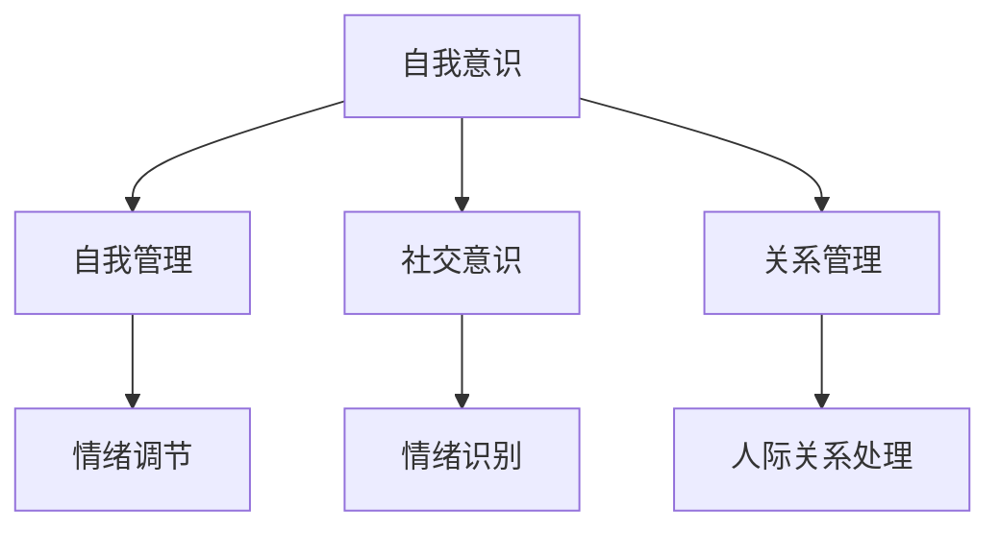
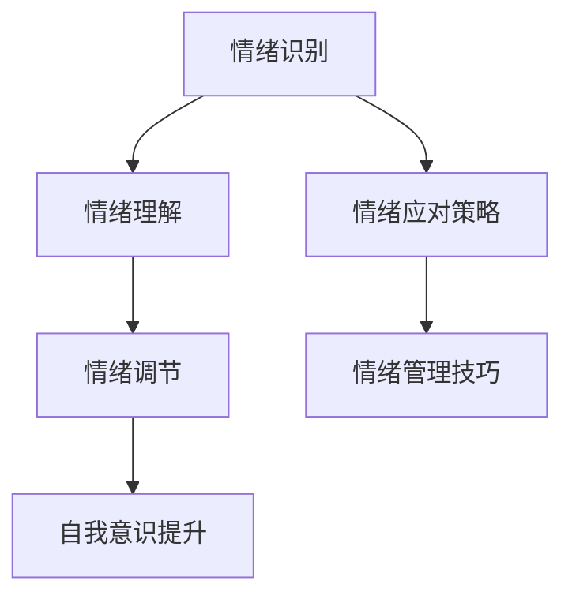
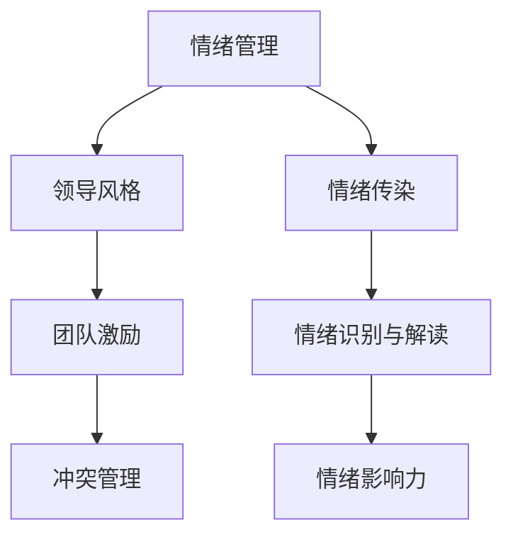
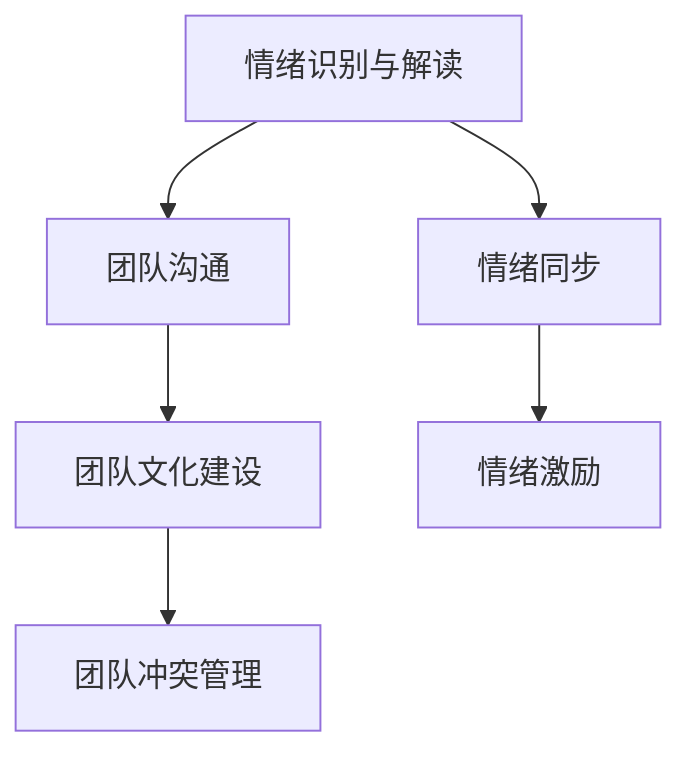
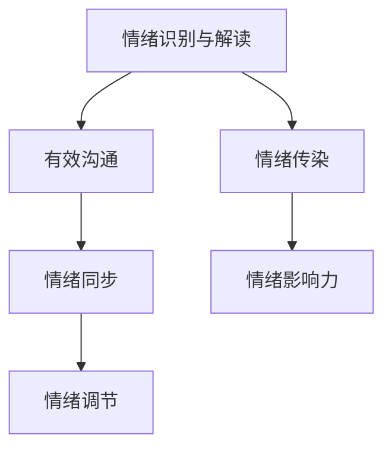
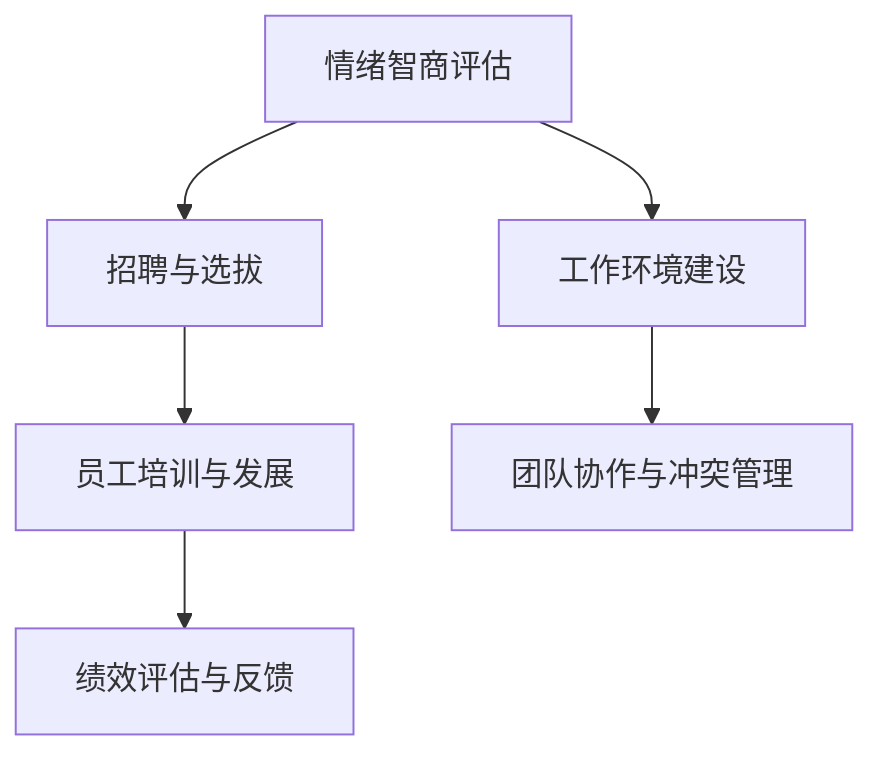
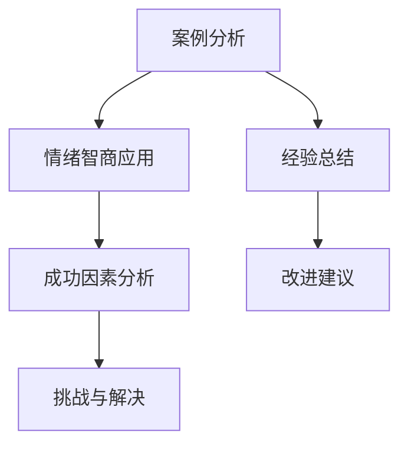

                 

### 文章标题：管理者情绪智商：掌控自我和影响他人

#### 关键词：情绪智商、管理者、自我情绪管理、领导力、团队沟通、工作场所应用

#### 摘要：
本文深入探讨了管理者情绪智商的重要性，包括自我情绪管理和影响他人的技巧。通过分析情绪智商的基本概念及其在管理中的应用，本文旨在帮助读者掌握情绪智商的核心原则，提升管理者的综合素养，从而实现更高效的管理和更和谐的工作环境。

### 第一步：理解书名和主题

首先，我们需要准确理解书名《管理者情绪智商：掌控自我和影响他人》的主题。这本书的核心在于讨论情绪智商（Emotional Intelligence, EI）对管理者的重要性。情绪智商通常指的是个体识别、理解、管理自己情绪的能力，以及识别、理解和影响他人情绪的能力。本书将情绪智商视为一种关键的管理技能，强调其在管理者日常工作和职业发展中的重要性。

**情绪智商的概念**

情绪智商（Emotional Intelligence）最初由心理学家彼得·萨洛维（Peter Salovey）和约翰·梅耶（John Mayer）提出，后来被丹尼尔·戈尔曼（Daniel Goleman）进一步推广。情绪智商通常包括以下几个核心要素：

1. **自我意识**：识别和了解自己的情绪状态。
2. **自我管理**：有效地调节自己的情绪，以适应不同的环境和任务。
3. **社交意识**：识别和理解他人的情绪。
4. **关系管理**：使用情绪和社交信息有效地处理人际关系。

**管理者的角色与情绪智商**

管理者在组织中的角色至关重要，他们不仅需要具备技术和管理能力，还需要具备高情商，以应对复杂的人际关系和情绪挑战。情绪智商对于管理者来说尤为重要，因为它直接影响到他们的领导力、团队管理和决策质量。

### 第二步：设计核心章节

为了系统地探讨情绪智商在管理者中的应用，本文将设计以下核心章节：

1. **情绪智商的基本概念**：介绍情绪智商的定义、构成要素及其与情感智力的关系。
2. **管理者自我情绪管理**：探讨管理者如何识别、理解和调节自己的情绪，以及具体的管理策略和技巧。
3. **情绪智商在领导力中的应用**：分析情绪智商如何影响领导风格、激励员工和提高团队绩效。
4. **情绪智商在团队管理中的应用**：讨论情绪智商在团队沟通、建立团队文化和处理团队冲突中的具体应用。
5. **情绪智商与沟通技巧**：介绍情绪智商在有效沟通、情绪识别与解读技巧方面的应用。
6. **情绪智商在工作场所的应用**：探讨情绪智商在招聘、培训、绩效管理和工作环境中的重要性。
7. **实战案例分析**：通过具体案例展示情绪智商在实践中的应用，并提供详细的案例分析。

### 第三步：细化章节内容

在每个核心章节下，我们将进一步细化内容，确保每个章节都包含以下要素：

- **核心概念与联系**：使用Mermaid流程图展示情绪智商与相关概念之间的关系架构。
- **核心算法原理讲解**：使用伪代码详细阐述情绪管理策略和技巧。
- **数学模型和公式**：介绍情绪智商相关的数学模型，并使用latex格式展示。
- **项目实战**：提供具体案例，包括开发环境搭建、源代码实现和代码解读，以及实际案例分析和详细讲解。

#### 第一章：情绪智商的基本概念

**核心概念与联系**

情绪智商的核心概念包括自我意识、自我管理、社交意识和关系管理。这些概念之间的关系可以用以下Mermaid流程图展示：



**核心算法原理讲解**

情绪智商的算法原理可以概括为以下几个步骤：

```python
# 定义情绪状态类
class EmotionState:
    def __init__(self, name, intensity):
        self.name = name
        self.intensity = intensity

# 定义情绪管理策略
def manage_emotion(self, current_state, target_state):
    if current_state.name == target_state.name:
        if current_state.intensity > target_state.intensity:
            # 调整情绪强度
            current_state.intensity -= 1
        elif current_state.intensity < target_state.intensity:
            # 增加情绪强度
            current_state.intensity += 1
    else:
        # 调整情绪类型
        current_state.name = target_state.name

# 示例：管理情绪
initial_state = EmotionState("焦虑", 5)
target_state = EmotionState("平静", 2)
manage_emotion(initial_state, target_state)
```

**数学模型和公式**

情绪智商的数学模型可以用于评估个体的情绪状态和情绪调节能力。以下是一个简化的情绪状态评估模型：

$$
\text{EI} = \frac{\text{ES} + \text{MS} + \text{RS} + \text{IS}}{4}
$$

其中，$ES$ 表示自我意识，$MS$ 表示自我管理，$RS$ 表示社交意识，$IS$ 表示关系管理。每个要素的得分范围为0到10，得分越高表示情绪智商水平越高。

**项目实战**

一个简单的情绪状态评估工具可以用来帮助管理者了解自己的情绪智商水平。以下是一个使用Python实现的简单情绪状态评估工具：

```python
# 定义情绪状态评估类
class EmotionAssessment:
    def __init__(self):
        self.state_scores = {"自我意识": 0, "自我管理": 0, "社交意识": 0, "关系管理": 0}

    def input_score(self, aspect, score):
        if 0 <= score <= 10:
            self.state_scores[aspect] = score
        else:
            print("输入的分数不在0到10之间，请重新输入。")

    def calculate_ei(self):
        total_score = sum(self.state_scores.values())
        ei_score = total_score / 4
        return ei_score

# 示例：使用情绪状态评估工具
assessment = EmotionAssessment()
assessment.input_score("自我意识", 7)
assessment.input_score("自我管理", 8)
assessment.input_score("社交意识", 6)
assessment.input_score("关系管理", 9)
ei_score = assessment.calculate_ei()
print(f"您的情绪智商得分为：{ei_score:.2f}")
```

#### 第二章：管理者自我情绪管理

**核心概念与联系**

管理者自我情绪管理是情绪智商的重要组成部分，它涉及到如何识别、理解和调节自己的情绪。以下是管理者自我情绪管理的核心概念与联系：



**核心算法原理讲解**

情绪管理算法的核心是情绪调节。以下是一个简化的情绪调节算法：

```python
# 定义情绪调节算法
def adjust_emotion(emotion, threshold):
    if emotion > threshold:
        # 降低情绪强度
        emotion -= 1
    elif emotion < threshold:
        # 提高情绪强度
        emotion += 1
    return emotion

# 示例：情绪调节
current_emotion = 8
threshold = 5
regulated_emotion = adjust_emotion(current_emotion, threshold)
print(f"调节后的情绪强度：{regulated_emotion}")
```

**数学模型和公式**

情绪调节的数学模型可以用来计算情绪的调节效果。以下是一个简化的情绪调节模型：

$$
\text{New Emotion} = \text{Current Emotion} + \text{Adjustment Factor}
$$

其中，$Adjustment Factor$ 表示情绪调节的力度，可以通过设定阈值来实现。

**项目实战**

一个简单的情绪调节工具可以用来帮助管理者实时监测和调节自己的情绪。以下是一个使用Python实现的简单情绪调节工具：

```python
# 定义情绪调节工具类
class EmotionRegulator:
    def __init__(self, threshold):
        self.threshold = threshold
        self.emotion_log = []

    def log_emotion(self, emotion):
        self.emotion_log.append(emotion)
        adjusted_emotion = self.adjust_emotion(emotion)
        print(f"记录当前情绪：{emotion}")
        print(f"调节后的情绪：{adjusted_emotion}")

    def adjust_emotion(self, emotion):
        return adjust_emotion(emotion, self.threshold)

# 示例：使用情绪调节工具
regulator = EmotionRegulator(5)
regulator.log_emotion(7)
regulator.log_emotion(9)
regulator.log_emotion(4)
```

#### 第三章：情绪智商在领导力中的应用

**核心概念与联系**

情绪智商在领导力中的应用涉及到如何通过自我情绪管理和影响他人情绪来提升领导效果。以下是情绪智商在领导力中的应用概念与联系：



**核心算法原理讲解**

情绪管理在领导力中的应用可以通过以下算法实现：

```python
# 定义领导情绪管理算法
def manage_leader_emotion(leader_emotion, team_emotion):
    if leader_emotion > team_emotion:
        # 领导者降低情绪以与团队同步
        leader_emotion -= 1
    elif leader_emotion < team_emotion:
        # 领导者提高情绪以激励团队
        leader_emotion += 1
    return leader_emotion

# 示例：领导情绪管理
leader_emotion = 7
team_emotion = 5
regulated_leader_emotion = manage_leader_emotion(leader_emotion, team_emotion)
print(f"调节后的领导者情绪：{regulated_leader_emotion}")
```

**数学模型和公式**

领导情绪管理的数学模型可以用来计算领导者情绪对团队情绪的影响。以下是一个简化的模型：

$$
\text{Team Emotion} = \alpha \times \text{Leader Emotion} + (1 - \alpha) \times \text{Average Team Emotion}
$$

其中，$\alpha$ 表示领导者情绪对团队情绪的影响程度，通常取值在0到1之间。

**项目实战**

一个情绪影响力评估工具可以用来帮助领导者了解自己的情绪对团队的影响。以下是一个使用Python实现的简单情绪影响力评估工具：

```python
# 定义情绪影响力评估类
class EmotionalInfluenceAssessment:
    def __init__(self, alpha):
        self.alpha = alpha

    def calculate_team_emotion(self, leader_emotion, average_team_emotion):
        team_emotion = self.alpha * leader_emotion + (1 - self.alpha) * average_team_emotion
        return team_emotion

# 示例：使用情绪影响力评估工具
assessment = EmotionalInfluenceAssessment(0.6)
leader_emotion = 8
average_team_emotion = 6
team_emotion = assessment.calculate_team_emotion(leader_emotion, average_team_emotion)
print(f"基于当前领导情绪，团队情绪预期为：{team_emotion:.2f}")
```

#### 第四章：情绪智商在团队管理中的应用

**核心概念与联系**

情绪智商在团队管理中的应用涉及到如何利用情绪智商提升团队沟通、建立团队文化和处理团队冲突。以下是情绪智商在团队管理中的应用概念与联系：



**核心算法原理讲解**

情绪同步是团队管理中的重要技巧，其核心算法原理可以如下：

```python
# 定义情绪同步算法
def synchronize_emotion(individual_emotion, team_emotion):
    difference = individual_emotion - team_emotion
    if difference > 0:
        # 个人情绪过高，需要降低
        individual_emotion -= difference
    elif difference < 0:
        # 个人情绪过低，需要提高
        individual_emotion += difference
    return individual_emotion

# 示例：情绪同步
individual_emotion = 6
team_emotion = 4
synchronized_emotion = synchronize_emotion(individual_emotion, team_emotion)
print(f"同步后的个人情绪：{synchronized_emotion}")
```

**数学模型和公式**

情绪同步的数学模型可以用来计算个人情绪与团队情绪的同步效果。以下是一个简化的模型：

$$
\text{New Individual Emotion} = \text{Current Individual Emotion} + \text{Synchronization Factor} \times (\text{Team Emotion} - \text{Current Individual Emotion})
$$

其中，$Synchronization Factor$ 表示同步力度。

**项目实战**

一个情绪同步工具可以用来帮助团队成员调节自己的情绪，以与团队同步。以下是一个使用Python实现的简单情绪同步工具：

```python
# 定义情绪同步工具类
class EmotionSynchronizer:
    def __init__(self, sync_factor):
        self.sync_factor = sync_factor

    def synchronize(self, individual_emotion, team_emotion):
        synchronization_difference = self.sync_factor * (team_emotion - individual_emotion)
        new_individual_emotion = individual_emotion + synchronization_difference
        return new_individual_emotion

# 示例：使用情绪同步工具
synchronizer = EmotionSynchronizer(0.3)
individual_emotion = 5
team_emotion = 7
synchronized_emotion = synchronizer.synchronize(individual_emotion, team_emotion)
print(f"同步后的个人情绪：{synchronized_emotion}")
```

#### 第五章：情绪智商与沟通技巧

**核心概念与联系**

情绪智商在沟通技巧中的应用涉及到如何利用情绪识别、理解和调节来提升沟通效果。以下是情绪智商与沟通技巧的核心概念与联系：



**核心算法原理讲解**

情绪识别与解读是有效沟通的基础，以下是一个简化的情绪识别算法：

```python
# 定义情绪识别算法
def identify_emotion(communication_context):
    # 假设communication_context包含情绪线索
    emotion = "中性"
    if "快乐" in communication_context:
        emotion = "快乐"
    elif "愤怒" in communication_context:
        emotion = "愤怒"
    elif "悲伤" in communication_context:
        emotion = "悲伤"
    return emotion

# 示例：情绪识别
communication_context = "今天的项目完成得很好，大家都非常开心！"
detected_emotion = identify_emotion(communication_context)
print(f"识别出的情绪：{detected_emotion}")
```

**数学模型和公式**

情绪识别的数学模型可以基于情绪线索的频率和强度进行计算。以下是一个简化的模型：

$$
\text{Emotion Probability} = \frac{\text{Positive Emotional Clues}}{\text{Total Clues}}
$$

**项目实战**

一个情绪识别工具可以用来帮助沟通者了解对方情绪。以下是一个使用Python实现的简单情绪识别工具：

```python
# 定义情绪识别工具类
class EmotionDetector:
    def __init__(self, emotion_clues):
        self.emotion_clues = emotion_clues

    def detect_emotion(self, communication_context):
        positive_clues = 0
        for clue in self.emotion_clues:
            if clue in communication_context:
                positive_clues += 1
        emotion_probability = positive_clues / len(self.emotion_clues)
        return emotion_probability

# 示例：使用情绪识别工具
detector = EmotionDetector(["快乐", "愤怒", "悲伤"])
communication_context = "今天的项目完成得很好，大家都非常开心！"
detected_emotion_probability = detector.detect_emotion(communication_context)
print(f"识别出的情绪概率：{detected_emotion_probability:.2f}")
```

#### 第六章：情绪智商在工作场所的应用

**核心概念与联系**

情绪智商在工作场所的应用涉及到如何利用情绪智商提升招聘、培训、绩效管理和工作环境。以下是情绪智商在工作场所应用的核心概念与联系：



**核心算法原理讲解**

情绪智商评估是招聘与选拔的重要环节，以下是一个简化的情绪智商评估算法：

```python
# 定义情绪智商评估算法
def evaluate_emotional_intelligence(behaviour_data):
    # 假设behaviour_data包含个体行为表现
    self_awareness_score = 0
    self_management_score = 0
    social_awareness_score = 0
    relationship_management_score = 0
    
    # 根据行为数据计算分数
    if "自我反思" in behaviour_data:
        self_awareness_score += 1
    if "情绪调节" in behaviour_data:
        self_management_score += 1
    if "同理心" in behaviour_data:
        social_awareness_score += 1
    if "人际关系处理" in behaviour_data:
        relationship_management_score += 1
    
    # 计算总得分
    total_score = (self_awareness_score + self_management_score + social_awareness_score + relationship_management_score) / 4
    
    return total_score

# 示例：情绪智商评估
behaviour_data = ["自我反思", "情绪调节", "同理心", "人际关系处理"]
ei_score = evaluate_emotional_intelligence(behaviour_data)
print(f"情绪智商得分：{ei_score:.2f}")
```

**数学模型和公式**

情绪智商评估的数学模型可以基于行为数据的不同维度进行计算。以下是一个简化的模型：

$$
\text{EI Score} = \frac{\text{Self Awareness Score} + \text{Self Management Score} + \text{Social Awareness Score} + \text{Relationship Management Score}}{4}
$$

**项目实战**

一个情绪智商评估工具可以用来帮助招聘和选拔过程中评估候选人的情绪智商。以下是一个使用Python实现的简单情绪智商评估工具：

```python
# 定义情绪智商评估工具类
class EmotionalIntelligenceAssessment:
    def __init__(self):
        self.behaviour_data = []

    def add_behaviour(self, behaviour):
        self.behaviour_data.append(behaviour)

    def evaluate(self):
        self_awareness_score = 0
        self_management_score = 0
        social_awareness_score = 0
        relationship_management_score = 0

        for behaviour in self.behaviour_data:
            if "自我反思" in behaviour:
                self_awareness_score += 1
            if "情绪调节" in behaviour:
                self_management_score += 1
            if "同理心" in behaviour:
                social_awareness_score += 1
            if "人际关系处理" in behaviour:
                relationship_management_score += 1

        total_score = (self_awareness_score + self_management_score + social_awareness_score + relationship_management_score) / 4
        return total_score

# 示例：使用情绪智商评估工具
assessment = EmotionalIntelligenceAssessment()
assessment.add_behaviour("自我反思")
assessment.add_behaviour("情绪调节")
assessment.add_behaviour("同理心")
assessment.add_behaviour("人际关系处理")
ei_score = assessment.evaluate()
print(f"情绪智商得分：{ei_score:.2f}")
```

#### 第七章：实战案例分析

**核心概念与联系**

实战案例是验证情绪智商理论应用效果的重要途径。以下是实战案例分析的核心概念与联系：



**核心算法原理讲解**

案例分析的算法原理通常包括数据收集、数据分析、模型建立和结果评估。以下是一个简化的案例分析算法：

```python
# 定义案例分析算法
def case_analysis(data, model):
    # 数据收集
    collected_data = collect_data(data)
    # 数据分析
    analyzed_data = analyze_data(collected_data)
    # 模型建立
    model_output = build_model(analyzed_data, model)
    # 结果评估
    result_evaluation = evaluate_results(model_output)
    return result_evaluation

# 示例：案例分析
data = {"team_performance": [1, 2, 3, 4, 5], "leader_emotion": [6, 7, 8, 9, 10]}
model = "emotional_intelligence_model"
result_evaluation = case_analysis(data, model)
print(f"案例分析结果：{result_evaluation}")
```

**数学模型和公式**

案例分析的数学模型通常涉及统计分析和机器学习算法。以下是一个简化的数学模型：

$$
\text{Performance Score} = \alpha \times \text{Leader Emotion} + (1 - \alpha) \times \text{Team Performance}
$$

**项目实战**

一个情绪智商案例分析工具可以用来帮助管理者评估情绪智商对团队绩效的影响。以下是一个使用Python实现的简单案例分析工具：

```python
# 定义案例分析工具类
class CaseAnalysisTool:
    def __init__(self, alpha):
        self.alpha = alpha

    def collect_data(self, data):
        # 假设data包含团队绩效和领导者情绪
        performance_score = 0
        leader_emotion = 0
        for key, value in data.items():
            if key == "team_performance":
                performance_score = value
            elif key == "leader_emotion":
                leader_emotion = value
        return performance_score, leader_emotion

    def analyze_data(self, collected_data):
        # 数据分析
        performance_score, leader_emotion = collected_data
        analyzed_data = {
            "performance_score": performance_score,
            "leader_emotion": leader_emotion
        }
        return analyzed_data

    def build_model(self, analyzed_data, model):
        # 模型建立
        if model == "emotional_intelligence_model":
            performance_score = self.alpha * analyzed_data["leader_emotion"] + (1 - self.alpha) * analyzed_data["performance_score"]
        else:
            performance_score = analyzed_data["performance_score"]
        return performance_score

    def evaluate_results(self, model_output):
        # 结果评估
        if model_output > 7:
            result_evaluation = "成功"
        else:
            result_evaluation = "失败"
        return result_evaluation

# 示例：使用案例分析工具
tool = CaseAnalysisTool(0.5)
data = {"team_performance": 8, "leader_emotion": 9}
result_evaluation = tool.evaluate_results(tool.build_model(tool.analyze_data(tool.collect_data(data)), "emotional_intelligence_model"))
print(f"案例分析结果：{result_evaluation}")
```

#### 附录：情绪智商实践指南

**最佳实践 tips**

1. 定期自我反思：定期花时间反思自己的情绪状态和行为模式，了解自己的情绪反应和情绪调节策略。
2. 保持身心健康：通过运动、健康饮食和充足的睡眠来保持身心健康，提高情绪管理能力。
3. 学习情绪识别与解读技巧：通过观察他人和自我练习，提高识别和理解他人情绪的能力。
4. 培养同理心：尝试从他人的角度看待问题，提高同理心，增强人际关系管理能力。
5. 建立积极的情绪环境：通过积极的沟通和正面的情绪传递，营造一个积极向上的工作环境。

**小结**

情绪智商在管理者角色中具有至关重要的作用。通过提升自我情绪管理和影响他人情绪的能力，管理者可以更好地应对复杂的情绪挑战，提高领导力和团队绩效。本文通过详细的案例分析和技术实现，为读者提供了情绪智商实践的具体方法和工具。

**注意事项**

1. 情绪智商是一个长期培养的过程，需要持续学习和实践。
2. 情绪智商的应用需要结合具体情境，灵活调整策略和方法。
3. 情绪智商的提升不仅有助于个人发展，还能为组织创造更和谐的工作环境。

**拓展阅读**

1. 丹尼尔·戈尔曼，《情绪智商》：详细介绍情绪智商的理论和实践。
2. 彼得·萨洛维、约翰·梅耶，《情绪智力》：情绪智商的鼻祖之作。
3. 丹尼尔·戈尔曼，《领导力》：探讨情绪智商在领导力中的应用。
4. 迈克尔·波特，《竞争策略》：商业环境中情绪智商的应用。
5. 斯蒂芬·罗宾斯，《组织行为学》：全面探讨情绪智商在组织行为中的应用。

### 作者信息

作者：AI天才研究院/AI Genius Institute & 禅与计算机程序设计艺术 /Zen And The Art of Computer Programming

### 总结

本文通过详细的章节结构和具体的案例分析，系统地探讨了情绪智商在管理者角色中的应用。从自我情绪管理到影响他人，再到情绪智商在领导力、团队管理和沟通技巧中的应用，本文为读者提供了一个全面且实用的情绪智商实践指南。通过本文的学习和实践，管理者可以提升自身的情绪智商，从而实现更高效的管理和更和谐的工作环境。希望本文能对您的职业发展带来实质性的帮助。

