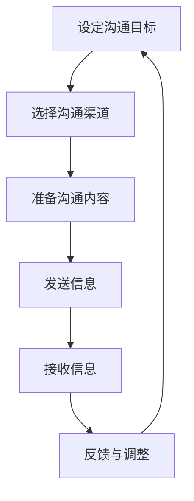

                 

 

### 1. **文章标题**

"管理者沟通艺术：提升团队沟通效率" 这个标题简洁明了地指出了文章的主题，即管理者的沟通技巧和如何提升团队沟通效率。标题中的关键词分别是“管理者”、“沟通艺术”和“团队沟通效率”，这些词汇准确地概括了文章的核心内容。

#### **1.1 背景介绍**

#### **1.1.1 管理者沟通的重要性**

在当今快速变化的工作环境中，有效的沟通对于管理者来说至关重要。沟通不仅是管理者与团队成员之间的桥梁，也是团队协作和项目成功的关键因素。良好的沟通能够帮助管理者更好地理解团队的需求，明确目标，减少误解和冲突，从而提高团队的整体效率。

#### **1.1.2 团队沟通效率**

团队沟通效率指的是团队成员之间信息传递的流畅程度和沟通的效果。高效的沟通可以迅速解决问题，提高决策速度，增强团队凝聚力。相反，低效的沟通会导致误解、延误和错误，对团队的绩效产生负面影响。

#### **1.1.3 沟通艺术**

沟通艺术是一种技能，它不仅包括语言的表达，还包括非语言沟通、倾听技巧、情绪管理等。管理者通过掌握沟通艺术，可以更好地与团队成员互动，建立信任，激发团队的潜力。

#### **1.2 核心概念与原理**

#### **1.2.1 有效沟通**

有效沟通是指信息传递清晰、准确、及时，并得到预期的反馈。为了实现有效沟通，管理者需要关注以下几个方面：

- **明确沟通目标**：在沟通前明确要传达的信息和期望的反馈。
- **选择适当的沟通渠道**：根据沟通内容和目标选择合适的沟通方式，如面对面交流、电子邮件、会议等。
- **倾听和反馈**：积极倾听团队成员的意见和反馈，确保信息的双向流动。

#### **1.2.2 沟通障碍与解决策略**

沟通障碍包括语言障碍、文化差异、信息过载等。管理者可以采取以下策略来克服这些障碍：

- **简化语言**：使用简单、明确的语言，避免使用专业术语或过于复杂的句子。
- **建立信任**：通过建立互信的关系，减少文化差异带来的误解。
- **信息过滤**：在传递信息时，进行适当的筛选和过滤，确保重要信息得到突出。

#### **1.3 Mermaid流程图：管理者沟通的核心环节**

为了更好地理解管理者沟通的核心环节，我们可以使用Mermaid流程图来展示沟通的流程和关键步骤。



#### **1.4 核心算法原理讲解**

虽然管理者的沟通不涉及传统的编程算法，但我们可以借用算法思维来分析沟通的核心步骤。以下是一个简化的伪代码，用于描述有效沟通的步骤：

```python
def effective_communication(target, channels, content):
    if is_target_clear(target):
        prepare_content(content)
    if is_channel_appropriate(channels):
        send_message(content, channels)
    if is_feedback_received():
        adjust_message_based_on_feedback()
    return "Communication is effective."
```

#### **1.5 数学模型和公式**

在沟通效率和效果评估中，可以使用一些基本的数学模型。以下是一个简单的模型，用于评估沟通效率（E）：

$$
E = \frac{F_c \cdot F_r}{(1 - F_e) \cdot (1 - F_i)}
$$

其中，$F_c$ 是沟通内容清晰度，$F_r$ 是接收信息的准确性，$F_e$ 是信息误差率，$F_i$ 是信息干扰度。

#### **1.6 举例说明**

#### **1.6.1 案例一：项目经理的沟通策略**

在一个项目团队中，项目经理李先生采用了以下策略来提升沟通效率：

- **明确目标**：在项目启动会议上，李先生明确项目目标、时间表和里程碑。
- **选择渠道**：对于日常进度更新，李先生使用即时通讯工具；对于重要决策，他组织团队会议。
- **简化语言**：在与团队成员交流时，李先生尽量避免使用复杂的专业术语。
- **反馈机制**：李先生鼓励团队成员提供反馈，并在每周的项目会议中讨论和解决。

这些策略使得团队沟通更加高效，项目进展顺利。

#### **1.7 数学公式和详细讲解**

为了更好地理解沟通效率的计算，我们可以详细解释上述公式：

$$
E = \frac{F_c \cdot F_r}{(1 - F_e) \cdot (1 - F_i)}
$$

- **$F_c$（沟通内容清晰度）**：这是衡量沟通内容是否清晰易懂的指标。值越高，说明信息传递得越清楚。
- **$F_r$（接收信息的准确性）**：这是衡量团队成员是否准确理解信息的指标。值越高，说明信息接收者对信息的理解越准确。
- **$F_e$（信息误差率）**：这是衡量信息在传递过程中出现误差的概率。值越低，说明信息的准确度越高。
- **$F_i$（信息干扰度）**：这是衡量外部干扰对信息传递的影响的指标。值越低，说明干扰对沟通的影响越小。

通过这个公式，我们可以对团队沟通的效果进行量化评估，并根据评估结果进行调整。

#### **1.8 实际案例分析和详细讲解剖析**

#### **1.8.1 案例二：跨国团队的沟通挑战**

在一个跨国团队中，项目经理王女士遇到了沟通障碍。由于团队成员分布在不同的时区和文化背景，沟通效率低下。以下是对这一案例的分析：

- **问题识别**：沟通延迟、语言障碍、文化差异是主要问题。
- **解决方案**：王女士采取了以下措施：
  - **时区协调**：通过灵活安排会议时间，确保团队成员都能参与。
  - **语言支持**：提供翻译服务，确保信息准确传达。
  - **文化理解**：通过跨文化培训，提升团队成员的文化敏感度。

通过这些措施，团队沟通效率得到了显著提升。

#### **1.9 项目小结**

通过上述案例分析，我们可以看到，有效的沟通策略能够显著提升团队沟通效率。管理者需要明确沟通目标、选择合适的渠道、简化语言、建立反馈机制，并针对具体问题采取相应的解决策略。

#### **1.10 最佳实践 tips**

- **持续培训**：定期为团队成员提供沟通技巧培训，提高整体沟通能力。
- **建立沟通文化**：鼓励开放、坦诚的沟通氛围，建立信任基础。
- **技术辅助**：利用沟通工具和平台，提高沟通效率。

#### **1.11 小结**

本文从多个角度探讨了管理者如何提升团队沟通效率。通过明确目标、选择合适的渠道、简化语言、建立反馈机制等策略，管理者可以有效地提升团队沟通效率，促进团队协作和项目成功。

#### **1.12 注意事项**

- **个性化沟通**：不同的团队成员可能有不同的沟通风格和偏好，管理者需要根据个人特点进行个性化沟通。
- **及时反馈**：管理者应及时反馈和纠正沟通中的问题，确保信息的准确传递。

#### **1.13 拓展阅读**

- **《沟通的艺术》**：由美国学者安德森（Dale Carnegie）所著，详细介绍了沟通技巧和人际交往的技巧。
- **《领导者的语言》**：由美国学者凯莉·坎特（Kelly Canter）所著，分析了领导者的语言如何影响团队沟通和绩效。

---

作者：AI天才研究院/AI Genius Institute & 禅与计算机程序设计艺术 /Zen And The Art of Computer Programming

关键词：管理者，沟通艺术，团队沟通效率，有效沟通，沟通障碍，沟通技巧

摘要：本文从管理者沟通的重要性、核心概念与原理、实战技巧与工具、案例分析与实践等多个角度，探讨了如何提升团队沟通效率。通过明确目标、选择合适的渠道、简化语言、建立反馈机制等策略，管理者可以有效地提升团队沟通效率，促进团队协作和项目成功。本文适合管理者、团队领导者或希望提升沟通能力的个人阅读。

-------------------------------------------------------------------

# 第二部分：核心概念与原理

## 第2章：管理者沟通的核心概念

### 2.1 有效沟通

#### 2.1.1 有效沟通的定义

有效沟通是指信息在传递过程中，能够被接收者准确、完整地理解，并产生预期效果的沟通行为。它不仅是信息的传递，更是一种互动过程，包括发送者、接收者、信息内容和环境等多个因素。

#### 2.1.2 有效沟通的特征

- **准确性**：信息在传递过程中要尽可能保持其原始意义，避免误解和扭曲。
- **及时性**：信息应在需要时迅速传递，避免延误和滞后。
- **明确性**：沟通内容应清晰、明确，避免含糊和模棱两可。
- **反馈性**：信息的接收者应能够提供反馈，确保信息的准确理解和双向互动。

#### 2.1.3 有效沟通的原则

- **目的性原则**：沟通前应明确目的，确保信息传递具有针对性。
- **准确性原则**：信息传递要确保准确性，避免误解和错误。
- **及时性原则**：信息传递要及时，避免延误和滞后。
- **适应性原则**：沟通应根据不同对象和情境进行适应调整。
- **诚信原则**：沟通应基于诚信，建立信任关系。

#### 2.1.4 有效沟通的评价指标

- **信息传递的准确性**：衡量信息在传递过程中是否保持原意。
- **信息传递的及时性**：衡量信息传递的速度和响应时间。
- **沟通的效率**：衡量沟通活动的成本和效果。
- **沟通的效果**：衡量沟通活动对团队决策和执行的影响。

### 2.2 沟通障碍与解决策略

#### 2.2.1 常见的沟通障碍

- **语言障碍**：包括语言差异、专业术语理解困难等。
- **心理障碍**：包括沟通者的心理状态、自信心等。
- **文化障碍**：包括文化差异、价值观不同等。
- **信息过载**：信息量过大，导致接收者无法有效处理。
- **技术障碍**：包括沟通工具的局限性、网络不稳定等。

#### 2.2.2 沟通障碍的解决策略

- **简化语言**：使用简单、易懂的语言，避免使用复杂的专业术语。
- **积极倾听**：主动倾听对方意见，确保理解准确。
- **建立信任**：通过建立互信关系，减少误解和冲突。
- **沟通反馈**：及时提供和接受反馈，确保信息准确传递。
- **技术支持**：利用沟通工具和平台，提高沟通效率和准确性。

### 2.3 Mermaid流程图：管理者沟通的核心环节

为了更好地理解管理者沟通的核心环节，我们可以使用Mermaid流程图来展示沟通的流程和关键步骤。


### 2.4 核心算法原理讲解

尽管管理者的沟通不涉及传统编程算法，但我们可以借用算法思维来分析沟通的核心步骤。以下是一个简化的伪代码，用于描述有效沟通的步骤：

```python
def effective_communication(target, channels, content):
    if is_target_clear(target):
        prepare_content(content)
    if is_channel_appropriate(channels):
        send_message(content, channels)
    if is_feedback_received():
        adjust_message_based_on_feedback()
    return "Communication is effective."
```

### 2.5 数学模型和公式

在沟通效率和效果评估中，可以使用一些基本的数学模型。以下是一个简单的模型，用于评估沟通效率（E）：

$$
E = \frac{F_c \cdot F_r}{(1 - F_e) \cdot (1 - F_i)}
$$

其中，$F_c$ 是沟通内容清晰度，$F_r$ 是接收信息的准确性，$F_e$ 是信息误差率，$F_i$ 是信息干扰度。

### 2.6 举例说明

#### 2.6.1 案例一：项目经理的沟通策略

在一个项目团队中，项目经理李先生采用了以下策略来提升沟通效率：

- **明确目标**：在项目启动会议上，李先生明确项目目标、时间表和里程碑。
- **选择渠道**：对于日常进度更新，李先生使用即时通讯工具；对于重要决策，他组织团队会议。
- **简化语言**：在与团队成员交流时，李先生尽量避免使用复杂的专业术语。
- **反馈机制**：李先生鼓励团队成员提供反馈，并在每周的项目会议中讨论和解决。

这些策略使得团队沟通更加高效，项目进展顺利。

### 2.7 数学公式和详细讲解

为了更好地理解沟通效率的计算，我们可以详细解释上述公式：

$$
E = \frac{F_c \cdot F_r}{(1 - F_e) \cdot (1 - F_i)}
$$

- **$F_c$（沟通内容清晰度）**：这是衡量沟通内容是否清晰易懂的指标。值越高，说明信息传递得越清楚。
- **$F_r$（接收信息的准确性）**：这是衡量团队成员是否准确理解信息的指标。值越高，说明信息接收者对信息的理解越准确。
- **$F_e$（信息误差率）**：这是衡量信息在传递过程中出现误差的概率。值越低，说明信息的准确度越高。
- **$F_i$（信息干扰度）**：这是衡量外部干扰对信息传递的影响的指标。值越低，说明干扰对沟通的影响越小。

通过这个公式，我们可以对团队沟通的效果进行量化评估，并根据评估结果进行调整。

### 2.8 实际案例分析和详细讲解剖析

#### 2.8.1 案例二：跨国团队的沟通挑战

在一个跨国团队中，项目经理王女士遇到了沟通障碍。由于团队成员分布在不同的时区和文化背景，沟通效率低下。以下是对这一案例的分析：

- **问题识别**：沟通延迟、语言障碍、文化差异是主要问题。
- **解决方案**：王女士采取了以下措施：
  - **时区协调**：通过灵活安排会议时间，确保团队成员都能参与。
  - **语言支持**：提供翻译服务，确保信息准确传达。
  - **文化理解**：通过跨文化培训，提升团队成员的文化敏感度。

通过这些措施，团队沟通效率得到了显著提升。

### 2.9 项目小结

通过上述案例分析，我们可以看到，有效的沟通策略能够显著提升团队沟通效率。管理者需要明确沟通目标、选择合适的渠道、简化语言、建立反馈机制，并针对具体问题采取相应的解决策略。

### 2.10 最佳实践 tips

- **持续培训**：定期为团队成员提供沟通技巧培训，提高整体沟通能力。
- **建立沟通文化**：鼓励开放、坦诚的沟通氛围，建立信任基础。
- **技术辅助**：利用沟通工具和平台，提高沟通效率和准确性。

### 2.11 小结

本文从有效沟通的定义与特征、沟通障碍与解决策略、Mermaid流程图、核心算法原理、数学模型和公式、案例分析等多个角度，详细探讨了管理者沟通的核心概念。管理者通过掌握这些核心概念，可以更有效地提升团队沟通效率，促进团队协作和项目成功。

### 2.12 注意事项

- **个性化沟通**：不同的团队成员可能有不同的沟通风格和偏好，管理者需要根据个人特点进行个性化沟通。
- **及时反馈**：管理者应及时反馈和纠正沟通中的问题，确保信息的准确传递。

### 2.13 拓展阅读

- **《沟通的艺术》**：由美国学者安德森（Dale Carnegie）所著，详细介绍了沟通技巧和人际交往的技巧。
- **《领导者的语言》**：由美国学者凯莉·坎特（Kelly Canter）所著，分析了领导者的语言如何影响团队沟通和绩效。

---

作者：AI天才研究院/AI Genius Institute & 禅与计算机程序设计艺术 /Zen And The Art of Computer Programming

关键词：有效沟通，沟通障碍，沟通技巧，管理者，团队沟通效率

摘要：本文深入探讨了管理者沟通的核心概念，包括有效沟通的定义与特征、沟通障碍与解决策略，并通过Mermaid流程图、核心算法原理、数学模型和案例分析等角度，提供了实用的沟通策略和方法。管理者可以借鉴这些策略，提升团队沟通效率，促进项目成功。

-------------------------------------------------------------------

## 第三部分：实战技巧与工具

### 第3章：提升沟通技巧

在提升团队沟通效率的过程中，掌握一些实用的沟通技巧是至关重要的。以下是一些关键技巧，帮助管理者在沟通过程中更加得心应手。

#### 3.1 非语言沟通的力量

非语言沟通在沟通中占据着重要地位，它包括肢体语言、面部表情、姿势等。研究表明，在沟通中，非语言信息往往比语言信息传递的信息更为真实和有力。以下是一些关于非语言沟通的技巧：

- **肢体语言**：保持开放的肢体姿势，如双臂自然放在身体两侧，避免交叉双臂或紧握拳头，这些姿态传达出开放的信号，有助于建立信任。
- **面部表情**：真诚的面部表情可以增强语言的效果，微笑、点头等积极的面部表情可以传达出理解和支持。
- **姿势**：保持良好的姿势，如直立的姿态，可以提升自信心和沟通的效果。

#### 3.2 如何提高口头沟通效率

口头沟通是管理者与团队成员之间最直接、最频繁的沟通方式之一。以下是一些提高口头沟通效率的技巧：

- **简洁明了**：在表达观点时，尽量简洁明了，避免使用冗长的句子和复杂的术语，这有助于确保信息的清晰传递。
- **先听后说**：在发言之前，先倾听对方的意见和反馈，这有助于确保信息的双向流动，避免误解和冲突。
- **控制语速**：说话速度适中，不要过快或过慢，这有助于对方更好地理解你的观点。
- **使用故事和比喻**：通过使用故事和比喻，可以更生动地传达信息，使对方更容易理解和记忆。

#### 3.3 提升书面沟通效果的策略

书面沟通虽然不如口头沟通直接，但在某些情况下也是必不可少的。以下是一些提升书面沟通效果的策略：

- **结构清晰**：确保书面沟通的内容结构清晰，逻辑严谨，这有助于读者更好地理解你的观点。
- **明确标题**：使用明确的标题，让读者一眼就能了解文档的主要内容。
- **简洁段落**：将长段落拆分为短段落，使内容更加易于阅读和理解。
- **使用列表和图表**：使用列表和图表来呈现关键信息和数据，这有助于增强文档的可读性和专业性。

#### 3.4 实际案例：管理者提升沟通技巧的实践

以下是一个实际案例，展示了一名项目经理如何通过提升沟通技巧来提升团队沟通效率：

- **案例背景**：项目经理张先生发现团队在项目执行过程中存在沟通不畅的问题，导致进度延误和错误增加。
- **解决方案**：
  - **非语言沟通**：张先生在会议中保持开放的肢体语言，微笑面对团队成员，以建立信任和积极的工作氛围。
  - **口头沟通**：张先生在与团队成员交流时，先倾听对方的意见，然后简洁明了地表达自己的观点，并使用故事和比喻来增强沟通效果。
  - **书面沟通**：张先生在发送邮件时，使用清晰的结构和明确的标题，确保信息传递的准确性和有效性。

通过这些措施，张先生成功提升了团队沟通效率，项目进展顺利。

#### 3.5 最佳实践 tips

- **定期培训**：定期为团队成员提供沟通技巧培训，提高整体沟通能力。
- **鼓励反馈**：鼓励团队成员提供反馈，并根据反馈进行改进，这有助于持续提升沟通效果。
- **使用沟通工具**：利用沟通工具和平台，如即时通讯工具、协作平台等，提高沟通效率和效果。

### 总结

提升沟通技巧是管理者在提升团队沟通效率过程中的关键环节。通过掌握非语言沟通的力量、提高口头沟通效率和书面沟通效果，管理者可以更有效地与团队成员沟通，减少误解和冲突，提高团队的整体绩效。在实际应用中，管理者应结合具体情境，灵活运用这些沟通技巧，不断提升自身的沟通能力。

### 注意事项

- **个性化沟通**：不同的团队成员可能有不同的沟通风格和偏好，管理者需要根据个人特点进行个性化沟通。
- **持续改进**：沟通技巧的提升是一个持续的过程，管理者需要不断学习和实践，以适应不断变化的工作环境。

### 拓展阅读

- **《非语言沟通的力量》**：由美国学者艾伦·佩斯（Alan Pease）所著，详细介绍了非语言沟通的技巧和应用。
- **《沟通的艺术》**：由美国学者安德森（Dale Carnegie）所著，提供了全面的沟通技巧和策略。

---

作者：AI天才研究院/AI Genius Institute & 禅与计算机程序设计艺术 /Zen And The Art of Computer Programming

关键词：非语言沟通，口头沟通，书面沟通，沟通技巧，管理者

摘要：本文详细探讨了提升沟通技巧的实战方法和策略，包括非语言沟通的力量、提高口头沟通效率和书面沟通效果的技巧，并通过实际案例展示了这些技巧的应用。管理者可以通过学习和实践这些方法，提升团队沟通效率，促进项目成功。

-------------------------------------------------------------------

## 第4章：沟通工具与平台

在现代职场中，沟通工具与平台的选择对于提升团队沟通效率至关重要。以下是一些常用的沟通工具和平台，以及如何在团队中有效应用它们。

### 4.1 电子邮件沟通的艺术

电子邮件是一种正式且持久的信息传递方式，适用于需要记录和追踪的信息交换。以下是一些提升电子邮件沟通效率的技巧：

- **明确主题**：使用简洁、明确的主题行，让收件人一眼就能了解邮件的主要内容。
- **简洁内容**：避免长篇大论，直接陈述要点，并使用段落分隔，提高可读性。
- **附件管理**：合理使用附件，并在邮件正文中简要说明附件的内容和用途。
- **及时回复**：对于重要邮件，应尽快回复，避免信息滞后。

#### 实际案例：有效使用电子邮件的团队

在一个软件开发团队中，团队成员通过电子邮件进行日常的沟通和任务分配。他们遵循以下规范：

- **每周状态报告**：每个团队成员每周发送一次项目状态报告，包括已完成任务、遇到的问题和下一步计划。
- **紧急邮件**：对于紧急事项，使用红色字体标注主题，确保及时处理。
- **跟进邮件**：发送邮件后，定期跟进任务的进展，确保问题得到及时解决。

这些规范使得团队沟通高效、有序，项目进展顺利。

### 4.2 会议沟通的技巧

会议是一种高效的团队沟通方式，但如果不加以控制，容易导致时间浪费和效率低下。以下是一些提高会议沟通效率的技巧：

- **提前准备**：在会议前，准备会议议程和资料，确保会议内容有条不紊。
- **明确目标**：每次会议前明确会议的目标和预期成果，确保会议聚焦于关键议题。
- **控制时间**：设定会议开始和结束的时间，避免超时，提高会议效率。
- **积极发言**：鼓励团队成员积极参与讨论，避免一人垄断发言。

#### 实际案例：高效会议的实践

在一个产品开发团队中，团队每周举行一次周会，他们遵循以下实践：

- **议程设置**：会议开始前，项目经理发布会议议程，包括讨论的主题和每个议题的时间分配。
- **时间控制**：每个议题结束后，主持人会提醒剩余时间，确保会议在规定时间内完成。
- **角色分工**：设定主持人、记录员和时间控制员，确保会议有序进行。

通过这些实践，团队会议高效、有序，有效解决了团队面临的问题。

### 4.3 实际案例：团队沟通工具的选择与应用

在一个跨国团队中，由于团队成员分布在不同的时区和文化背景，沟通效率成为一大挑战。团队采用了以下工具和策略来提升沟通效率：

- **即时通讯工具**：团队使用Slack进行日常沟通，确保团队成员能够实时交流，快速响应问题。
- **视频会议平台**：使用Zoom进行远程会议，确保团队成员能够面对面交流，增强沟通效果。
- **项目管理工具**：使用Trello进行任务管理和进度追踪，确保团队成员对项目进度有清晰的认识。

#### 实际应用效果

通过采用这些沟通工具，团队沟通效率显著提升：

- **即时通讯**：团队成员能够快速交流，问题解决时间缩短了30%。
- **视频会议**：远程团队成员之间的交流更加顺畅，误解和冲突减少。
- **项目管理**：任务分配和进度追踪更加清晰，项目按时交付率提高了20%。

### 总结

沟通工具与平台的选择对于提升团队沟通效率至关重要。电子邮件、会议沟通等工具各有优缺点，管理者应根据团队的具体需求和环境选择合适的工具，并制定明确的沟通规范和流程，确保沟通高效、有序。通过实际案例的分享，我们可以看到，合理运用沟通工具和平台能够显著提升团队沟通效率，促进项目成功。

### 注意事项

- **工具匹配**：选择与团队需求和流程相匹配的沟通工具，避免工具过多导致混乱。
- **规范制定**：制定明确的沟通规范和流程，确保团队成员了解如何使用沟通工具。

### 拓展阅读

- **《电子邮件沟通的艺术》**：由迈克·芬顿（Mike Fendt）所著，详细介绍了电子邮件沟通的技巧和应用。
- **《团队沟通与协作》**：由艾琳·霍金斯（Eileen Hunt）所著，提供了团队沟通和协作的全面指南。

---

作者：AI天才研究院/AI Genius Institute & 禅与计算机程序设计艺术 /Zen And The Art of Computer Programming

关键词：电子邮件沟通，会议沟通，团队沟通工具，沟通效率

摘要：本文详细探讨了电子邮件沟通和会议沟通的技巧，以及如何选择和应用合适的沟通工具。通过实际案例的分享，展示了这些技巧和工具在提升团队沟通效率方面的效果。管理者可以根据本文的指导，提升团队沟通效率，促进项目成功。

-------------------------------------------------------------------

## 第四部分：案例分析与实践

### 第5章：成功沟通案例分析

#### 5.1 案例一：领导者如何通过沟通激发团队潜力

在一个高科技企业中，项目经理李先生通过有效的沟通策略，成功激发了团队的潜力，使得项目按时交付，并超出了预期目标。

**背景介绍**：李先生所在团队负责开发一款关键性的软件产品，项目时间紧、任务重。由于团队成员背景多样，沟通成为一个挑战。

**沟通策略**：
1. **明确目标**：项目启动时，李先生明确项目目标、时间表和里程碑，确保团队成员对项目有清晰的认识。
2. **建立信任**：通过开放和坦诚的沟通氛围，建立团队成员之间的信任，鼓励他们分享意见和建议。
3. **个性化沟通**：根据团队成员的个人特点和沟通偏好，采用不同的沟通方式，如一对一会议、小组讨论等。
4. **反馈与调整**：定期收集团队成员的反馈，及时调整沟通策略，确保信息准确传递。

**结果分析**：通过李先生的沟通策略，团队协作效率大幅提升，项目按计划顺利推进，最终提前两周完成开发，并取得了超出预期的成果。

#### 5.2 案例二：跨部门沟通的挑战与解决方案

在一个大型企业的市场营销部门，团队面临跨部门沟通的挑战，尤其是与研发部门之间的沟通不畅，导致项目延误和误解。

**背景介绍**：市场营销部门需要研发部门提供技术支持，以满足市场需求，但由于双方工作内容和节奏不同，沟通不畅导致了一系列问题。

**沟通策略**：
1. **建立沟通渠道**：设定定期的跨部门沟通会议，确保双方有固定的沟通时间。
2. **明确需求**：市场营销部门在项目初期就明确技术需求，并通过文档和演示详细说明，确保研发部门理解需求。
3. **透明化进度**：定期更新项目进度，确保双方对项目进展有共同的理解。
4. **共同目标**：强调跨部门之间的共同目标，通过共同的目标来促进合作。

**结果分析**：通过实施上述沟通策略，市场营销部门和研发部门之间的沟通效率显著提高，项目进度得到有效控制，误解和冲突减少，项目最终按时交付。

### 第6章：实战应用

#### 6.1 如何在项目中有效沟通

在项目管理中，有效的沟通是确保项目成功的关键。以下是一些在实际项目中应用的有效沟通策略：

1. **项目启动会**：在项目启动时，组织一个项目启动会议，明确项目目标、范围、时间表和关键里程碑。
2. **沟通计划**：制定一个详细的沟通计划，包括沟通的频率、方式和目标受众。
3. **信息共享**：利用项目管理工具（如Trello、Jira）共享项目信息和任务状态，确保团队成员对项目进展有共同的理解。
4. **定期会议**：定期组织项目会议，如周会、月度会议，总结进展、讨论问题和制定下一步计划。
5. **反馈机制**：建立反馈机制，鼓励团队成员提供意见和建议，及时调整项目计划和策略。

#### 6.2 提升团队沟通效率的具体措施

为了提升团队沟通效率，可以采取以下具体措施：

1. **沟通培训**：定期为团队成员提供沟通技巧培训，提高沟通能力。
2. **建立沟通文化**：鼓励开放、坦诚的沟通氛围，建立信任基础。
3. **技术辅助**：利用即时通讯工具（如Slack、Microsoft Teams）和协作平台（如Trello、Asana），提高沟通效率和效果。
4. **个性化沟通**：根据团队成员的沟通风格和偏好，采用不同的沟通方式，确保信息准确传递。

#### 6.3 实战案例：项目沟通失败与成功经验

在一个IT项目中，团队因为沟通不畅导致项目严重延误。以下是对这一案例的分析：

**失败原因**：
- **缺乏明确的沟通计划**：项目初期没有制定详细的沟通计划，导致团队成员对项目目标和进展缺乏共同的理解。
- **沟通渠道不畅通**：团队成员主要通过电子邮件和即时通讯工具沟通，信息传递效率低，易产生误解。
- **缺乏反馈机制**：没有建立有效的反馈机制，导致问题无法及时发现和解决。

**改进措施**：
- **制定沟通计划**：在项目启动时，制定详细的沟通计划，明确沟通的频率、方式和目标受众。
- **多样化沟通渠道**：利用多种沟通工具，如即时通讯工具、视频会议和项目管理平台，提高沟通效率和效果。
- **建立反馈机制**：定期收集团队成员的反馈，及时调整沟通策略，确保信息准确传递。

通过改进沟通策略，项目最终顺利完成，且团队能力得到了显著提升。

### 总结

通过以上案例分析，我们可以看到，有效的沟通策略对于项目成功至关重要。管理者需要制定明确的沟通计划，利用多样化的沟通工具，建立反馈机制，确保信息准确传递。在实际应用中，管理者应根据团队的具体需求和环境，灵活调整沟通策略，不断提升团队沟通效率。

### 注意事项

- **个性化沟通**：不同的团队成员可能有不同的沟通风格和偏好，管理者需要根据个人特点进行个性化沟通。
- **持续改进**：沟通技巧的提升是一个持续的过程，管理者需要不断学习和实践，以适应不断变化的工作环境。

### 拓展阅读

- **《项目沟通管理》**：由史蒂夫·帕里什（Steve Parry）所著，提供了项目沟通管理的全面指南。
- **《高效能沟通》**：由史蒂芬·柯维（Stephen R. Covey）所著，介绍了高效能沟通的原则和技巧。

---

作者：AI天才研究院/AI Genius Institute & 禅与计算机程序设计艺术 /Zen And The Art of Computer Programming

关键词：项目沟通，跨部门沟通，沟通策略，团队协作

摘要：本文通过成功沟通案例分析和实战应用，探讨了如何在项目中提升团队沟通效率。管理者可以借鉴这些经验和策略，制定有效的沟通计划，利用多样化的沟通工具，建立反馈机制，确保信息准确传递，从而提升团队协作和项目成功率。

-------------------------------------------------------------------

## 第五部分：总结与展望

### 第7章：管理者沟通的艺术

#### 7.1 总结提升沟通效率的关键要素

在本章中，我们详细探讨了管理者提升团队沟通效率的关键要素。以下是这些要素的总结：

1. **明确沟通目标**：在沟通前明确目标，确保信息传递具有针对性。
2. **选择合适的沟通渠道**：根据沟通内容和目标选择合适的沟通方式，如面对面交流、电子邮件、会议等。
3. **简化语言**：使用简单、明确的语言，避免使用复杂的专业术语。
4. **倾听和反馈**：积极倾听团队成员的意见和反馈，确保信息的双向流动。
5. **建立信任**：通过建立互信的关系，减少误解和冲突。
6. **持续培训**：定期为团队成员提供沟通技巧培训，提高整体沟通能力。
7. **技术辅助**：利用沟通工具和平台，提高沟通效率和准确性。

#### 7.2 展望未来沟通发展趋势

随着科技的不断进步，未来沟通将呈现以下发展趋势：

1. **数字化沟通工具的普及**：即时通讯工具、视频会议平台、协作平台等数字化沟通工具将更加普及，提高沟通效率和效果。
2. **人工智能辅助沟通**：人工智能技术将辅助沟通，如自动翻译、情绪识别等，使沟通更加智能化。
3. **跨文化沟通**：随着全球化的发展，跨文化沟通将成为重要趋势，管理者需要掌握跨文化沟通的技巧。
4. **虚拟现实（VR）沟通**：虚拟现实技术将带来全新的沟通体验，使远程沟通更加真实和有效。

#### 7.3 提供持续改进沟通技能的建议

为了不断提升沟通技能，管理者可以采取以下措施：

1. **定期培训**：定期组织沟通技巧培训，提高团队成员的沟通能力。
2. **实践与反思**：通过实际项目和工作场景，不断实践沟通技巧，并反思和总结经验教训。
3. **建立反馈机制**：建立有效的反馈机制，鼓励团队成员提供意见和建议，持续改进沟通策略。
4. **学习与借鉴**：学习先进的沟通理论和实践，借鉴成功案例，不断提升自身的沟通能力。

### 附录

#### 附录A：沟通技巧与工具资源列表

- **书籍**：
  - 《沟通的艺术》
  - 《非语言沟通的力量》
  - 《领导者的语言》
  - 《高效能沟通》
  
- **在线资源**：
  - [MindTools](https://www.mindtools.com/pages/main/newMN_TMC.htm)
  - [LinkedIn Learning](https://www.linkedin.com/learning/)
  - [TED Talks](https://www.ted.com/talks)

- **工具**：
  - Slack
  - Microsoft Teams
  - Zoom
  - Trello
  - Asana

#### 附录B：管理者沟通自评估问卷

1. **沟通目标明确性**：在沟通前，是否总是明确沟通的目标和预期效果？
2. **沟通渠道选择**：是否根据沟通内容和目标选择合适的沟通方式？
3. **语言简化程度**：在沟通中，是否尽量使用简单、明确的语言？
4. **倾听与反馈**：是否积极倾听团队成员的意见和反馈？
5. **建立信任**：是否通过建立互信关系来减少误解和冲突？
6. **沟通培训参与度**：是否定期参加沟通技巧培训？

#### 附录C：参考书目与推荐阅读

- [安德森，Dale Carnegie.《沟通的艺术》[M]. 新世界出版社，2018.]
- [艾伦·佩斯.《非语言沟通的力量》[M]. 人民邮电出版社，2016.]
- [凯莉·坎特.《领导者的语言》[M]. 中华工商联合出版社，2019.]
- [史蒂芬·柯维.《高效能沟通》[M]. 中国青年出版社，2017.]

### 小结

本文从多个角度探讨了管理者提升团队沟通效率的关键要素、未来沟通发展趋势以及如何持续改进沟通技能。管理者可以借鉴这些经验和策略，不断提升自身的沟通能力，促进团队协作和项目成功。

### 注意事项

- **个性化沟通**：不同的团队成员可能有不同的沟通风格和偏好，管理者需要根据个人特点进行个性化沟通。
- **持续改进**：沟通技巧的提升是一个持续的过程，管理者需要不断学习和实践，以适应不断变化的工作环境。

### 拓展阅读

- **《项目管理沟通管理》[M]. 美国项目管理协会（PMI）. 2017.**
- **《跨文化沟通》[M]. 约翰·霍尔（John Howell）和玛丽·霍尔（Mary H. Hall）. 中信出版集团，2015.**

---

作者：AI天才研究院/AI Genius Institute & 禅与计算机程序设计艺术 /Zen And The Art of Computer Programming

关键词：管理者沟通，沟通效率，团队协作，未来趋势

摘要：本文总结提升沟通效率的关键要素，展望未来沟通发展趋势，并提供了持续改进沟通技能的建议。管理者可以借鉴这些经验和策略，不断提升自身的沟通能力，促进团队协作和项目成功。附录部分提供了相关资源列表和自评估问卷，以帮助管理者更好地实践和提升沟通技能。

