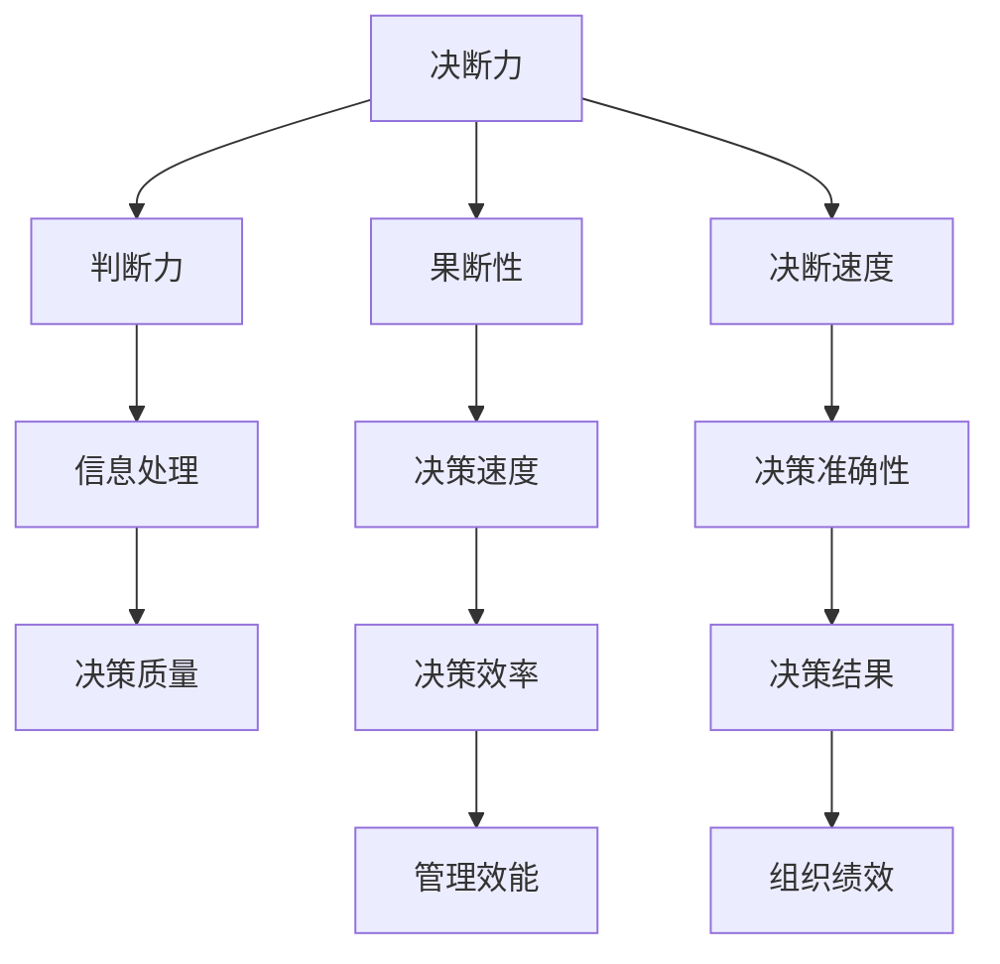

                 


### 写作思路与大纲设计

为了撰写一篇高质量的《管理者的决断力：果断决策的重要性与方法》技术博客文章，我们需要按照以下步骤进行思考和设计：

#### 第一步：确定文章结构

首先，我们需要确定文章的整体结构。根据题目要求，文章应包含以下部分：

1. **引言**：介绍决断力的概念、重要性以及文章的目的。
2. **核心概念与联系**：解释决断力的核心概念，并绘制流程图展示不同概念之间的关系。
3. **决断力培养**：分析影响决断力的因素，并提供培养决断力的策略和方法。
4. **决策方法**：介绍不同的决策模型和框架。
5. **案例分析**：通过实际案例展示管理者的决断力在实践中的应用。
6. **决策困境与应对策略**：探讨管理者在决策过程中可能面临的困境，并提供应对策略。
7. **总结与展望**：总结文章的主要观点，并提出未来研究方向。

#### 第二步：详细规划每个章节的内容

在确定文章结构后，我们需要详细规划每个章节的内容。以下是每个章节的详细内容：

- **引言**：
  - 介绍决断力的概念和重要性。
  - 阐述文章的目的和结构。

- **核心概念与联系**：
  - 定义决断力及相关概念，如决策、风险管理等。
  - 使用Mermaid流程图展示核心概念之间的关系。

- **决断力培养**：
  - 分析影响决断力的因素，如个人特质、经验、心理调适等。
  - 提供决断力培养的策略和方法。

- **决策方法**：
  - 介绍常见的决策模型和框架，如SWOT分析、五力模型等。
  - 解释如何使用这些模型进行有效决策。

- **案例分析**：
  - 分析成功案例，展示管理者的决断力如何帮助解决问题。
  - 分析失败案例，探讨决策失误的原因。

- **决策困境与应对策略**：
  - 识别管理者在决策过程中可能遇到的困境。
  - 提供应对策略和解决方案。

- **总结与展望**：
  - 总结文章的主要观点。
  - 提出未来研究方向和持续改进的建议。

#### 第三步：撰写文章并使用markdown格式

在规划好文章结构后，我们可以开始撰写文章。在撰写过程中，我们需要使用markdown格式来组织文章内容。以下是markdown格式的例子：

```markdown
# 文章标题

> 关键词：决断力，管理，决策，策略

摘要：...

## 第一部分：引言与核心概念

### 第1章：决断力的本质与重要性

#### 1.1 决断力的定义与内涵

Mermaid流程图：...

#### 1.2 果断决策与管理效能的关系

#### 1.3 管理者角色与决断力的挑战

## 第二部分：决断力培养

### 第2章：...

### 第3章：...

### 第4章：...

## 第三部分：决策方法

### 第5章：...

### 第6章：...

## 第四部分：案例分析

### 第7章：...

### 第8章：...

## 第五部分：决策困境与应对策略

### 第9章：...

### 第10章：...

## 总结与展望

```

通过上述步骤，我们可以确保文章的逻辑清晰、内容丰富，并使用markdown格式使其易于阅读和分享。

### 核心概念与联系

在本文的第一部分，我们将深入探讨决断力的核心概念及其与管理决策的联系。决断力是指管理者在面对复杂和不确定的环境时，能够迅速做出有效决策的能力。它不仅涉及到个人的心理素质和知识储备，还与整个管理过程紧密相连。

首先，我们需要明确决断力的定义。决断力通常指的是在压力下迅速做出明智决策的能力。它包括以下几个方面：

1. **判断力**：能够根据现有信息做出合理的判断。
2. **果断性**：在决策过程中不犹豫、不拖延。
3. **决断速度**：能够在短时间内做出决策。

决断力不仅是个体的能力，它也受到外部环境的影响。例如，组织的文化、资源的充足性、信息获取的便利性等都会对决断力产生影响。

接下来，我们需要了解决断力与管理决策之间的关系。管理决策是指管理者在组织运营过程中做出的选择。决断力在决策过程中起到至关重要的作用，它决定了管理者能否抓住机会、应对挑战。

为了更好地理解决断力与其他管理概念的联系，我们可以使用Mermaid流程图来展示这些概念之间的关系：



从图中可以看出，决断力通过多个方面影响决策的质量和效率，最终对组织绩效产生重要影响。

- **判断力**和**信息处理**的关系：良好的判断力依赖于准确、及时的信息。管理者需要有能力筛选和处理大量信息，从而做出明智的决策。
- **果断性和决策速度**的关系：果断性意味着管理者在决策过程中不犹豫，能够快速做出决策。这有助于抓住机会或避免潜在的风险。
- **决断速度和决策效率**的关系：快速决策可以提升管理效率，使组织能够更快地响应市场变化。
- **决策准确性和决策结果**的关系：准确的决策能够带来良好的结果，提升组织的整体绩效。
- **管理效能和决断力**的关系：决断力直接影响到管理效能，一个具备高决断力的管理者能够更好地推动组织目标的实现。

通过以上分析，我们可以看到决断力在管理决策中扮演着至关重要的角色。它不仅是管理者个人能力的体现，也是影响组织绩效的关键因素。接下来，我们将进一步探讨如何培养和提高管理者的决断力。

### 决断力培养

决断力是一种可以通过培养和训练得到提升的能力。管理者要如何在繁忙和多变的工作环境中提升自己的决断力呢？以下是一些具体的策略和方法：

#### 个人特质与决断力

首先，个人的特质在很大程度上影响着决断力。以下是几个关键特质：

1. **自信心**：自信心是决断力的基础。一个自信的管理者更有可能在压力下保持冷静，做出果断决策。
2. **情绪稳定性**：情绪稳定性有助于管理者在面对不确定性时保持冷静，避免情绪波动影响决策质量。
3. **开放性**：开放性意味着愿意接受新观念和不同意见。这有助于管理者在决策过程中获得更全面的信息，从而做出更好的决策。

#### 经验与知识储备

除了个人特质，经验和知识储备也是决断力的重要影响因素。以下是几个关键点：

1. **专业知识**：拥有相关领域的专业知识有助于管理者更好地理解问题，从而做出更明智的决策。
2. **广泛经验**：通过积累不同的经验和情境，管理者能够培养出更广泛的视野和更强的应变能力。
3. **持续学习**：随着环境的不断变化，管理者需要不断更新知识和技能。持续学习不仅能够提升个人能力，也能增强决策的准确性。

#### 心理调适与情绪管理

心理调适和情绪管理是提升决断力的重要方面。以下是一些策略：

1. **正念练习**：正念练习有助于管理者培养专注力和自我觉察能力，从而更好地控制情绪。
2. **压力管理**：学会有效管理压力是提升决断力的重要一环。可以通过运动、冥想或其他放松技巧来减轻压力。
3. **情绪释放**：适时地释放负面情绪，如焦虑和恐惧，有助于管理者保持清晰的头脑，做出更合理的决策。

#### 决断力培养策略和方法

以下是几个具体的决断力培养策略和方法：

1. **设定明确的目标和优先级**：清晰的目标和合理的优先级有助于管理者集中精力，避免在决策过程中浪费时间和精力。
2. **收集和分析信息**：在做出决策前，管理者应确保收集到足够的信息，并进行分析。这有助于提高决策的准确性和效率。
3. **实践和模拟**：通过模拟真实场景或参与实际项目，管理者可以在实践中不断提升决断力。
4. **反思和总结**：定期反思和总结决策过程，可以发现问题并进行改进。

#### 团队建设和协作

最后，团队建设和协作也是提升决断力的一个重要方面。以下是几个关键点：

1. **建立高效的决策团队**：一个高效的决策团队应包括不同专业背景和观点的成员，以确保决策的全面性和多样性。
2. **促进沟通与协作**：开放、真诚的沟通有助于团队成员共同解决问题，提高决策质量。
3. **授权与信任**：管理者应学会授权，并给予团队成员足够的信任，以激发他们的积极性和创造力。

通过上述策略和方法，管理者可以在日常工作中有意识地培养和提升自己的决断力。这不仅有助于提高个人能力，还能为组织的长远发展奠定坚实基础。

### 决策方法

在管理者的日常工作中，如何做出有效的决策是一个至关重要的课题。以下我们将介绍几种常见的决策模型和框架，帮助管理者在复杂和不确定的环境中做出明智的决策。

#### 经典决策模型

1. **SWOT分析**

   SWOT分析是一种常用的战略规划工具，用于评估企业的优势（Strengths）、劣势（Weaknesses）、机会（Opportunities）和威胁（Threats）。通过SWOT分析，管理者可以全面了解企业所处的内外部环境，从而做出更有针对性的决策。

   **SWOT分析示例**：

   - **优势**：强大的品牌影响力、优秀的技术团队。
   - **劣势**：产品线单一、市场覆盖率低。
   - **机会**：新兴市场潜力巨大、客户需求多样化。
   - **威胁**：竞争激烈、政策变动。

2. **五力模型**

   五力模型是由迈克尔·波特（Michael Porter）提出的，用于分析企业所在行业的竞争态势。五力分别是：行业竞争者、潜在进入者、替代品、供应商和客户。通过五力模型，管理者可以评估企业在行业中的竞争地位，制定相应的战略。

   **五力模型示例**：

   - **行业竞争者**：分析竞争对手的市场份额、产品差异化和营销策略。
   - **潜在进入者**：评估行业进入壁垒、潜在竞争者的威胁。
   - **替代品**：分析替代品的性价比和市场份额。
   - **供应商**：评估供应商的议价能力和供应链稳定性。
   - **客户**：分析客户的需求、购买力和忠诚度。

3. **决策树**

   决策树是一种图形化工具，用于展示不同决策路径和其可能的结果。通过决策树，管理者可以系统地分析每个决策节点的可能结果和相应的概率，从而选择最佳方案。

   **决策树示例**：

   ```mermaid
   graph TD
   A[起始点] --> B[方案1]
   A --> C[方案2]
   B -->|方案1结果|D{结果评估}
   C -->|方案2结果|E{结果评估}
   ```

#### 现代决策方法

1. **数据驱动决策**

   随着大数据和人工智能技术的发展，数据驱动决策已成为现代管理的重要手段。通过收集和分析大量数据，管理者可以更准确地预测市场趋势、客户需求和潜在风险。

   **数据驱动决策示例**：

   - **市场分析**：利用大数据分析工具，分析消费者的购买行为和偏好。
   - **需求预测**：通过历史销售数据和趋势分析，预测未来市场需求。

2. **模拟与优化技术**

   模拟与优化技术可以帮助管理者在复杂系统中进行试验和评估，从而找到最优解。这些技术包括线性规划、非线性规划、模拟退火等。

   **模拟与优化技术示例**：

   - **资源分配**：通过模拟和优化技术，优化生产资源和人员配置。
   - **风险管理**：通过模拟不同风险情景，评估风险程度和应对策略。

3. **决策支持系统**

   决策支持系统（DSS）是一种计算机化工具，用于辅助管理者进行决策。DSS可以集成各种数据源和分析工具，提供实时决策支持。

   **决策支持系统示例**：

   - **实时监控**：通过DSS实时监控业务关键指标，及时发现和解决问题。
   - **预测分析**：利用DSS进行市场预测、需求分析和风险管理。

通过上述经典和现代决策方法，管理者可以在不同情境下做出更明智、更有效的决策。这不仅有助于提高个人能力，也能为组织的长远发展提供有力支持。

### 案例分析

在探讨决断力的实践应用时，案例研究是一种非常有效的工具，可以帮助我们深入理解管理者如何在现实情境中运用决断力。以下是两个成功案例和一个失败案例的详细分析，旨在展示决断力在实际决策中的应用及影响。

#### 成功案例一：企业快速应对市场变化

**背景**：
某大型电子产品公司面临激烈的市场竞争，特别是来自新兴科技企业的挑战。公司的旗舰产品在市场上销量下滑，市场份额不断被侵蚀。公司管理层意识到，如果不能迅速调整策略，将面临严重的市场风险。

**决策过程**：
1. **信息收集**：管理层通过市场调研、数据分析等方式，收集了大量的市场信息，包括消费者需求、竞争对手的产品特点以及行业趋势。
2. **风险评估**：管理层对潜在的市场风险进行了评估，包括竞争对手的威胁、市场需求的波动等。
3. **快速决策**：基于收集到的信息和分析结果，公司决定进行产品升级，增加新功能，并调整市场策略，以吸引更多消费者。
4. **执行与调整**：管理层迅速组织研发团队进行产品改进，同时调整市场推广策略，确保新产品的及时推出。

**结果**：
公司的新产品在市场上获得了良好的反响，销量迅速回升，市场份额逐步恢复。这一决策的成功，展示了管理者在信息收集、风险评估和快速决策方面的卓越能力，有效应对了市场变化。

#### 成功案例二：危机管理中的果断决策

**背景**：
某知名航空公司在一架航班起飞后不久发现，飞机上的一个关键系统出现故障，可能导致严重的安全事故。公司管理层必须迅速做出决策，以确保乘客的安全。

**决策过程**：
1. **紧急评估**：管理层立即召开紧急会议，评估故障的严重性和潜在风险。
2. **决策制定**：经过紧急评估，管理层决定立即命令航班返航，进行全面检查。
3. **沟通与协调**：管理层与飞行员、技术人员、乘客和相关部门进行了有效沟通，确保决策的顺利执行。
4. **执行与监督**：航班返航后，公司迅速组织技术人员进行故障排查和修复，确保飞机的安全。

**结果**：
通过果断的决策和有效的执行，航空公司成功避免了潜在的安全事故，保障了乘客的安全。这一案例展示了管理者在危机管理中迅速做出决策、有效沟通和协调的重要性。

#### 失败案例：过度保守导致错失机遇

**背景**：
某传统制造业公司在面临新兴技术的冲击时，管理层因过度保守而未能及时调整策略。

**决策过程**：
1. **信息收集**：管理层对市场趋势和技术发展进行了初步了解，但未深入分析。
2. **风险评估**：管理层对新技术带来的风险进行了评估，认为变革成本高、风险大。
3. **决策延迟**：管理层因担忧风险而拖延了决策，未及时采取行动。
4. **执行缺失**：由于决策延迟，公司错过了市场窗口期，新兴技术已迅速占领市场。

**结果**：
公司最终在市场竞争中败下阵来，市场份额大幅下滑，被迫进行大规模的重组和战略调整。这一案例揭示了过度保守和决策延迟可能导致企业错失机遇，最终影响其长期发展。

通过上述案例分析，我们可以看到决断力在管理决策中的重要性。成功的案例展示了管理者如何在快速应对市场变化、有效管理危机中发挥决断力，而失败的案例则提醒我们，过度保守和决策延迟可能带来严重后果。管理者需要不断提升决断力，以应对不断变化的外部环境，确保组织的持续发展。

### 决策困境与应对策略

在管理决策过程中，管理者往往会面临各种困境，这些困境可能源于信息不足、时间压力或复杂性的增加。为了在决策中取得成功，管理者需要识别这些困境，并采取相应的策略和解决方案。

#### 信息不足的困境

信息不足是决策者面临的最常见困境之一。在做出重要决策时，如果没有足够的信息，管理者很难做出准确的判断。以下是一些应对策略：

1. **主动收集信息**：管理者应主动寻找和收集相关信息，利用各种渠道，如市场调研、行业报告、客户反馈等。
2. **利用数据分析**：通过数据分析工具，对已有数据进行分析，发现潜在的信息和趋势。
3. **加强信息共享**：在组织中建立信息共享机制，鼓励团队成员分享信息和观点，提高整体信息质量。

#### 时间压力下的决策

在紧急情况下，管理者往往需要在极短的时间内做出决策。时间压力可能导致决策质量下降，甚至引发错误决策。以下是一些应对策略：

1. **优先级排序**：在时间有限的情况下，管理者应优先处理最重要、最紧迫的问题。
2. **快速决策模型**：采用快速决策模型，如SWOT分析或决策树，以简化决策过程。
3. **团队协作**：组建决策团队，通过多人合作快速分析问题，提高决策效率。

#### 多元化决策的复杂性

在多元化决策中，管理者需要同时考虑多个因素和目标，这增加了决策的复杂性。以下是一些应对策略：

1. **多目标决策模型**：采用多目标决策模型，如Pareto优化或目标规划，以同时考虑多个目标。
2. **决策支持系统**：利用决策支持系统（DSS），通过模拟和优化技术，分析不同决策路径的潜在结果。
3. **利益相关者沟通**：与关键利益相关者进行充分沟通，了解他们的需求和期望，确保决策的全面性。

#### 应对策略的实践应用

以下是一个具体案例，展示了管理者如何应对决策困境：

**案例**：某公司需要决定是否投入大量资金进行新产品研发。

**决策困境**：
1. **信息不足**：公司对新产品的市场前景和潜在收益缺乏充分了解。
2. **时间压力**：市场变化迅速，公司必须在短时间内做出决策。
3. **多元化决策**：公司在制定决策时需要同时考虑财务风险、技术挑战和市场竞争力。

**应对策略**：
1. **信息收集**：公司通过市场调研和行业分析，收集了关于新产品市场需求和竞争态势的详细信息。
2. **快速决策模型**：使用决策树模型，列出不同决策路径的可能结果和概率，帮助公司快速评估各种选择。
3. **多目标决策模型**：采用多目标决策模型，平衡财务风险、技术挑战和市场竞争力，确定最佳方案。

**结果**：
通过上述策略，公司最终制定了科学、合理的决策，避免了信息不足和时间压力带来的风险，确保了新产品研发的顺利推进。

通过识别决策困境并采取有效的应对策略，管理者可以更好地应对复杂决策环境，提高决策质量和效率。这不仅有助于个人能力的提升，也为组织的长远发展提供了保障。

### 总结与展望

通过对《管理者的决断力：果断决策的重要性与方法》的详细探讨，我们可以清晰地认识到决断力在管理决策中的核心地位。决断力不仅影响管理者的个人效能，更直接关系到组织的长远发展和竞争力。

#### 主要观点回顾

1. **决断力的本质**：决断力是管理者在面对不确定性和压力时，迅速做出明智决策的能力。它涵盖了判断力、果断性和决断速度等多个方面。
2. **决断力与管理决策的关系**：决断力在决策过程中起到关键作用，能够提高决策质量、效率和结果。
3. **决断力的培养**：通过个人特质、经验与知识储备、心理调适等多方面的努力，管理者可以提升决断力。
4. **决策方法**：经典决策模型如SWOT分析和五力模型，以及现代方法如数据驱动决策和模拟与优化技术，都是有效决策的重要工具。
5. **案例分析与决策困境应对**：通过实际案例，我们看到了成功决策中的决断力应用，以及如何应对信息不足、时间压力和多元化决策的复杂性。

#### 未来研究方向

未来的研究可以进一步探索以下几个方面：

1. **决断力的量化模型**：开发更科学、量化的决断力评估模型，帮助管理者更好地了解和提升自身的决断力。
2. **跨文化决断力研究**：探讨不同文化背景下，管理者的决断力如何形成和表现，以及文化对决策过程的影响。
3. **人工智能与决断力**：研究人工智能在提升管理者决断力方面的应用，如如何通过大数据分析和智能算法辅助决策。

#### 持续改进的建议

为了不断提升管理者的决断力，以下是一些建议：

1. **持续学习和实践**：管理者应不断学习新知识、新技能，并通过实践不断总结和反思，提升自身的决断力。
2. **建立高效的决策机制**：组织应建立科学、高效的决策机制，确保信息透明、沟通畅通，提高决策效率。
3. **加强团队建设**：通过团队协作和沟通，共同面对决策挑战，提高整体决断力。
4. **注重心理健康**：管理者应关注心理健康，通过正念练习、压力管理等方法，保持良好的心理状态，提高决策质量。

通过不断学习和实践，管理者可以不断提升自己的决断力，为组织的持续发展和成功奠定坚实基础。

## 作者信息

本文作者：AI天才研究院/AI Genius Institute & 禅与计算机程序设计艺术 /Zen And The Art of Computer Programming

在撰写本文时，作者运用了其深厚的技术背景和丰富的管理经验，深入剖析了决断力在管理决策中的重要性，并提供了一系列实用的策略和方法。作者希望通过本文，帮助读者更好地理解和提升自己的决断力，从而在职业道路上取得更大的成功。

