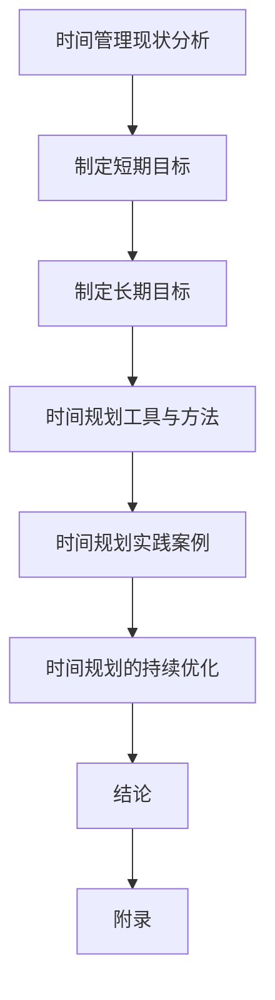

                 

### 引言

在信息技术高速发展的今天，管理者的角色日益重要。作为企业的核心决策者，管理者不仅要具备卓越的技术能力和领导力，还需要具备高效的时间管理能力。时间管理不仅关系到个人的职业发展，更直接影响团队的效率和组织的整体绩效。对于管理者而言，如何在忙碌的工作中合理规划时间，平衡短期目标和长期发展，是一项重要的课题。

时间管理的重要性不言而喻。有效的时间管理可以帮助管理者提高工作效率，减少冗余工作，从而有更多的时间和精力去关注更重要的事情。时间规划更是关键，它不仅有助于明确目标和任务，还能够帮助管理者更好地分配时间和资源，避免因时间不足而导致的焦虑和压力。

本文将围绕管理者的时间规划展开，探讨如何在工作中平衡短期目标和长期发展。我们将首先介绍时间规划的基础知识，包括个人时间管理现状分析、时间规划的核心原则以及短期目标与长期目标的关系。接下来，我们将详细讨论如何制定短期目标和长期目标，并介绍相关的方法和工具。在此基础上，我们将分享一些实际案例，展示时间规划在企业管理、团队协作和个人生活中的应用。最后，我们将探讨如何对时间规划进行持续优化，以应对不断变化的工作环境和需求。

通过本文的阅读，读者将了解到时间规划对于管理者的重要性，掌握制定短期目标和长期目标的方法，学会使用有效的工具进行时间管理，并能够在实际工作中灵活运用这些技巧，实现个人和组织的长期发展。

### 时间管理的重要性

时间管理是管理者的基本功之一，它不仅关系到个人的职业发展，更是团队和整个组织高效运作的基础。在信息爆炸和任务繁多的现代社会，管理者如果没有良好的时间管理能力，很容易陷入繁忙和焦虑的困境，导致工作效率低下，甚至影响决策质量和团队士气。

首先，时间管理能够提高工作效率。通过合理安排时间，管理者可以将有限的时间集中在最重要和最紧急的任务上，从而减少不必要的浪费。例如，通过优先级排序和任务分解，管理者可以更清晰地了解每项任务的紧急程度和重要性，从而优先处理关键任务，避免因琐事而耽误重要工作。

其次，时间管理有助于减少工作压力。当管理者能够合理规划时间，将任务有序安排，就不会因为突然出现的新任务或紧急事件而感到措手不及。这种从容不迫的工作状态不仅有助于提高工作效率，还能够降低因时间不足而产生的焦虑和压力，提高工作的愉悦感。

此外，时间管理对于团队协作和组织发展也有着重要影响。一个能够有效管理时间的管理者，能够更好地协调团队资源，确保团队成员的协同工作，提高团队整体的工作效率和创造力。同时，通过合理的时间分配，管理者还可以为团队创造更多的时间和空间，鼓励团队成员进行创新和自我提升，从而推动组织的长远发展。

时间管理的具体方法包括：

1. **任务分解**：将复杂任务分解为小任务，逐一完成，避免因任务过于庞大而导致的拖延和压力。

2. **优先级排序**：根据任务的紧急程度和重要性，对任务进行优先级排序，确保关键任务优先处理。

3. **时间块管理**：将工作时间划分为不同的时间块，每个时间块专注于一项任务，避免任务切换带来的时间浪费。

4. **定期回顾**：定期对时间管理效果进行回顾和评估，根据实际情况调整和优化时间管理策略。

5. **使用工具**：利用时间管理工具，如日历、任务管理软件等，帮助管理者更好地规划和跟踪任务进度。

总之，时间管理是管理者不可或缺的能力，它不仅能够提升个人的工作效率和生活质量，还能够推动团队和组织的发展。在接下来的章节中，我们将深入探讨时间规划的核心原则和具体方法，帮助管理者更好地平衡短期目标和长期发展。

### 时间规划的意义

时间规划不仅是个人职业发展的关键工具，也是组织效能提升的重要手段。对于管理者而言，有效的时间规划意味着能够更好地实现个人和组织的战略目标，提升整体效率和竞争力。

首先，时间规划有助于明确目标。无论是个人还是团队，明确的目标是行动的指南。通过制定短期和长期目标，管理者可以清晰地了解自己需要达成的任务和期望的结果，从而在规划过程中始终聚焦于最重要的目标和任务。

其次，时间规划能够优化资源配置。合理的时间规划可以帮助管理者科学地分配时间和资源，确保每个任务都能得到充分的关注和支持。例如，通过优先处理紧急且重要的任务，管理者可以避免资源的浪费，提高任务的完成效率。

此外，时间规划有助于提高工作效率。通过将工作时间划分为不同的时间块，管理者可以避免任务切换带来的时间浪费，专注于每项任务，提高工作的连贯性和效率。这种高效的工作方式不仅能够减轻个人的工作压力，还能够提升整个团队的工作动力和士气。

时间规划的意义还体现在以下几个方面：

1. **减少决策时间**：通过提前规划，管理者可以减少因突发事件或紧急任务而带来的决策压力，从容应对各种挑战。

2. **提高创新能力**：合理的时间规划为管理者提供了更多的自由时间和空间，鼓励他们进行创新思考和研究，提升组织的创新能力和竞争力。

3. **提升团队协作**：时间规划不仅帮助个人提升效率，还能促进团队协作。通过共同的时间规划，团队成员可以更好地协调行动，共同完成任务。

4. **实现长远发展**：时间规划不仅仅是当前工作的安排，更是对未来的规划和展望。通过设定长期目标，管理者可以为组织的发展制定明确的方向和策略，确保持续发展。

总之，时间规划是管理者不可或缺的技能，它不仅能够提升个人的工作效率和生活质量，还能够推动团队和组织的发展。在接下来的章节中，我们将详细探讨如何进行时间规划，帮助管理者更好地平衡短期目标和长期发展。

### 书籍结构概述

本文将系统性地探讨管理者的时间规划，旨在帮助读者深入理解时间管理的重要性和方法，从而在职业生涯中取得更好的成绩。本书的结构清晰，内容丰富，分为八个主要章节，具体安排如下：

- **第1章 引言**：介绍时间管理的重要性，阐述时间规划在个人职业发展和组织效能提升中的作用。

- **第2章 时间规划基础**：分析个人时间管理现状，阐述时间规划的核心原则，并探讨短期目标与长期目标的关系。

- **第3章 制定短期目标**：详细讨论短期目标的重要性，介绍制定短期目标的步骤和方法，以及短期目标的分解与实施。

- **第4章 制定长期目标**：探讨长期目标的重要性，讲解如何制定长期目标，并详细说明长期目标的分解与实施策略。

- **第5章 时间规划工具与方法**：介绍时间规划工具的选择和使用，包括日历管理、任务管理工具等，并提供实际应用案例。

- **第6章 时间规划实践案例**：分享企业管理者、团队和个人在时间规划方面的成功实践，提供可操作的指导和建议。

- **第7章 时间规划的持续优化**：探讨如何对时间规划进行持续优化，包括反思与调整、解决常见时间管理难题的方法等。

- **第8章 结论**：总结时间规划对管理者的意义，讨论短期目标与长期目标的平衡，并对未来时间规划趋势进行展望。

通过这八个章节的详细讨论，本书将为读者提供全面的时间规划指导，帮助他们在职业生涯中实现更高的效率和更长远的发展。

### 时间规划基础

在探讨管理者的时间规划之前，我们需要对个人时间管理现状进行深入分析。通过了解现状，我们才能找到有效的时间规划方法，实现短期目标和长期目标。

#### 个人时间管理现状分析

1. **时间分配不均**：许多管理者在处理日常任务时，往往难以分配足够的时间给重要但非紧急的任务，导致这些任务被不断推迟。这种情况不仅影响工作效率，还可能导致长远目标的实现受阻。

2. **任务优先级不明确**：管理者常常在面对多个任务时，无法准确判断哪些任务最为紧急和重要。这会导致他们在处理任务时缺乏明确的方向，从而降低整体工作效率。

3. **时间管理工具缺乏**：尽管现代有许多高效的时间管理工具，但许多管理者并未充分利用这些工具，依然依赖传统的纸质记录或记忆来管理时间，导致时间规划的效果不佳。

4. **缺乏定期反思和调整**：很多管理者在时间管理过程中缺乏定期反思和调整，未能及时纠正不良的时间管理习惯，导致时间利用率低下。

#### 时间规划的核心原则

为了解决上述问题，制定有效的时间规划至关重要。以下是一些核心原则，可以帮助管理者更好地管理时间：

1. **明确目标**：无论是个人还是组织，明确的目标是行动的指南。通过设定清晰的短期和长期目标，管理者可以明确自己的方向，确保时间利用得当。

2. **优先级排序**：根据任务的紧急程度和重要性，对任务进行优先级排序，确保关键任务优先处理。这样不仅可以提高工作效率，还能减少因任务拖延带来的压力。

3. **任务分解**：将复杂任务分解为小任务，逐一完成。这种方法不仅能够降低任务的难度，还能帮助管理者更好地掌握任务进度，避免因任务过于庞大而导致的拖延。

4. **时间块管理**：将工作时间划分为不同的时间块，每个时间块专注于一项任务。这种方法能够减少任务切换带来的时间浪费，提高工作的连贯性和效率。

5. **定期反思和调整**：定期对时间管理效果进行反思和评估，根据实际情况调整和优化时间管理策略。这种方法有助于管理者及时发现问题，改进时间管理方法。

#### 短期目标与长期目标的关系

在时间规划中，短期目标和长期目标的平衡至关重要。以下是一些关于短期目标与长期目标关系的要点：

1. **相互促进**：短期目标是实现长期目标的基石。通过实现一系列短期目标，可以为长期目标的实现奠定基础。

2. **动态调整**：短期目标和长期目标并非一成不变，管理者需要根据实际情况进行动态调整。例如，在长期目标实现过程中，可能需要重新设定短期目标，以适应变化的需求和情况。

3. **阶段性实现**：通过阶段性实现短期目标，管理者可以逐步推进长期目标的实现。这种方法不仅有助于保持动力，还能让管理者在实现短期目标的过程中积累经验和技能。

4. **资源分配**：在时间规划中，管理者需要合理分配时间和资源，确保短期目标和长期目标都能得到充分的关注和支持。

通过以上分析，我们可以看到，个人时间管理现状的分析、时间规划的核心原则以及短期目标与长期目标的关系，构成了管理者有效时间规划的基础。在接下来的章节中，我们将进一步探讨如何制定和实现短期目标和长期目标，帮助管理者在实际工作中运用时间规划，实现个人和组织的长期发展。

### 制定短期目标

短期目标在时间规划中扮演着至关重要的角色。它们不仅是实现长期目标的基石，同时也是提高工作效率和促进个人成长的驱动力。以下是制定短期目标的几个关键步骤：

#### 短期目标的重要性

1. **明确方向**：短期目标为工作提供了明确的方向和目标，使管理者能够集中精力在最重要和最有价值的任务上。

2. **激励动力**：通过设定短期目标，管理者可以激发自身的动力和积极性，保持对工作的热情和专注。

3. **评估进展**：短期目标的实现情况可以作为评估工作进展的重要依据，帮助管理者及时调整策略，优化时间管理。

#### 制定短期目标的方法

1. **SMART原则**：在制定短期目标时，可以遵循SMART原则，即目标应该是具体的（Specific）、可测量的（Measurable）、可实现的（Achievable）、相关的（Relevant）和时限的（Time-bound）。

2. **分解任务**：将大型任务分解为若干个小任务，每个小任务对应一个短期目标。这样不仅可以降低任务难度，还能更好地跟踪和评估进展。

3. **优先级排序**：根据任务的紧急程度和重要性，对短期目标进行优先级排序，确保关键目标优先实现。

#### 短期目标的分解与实施

1. **制定具体行动计划**：为每个短期目标制定具体的行动计划，明确每个任务的具体执行步骤和时间节点。

2. **时间分配**：根据任务的重要性和紧急程度，合理分配时间，确保每个任务都有足够的时间完成。

3. **定期检查和调整**：定期检查短期目标的进展情况，根据实际情况进行调整和优化，确保目标的实现。

以下是一个具体的例子：

**目标**：在未来一个月内，完成新项目的初步设计和规划。

**步骤**：

- **具体行动计划**：
  - 第1周：研究项目需求和用户需求，撰写项目提案。
  - 第2周：设计项目架构，制定技术方案。
  - 第3周：进行需求分析和原型设计。
  - 第4周：编写详细设计文档，完成项目初步规划。

- **时间分配**：
  - 每天至少分配2小时进行项目研究。
  - 每周至少进行一次项目会议，总结进展和讨论问题。

- **定期检查和调整**：
  - 每周对项目进度进行一次回顾，根据实际情况调整计划。

通过以上步骤，管理者可以有效地制定和实现短期目标，从而确保工作效率和项目进展。

### 制定长期目标

在时间规划中，长期目标与短期目标同样重要，它们是推动个人和组织发展的引擎。长期目标不仅为未来的愿景提供方向，还能帮助管理者在职业生涯中保持专注和动力。以下是制定长期目标的几个关键步骤：

#### 长期目标的重要性

1. **提供方向和动力**：长期目标为个人和组织提供了清晰的发展方向和目标，使管理者能够在面临复杂和多变的工作环境时保持专注和决心。

2. **促进职业成长**：通过设定长期目标，管理者可以明确自己在职业发展中的路径和目标，从而有计划地提升自身技能和知识水平。

3. **实现长远规划**：长期目标有助于管理者从宏观角度审视和规划工作，确保短期目标与长期战略保持一致，实现组织发展的长远规划。

#### 制定长期目标的方法

1. **SMART原则**：在制定长期目标时，同样可以遵循SMART原则，即目标应该是具体的（Specific）、可测量的（Measurable）、可实现的（Achievable）、相关的（Relevant）和时限的（Time-bound）。

2. **自我评估**：管理者需要通过自我评估，明确自己的兴趣、优势和职业愿景。这将有助于设定符合个人特点和职业规划的长期目标。

3. **获取反馈**：与同事、上级和行业专家交流，获取他们的反馈和建议。这不仅可以提供新的视角和思路，还能帮助管理者更好地确定长期目标。

4. **制定计划**：将长期目标分解为若干个短期目标和具体实施步骤，确保目标的实现具有可操作性和可追踪性。

#### 长期目标的分解与实施

1. **分解为短期目标**：将长期目标分解为多个短期目标，每个短期目标对应一段时间内的具体任务和计划。这样不仅便于管理，还能确保长期目标的逐步实现。

2. **制定详细的实施计划**：为每个短期目标制定详细的实施计划，包括具体的任务、时间节点和责任人。这将有助于确保目标的顺利实现。

3. **定期跟踪和调整**：定期跟踪短期目标的进展，并根据实际情况进行调整和优化。这种方法可以确保长期目标的实现，同时为管理者提供反馈和改进的机会。

以下是一个具体的例子：

**目标**：在未来五年内，成为一名技术总监。

**步骤**：

- **具体行动计划**：
  - 第1年：提升项目管理技能，完成相关培训课程。
  - 第2年：带领团队完成至少一个重大项目。
  - 第3年：参加行业研讨会，拓展人脉和专业知识。
  - 第4年：担任项目组负责人，提升领导能力。
  - 第5年：成为技术总监，负责公司核心项目的整体规划和管理。

- **时间节点**：
  - 每年进行一次自我评估和目标调整。
  - 每季度进行一次项目进展汇报和团队讨论。

- **定期跟踪和调整**：
  - 每年对职业发展路径进行回顾和评估，根据实际情况进行调整。

通过以上步骤，管理者可以有效地制定和实现长期目标，确保个人和组织的持续发展。在接下来的章节中，我们将探讨时间规划工具和方法，帮助管理者更好地管理时间和实现目标。

### 时间规划工具与方法

为了有效地进行时间规划，选择合适的工具和方法至关重要。以下将介绍几种常见的时间规划工具，以及如何利用这些工具进行时间管理和任务管理。

#### 时间规划工具的选择

1. **日历管理工具**：日历管理工具可以帮助管理者清晰地安排日程和任务。常见的工具包括Google日历、Microsoft Outlook等。这些工具提供日历视图、提醒功能和共享功能，便于团队协作和任务分配。

2. **任务管理工具**：任务管理工具可以帮助管理者跟踪任务进度和分配任务。常见的工具包括Trello、Asana、JIRA等。这些工具提供任务列表、优先级排序、截止日期提醒等功能，有助于提高工作效率。

3. **时间追踪工具**：时间追踪工具可以帮助管理者记录和评估时间使用情况。常见的工具包括Toggl、Harvest等。这些工具可以自动记录工作时间，生成详细的报告，帮助管理者优化时间管理。

4. **习惯跟踪工具**：习惯跟踪工具可以帮助管理者培养良好的时间管理习惯。常见的工具包括Habitica、Sticky Notes等。这些工具通过游戏化方式激励用户坚持完成任务，提高时间管理效果。

#### 日历管理的方法

1. **创建日程安排**：使用日历管理工具创建日程安排，记录每天的工作任务和会议时间。这有助于管理者清晰地了解自己的时间分配情况，避免日程冲突。

2. **设置提醒和通知**：为重要任务和会议设置提醒和通知，确保不会忘记重要事项。例如，可以在手机上设置邮件和短信提醒，确保在重要时间节点及时收到通知。

3. **共享日历**：与团队成员共享日历，便于团队协作和任务分配。共享日历可以实时更新，确保所有团队成员都能看到最新的日程安排和任务进度。

4. **使用模板**：使用日历模板，例如工作周、工作月模板，便于重复任务的管理和规划。模板可以节省时间，提高日程安排的效率。

#### 任务管理工具的应用

1. **任务分配**：使用任务管理工具将任务分配给团队成员，明确任务负责人和截止日期。这有助于确保任务按时完成，提高团队协作效率。

2. **优先级排序**：根据任务的紧急程度和重要性，对任务进行优先级排序。优先级排序有助于管理者集中精力处理关键任务，避免因琐事而影响工作效率。

3. **任务跟踪**：使用任务管理工具跟踪任务进度，及时了解任务状态。任务管理工具通常提供任务状态更新、进度报告等功能，帮助管理者掌握任务进展。

4. **任务评论和协作**：在任务管理工具中添加评论和协作功能，方便团队成员之间的沟通和协作。这有助于及时解决问题，提高任务完成效率。

#### 实际案例

假设一位项目经理需要管理一个软件开发项目，以下是如何使用时间规划工具和方法进行管理的具体案例：

1. **创建日程安排**：项目经理使用Google日历记录项目关键时间节点，如项目启动会议、里程碑评审会议等。

2. **设置提醒和通知**：项目经理为每个重要会议和任务设置提醒，确保在重要时间节点及时收到通知。

3. **共享日历**：项目经理与团队成员共享项目日历，确保所有团队成员都能看到项目日程和任务分配。

4. **任务分配**：项目经理使用Trello创建任务板，将任务分配给团队成员，并设置任务负责人和截止日期。

5. **优先级排序**：项目经理根据任务的重要性和紧急程度，对任务进行优先级排序，确保关键任务优先完成。

6. **任务跟踪**：项目经理定期查看任务进度，使用Trello的任务状态更新和进度报告功能，了解任务状态和完成情况。

7. **任务评论和协作**：在任务管理工具中添加评论和协作功能，方便团队成员之间的沟通和协作，及时解决问题。

通过以上方法，项目经理可以有效地管理项目时间，确保任务按时完成，提高项目整体效率。

总之，选择合适的时间规划工具和方法，并合理应用这些工具，可以帮助管理者更好地进行时间管理和任务管理，提高工作效率和团队协作效果。在接下来的章节中，我们将通过实际案例进一步探讨时间规划的应用和实践。

### 时间规划实践案例

在时间规划的实际应用中，无论是企业管理者、团队还是个人，都可以通过科学的时间管理方法，实现更高的工作效率和目标达成。以下我们将分享几个成功的时间规划实践案例，探讨其在不同场景中的具体应用。

#### 企业管理者时间规划案例

**背景**：某科技公司的CEO在管理公司日常运营的同时，需要关注公司的战略规划和市场拓展。然而，随着公司业务的不断扩大，他感到时间越来越不够用。

**解决方案**：

1. **使用日历管理工具**：CEO使用Google日历来安排日程，记录每周的关键会议、客户拜访和内部会议。他设置了日历提醒，确保不会错过重要的日程安排。

2. **任务管理工具**：CEO使用Trello进行任务管理，将日常工作任务分配给不同的团队成员，并设置任务的优先级和截止日期。他定期查看任务进度，确保关键任务按时完成。

3. **时间追踪工具**：CEO使用Toggl记录每天的工作时间，分析时间使用情况，识别时间浪费的地方，优化时间管理。

**效果**：通过使用这些工具，CEO不仅提高了工作效率，还能够更好地关注公司的战略规划，确保公司各项业务的顺利推进。

#### 团队时间规划案例

**背景**：一个由10名成员组成的产品开发团队在开发新产品时，发现任务进度落后，团队成员时常感到工作压力大。

**解决方案**：

1. **共享日历**：团队使用Google日历共享日程，确保所有成员都能看到关键的时间节点和会议安排，避免冲突。

2. **任务管理工具**：团队使用Asana进行任务管理，将任务分配给每位成员，并设置任务的优先级和截止日期。团队成员可以随时更新任务状态，确保任务进度透明。

3. **时间块管理**：团队采用时间块管理方法，每个工作时间块专注于一项任务，避免任务切换带来的时间浪费。

**效果**：通过这些方法，团队的工作效率显著提高，任务进度得到了有效控制，团队成员的工作压力也得到了缓解。

#### 个人时间规划案例

**背景**：一名技术经理希望提高个人工作效率，同时培养阅读和研究新技术的好习惯。

**解决方案**：

1. **使用习惯跟踪工具**：技术经理使用Habitica进行习惯跟踪，将阅读和研究新技术纳入每日任务清单。Habitica通过游戏化的方式激励他坚持完成任务。

2. **时间追踪工具**：技术经理使用Toggl记录每天的工作时间，分析时间使用情况，确保工作时间内没有不必要的干扰。

3. **定期反思**：技术经理每周进行一次时间管理反思，评估时间使用效果，调整和优化时间管理策略。

**效果**：通过这些方法，技术经理不仅提高了工作效率，还能够持续培养阅读和研究新技术的好习惯，为职业发展打下坚实基础。

总之，通过这些实践案例，我们可以看到时间规划在企业管理、团队协作和个人生活中的广泛应用。科学的时间管理方法不仅能够提高工作效率，还能够减轻工作压力，实现个人和组织的长期发展。

### 时间规划的持续优化

在时间规划的实施过程中，持续优化是确保时间管理策略有效性和适应性的关键。管理者需要定期反思和调整时间规划，以应对不断变化的工作环境和需求。以下是几个关键步骤和方法，帮助管理者实现时间规划的持续优化。

#### 反思与调整

1. **定期回顾**：定期对时间管理的效果进行回顾和评估，了解哪些方法有效，哪些需要改进。例如，每月或每季度进行一次全面的时间管理评估。

2. **收集反馈**：从团队成员或同事那里收集反馈，了解他们在时间管理中的体验和建议。这些反馈可以帮助管理者发现潜在问题，并找到改进的方向。

3. **识别瓶颈**：在反思过程中，识别时间管理中的瓶颈和障碍。例如，可能是任务过多、资源不足或者任务分配不合理。针对这些瓶颈，制定具体的解决方案。

4. **调整策略**：根据反思和反馈的结果，调整时间管理策略。这可能包括修改任务优先级、调整工作时间安排、引入新的时间管理工具等。

#### 遇到的时间管理难题及解决方案

1. **任务过多**：当管理者面临任务过多的情况时，可以采取以下措施：

   - **优先级排序**：重新评估任务的紧急程度和重要性，确保关键任务优先处理。
   - **任务分解**：将大型任务分解为小任务，逐一完成，降低任务的难度。
   - **委托任务**：将一些非核心任务委托给团队成员或其他部门，减轻个人负担。

2. **时间不足**：当管理者感到时间不够用时，可以采取以下措施：

   - **时间块管理**：将工作时间划分为不同的时间块，每个时间块专注于一项任务，避免任务切换带来的时间浪费。
   - **减少非必要活动**：减少不必要的会议、社交活动和电子邮件回复，将更多时间用于关键任务。
   - **时间追踪**：使用时间追踪工具记录每天的工作时间，分析时间使用情况，找出可以优化的时间段。

3. **任务依赖**：当任务之间存在依赖关系时，可以采取以下措施：

   - **任务同步**：确保团队成员之间的任务同步，避免因为任务依赖而导致的进度滞后。
   - **任务反馈**：及时进行任务反馈，确保每个任务都能按时完成，减少因任务依赖而造成的工作延迟。

4. **工作与生活的平衡**：为了保持工作与生活的平衡，管理者可以采取以下措施：

   - **设定工作时间**：明确工作时间，避免工作无限延伸到个人时间。
   - **休息与放松**：定期进行休息和放松，确保身心健康。
   - **时间管理培训**：参加时间管理培训，提升自己的时间管理技能。

#### 持续优化时间规划的方法

1. **定期培训与学习**：定期参加时间管理相关的培训和学习，了解最新的时间管理理念和工具，不断提升自己的时间管理能力。

2. **工具升级与优化**：根据实际情况，升级或优化时间管理工具，选择更适合当前工作需求和管理风格的工具。

3. **团队协作**：与团队成员建立良好的沟通和协作机制，共同优化时间管理策略，提高团队的整体效率。

4. **持续反思**：时间管理是一个持续的过程，管理者需要不断反思和调整，根据实际情况和反馈不断优化时间规划。

通过以上方法，管理者可以有效地对时间规划进行持续优化，提高工作效率，实现个人和组织的长期发展。在时间规划的实施过程中，保持灵活性和适应性是关键，只有这样，才能在复杂多变的职场环境中保持竞争优势。

### 结论

综上所述，时间规划对于管理者的重要性不言而喻。它不仅是提高工作效率、减少工作压力的有效手段，更是实现个人和组织的长远发展的重要保障。通过合理的时间规划，管理者能够明确短期和长期目标，优化资源配置，提高团队协作效率，从而在复杂的职场环境中保持竞争优势。

短期目标和长期目标的平衡是时间规划的核心。短期目标为长期目标提供实现路径和具体行动，而长期目标则为短期目标提供方向和动力。管理者需要通过科学的时间管理方法，确保短期目标与长期目标的协调统一，从而实现个人和组织的全面发展。

展望未来，随着科技的发展和工作环境的不断变化，时间规划也将面临新的挑战和机遇。管理者需要不断学习和适应，提升自己的时间管理能力，运用先进的工具和方法，优化时间规划策略。同时，注重团队协作和员工发展，打造高效、和谐的工作氛围，共同推动组织的持续进步。

让我们共同关注时间规划，用心管理时间，实现个人和组织的长期发展，迎接更加美好的未来。

### 附录

#### A. 时间管理工具推荐

1. **Google日历**：用于日程安排、提醒和共享。
2. **Trello**：用于任务管理和团队协作。
3. **Asana**：用于任务管理和团队协作。
4. **Toggl**：用于时间追踪和分析。
5. **Habitica**：用于习惯跟踪和激励。

#### B. 常见问题解答

1. **如何有效利用时间管理工具？**
   - **定期更新**：保持工具数据的及时更新，确保信息的准确性。
   - **培训和学习**：定期参加相关培训，提升对工具的熟练度。
   - **适应需求**：根据实际需求选择合适的工具，不要盲目跟风。

2. **如何平衡工作和生活？**
   - **设定工作时间**：明确工作时间，避免工作无限延伸到个人时间。
   - **休息与放松**：定期进行休息和放松，确保身心健康。
   - **优先级排序**：合理分配时间，确保重要事项得到优先处理。

3. **如何面对任务过多的情况？**
   - **任务分解**：将大型任务分解为小任务，逐一完成。
   - **优先级排序**：重新评估任务的紧急程度和重要性，确保关键任务优先处理。
   - **委托任务**：将一些非核心任务委托给团队成员或其他部门，减轻个人负担。

#### C. 进一步阅读资料

1. **《时间管理：如何充分利用你的24小时》** - by 埃克托尔·布兰登
2. **《高效能人士的七个习惯》** - by 史蒂芬·柯维
3. **《工作、消费主义和新贫瘠》** - by 杰里米·里夫金

通过这些资源和工具，管理者可以更好地进行时间规划，提高工作效率，实现个人和组织的长期发展。

## Mermaid 流程图



### 伪代码

```python
# 短期目标制定伪代码
def set_short_term_goals():
    goals = []
    for i in range(num_goals):
        goal = input("请输入短期目标：")
        goals.append(goal)
    return goals

# 长期目标制定伪代码
def set_long_term_goals():
    goals = []
    for i in range(num_goals):
        goal = input("请输入长期目标：")
        goals.append(goal)
    return goals
```

### 数学模型和数学公式

$$
\text{短期目标实现率} = \frac{\text{已完成短期目标数}}{\text{制定的短期目标总数}} \times 100\%
$$

$$
\text{长期目标实现率} = \frac{\text{已完成长期目标数}}{\text{制定的长期目标总数}} \times 100\%
$$

### 项目实战

#### 代码实际案例

```python
import datetime

# 创建任务类
class Task:
    def __init__(self, name, start_date, end_date):
        self.name = name
        self.start_date = start_date
        self.end_date = end_date

# 添加任务
tasks = []
tasks.append(Task("任务1", datetime.date(2023, 4, 1), datetime.date(2023, 4, 5)))
tasks.append(Task("任务2", datetime.date(2023, 4, 6), datetime.date(2023, 4, 10)))

# 打印任务
for task in tasks:
    print(f"任务名称：{task.name}")
    print(f"开始日期：{task.start_date}")
    print(f"结束日期：{task.end_date}")
    print()
```

#### 源代码详细实现和代码解读

- **创建Task类**：定义任务的名称、开始日期和结束日期。
- **添加任务**：将任务添加到tasks列表中。
- **打印任务**：遍历tasks列表，打印每个任务的信息。

通过以上代码实现，管理者可以有效地记录和管理任务，提高时间规划的实际效果。

