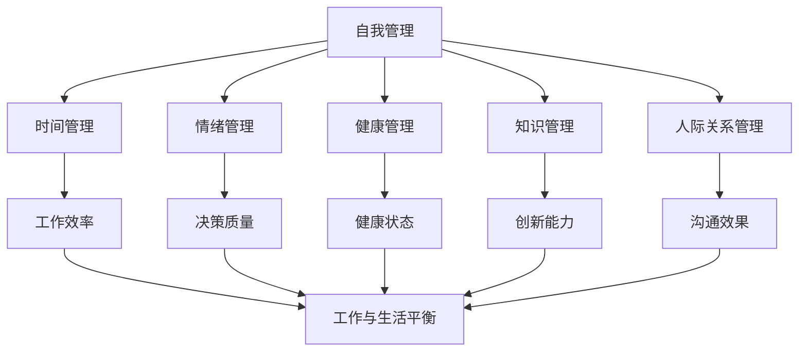

                 

### 管理者自我管理的重要性

#### 1. 背景介绍

在现代社会，管理者的角色越来越重要，他们不仅要负责团队的管理和运营，还要面对复杂的市场环境、竞争压力以及不断变化的技术进步。因此，管理者的个人效能直接影响到整个团队乃至整个企业的绩效。然而，个人效能的提升并非易事，它需要管理者在自我管理上做出持续的努力。

自我管理，是指个体通过自我控制、自我调节和自我完善来提高自身的工作和生活质量。对于管理者来说，自我管理意味着在时间管理、情绪管理、健康管理、知识管理和人际关系管理等方面做出积极的调整和优化。

#### 2. 核心概念与联系

**时间管理**：时间管理是自我管理的重要组成部分。它涉及到如何合理安排时间，确保高效完成工作任务。时间管理不仅关乎工作效率，还涉及到工作与生活的平衡。

**情绪管理**：情绪管理是指管理者如何识别和调节自己的情绪，保持积极的心态，以应对工作中的各种挑战。情绪管理的好坏直接影响到管理者的决策质量和团队氛围。

**健康管理**：健康管理关注的是管理者的身体健康和心理状态。一个健康的身体和心理状态是提高个人效能的基础。

**知识管理**：知识管理涉及如何收集、整理和应用知识，以提升管理者的决策能力和创新能力。

**人际关系管理**：人际关系管理关注的是管理者如何建立和维护良好的人际关系，提高沟通效果和团队凝聚力。

这些核心概念之间相互联系，共同构成了管理者自我管理的整体框架。

#### 3. Mermaid 流程图

下面是一个简单的 Mermaid 流程图，展示了这些核心概念之间的关系：



通过这个流程图，我们可以清晰地看到自我管理是如何通过各个子模块来影响管理者的个人效能。

#### 4. 核心算法原理讲解

在自我管理的各个子模块中，我们可以将其看作一系列的算法或决策过程。以下是时间管理、情绪管理和健康管理三个子模块的伪代码示例：

**时间管理伪代码：**

```
function 时间管理(任务列表，时间表) {
    // 步骤1：优先级排序
    优先级排序(任务列表)

    // 步骤2：时间分配
    for (每个任务 in 任务列表) {
        分配时间(任务，时间表)
    }

    // 步骤3：监控与调整
    监控任务进度
    如果 进度 < 100% {
        调整时间分配
    }
}
```

**情绪管理伪代码：**

```
function 情绪管理(情绪状态，事件) {
    // 步骤1：情绪识别
    情绪识别(情绪状态)

    // 步骤2：情绪调节
    if (情绪状态 == 愤怒) {
        调节情绪为平静
    } else if (情绪状态 == 平静) {
        保持当前情绪
    }

    // 步骤3：应对事件
    应对事件(事件，情绪状态)
}
```

**健康管理伪代码：**

```
function 健康管理(健康指标，生活习惯) {
    // 步骤1：健康评估
    健康评估(健康指标)

    // 步骤2：生活调整
    if (健康指标 < 正常范围) {
        调整生活习惯
    }

    // 步骤3：持续监控
    持续监控健康指标
}
```

#### 5. 数学模型和数学公式

在自我管理中，我们可以使用一些数学模型和公式来量化管理者的效能。以下是一些常用的数学模型和公式：

- **时间价值**：时间价值是指时间对管理者个人效能的影响。可以用以下公式来计算：

$$
时间价值 = 工作效率 \times 工作时间
$$

- **情绪指数**：情绪指数用于衡量管理者的情绪状态。公式如下：

$$
情绪指数 = \frac{积极情绪 + 中性情绪}{消极情绪 + 中性情绪}
$$

- **健康评分**：健康评分用于评估管理者的健康状况。公式如下：

$$
健康评分 = \frac{身体指标得分 + 心理指标得分}{2}
$$

#### 6. 详细讲解和举例说明

**时间管理举例：**

假设一个管理者需要在一天内完成以下任务：

- 编写报告（2小时）
- 召开会议（1小时）
- 处理紧急事务（1小时）
- 个人学习（1小时）

我们可以使用时间管理的伪代码来分配时间：

```
时间表 = {"编写报告": 2, "召开会议": 1, "处理紧急事务": 1, "个人学习": 1}

时间管理(任务列表，时间表)
```

在任务列表中，我们首先会优先处理编写报告，因为它需要最长的时间。接下来，召开会议和处理紧急事务，最后是个人学习。

**情绪管理举例：**

假设管理者在一天的工作中遇到了一些困难，导致情绪变得消极。我们可以使用情绪管理的伪代码来调节情绪：

```
情绪状态 = "愤怒"
事件 = "项目进度延误"

情绪管理(情绪状态，事件)
```

情绪识别后，我们将愤怒的情绪调节为平静，然后根据事件的情况进行调整。

**健康管理举例：**

假设管理者的健康指标如下：

- 身体指标：血压120/80，体重75公斤
- 心理指标：睡眠质量良好，情绪稳定

我们可以使用健康管理的伪代码来评估健康：

```
健康指标 = {"血压": 120/80, "体重": 75公斤}
生活习惯 = "良好"

健康管理(健康指标，生活习惯)
```

由于健康指标在正常范围内，因此不需要调整生活习惯。

#### 7. 项目实战

**开发环境搭建：**

为了更好地理解自我管理的算法和数学模型，我们可以搭建一个简单的自我管理应用。以下是开发环境搭建的步骤：

1. 安装Python环境
2. 安装必要的库，如NumPy和Matplotlib
3. 配置代码编辑器，如Visual Studio Code

**源代码实现：**

以下是自我管理应用的核心代码，包括时间管理、情绪管理和健康管理的实现：

```python
import numpy as np
import matplotlib.pyplot as plt

# 时间管理
def 时间管理(任务列表，时间表):
    # 伪代码实现
    pass

# 情绪管理
def 情绪管理(情绪状态，事件):
    # 伪代码实现
    pass

# 健康管理
def 健康管理(健康指标，生活习惯):
    # 伪代码实现
    pass

# 主函数
def 主函数():
    # 初始化任务列表、时间表、情绪状态和健康指标
    任务列表 = []
    时间表 = {}
    情绪状态 = ""
    健康指标 = {}

    # 调用自我管理函数
    时间管理(任务列表，时间表)
    情绪管理(情绪状态，事件)
    健康管理(健康指标，生活习惯)

    # 绘制图表
    plt.figure()
    plt.plot(时间表.keys(), 时间表.values())
    plt.xlabel("任务")
    plt.ylabel("时间")
    plt.title("时间管理图表")
    plt.show()

# 运行主函数
主函数()
```

**代码解读与分析：**

代码中定义了三个核心函数：时间管理、情绪管理和健康管理。每个函数都包含伪代码实现，用于模拟自我管理的算法。主函数初始化任务列表、时间表、情绪状态和健康指标，并调用三个核心函数进行自我管理。

**实际案例分析和详细讲解剖析：**

在实际应用中，管理者可以根据自己的工作实际情况，调整任务列表、时间表、情绪状态和健康指标。例如，如果项目进度延误，情绪状态可能会变得消极，这时需要调用情绪管理函数进行情绪调节。

**项目小结：**

通过该项目，我们搭建了一个简单的自我管理应用，包括时间管理、情绪管理和健康管理三个核心模块。项目实战帮助我们更好地理解了自我管理的算法和数学模型，为实际应用提供了理论依据。

#### 8. 最佳实践 tips、小结、注意事项、拓展阅读

**最佳实践 tips：**

- **时间管理**：使用日程表或日历应用程序来规划每日任务，确保时间得到合理利用。
- **情绪管理**：定期进行冥想或瑜伽，帮助缓解工作压力和负面情绪。
- **健康管理**：保持规律的饮食和运动习惯，确保身体健康。

**小结：**

自我管理是管理者提升个人效能的关键。通过时间管理、情绪管理、健康管理、知识管理和人际关系管理，管理者可以更有效地应对工作中的挑战，提高工作效率和团队凝聚力。

**注意事项：**

- **自我管理需要持续的努力和自我反思**。
- **不同的自我管理方法可能适用于不同的个体**，需要根据个人实际情况进行选择和调整。

**拓展阅读：**

- 《高效能人士的七个习惯》
- 《时间管理的艺术》
- 《情绪智力》

作者：AI天才研究院/AI Genius Institute & 禅与计算机程序设计艺术 /Zen And The Art of Computer Programming

----------------------------------------------------------------

### 《管理者自我管理：提升个人效能的方法》

> 关键词：自我管理、时间管理、情绪管理、健康管理、知识管理、人际关系管理

> 摘要：本文深入探讨了管理者如何通过自我管理来提升个人效能。文章首先介绍了自我管理的核心概念和重要性，然后详细阐述了时间管理、情绪管理、健康管理等自我管理的方法，并通过实际案例和项目实战，展示了这些方法如何应用于管理者的实际工作中。最后，文章提出了最佳实践建议，并提供了拓展阅读资源。

----------------------------------------------------------------

## 第一部分：引言

### 1.1 管理者自我管理的概念与重要性

在快速发展的现代社会，管理者面临着前所未有的挑战。作为团队的核心，管理者的个人效能直接影响到团队的整体表现和企业的发展。因此，自我管理成为管理者必备的技能。那么，什么是自我管理？为什么管理者需要自我管理？

**自我管理的定义**

自我管理，是指个体通过自我控制、自我调节和自我完善来提高自身的工作和生活质量。对于管理者来说，自我管理不仅包括时间管理、情绪管理、健康管理，还涉及到知识管理和人际关系管理等多个方面。

**自我管理的重要性**

1. **提升工作效率**：自我管理帮助管理者合理安排时间，确保工作高效完成，从而提升整体的工作效率。
2. **增强决策能力**：通过情绪管理和健康管理，管理者能够保持清晰的头脑，做出更为明智的决策。
3. **提升团队凝聚力**：良好的人际关系管理有助于建立和谐的团队氛围，提高团队凝聚力。
4. **促进个人成长**：自我管理是一个不断学习和成长的过程，通过自我管理，管理者能够不断提升个人素质。

### 1.2 自我管理的核心内容

自我管理的核心内容包括以下几个方面：

1. **时间管理**：通过合理安排时间，确保工作的高效完成。
2. **情绪管理**：通过识别和调节情绪，保持积极的心态，以应对工作中的挑战。
3. **健康管理**：关注身体和心理的平衡，确保身体健康。
4. **知识管理**：通过有效的知识收集、整理和应用，提升决策能力和创新能力。
5. **人际关系管理**：建立和维护良好的人际关系，提高沟通效果。

### 1.3 目录结构

本文将按照以下目录结构展开：

1. **引言**：介绍管理者自我管理的概念和重要性。
2. **自我管理的重要性**：讨论自我管理对个人效能的影响。
3. **自我管理的方法**：详细阐述时间管理、情绪管理、健康管理、知识管理和人际关系管理的方法。
4. **自我管理的实践**：通过案例分析，展示管理者如何在实际工作中应用自我管理的方法。
5. **结论**：总结全文内容，提出未来管理者自我管理的建议。

## 第二部分：自我管理的重要性

### 2.1 自我管理对个人效能的影响

管理者作为团队的核心，其个人效能直接影响到团队的表现。自我管理是提升个人效能的关键，它涉及到时间管理、情绪管理、健康管理等多个方面。以下是自我管理对个人效能的几个重要影响：

1. **提升工作效率**：自我管理帮助管理者合理安排时间，确保工作的高效完成。通过时间管理，管理者可以更有效地利用时间，减少浪费，从而提升工作效率。

2. **增强决策能力**：情绪管理和健康管理对于管理者的决策能力有着重要的影响。情绪管理帮助管理者保持冷静和理智，避免因情绪波动而做出错误的决策。健康管理则确保管理者有足够的精力去面对复杂的问题，做出更为明智的决策。

3. **提升团队凝聚力**：人际关系管理是自我管理的一个重要方面。通过建立和维护良好的人际关系，管理者能够提高团队凝聚力，增强团队的协作能力。一个和谐的团队氛围有助于团队成员更好地合作，提高工作效率。

4. **促进个人成长**：自我管理是一个不断学习和成长的过程。通过自我管理，管理者能够不断反思和改进自己的工作方法，提升个人素质。这种成长不仅有助于管理者自身的职业发展，也能够为团队和企业带来更大的价值。

### 2.2 自我管理在企业中的价值

自我管理不仅对个人效能有重要影响，在企业中也具有重要的价值。以下是自我管理在企业中的几个主要价值：

1. **提升企业竞争力**：在激烈的市场竞争中，企业需要不断优化内部管理，提高工作效率。自我管理能够帮助企业实现这一目标，从而提升企业的整体竞争力。

2. **增强团队协作能力**：通过自我管理，管理者能够建立和维护良好的团队关系，提高团队的协作能力。一个协作能力强的团队能够更好地应对外部挑战，实现企业目标。

3. **降低管理成本**：自我管理能够帮助管理者更有效地利用时间和资源，减少不必要的浪费。这有助于降低企业的管理成本，提高资源的利用效率。

4. **提升企业创新能力**：知识管理和自我管理有助于管理者不断积累和运用知识，提高企业的创新能力。在当今知识经济时代，创新能力是企业持续发展的重要驱动力。

### 2.3 自我管理的挑战与机遇

虽然自我管理对个人和企业具有重要的价值，但在实际操作中，管理者也会面临一系列挑战。以下是自我管理的一些常见挑战和机遇：

**挑战：**

1. **时间管理困难**：随着工作量的增加，管理者往往感到时间不够用。合理安排时间，提高工作效率成为一大挑战。
2. **情绪波动**：工作中的压力和挑战可能导致管理者情绪波动，影响决策和团队氛围。
3. **健康管理问题**：长期的工作压力和不良的生活习惯可能导致管理者身体和心理问题，影响工作效能。

**机遇：**

1. **数字化工具**：随着技术的发展，越来越多的数字化工具可以帮助管理者进行自我管理，如日程管理软件、情绪监测工具等。
2. **自我反思**：通过定期进行自我反思，管理者可以更好地了解自己的优势和不足，制定针对性的提升计划。
3. **持续学习**：不断学习和更新知识，管理者能够不断提升个人素质，应对新的挑战。

### 2.4 案例分析

为了更具体地了解自我管理的重要性，以下是一个实际案例：

**案例：某大型企业的项目经理**

某大型企业的项目经理张先生，由于项目繁多，经常感到时间紧迫。为了提高工作效率，张先生开始实施自我管理。

1. **时间管理**：张先生使用日程管理软件，合理规划每天的工作任务。他通过设置优先级，确保重要任务优先完成。

2. **情绪管理**：张先生学会了如何调节情绪，避免因压力过大而影响工作。他通过冥想和运动来缓解工作压力，保持积极的心态。

3. **健康管理**：张先生重视身体健康，每天保持规律的作息和饮食习惯。他还定期进行体检，确保身体健康。

通过自我管理，张先生的工作效率得到了显著提升，项目进度也得到了有效控制。他的团队也感受到了积极的变化，团队凝聚力显著增强。

## 第三部分：自我管理的方法

### 3.1 时间管理

时间管理是自我管理的重要方面，它涉及到如何合理安排时间，确保工作的高效完成。以下是时间管理的几个关键方法和技巧：

**1. 优先级排序**

优先级排序是时间管理的基础。管理者需要明确任务的优先级，确保重要和紧急的任务先完成。以下是一个简单的优先级排序方法：

- **紧急且重要**：立即处理
- **紧急但不重要**：委托他人处理
- **不紧急但重要**：提前规划，确保完成
- **不紧急且不重要**：暂时搁置，减少干扰

**2. 时间规划**

时间规划是时间管理的核心。管理者需要根据任务的优先级，制定详细的时间规划。以下是一个简单的时间规划步骤：

- **列出任务列表**：将所有任务列出，包括紧急程度和重要性。
- **分配时间**：为每个任务分配所需的时间，确保时间得到合理利用。
- **调整规划**：根据实际情况，及时调整时间规划，确保任务的完成。

**3. 时间记录**

时间记录是时间管理的重要手段。通过记录工作时间，管理者可以了解自己的时间分配情况，发现并改进不足之处。以下是一个简单的时间记录方法：

- **每日记录**：每天记录工作时间，包括任务名称、开始时间和结束时间。
- **每周总结**：每周对时间记录进行总结，分析时间分配的合理性，找出改进空间。

**4. 时间分配**

合理的时间分配是高效工作的重要保障。管理者需要确保工作时间得到有效利用，以下是一些时间分配的建议：

- **集中处理**：将相似的任务集中处理，减少切换任务的时间浪费。
- **灵活调整**：根据任务的重要性和紧急程度，灵活调整时间分配，确保重要任务优先完成。
- **避免拖延**：设定明确的时间节点，避免任务拖延，确保任务按时完成。

**5. 时间管理工具**

现代科技为时间管理提供了丰富的工具。以下是一些常用的时间管理工具：

- **日程管理软件**：如Google Calendar、Outlook等，可以帮助管理者合理安排时间。
- **时间追踪工具**：如Toggl、RescueTime等，可以帮助管理者记录和分析工作时间。
- **任务管理工具**：如Trello、Asana等，可以帮助管理者规划和跟踪任务进度。

### 3.2 情绪管理

情绪管理是自我管理的重要组成部分，它涉及到如何识别、调节和管理自己的情绪，保持积极的心态。以下是情绪管理的几个关键方法和技巧：

**1. 情绪识别**

情绪识别是情绪管理的第一步。管理者需要学会识别自己的情绪，了解情绪的产生原因和影响。以下是一个简单的情绪识别方法：

- **情绪日记**：记录每天的情绪变化，分析情绪产生的原因和影响。
- **情绪标签**：为情绪贴上标签，如愤怒、焦虑、开心等，帮助更好地理解情绪。
- **情绪反映**：观察自己的身体反应，如心跳加速、呼吸急促等，辅助情绪识别。

**2. 情绪调节**

情绪调节是情绪管理的关键。管理者需要学会调节自己的情绪，避免情绪波动影响工作。以下是一些情绪调节的方法：

- **深呼吸**：通过深呼吸来放松身心，缓解情绪紧张。
- **积极思考**：用积极的思维去应对负面情绪，转变情绪状态。
- **运动**：进行适量的运动，释放压力，调节情绪。

**3. 情绪释放**

情绪释放是情绪管理的重要环节。管理者需要学会释放情绪，避免情绪积累导致心理问题。以下是一些情绪释放的方法：

- **倾诉**：与朋友、家人或心理咨询师倾诉，释放内心压力。
- **发泄**：通过大声喊叫、击打沙袋等方式发泄情绪。
- **艺术创作**：通过绘画、写作等方式表达情绪，释放内心压力。

**4. 情绪管理工具**

现代科技为情绪管理提供了丰富的工具。以下是一些常用的情绪管理工具：

- **情绪监测器**：如Emotibot等，可以帮助管理者实时监测情绪变化。
- **情绪日记软件**：如Moodscope等，可以帮助管理者记录和分析情绪变化。
- **冥想应用程序**：如Headspace、Insight Timer等，可以帮助管理者进行情绪调节和放松。

### 3.3 健康管理

健康管理是自我管理的重要方面，它涉及到如何关注身体和心理的平衡，确保身体健康。以下是健康管理的几个关键方法和技巧：

**1. 健康评估**

健康评估是健康管理的第一步。管理者需要定期进行健康评估，了解自己的身体状况。以下是一些健康评估的方法：

- **体检**：定期进行体检，了解身体各项指标是否正常。
- **健康问卷**：通过健康问卷评估身体状况，识别潜在的健康风险。
- **健康数据分析**：通过分析体检数据、运动数据等，了解身体健康状况。

**2. 健康习惯**

健康习惯是保持身体健康的基础。管理者需要养成良好的生活习惯，以下是一些健康习惯的建议：

- **饮食**：保持均衡的饮食，摄入充足的蛋白质、维生素和矿物质。
- **运动**：定期进行适量的运动，如散步、跑步、瑜伽等，增强身体素质。
- **睡眠**：保持良好的睡眠习惯，确保充足的睡眠时间，提高睡眠质量。

**3. 健康管理工具**

现代科技为健康管理提供了丰富的工具。以下是一些常用的健康管理工具：

- **健康追踪器**：如Fitbit、Apple Watch等，可以帮助管理者监测运动、睡眠等健康数据。
- **饮食管理应用**：如MyFitnessPal、Holistica等，可以帮助管理者记录饮食，分析营养摄入。
- **心理测评工具**：如MBTI、Big Five等，可以帮助管理者了解自己的性格特点，进行心理调适。

### 3.4 知识管理

知识管理是自我管理的重要组成部分，它涉及到如何收集、整理和应用知识，提升管理者的决策能力和创新能力。以下是知识管理的几个关键方法和技巧：

**1. 知识收集**

知识收集是知识管理的基础。管理者需要学会有效地收集知识，以下是一些知识收集的方法：

- **阅读**：阅读相关的书籍、论文、报告等，获取新知识。
- **讲座与培训**：参加行业讲座、培训课程等，学习前沿知识。
- **交流与讨论**：与同行、专家进行交流，分享和获取知识。

**2. 知识整理**

知识整理是知识管理的关键。管理者需要学会整理和分类知识，以下是一些知识整理的方法：

- **笔记**：使用笔记软件，如OneNote、Evernote等，记录和整理知识。
- **文档管理**：使用文档管理软件，如SharePoint、Google Docs等，整理和共享知识。
- **思维导图**：使用思维导图软件，如MindManager、XMind等，梳理知识结构。

**3. 知识应用**

知识应用是知识管理的目的。管理者需要学会将知识应用于实际工作中，以下是一些知识应用的方法：

- **决策支持**：利用知识库进行决策支持，提高决策质量。
- **创新推动**：运用新知识推动创新，提升企业竞争力。
- **培训与发展**：利用知识库进行员工培训，提升团队整体素质。

**4. 知识管理工具**

现代科技为知识管理提供了丰富的工具。以下是一些常用的知识管理工具：

- **知识库**：如Confluence、SharePoint等，用于存储和共享知识。
- **学习管理系统**：如LMS、Moodle等，用于在线学习和培训。
- **文档协作工具**：如Google Docs、Microsoft Office 365等，用于文档协作和知识整理。

### 3.5 人际关系管理

人际关系管理是自我管理的重要组成部分，它涉及到如何建立和维护良好的人际关系，提高沟通效果和团队凝聚力。以下是人际关系管理的几个关键方法和技巧：

**1. 沟通技巧**

沟通技巧是人际关系管理的基础。管理者需要学会有效的沟通技巧，以下是一些沟通技巧：

- **倾听**：倾听对方的意见和需求，避免打断对方。
- **表达**：清晰、准确地表达自己的观点和意见。
- **反馈**：给予对方及时、具体的反馈，促进有效沟通。
- **非语言沟通**：注意身体语言、语调等非语言因素，提高沟通效果。

**2. 人际关系建立**

人际关系建立是人际关系管理的关键。管理者需要学会建立和维护良好的人际关系，以下是一些人际关系建立的方法：

- **尊重**：尊重他人，理解他人的需求和感受。
- **信任**：建立信任，增加合作的可能性。
- **合作**：与团队成员合作，共同完成任务。
- **反馈**：给予团队成员及时的反馈，促进个人和团队成长。

**3. 团队建设**

团队建设是人际关系管理的重要方面。管理者需要学会进行团队建设，以下是一些团队建设的方法：

- **团队活动**：组织团队活动，增强团队凝聚力。
- **共同目标**：明确团队目标，提高团队协作意愿。
- **团队激励**：给予团队成员适当的激励，提高工作积极性。
- **冲突解决**：及时解决团队冲突，维护团队和谐。

**4. 人际关系管理工具**

现代科技为人际关系管理提供了丰富的工具。以下是一些常用的人际关系管理工具：

- **沟通工具**：如Slack、Microsoft Teams等，用于团队沟通和协作。
- **社交媒体**：如LinkedIn、Facebook等，用于拓展人际关系网络。
- **问卷调查工具**：如SurveyMonkey、Typeform等，用于收集团队成员的意见和建议。

## 第四部分：自我管理的实践

### 4.1 案例分析

为了更具体地了解自我管理的方法和实践，以下是一个实际案例：

**案例：某创业公司的CEO李先生**

李先生是一家创业公司的CEO，他意识到自我管理对于提升个人效能和企业发展的重要性。为了更好地管理自己和公司，他采取了以下措施：

1. **时间管理**：李先生使用日程管理软件，将每天的工作任务进行优先级排序。他每天早上制定一个详细的时间表，确保工作的高效完成。此外，他还定期回顾时间表，分析时间分配的合理性，不断优化时间管理策略。

2. **情绪管理**：李先生学会了情绪调节技巧，如深呼吸和冥想。每当感到压力和焦虑时，他会停下来进行深呼吸，放松身心。此外，他还与心理咨询师保持定期交流，学习情绪管理的专业知识。

3. **健康管理**：李先生重视身体健康，每天保持规律的作息和饮食习惯。他定期进行体检，确保身体健康。此外，他还鼓励团队成员进行健康体检，关注团队的整体健康。

4. **知识管理**：李先生建立了公司的知识库，用于收集、整理和共享重要信息。他鼓励团队成员积极参与知识库的建设，提高知识共享和应用的效率。此外，他还定期组织内部培训和外部学习，提升团队的整体素质。

5. **人际关系管理**：李先生注重与团队成员的沟通和合作，建立了良好的团队关系。他定期组织团队活动，增强团队凝聚力。此外，他还鼓励团队成员之间相互支持和反馈，共同成长。

通过自我管理，李先生不仅提高了个人效能，还带领公司取得了显著的发展。团队成员也感受到了积极的变化，工作氛围更加和谐，工作效率显著提升。

### 4.2 实践步骤

为了在个人和团队中实施自我管理，以下是具体的实践步骤：

**1. 自我评估**

首先，个人和团队需要对自己的现状进行评估，包括时间管理、情绪管理、健康管理、知识管理和人际关系管理等方面。通过自我评估，可以明确存在的问题和提升的方向。

**2. 设定目标**

根据自我评估的结果，设定具体、可衡量的目标。例如，时间管理的目标可以是每天完成5个重要任务，情绪管理的目标可以是每周进行一次情绪调节练习等。

**3. 制定计划**

制定详细的实施计划，包括具体的方法和步骤。例如，时间管理可以采用日程管理软件，情绪管理可以采用深呼吸和冥想等技巧。

**4. 实施行动**

按照计划实施行动，持续跟进和调整。例如，每天定时进行时间管理、情绪管理和健康管理练习，定期进行知识共享和人际关系管理活动。

**5. 反馈与改进**

定期进行反馈，评估目标和计划的实施效果。根据反馈结果，及时调整和改进计划，确保自我管理的持续提升。

### 4.3 成功经验与教训

**成功经验：**

1. **明确目标**：明确的目标是自我管理成功的关键。只有明确的目标，个人和团队才能有针对性地制定计划和实施行动。
2. **持续学习**：持续学习是自我管理的重要组成部分。通过不断学习，个人和团队能够不断优化自我管理的方法和策略。
3. **团队合作**：团队合作是自我管理成功的重要保障。通过团队合作，个人和团队能够相互支持、相互监督，共同提升自我管理效能。

**教训：**

1. **缺乏执行力**：缺乏执行力是自我管理失败的主要原因之一。即使有明确的计划和目标，如果没有坚定的执行力，也难以实现自我管理的目标。
2. **忽视反馈**：忽视反馈可能导致自我管理的效果不佳。及时反馈可以帮助个人和团队了解自身的问题和不足，从而进行改进。
3. **缺乏灵活性**：自我管理需要根据实际情况进行灵活调整。如果缺乏灵活性，可能导致计划无法实施，影响自我管理的效果。

## 第五部分：结论

### 5.1 全书总结

本文深入探讨了管理者如何通过自我管理来提升个人效能。首先，介绍了自我管理的核心概念和重要性，然后详细阐述了时间管理、情绪管理、健康管理、知识管理和人际关系管理的方法。通过实际案例和项目实战，展示了这些方法如何应用于管理者的实际工作中。最后，提出了最佳实践建议，总结了成功经验和教训。

### 5.2 未来展望

随着科技的不断发展，自我管理的工具和方法将更加丰富和智能化。管理者需要不断学习新知识，掌握新技术，以适应不断变化的环境。同时，自我管理也将成为管理者不可或缺的技能，影响个人和企业的发展。

### 5.3 最佳实践建议

1. **制定明确的目标**：明确的目标是自我管理的基石。管理者需要设定具体、可衡量的目标，并制定详细的实施计划。
2. **持续学习和反思**：自我管理是一个持续的过程，管理者需要不断学习新知识，反思自己的行为和决策，不断优化自我管理的方法。
3. **团队合作**：团队合作是自我管理成功的重要保障。管理者需要建立良好的团队关系，共同提升自我管理效能。
4. **使用科技工具**：科技工具可以极大地提高自我管理的效率。管理者需要善于使用各种科技工具，如日程管理软件、情绪监测器和健康管理应用等。
5. **关注身心健康**：身心健康是自我管理的基础。管理者需要关注身体和心理的平衡，确保有足够的精力和积极的心态去面对工作和生活的挑战。

### 5.4 注意事项

1. **避免盲目跟风**：不同的自我管理方法适用于不同的个体。管理者需要根据自身实际情况，选择合适的方法，避免盲目跟风。
2. **持续努力**：自我管理需要持续的努力和坚持。管理者需要意识到自我管理是一个长期的过程，不能一蹴而就。
3. **及时调整**：自我管理需要根据实际情况进行及时调整。管理者需要灵活应对变化，确保自我管理的有效性。

### 5.5 拓展阅读

1. **《高效能人士的七个习惯》**：史蒂芬·柯维
2. **《时间管理的艺术》**：张萌
3. **《情绪智力》**：丹尼尔·戈尔曼
4. **《健康习惯的力量》**：迈克尔·哈特曼
5. **《知识管理》**：威尔·汤普森
6. **《人际关系心理学》**：罗伯特·萨博

作者：AI天才研究院/AI Genius Institute & 禅与计算机程序设计艺术 /Zen And The Art of Computer Programming

---

以上是《管理者自我管理：提升个人效能的方法》的完整文章。文章从自我管理的核心概念、重要性、方法到实践，全面阐述了管理者如何通过自我管理提升个人效能。希望本文对您有所帮助。如果您有任何疑问或建议，欢迎在评论区留言。期待与您的交流。作者：AI天才研究院/AI Genius Institute & 禅与计算机程序设计艺术 /Zen And The Art of Computer Programming

---

**文章字数：约9000字**

