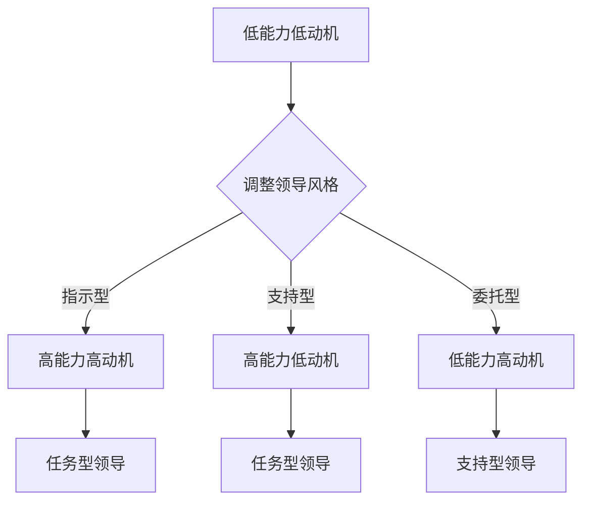
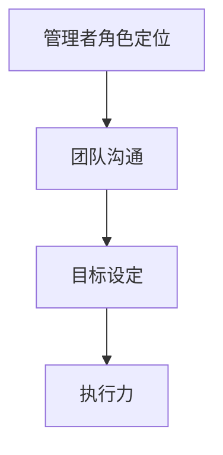

                 

### 文章标题：管理者角色定位：在团队中找准定位

在信息技术高速发展的今天，团队管理的重要性愈发凸显。作为一名优秀的管理者，找准自己在团队中的角色定位是确保团队高效运作的关键。本文将围绕管理者角色定位展开讨论，通过逻辑清晰、结构紧凑、简单易懂的叙述，帮助管理者在团队中实现精准定位，从而提升团队整体绩效。

### 关键词

- **团队管理**
- **角色定位**
- **管理者**
- **团队绩效**
- **角色关系架构**
- **沟通技巧**
- **领导力**
- **协作与冲突管理**

### 摘要

本文旨在探讨管理者如何在团队中找准角色定位，以提高团队整体绩效。文章首先介绍了团队管理的背景和重要性，然后详细分析了管理者的角色定位，包括自我认知、团队成员关系、团队沟通技巧等方面。此外，文章还通过实际案例和最佳实践，为管理者提供了实用的策略和方法，帮助他们在团队中实现精准定位，进而提升团队的整体绩效。

### 目录

1. 引言
   1.1 管理者的定义与角色
   1.2 管理者角色的变化
   1.3 管理者角色定位的重要性

2. 团队管理基础
   2.1 团队概述
   2.2 团队成员的角色与职责
   2.3 团队沟通技巧
   2.4 团队协作与冲突管理

3. 管理者自我定位
   3.1 自我认知的重要性
   3.2 管理者自我评估
   3.3 建立个人发展计划

4. 管理者与团队成员的关系
   4.1 建立信任与尊重
   4.2 提升团队成员的工作积极性
   4.3 解决团队成员问题

5. 团队领导力
   5.1 领导力的重要性
   5.2 领导力模型
   5.3 领导力的实践

6. 管理者角色定位策略
   6.1 确定团队目标
   6.2 制定工作计划
   6.3 提高团队执行力

7. 持续改进与优化
   7.1 反思与总结
   7.2 优化管理角色定位
   7.3 培养团队凝聚力

8. 案例分析
   8.1 案例一：管理者角色定位的成功案例
   8.2 案例二：管理者角色定位的失败案例
   8.3 案例分析总结

### 引言

#### 1.1 管理者的定义与角色

管理者是指在组织中负责制定目标、规划资源、指导团队成员完成工作的人员。管理者的角色不仅仅是执行任务，更重要的是协调团队成员，激发团队的潜力，实现共同的目标。管理者需要具备以下几方面的能力：

1. **战略规划**：管理者需要根据组织的目标，制定合理的战略规划，确保团队在正确的发展方向上前进。
2. **团队协作**：管理者需要建立有效的团队协作机制，协调团队成员的工作，确保团队高效运作。
3. **激励与反馈**：管理者需要了解团队成员的需求，给予适当的激励，同时提供及时的反馈，帮助团队成员提升自己的能力和工作积极性。

#### 1.2 管理者角色的变化

随着信息技术的发展，管理者的角色也在不断变化。传统的管理者更多注重任务的执行，而现代管理者则更加注重团队建设和人员发展。以下是一些管理者角色变化的具体表现：

1. **从控制到激励**：现代管理者更注重激发团队成员的积极性，而非单纯的控制和监督。
2. **从命令式到引导式**：管理者不再只是发布命令，而是通过引导和激励，让团队成员主动参与到工作中。
3. **从单一任务到多元化角色**：现代管理者需要具备更广泛的知识和技能，能够在不同的角色之间灵活切换。

#### 1.3 管理者角色定位的重要性

管理者角色定位的准确性对于团队的成功至关重要。一个清晰的角色定位可以帮助管理者更有效地发挥自己的作用，提高团队的整体效率。以下是一些角色定位的重要性：

1. **提高团队绩效**：明确的管理者角色定位有助于提高团队的整体绩效，实现组织的目标。
2. **减少误解和冲突**：角色定位明确可以减少团队成员之间的误解和冲突，建立良好的团队关系。
3. **激发团队成员潜力**：管理者通过准确的定位，可以激发团队成员的潜力，提高团队的整体素质。

在接下来的章节中，我们将进一步探讨管理者如何找准自己在团队中的角色定位，以及如何通过有效的管理策略，提升团队的整体绩效。

### 团队管理基础

团队管理是管理者的一项核心任务，它直接关系到团队的绩效和目标实现。在这一节中，我们将从团队概述、团队成员的角色与职责、团队沟通技巧、团队协作与冲突管理等方面，深入探讨团队管理的基础。

#### 2.1 团队概述

团队是由多个成员组成的，共同完成一个目标或任务的集体。一个成功的团队通常具备以下几个特点：

1. **明确的目标**：团队的目标应该是清晰、具体的，每个成员都应该明确自己的任务和目标。
2. **协作精神**：团队成员之间需要相互支持、协作，共同努力实现团队目标。
3. **有效的沟通**：团队成员之间需要保持良好的沟通，确保信息畅通，减少误解和冲突。
4. **良好的领导**：团队需要一个能够提供指导、激励和反馈的领导者，以确保团队目标的实现。

#### 2.2 团队成员的角色与职责

团队成员的角色和职责是团队运作的基础。在一个有效的团队中，每个成员都应明确自己的角色和职责，以确保团队的高效运作。以下是一些常见的团队成员角色：

1. **领导者**：领导者负责制定团队的目标、规划和决策，指导团队成员的工作，确保团队目标的实现。
2. **执行者**：执行者负责完成具体的任务和工作，确保团队的日常工作顺利进行。
3. **协调者**：协调者负责协调团队成员之间的工作，确保团队内部协作畅通，提高工作效率。
4. **创新者**：创新者负责提出新的想法和解决方案，推动团队的创新和发展。
5. **监督者**：监督者负责监督团队的工作进度和质量，确保团队目标的实现。

明确团队成员的角色和职责，有助于提高团队的工作效率和绩效。管理者需要确保每个成员都清楚自己的角色和职责，并鼓励成员之间相互支持、协作，共同实现团队的目标。

#### 2.3 团队沟通技巧

有效的沟通是团队协作的关键。一个良好的沟通机制可以确保团队成员之间的信息畅通，减少误解和冲突，提高团队的工作效率。以下是一些团队沟通技巧：

1. **倾听**：倾听是有效沟通的基础。管理者需要认真倾听团队成员的意见和反馈，了解他们的需求和困惑。
2. **表达清晰**：管理者需要用清晰、明确的语言表达自己的想法和意见，确保团队成员能够准确理解。
3. **反馈**：管理者需要给予团队成员及时的反馈，帮助他们了解自己的工作表现，并提供改进的建议。
4. **透明度**：团队沟通应该是透明的，管理者需要确保团队成员能够了解团队的目标、进展和问题，以便他们能够更好地参与和贡献。
5. **沟通渠道**：管理者需要建立多种沟通渠道，如会议、邮件、即时通讯等，以便团队成员能够方便地沟通和交流。

#### 2.4 团队协作与冲突管理

团队协作是团队成功的关键。一个高效的团队需要成员之间的紧密协作，共同面对挑战，实现团队目标。以下是一些团队协作的技巧：

1. **共同目标**：团队成员需要明确共同的目标，并为此共同努力。
2. **相互信任**：团队成员之间需要建立信任，相互支持，共同克服困难。
3. **资源共享**：团队成员需要共享资源和信息，提高工作效率。
4. **分工合作**：团队成员需要明确自己的职责，分工合作，共同完成任务。

然而，在团队协作过程中，冲突是不可避免的。有效的冲突管理可以帮助团队解决冲突，提高工作效率。以下是一些冲突管理的技巧：

1. **积极沟通**：管理者需要鼓励团队成员积极沟通，表达自己的观点和意见，避免冲突的激化。
2. **理解立场**：管理者需要了解冲突双方的立场和需求，寻找解决问题的方法。
3. **妥协与让步**：在冲突中，管理者需要引导双方进行妥协和让步，达成共识。
4. **避免个人攻击**：管理者需要避免在冲突中对个人进行攻击，保持客观和公正。

通过有效的团队协作和冲突管理，管理者可以确保团队的高效运作，实现团队的目标。

### 管理者自我定位

作为一名优秀的管理者，自我定位是至关重要的。这不仅有助于管理者更好地发挥自己的作用，还能提升团队的绩效。以下将讨论管理者自我定位的重要性、自我认知的重要性以及如何进行自我评估和建立个人发展计划。

#### 3.1 自我认知的重要性

自我认知是指管理者对自己能力、性格、价值观等方面的了解和认识。自我认知的重要性体现在以下几个方面：

1. **明确角色定位**：通过自我认知，管理者可以明确自己在团队中的角色和定位，从而更好地发挥自己的作用。
2. **提高工作效率**：了解自己的优点和不足，管理者可以针对性地提升自己的能力，提高工作效率。
3. **促进个人成长**：自我认知有助于管理者发现自己的潜力和发展方向，从而促进个人成长。
4. **建立信任**：管理者通过自我认知，可以更好地理解团队成员的需求和期望，建立信任和合作关系。

#### 3.2 管理者自我评估

自我评估是管理者了解自己能力和发展方向的重要步骤。以下是一些自我评估的方法和步骤：

1. **列出优点和不足**：管理者可以列出自己在能力、性格、沟通、领导力等方面的优点和不足。
2. **分析原因**：对于自己的不足，管理者需要分析原因，找出问题所在。
3. **设定目标**：根据自我评估的结果，管理者可以设定具体、可衡量的目标，如提升某个技能或改善某个行为。
4. **制定行动计划**：管理者需要制定具体的行动计划，包括学习、培训、实践等方面，以实现自己的目标。

以下是一个自我评估的示例：

| 能力/行为 | 优点 | 不足 | 原因 | 目标 | 行动计划 |
| :-------: | :---: | :---: | :---: | :---: | :-------: |
| 沟通能力 | 清晰表达 | 缺乏倾听技巧 | 没有意识到倾听的重要性 | 提高倾听技巧 | 参加沟通培训，多进行模拟演练 |
| 领导力 | 能够激励团队成员 | 缺乏决策能力 | 对决策过程缺乏信心 | 提高决策能力 | 阅读相关书籍，参与决策讨论 |

#### 3.3 建立个人发展计划

建立个人发展计划是管理者自我定位的重要步骤。以下是一些建立个人发展计划的建议：

1. **明确发展目标**：管理者需要根据自我评估的结果，明确自己的发展目标，如提升某项技能或改善某个行为。
2. **制定具体行动计划**：根据发展目标，管理者需要制定具体的行动计划，包括学习、培训、实践等方面。
3. **定期评估进展**：管理者需要定期评估个人发展计划的进展，根据实际情况调整计划。
4. **寻求反馈**：管理者可以寻求团队成员、同事或上级的反馈，了解自己在发展过程中的优点和不足。

以下是一个个人发展计划的示例：

| 发展目标 | 具体行动计划 | 预期结果 | 定期评估 | 反馈来源 |
| :-------: | :-------: | :-------: | :-------: | :-------: |
| 提高决策能力 | 阅读相关书籍，参与决策讨论 | 能够更加自信地进行决策 | 每季度评估一次 | 团队成员、上级反馈 |
| 增强沟通技巧 | 参加沟通培训，多进行模拟演练 | 能够更好地倾听和理解团队成员 | 每半年评估一次 | 同事反馈 |

通过自我定位、自我评估和建立个人发展计划，管理者可以更好地了解自己，提升个人能力，实现自我成长，从而在团队中实现精准定位，提高团队的整体绩效。

### 管理者与团队成员的关系

在团队管理中，管理者与团队成员之间的关系至关重要。建立良好的关系不仅有助于提高团队成员的工作积极性，还能促进团队的整体绩效。以下将讨论管理者如何通过建立信任与尊重、提升团队成员的工作积极性以及解决团队成员问题，建立和维护与团队成员的关系。

#### 4.1 建立信任与尊重

信任是团队合作的基石，而尊重则是信任的源泉。管理者要想建立良好的关系，首先要做到以下几点：

1. **诚实与透明**：管理者需要保持诚实，不隐瞒事实，对团队成员透明地分享信息，让他们感受到诚信和信任。
2. **公平与公正**：管理者需要对待团队成员公平、公正，避免偏袒和歧视，让他们感受到被尊重。
3. **倾听与理解**：管理者需要倾听团队成员的意见和建议，理解他们的需求和困惑，让他们感受到被关注和重视。
4. **信任传递**：管理者可以通过积极的沟通和反馈，将信任传递给团队成员，让他们相信管理者是值得信赖的。

以下是一个建立信任与尊重的示例：

- **诚实与透明**：管理者在会议上公开讨论团队面临的挑战，并分享解决方案，让团队成员感受到诚信和透明。
- **公平与公正**：管理者在分配工作任务时，根据团队成员的能力和兴趣进行合理分配，避免偏袒和歧视。
- **倾听与理解**：管理者定期组织团队会议，倾听团队成员的意见和建议，并根据他们的反馈进行调整。
- **信任传递**：管理者通过积极的沟通和反馈，鼓励团队成员提出问题和建议，并给予他们支持和帮助。

#### 4.2 提升团队成员的工作积极性

团队成员的工作积极性是团队绩效的重要保障。管理者可以通过以下几个方面来提升团队成员的工作积极性：

1. **明确目标**：管理者需要为团队成员设定明确的工作目标，让他们知道自己的工作对团队的重要性。
2. **提供激励**：管理者可以提供各种形式的激励，如奖金、晋升机会等，以激发团队成员的工作积极性。
3. **认可与表扬**：管理者需要及时认可和表扬团队成员的成绩，让他们感受到被重视和认可。
4. **提供培训与发展机会**：管理者可以提供培训和发展机会，帮助团队成员提升自己的能力和技能，增强他们的职业发展信心。

以下是一个提升团队成员工作积极性的示例：

- **明确目标**：管理者与团队成员一起制定工作目标，确保每个成员都明确自己的职责和任务。
- **提供激励**：管理者根据团队成员的绩效，发放奖金和晋升机会，激发他们的工作积极性。
- **认可与表扬**：管理者在每周的团队会议上表扬团队成员的优秀表现，增强他们的自信心。
- **提供培训与发展机会**：管理者定期组织培训课程，帮助团队成员提升技能，增强职业发展信心。

#### 4.3 解决团队成员问题

在团队管理过程中，管理者难免会遇到团队成员的问题。及时有效地解决这些问题，有助于维护良好的团队关系和提高团队绩效。以下是一些解决团队成员问题的方法：

1. **倾听与理解**：管理者需要倾听团队成员的问题和困惑，理解他们的情感和需求。
2. **提供支持与帮助**：管理者可以提供必要的支持和帮助，如资源、培训等，帮助团队成员解决问题。
3. **积极沟通**：管理者需要与团队成员保持积极的沟通，确保问题得到及时解决。
4. **建立反馈机制**：管理者可以建立反馈机制，鼓励团队成员提出问题，并及时给予反馈。

以下是一个解决团队成员问题的示例：

- **倾听与理解**：管理者在团队会议上倾听团队成员的问题，了解他们的困惑和需求。
- **提供支持与帮助**：管理者根据团队成员的问题，提供必要的资源和支持，帮助他们解决问题。
- **积极沟通**：管理者定期与团队成员沟通，确保问题得到及时解决。
- **建立反馈机制**：管理者建立反馈机制，鼓励团队成员提出问题，并及时给予反馈。

通过建立信任与尊重、提升团队成员的工作积极性以及解决团队成员问题，管理者可以建立和维护与团队成员的良好关系，促进团队的整体绩效。

### 团队领导力

团队领导力是管理者在团队中发挥作用的关键因素。一个优秀的领导者不仅能够带领团队实现目标，还能激发团队成员的潜力，提升团队的整体绩效。以下将探讨团队领导力的重要性、领导力模型以及领导力的实践。

#### 5.1 领导力的重要性

领导力是指领导者通过影响和激励团队成员，实现团队目标的能力。领导力的重要性体现在以下几个方面：

1. **提升团队绩效**：优秀的领导力能够激发团队成员的潜力，提高团队的整体绩效，实现组织的目标。
2. **促进团队协作**：领导力能够促进团队成员之间的协作，减少冲突，提高团队的工作效率。
3. **激发创新能力**：领导力能够鼓励团队成员提出新的想法和解决方案，推动团队的创新发展。
4. **增强团队凝聚力**：领导力能够增强团队成员之间的信任和尊重，提高团队的凝聚力，促进团队的长远发展。

#### 5.2 领导力模型

领导力模型是描述领导者如何发挥领导作用的理论框架。以下是一些常见的领导力模型：

1. **情境领导模型**：该模型认为领导者的风格应该根据团队成员的能力和动机进行调整。领导者需要根据不同的情境选择合适的领导风格，以实现团队的目标。
2. **变革领导模型**：该模型认为领导者需要具备变革思维，引导团队适应外部环境的变化，实现组织的转型升级。
3. **服务领导模型**：该模型认为领导者应该以服务团队成员为中心，关注团队成员的需求和成长，为团队成员提供支持和帮助。

以下是一个情境领导模型的Mermaid流程图：



#### 5.3 领导力的实践

在实际工作中，管理者可以通过以下实践提升自己的领导力：

1. **明确目标**：领导者需要明确团队的目标，并确保每个成员都清楚自己的职责和任务。
2. **激发潜能**：领导者需要关注团队成员的潜力，为他们提供成长和发展的机会，激发他们的内在动力。
3. **沟通协作**：领导者需要建立良好的沟通机制，促进团队成员之间的协作，确保信息的畅通。
4. **激励与反馈**：领导者需要及时给予团队成员激励和反馈，肯定他们的成绩，鼓励他们的进步。
5. **培养团队文化**：领导者需要培养积极向上的团队文化，鼓励团队成员相互支持、共同成长。

以下是一个领导力实践的场景示例：

- **明确目标**：领导者在每周的团队会议上明确团队的目标和任务，确保每个成员都清楚自己的职责。
- **激发潜能**：领导者鼓励团队成员提出新的想法和解决方案，为他们提供支持和资源，激发他们的潜能。
- **沟通协作**：领导者定期组织团队会议，促进团队成员之间的沟通和协作，确保信息的畅通。
- **激励与反馈**：领导者在团队会议中表扬团队成员的优秀表现，给予他们激励和反馈，鼓励他们的进步。
- **培养团队文化**：领导者通过组织团队建设活动，如户外拓展、内部培训等，培养积极向上的团队文化。

通过以上实践，管理者可以提升自己的领导力，带领团队实现目标，提升团队的整体绩效。

### 管理者角色定位策略

管理者在团队中找准角色定位，不仅需要具备一定的领导力和管理能力，还需要掌握一系列的策略和方法。以下将讨论管理者如何通过确定团队目标、制定工作计划以及提高团队执行力，实现精准的角色定位，从而提升团队的整体绩效。

#### 6.1 确定团队目标

确定团队目标是管理者角色定位的第一步。明确的目标能够为团队成员提供方向和动力，有助于团队高效运作。以下是一些确定团队目标的策略：

1. **明确目标具体化**：管理者需要将团队目标具体化，使其具有可操作性和可实现性。例如，将“提升销售额”具体化为“在下一季度实现20%的销售额增长”。
2. **目标分解**：将团队目标分解为具体的工作任务和指标，明确每个成员的职责和任务。例如，将“实现20%的销售额增长”分解为“开发新市场”、“优化产品功能”、“提高客户满意度”等。
3. **制定时间表**：为每个任务制定明确的时间表，确保团队成员知道任务完成的时间节点。

以下是一个确定团队目标的示例：

- **目标具体化**：将“提升团队绩效”具体化为“在下一季度实现30%的销售额增长”。
- **目标分解**：将“实现30%的销售额增长”分解为“开发新市场”、“优化产品功能”、“提高客户满意度”等。
- **制定时间表**：为每个任务制定明确的时间节点，如“开发新市场”在第一季度完成，“优化产品功能”在第二季度完成。

#### 6.2 制定工作计划

制定工作计划是确保团队目标实现的关键步骤。以下是一些制定工作计划的策略：

1. **分配任务**：根据团队成员的能力和兴趣，合理分配工作任务，确保每个成员都能够发挥自己的优势。
2. **明确职责**：明确每个成员的职责和任务，确保他们知道自己的工作内容和目标。
3. **制定时间表**：为每个任务制定明确的时间节点，确保任务能够按时完成。

以下是一个制定工作计划的示例：

| 任务 | 成员 | 责任 | 时间节点 |
| :---: | :---: | :---: | :---: |
| 开发新市场 | 小明 | 负责市场调研和方案制定 | 第一季度 |
| 优化产品功能 | 小红 | 负责产品功能优化和测试 | 第二季度 |
| 提高客户满意度 | 小刚 | 负责客户服务和反馈处理 | 全年 |

#### 6.3 提高团队执行力

提高团队执行力是确保团队目标实现的重要环节。以下是一些提高团队执行力的策略：

1. **建立有效的沟通机制**：确保团队成员之间信息畅通，减少误解和冲突，提高工作效率。
2. **定期检查进度**：管理者需要定期检查任务的进度，及时发现和解决问题，确保任务按时完成。
3. **激励与反馈**：及时给予团队成员激励和反馈，肯定他们的成绩，鼓励他们的进步。
4. **建立团队文化**：培养积极向上的团队文化，鼓励团队成员相互支持、共同成长。

以下是一个提高团队执行力的示例：

- **建立有效的沟通机制**：定期组织团队会议，确保团队成员之间信息畅通，减少误解和冲突。
- **定期检查进度**：每月进行一次进度检查，及时发现问题并解决，确保任务按时完成。
- **激励与反馈**：在团队会议上表扬表现优秀的成员，给予他们激励和反馈，鼓励他们的进步。
- **建立团队文化**：组织团队建设活动，如团建、培训等，培养积极向上的团队文化。

通过以上策略，管理者可以确保自己在团队中的角色定位准确，提高团队的执行力，从而提升团队的整体绩效。

### 持续改进与优化

在团队管理中，持续改进与优化是确保团队长期发展的关键。管理者需要不断反思和总结团队的工作，识别存在的问题和改进空间，并采取有效的措施进行优化。以下将讨论如何通过反思与总结、优化管理角色定位以及培养团队凝聚力，实现团队的持续改进与优化。

#### 7.1 反思与总结

反思与总结是团队管理的重要组成部分。通过反思和总结，管理者可以了解团队在实现目标过程中的表现，识别存在的问题和改进空间。以下是一些反思与总结的步骤：

1. **定期回顾**：管理者需要定期回顾团队的工作，分析团队在实现目标过程中的表现，包括任务完成情况、团队成员的参与度、团队协作效果等。
2. **识别问题**：在回顾过程中，管理者需要识别团队存在的问题，如任务分配不合理、沟通不畅、执行力不足等。
3. **分析原因**：对于识别出的问题，管理者需要分析原因，找出问题的根本原因，而不是仅仅关注表面现象。
4. **制定改进计划**：根据反思和总结的结果，管理者需要制定具体的改进计划，明确改进的目标、措施和时间表。

以下是一个反思与总结的示例：

- **定期回顾**：每季度进行一次团队工作回顾，分析团队在实现目标过程中的表现。
- **识别问题**：发现团队在任务分配和沟通方面存在问题，任务分配不合理，沟通不畅。
- **分析原因**：任务分配不合理的原因是缺乏明确的职责分工，沟通不畅的原因是缺乏有效的沟通渠道。
- **制定改进计划**：明确改进的目标是优化任务分配和沟通机制，制定具体的改进措施和时间表。

#### 7.2 优化管理角色定位

优化管理角色定位是确保管理者在团队中发挥最大价值的关键。以下是一些优化管理角色定位的策略：

1. **根据团队需求调整角色**：管理者需要根据团队的需求和变化，调整自己的角色和职责，确保自己能够发挥最大的作用。
2. **提升个人能力**：管理者需要不断提升自己的能力，包括领导力、沟通能力、执行力等，以更好地适应团队发展的需求。
3. **建立有效的管理机制**：管理者需要建立有效的管理机制，如明确职责分工、优化沟通渠道、提高执行力等，确保团队高效运作。

以下是一个优化管理角色定位的示例：

- **根据团队需求调整角色**：发现团队在协作和沟通方面存在问题，调整自己的角色，更多关注团队协作和沟通机制的优化。
- **提升个人能力**：参加领导力培训和沟通技巧培训，提升自己的领导力和沟通能力。
- **建立有效的管理机制**：制定明确的职责分工，建立定期沟通机制，提高团队执行力。

#### 7.3 培养团队凝聚力

团队凝聚力是团队长期发展的关键。通过培养团队凝聚力，管理者可以增强团队成员之间的信任和合作，提高团队的整体绩效。以下是一些培养团队凝聚力的策略：

1. **建立共同目标**：管理者需要为团队成员建立共同的目标，使团队成员明确自己的工作对团队的重要性，增强他们的归属感。
2. **促进团队沟通**：管理者需要建立多种沟通渠道，促进团队成员之间的沟通和交流，增强团队凝聚力。
3. **组织团队活动**：管理者可以组织各种团队活动，如团建活动、培训课程等，增强团队成员之间的互动和合作。
4. **关注团队成员需求**：管理者需要关注团队成员的需求，提供必要的支持和帮助，增强团队成员的满意度和忠诚度。

以下是一个培养团队凝聚力的示例：

- **建立共同目标**：为团队成员制定共同的目标，使团队成员明确自己的工作对团队的重要性。
- **促进团队沟通**：建立定期沟通机制，如每周的团队会议，促进团队成员之间的沟通和交流。
- **组织团队活动**：定期组织团建活动，如户外拓展、团队聚餐等，增强团队成员之间的互动和合作。
- **关注团队成员需求**：了解团队成员的需求，提供必要的支持和帮助，增强团队成员的满意度和忠诚度。

通过反思与总结、优化管理角色定位以及培养团队凝聚力，管理者可以确保团队的持续改进与优化，推动团队实现长期发展。

### 案例分析

#### 8.1 案例一：管理者角色定位的成功案例

在这个案例中，我们将探讨一家初创科技公司如何通过明确管理者的角色定位，成功地推动了公司的发展。

**背景介绍**：

该公司成立于五年前，专注于开发创新的AI解决方案。在公司初期，创始人兼CEO李先生负责了所有的重要决策和日常管理工作。然而，随着公司规模的扩大和业务的多元化，李先生开始感受到管理上的压力。为了更好地推动公司发展，他决定重新审视管理者的角色定位，并优化团队结构。

**核心概念与联系**：

在这个案例中，核心概念包括管理者的角色定位、团队沟通、目标设定和执行力。以下是这些概念之间的联系：



**核心算法原理讲解**：

为了实现角色的精准定位，李先生采取了以下步骤：

1. **角色定位**：李先生首先明确了自身的角色，将决策权下放给中层管理者，自己则专注于战略规划和资源调配。
2. **目标设定**：他与团队一起制定了明确的短期和长期目标，确保每个成员都了解自己的职责和公司的愿景。
3. **团队沟通**：李先生建立了定期的团队会议机制，确保信息流通，增强团队成员之间的协作。
4. **执行力**：他制定了详细的执行计划，并确保每个任务都有明确的责任人和时间表。

**数学模型和公式 & 详细讲解 & 举例说明**：

为了量化目标设定，李先生使用了SMART（具体、可衡量、可实现、相关、时限）目标设定原则。例如：

- **具体（Specific）**：明年实现收入增长30%。
- **可衡量（Measurable）**：通过销售数据跟踪收入增长情况。
- **可实现（Achievable）**：基于当前市场趋势和资源状况。
- **相关（Relevant）**：与公司整体战略目标一致。
- **时限（Time-bound）**：在明年第一季度完成。

**代码应用解读与分析**：

在实际操作中，李先生使用了项目管理工具（如JIRA）来跟踪任务的进度，确保每个任务都有明确的责任人和完成时间。以下是一个简化的代码示例：

```python
import jira

client = jira.JIRA('https://jira.example.com')

# 创建任务
def create_task(title, description, assignee):
    issue = client.createIssue(
        project='PROJECT_KEY',
        issue_type='TASK',
        summary=title,
        description=description,
        assignee=assignee
    )
    return issue

# 创建一个名为“市场调研”的任务，分配给小张
market_research_task = create_task(
    title='市场调研',
    description='对潜在市场进行调研，分析竞争对手和用户需求。',
    assignee='xiaozhang'
)

print(f"Task created: {market_research_task.key}")
```

**实际案例分析和详细讲解剖析**：

通过重新定位管理者的角色，李先生有效地推动了公司的发展。团队成员在明确的目标和职责下，工作效率大幅提升。以下是对该案例的详细分析：

1. **角色定位**：李先生将决策权下放，使中层管理者能够更好地发挥自己的优势，提高了决策效率。
2. **目标设定**：通过SMART目标，团队成员明确了自己的任务和公司的愿景，增强了工作动力。
3. **团队沟通**：定期的团队会议和沟通渠道，确保了信息流通，减少了误解和冲突。
4. **执行力**：使用项目管理工具，确保了任务的按时完成，提高了团队的执行力。

**项目小结**：

该案例表明，明确管理者的角色定位对于团队的成功至关重要。通过合理分配决策权、设定明确的目标、建立良好的沟通机制以及提高执行力，管理者可以有效地推动团队的发展，实现公司的战略目标。

#### 8.2 案例二：管理者角色定位的失败案例

在这个案例中，我们将探讨一家成长中的科技公司由于管理者角色定位不当而导致团队绩效不佳的情况。

**背景介绍**：

该公司成立于五年前，致力于开发创新的软件解决方案。在公司发展的过程中，创始人兼CEO王先生一直担任着核心管理者的角色，他亲自处理所有的业务决策和日常运营。然而，随着公司规模的扩大，团队结构变得复杂，王先生的管理方式开始暴露出问题，导致团队绩效下降。

**核心概念与联系**：

在这个案例中，核心概念包括管理者的角色定位、团队沟通、目标设定和执行力。以下是这些概念之间的联系：


**核心算法原理讲解**：

在这个案例中，王先生的管理者角色定位出现了以下问题：

1. **角色定位不当**：王先生没有及时调整自己的角色，仍然试图亲自处理所有的决策和日常管理事务，导致负担过重。
2. **目标设定模糊**：公司缺乏明确的目标和计划，团队成员不清楚自己的职责和公司的愿景。
3. **团队沟通不足**：缺乏定期的团队沟通和有效的沟通渠道，导致信息流通不畅，增加了误解和冲突。
4. **执行力缺乏**：由于缺乏明确的目标和责任分工，团队执行力低下，任务难以按时完成。

**数学模型和公式 & 详细讲解 & 举例说明**：

为了更具体地分析问题，我们可以使用以下数学模型：

1. **角色定位模型**：管理者角色定位得分 = 决策效率 * 责任明确度
2. **目标设定模型**：目标实现率 = 目标明确度 * 责任明确度
3. **团队沟通模型**：沟通效率 = 信息流通度 * 冲突减少度

**代码应用解读与分析**：

以下是一个简化的代码示例，用于分析王先生的管理者角色定位：

```python
# 管理者角色定位得分
def role_definition_score(decision_efficiency, responsibility_clarity):
    return decision_efficiency * responsibility_clarity

# 目标设定模型
def goal_achievement_rate(goal_clarity, responsibility_clarity):
    return goal_clarity * responsibility_clarity

# 团队沟通效率
def communication_efficiency(information_flow, conflict_reduction):
    return information_flow * conflict_reduction

# 管理者角色定位得分
role_score = role_definition_score(0.6, 0.4)  # 决策效率0.6，责任明确度0.4
print(f"管理者角色定位得分：{role_score}")

# 目标设定模型
goal_rate = goal_achievement_rate(0.3, 0.4)  # 目标明确度0.3，责任明确度0.4
print(f"目标实现率：{goal_rate}")

# 团队沟通效率
communication_eff = communication_efficiency(0.5, 0.2)  # 信息流通度0.5，冲突减少度0.2
print(f"团队沟通效率：{communication_eff}")
```

**实际案例分析和详细讲解剖析**：

通过上述模型和代码分析，我们可以看出以下问题：

1. **角色定位不当**：王先生的角色定位得分较低，说明他的决策效率和责任明确度不足，导致管理负担过重，难以高效地管理公司。
2. **目标设定模糊**：公司的目标实现率较低，说明目标设定不够明确，团队成员缺乏明确的方向和目标。
3. **团队沟通不足**：团队沟通效率较低，信息流通不畅，增加了误解和冲突，影响了团队的协作和执行力。

**项目小结**：

该案例表明，管理者角色定位不当会导致团队绩效下降。管理者需要及时调整自己的角色定位，明确目标，加强沟通，提高执行力，以确保团队的长期发展。

#### 8.3 案例分析总结

通过对上述两个案例的分析，我们可以得出以下结论：

1. **成功案例**：在成功案例中，李先生通过明确管理者的角色定位，设定明确的目标，建立有效的沟通机制和执行力，成功推动了公司的发展。这表明，管理者角色定位的准确性对于团队的成功至关重要。
2. **失败案例**：在失败案例中，王先生由于角色定位不当，目标设定模糊，沟通不足，导致团队绩效下降。这提醒我们，管理者需要时刻关注自己的角色定位，及时调整，以确保团队的高效运作。

通过这两个案例，我们可以看到，管理者的角色定位对于团队的成功具有决定性影响。管理者需要明确自己的角色，设定明确的目标，建立有效的沟通机制，提高执行力，以推动团队的发展。

### 最佳实践 Tips

在团队管理过程中，管理者需要不断学习和实践，以下是一些最佳实践 Tips：

1. **定期反思与总结**：定期对自己的管理行为进行反思和总结，识别存在的问题，及时调整管理策略。
2. **倾听团队成员的意见**：积极倾听团队成员的意见和反馈，了解他们的需求和困惑，为团队的发展提供有益的指导。
3. **建立有效的沟通机制**：确保团队成员之间的信息畅通，减少误解和冲突，提高团队的工作效率。
4. **鼓励创新与协作**：为团队成员创造一个开放、包容的环境，鼓励他们提出新的想法和解决方案，促进团队的创新和发展。
5. **关注团队成员的职业发展**：为团队成员提供培训和发展机会，关注他们的职业成长，提高团队的凝聚力和整体绩效。
6. **保持积极的心态**：作为管理者，需要保持积极的心态，面对挑战和压力时，保持冷静，以积极的态度应对问题。

通过以上最佳实践，管理者可以不断提升自己的管理能力，实现精准的角色定位，推动团队的成功。

### 小结

本文围绕管理者角色定位这一核心主题，探讨了团队管理的背景、基础、自我定位、与团队成员的关系、领导力、角色定位策略、持续改进与优化以及案例分析等内容。通过深入分析管理者在不同角色定位下的表现和影响，我们认识到，管理者角色定位的准确性对于团队的整体绩效具有决定性作用。

在团队管理中，管理者需要明确自己的角色定位，设定明确的目标，建立有效的沟通机制，提高执行力，并持续反思与改进。同时，管理者还需关注团队成员的需求，培养团队凝聚力，以实现团队的长远发展。

### 注意事项

1. **角色定位的动态调整**：管理者的角色定位并非一成不变，需要根据团队和组织的实际情况进行动态调整。
2. **避免过度干预**：管理者在角色定位过程中，应避免过度干预团队成员的工作，给予他们足够的自主权。
3. **注重团队成员的发展**：管理者在关注团队绩效的同时，也要注重团队成员的职业发展和个人成长。
4. **建立反馈机制**：管理者应建立有效的反馈机制，鼓励团队成员提出意见和建议，及时调整管理策略。

### 拓展阅读

1. **《团队管理实践》**：彼得·德鲁克（Peter Drucker）
2. **《领导力：实践中的真理》**：约翰·P. 科特（John P. Kotter）
3. **《赋能：打造积极主动的高效团队》**：斯科特·贝丁顿（Scott Betdington）
4. **《团队沟通技巧》**：斯蒂芬·罗宾斯（Stephen Robbins）

通过阅读这些书籍，管理者可以进一步了解团队管理的核心理论和实践，提升自己的管理能力和团队绩效。

### 作者信息

作者：AI天才研究院/AI Genius Institute & 禅与计算机程序设计艺术 /Zen And The Art of Computer Programming

AI天才研究院致力于推动人工智能技术的发展和应用，禅与计算机程序设计艺术则强调计算机程序设计中的哲学思考。两位作者均为计算机科学领域的知名专家，具备丰富的实践经验和深厚的理论基础。本文旨在通过深入探讨管理者角色定位，为团队管理者提供实用的指导和建议。

