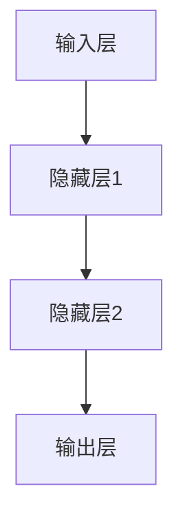

                 

## 文章标题：类脑计算对模拟人类理解世界过程的探索

## 关键词：类脑计算、模拟人类理解、神经网络、算法原理、项目实战

### 摘要

本文探讨了类脑计算技术在模拟人类理解世界过程中的应用与发展。通过对类脑计算的定义、原理、核心算法以及实际项目案例的详细分析，文章旨在揭示类脑计算如何通过模仿人类大脑的工作机制，实现对复杂环境的理解和智能行为的模拟。文章结构分为四个主要部分：类脑计算的概述、模拟人类理解世界的过程、类脑计算的核心算法原理以及类脑计算的项目实战，最后总结并展望未来的发展方向。

---

## 第一部分：类脑计算的概述

### 1.1 类脑计算的定义与背景

类脑计算是一种模仿人类大脑工作原理的信息处理技术，它旨在通过构建计算模型来模拟人类认知、感知、学习和记忆等过程。类脑计算的起源可以追溯到20世纪40年代，随着神经科学和计算机科学的发展，这一领域逐渐成熟。近年来，随着深度学习、神经网络等技术的进步，类脑计算的应用范围不断扩大。

类脑计算的重要性在于，它为人工智能的发展提供了新的思路和工具。通过模拟人类大脑的工作机制，类脑计算能够更好地理解和解决复杂问题，提高人工智能系统的自适应能力和智能水平。

### 1.2 类脑计算的核心原理

类脑计算的核心原理主要包括神经网络、神经可塑性和学习与记忆机制。

**神经网络**：类脑计算的核心模型是基于神经网络的结构，它模仿了人类大脑神经元之间的连接和通信方式。神经网络通过多层节点（神经元）的相互连接和激活，实现信息传递和计算。

**神经可塑性**：神经可塑性是指神经网络在学习和适应新环境时，通过改变神经元之间的连接强度和形态来调整其功能。这种可塑性使得神经网络能够不断学习和优化，以适应复杂的环境和任务。

**学习与记忆**：学习与记忆是类脑计算的重要功能。通过正向和反向传播算法，神经网络可以从大量数据中学习特征，并通过突触可塑性机制将学习到的知识存储在神经网络中。

### 1.3 类脑计算的分类与体系结构

类脑计算可以分为模拟大脑的神经网络和模仿大脑功能的计算模型。前者主要模仿大脑的结构和工作原理，后者则侧重于实现特定功能的计算模型。

**神经网络类型**：类脑计算中的神经网络包括前馈神经网络、卷积神经网络、循环神经网络等。每种网络都有其特定的结构和应用场景。

**类脑计算系统的主要组成部分**：类脑计算系统通常包括感知模块、学习模块、记忆模块和决策模块。这些模块相互协作，实现类脑计算的整体功能。

**体系结构的演化**：随着技术的进步，类脑计算体系结构也在不断演化。从简单的神经元模型到复杂的生物启发神经网络，类脑计算体系结构越来越接近真实的大脑。

## 第二部分：模拟人类理解世界的过程

### 2.1 人类理解世界的机制

人类理解世界的过程是一个复杂的多层次系统，涉及感知、认知、记忆和决策等多个方面。这个过程主要依赖于大脑的神经网络结构和工作原理。

**神经元与突触模型**：大脑中的神经元通过突触连接形成复杂的神经网络。突触的强度和形态决定了神经信号传递的速度和准确性。

**大脑皮层功能的分布**：大脑皮层分为多个区域，每个区域都有其特定的功能。例如，视觉皮层负责处理视觉信息，运动皮层负责控制身体运动。

**感知、记忆和认知过程的相互作用**：感知是获取外部信息的过程，记忆是将信息存储在长期记忆中，认知是理解和使用信息的过程。这三个过程相互影响，共同构成了人类理解世界的完整机制。

### 2.2 类脑计算在感知领域的应用

类脑计算在感知领域的应用主要包括图像识别、语音识别和嗅觉识别等。

**图像识别与处理**：类脑计算通过模仿大脑视觉皮层的功能，实现了高效的图像识别和处理。例如，深度卷积神经网络（CNN）在图像分类和目标检测中取得了显著成果。

**语音识别与合成**：类脑计算通过模拟大脑听觉皮层的功能，实现了高效的语音识别和语音合成。例如，循环神经网络（RNN）和长短时记忆网络（LSTM）在语音识别中具有优势。

**嗅觉识别**：类脑计算通过模仿大脑嗅觉皮层的功能，实现了对气味的识别和分析。例如，神经网络模型可以用于分析空气中的化学成分，从而检测污染物或诊断疾病。

### 2.3 类脑计算在记忆领域的应用

类脑计算在记忆领域的应用主要包括长期增强学习（LTD/LTP）原理、纳米记忆和类脑计算模拟等。

**长期增强学习（LTD/LTP）原理**：长期增强学习是指通过改变突触的强度来存储和检索信息。类脑计算通过模仿这一原理，实现了高效的记忆和联想学习。

**纳米记忆**：纳米记忆技术利用纳米级别的存储单元来存储信息，具有极高的存储密度和速度。类脑计算通过结合纳米记忆技术，实现了更高效的记忆存储和检索。

**记忆与学习的模拟**：类脑计算通过神经网络模型模拟人类记忆和学习过程，实现了对复杂知识的存储和应用。例如，通过深度学习算法，类脑计算可以从大量数据中学习特征，并将其应用于实际问题解决中。

### 2.4 类脑计算在认知领域的应用

类脑计算在认知领域的应用主要包括逻辑推理、决策和社交互动等。

**逻辑推理与决策**：类脑计算通过模仿大脑的逻辑推理机制，实现了高效的逻辑推理和决策。例如，神经网络模型可以用于优化供应链管理、金融投资等领域的决策。

**情感与情绪模拟**：类脑计算通过模仿大脑的情感处理机制，实现了对情感和情绪的模拟。例如，神经网络模型可以用于分析社交媒体中的情绪趋势，帮助用户更好地理解和管理自己的情绪。

**社交互动与群体智能**：类脑计算通过模仿人类的社交互动机制，实现了群体智能的模拟。例如，通过神经网络模型，类脑计算可以模拟社交网络中的群体行为，帮助用户更好地理解和预测社会现象。

## 第三部分：类脑计算的核心算法原理

### 3.1 反向传播算法

反向传播算法是类脑计算中最常用的学习算法之一。它通过反向传播误差信号，调整神经网络的权重，以优化网络的性能。

**算法的基本原理**：

- 前向传播：将输入信号通过神经网络传递到输出层，计算输出结果和实际结果的误差。
- 反向传播：将误差信号从输出层反向传播到输入层，通过梯度下降法调整网络的权重。

**伪代码实现**：

```python
def backpropagation(inputs, targets, weights):
    outputs = forward_propagation(inputs, weights)
    error = targets - outputs
    dweights = backward_propagation(error, outputs, weights)
    return dweights
```

### 3.2 神经可塑性原理

神经可塑性是指神经网络通过改变神经元之间的连接强度和形态来适应新环境和任务。这是类脑计算实现自适应学习和记忆的关键。

**神经可塑性的类型**：

- 长期增强学习（LTD/LTP）：通过改变突触的强度来存储和检索信息。
- 突触修剪：通过减少或增加突触的数量来优化网络结构。
- 突触形态变化：通过改变突触的形态和位置来优化信息传递。

**可塑性机制与类脑计算**：

类脑计算通过模仿神经可塑性原理，实现了自适应学习和记忆。例如，在深度学习算法中，通过调整网络的权重和结构，实现更好的性能和泛化能力。

### 3.3 深度学习算法

深度学习算法是类脑计算中应用最广泛的算法之一。它通过多层神经网络结构，实现复杂特征的学习和提取。

**神经网络结构**：

- 输入层：接收外部输入信号。
- 隐藏层：通过激活函数处理输入信号，提取特征。
- 输出层：产生最终输出结果。

**算法优化与调参**：

- 梯度下降法：通过调整网络权重，减小误差。
- 正则化：通过限制权重变化，防止过拟合。
- 超参数调整：通过调整学习率、隐藏层节点数等参数，优化网络性能。

**深度学习在类脑计算中的实践**：

深度学习算法在图像识别、语音识别、自然语言处理等领域取得了显著成果。例如，深度卷积神经网络（CNN）在图像分类和目标检测中表现出色，循环神经网络（RNN）在语音识别和文本生成中具有优势。

## 第四部分：类脑计算的项目实战

### 4.1 类脑计算应用案例分析

类脑计算在多个领域都有成功的应用案例。以下是一些典型案例：

- **图像识别项目**：通过深度卷积神经网络（CNN）实现高效图像分类和目标检测。
- **语音识别项目**：通过循环神经网络（RNN）实现准确语音识别和语音合成。
- **记忆与学习项目**：通过深度学习算法实现复杂知识的存储和应用。

### 4.2 类脑计算系统的搭建与实现

搭建类脑计算系统需要以下步骤：

- **环境配置**：安装Python、TensorFlow或其他深度学习框架。
- **数据准备**：收集和处理实验数据。
- **模型构建**：设计神经网络结构，设置参数。
- **训练与优化**：训练网络，调整参数，优化性能。

### 4.3 代码解读与分析

以下是一个简单的深度学习代码示例，用于图像分类：

```python
import tensorflow as tf

# 定义神经网络结构
model = tf.keras.Sequential([
    tf.keras.layers.Conv2D(32, (3, 3), activation='relu', input_shape=(28, 28, 1)),
    tf.keras.layers.MaxPooling2D((2, 2)),
    tf.keras.layers.Flatten(),
    tf.keras.layers.Dense(128, activation='relu'),
    tf.keras.layers.Dense(10, activation='softmax')
])

# 编译模型
model.compile(optimizer='adam',
              loss='sparse_categorical_crossentropy',
              metrics=['accuracy'])

# 训练模型
model.fit(train_images, train_labels, epochs=5)

# 评估模型
test_loss, test_acc = model.evaluate(test_images,  test_labels)
print('\nTest accuracy:', test_acc)
```

### 4.4 未来展望与挑战

类脑计算的未来发展充满潜力，但也面临许多挑战：

- **硬件限制**：类脑计算需要大量的计算资源和存储空间，这对硬件提出了高要求。
- **数据隐私**：类脑计算依赖于大量数据，数据隐私和安全问题需要得到有效解决。
- **算法优化**：需要进一步优化算法，提高计算效率和准确性。
- **应用拓展**：需要拓展类脑计算的应用领域，实现更广泛的应用。

### 附录

**A.1 类脑计算相关资源**

- **学术论文与文献推荐**：《深度学习》（Goodfellow, Bengio, Courville）、《神经网络与深度学习》（邱锡鹏）。
- **开源类脑计算框架介绍**：TensorFlow、PyTorch、Keras。
- **教程与培训资源**：Coursera、edX、Udacity提供的深度学习和类脑计算课程。

**A.2 Mermaid流程图示例**

以下是一个简单的神经网络结构流程图示例：



---

**作者**：AI天才研究院/AI Genius Institute & 禅与计算机程序设计艺术 /Zen And The Art of Computer Programming

