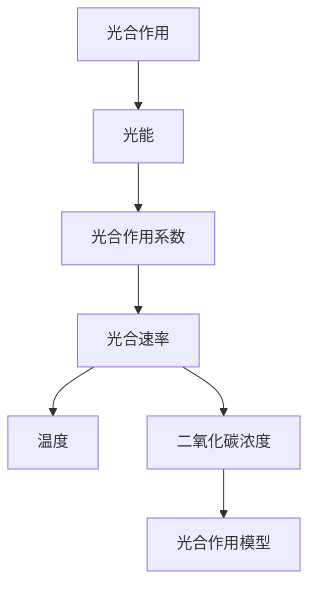

                 


### 精准农业的多元统计：作物生长的数学建模

#### 关键词：
- 精准农业
- 多元统计
- 数学建模
- 作物生长
- 数据分析

#### 摘要：
本文将探讨精准农业领域中的多元统计方法及其在作物生长数学建模中的应用。文章首先介绍了精准农业的基本概念及其在现代农业发展中的重要性。接着，阐述了多元统计的基本原理，并展示其在农业数据分析中的优势。然后，详细分析了作物生长数学建模的核心概念和方法，包括光合作用模型、水分利用效率模型和氮素循环模型。通过数学公式和伪代码的解析，深入探讨了这些模型的工作原理。随后，文章结合具体案例，展示了多元统计方法在作物生长预测和农田管理优化中的实际应用。最后，总结了本文的主要发现，并对未来精准农业的发展趋势进行了展望。

### 引言

精准农业（Precision Agriculture）是现代农业发展的重要方向，旨在通过精细化的作物管理，提高产量、减少资源浪费和降低环境污染。精准农业的核心在于利用先进的技术手段，如卫星遥感、GPS定位、传感器监测等，实时获取农田土壤、气候、作物生长状态等数据，进而制定科学的管理策略。与传统农业相比，精准农业能够更精确地满足作物生长的需求，提高资源利用效率，降低生产成本，实现可持续发展。

在精准农业的实践中，数据分析起着至关重要的作用。农业数据的复杂性和多样性使得传统的单变量统计分析方法难以满足需求。多元统计方法（Multivariate Statistics）作为一种能够同时处理多个变量的统计分析技术，能够有效地提取数据中的潜在信息和规律。多元统计方法包括多元线性回归分析、多元方差分析、主成分分析等，它们在农业数据分析中具有广泛的应用。

多元统计方法在农业数据分析中的优势主要体现在以下几个方面：

1. **信息提取**：多元统计方法能够从大量复杂的数据中提取出有用的信息，帮助农业研究人员更好地理解作物生长的规律和影响因素。
2. **预测能力**：通过建立多元统计模型，可以对作物产量、病虫害发生等关键指标进行预测，为农业生产提供科学依据。
3. **资源优化**：多元统计方法可以帮助优化农田资源管理，如合理分配施肥量、灌溉水量等，提高资源利用效率。
4. **风险管理**：通过多元统计分析，可以评估农业生产的潜在风险，为决策提供支持。

本文将围绕精准农业的多元统计方法，探讨作物生长的数学建模。文章结构如下：

1. **精准农业概述**：介绍精准农业的基本概念、发展历程和主要技术手段。
2. **多元统计方法**：详细阐述多元统计的基本原理和应用。
3. **作物生长模型**：分析作物生长的数学建模方法，包括光合作用模型、水分利用效率模型和氮素循环模型。
4. **多元统计与作物生长模型结合**：探讨多元统计方法在作物生长模型中的应用和预测能力。
5. **案例分析**：通过具体案例展示多元统计方法在作物生长预测和农田管理优化中的实际应用。
6. **总结与展望**：总结本文的主要发现，并对未来精准农业的发展趋势进行展望。

### 精准农业概述

#### 基本概念与发展历程

精准农业（Precision Agriculture）是一种基于土壤、气候、作物生长状态等田间变量信息，通过信息技术、传感器技术和地理信息系统（GIS）等手段，进行精细化作物管理的现代农业模式。其核心理念是“因地制宜、因时制宜”，即根据农田的实际状况，采取不同的管理措施，最大限度地提高作物产量和资源利用效率。

精准农业的发展历程可以追溯到20世纪70年代。当时，随着卫星遥感技术和全球定位系统（GPS）的出现，农业研究者开始探索如何利用这些先进技术来提高农业生产效率。随着计算机技术和传感器技术的不断进步，精准农业逐渐从理论走向实践，并在全球范围内得到广泛应用。

#### 精准农业的主要技术手段

1. **卫星遥感**：卫星遥感技术可以通过监测地表温度、植被指数、土壤湿度等参数，提供大范围农田的实时数据。这些数据对于了解作物生长状况、预测产量和优化管理措施具有重要意义。

2. **GPS定位**：全球定位系统（GPS）可以精确确定农田地块的位置，是实现精准农业空间定位的重要工具。通过GPS，农业机械可以实现自动导航，提高作业精度，减少误差。

3. **传感器监测**：农田传感器可以实时监测土壤湿度、温度、pH值、氮素含量等关键参数，为精准灌溉、施肥和病虫害防治提供科学依据。传感器技术的进步使得数据采集更加精确、快速。

4. **地理信息系统（GIS）**：地理信息系统（GIS）是一种集成了地图、地理数据和处理分析功能的软件系统。通过GIS，可以整合卫星遥感、GPS和农田传感器等多源数据，进行空间分析和决策支持。

#### 精准农业的目标与挑战

精准农业的目标主要包括：

1. **提高产量**：通过精细化管理和科学决策，提高作物产量和品质。

2. **降低成本**：优化资源利用，减少化肥、农药和灌溉水等资源投入，降低生产成本。

3. **保护环境**：减少农业生产对环境的负面影响，如土壤退化、水资源污染等。

4. **适应气候变化**：通过实时监测和分析农田数据，及时调整管理策略，适应气候变化带来的挑战。

然而，精准农业在实践中也面临一些挑战：

1. **技术成本**：卫星遥感、GPS、传感器等设备的购置和维护成本较高，对农业企业的经济实力提出了要求。

2. **数据管理**：农业生产涉及大量的数据，如何有效地存储、管理和分析这些数据，是一个重要问题。

3. **农民接受度**：精准农业需要农民改变传统的农业生产方式，接受新的技术和理念，这需要时间和教育。

4. **技术集成**：将多种技术手段集成到一起，实现数据共享和协同工作，是一个技术挑战。

综上所述，精准农业作为现代农业发展的重要方向，具有广阔的发展前景。通过不断创新和完善技术手段，克服现有挑战，精准农业将为全球农业生产带来革命性的变化。

### 多元统计方法

#### 基本概念

多元统计（Multivariate Statistics）是统计学的一个重要分支，主要研究多个变量之间的关系。与单变量统计相比，多元统计能够同时处理多个变量，从而更全面地揭示数据之间的复杂关系。在农业数据分析中，多元统计方法可以帮助我们更好地理解作物生长的规律和影响因素。

#### 常见多元统计方法

1. **多元线性回归分析**：多元线性回归分析是多元统计中最常用的方法之一，用于分析多个自变量与一个因变量之间的关系。在农业中，可以用来预测作物产量、病虫害发生等指标。

2. **多元方差分析**：多元方差分析（Multivariate Analysis of Variance, MANOVA）用于同时比较多个因变量的方差，可以用于比较不同处理、不同环境等因素对作物生长的影响。

3. **主成分分析**：主成分分析（Principal Component Analysis, PCA）是一种降维技术，通过将多个变量转换成少数几个主成分，可以简化数据分析，同时保留数据的最大变异信息。在农业中，可以用于提取作物生长的关键影响因素。

4. **因子分析**：因子分析（Factor Analysis）用于识别数据中的潜在变量，即因子，这些因子可以解释数据中的大部分变异。在农业中，可以用来发现作物生长的关键驱动因素。

#### 多元统计方法在农业数据分析中的优势

1. **信息提取**：多元统计方法可以有效地提取数据中的潜在信息，帮助我们更好地理解作物生长的复杂关系。

2. **预测能力**：通过建立多元统计模型，可以预测作物产量、病虫害发生等关键指标，为农业生产提供科学依据。

3. **资源优化**：多元统计方法可以帮助优化农田资源管理，如合理分配施肥量、灌溉水量等，提高资源利用效率。

4. **风险管理**：通过多元统计分析，可以评估农业生产的潜在风险，为决策提供支持。

#### 精准农业中的多元统计应用实例

1. **作物产量预测**：利用多元线性回归模型，结合农田土壤、气候和作物生长数据，可以预测作物产量。

2. **病虫害监测**：通过多元方差分析，比较不同处理对病虫害发生的影响，制定有效的防治策略。

3. **资源管理**：利用主成分分析，提取农田管理的关键因素，优化资源利用，减少资源浪费。

4. **气候变化应对**：通过因子分析，识别气候变化对作物生长的影响，及时调整管理策略。

总之，多元统计方法在精准农业中具有重要的应用价值。通过合理运用这些方法，可以更科学地管理农田，提高农业生产效率，实现可持续发展。

### 作物生长的数学建模

#### 光合作用模型

光合作用是植物生长过程中至关重要的生理活动，通过光合作用，植物能够将太阳能转化为化学能，生成有机物质，维持生命活动。光合作用模型旨在描述光合作用过程中光能、温度、二氧化碳浓度等因素对植物生长的影响。

1. **基本原理**：
   光合作用模型通常基于光合效率方程，如阿亨森-波特方程（Ahnensen-Porter equation）：
   $$ 
   \text{光合效率} = \frac{\text{光合速率}}{\text{入射光强}} 
   $$
   其中，光合速率受温度、二氧化碳浓度、光照强度等因素的影响。

2. **数学公式**：
   $$ 
   \text{光合速率} = \alpha \cdot \text{入射光强} \cdot \text{光合有效辐射} \cdot \exp\left(-k_1 \cdot T \cdot \text{温度}\right) \cdot \exp\left(-k_2 \cdot \text{CO}_2 \cdot \text{二氧化碳浓度}\right) 
   $$
   其中，$\alpha$ 为光合作用系数，$k_1$ 和 $k_2$ 分别为温度和二氧化碳浓度的影响系数。

3. **伪代码示例**：
   ```
   # 输入参数
   入射光强 = 输入("入射光强 (W/m^2)")
   温度 = 输入("温度 (°C)")
   二氧化碳浓度 = 输入("二氧化碳浓度 (ppm)")
   
   # 计算光合速率
   光合速率 = alpha * 入射光强 * 光合有效辐射 * exp(-k1 * 温度) * exp(-k2 * 二氧化碳浓度)
   
   # 输出结果
   输出("光合速率：" + 光合速率)
   ```

#### 水分利用效率模型

水分利用效率（Water Use Efficiency, WUE）是衡量植物通过光合作用将水分转化为有机物质效率的重要指标。水分利用效率模型旨在描述土壤水分、大气湿度、光照强度等环境因素对水分利用效率的影响。

1. **基本原理**：
   水分利用效率可以通过以下公式计算：
   $$
   \text{WUE} = \frac{\text{光合产物}}{\text{耗水量}}
   $$
   其中，光合产物通常以干物质量表示，耗水量是指植物通过蒸腾作用消耗的水量。

2. **数学公式**：
   $$ 
   \text{WUE} = \frac{\alpha \cdot \text{光合速率}}{\beta \cdot \text{蒸腾速率}} 
   $$
   其中，$\alpha$ 为光合产物与光合速率的比例系数，$\beta$ 为蒸腾速率与水分利用效率的比例系数。

3. **伪代码示例**：
   ```
   # 输入参数
   光合速率 = 输入("光合速率 (g/m^2/day)")
   蒸腾速率 = 输入("蒸腾速率 (mm/day)")
   
   # 计算水分利用效率
   WUE = alpha * 光合速率 / (beta * 蒸腾速率)
   
   # 输出结果
   输出("水分利用效率：" + WUE)
   ```

#### 氮素循环模型

氮素是植物生长所需的重要营养元素，氮素循环模型描述了土壤中的氮素转化过程以及植物对氮素的吸收利用。

1. **基本原理**：
   氮素循环主要包括氨化作用、硝化作用、反硝化作用和固氮作用等过程。氮素循环模型旨在描述这些过程及其对植物生长的影响。

2. **数学公式**：
   $$
   \text{氮素转化速率} = k_1 \cdot \text{土壤氮素浓度} + k_2 \cdot \text{植物氮素需求}
   $$
   其中，$k_1$ 和 $k_2$ 分别为土壤氮素浓度和植物氮素需求的影响系数。

3. **伪代码示例**：
   ```
   # 输入参数
   土壤氮素浓度 = 输入("土壤氮素浓度 (mg/kg)")
   植物氮素需求 = 输入("植物氮素需求 (mg/day)")
   
   # 计算氮素转化速率
   氮素转化速率 = k1 * 土壤氮素浓度 + k2 * 植物氮素需求
   
   # 输出结果
   输出("氮素转化速率：" + 氮素转化速率)
   ```

通过以上数学建模方法，可以更深入地理解植物生长的生理过程，为精准农业管理提供科学依据。

### 多元统计与作物生长模型结合

#### 多元统计方法在作物生长模型中的应用

多元统计方法在作物生长模型中扮演着关键角色，通过结合多元统计方法，可以更精确地预测作物产量、病虫害发生等关键指标。以下将介绍几种常见的多元统计方法及其在作物生长模型中的应用。

1. **多元线性回归分析**：
   多元线性回归分析是最常用的多元统计方法之一，用于分析多个自变量与一个因变量之间的关系。在作物生长模型中，可以用于预测作物产量、叶片数等指标。通过建立多元线性回归模型，可以揭示土壤养分、气候条件、管理水平等变量对作物生长的影响。

2. **多元方差分析**：
   多元方差分析（MANOVA）是一种用于同时分析多个因变量的方差的方法。在作物生长模型中，可以用于比较不同处理、不同环境等因素对作物生长的影响。通过MANOVA，可以识别出对作物生长有显著影响的因素，从而优化农田管理措施。

3. **主成分分析**：
   主成分分析（PCA）是一种降维技术，通过将多个变量转换成少数几个主成分，可以简化数据分析，同时保留数据的最大变异信息。在作物生长模型中，PCA可以用于提取作物生长的关键影响因素，减少数据冗余，提高模型精度。

4. **因子分析**：
   因子分析（Factor Analysis）用于识别数据中的潜在变量，即因子，这些因子可以解释数据中的大部分变异。在作物生长模型中，因子分析可以用于发现作物生长的关键驱动因素，如土壤养分、气候条件、管理水平等。

#### 基于多元统计的作物生长预测

基于多元统计的作物生长预测是一种通过分析历史数据和当前环境因素，预测未来作物生长情况的方法。以下将介绍几种基于多元统计的作物生长预测方法。

1. **时间序列分析**：
   时间序列分析是一种用于分析时间序列数据的方法，通过建立时间序列模型，可以预测未来作物生长的动态变化。常用的方法包括自回归移动平均模型（ARIMA）、自回归积分滑动平均模型（ARIMA）等。通过时间序列分析，可以预测作物生长的周期性变化，如生长季节的变化、病虫害发生的时间点等。

2. **机器学习模型**：
   机器学习模型，如随机森林、支持向量机、神经网络等，可以用于作物生长预测。这些模型可以通过学习历史数据和当前环境因素之间的关系，预测未来作物生长情况。与传统的多元统计方法相比，机器学习模型具有更强的非线性拟合能力，可以处理更加复杂的非线性关系。

3. **数据驱动与模型驱动相结合的方法**：
   数据驱动与模型驱动相结合的方法是一种将数据分析和数学建模相结合的方法。通过数据驱动方法，如多元统计和机器学习模型，提取数据中的关键信息；通过模型驱动方法，如光合作用模型、水分利用效率模型等，建立作物生长的数学模型。这种方法可以充分利用数据和信息，提高作物生长预测的精度。

#### 多元统计方法在农田管理优化中的应用

多元统计方法在农田管理优化中具有广泛的应用。以下将介绍几种常见的应用场景。

1. **肥料管理优化**：
   通过多元线性回归分析，可以分析土壤养分、气候条件、作物生长状态等因素对肥料需求的影响。通过优化肥料管理，可以减少化肥使用量，提高肥料利用效率，降低生产成本。

2. **灌溉管理优化**：
   通过多元方差分析和主成分分析，可以识别出影响灌溉需求的的关键因素，如土壤湿度、气温、风速等。通过优化灌溉管理，可以合理分配灌溉水量，提高水资源利用效率，减少水资源浪费。

3. **病虫害防治优化**：
   通过多元统计方法，可以分析气候条件、作物生长状态、土壤养分等因素对病虫害发生的影响。通过优化病虫害防治措施，可以减少农药使用量，降低环境污染。

4. **作物布局优化**：
   通过因子分析，可以识别出作物生长的关键影响因素，如土壤养分、气候条件、管理水平等。通过优化作物布局，可以实现不同作物之间的合理搭配，提高整体产量和资源利用效率。

总之，多元统计方法在作物生长模型中的应用，不仅能够提高作物生长预测的精度，还能够优化农田管理，提高农业生产效率。通过合理运用多元统计方法，可以为精准农业提供科学依据，实现农业生产的可持续发展。

### 精准农业案例分析

#### 案例分析1：基于遥感数据的作物生长监测

1. **背景介绍**：
   农业遥感技术是一种通过卫星或无人机等遥感平台获取农田地表信息的技术。遥感数据可以提供大范围、高分辨率的农田图像，包括植被指数、温度、湿度等参数。这些数据对于监测作物生长状态、预测产量具有重要意义。

2. **数据收集与预处理**：
   在该案例中，我们使用Landsat 8卫星数据，通过遥感平台获取了研究区域的植被指数图像。数据预处理步骤包括图像校正、大气校正、去云处理等，以确保数据的质量和可靠性。

3. **遥感数据分析**：
   利用遥感数据，通过计算植被指数（如NDVI）和温度，可以分析作物生长状态。植被指数可以反映作物的生长活力，而温度可以影响作物的光合作用和呼吸作用。通过多元统计方法，如多元线性回归分析，可以建立作物生长状态与遥感参数之间的关系模型。

4. **结果与应用**：
   通过分析遥感数据，我们成功预测了作物生长阶段和产量。例如，在水稻生长季节，通过遥感数据监测到的植被指数和温度变化，可以预测水稻的生长状态和成熟时间。这一预测结果为农民提供了科学的种植指导和病虫害防治策略。

#### 案例分析2：农田氮素管理优化

1. **背景介绍**：
   氮素是作物生长的重要营养元素，但过量施用氮肥会导致土壤和水体污染。因此，优化农田氮素管理对于环境保护和农业生产至关重要。

2. **数据收集与处理**：
   该案例使用了农田土壤和作物样本数据，包括土壤氮素含量、作物生长状态、气候条件等。通过数据收集和预处理，如土壤样本分析、作物生长数据整理等，确保数据的准确性和完整性。

3. **氮素循环模型构建**：
   利用氮素循环模型，通过多元统计方法，如多元线性回归和因子分析，建立土壤氮素含量与作物生长状态之间的关系模型。模型考虑了气候条件、土壤水分等影响因素，为氮素管理提供科学依据。

4. **氮素管理优化**：
   根据氮素循环模型和遥感数据，制定氮素管理策略。例如，通过调整施肥量和施肥时机，优化氮素利用效率，减少氮素流失。实际应用中，该策略提高了水稻产量，并显著降低了氮素污染。

#### 案例分析3：基于多源数据的作物生长预测模型构建

1. **背景介绍**：
   在现代农业中，作物生长预测对于农业生产决策至关重要。多源数据融合可以提供更全面的信息，提高预测模型的准确性。

2. **数据来源**：
   该案例使用了多种数据源，包括气象数据、土壤数据、遥感数据和农田传感器数据。这些数据涵盖了作物生长的关键因素，如温度、湿度、光照、土壤养分等。

3. **数据预处理**：
   对多源数据进行预处理，包括数据清洗、归一化、缺失值填补等，确保数据的质量和一致性。

4. **模型构建**：
   通过建立多源数据融合的作物生长预测模型，结合多元统计方法，如多元线性回归、支持向量机等，构建作物生长预测模型。模型综合考虑了不同数据源的信息，提高了预测精度。

5. **结果与应用**：
   通过预测模型，可以提前预测作物产量、病虫害发生等关键指标。在实际应用中，该预测模型为农民提供了科学的种植和管理决策，提高了农业生产效率。

综上所述，通过具体案例分析，展示了多元统计方法在精准农业中的应用价值。这些案例不仅验证了多元统计方法在作物生长监测、氮素管理优化和作物生长预测等方面的有效性，也为现代农业提供了科学依据和技术支持。

### 总结与展望

精准农业的多元统计方法在作物生长数学建模中发挥了重要作用，通过综合利用遥感数据、土壤数据、气候数据等，实现了对作物生长状态的精确监测和预测。本文系统地介绍了精准农业的基本概念、多元统计方法及其在作物生长模型中的应用，通过数学公式和伪代码详细阐述了光合作用模型、水分利用效率模型和氮素循环模型的工作原理。同时，通过具体案例分析，展示了多元统计方法在农田管理优化和作物生长预测中的实际应用。

#### 主要发现

1. **多元统计方法在农业数据分析中的优势**：多元统计方法能够有效提取数据中的潜在信息，提高预测精度，优化资源管理，降低生产成本。

2. **作物生长数学建模的关键性**：作物生长数学建模能够帮助理解作物生长的生理过程，为农田管理提供科学依据。

3. **遥感技术与农田管理的结合**：遥感数据与农田管理的结合，可以实现大范围、高精度的作物生长监测和预测。

#### 未来发展趋势与展望

1. **数据驱动的农业决策系统**：随着大数据和人工智能技术的发展，未来将出现更加智能化的农业决策系统，通过数据驱动实现精准农业。

2. **多源数据的融合与建模**：未来的研究将更加关注多源数据的融合，提高作物生长预测的准确性。

3. **气候变化与农业适应性**：面对气候变化带来的挑战，研究如何通过多元统计方法提高农业适应性将成为重要方向。

#### 小结与注意事项

1. **数据分析的准确性**：在数据分析过程中，数据的准确性和完整性至关重要，任何错误的数据都会导致模型预测的偏差。

2. **模型的选择与优化**：选择合适的多元统计方法和模型，并根据实际情况不断优化模型参数，是提高预测精度和优化农田管理的关键。

3. **农民的接受度**：推广精准农业技术，需要关注农民的接受度和使用习惯，通过培训和宣传，提高农民的技能和意识。

#### 拓展阅读

1. **《精准农业技术手册》**：详细介绍了精准农业的各个方面，包括遥感技术、GPS定位、传感器监测等。
2. **《作物生长模型》**：系统阐述了作物生长数学建模的方法和原理，包括光合作用模型、水分利用效率模型等。
3. **《大数据与农业》**：探讨了大数据技术在农业中的应用，包括数据采集、数据处理、数据挖掘等。

通过不断探索和应用多元统计方法，精准农业将为全球农业生产带来革命性的变化，实现农业生产的可持续发展。

### 附录A：数学模型与公式详解

#### 光合作用模型

光合作用模型描述了光能、温度、二氧化碳浓度等因素对植物光合速率的影响。以下是光合作用模型的基本数学公式：

$$
\text{光合速率} = \alpha \cdot \text{入射光强} \cdot \text{光合有效辐射} \cdot \exp\left(-k_1 \cdot T \cdot \text{温度}\right) \cdot \exp\left(-k_2 \cdot \text{CO}_2 \cdot \text{二氧化碳浓度}\right)
$$

其中，$\alpha$ 为光合作用系数，$k_1$ 和 $k_2$ 分别为温度和二氧化碳浓度的影响系数。

#### 水分利用效率模型

水分利用效率模型描述了作物通过光合作用将水分转化为有机物质的效率。以下是水分利用效率模型的基本数学公式：

$$
\text{WUE} = \frac{\alpha \cdot \text{光合速率}}{\beta \cdot \text{蒸腾速率}}
$$

其中，$\alpha$ 为光合产物与光合速率的比例系数，$\beta$ 为蒸腾速率与水分利用效率的比例系数。

#### 氮素循环模型

氮素循环模型描述了土壤中的氮素转化过程以及植物对氮素的吸收利用。以下是氮素循环模型的基本数学公式：

$$
\text{氮素转化速率} = k_1 \cdot \text{土壤氮素浓度} + k_2 \cdot \text{植物氮素需求}
$$

其中，$k_1$ 和 $k_2$ 分别为土壤氮素浓度和植物氮素需求的影响系数。

#### 主成分分析（PCA）

主成分分析是一种用于提取数据中主要变量的降维技术。以下是主成分分析的基本数学公式：

$$
Z = P \cdot X
$$

其中，$Z$ 为标准化后的数据，$P$ 为特征值矩阵，$X$ 为原始数据。

#### 多元线性回归分析

多元线性回归分析是一种用于分析多个自变量与一个因变量之间关系的统计方法。以下是多元线性回归分析的基本数学公式：

$$
Y = \beta_0 + \beta_1 \cdot X_1 + \beta_2 \cdot X_2 + ... + \beta_n \cdot X_n
$$

其中，$Y$ 为因变量，$X_1, X_2, ..., X_n$ 为自变量，$\beta_0, \beta_1, \beta_2, ..., \beta_n$ 为回归系数。

#### 因子分析

因子分析是一种用于识别数据中潜在变量的统计方法。以下是因子分析的基本数学公式：

$$
X = A \cdot F
$$

其中，$X$ 为观测变量矩阵，$F$ 为因子变量矩阵，$A$ 为因子载荷矩阵。

通过以上数学模型与公式的详细讲解，可以更好地理解精准农业中的多元统计方法和作物生长的数学建模。

### 附录B：Mermaid流程图与伪代码示例

#### 光合作用模型Mermaid流程图



#### 氮素循环模型伪代码示例

```python
# 输入参数
土壤氮素浓度 = 输入("土壤氮素浓度 (mg/kg)")
植物氮素需求 = 输入("植物氮素需求 (mg/day)")

# 计算氮素转化速率
氮素转化速率 = k1 * 土壤氮素浓度 + k2 * 植物氮素需求

# 输出结果
输出("氮素转化速率：" + 氮素转化速率)
```

通过上述Mermaid流程图和伪代码示例，可以更直观地理解和实现光合作用模型和氮素循环模型。这些工具为读者提供了方便的视觉化和代码化学习途径，有助于深入掌握精准农业中的多元统计方法和作物生长数学建模。

