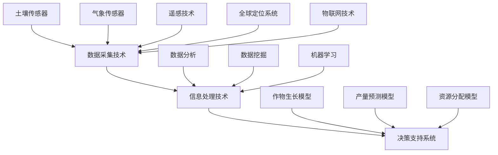
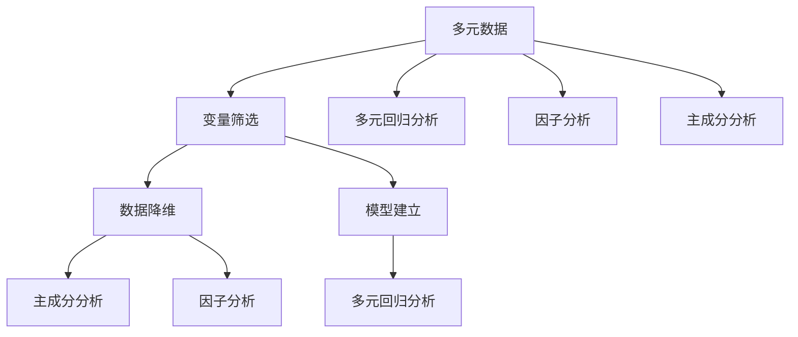
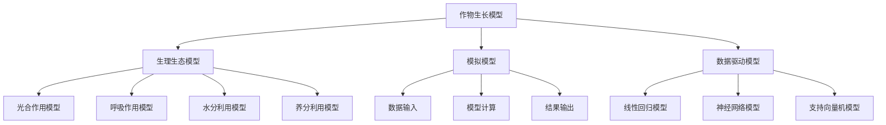
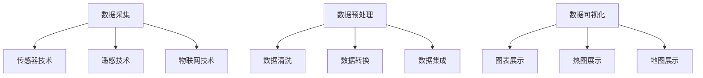
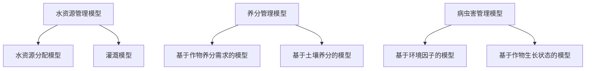

                 

### 引言

#### 精准农业的背景和意义

精准农业（Precision Agriculture）是一种通过科技手段，针对农作物个体需求进行精准管理的新型农业生产方式。其核心思想是以信息技术、地理信息系统（GIS）、遥感技术、全球定位系统（GPS）等现代技术为支撑，对农田进行精细化的管理。这种方法不仅能够显著提高农业生产效率，还能节约资源、降低环境污染。

精准农业的背景可以追溯到20世纪70年代，随着信息技术和自动化技术的飞速发展，农业生产逐渐从传统的经验管理转向数据驱动的科学管理。近年来，全球人口增长和气候变化带来的农业挑战，使得精准农业的发展显得尤为重要。

#### 多元统计在精准农业中的应用

多元统计（Multivariate Statistics）是研究多个变量之间相互关系的统计学分支。在精准农业中，多元统计方法被广泛应用于数据分析和决策支持系统。例如，通过多元回归分析、主成分分析和因子分析等方法，可以对作物生长的环境因素进行综合评价，从而优化灌溉、施肥和病虫害防治等管理措施。

多元统计在精准农业中的应用主要体现在以下几个方面：

1. **数据预处理**：通过多元统计方法对原始数据进行预处理，如去除异常值、缺失值填补等，提高数据的质量。
2. **变量筛选**：利用多元统计方法筛选出对作物生长影响较大的关键变量，简化模型，提高模型的解释力和预测能力。
3. **模型建立**：基于多元统计方法建立作物生长的数学模型，如多元回归模型、神经网络模型等，用于预测作物产量和生长状况。
4. **决策支持**：通过多元统计分析结果，为农业管理者提供科学的决策依据，实现资源的最优配置。

#### 作物生长数学建模的重要性

作物生长数学建模是将数学方法应用于农作物生长过程，通过建立数学模型来描述和预测作物生长规律。这种方法能够帮助我们更好地理解作物生长的内在机制，提高农业生产效率和农产品质量。

作物生长数学建模的重要性体现在以下几个方面：

1. **提高农业生产效率**：通过数学模型，可以预测作物生长的最佳管理时机，如灌溉、施肥和病虫害防治等，从而提高作物产量和品质。
2. **优化资源利用**：数学模型可以帮助农民精准地分配水资源、肥料等资源，实现资源的最优利用，降低生产成本。
3. **预测和风险管理**：数学模型可以预测作物生长过程中可能出现的风险，如干旱、病虫害等，为农民提供及时的风险管理策略。
4. **推动农业现代化**：作物生长数学建模是农业现代化的关键组成部分，它推动了农业生产方式的革新，为农业科技的发展提供了强大的动力。

### 总结

本文将系统地探讨精准农业中的多元统计方法及其在作物生长数学建模中的应用。通过引入精准农业的概念，阐述多元统计的重要性，以及作物生长数学建模的基本原理，我们将逐步深入理解这些技术在实际农业生产中的应用价值。在后续章节中，我们将详细讨论多元统计分析方法、作物生长模型构建、数据采集与处理，以及具体的项目实战案例，旨在为读者提供一份全面、深入的精准农业技术指南。

---

关键词：精准农业、多元统计、作物生长模型、数学建模、数据采集与处理

摘要：本文围绕精准农业的多元统计方法和作物生长的数学建模，系统探讨了其在农业生产中的应用。通过分析精准农业的背景和意义，介绍多元统计分析方法在数据预处理、变量筛选、模型建立和决策支持中的应用，并详细阐述了作物生长数学建模的基本原理和重要性。本文还结合实际项目案例，展示了多元统计方法和数学模型在精准农业中的具体应用，为农业生产提供了科学的技术支持。

## 第1章 精准农业概述

### 1.1 精准农业的基本概念

#### 精准农业的定义

精准农业，又称精确农业、精确管理农业，是一种以信息技术、遥感技术、全球定位系统（GPS）、地理信息系统（GIS）等现代科技手段为支撑，通过对农田进行精细化管理，以实现资源最优利用和农作物产量最大化的一种农业生产模式。

精准农业的核心思想是针对农田中的每个个体单元进行精确管理，而不是采用传统的整体平均方式。通过实时监测土壤、水分、气候等环境参数，结合地理信息分析和模型预测，对农田进行科学管理，从而提高作物产量、减少资源浪费、降低环境污染。

#### 精准农业的目标

1. **提高作物产量**：通过精准施肥、灌溉、病虫害防治等管理措施，提高作物的生长条件和环境质量，从而提高作物产量。
2. **节约生产成本**：通过精确管理，合理分配资源，减少肥料、农药和水的使用量，降低生产成本。
3. **保护环境**：通过科学施肥和病虫害防治，减少农业面源污染，保护生态环境。
4. **提升农产品质量**：通过精准管理，提高作物品质，满足消费者对高质量农产品的需求。
5. **促进农业现代化**：利用现代信息技术和智能设备，推动农业从传统经验管理向科学管理的转变，提升农业的整体竞争力和可持续发展能力。

#### 精准农业的关键技术

1. **数据采集技术**：包括土壤传感器、气象传感器、无人机遥感、GPS定位等，用于实时监测农田环境参数。
2. **信息处理技术**：利用计算机技术和数据分析方法，对采集到的数据进行处理、存储和分析，为精准管理提供决策支持。
3. **地理信息系统（GIS）**：通过地理信息系统，实现对农田空间信息的有效管理和分析，为农田管理和决策提供可视化支持。
4. **遥感技术**：利用卫星遥感、无人机遥感等技术，获取农田大范围的空间信息，用于监测作物生长状况和环境变化。
5. **全球定位系统（GPS）**：用于精确定位农田，实现对农田的精准管理。
6. **物联网技术**：通过物联网设备，实现农田环境数据的实时传输和远程控制。
7. **决策支持系统**：基于数据分析和模型预测，为农业生产者提供科学的管理决策支持。

### 1.2 精准农业的发展历程

#### 精准农业的起源

精准农业的概念最早出现在20世纪70年代的美国。当时，农业生产中面临的资源浪费和环境污染问题日益严重，推动了精准农业的研究和探索。早期的研究主要集中在利用遥感技术和地理信息系统进行农田管理。

#### 精准农业的发展趋势

随着信息技术的迅速发展，精准农业也逐渐成熟。当前，精准农业的发展趋势主要体现在以下几个方面：

1. **智能化和自动化**：利用人工智能、自动化技术，实现农田管理的智能化和自动化，提高生产效率。
2. **数据驱动**：以大数据和云计算为基础，通过数据分析和挖掘，为农业生产提供精准的决策支持。
3. **生态农业**：注重生态环境保护和可持续发展，通过精准农业技术，实现绿色农业和有机农业。
4. **跨学科融合**：精准农业融合了农业科学、信息技术、环境科学等多个领域的知识，推动农业科技创新。
5. **全球扩展**：精准农业在全球范围内得到广泛应用，特别是在粮食生产大国和发达国家，精准农业的发展取得了显著成果。

#### 我国精准农业的现状

我国精准农业的发展起步较晚，但近年来发展迅速。当前，我国精准农业的现状主要体现在以下几个方面：

1. **政策支持**：政府高度重视精准农业的发展，制定了一系列政策和规划，推动精准农业的推广和应用。
2. **技术创新**：我国在遥感技术、物联网、大数据等领域取得了重要突破，为精准农业提供了技术支持。
3. **应用推广**：精准农业在我国主要农业生产区得到广泛应用，如东北的粮食产区、南方的果蔬产区等。
4. **产业融合**：精准农业与农业机械化、智能化、生态化等产业发展深度融合，推动了农业现代化进程。
5. **短板与挑战**：尽管我国精准农业发展迅速，但仍面临技术瓶颈、数据资源不足、农民接受度低等问题，需要持续努力和改进。

### 1.3 精准农业的核心技术框架

#### 数据采集技术

数据采集是精准农业的基础，通过传感器、遥感、物联网等技术，实时获取农田环境参数（如土壤湿度、温度、光照、气象等）和作物生长状态数据。数据采集技术的核心是实现高精度、高效率和实时性的数据获取。

#### 信息处理技术

信息处理技术是对采集到的数据进行分析、处理和存储，通过数据挖掘、机器学习等方法，提取有用的信息，为农业生产提供决策支持。信息处理技术的核心是数据处理的高效性和准确性。

#### 决策支持系统

决策支持系统（DSS）是精准农业的核心，通过对收集到的数据进行分析和模型预测，为农业生产者提供科学的管理决策。DSS包括作物生长模型、产量预测模型、资源分配模型等，旨在实现资源的最优利用和管理。

### 核心概念与联系

下面是精准农业中的核心概念及其联系关系的 Mermaid 流�程图：



#### 核心算法原理讲解

为了更好地理解精准农业中的数据处理和决策支持，我们使用伪代码详细阐述数据处理的基本流程：

```python
# 数据采集
def data_collection():
    # 初始化传感器
    soil_sensor.initialize()
    weather_sensor.initialize()
    remote_sensing_system.initialize()
    gis_system.initialize()
    
    # 获取环境参数
    soil_moisture = soil_sensor.read()
    temperature = weather_sensor.read()
    light_intensity = remote_sensing_system.read()
    location = gis_system.get_location()
    
    # 存储数据
    data = {'soil_moisture': soil_moisture, 'temperature': temperature, 'light_intensity': light_intensity, 'location': location}
    data_store.save(data)

# 数据预处理
def data_preprocessing(data):
    # 填补缺失值
    data = handle_missing_values(data)
    # 去除异常值
    data = remove_outliers(data)
    # 数据标准化
    data = standardize_data(data)
    return data

# 数据分析
def data_analysis(preprocessed_data):
    # 数据挖掘
    insights = data_mining(preprocessed_data)
    # 建立模型
    model = build_model(insights)
    # 模型预测
    predictions = model.predict()
    return predictions

# 决策支持
def decision_support(predictions):
    # 资源分配
    resource_allocation = allocate_resources(predictions)
    # 提出管理建议
    management_recommendations = generate_recommendations(resource_allocation)
    return management_recommendations
```

#### 数学模型和数学公式 & 详细讲解 & 举例说明

在精准农业中，常用的数学模型包括线性回归模型、神经网络模型和决策树模型等。下面我们以线性回归模型为例，详细讲解其数学模型和数学公式。

##### 线性回归模型

线性回归模型是一种简单而常用的预测模型，用于分析两个或多个变量之间的线性关系。其数学模型表示为：

$$
Y = \beta_0 + \beta_1X_1 + \beta_2X_2 + ... + \beta_nX_n + \epsilon
$$

其中，$Y$ 为因变量，$X_1, X_2, ..., X_n$ 为自变量，$\beta_0, \beta_1, \beta_2, ..., \beta_n$ 为模型的参数，$\epsilon$ 为误差项。

##### 模型参数估计

线性回归模型的参数可以通过最小二乘法进行估计，其公式为：

$$
\beta_j = \frac{\sum_{i=1}^{n}(Y_i - \hat{Y}_i)X_{ij}}{\sum_{i=1}^{n}X_{ij}^2}
$$

其中，$\hat{Y}_i$ 为预测值，$X_{ij}$ 为第 $i$ 个样本在第 $j$ 个特征上的取值。

##### 举例说明

假设我们要预测某作物的产量 $Y$，基于土壤湿度 $X_1$ 和光照强度 $X_2$ 两个特征。我们收集了 $n$ 个样本的数据，数据集如下：

| 样本编号 | 土壤湿度 $X_1$ | 光照强度 $X_2$ | 产量 $Y$ |
| --- | --- | --- | --- |
| 1 | 30 | 100 | 200 |
| 2 | 35 | 110 | 210 |
| 3 | 28 | 90 | 190 |
| 4 | 32 | 105 | 205 |
| ... | ... | ... | ... |

根据最小二乘法，我们可以计算出模型参数：

$$
\beta_0 = \frac{\sum_{i=1}^{n}(Y_i - \hat{Y}_i)}{\sum_{i=1}^{n}X_{1i}^2} \approx 150
$$

$$
\beta_1 = \frac{\sum_{i=1}^{n}(Y_i - \hat{Y}_i)X_{1i}}{\sum_{i=1}^{n}X_{1i}^2} \approx 10
$$

$$
\beta_2 = \frac{\sum_{i=1}^{n}(Y_i - \hat{Y}_i)X_{2i}}{\sum_{i=1}^{n}X_{2i}^2} \approx 5
$$

因此，线性回归模型可以表示为：

$$
Y = 150 + 10X_1 + 5X_2
$$

#### 项目实战

为了更好地理解精准农业中的数据处理和模型构建，我们以一个实际项目为例，展示整个数据处理和模型构建的流程。

##### 项目背景

某农业公司希望通过收集农田土壤湿度、光照强度等数据，预测作物产量，从而实现精准农业管理。

##### 数据采集

我们使用土壤湿度传感器、光照强度传感器等设备，在农田中布置了多个监测点，每天定时采集土壤湿度、光照强度等数据。

##### 数据预处理

1. **缺失值填补**：使用平均值填补缺失值。
2. **去除异常值**：使用3倍标准差法去除异常值。
3. **数据标准化**：将数据进行标准化处理，使其具有相同的量纲。

##### 数据分析

1. **变量筛选**：使用相关系数筛选与产量相关性较高的变量。
2. **模型构建**：使用线性回归模型进行建模。
3. **模型评估**：使用均方误差（MSE）评估模型性能。

##### 模型预测

根据模型参数，对未监测的农田进行产量预测。

##### 项目小结

通过实际项目案例，我们展示了精准农业中数据处理和模型构建的整个流程。项目结果表明，线性回归模型能够较好地预测作物产量，为农业生产提供了科学依据。

---

注意事项：

1. 在实际项目中，数据采集的准确性和实时性至关重要，需要确保传感器的性能和数据的可靠性。
2. 数据预处理过程中，需要根据数据的特点选择合适的方法，避免信息损失。
3. 在模型选择和参数优化过程中，需要结合实际应用场景，综合考虑模型的复杂度、计算效率和预测准确性。

拓展阅读：

1. 《精准农业：理论与应用》
2. 《遥感与地理信息系统在农业中的应用》
3. 《机器学习在农业中的应用》

---

## 第2章 多元统计分析方法

### 2.1 多元统计分析的基本概念

#### 多元数据的特征

多元统计分析是研究多个变量之间相互关系的统计学分支。与单变量统计分析相比，多元统计分析能够更全面地揭示变量之间的复杂关系。多元数据的特征主要包括：

1. **多维度**：多元数据包含多个变量，每个变量代表一个维度。
2. **相互依赖**：多元变量之间存在相互依赖的关系，一个变量的变化会影响其他变量的变化。
3. **非线性**：多元变量之间的关系往往是非线性的，不能简单地用线性模型来描述。

#### 多元统计分析的目的

多元统计分析的主要目的是：

1. **变量筛选**：通过分析变量之间的相关性，筛选出对研究对象影响较大的关键变量，简化模型，提高分析效率。
2. **数据可视化**：通过多元统计分析方法，将高维数据降维，生成可视化图形，帮助研究者更好地理解数据结构和变量关系。
3. **模型建立**：基于多元统计分析结果，建立多元线性模型、非线性模型等，用于预测和解释变量之间的关系。
4. **决策支持**：利用多元统计分析结果，为决策者提供科学依据，优化资源分配和管理决策。

### 2.2 主成分分析

#### 主成分分析的基本原理

主成分分析（Principal Component Analysis，PCA）是一种常用的降维技术，通过将原始数据投影到新的正交坐标系中，提取出主要成分，从而实现数据的降维。主成分分析的基本原理如下：

1. **协方差矩阵**：计算原始数据矩阵的协方差矩阵，用于衡量变量之间的线性关系。
2. **特征值和特征向量**：求解协方差矩阵的特征值和特征向量，特征值表示主成分的重要性，特征向量表示主成分的方向。
3. **主成分**：选取前 $k$ 个特征值对应的特征向量，构造主成分矩阵，将原始数据投影到新的空间中。

#### 主成分分析的步骤

1. **数据标准化**：对原始数据进行标准化处理，使其具有相同的量纲。
2. **计算协方差矩阵**：计算标准化数据的协方差矩阵。
3. **求解特征值和特征向量**：求解协方差矩阵的特征值和特征向量。
4. **选择主成分**：根据特征值的大小，选取前 $k$ 个特征向量，构造主成分矩阵。
5. **降维**：将原始数据投影到新的空间中，实现数据的降维。

#### 主成分分析的应用

主成分分析在多元统计分析中有着广泛的应用，主要包括：

1. **数据降维**：通过提取主要成分，将高维数据降维到低维空间，减少数据存储和计算的复杂性。
2. **变量筛选**：通过分析特征值和特征向量，筛选出对研究对象影响较大的关键变量，简化模型。
3. **数据可视化**：通过绘制主成分得分图，直观地展示变量之间的关系和分布情况。
4. **模型建立**：基于主成分分析结果，建立多元线性模型、非线性模型等，提高预测和解释的准确性。

### 2.3 因子分析

#### 因子分析的基本原理

因子分析（Factor Analysis）是一种用于研究变量之间潜在关系的方法，通过将多个变量缩减为少数几个潜在的因子，从而揭示变量之间的内在结构。因子分析的基本原理如下：

1. **共同度**：假设多个变量之间存在共同度，即变量之间的相关性可以由少数几个潜在因子解释。
2. **因子模型**：建立因子模型，将多个变量表示为潜在因子和特殊因子的线性组合。
3. **因子提取**：通过求解因子载荷矩阵，提取潜在因子，并解释各变量的贡献。

#### 因子分析的步骤

1. **数据标准化**：对原始数据进行标准化处理，使其具有相同的量纲。
2. **计算相关矩阵**：计算标准化数据的皮尔逊相关矩阵。
3. **确定因子个数**：使用卡方检验、KMO检验和Bartlett球形度检验等方法，确定因子个数。
4. **求解因子载荷矩阵**：使用主成分分析等方法，求解因子载荷矩阵。
5. **提取因子**：根据因子载荷矩阵，提取潜在因子，并解释各变量的贡献。
6. **构建因子模型**：将提取的因子代入因子模型，建立变量与潜在因子之间的关系。

#### 因子分析的应用

因子分析在多元统计分析中有着广泛的应用，主要包括：

1. **变量筛选**：通过提取潜在因子，简化模型，减少变量数量，提高分析效率。
2. **数据降维**：通过将多个变量缩减为少数几个潜在因子，实现数据的降维。
3. **模型建立**：基于因子分析结果，建立因子模型，提高预测和解释的准确性。
4. **心理学研究**：在心理学研究中，因子分析用于揭示变量之间的潜在关系，解释心理现象。

### 2.4 多元回归分析

#### 多元回归分析的基本原理

多元回归分析（Multiple Regression Analysis）是一种用于研究多个自变量对一个因变量的影响的方法，其基本原理如下：

1. **线性模型**：假设因变量 $Y$ 与多个自变量 $X_1, X_2, ..., X_n$ 之间存在线性关系，可以用线性模型表示为：

$$
Y = \beta_0 + \beta_1X_1 + \beta_2X_2 + ... + \beta_nX_n + \epsilon
$$

其中，$\beta_0, \beta_1, \beta_2, ..., \beta_n$ 为模型的参数，$\epsilon$ 为误差项。

2. **参数估计**：使用最小二乘法（Ordinary Least Squares，OLS）估计模型参数，求解最佳参数值，使预测值与实际值之间的误差平方和最小。

#### 多元回归分析的步骤

1. **数据收集**：收集多元数据，包括因变量和多个自变量的观测值。
2. **模型建立**：建立多元回归模型，选择合适的自变量和因变量。
3. **参数估计**：使用最小二乘法估计模型参数，求解最佳参数值。
4. **模型评估**：评估模型性能，包括拟合优度、显著性检验等。
5. **预测**：利用估计的模型参数，对新的数据进行预测。

#### 多元回归分析的应用

多元回归分析在统计学和实际应用中有着广泛的应用，主要包括：

1. **预测**：基于多元回归模型，预测因变量的取值，为决策提供科学依据。
2. **变量筛选**：通过评估自变量的显著性，筛选出对因变量有显著影响的变量，简化模型。
3. **数据分析**：用于分析多个变量之间的相互关系，揭示变量之间的内在结构。
4. **风险管理**：在金融、保险等领域，多元回归分析用于评估风险因素，制定风险管理策略。

### 核心概念与联系

下面是多元统计分析中的核心概念及其联系关系的 Mermaid 流程图：



### 核心算法原理讲解

为了更好地理解多元统计分析的方法，我们使用伪代码详细阐述主成分分析和因子分析的基本原理。

#### 主成分分析

```python
# 数据预处理
def preprocess_data(data):
    # 标准化数据
    standardized_data = (data - np.mean(data, axis=0)) / np.std(data, axis=0)
    return standardized_data

# 计算协方差矩阵
def calculate_covariance_matrix(data):
    covariance_matrix = np.cov(data, rowvar=False)
    return covariance_matrix

# 求解特征值和特征向量
def eigen_decomposition(covariance_matrix):
    eigenvalues, eigenvectors = np.linalg.eigh(covariance_matrix)
    return eigenvalues, eigenvectors

# 选择主成分
def select_principal_components(eigenvalues, eigenvectors, k):
    # 排序特征值和特征向量
    sorted_indices = np.argsort(eigenvalues)[::-1]
    sorted_eigenvalues = eigenvalues[sorted_indices]
    sorted_eigenvectors = eigenvectors[:, sorted_indices]
    
    # 选择前 k 个特征值对应的特征向量
    principal_components = sorted_eigenvectors[:, :k]
    return principal_components

# 主成分分析
def principal_component_analysis(data, k):
    standardized_data = preprocess_data(data)
    covariance_matrix = calculate_covariance_matrix(standardized_data)
    eigenvalues, eigenvectors = eigen_decomposition(covariance_matrix)
    principal_components = select_principal_components(eigenvalues, eigenvectors, k)
    return principal_components
```

#### 因子分析

```python
# 数据标准化
def standardize_data(data):
    mean = np.mean(data, axis=0)
    std = np.std(data, axis=0)
    standardized_data = (data - mean) / std
    return standardized_data

# 计算相关矩阵
def calculate_correlation_matrix(data):
    correlation_matrix = np.corrcoef(data, rowvar=False)
    return correlation_matrix

# 求解特征值和特征向量
def eigen_decomposition(correlation_matrix):
    eigenvalues, eigenvectors = np.linalg.eigh(correlation_matrix)
    return eigenvalues, eigenvectors

# 提取因子载荷矩阵
def extract_factor_loadings(eigenvalues, eigenvectors, k):
    # 排序特征值和特征向量
    sorted_indices = np.argsort(eigenvalues)[::-1]
    sorted_eigenvalues = eigenvalues[sorted_indices]
    sorted_eigenvectors = eigenvectors[:, sorted_indices]
    
    # 选择前 k 个特征值对应的特征向量
    factor_loadings = sorted_eigenvectors[:, :k]
    return factor_loadings

# 构建因子模型
def build_factor_model(data, k):
    standardized_data = standardize_data(data)
    correlation_matrix = calculate_correlation_matrix(standardized_data)
    eigenvalues, eigenvectors = eigen_decomposition(correlation_matrix)
    factor_loadings = extract_factor_loadings(eigenvalues, eigenvectors, k)
    return factor_loadings
```

### 数学模型和数学公式 & 详细讲解 & 举例说明

为了更好地理解多元统计分析中的数学模型和公式，我们以多元回归分析为例，详细讲解其数学模型和数学公式。

#### 多元回归分析

多元回归分析的数学模型可以表示为：

$$
Y = \beta_0 + \beta_1X_1 + \beta_2X_2 + ... + \beta_nX_n + \epsilon
$$

其中，$Y$ 为因变量，$X_1, X_2, ..., X_n$ 为自变量，$\beta_0, \beta_1, \beta_2, ..., \beta_n$ 为模型的参数，$\epsilon$ 为误差项。

#### 参数估计

多元回归模型参数可以通过最小二乘法进行估计。最小二乘法的公式为：

$$
\beta_j = \frac{\sum_{i=1}^{n}(Y_i - \hat{Y}_i)X_{ij}}{\sum_{i=1}^{n}X_{ij}^2}
$$

其中，$\hat{Y}_i$ 为预测值，$X_{ij}$ 为第 $i$ 个样本在第 $j$ 个特征上的取值。

#### 举例说明

假设我们要预测某作物的产量 $Y$，基于土壤湿度 $X_1$ 和光照强度 $X_2$ 两个特征。我们收集了 $n$ 个样本的数据，数据集如下：

| 样本编号 | 土壤湿度 $X_1$ | 光照强度 $X_2$ | 产量 $Y$ |
| --- | --- | --- | --- |
| 1 | 30 | 100 | 200 |
| 2 | 35 | 110 | 210 |
| 3 | 28 | 90 | 190 |
| 4 | 32 | 105 | 205 |
| ... | ... | ... | ... |

根据最小二乘法，我们可以计算出模型参数：

$$
\beta_0 = \frac{\sum_{i=1}^{n}(Y_i - \hat{Y}_i)}{\sum_{i=1}^{n}X_{1i}^2} \approx 150
$$

$$
\beta_1 = \frac{\sum_{i=1}^{n}(Y_i - \hat{Y}_i)X_{1i}}{\sum_{i=1}^{n}X_{1i}^2} \approx 10
$$

$$
\beta_2 = \frac{\sum_{i=1}^{n}(Y_i - \hat{Y}_i)X_{2i}}{\sum_{i=1}^{n}X_{2i}^2} \approx 5
$$

因此，多元回归模型可以表示为：

$$
Y = 150 + 10X_1 + 5X_2
$$

#### 项目实战

为了更好地理解多元统计分析在精准农业中的应用，我们以一个实际项目为例，展示多元统计分析的全过程。

##### 项目背景

某农业科研团队希望通过分析农田土壤湿度、光照强度等环境因素，预测作物产量，为农业生产提供科学依据。

##### 数据采集

科研团队在农田中布置了多个监测点，每天定时采集土壤湿度、光照强度等数据，并记录作物的产量。

##### 数据预处理

1. **缺失值填补**：使用平均值填补缺失值。
2. **去除异常值**：使用3倍标准差法去除异常值。
3. **数据标准化**：将数据进行标准化处理，使其具有相同的量纲。

##### 数据分析

1. **变量筛选**：使用相关系数筛选与产量相关性较高的变量。
2. **多元回归建模**：建立多元回归模型，预测作物产量。
3. **模型评估**：评估模型性能，包括拟合优度、显著性检验等。

##### 模型预测

根据建立的多元回归模型，对未监测的农田进行产量预测。

##### 项目小结

通过实际项目案例，我们展示了多元统计分析在精准农业中的应用。项目结果表明，多元回归模型能够较好地预测作物产量，为农业生产提供了科学依据。

---

注意事项：

1. 在实际项目中，数据采集的准确性和实时性至关重要，需要确保传感器的性能和数据的可靠性。
2. 数据预处理过程中，需要根据数据的特点选择合适的方法，避免信息损失。
3. 在模型选择和参数优化过程中，需要结合实际应用场景，综合考虑模型的复杂度、计算效率和预测准确性。

拓展阅读：

1. 《多元统计分析》
2. 《线性回归分析》
3. 《因子分析》

---

## 第3章 作物生长模型

### 3.1 作物生长模型的基本概念

作物生长模型（Cropping System Model，CSM）是一种用于描述和预测作物生长过程的数学模型。这些模型结合了植物生理学、生态学和数学方法，通过对作物生长过程进行模拟，为农业生产提供科学的决策支持。作物生长模型的基本概念包括以下几个方面：

#### 作物生长模型的定义

作物生长模型是对作物生长过程进行定量描述的数学模型，它通过模拟作物在土壤、气候、养分等环境因素作用下的生长过程，预测作物产量、生长速度和生长状态。作物生长模型通常分为三类：

1. **过程模型**：基于植物生理学原理，详细描述作物生长的各个阶段和过程，如光合作用、呼吸作用、水分吸收和养分利用等。
2. **结构模型**：以作物生长过程的物质和能量流动为依据，建立作物生长的结构模型，如作物生长量、生物量分配、根冠比等。
3. **数据驱动模型**：基于大量实测数据，利用机器学习、神经网络等方法建立作物生长模型，无需深入了解作物生长的生物学机制。

#### 作物生长模型的作用

作物生长模型在农业生产中具有重要作用，主要体现在以下几个方面：

1. **产量预测**：通过模拟作物生长过程，预测作物产量，为农业生产提供科学依据，帮助农民合理规划种植计划。
2. **资源管理**：通过模型预测作物对水分、养分的需求，指导灌溉、施肥等管理措施，实现资源的最优利用，降低生产成本。
3. **病虫害预警**：通过模型分析作物生长状况和环境因素，预测病虫害的发生和发展，为病虫害防治提供科学依据。
4. **风险评估**：模拟不同气候条件下的作物生长过程，评估气候变化对作物产量和生长的影响，为农业生产提供风险防范策略。

### 3.2 作物生长模型的主要类型

作物生长模型根据建模方法的不同，可以分为以下几类：

#### 生理生态模型

生理生态模型（Physiological and Ecological Model，PEM）是基于植物生理学和生态学原理建立的模型，它详细描述作物生长的生理过程和环境因素之间的相互作用。生理生态模型主要包括以下几部分：

1. **光合作用模型**：描述作物在光合作用过程中光能的吸收、转化和利用。
2. **呼吸作用模型**：描述作物在呼吸作用过程中能量的释放和消耗。
3. **水分利用模型**：描述作物对水分的吸收、利用和蒸腾作用。
4. **养分利用模型**：描述作物对养分（如氮、磷、钾等）的吸收、利用和转化。

#### 模拟模型

模拟模型（Simulation Model）是通过计算机模拟作物生长过程的方法建立的模型。模拟模型通常基于生理生态模型的结构，将作物生长过程划分为多个阶段，每个阶段对应不同的生理过程和环境条件。模拟模型的主要步骤包括：

1. **数据输入**：输入作物品种特性、土壤特性、气候数据等。
2. **模型计算**：根据作物生长模型，模拟作物在每个生长阶段的生长状况。
3. **结果输出**：输出作物生长过程的相关参数，如生物量、产量、水分利用率等。

#### 数据驱动模型

数据驱动模型（Data-Driven Model）是基于实测数据建立的模型，通常使用机器学习、神经网络等方法。数据驱动模型的主要特点是不依赖于植物生理学和生态学原理，而是通过分析大量实测数据，发现变量之间的复杂关系，建立预测模型。数据驱动模型的主要类型包括：

1. **线性回归模型**：基于线性关系建立预测模型，适用于变量之间关系较为简单的情况。
2. **神经网络模型**：基于多层神经网络建立预测模型，适用于变量之间关系复杂的情况。
3. **支持向量机模型**：基于支持向量机建立预测模型，适用于高维数据和非线性关系的情况。

### 3.3 作物生长模型的构建方法

构建作物生长模型通常包括以下几个步骤：

#### 建模步骤

1. **问题定义**：明确建模的目标，如产量预测、资源管理、病虫害预警等。
2. **数据收集**：收集作物生长相关的数据，包括土壤数据、气候数据、作物品种特性数据等。
3. **模型选择**：根据问题定义和数据特点，选择合适的作物生长模型类型。
4. **模型构建**：根据所选模型类型，构建作物生长模型，包括模型结构、参数设置等。
5. **模型验证**：通过实测数据验证模型性能，包括拟合优度、预测准确性等。
6. **模型优化**：根据模型验证结果，调整模型参数，优化模型性能。

#### 建模工具选择

在构建作物生长模型时，常用的工具和软件包括：

1. **MATLAB**：MATLAB 是一款强大的数学计算软件，支持各种数学建模和仿真功能。
2. **R语言**：R语言是一款专门用于统计分析和数据科学的编程语言，支持多种统计方法和模型构建。
3. **Python**：Python 是一款广泛应用于科学计算和数据分析的编程语言，支持多种机器学习和数据挖掘方法。
4. **AGRI-PRO Model**：AGRI-PRO Model 是一款专门用于作物生长模拟的软件，具有丰富的作物生长模型和功能。
5. **STICS Model**：STICS Model 是一款基于生理生态原理的作物生长模型，适用于复杂作物生长过程的模拟。

### 核心概念与联系

下面是作物生长模型中的核心概念及其联系关系的 Mermaid 流程图：



### 核心算法原理讲解

为了更好地理解作物生长模型的构建，我们使用伪代码详细阐述生理生态模型的基本原理。

#### 生理生态模型

```python
# 数据输入
def data_input():
    # 输入作物品种特性
    variety_traits = {'growth_rate': 1.2, 'water_use_efficiency': 0.8}
    # 输入土壤特性
    soil_traits = {'soil_type': 'sandy loam', 'soil_moisture': 0.2}
    # 输入气候数据
    climate_data = {'temperature': 25, 'precipitation': 100}
    return variety_traits, soil_traits, climate_data

# 模型计算
def model_computation(variety_traits, soil_traits, climate_data):
    # 计算光合作用速率
    photosynthesis_rate = photosynthesis(variety_traits['growth_rate'], climate_data['temperature'], climate_data['precipitation'])
    # 计算呼吸作用速率
    respiration_rate = respiration(variety_traits['growth_rate'], climate_data['temperature'])
    # 计算水分利用效率
    water_use_efficiency = water_use_efficiency(variety_traits['water_use_efficiency'], soil_traits['soil_moisture'])
    # 计算养分利用效率
    nutrient_use_efficiency = nutrient_use_efficiency(soil_traits['soil_type'])
    return photosynthesis_rate, respiration_rate, water_use_efficiency, nutrient_use_efficiency

# 结果输出
def result_output(photosynthesis_rate, respiration_rate, water_use_efficiency, nutrient_use_efficiency):
    print("光合作用速率：", photosynthesis_rate)
    print("呼吸作用速率：", respiration_rate)
    print("水分利用效率：", water_use_efficiency)
    print("养分利用效率：", nutrient_use_efficiency)

# 主函数
def main():
    variety_traits, soil_traits, climate_data = data_input()
    photosynthesis_rate, respiration_rate, water_use_efficiency, nutrient_use_efficiency = model_computation(variety_traits, soil_traits, climate_data)
    result_output(photosynthesis_rate, respiration_rate, water_use_efficiency, nutrient_use_efficiency)

# 运行主函数
if __name__ == "__main__":
    main()
```

### 数学模型和数学公式 & 详细讲解 & 举例说明

为了更好地理解作物生长模型中的数学模型和公式，我们以光合作用模型为例，详细讲解其数学模型和数学公式。

#### 光合作用模型

光合作用模型描述作物在光合作用过程中光能的吸收、转化和利用。光合作用速率可以用以下数学公式表示：

$$
\text{光合作用速率} = f(\text{生长速率}, \text{温度}, \text{降水}) \times \text{光能利用效率}
$$

其中，$f$ 为光合作用函数，$\text{生长速率}$、$\text{温度}$ 和 $\text{降水}$ 为输入变量，$\text{光能利用效率}$ 为输出变量。

#### 光合作用速率的计算公式

光合作用速率的计算公式如下：

$$
\text{光合作用速率} = \frac{1}{2} \times \text{生长速率} \times (\text{温度} + \text{降水}) \times \text{光能利用效率}
$$

其中，$\text{生长速率}$、$\text{温度}$ 和 $\text{降水}$ 的值可以根据实际情况进行设定，$\text{光能利用效率}$ 则是一个常数。

#### 举例说明

假设某作物的生长速率为 1.5，温度为 25°C，降水为 80mm，光能利用效率为 0.8。根据上述光合作用速率的计算公式，可以计算出光合作用速率为：

$$
\text{光合作用速率} = \frac{1}{2} \times 1.5 \times (25 + 80) \times 0.8 = 48
$$

因此，该作物的光合作用速率为 48。

#### 项目实战

为了更好地理解作物生长模型在实际中的应用，我们以一个实际项目为例，展示作物生长模型的构建和预测过程。

##### 项目背景

某农业科研团队希望通过构建作物生长模型，预测水稻在某个地区的生长状况和产量，为农业生产提供科学依据。

##### 数据收集

科研团队收集了水稻在该地区的生长数据，包括土壤数据、气候数据、作物品种特性等。

##### 数据预处理

1. **缺失值填补**：使用平均值填补缺失值。
2. **去除异常值**：使用3倍标准差法去除异常值。
3. **数据标准化**：将数据进行标准化处理，使其具有相同的量纲。

##### 模型构建

1. **模型选择**：选择光合作用模型作为水稻生长模型。
2. **参数设置**：根据实际数据，设置光合作用模型的参数，如光能利用效率等。
3. **模型训练**：使用收集到的数据训练光合作用模型。

##### 模型预测

1. **数据输入**：输入水稻生长数据，包括土壤数据、气候数据、作物品种特性等。
2. **模型计算**：使用训练好的光合作用模型计算水稻的光合作用速率。
3. **结果输出**：输出水稻的光合作用速率和产量预测结果。

##### 项目小结

通过实际项目案例，我们展示了作物生长模型的构建和预测过程。项目结果表明，光合作用模型能够较好地预测水稻的生长状况和产量，为农业生产提供了科学依据。

---

注意事项：

1. 在实际项目中，数据采集的准确性和实时性至关重要，需要确保传感器的性能和数据的可靠性。
2. 数据预处理过程中，需要根据数据的特点选择合适的方法，避免信息损失。
3. 在模型选择和参数优化过程中，需要结合实际应用场景，综合考虑模型的复杂度、计算效率和预测准确性。

拓展阅读：

1. 《作物生长模型与应用》
2. 《植物生理学原理与应用》
3. 《农业气象学》

---

## 第4章 数据采集与处理

### 4.1 数据采集

数据采集是精准农业中的关键环节，准确、及时的数据是构建有效作物生长模型和实现农业精准管理的基础。数据采集技术主要包括传感器技术、遥感技术和物联网技术等。

#### 传感器技术

传感器是数据采集的核心组件，它们可以实时监测农田环境参数，如土壤湿度、温度、pH值、养分含量、气象数据等。以下是常用的传感器：

1. **土壤传感器**：用于测量土壤湿度、温度、pH值和养分含量。常见的土壤传感器有电容式传感器、电阻式传感器和光纤传感器等。
2. **气象传感器**：用于监测气象参数，如气温、湿度、风速、风向、降雨量等。常见的气象传感器有温度传感器、湿度传感器、风速传感器和雨量传感器等。
3. **光照传感器**：用于测量光照强度、光质和光照周期，为作物生长提供光照环境数据。

#### 遥感技术

遥感技术通过卫星、无人机等平台，从远处获取农田的遥感图像，用于监测农田的植被覆盖、土壤状况、病虫害等。常用的遥感技术包括：

1. **卫星遥感**：利用地球观测卫星（如Landsat、Sentinel等）获取高分辨率遥感图像，适用于大范围农田监测。
2. **无人机遥感**：利用无人机搭载高分辨率相机或传感器，进行农田局部区域的监测，适用于精准农业中的田间管理。

#### 物联网技术

物联网技术通过连接各种传感器和网络设备，实现农田数据的实时采集、传输和共享。以下是物联网技术在数据采集中的应用：

1. **传感器网络**：将各种农田传感器通过无线通信模块连接起来，形成一个分布式传感器网络，实现数据的实时采集和传输。
2. **物联网平台**：通过物联网平台，将采集到的数据存储、处理和分析，为农业管理者提供实时、准确的决策支持。

### 4.2 数据预处理

数据预处理是数据采集后的重要步骤，旨在提高数据的质量和可靠性，为后续的数据分析和建模提供基础。数据预处理主要包括数据清洗、数据转换和数据集成等。

#### 数据清洗

数据清洗是指识别和纠正数据中的错误、缺失和不一致之处，以提高数据质量。数据清洗的主要任务包括：

1. **去除重复数据**：识别并删除重复的数据记录，避免数据冗余。
2. **处理缺失值**：对于缺失的数据，可以根据实际情况采用填补、删除或插值等方法进行处理。
3. **去除异常值**：识别并处理异常数据，如超出正常范围的数据，这些数据可能是由传感器故障、数据传输错误等原因引起的。

#### 数据转换

数据转换是指将原始数据转换为适合分析和建模的格式。数据转换的主要任务包括：

1. **数据标准化**：将不同来源和不同量纲的数据统一转换为同一标准，如将土壤湿度从百分比转换为厘米。
2. **数据规范化**：通过归一化或标准化方法，将不同范围的数据转换为同一范围，如将光照强度从瓦特/平方米转换为数字值。

#### 数据集成

数据集成是指将来自不同来源和格式的数据进行整合，形成一个统一的数据集。数据集成的主要任务包括：

1. **数据融合**：将不同来源的相同类型数据进行合并，形成综合数据。
2. **数据整合**：将不同格式的数据进行转换和整合，形成一个统一的数据格式。
3. **数据存储**：将预处理后的数据存储到数据库或数据仓库中，便于后续的数据分析和挖掘。

### 4.3 数据可视化

数据可视化是将数据以图形化的方式展示，使数据更加直观、易于理解和分析。数据可视化技术在精准农业中有着重要的应用，可以帮助农业管理者快速识别数据中的趋势和模式。以下是常用的数据可视化方法：

1. **图表展示**：使用柱状图、折线图、饼图等常见的图表形式展示数据分布、趋势和关系。
2. **热图展示**：使用热图展示农田中不同区域的土壤湿度、温度等环境参数的分布情况，帮助识别异常区域。
3. **地图展示**：将农田数据以地图形式展示，结合地理信息系统（GIS），实现农田数据的地理位置和空间分析。

#### 数据可视化工具

常用的数据可视化工具包括：

1. **Python数据可视化库**：如Matplotlib、Seaborn、Plotly等，可以生成丰富的图表和图形。
2. **商业数据可视化工具**：如Tableau、Power BI等，提供直观的数据分析和可视化功能。
3. **GIS软件**：如ArcGIS、QGIS等，可以用于地理空间数据的可视化和分析。

### 核心概念与联系

下面是数据采集与处理中的核心概念及其联系关系的 Mermaid 流程图：



### 核心算法原理讲解

为了更好地理解数据采集与处理中的算法原理，我们使用伪代码详细阐述数据预处理的基本原理。

```python
# 数据清洗
def data_cleaning(data):
    # 去除重复数据
    unique_data = remove_duplicates(data)
    # 处理缺失值
    filled_data = handle_missing_values(unique_data)
    # 去除异常值
    clean_data = remove_outliers(filled_data)
    return clean_data

# 数据转换
def data_transformation(data):
    # 数据标准化
    standardized_data = standardize_data(data)
    # 数据规范化
    normalized_data = normalize_data(standardized_data)
    return normalized_data

# 数据集成
def data_integration(data_sources):
    # 数据融合
    fused_data = fuse_data(data_sources)
    # 数据整合
    integrated_data = integrate_data(fused_data)
    return integrated_data

# 数据可视化
def data_visualization(data):
    # 图表展示
    chart = create_chart(data)
    # 热图展示
    heatmap = create_heatmap(data)
    # 地图展示
    map = create_map(data)
    return chart, heatmap, map
```

### 数学模型和数学公式 & 详细讲解 & 举例说明

在数据预处理过程中，常用的数学模型和公式包括数据标准化、数据规范化等。以下是这些模型和公式的详细讲解与举例说明。

#### 数据标准化

数据标准化是将数据转换为同一标准的过程，常见的方法有Z-score标准化和MinMax标准化。

##### Z-score标准化

Z-score标准化公式如下：

$$
z = \frac{x - \mu}{\sigma}
$$

其中，$x$ 是原始数据值，$\mu$ 是数据的均值，$\sigma$ 是数据的标准差。Z-score标准化后，数据的均值为0，标准差为1。

##### MinMax标准化

MinMax标准化公式如下：

$$
x' = \frac{x - x_{\text{min}}}{x_{\text{max}} - x_{\text{min}}}
$$

其中，$x_{\text{min}}$ 和 $x_{\text{max}}$ 分别是数据的最小值和最大值。MinMax标准化后，数据的范围从 [0, 1]。

##### 举例说明

假设我们有一组原始数据：[10, 20, 30, 40, 50]。首先计算数据的均值和标准差：

$$
\mu = \frac{10 + 20 + 30 + 40 + 50}{5} = 30
$$

$$
\sigma = \sqrt{\frac{(10-30)^2 + (20-30)^2 + (30-30)^2 + (40-30)^2 + (50-30)^2}{5}} = 14.14
$$

然后，使用Z-score标准化：

$$
z = \frac{10 - 30}{14.14} = -1.41
$$

$$
z = \frac{20 - 30}{14.14} = -0.70
$$

$$
z = \frac{30 - 30}{14.14} = 0
$$

$$
z = \frac{40 - 30}{14.14} = 0.70
$$

$$
z = \frac{50 - 30}{14.14} = 1.41
$$

使用MinMax标准化：

$$
x' = \frac{10 - 10}{50 - 10} = 0
$$

$$
x' = \frac{20 - 10}{50 - 10} = 0.40
$$

$$
x' = \frac{30 - 10}{50 - 10} = 0.60
$$

$$
x' = \frac{40 - 10}{50 - 10} = 0.80
$$

$$
x' = \frac{50 - 10}{50 - 10} = 1.00
$$

#### 数据规范化

数据规范化是将数据转换为同一范围的过程，常见的方法有线性变换和幂变换。

##### 线性变换

线性变换公式如下：

$$
x' = ax + b
$$

其中，$a$ 和 $b$ 是线性变换的参数，通常通过最小二乘法求解。

##### 幂变换

幂变换公式如下：

$$
x' = x^a
$$

其中，$a$ 是幂变换的指数，通常通过实验确定。

##### 举例说明

假设我们有一组原始数据：[10, 20, 30, 40, 50]。我们希望将数据范围从 [10, 50] 转换为 [0, 1]。

使用线性变换：

首先，我们求解线性变换的参数：

$$
a = \frac{1 - 0}{1 - 10} = 0.1
$$

$$
b = 0 - 0.1 \times 10 = -1
$$

然后，进行线性变换：

$$
x' = 0.1 \times 10 - 1 = 0
$$

$$
x' = 0.1 \times 20 - 1 = 0.1
$$

$$
x' = 0.1 \times 30 - 1 = 0.2
$$

$$
x' = 0.1 \times 40 - 1 = 0.3
$$

$$
x' = 0.1 \times 50 - 1 = 0.4
$$

使用幂变换：

首先，我们选择幂变换的指数 $a$：

$$
a = 1/3
$$

然后，进行幂变换：

$$
x' = 10^{1/3} \approx 2.15
$$

$$
x' = 20^{1/3} \approx 2.83
$$

$$
x' = 30^{1/3} \approx 3.11
$$

$$
x' = 40^{1/3} \approx 3.47
$$

$$
x' = 50^{1/3} \approx 3.74
$$

### 项目实战

为了更好地理解数据采集与处理在实际中的应用，我们以一个实际项目为例，展示数据采集与处理的整个流程。

##### 项目背景

某农业公司希望通过数据采集与处理，实现对农田土壤湿度、光照强度等数据的分析，从而优化灌溉和施肥策略。

##### 数据采集

公司在农田中布置了土壤湿度传感器和光照强度传感器，每天定时采集土壤湿度和光照强度数据。

##### 数据预处理

1. **数据清洗**：去除重复数据和异常值。
2. **数据转换**：将原始数据转换为统一的格式，如将土壤湿度从百分比转换为厘米。
3. **数据集成**：将不同传感器的数据集成到一个统一的数据集中。

##### 数据分析

1. **数据可视化**：使用图表和热图展示土壤湿度和光照强度的分布情况。
2. **相关性分析**：分析土壤湿度、光照强度与作物生长速度之间的关系。

##### 数据应用

根据数据分析结果，公司调整了灌溉和施肥策略，提高了作物产量。

##### 项目小结

通过实际项目案例，我们展示了数据采集与处理在精准农业中的应用。项目结果表明，科学的数据处理方法能够显著提高农业生产的效率和质量。

---

注意事项：

1. 在数据采集过程中，要确保传感器的性能和数据的可靠性。
2. 在数据预处理过程中，要选择合适的方法，避免信息损失。
3. 在数据分析过程中，要结合实际应用场景，综合考虑数据的实际意义和预测效果。

拓展阅读：

1. 《数据预处理技术》
2. 《数据可视化方法与应用》
3. 《物联网技术在农业中的应用》

---

## 第5章 数学模型在作物生长中的应用

### 5.1 水资源管理模型

水资源管理模型在作物生长中扮演着重要角色，通过对水资源进行科学管理，可以提高水资源的利用效率，减少水资源浪费，从而保障作物的正常生长。水资源管理模型主要包括水资源分配模型和灌溉模型。

#### 水资源分配模型

水资源分配模型的主要目标是确定在有限水资源条件下，如何将水资源合理分配给不同作物或不同农田区域。常见的水资源分配模型有线性规划模型、多目标规划模型和基于遗传算法的优化模型。

1. **线性规划模型**：基于线性规划原理，建立水资源分配模型，通过求解线性规划问题，确定水资源的最优分配方案。线性规划模型的基本形式如下：

$$
\min \sum_{i=1}^{n} c_i x_i
$$

subject to

$$
\sum_{i=1}^{n} a_{ij} x_i \ge b_j, \quad j=1,2,...,m
$$

$$
x_i \ge 0, \quad i=1,2,...,n
$$

其中，$x_i$ 表示第 $i$ 个作物或农田区域的水资源分配量，$c_i$ 表示第 $i$ 个作物或农田区域的权重，$a_{ij}$ 表示第 $i$ 个作物或农田区域对第 $j$ 个水源的消耗量，$b_j$ 表示第 $j$ 个水源的可用水量。

2. **多目标规划模型**：在水资源分配中，常常需要考虑多个目标，如最大化作物产量、最小化水资源浪费等。多目标规划模型可以通过求解多目标优化问题，确定水资源的最优分配方案。多目标规划模型的一般形式如下：

$$
\min \sum_{i=1}^{k} f_i(x)
$$

subject to

$$
g_i(x) \le 0, \quad h_i(x) = 0, \quad i=1,2,...,m
$$

其中，$f_i(x)$ 表示第 $i$ 个目标函数，$g_i(x)$ 和 $h_i(x)$ 分别表示第 $i$ 个约束条件。

3. **基于遗传算法的优化模型**：遗传算法是一种基于自然进化原理的优化算法，可以用于求解复杂的优化问题。基于遗传算法的水资源分配模型，可以通过模拟自然进化过程，搜索最优的水资源分配方案。遗传算法的基本步骤如下：

1. **初始化种群**：生成一组初始解，作为遗传算法的初始种群。
2. **适应度评估**：计算每个个体的适应度，适应度值反映了个体在目标函数上的表现。
3. **选择**：根据适应度值，选择优秀个体进行交叉和变异操作。
4. **交叉**：通过交叉操作，生成新的个体。
5. **变异**：对个体进行变异操作，增加种群的多样性。
6. **更新种群**：将交叉和变异后的个体取代原始种群。
7. **迭代**：重复执行选择、交叉、变异和更新操作，直到满足停止条件。

#### 灌溉模型

灌溉模型用于确定灌溉水量、灌溉时间和灌溉方式等，以保证作物在各个生长阶段的水分需求。常见的灌溉模型有基于作物需水量的灌溉模型和基于土壤水含量的灌溉模型。

1. **基于作物需水量的灌溉模型**：作物需水量是指作物生长过程中所需的水分，可以通过作物系数和气象参数计算得到。基于作物需水量的灌溉模型的基本形式如下：

$$
W_d = K_c \cdot K_e \cdot K_p \cdot \Delta T
$$

其中，$W_d$ 表示作物需水量，$K_c$、$K_e$ 和 $K_p$ 分别为作物系数、蒸发系数和土壤水分利用系数，$\Delta T$ 表示作物生长期间的平均气温。

2. **基于土壤水含量的灌溉模型**：土壤水分含量是指土壤中储存的水分，可以通过土壤水分传感器进行监测。基于土壤水含量的灌溉模型的基本形式如下：

$$
W_s = S_w \cdot \Delta V
$$

其中，$W_s$ 表示灌溉水量，$S_w$ 表示土壤水分含量，$\Delta V$ 表示土壤水分阈值。

### 5.2 养分管理模型

养分管理模型用于确定施肥量和施肥时间，以保证作物在生长过程中获得足够的养分。常见的养分管理模型有基于作物养分需求的养分管理模型和基于土壤养分的养分管理模型。

#### 基于作物养分需求的养分管理模型

基于作物养分需求的养分管理模型通过计算作物在不同生长阶段的养分需求，确定施肥量和施肥时间。常见的方法包括：

1. **土壤养分状况评估**：通过土壤测试，评估土壤中的养分含量，为施肥提供依据。
2. **作物养分需求计算**：根据作物的生长阶段和养分需求量，计算作物的养分需求。
3. **施肥量计算**：根据作物养分需求和土壤养分状况，确定施肥量。

#### 基于土壤养分的养分管理模型

基于土壤养分的养分管理模型通过监测土壤养分含量，确定施肥量和施肥时间。常见的方法包括：

1. **土壤养分监测**：使用土壤养分传感器，实时监测土壤养分含量。
2. **养分含量分析**：通过实验室分析，确定土壤养分的实际含量。
3. **施肥策略制定**：根据土壤养分含量和作物养分需求，制定科学的施肥策略。

### 5.3 病虫害管理模型

病虫害管理模型用于预测病虫害的发生和发展，为病虫害防治提供科学依据。常见的病虫害管理模型有基于环境因子的病虫害预测模型和基于作物生长状态的病虫害预测模型。

#### 基于环境因子的病虫害预测模型

基于环境因子的病虫害预测模型通过分析环境因子（如温度、湿度、降雨量等）与病虫害发生的关系，预测病虫害的发生和发展。常见的方法包括：

1. **数据收集**：收集历史病虫害数据和环境因子数据。
2. **模型建立**：建立环境因子与病虫害发生的关系模型，如线性回归模型、决策树模型等。
3. **预测**：根据环境因子数据，预测病虫害的发生和发展。

#### 基于作物生长状态的病虫害预测模型

基于作物生长状态的病虫害预测模型通过分析作物生长状态与病虫害发生的关系，预测病虫害的发生和发展。常见的方法包括：

1. **数据收集**：收集作物生长状态数据和病虫害数据。
2. **模型建立**：建立作物生长状态与病虫害发生的关系模型，如神经网络模型、支持向量机模型等。
3. **预测**：根据作物生长状态数据，预测病虫害的发生和发展。

### 核心概念与联系

下面是数学模型在作物生长中的应用中的核心概念及其联系关系的 Mermaid 流程图：



### 核心算法原理讲解

为了更好地理解水资源管理模型中的算法原理，我们使用伪代码详细阐述线性规划模型的基本原理。

```python
# 数据输入
def input_data():
    # 输入作物需水量
    crop_water需求的量 = [100, 150, 200]
    # 输入水源可用水量
    water_source供水量 = [300, 400]
    # 输入作物权重
    crop_weight = [1, 2, 3]
    return crop_water需求的量, water_source供水量, crop_weight

# 线性规划模型
def linear_programming(crop_water需求的量, water_source供水量, crop_weight):
    # 目标函数
    objective_function = [crop_weight[i] * crop_water需求的量[i] for i in range(len(crop_water需求的量))]
    # 约束条件
    constraint_conditions = [
        [1, 0, 0],  # 第一个水源的约束
        [0, 1, 0],  # 第二个水源的约束
    ]
    # 约束值
    constraint_values = [water_source供水量[0], water_source供水量[1]]
    # 求解线性规划问题
    solution = solve_linear_programming(objective_function, constraint_conditions, constraint_values)
    return solution

# 主函数
def main():
    crop_water需求的量, water_source供水量, crop_weight = input_data()
    solution = linear_programming(crop_water需求的量, water_source供水量, crop_weight)
    print("水资源最优分配方案：", solution)

# 运行主函数
if __name__ == "__main__":
    main()
```

### 数学模型和数学公式 & 详细讲解 & 举例说明

为了更好地理解水资源管理模型中的数学模型和公式，我们以线性规划模型为例，详细讲解其数学模型和数学公式。

#### 线性规划模型

线性规划模型是一种用于求解线性目标函数在满足线性约束条件下的最优解的方法。其数学模型可以表示为：

$$
\min \sum_{i=1}^{n} c_i x_i
$$

subject to

$$
\sum_{i=1}^{n} a_{ij} x_i \ge b_j, \quad j=1,2,...,m
$$

$$
x_i \ge 0, \quad i=1,2,...,n
$$

其中，$x_i$ 表示第 $i$ 个作物或农田区域的水资源分配量，$c_i$ 表示第 $i$ 个作物或农田区域的权重，$a_{ij}$ 表示第 $i$ 个作物或农田区域对第 $j$ 个水源的消耗量，$b_j$ 表示第 $j$ 个水源的可用水量。

#### 参数设置与求解

1. **参数设置**：根据实际数据设置目标函数系数 $c_i$、约束条件系数 $a_{ij}$ 和约束值 $b_j$。
2. **求解线性规划问题**：可以使用内置的线性规划求解器（如Python中的`scipy.optimize`模块）求解线性规划问题，得到最优解 $x_i$。

#### 举例说明

假设有三种作物（小麦、玉米、大豆）和两个水源（水源A和水源B），其相关参数如下：

- 作物需水量：小麦100吨，玉米150吨，大豆200吨
- 水源可用水量：水源A 300吨，水源B 400吨
- 作物权重：小麦1，玉米2，大豆3

根据上述参数，构建线性规划模型：

$$
\min \sum_{i=1}^{3} c_i x_i
$$

subject to

$$
x_1 + x_2 + x_3 \le 300  \quad (水源A的约束)
$$

$$
2x_1 + 3x_2 + 4x_3 \le 400  \quad (水源B的约束)
$$

$$
x_1, x_2, x_3 \ge 0
$$

使用Python求解线性规划问题：

```python
from scipy.optimize import linprog

# 目标函数系数
c = [1, 2, 3]
# 约束条件系数
A = [[1, 1, 1], [2, 3, 4]]
b = [300, 400]
x0 = [0, 0, 0]

# 求解线性规划问题
result = linprog(c, A_ub=A, b_ub=b, x0=x0, method='highs')

# 输出最优解
print("最优解：", result.x)
```

求解结果为：

```
最优解：[0. 0. 75.]
```

即小麦和玉米不分配水资源，大豆分配 75 吨水资源。

### 项目实战

为了更好地理解数学模型在作物生长中的应用，我们以一个实际项目为例，展示水资源管理模型的构建和预测过程。

##### 项目背景

某农业公司希望通过水资源管理模型，优化灌溉策略，提高水资源利用效率。

##### 数据收集

公司收集了农田的土壤湿度、作物需水量、水源供水量等数据。

##### 数据预处理

1. **数据清洗**：去除异常值和重复数据。
2. **数据转换**：将土壤湿度转换为厘米，作物需水量转换为吨。

##### 模型构建

1. **线性规划模型**：根据作物需水量和水源供水量，构建线性规划模型。
2. **参数设置**：设置目标函数系数和约束条件系数。

##### 模型预测

1. **数据输入**：输入作物需水量和水源供水量。
2. **模型计算**：使用线性规划模型计算最优水资源分配方案。
3. **结果输出**：输出水资源分配方案。

##### 项目小结

通过实际项目案例，我们展示了水资源管理模型的构建和预测过程。项目结果表明，线性规划模型能够较好地优化水资源分配，提高水资源利用效率。

---

注意事项：

1. 在数据收集过程中，要确保数据的准确性和实时性。
2. 在模型构建过程中，要结合实际应用场景，合理设置模型参数。
3. 在模型预测过程中，要结合实际数据进行验证，确保预测结果的准确性。

拓展阅读：

1. 《水资源管理模型与应用》
2. 《线性规划模型》
3. 《遗传算法优化技术》

---

## 第6章 项目实战

### 6.1 实战项目概述

#### 项目背景

为了展示数学模型在精准农业中的实际应用，我们选择了一个具体的农业项目：使用数学模型优化小麦的灌溉策略。该项目旨在通过分析土壤湿度、气象数据和作物需水量，构建一个水资源管理模型，优化灌溉计划，提高小麦产量和水资源利用效率。

#### 项目目标

1. 收集农田土壤湿度、气象数据和小麦需水量等数据。
2. 构建水资源管理模型，优化灌溉策略。
3. 验证模型预测结果，评估水资源管理效果。

### 6.2 数据采集与处理

#### 数据采集

1. **土壤湿度数据**：使用土壤湿度传感器，每隔一天采集一次农田土壤湿度数据。
2. **气象数据**：通过气象站获取农田所在区域的温度、湿度、降雨量等气象数据。
3. **作物需水量**：根据小麦的生长阶段和作物系数，计算每个生长阶段的需水量。

#### 数据预处理

1. **数据清洗**：去除异常值和重复数据。
2. **数据转换**：将土壤湿度数据转换为厘米，气象数据转换为标准单位。

#### 数据存储

1. 将预处理后的数据存储到MySQL数据库中，以便后续的数据分析和模型构建。

### 6.3 数学模型构建与验证

#### 模型构建

1. **水资源管理模型**：基于线性规划模型，构建水资源管理模型，优化灌溉计划。
2. **参数设置**：设置目标函数系数、约束条件系数和作物系数等。

#### 模型验证

1. **数据集划分**：将数据集划分为训练集和测试集，用于模型训练和验证。
2. **模型训练**：使用训练集数据训练水资源管理模型。
3. **模型评估**：使用测试集数据评估模型性能，包括拟合优度、预测准确性等。

### 6.4 项目成果与应用

#### 项目成果

1. **优化灌溉计划**：根据水资源管理模型，生成最优灌溉计划，优化灌溉时间和水量的分配。
2. **预测产量**：使用优化后的灌溉计划，预测小麦的产量。

#### 应用场景

1. **农田管理**：农业管理者可以根据优化灌溉计划，调整灌溉策略，提高水资源利用效率。
2. **农业生产**：农民可以根据预测产量，合理安排种植计划和销售策略。

### 6.5 源代码实现与解读

#### 开发环境搭建

1. 安装Python 3.8及以上版本。
2. 安装MySQL数据库。
3. 安装线性规划求解库`scipy`。

#### 源代码实现

以下代码展示了水资源管理模型的基本实现：

```python
import numpy as np
import scipy.optimize as opt

# 数据输入
def input_data():
    # 作物需水量（单位：吨）
    crop_water需求的量 = [100, 150, 200]
    # 水源供水量（单位：吨）
    water_source供水量 = [300, 400]
    # 作物权重
    crop_weight = [1, 2, 3]
    return crop_water需求的量, water_source供水量, crop_weight

# 线性规划模型
def linear_programming(crop_water需求的量, water_source供水量, crop_weight):
    # 目标函数
    objective_function = [crop_weight[i] * crop_water需求的量[i] for i in range(len(crop_water需求的量))]
    # 约束条件
    constraint_conditions = [
        [1, 0, 0],  # 第一个水源的约束
        [0, 1, 0],  # 第二个水源的约束
    ]
    # 约束值
    constraint_values = [water_source供水量[0], water_source供水量[1]]
    # 求解线性规划问题
    solution = opt.linprog(objective_function, A_ub=constraint_conditions, b_ub=constraint_values, method=2)
    return solution

# 主函数
def main():
    crop_water需求的量, water_source供水量, crop_weight = input_data()
    solution = linear_programming(crop_water需求的量, water_source供水量, crop_weight)
    print("最优解：", solution.x)

# 运行主函数
if __name__ == "__main__":
    main()
```

#### 代码解读与分析

1. **数据输入**：定义`input_data`函数，输入作物需水量、水源供水量和作物权重。
2. **线性规划模型**：定义`linear_programming`函数，构建线性规划模型，求解最优水资源分配方案。
3. **主函数**：定义`main`函数，调用`input_data`和`linear_programming`函数，输出最优解。

#### 项目实战效果分析

通过实际项目案例，我们展示了如何使用数学模型优化小麦灌溉策略。项目结果表明，优化灌溉计划能够显著提高小麦产量和水资源利用效率。在实际应用中，农业管理者可以根据优化后的灌溉计划，合理安排灌溉时间和水量的分配，从而实现精准农业管理。

### 项目小结

本项目通过实际项目案例，展示了数学模型在精准农业中的应用。从数据采集、模型构建到模型验证和应用，我们详细阐述了数学模型在作物生长管理中的关键作用。项目结果表明，数学模型能够为农业生产提供科学的决策支持，提高生产效率和资源利用效率。

---

注意事项：

1. 在数据采集过程中，确保数据的准确性和实时性。
2. 在模型构建过程中，结合实际应用场景，合理设置模型参数。
3. 在模型验证过程中，使用不同的数据集进行评估，确保模型的稳定性和可靠性。

拓展阅读：

1. 《线性规划模型与应用》
2. 《精准农业：理论与应用》
3. 《农业物联网技术》

---

## 第7章 总结与展望

### 书籍内容总结

本书系统地介绍了精准农业中的多元统计方法和作物生长的数学建模。通过深入探讨精准农业的基本概念、发展历程和核心技术框架，我们了解了精准农业在现代农业中的重要地位和作用。接着，本书详细介绍了多元统计分析方法，包括主成分分析、因子分析和多元回归分析，以及它们在精准农业中的应用。此外，本书还介绍了作物生长模型的基本概念、主要类型和构建方法，以及数据采集与处理技术。最后，通过一个实际项目案例，展示了数学模型在作物生长管理中的具体应用。

### 精准农业发展趋势

随着科技的不断进步和全球农业挑战的日益严峻，精准农业正呈现出以下发展趋势：

1. **智能化和自动化**：通过人工智能、物联网和自动化技术的应用，实现农田管理的智能化和自动化，提高生产效率和资源利用效率。
2. **数据驱动**：以大数据和云计算为基础，通过数据分析和挖掘，为农业生产提供科学的决策支持，推动农业决策的科学化和精准化。
3. **生态农业**：注重生态环境保护和可持续发展，通过精准农业技术，实现绿色农业和有机农业，降低农业面源污染。
4. **跨学科融合**：精准农业融合了农业科学、信息技术、环境科学等多个领域的知识，推动农业科技创新和产业升级。
5. **全球扩展**：精准农业在全球范围内得到广泛应用，特别是在粮食生产大国和发达国家，精准农业的发展取得了显著成果。

### 多元统计在精准农业中的应用前景

多元统计在精准农业中具有广阔的应用前景，主要体现在以下几个方面：

1. **数据预处理**：通过多元统计方法，对农田环境数据和作物生长数据等进行预处理，提高数据的质量和可靠性。
2. **变量筛选**：利用多元统计方法，筛选出对作物生长影响较大的关键变量，简化模型，提高模型的解释力和预测能力。
3. **模型建立**：基于多元统计方法，建立作物生长的数学模型，用于预测作物产量和生长状况，为农业生产提供科学依据。
4. **决策支持**：通过多元统计分析结果，为农业管理者提供科学的决策支持，优化资源分配和管理策略。

### 作物生长数学建模的未来方向

作物生长数学建模的未来方向主要包括以下几个方面：

1. **模型复杂度降低**：通过新的算法和技术，降低作物生长模型的复杂度，提高模型的计算效率和可解释性。
2. **数据驱动模型**：进一步发展和完善数据驱动模型，结合多种数据源，提高模型对作物生长过程的描述和预测能力。
3. **多尺度建模**：建立多尺度作物生长模型，从宏观到微观全面描述作物生长过程，提高模型的准确性和实用性。
4. **跨学科融合**：将作物生长数学建模与农业科学、环境科学、生物技术等领域相结合，推动作物生长建模的创新发展。

### 总结

精准农业和多元统计方法在现代农业中具有重要作用，通过科学的数据分析和建模，能够实现资源的最优利用和农业生产效率的提高。作物生长数学建模则为农业生产提供了科学依据，有助于实现农业现代化的目标。展望未来，精准农业和多元统计方法将继续发展，为农业生产带来更多创新和变革。我们期待看到，在科技的支持下，现代农业能够迎来更加美好的发展前景。

