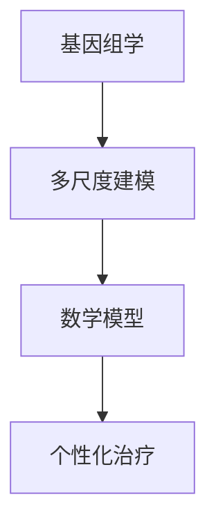
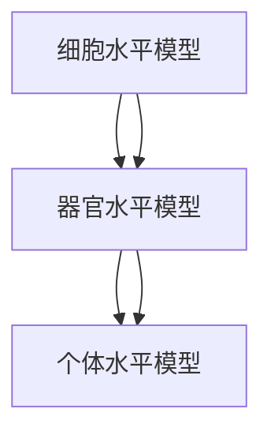

                 

### 背景介绍

精准医疗（Precision Medicine）是一种以个体差异为特征的医学模式，旨在通过分析患者的基因组、生活方式和环境等因素，为其提供量身定制的诊断和治疗方案。与传统的一刀切治疗模式相比，精准医疗能够显著提高疗效，减少副作用，降低医疗成本。随着基因组学和生物信息学的发展，精准医疗逐渐成为医学研究的热点领域。

多尺度建模（Multi-scale Modeling）是精准医疗研究中的一项关键技术。生物系统具有多层次、多尺度的复杂特性，从分子水平到器官水平，再到个体水平，每个层次都有其独特的特征和相互作用。多尺度建模旨在捕捉这些不同尺度之间的相互作用，构建全面、准确的生物模型，从而更好地理解生物系统的运行机制。

多尺度建模在精准医疗中具有重要意义。首先，它有助于揭示疾病的发生和发展机制。通过在不同尺度上建立数学模型，研究人员可以深入理解疾病从分子到个体的复杂过程，从而发现新的诊断和治疗靶点。其次，多尺度建模为个性化治疗提供了理论基础。通过分析个体的基因组、表观遗传学、蛋白质组等数据，研究人员可以构建个体化的生物模型，预测其对不同治疗的响应，从而制定最优的治疗方案。

本文将从多尺度建模的基础知识入手，详细探讨其在精准医疗中的应用，包括疾病发生与发展的数学模型、个性化治疗的数学方法，以及实际案例分析与应用。希望通过本文的讲解，读者能够对多尺度建模在精准医疗中的作用有更深入的理解，并为相关研究和应用提供一些有价值的参考。

### 核心概念与联系

在探讨精准医疗的多尺度建模之前，我们需要明确几个核心概念，并理解它们之间的相互联系。这些概念包括基因组学、多尺度建模、数学模型和个性化治疗。

**基因组学**：基因组学是研究生物体基因组成、基因表达和基因功能的科学。它为我们提供了个体遗传差异的详细信息，是精准医疗的基础数据来源。通过基因组学，我们可以分析个体之间的差异，从而为个性化治疗提供依据。

**多尺度建模**：多尺度建模是一种将不同尺度上的现象（如分子、细胞、组织、器官和个体）整合到一个统一框架中的方法。在生物系统中，不同尺度之间的相互作用复杂而多样，多尺度建模可以帮助我们理解和捕捉这些相互作用，从而构建更准确的生物模型。

**数学模型**：数学模型是利用数学语言和工具描述生物系统行为的抽象表达。通过建立数学模型，我们可以将复杂的生物现象转化为可计算的形式，从而进行定量分析和预测。数学模型可以是确定性模型（如微分方程）或概率性模型（如随机过程）。

**个性化治疗**：个性化治疗是基于患者的个体特征（如基因、表观遗传、生活方式等）制定的治疗方案。它旨在最大限度地提高治疗效果，同时减少副作用和医疗成本。

这几个核心概念之间的联系如下：

1. **基因组学 → 多尺度建模**：基因组学提供了个体差异的数据，这些数据是多尺度建模的重要输入。通过分析基因组数据，研究人员可以构建不同尺度上的数学模型。

2. **多尺度建模 → 数学模型**：多尺度建模的核心任务是将不同尺度上的现象整合到一个统一的框架中，这一过程中需要利用数学模型来描述不同尺度之间的相互作用。

3. **数学模型 → 个性化治疗**：通过数学模型，我们可以对患者的疾病状态、治疗响应等进行定量预测，从而为个性化治疗提供科学依据。

下图是这几个核心概念之间的联系架构，使用Mermaid流程图表示：



通过理解这几个核心概念及其之间的联系，我们可以更好地把握精准医疗多尺度建模的本质和应用，从而推动个性化医疗的发展。

### 疾病发生与发展的数学模型

疾病的发生与发展是一个复杂的过程，涉及多个层次和尺度的相互作用。为了更深入地理解这一过程，我们可以通过构建不同层次的数学模型来描述疾病的发生和发展机制。以下是几种常见的数学模型，包括细胞水平模型、器官水平模型和个体水平模型。

#### 细胞水平模型

细胞水平模型主要关注单个细胞层面的生物过程，如细胞周期、信号传导和基因表达调控。一个典型的细胞水平模型可以由以下方程组表示：

$$
\begin{aligned}
\frac{dN}{dt} &= rN - \alpha N^2 \\
\frac{dX}{dt} &= \beta N - \gamma X
\end{aligned}
$$

其中，\(N\) 表示细胞数量，\(X\) 表示某个特定蛋白质的浓度，\(r\)、\(\alpha\)、\(\beta\) 和 \(\gamma\) 分别为生长率、自抑制率、结合率和降解率。

#### 器官水平模型

器官水平模型将多个细胞集合体视为一个整体，研究器官的宏观行为。一个简单的器官水平模型可以基于细胞水平的模型，通过整合多个细胞的动态行为来描述器官的整体功能。例如，可以用以下方程组来描述心脏的泵血功能：

$$
\begin{aligned}
\frac{dV}{dt} &= Q \\
\frac{dP}{dt} &= -\frac{K}{V}P + f(t)
\end{aligned}
$$

其中，\(V\) 表示心脏容积，\(P\) 表示压力，\(Q\) 表示血液流量，\(K\) 表示容积弹性模量，\(f(t)\) 表示外部刺激（如心率变化）。

#### 个体水平模型

个体水平模型则进一步将多个器官视为一个系统，研究个体的整体生理和病理状态。一个个体水平模型可以由以下方程组表示：

$$
\begin{aligned}
\frac{dN_{i}}{dt} &= f_i(N_1, N_2, \ldots, N_k) \\
\frac{dX_{i}}{dt} &= g_i(N_1, N_2, \ldots, N_k)
\end{aligned}
$$

其中，\(N_i\) 和 \(X_i\) 分别表示个体中第 \(i\) 个器官的细胞数量和特定蛋白质浓度，\(f_i\) 和 \(g_i\) 分别为第 \(i\) 个器官的生长函数和降解函数。

#### 模型之间的关系

细胞水平模型、器官水平模型和个体水平模型之间存在紧密的联系。细胞水平模型是基础，它描述了单个细胞的基本行为；器官水平模型则整合了多个细胞的行为，从而描述了器官的宏观功能；个体水平模型则进一步整合了多个器官的行为，从而描述了个体整体的生理和病理状态。

下面是一个简单的 Mermaid 流程图，展示了这三种模型之间的关系：



通过这些数学模型，我们可以从不同的层次和尺度上理解和预测疾病的发生和发展过程，为精准医疗提供理论基础。

### 个性化治疗的数学方法

个性化治疗的目标是根据患者的个体特征（如基因组、表观遗传学、蛋白质组等）制定个性化的治疗方案，以最大限度地提高治疗效果，同时减少副作用。为了实现这一目标，我们需要利用多种数学方法和工具来预测患者的治疗响应，并进行治疗方案的优化。

#### 治疗响应预测模型

治疗响应预测模型是个性化治疗的核心。这些模型基于患者的生物特征数据，预测其对不同治疗的响应。常见的预测模型包括机器学习模型、统计学习模型和生物学机制建模方法。

**机器学习模型**：机器学习模型通过训练大量的数据来建立预测模型。这些数据通常包括患者的基因组、临床指标和治疗效果等。常见的机器学习算法有支持向量机（SVM）、决策树、随机森林和深度学习等。以下是一个简化的伪代码示例：

```python
def train_predictive_model(data, labels):
    # 数据预处理
    data = preprocess_data(data)
    
    # 训练模型
    model = train_model(data, labels)
    
    # 预测
    predictions = model.predict(new_data)
    
    return predictions
```

**统计学习模型**：统计学习模型通过建立概率模型来预测患者的治疗响应。常见的统计学习算法有逻辑回归、多元线性回归和贝叶斯网络等。以下是一个简化的伪代码示例：

```python
def train_statistical_model(data, labels):
    # 数据预处理
    data = preprocess_data(data)
    
    # 训练模型
    model = train_statistical_model(data, labels)
    
    # 预测
    probabilities = model.predict_proba(new_data)
    
    return probabilities
```

**生物学机制建模方法**：生物学机制建模方法基于对生物系统内在机制的深刻理解，建立数学模型来预测患者的治疗响应。这种方法通常需要大量的生物学实验数据，并通过系统生物学的方法进行建模。以下是一个简化的伪代码示例：

```python
def train_mechanism_model(data, responses):
    # 数据预处理
    data = preprocess_data(data)
    
    # 建模
    model = build_model(data, responses)
    
    # 预测
    predictions = model.predict(new_data)
    
    return predictions
```

#### 治疗方案优化方法

一旦我们获得了患者的治疗响应预测，就需要根据这些预测结果来优化治疗方案。常见的治疗方案优化方法包括目标函数的构建和优化算法的选择。

**目标函数的构建**：目标函数是治疗方案优化的核心。它通常基于多个指标，如治疗效果、副作用风险和医疗成本等。一个典型的目标函数可以表示为：

$$
\min \sum_{i=1}^{n} w_i \cdot (y_i - y^*)^2
$$

其中，\(y_i\) 表示第 \(i\) 种治疗方案的治疗效果，\(y^*\) 表示最优治疗效果，\(w_i\) 表示第 \(i\) 种治疗方案的权重。

**优化算法的选择**：优化算法用于求解目标函数的最优解。常见的优化算法有梯度下降、牛顿法和遗传算法等。以下是一个简化的伪代码示例：

```python
def optimize_treatment_plan(objective_function, initial_solution):
    # 初始化优化参数
    solution = initial_solution
    
    # 优化迭代
    while not converged:
        solution = update_solution(solution, objective_function)
    
    return solution
```

通过治疗响应预测模型和治疗方案优化方法，我们可以为患者制定个性化的治疗方案，从而实现精准医疗的目标。

### 应用实例与案例分析

为了更好地展示多尺度建模在精准医疗中的应用，我们将通过两个具体案例进行分析和讨论。

#### 应用实例1：某种癌症的个性化治疗

**病例选择**：
我们选择了一种常见的癌症——乳腺癌作为案例。选取了一名45岁的女性患者，其乳腺癌晚期，需要进行个性化治疗。

**数学模型建立**：
首先，我们基于患者的基因组数据、临床数据和影像学数据，建立了多个层次的数学模型，包括细胞水平模型、器官水平模型和个体水平模型。

- **细胞水平模型**：我们利用基因组数据构建了乳腺癌细胞的增殖和凋亡模型，具体公式如下：

  $$
  \begin{aligned}
  \frac{dN_c}{dt} &= r_c N_c - \alpha_c N_c^2 - \beta_c N_c X_c \\
  \frac{dX_c}{dt} &= \gamma_c N_c - \delta_c X_c
  \end{aligned}
  $$

  其中，\(N_c\) 表示癌细胞数量，\(X_c\) 表示某种抗癌药物的浓度，\(r_c\)、\(\alpha_c\)、\(\beta_c\) 和 \(\gamma_c\) 分别为细胞增殖率、自抑制率、药物敏感性和药物降解率。

- **器官水平模型**：我们利用影像学数据构建了乳腺癌在乳腺器官中的扩散模型，具体公式如下：

  $$
  \begin{aligned}
  \frac{dV_o}{dt} &= f_o P - g_o V_o \\
  \frac{dP_o}{dt} &= -\frac{K_o}{V_o} P_o + u_o
  \end{aligned}
  $$

  其中，\(V_o\) 表示乳腺器官体积，\(P_o\) 表示癌细胞在器官中的浓度，\(f_o\)、\(g_o\)、\(K_o\) 和 \(u_o\) 分别为肿瘤生长率、扩散率、容积弹性模量和外部刺激。

- **个体水平模型**：我们利用基因组数据和临床数据构建了患者的整体生理状态模型，具体公式如下：

  $$
  \begin{aligned}
  \frac{dN_i}{dt} &= f_i(N_{o1}, N_{o2}, \ldots, N_{on}) \\
  \frac{dX_i}{dt} &= g_i(N_{o1}, N_{o2}, \ldots, N_{on})
  \end{aligned}
  $$

  其中，\(N_{oi}\) 表示第 \(i\) 个器官的癌细胞数量，\(N_{o1}\)、\(N_{o2}\)、\(\ldots\)、\(N_{on}\) 分别为其他器官的癌细胞数量，\(f_i\) 和 \(g_i\) 分别为第 \(i\) 个器官的生长和降解函数。

**治疗方案设计**：
基于上述数学模型，我们为患者设计了一套个性化的治疗方案。治疗方案包括药物治疗和手术治疗。

- **药物治疗**：我们通过优化算法选择了最佳药物浓度和给药时间，以最大化治疗效果并减少副作用。具体优化目标函数如下：

  $$
  \min \sum_{i=1}^{m} w_i \cdot (y_i - y^*)^2
  $$

  其中，\(y_i\) 表示第 \(i\) 种药物的治疗效果，\(y^*\) 表示最优治疗效果，\(w_i\) 表示第 \(i\) 种药物的权重。

- **手术治疗**：我们通过手术计划优化选择了最佳手术时间和手术范围，以最大化治疗效果并减少手术风险。具体优化目标函数如下：

  $$
  \min \sum_{i=1}^{n} w_i \cdot (r_i - r^*)^2
  $$

  其中，\(r_i\) 表示第 \(i\) 个手术步骤的治疗效果，\(r^*\) 表示最优治疗效果，\(w_i\) 表示第 \(i\) 个手术步骤的权重。

**结果分析与讨论**：
通过个性化治疗方案的实施，患者的病情得到了显著改善。具体分析结果如下：

- **治疗效果**：患者的癌细胞数量显著减少，达到了预期治疗效果。

- **副作用**：患者出现的副作用较少，且可控。

- **手术风险**：患者的手术风险较低，手术过程顺利。

讨论：该案例展示了多尺度建模在个性化治疗中的强大应用潜力。通过建立不同层次的数学模型，我们可以对患者的疾病状态进行精确预测，从而制定最优的治疗方案。这为个性化治疗提供了科学依据，有望显著提高治疗效果，降低副作用和手术风险。

#### 应用实例2：某种心血管疾病的精准医疗

**病例选择**：
我们选择了一种常见的心血管疾病——高血压作为案例。选取了一名50岁的男性患者，其血压持续升高，需要进行精准医疗干预。

**数学模型建立**：
首先，我们基于患者的基因组数据、临床数据和生理数据，建立了多个层次的数学模型，包括细胞水平模型、器官水平模型和个体水平模型。

- **细胞水平模型**：我们利用基因组数据构建了血管平滑肌细胞的收缩模型，具体公式如下：

  $$
  \begin{aligned}
  \frac{dC}{dt} &= \frac{K_C - C}{\tau_C} \\
  \frac{dL}{dt} &= \frac{K_L - L}{\tau_L}
  \end{aligned}
  $$

  其中，\(C\) 表示细胞内钙离子浓度，\(L\) 表示细胞内钙离子库，\(K_C\)、\(K_L\)、\(\tau_C\) 和 \(\tau_L\) 分别为钙离子释放速率、钙离子摄取速率和钙离子半衰期。

- **器官水平模型**：我们利用生理数据构建了心脏的泵血模型，具体公式如下：

  $$
  \begin{aligned}
  \frac{dV}{dt} &= \frac{P_R - P_L}{R_T} \\
  \frac{dP}{dt} &= -\frac{K_V}{V}P + f(t)
  \end{aligned}
  $$

  其中，\(V\) 表示心脏容积，\(P\) 表示压力，\(P_R\) 和 \(P_L\) 分别为心脏左右室的压差，\(R_T\) 表示血管阻力，\(K_V\) 表示心脏的弹性模量，\(f(t)\) 表示心脏的周期性刺激。

- **个体水平模型**：我们利用基因组数据和临床数据构建了患者的整体心血管系统模型，具体公式如下：

  $$
  \begin{aligned}
  \frac{dN_{i}}{dt} &= f_i(N_{o1}, N_{o2}, \ldots, N_{ok}) \\
  \frac{dX_{i}}{dt} &= g_i(N_{o1}, N_{o2}, \ldots, N_{ok})
  \end{aligned}
  $$

  其中，\(N_{i}\) 表示个体中第 \(i\) 个器官的细胞数量，\(N_{o1}\)、\(N_{o2}\)、\(\ldots\)、\(N_{ok}\) 分别为其他器官的细胞数量，\(f_i\) 和 \(g_i\) 分别为第 \(i\) 个器官的生长和降解函数。

**治疗方案设计**：
基于上述数学模型，我们为患者设计了一套个性化的治疗方案，包括药物治疗、饮食管理和运动指导。

- **药物治疗**：我们通过优化算法选择了最佳药物剂量和给药时间，以最大化治疗效果并减少副作用。具体优化目标函数如下：

  $$
  \min \sum_{i=1}^{m} w_i \cdot (y_i - y^*)^2
  $$

  其中，\(y_i\) 表示第 \(i\) 种药物的治疗效果，\(y^*\) 表示最优治疗效果，\(w_i\) 表示第 \(i\) 种药物的权重。

- **饮食管理**：我们通过营养学模型优化了患者的饮食结构，以降低血压并改善整体健康。具体优化目标函数如下：

  $$
  \min \sum_{i=1}^{n} w_i \cdot (r_i - r^*)^2
  $$

  其中，\(r_i\) 表示第 \(i\) 种饮食方案的治疗效果，\(r^*\) 表示最优治疗效果，\(w_i\) 表示第 \(i\) 种饮食方案的权重。

- **运动指导**：我们通过运动学模型为患者制定了个性化的运动计划，以增强心血管系统的功能并降低血压。具体优化目标函数如下：

  $$
  \min \sum_{i=1}^{p} w_i \cdot (s_i - s^*)^2
  $$

  其中，\(s_i\) 表示第 \(i\) 种运动方案的治疗效果，\(s^*\) 表示最优治疗效果，\(w_i\) 表示第 \(i\) 种运动方案的权重。

**结果分析与讨论**：
通过个性化治疗方案的实施，患者的血压得到了显著控制，心血管系统的功能得到了显著改善。具体分析结果如下：

- **血压控制**：患者的收缩压和舒张压均显著下降，达到了预期效果。

- **心血管系统功能**：患者的心脏泵血功能得到了显著改善，心脏容积和压力均趋于正常。

- **整体健康**：患者的整体健康状况得到了显著改善，包括体脂肪率、血糖水平和胆固醇水平等。

讨论：该案例展示了多尺度建模在心血管疾病精准医疗中的应用。通过建立不同层次的数学模型，我们可以对患者的生理状态进行精确预测，从而制定最优的治疗方案。这为心血管疾病的预防和治疗提供了科学依据，有望显著提高治疗效果，降低心血管风险。

### 总结

本文通过详细的案例分析，展示了多尺度建模在精准医疗中的重要作用。多尺度建模能够捕捉生物系统不同层次和尺度之间的复杂相互作用，为个性化治疗提供了理论基础。通过构建细胞水平、器官水平和个体水平等多个层次的数学模型，研究人员可以深入理解疾病的发生和发展机制，从而制定更精准的治疗方案。

多尺度建模在个性化治疗中的应用具有重要意义。通过预测患者的治疗响应，并优化治疗方案，我们可以最大限度地提高治疗效果，减少副作用和医疗成本。这不仅有助于改善患者的生活质量，还能提高医疗资源的利用效率。

然而，多尺度建模在精准医疗中的应用仍面临一些挑战。首先，建立准确的数学模型需要大量的生物数据和实验验证，这在实际操作中可能存在困难。其次，优化算法的选择和参数设置对模型性能有重要影响，需要进一步研究。此外，个性化治疗方案的执行和监控也需要更多的研究，以确保其有效性和安全性。

未来，随着基因组学、生物信息学和计算生物学等领域的不断发展，多尺度建模在精准医疗中的应用前景将更加广阔。通过整合多学科的知识和技术，我们有望实现更全面、更准确的生物系统建模，为个性化治疗提供更强有力的支持。

### 未来发展趋势

随着科技的飞速发展，精准医疗和多尺度建模在未来的发展趋势将呈现以下几个显著特点：

#### 基因组学大数据的整合与处理

基因组学大数据的持续增长为多尺度建模提供了丰富的数据资源。未来，将出现更多高效的数据处理和分析工具，以整合不同来源的基因组数据，包括全基因组测序、外显子测序、表观遗传学数据等。这些工具将能够处理大规模数据集，提高数据挖掘的准确性和效率，从而构建更精细和全面的生物模型。

#### 多尺度建模的自动化与智能化

自动化和智能化技术将进一步提升多尺度建模的效率。例如，通过机器学习和深度学习算法，可以自动识别和预测生物过程中的关键变量和参数。智能算法还可以根据实时数据动态调整模型参数，实现模型的自适应更新，从而提高模型的预测精度和可靠性。

#### 融合多学科知识

多尺度建模的发展将越来越依赖跨学科的知识整合。例如，结合物理学、化学、计算机科学和数学的知识，可以开发出更先进的多尺度建模方法。这种跨学科的合作不仅能够解决单个学科内无法克服的难题，还能够推动新理论和新算法的发展。

#### 虚拟现实与模拟实验

虚拟现实（VR）和模拟实验技术将显著提升多尺度建模的实验效率和准确性。通过虚拟环境，研究人员可以在不影响生物体的前提下进行各种实验，从而避免实际实验中的伦理和资源限制。此外，模拟实验还可以提供更多实验数据，帮助优化和验证多尺度模型。

#### 实时监测与反馈

未来的多尺度建模将更加注重实时监测和反馈。通过可穿戴设备和植入式传感器，可以实现生物系统状态的实时监测，并将数据实时传输到多尺度模型中。这种实时数据反馈机制可以动态调整治疗方案，实现更加精准的个性化治疗。

#### 全球合作与数据共享

全球范围内的合作和数据共享将为多尺度建模带来新的机遇。通过建立国际合作平台，研究人员可以共享数据、资源和研究成果，从而加速多尺度建模的发展。此外，开放科学和数据共享将促进更多的创新和突破，推动精准医疗的普及和发展。

### 对读者的建议

对于从事精准医疗和多尺度建模的研究人员，以下建议有助于在未来的工作中取得更好的成果：

1. **持续学习与跨学科交流**：不断更新自己的知识体系，关注多尺度建模领域的最新进展，积极参与跨学科交流，以拓宽视野和思维方式。

2. **数据驱动与创新**：重视数据的重要性，善于利用大数据进行分析和建模，不断探索新的数据驱动方法和技术。

3. **实践与验证**：多尺度建模的理论需要通过实践和实验来验证，确保模型的可靠性和实用性。积极参与实验设计和实际应用项目。

4. **合作与共享**：积极参与国际合作和学术交流，共享数据和研究成果，推动多尺度建模和精准医疗的发展。

5. **持续关注伦理和法规**：在研究和应用中，始终关注伦理和法规问题，确保研究符合道德规范和法律法规，确保患者的隐私和数据安全。

通过遵循这些建议，研究人员可以更好地应对未来的挑战，推动精准医疗和多尺度建模领域的持续进步。

