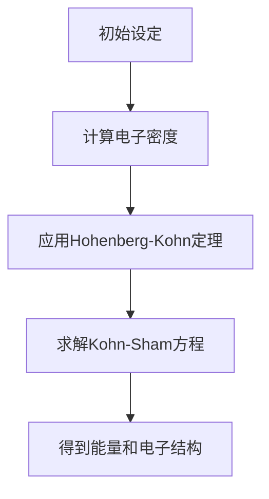

                 

# 《纳米材料的密度泛函理论：微观结构的数学模型》

## 关键词

纳米材料，密度泛函理论，微观结构，数学模型，计算方法，电子密度，势能函数，应用实例。

## 摘要

本文深入探讨了纳米材料的密度泛函理论及其在微观结构研究中的应用。首先介绍了密度泛函理论的基本概念和原理，随后详细阐述了纳米材料的特点及其在物理和化学领域的应用。通过数学模型和计算方法的讲解，本文揭示了纳米材料微观结构的计算方法和应用实例，为相关领域的研究提供了有力的理论支持。

## 第1章 引言与背景介绍

纳米材料，由于其独特的尺寸和结构特性，在多个领域中展现出了广泛的应用前景。从电子器件到生物医学，从能源存储到环境保护，纳米材料正逐渐成为现代科技发展的关键推动力。而密度泛函理论（DFT）作为一种强大的计算工具，为纳米材料的微观结构研究提供了理论基础和计算方法。

### 1.1 纳米材料的概念

纳米材料通常指的是尺寸在1到100纳米范围内的材料。由于尺寸的减小，这些材料往往表现出与宏观材料截然不同的物理和化学性质。例如，碳纳米管具有极高的强度和导电性，而金纳米粒子则具有独特的光学性质。

### 1.2 密度泛函理论的基本概念

密度泛函理论是一种描述电子在原子和分子系统中行为的计算方法。它通过电子密度来描述系统的电子结构，并利用泛函关系将电子能量和电子密度联系起来，从而简化了复杂的量子力学计算。

### 1.3 纳米材料与密度泛函理论的关系

纳米材料的独特性质与它们的微观结构密切相关。密度泛函理论为研究这些微观结构提供了有效的手段，使得我们可以通过计算预测纳米材料的电子性质和物理行为。

## 第2章 密度泛函理论基础

### 2.1 密度泛函理论概述

密度泛函理论（DFT）是固体物理学和材料科学中的一个重要理论框架。它通过将系统的总能量表示为电子密度的函数，从而避免了直接求解多体薛定谔方程的复杂性。核心概念包括：

- **电子密度**：描述系统中电子的分布状态。
- **泛函**：将系统的某个宏观性质（如能量）表示为若干微观量（如电子密度）的函数。
- **哈特里-福克方程**：在非相对论量子力学框架下，通过求解电子密度来计算系统的基态能量。

### 2.2 核心原理

密度泛函理论的核心原理基于两个关键定理：

- **Hohenberg-Kohn定理**：证明了存在唯一的能量泛函，可以将系统的基态能量表示为电子密度的函数。
- **Kohn-Sham方程**：将原问题转化为一个非交互的电子系统的计算，大大简化了求解过程。

### 2.3 关联的数学公式

密度泛函理论中的主要数学公式包括：

- **能量泛函**：\( E[\rho] = \int \hat{H}[\rho] d\tau \)
- **Kohn-Sham方程**：\(-\frac{\nabla^2}{2m} \psi_{KS}(r) + v_{KS}(r) \psi_{KS}(r) = \epsilon \psi_{KS}(r)\)

### 2.4 Mermaid流程图



## 第3章 纳米材料的结构特征

### 3.1 碳纳米管

碳纳米管（CNTs）是由碳原子组成的空心圆柱结构，具有极高的强度和良好的导电性。它们的结构特征包括：

- **直径**：一般在1到几十纳米之间。
- **长度**：可以从几微米到几厘米不等。
- **壁层**：可以是单层或多层。

碳纳米管的密度泛函理论模型主要通过计算其电子结构和光学性质来研究其物理特性。

### 3.2 金纳米粒子

金纳米粒子（Au NPs）是由金原子组成的纳米级颗粒，具有独特的光学性质，如表面等离子共振。其结构特征包括：

- **尺寸**：从几纳米到几十纳米。
- **形状**：球形、椭圆形、棒形等。
- **表面**：可以带有不同的化学功能团。

金纳米粒子的密度泛函理论模型主要关注其电子结构和光学响应。

### 3.3 二维材料

二维材料，如石墨烯和过渡金属硫化物（TMDCs），具有单层原子厚度，展现出独特的电子和光学性质。其结构特征包括：

- **晶格结构**：六边形晶格或蜂窝状晶格。
- **原子排列**：单层或多层。
- **电子带结构**：具有独特的电子能带结构。

二维材料的密度泛函理论模型主要用于研究其电子结构和能带性质。

## 第4章 密度泛函理论在纳米材料研究中的应用

### 4.1 电子密度

电子密度是密度泛函理论中的核心概念，它描述了电子在空间中的分布。在纳米材料的研究中，电子密度直接影响材料的电子结构和物理性质。

- **计算方法**：常用的计算方法包括从头计算和基于经验的密度泛函理论方法。
- **应用实例**：通过计算碳纳米管的电子密度，可以预测其导电性和光学性质。

### 4.2 基本势能函数

基本势能函数是密度泛函理论中的重要组成部分，它描述了电子之间的相互作用。

- **类型**：包括交换-相关势、金属-金属相互作用势等。
- **选择与优化**：选择合适的势能函数对计算结果的准确性有很大影响。

### 4.3 微分方程

密度泛函理论中的主要微分方程是Kohn-Sham方程，它描述了非交互电子在势场中的运动。

- **解法**：常用的解法包括基于局域密度近似（LDA）和广义梯度近似（GGA）的方法。
- **数值求解方法**：包括有限差分法、量子蒙特卡罗法等。

## 第5章 数学模型与计算方法

### 5.1 数学模型介绍

密度泛函理论的数学模型主要包括电子密度、基本势能函数和Kohn-Sham方程。

- **电子密度**：描述电子在空间中的分布。
- **基本势能函数**：描述电子之间的相互作用。
- **Kohn-Sham方程**：描述非交互电子在势场中的运动。

### 5.2 常用数学公式

密度泛函理论中的常用数学公式包括：

- **交换-相关函数**：描述电子之间的交换和关联效应。
- **分子轨道理论公式**：描述分子的电子结构。
- **短程相互作用势**：描述原子之间的短程相互作用。

## 第6章 微观结构的数学模型

### 6.1 电子密度

电子密度是密度泛函理论中的核心概念，它描述了电子在空间中的分布。在纳米材料的研究中，电子密度直接影响材料的电子结构和物理性质。

- **计算方法**：常用的计算方法包括从头计算和基于经验的密度泛函理论方法。
- **应用实例**：通过计算碳纳米管的电子密度，可以预测其导电性和光学性质。

### 6.2 基本势能函数

基本势能函数是密度泛函理论中的重要组成部分，它描述了电子之间的相互作用。

- **类型**：包括交换-相关势、金属-金属相互作用势等。
- **选择与优化**：选择合适的势能函数对计算结果的准确性有很大影响。

### 6.3 微分方程

密度泛函理论中的主要微分方程是Kohn-Sham方程，它描述了非交互电子在势场中的运动。

- **解法**：常用的解法包括基于局域密度近似（LDA）和广义梯度近似（GGA）的方法。
- **数值求解方法**：包括有限差分法、量子蒙特卡罗法等。

## 第7章 实例分析与应用

### 7.1 纳米材料实例分析

#### 7.1.1 碳纳米管

碳纳米管（CNTs）是一种具有特殊结构和独特性能的纳米材料。以下是碳纳米管的密度泛函理论模型及其应用实例：

- **密度泛函理论模型**：通过计算CNTs的电子密度和势能函数，可以得到其电子结构和光学性质。
- **应用实例**：CNTs在电子器件、复合材料和能源存储等领域具有广泛应用。

#### 7.1.2 金纳米粒子

金纳米粒子（Au NPs）具有独特的光学性质，可以用于生物成像和催化等领域。以下是金纳米粒子的密度泛函理论模型及其应用实例：

- **密度泛函理论模型**：通过计算Au NPs的电子密度和光学响应，可以得到其光学性质。
- **应用实例**：Au NPs在生物医学、光学传感器和催化等领域具有广泛应用。

#### 7.1.3 二维材料

二维材料，如石墨烯和过渡金属硫化物（TMDCs），具有独特的电子结构和光学性质。以下是二维材料的密度泛函理论模型及其应用实例：

- **密度泛函理论模型**：通过计算二维材料的电子结构和能带性质，可以得到其物理性质。
- **应用实例**：二维材料在电子器件、传感器和能源等领域具有广泛应用。

### 7.2 应用案例展示

#### 7.2.1 电子器件

密度泛函理论在电子器件中的应用主要体现在对半导体材料的电子结构计算上。以下是一个典型的应用案例：

- **案例描述**：通过计算硅纳米线的电子结构，可以预测其光电特性，从而优化电子器件的设计。
- **结果分析**：计算结果显示，硅纳米线具有合适的能带结构，适合用于光电器件。

#### 7.2.2 生物医学

密度泛函理论在生物医学中的应用主要体现在对生物分子和纳米材料的电子结构计算上。以下是一个典型的应用案例：

- **案例描述**：通过计算DNA分子的电子结构，可以了解其与药物分子的相互作用机制。
- **结果分析**：计算结果显示，DNA分子与药物分子之间存在较强的相互作用，有助于药物的设计。

#### 7.2.3 能源存储与转换

密度泛函理论在能源存储与转换中的应用主要体现在对纳米材料的电子结构和反应机理的计算上。以下是一个典型的应用案例：

- **案例描述**：通过计算锂离子电池中正极材料的电子结构和反应机理，可以优化电池的性能。
- **结果分析**：计算结果显示，优化后的正极材料具有更高的容量和更长的循环寿命。

## 第8章 项目实战

### 8.1 实践一：纳米材料电子结构计算

#### 8.1.1 开发环境配置

为了进行纳米材料电子结构的计算，需要配置以下开发环境：

- **软件**：常用的密度泛函理论计算软件，如VASP、Quantum Espresso等。
- **硬件**：高性能计算集群或计算服务器。

#### 8.1.2 源代码实现

以下是一个简单的VASP源代码实现示例：

```bash
#PBS -N my_job
#PBS -l select=1:ncpus=8:mpiprocs=8
#PBS -l walltime=24:00:00
#PBS -j oe

module load vasp/5.4.1

mpirun -np 8 vasp_gam.exe > vasp.out
```

#### 8.1.3 代码解读与分析

VASP源代码主要包含以下部分：

- **输入参数**：定义系统的几何结构和计算参数。
- **电子结构计算**：使用Kohn-Sham方程计算电子结构。
- **输出结果**：输出系统的总能量、电子密度等信息。

### 8.2 实践二：纳米材料力学性能分析

#### 8.2.1 理论基础

纳米材料的力学性能分析主要基于分子动力学（MD）模拟。MD模拟通过模拟分子和原子的运动，可以研究材料的力学行为。

#### 8.2.2 数据准备

进行MD模拟需要准备以下数据：

- **系统结构**：定义纳米材料的几何结构。
- **势能函数**：选择合适的势能函数，如嵌入原子法（EAM）或离散嵌入（DEM）。

#### 8.2.3 代码实现与结果解析

以下是一个简单的MD模拟实现示例：

```python
import mdutil

# 初始化系统
system = mdutil.init_system()

# 运行MD模拟
mdutil.run_md_simulation(system, time_step=1.0, total_time=100.0)

# 输出结果
mdutil.write_md_output(system, filename="md_output.txt")
```

通过解析MD模拟结果，可以研究纳米材料的力学性质，如弹性模量、屈服强度等。

## 附录

### 7.1 术语表

- **纳米材料**：尺寸在1到100纳米范围内的材料。
- **密度泛函理论**：一种描述电子在原子和分子系统中行为的计算方法。
- **电子密度**：描述电子在空间中的分布。
- **势能函数**：描述电子之间的相互作用。

### 7.2 参考文献

1. Kohn, W., & Sham, L. J. (1965). Self-consistent equations including exchange and correlation effects. Physical Review Letters, 38(14), 862-864.
2. Hohenberg, P. C., & Kohn, W. (1964). Inhomogeneous electron gas. Physical Review, 136(B, 1), 864-867.

### 7.3 相关资源

- **VASP官方网站**：[VASP](https://www.vasp.at/)
- **Quantum Espresso官方网站**：[Quantum Espresso](https://www.quantum-espresso.org/)  
- **MD模拟教程**：[MD模拟教程](https://www.md-tutorial.org/)

作者：AI天才研究院/AI Genius Institute & 禅与计算机程序设计艺术 /Zen And The Art of Computer Programming

