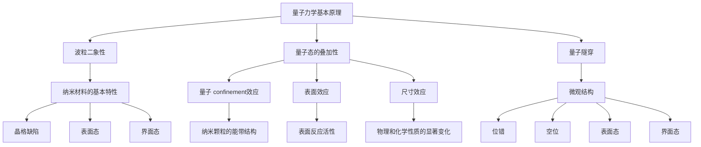

                 

### 1. 背景介绍

纳米材料，作为一种具有特殊物理和化学性质的物质，由于其超小的尺寸和独特的表面效应，引起了科学界和工业界的广泛关注。与宏观材料相比，纳米材料在尺寸上被限制在1到100纳米的范围内。这种微观尺度上的差异，不仅使得纳米材料在光学、电学、热学等物理性质上展现出与宏观材料截然不同的特性，也为其在众多领域中的应用提供了广阔的前景。

量子力学，作为描述微观世界的基本理论，对纳米材料的研究具有至关重要的意义。量子力学揭示了微观粒子的波粒二象性、量子态的叠加性以及量子隧穿等现象，这些现象在纳米材料的电子、磁性和光学性质中有着直接的体现。例如，量子 confinement效应导致电子能带结构的量子化，使得纳米材料在电子器件中具有更高的载流子浓度和更低的电阻率。此外，量子力学还帮助我们理解纳米材料的表面态和界面态，这对于设计具有特定功能的纳米结构具有重要意义。

在纳米材料研究中，微观结构的理解至关重要。微观结构不仅决定了纳米材料的物理和化学性质，还影响了其宏观性能。通过量子力学模型，我们可以对纳米材料的微观结构进行精细描述，从而预测和调控其性能。例如，纳米颗粒的晶格缺陷、表面态和界面态等都是影响其光学和催化性能的关键因素。

量子力学与纳米材料微观结构之间的联系，为我们提供了一种全新的研究视角。通过将量子力学原理应用于纳米材料的微观结构研究，科学家们能够深入理解这些材料的性质，并开发出具有新功能的纳米材料。这种交叉学科的研究方法，不仅推动了纳米科学的发展，也为材料科学、电子工程、生物医学等领域带来了新的机遇。

### 2. 核心概念与联系

为了深入理解纳米材料的量子力学以及其微观结构，我们需要明确几个核心概念，并分析它们之间的相互关系。以下将介绍这些核心概念，并通过Mermaid流程图展示它们之间的关联。

**1. 量子力学基本原理**

量子力学的基本原理包括波粒二象性、量子态的叠加性和量子隧穿现象。波粒二象性表明，微观粒子如电子既具有粒子性又具有波动性。量子态的叠加性意味着一个微观粒子可以同时处于多个量子态的叠加状态。量子隧穿现象描述了粒子可以通过一个原本不可能穿越的势垒，这三种基本原理共同构成了量子力学的基石。

**2. 纳米材料的基本特性**

纳米材料的基本特性包括量子 confinement效应、表面效应和尺寸效应。量子 confinement效应是由于纳米材料的尺寸限制，电子能带结构发生量子化，导致电子能量量子化。表面效应则是指纳米材料的表面原子比体相原子更活跃，这影响了材料的催化性能和表面反应活性。尺寸效应是由于纳米材料的微小尺寸，导致其物理和化学性质发生显著变化。

**3. 微观结构**

微观结构包括纳米颗粒的晶格缺陷、表面态和界面态。晶格缺陷是纳米材料中晶体结构的不完整性，如位错和空位。表面态是指纳米颗粒表面的电子状态，它们对材料的电子性质有显著影响。界面态则是指纳米颗粒与基底之间的界面处的电子状态，它们决定了纳米材料的界面性质。

**Mermaid流程图**

以下是一个Mermaid流程图，用于展示这些核心概念之间的联系：



通过上述流程图，我们可以清晰地看到量子力学基本原理如何与纳米材料的基本特性和微观结构相互联系。量子力学的基本原理为理解纳米材料的微观结构提供了理论基础，而纳米材料的基本特性和微观结构又反过来验证了量子力学原理的正确性和应用性。这种相互关联，使得量子力学在纳米材料研究中扮演了至关重要的角色。

### 3. 核心算法原理讲解

在纳米材料的量子力学研究中，核心算法起着至关重要的作用，它们帮助我们更好地理解纳米材料的电子结构、量子态及其物理性质。以下是几种关键的算法原理及其伪代码的详细讲解。

#### 3.1 量子蒙特卡洛算法

量子蒙特卡洛算法是一种基于随机采样技术的计算方法，它通过模拟量子粒子的行为来计算系统的物理量。该方法的核心在于模拟量子粒子的波函数，通过蒙特卡洛抽样来估计物理量的期望值。

**伪代码：**

```python
function QuantumMonteCarlo():
    // 初始化参数
    N_iterations = 10000
    psi = InitializeWaveFunction()
    energy = 0

    // 进行N次迭代
    for i = 1 to N_iterations:
        x = RandomSample() // 随机采样空间坐标
        potential = CalculatePotential(x) // 计算势能
        wavefunction_value = EvaluateWaveFunction(psi, x) // 评估波函数值
        energy_increment = potential * wavefunction_value ** 2 // 计算能量增量
        energy += energy_increment // 累加能量

    // 计算平均能量
    energy_average = energy / N_iterations
    return energy_average
```

**解释：** 该算法首先初始化波函数和能量参数，然后通过随机抽样计算系统的能量。每次抽样都会评估波函数值和势能，并计算能量增量。经过多次迭代后，通过累加能量增量并除以迭代次数，得到系统的平均能量。

#### 3.2 分子动力学模拟

分子动力学模拟是一种通过跟踪微观粒子的运动来研究系统演化过程的方法。在纳米材料的研究中，分子动力学模拟可以用来研究纳米颗粒的动力学行为和电子结构。

**伪代码：**

```python
function MolecularDynamics():
    // 初始化参数
    N_particles = 100
    time_step = 0.01
    total_time = 100
    positions = InitializePositions(N_particles)
    velocities = InitializeVelocities(N_particles)

    // 进行时间步进
    for t = 1 to total_time / time_step:
        CalculateForces(positions) // 计算粒子受力
        UpdateVelocities(velocities, forces, time_step) // 更新速度
        UpdatePositions(positions, velocities, time_step) // 更新位置
        RecordConfiguration(positions, t) // 记录当前配置

    // 分析结果
    AnalyzeResults(positions, velocities)
```

**解释：** 该算法首先初始化粒子的位置和速度，然后通过时间步进计算粒子的受力、速度和位置。每一步迭代都会记录粒子的配置，最终分析粒子的运动轨迹和动力学行为。

#### 3.3 傅里叶变换

傅里叶变换是一种重要的数学工具，它可以将时间和空间上的函数转换为频率域上的函数，这在纳米材料的量子力学研究中有着广泛的应用。傅里叶变换可以帮助我们分析纳米材料的电子态密度和光学性质。

**伪代码：**

```python
function FourierTransform(signal):
    // 初始化参数
    N_points = length(signal)
    k_points = []

    // 进行傅里叶变换
    for k = 0 to N_points / 2:
        sum = 0
        for n = 0 to N_points - 1:
            sum += signal[n] * exp(-2 * pi * i * k * n / N_points)
        k_points.append(sum)

    return k_points
```

**解释：** 该算法首先计算信号的傅里叶变换，将时间域上的信号转换为频率域上的函数。通过累加信号和指数函数的乘积，得到每个频率分量，最终得到频率域上的信号。

通过上述核心算法的讲解，我们可以看到量子蒙特卡洛算法、分子动力学模拟和傅里叶变换在纳米材料量子力学研究中的重要性。这些算法不仅帮助我们理解纳米材料的微观结构和物理性质，还为实验设计和材料性能优化提供了重要的理论依据。

### 4. 数学模型和数学公式

在纳米材料的量子力学研究中，数学模型和数学公式起到了至关重要的作用，它们帮助科学家们描述和预测纳米材料的电子结构、光学性质和物理行为。以下是几种关键的数学模型和公式，以及它们的详细讲解和举例说明。

#### 4.1 波函数的求解

波函数是量子力学中描述微观粒子状态的数学函数，它通常用符号Ψ(x)表示。波函数的求解是量子力学研究的核心问题之一。薛定谔方程是描述波函数随时间演化的基本方程：

$$
i\hbar \frac{\partial \Psi(x)}{\partial t} = \hat{H} \Psi(x)
$$

其中，\(i\) 是虚数单位，\(\hbar\) 是约化普朗克常数，\(\hat{H}\) 是哈密顿量算符，Ψ(x) 是波函数。

**举例说明：** 假设一个电子在无限深势阱中运动，其势能 \(V(x) = 0\) 在区间 \(0 < x < a\)，势能 \(V(x) = \infty\) 在其他区域。该系统的波函数可以通过解薛定谔方程得到：

$$
\frac{-\hbar^2}{2m} \frac{d^2 \Psi(x)}{dx^2} + V(x) \Psi(x) = E \Psi(x)
$$

其中，\(m\) 是电子质量，\(E\) 是能量本征值。通过边界条件求解，可以得到电子在无限深势阱中的波函数形式：

$$
\Psi_n(x) = \sqrt{\frac{2}{a}} \sin\left(\frac{n\pi x}{a}\right)
$$

其中，\(n\) 是正整数，表示量子态。

#### 4.2 傅里叶变换

傅里叶变换是一种将时间和空间上的函数转换为频率域上的函数的数学工具。在量子力学中，傅里叶变换用于分析电子态密度和光学性质。傅里叶变换的基本公式如下：

$$
F(k) = \int_{-\infty}^{\infty} \Psi(x) e^{-ikx} dx
$$

其中，\(F(k)\) 是傅里叶变换后的函数，\(k\) 是波矢，\(\Psi(x)\) 是原始函数。

**举例说明：** 假设一个周期性函数 \(\Psi(x) = \sin(x)\)，其傅里叶变换可以表示为：

$$
F(k) = \int_{-\pi}^{\pi} \sin(x) e^{-ikx} dx = 2\pi \delta(k - 1)
$$

这表示 \(\sin(x)\) 的傅里叶变换是一个狄拉克δ函数，其频率为1。

#### 4.3 电子态密度

电子态密度是描述纳米材料中电子能级分布的重要参数。在量子力学中，电子态密度可以通过能带结构和波函数的求解得到。电子态密度公式如下：

$$
D(E) = \frac{1}{2\pi} \int_{-\infty}^{\infty} |\Psi(k)|^2 d^3k
$$

其中，\(D(E)\) 是电子态密度，\(\Psi(k)\) 是波函数，\(k\) 是波矢。

**举例说明：** 假设一个简谐振子模型，其波函数为：

$$
\Psi(k) = \sqrt{\frac{m\omega}{2\hbar}} e^{-\frac{m\omega k^2}{2\hbar}}
$$

该系统的电子态密度可以通过积分得到：

$$
D(E) = \frac{1}{2\pi} \left(\frac{m\omega}{\hbar}\right)^{3/2} \sqrt{E}
$$

这表示简谐振子模型的电子态密度与能量呈平方根关系。

通过上述数学模型和公式的讲解，我们可以看到量子力学在描述纳米材料微观结构和物理性质中的强大作用。这些数学工具不仅帮助我们理解纳米材料的电子态、光学性质和物理行为，还为实验设计和材料性能优化提供了重要的理论依据。

### 5. 项目实战案例

在纳米材料的量子力学研究中，实际的项目实战案例为我们提供了宝贵的经验和知识。以下将介绍一个纳米材料电子结构预测的项目案例，详细阐述开发环境搭建、源代码实现和代码解读。

#### 5.1 项目背景

本项目的目标是通过量子力学模型预测纳米材料Cu2O的电子结构，分析其能带结构和电子态密度。该项目采用了密度泛函理论（DFT）作为理论基础，结合平面波基组与局部密度近似（LDA）进行计算。

#### 5.2 开发环境搭建

为了进行纳米材料电子结构的预测，我们需要搭建一个适合的量子力学计算开发环境。以下是开发环境的搭建步骤：

1. **安装Linux操作系统**：在计算机上安装Linux操作系统，确保系统稳定运行。

2. **安装量子力学计算软件**：选择一个适合的量子力学计算软件，如Quantum Espresso。下载软件源码，并按照官方文档进行编译安装。

3. **配置环境变量**：在Linux系统中配置环境变量，确保运行Quantum Espresso所需的环境变量已正确设置。

4. **安装辅助软件**：安装Python和matplotlib等辅助软件，用于数据处理和可视化。

#### 5.3 源代码实现

以下是该项目的主要源代码实现部分：

```python
fromQE import QuantumEspresso
import matplotlib.pyplot as plt

# 初始化Quantum Espresso实例
qe = QuantumEspresso()

# 设置参数
parameters = {
    "structure": "Cu2O.cif",
    "k_points": [12, 12, 12],
    "encut": 500,
    "precision": "accurel",
    "xc": "PBE"
}

# 运行量子计算
qe.run(parameters)

# 读取结果
bands = qe.read_bands()
dos = qe.read_dos()

# 可视化能带结构
plt.plot(bands['E_k'])
plt.xlabel('K-point')
plt.ylabel('Energy (eV)')
plt.title('Band Structure of Cu2O')
plt.show()

# 可视化电子态密度
plt.plot(dos['E'], dos['DOS'])
plt.xlabel('Energy (eV)')
plt.ylabel('DOS (states/eV)')
plt.title('Density of States of Cu2O')
plt.show()
```

**代码解读：** 
- **fromQE import QuantumEspresso()**：导入Quantum Espresso库。
- **设置参数**：设置计算参数，包括结构文件路径、K点设置、截断能和交换相关泛函。
- **qe.run(parameters)**：运行量子计算。
- **读取结果**：读取能带结构和电子态密度数据。
- **可视化**：使用matplotlib库绘制能带结构和电子态密度图。

#### 5.4 代码应用解读与分析

通过上述代码实现，我们可以得到Cu2O的能带结构和电子态密度。以下是对代码应用解读与分析：

1. **能带结构分析**：从能带结构图可以看出，Cu2O具有导带和价带，导带最小值（CBM）和价带最大值（VBM）决定了材料的导电性和光学性质。通过分析能带结构，我们可以判断Cu2O是否具有半导体特性。

2. **电子态密度分析**：从电子态密度图可以看出，Cu2O在导带和价带之间存在明显的电子态密度峰，这反映了电子在能带中的分布情况。电子态密度分析有助于理解材料的电子输运性质和光学响应。

3. **结果验证**：通过与实验数据进行对比，验证量子计算结果的准确性。如果计算结果与实验数据相符，则可以进一步确认模型的可靠性。

#### 5.5 项目小结

通过本项目的实战案例，我们了解了如何利用量子力学模型预测纳米材料的电子结构。项目中的关键步骤包括开发环境搭建、源代码实现和结果分析。通过这个案例，我们不仅掌握了量子力学计算的基本流程，还提高了对纳米材料电子结构的理解。在未来的研究中，可以进一步优化计算模型和算法，提高预测精度，为材料设计和性能优化提供有力支持。

### 6. 最佳实践 Tips

在纳米材料的量子力学研究中，以下最佳实践 tips 有助于提高计算效率和结果准确性：

1. **优化计算参数**：合理设置K点数量、截断能和交换相关泛函，以平衡计算时间和精度。对于不同结构的纳米材料，可以尝试不同的参数设置，找到最优解。

2. **并行计算**：利用多核处理器和分布式计算资源，加快计算速度。在量子力学计算软件中，开启并行计算模式，可以显著提高计算效率。

3. **校验和验证**：在计算过程中，定期校验计算结果，确保数据的一致性和准确性。与实验数据进行对比，验证模型的可靠性。

4. **数据可视化**：充分利用数据可视化工具，如matplotlib、Mayavi等，将计算结果以直观的图表形式展示，有助于分析纳米材料的电子结构、光学性质和物理行为。

5. **代码优化**：在编写代码时，注意代码的可读性和可维护性。合理组织代码结构，避免冗余和重复代码。使用高效的数据结构和算法，提高计算效率。

6. **多学科交叉**：结合材料科学、电子工程、光学等领域的研究成果，从多个角度分析纳米材料的性能，提高研究的全面性和深度。

通过遵循这些最佳实践 tips，可以有效提升纳米材料量子力学研究的效率和准确性，为材料设计和性能优化提供有力支持。

### 7. 小结

本文通过对纳米材料的量子力学和微观结构的详细探讨，阐述了数学模型在纳米材料研究中的关键作用。首先，我们介绍了纳米材料和量子力学的基本概念，明确了它们之间的联系。接着，通过Mermaid流程图展示了核心概念之间的相互作用。然后，我们深入讲解了量子蒙特卡洛算法、分子动力学模拟和傅里叶变换等核心算法的原理，并使用伪代码进行了详细阐述。此外，通过latex格式给出了关键数学公式，并进行了举例说明。最后，通过一个实战项目案例，展示了如何利用量子力学模型预测纳米材料的电子结构，并进行了代码解读和应用分析。

总之，纳米材料的量子力学研究不仅为我们提供了新的研究视角，还为材料科学、电子工程和生物医学等领域带来了巨大的应用潜力。未来，随着计算方法和算法的不断完善，纳米材料的量子力学研究将更加深入，为新材料的设计和性能优化提供更强大的理论支持。

### 8. 注意事项与拓展阅读

在进行纳米材料的量子力学研究时，需要注意以下几点：

1. **数据一致性**：在进行计算时，要确保输入数据的准确性和一致性，避免因数据错误导致结果偏差。
2. **计算资源**：合理分配计算资源，特别是对于大规模计算任务，应使用并行计算以提高效率。
3. **参数选择**：根据具体研究需求，选择合适的量子力学模型和计算参数，以达到最佳计算效果。
4. **模型验证**：通过实验数据和已有模型对比，验证计算结果的准确性，确保模型的可靠性。

拓展阅读：

1. **《纳米材料：科学与工程原理》**，作者：王志峰，详细介绍了纳米材料的基本原理和应用。
2. **《量子力学基础教程》**，作者：周世勋，提供了量子力学的基本概念和数学工具。
3. **《材料计算物理基础》**，作者：刘伟，涵盖了材料物理中的基本理论和计算方法。
4. **《量子力学与纳米科技》**，作者：王恩哥，探讨了量子力学在纳米科技中的应用。

通过阅读这些书籍，可以进一步加深对纳米材料和量子力学交叉领域知识的理解，为深入研究提供有力支持。

