                 

## 文章标题：终身学习与神经可塑性：持续提升世界理解能力的机制

### 关键词：终身学习、神经可塑性、理解能力、认知增强、大脑训练

### 摘要：

本文旨在探讨终身学习与神经可塑性之间的关系，以及如何通过神经可塑性来持续提升个人的世界理解能力。文章首先介绍了终身学习的概念、重要性及其在现代社会中的应用。接着，阐述了神经可塑性的基本原理，包括其神经机制、类型及其在学习中的作用。然后，通过实际案例和科学研究，展示了神经可塑性在实际生活中的应用，以及如何通过训练和实践来增强个人的理解能力。最后，文章总结了终身学习与神经可塑性之间的关系，提出了未来研究的方向和实际应用的挑战。

---

## 引言

在当今快速变化的世界，知识更新的速度前所未有。这不仅对个人职业发展提出了新的要求，也对人类整体认知能力提出了挑战。终身学习作为一种适应时代发展的教育理念，越来越受到重视。然而，仅有终身学习的理念还不够，如何在学习过程中保持大脑的活力和灵活性，提升对世界的理解能力，成为一个亟待解决的问题。

神经可塑性是神经科学中的一个重要概念，它描述了大脑神经元及其连接在不同环境下的适应性变化。通过理解神经可塑性，我们可以探索如何在终身学习过程中利用大脑的潜在能力，从而提升个人的认知水平。本文将围绕终身学习与神经可塑性之间的关系，探讨如何通过持续的大脑训练，提升对世界的理解能力。

### 核心概念与联系

为了更好地理解终身学习与神经可塑性之间的关系，我们需要明确这两个核心概念。

**终身学习**：终身学习是一种持续的学习过程，它不仅包括正式的教育阶段，也包括个人在工作、家庭和社会生活中不断获取新知识、技能和经验的过程。终身学习强调知识的不断更新和技能的持续提升，以适应快速变化的社会和经济环境。

**神经可塑性**：神经可塑性是指大脑神经元在结构和功能上的适应性变化。这种变化可以发生在个体的一生中，受到经验、训练和外部环境的影响。神经可塑性包括突触可塑性、神经元再生、神经网络重构等多个层面，它为大脑提供了不断学习和适应的能力。

终身学习与神经可塑性的关系可以理解为：终身学习是神经可塑性的驱动因素，而神经可塑性是终身学习效果的重要保障。具体来说，终身学习通过不断的学习和经验积累，促进了神经可塑性；而神经可塑性通过改变大脑的结构和功能，提高了学习效率和认知能力，从而更好地支持终身学习。

**Mermaid 流程图**：

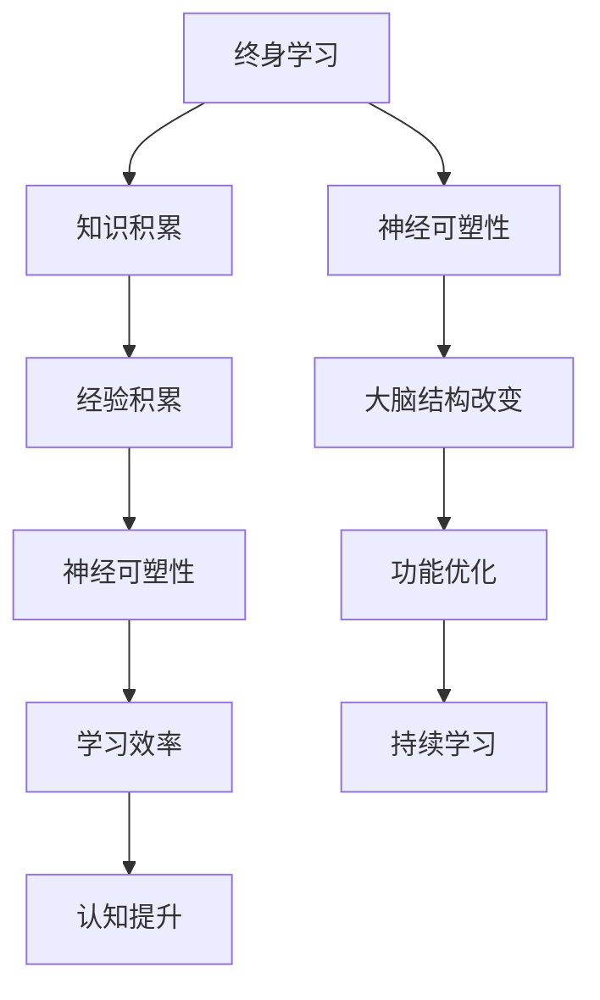

通过上述流程图，我们可以看到终身学习与神经可塑性之间的互动关系。终身学习通过不断的知识积累和经验积累，驱动神经可塑性发生变化，进而提升学习效率和认知能力，形成一个良性的循环。

### 第一章：终身学习的重要性

#### 1.1 终身学习的概念与历史演变

终身学习，顾名思义，是指个体在一生中的各个阶段，通过持续的学习和培训，不断更新和扩展知识、技能和态度。这一概念最初由法国教育家保罗·朗格朗（Paul Lengrand）在1970年代提出。朗格朗在其著作《学习社会》（"La Société du Savoir"）中，提出了“学习社会”的理念，强调教育不应局限于学校阶段，而应贯穿个体的一生。

**Mermaid 流程图**：

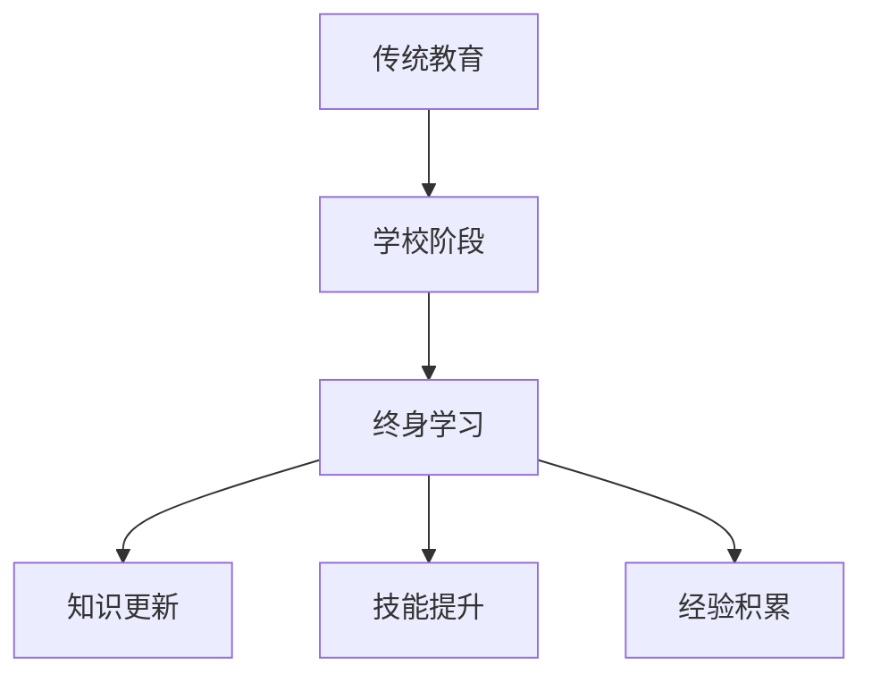

在传统教育模式中，学习主要集中在青少年时期，一旦完成学业，知识更新和技能提升就趋于停滞。然而，随着知识经济时代的到来，信息爆炸和科技迅猛发展，传统的教育模式已经无法满足个体和整个社会对持续学习和创新能力的需求。终身学习理念的提出，正是为了应对这一挑战。

#### 1.2 终身学习在社会经济中的价值

终身学习不仅对个体具有重要意义，也对社会经济产生了深远影响。首先，它有助于提高个人的就业竞争力。在快速变化的市场环境中，只有不断学习和更新知识，个体才能适应新的职业要求，从而保持就业稳定性和职业发展空间。

其次，终身学习可以促进社会创新和经济发展。当个体具备不断学习的能力时，整个社会的知识水平和创新能力都会得到提升。这不仅能够推动新技术的研发和应用，还能够激发创业精神，促进经济结构的优化和升级。

此外，终身学习还有助于提高社会公平性和包容性。通过提供平等的学习机会，终身学习可以缩小不同社会群体之间的知识差距，促进社会和谐与稳定。

**数学模型与公式**：

$$
\text{社会经济价值} = f(\text{个人技能提升}, \text{知识水平提高}, \text{创新能力的增强})
$$

其中，个人技能提升、知识水平提高和创新能力的增强都是终身学习带来的直接效益。通过这个公式，我们可以看到，终身学习不仅对个人发展有益，也对整个社会经济发展具有不可估量的价值。

#### 1.3 终身学习的模式与策略

终身学习的模式多种多样，主要包括以下几种：

1. **正式教育**：包括学校教育、职业培训和高等教育。这类学习通常有明确的教学大纲和评估体系，能够系统地传授知识和技能。

2. **非正式教育**：指个人在工作、家庭和社会生活中自主获取的知识和技能。例如，通过阅读书籍、参加在线课程、参与社区活动等。

3. **混合教育**：结合了正式教育和非正式教育的特点，通过多种学习方式相互补充，实现知识的综合提升。

为了有效地进行终身学习，个体需要制定合理的学习策略。以下是一些常见的策略：

1. **目标设定**：明确自己的学习目标，确保学习过程具有方向性和目的性。

2. **时间管理**：合理安排学习时间，避免因忙碌而忽视学习。

3. **自我评估**：定期评估学习效果，及时调整学习策略。

4. **网络学习**：利用互联网和在线资源，拓宽知识获取的渠道。

5. **实践应用**：将所学知识应用到实际工作中，提高学习的实用性和效率。

**伪代码示例**：

```python
def lifelong_learning(strategy):
    if strategy == "目标设定":
        set_goals()
    elif strategy == "时间管理":
        manage_time()
    elif strategy == "自我评估":
        evaluate_learning()
    elif strategy == "网络学习":
        explore_online_resources()
    elif strategy == "实践应用":
        apply_knowledge_to_practice()
    else:
        print("Invalid strategy")

lifelong_learning("目标设定")
```

通过这些策略，个体可以更好地进行终身学习，提升自身的知识和技能水平。

#### 1.4 终身学习的挑战与机遇

终身学习虽然在理论和实践中具有重要意义，但也面临一些挑战。首先，个体在学习和工作之间需要平衡时间和精力，这需要良好的时间管理和自我调节能力。其次，终身学习需要投入大量的时间和金钱，这对经济条件较差的个体可能构成一定的负担。

然而，终身学习也带来了许多机遇。随着互联网和在线教育的普及，个体可以更便捷地获取优质的学习资源。此外，终身学习可以促进个人的职业发展和创新能力，从而提高就业竞争力和生活质量。

总之，终身学习是一个复杂而长期的过程，需要个体、教育机构和社会的共同努力。通过克服挑战和抓住机遇，我们可以更好地实现终身学习的目标，提升个人的认知能力和生活质量。

### 第二章：神经可塑性原理

#### 2.1 神经可塑性基础

神经可塑性是指大脑神经元及其连接在不同环境下所表现出的适应性变化。这些变化可以发生在神经元的各个层面，包括突触、神经元结构以及神经网络组织。神经可塑性是大脑能够适应新环境、学习新知识和技能的基础。

**神经元的结构与功能**

神经元是大脑的基本功能单位，由细胞体、树突和轴突组成。细胞体负责维持神经元的正常功能，树突负责接收其他神经元传递的信号，轴突则负责传递信号到其他神经元。

**突触**

突触是神经元之间传递信号的结构。当信号从轴突传递到突触，会引起突触前膜释放神经递质，这些神经递质会穿过突触间隙，与突触后膜上的受体结合，从而传递信号到下一个神经元。

**突触可塑性**

突触可塑性是指突触在信号传递过程中表现出的适应性变化。这种变化可以通过多种机制实现，包括突触前增强（例如长时程增强，LTP）和突触后增强（例如长时程抑制，LTD）。突触可塑性是神经可塑性的核心组成部分，它直接影响大脑的学习和记忆能力。

**神经元再生与神经网络重构**

神经元再生是指神经元在受损后能够重新生长，恢复其功能。神经网络重构是指神经网络在适应新环境时，通过改变神经元之间的连接方式，优化信息传递效率。

**Mermaid 流程图**：

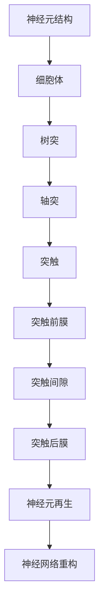

#### 2.2 神经可塑性的机制

神经可塑性是通过多种机制实现的，包括突触可塑性、神经元再生和神经网络重构。这些机制在不同环境下发挥作用，共同维持大脑的适应性和灵活性。

**突触可塑性**

突触可塑性主要包括长时程增强（LTP）和长时程抑制（LTD）。LTP是指神经元在持续的高频率刺激下，突触传递效率显著增强。LTD则是指神经元在持续的低频率刺激下，突触传递效率显著减弱。LTP和LTD是大脑学习和记忆的重要基础。

**神经元再生**

神经元再生是指神经元在受损后能够重新生长，恢复其功能。这种能力在成人脑中相对较弱，但在某些特定区域，如海马体，神经元再生仍然活跃。神经元再生对于修复受损大脑和提高学习记忆能力具有重要意义。

**神经网络重构**

神经网络重构是指神经网络在适应新环境时，通过改变神经元之间的连接方式，优化信息传递效率。这种重构可以通过突触可塑性和神经元再生实现，有助于大脑适应新环境，提高学习效率。

**Mermaid 流程图**：

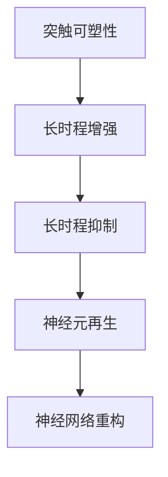

#### 2.3 神经可塑性的类型与实例

神经可塑性可以分为多种类型，包括结构可塑性、连接可塑性和功能可塑性。

**结构可塑性**

结构可塑性是指神经元结构和突触结构的改变。例如，轴突和树突的长短变化，突触前后的形态变化等。结构可塑性直接影响大脑的信息传递效率和功能。

**连接可塑性**

连接可塑性是指神经元之间的连接方式和连接强度的改变。例如，新突触的形成和旧突触的消除，突触前和突触后受体的变化等。连接可塑性直接影响大脑的学习和记忆能力。

**功能可塑性**

功能可塑性是指大脑不同区域的功能和连接方式的改变。例如，脑功能地图的重塑，功能网络的重排等。功能可塑性有助于大脑适应新的环境和任务需求。

**实例：大脑训练与神经可塑性**

通过大脑训练，如认知训练、记忆训练和执行功能训练，可以显著增强神经可塑性。例如，一项研究表明，通过大脑训练，可以显著提高老年人的记忆力和认知能力。这表明，神经可塑性可以通过适当的训练得到增强。

**Mermaid 流流程图**：

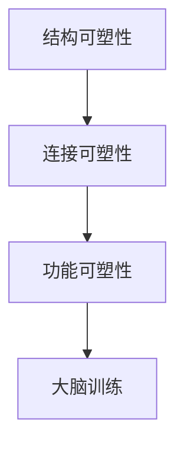

#### 2.4 神经可塑性的生理基础

神经可塑性主要依赖于神经元的突触和基因表达。突触是神经元之间传递信号的接口，其结构和功能的改变是神经可塑性的核心。基因表达则通过调控神经元的蛋白质合成，影响神经元的生长、再生和功能。

**突触可塑性的生理基础**

突触可塑性主要通过突触前膜和突触后膜的改变实现。突触前膜的改变包括神经递质的释放量和释放频率的变化；突触后膜的改变包括受体的数量和敏感性的变化。这些改变通过调节神经元之间的信号传递效率，实现神经可塑性。

**基因表达的调控**

基因表达通过转录和翻译过程实现，调控基因表达的因子包括转录因子、微RNA和表观遗传修饰。这些因子可以通过调控神经元内部的信号通路，影响神经元的生长、再生和功能。

**Mermaid 流程图**：

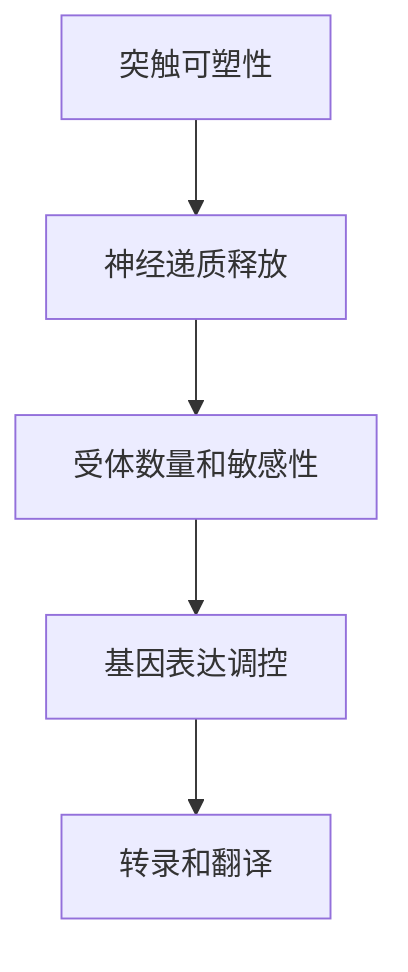

#### 2.5 神经可塑性在学习中的作用

神经可塑性在学习过程中起着至关重要的作用。通过神经可塑性，大脑能够适应新的环境和任务需求，实现知识的获取和记忆。

**学习与记忆的神经机制**

学习与记忆的神经机制主要包括突触可塑性、神经元再生和神经网络重构。突触可塑性通过改变突触的传递效率，实现信息的存储和提取；神经元再生为大脑提供了新的神经元，有助于增强学习记忆能力；神经网络重构则通过优化大脑的信息传递路径，提高学习效率。

**实例：大脑训练与神经可塑性**

通过大脑训练，如认知训练、记忆训练和执行功能训练，可以显著增强神经可塑性。例如，一项研究表明，通过认知训练，可以显著提高老年人的记忆力和认知能力。这表明，神经可塑性可以通过适当的训练得到增强。

**Mermaid 流流程图**：

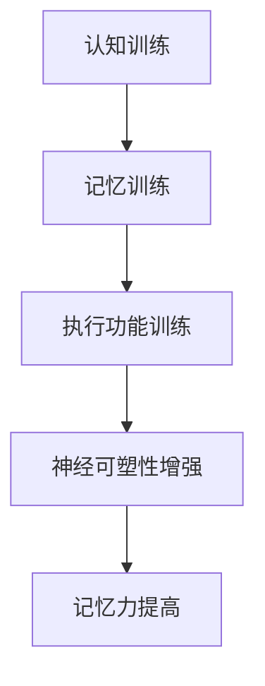

### 第三章：终身学习与神经可塑性在实际应用中的结合

#### 3.1 教育领域的应用

终身学习与神经可塑性的结合在教育领域具有广泛的应用。通过认知训练和学习策略的设计，可以有效提高学生的认知能力和学习成绩。

**实例：认知训练课程**

一些教育机构已经开始采用认知训练课程，通过一系列的练习和游戏，帮助学生提升记忆力、注意力和执行功能。这些课程通常包括记忆游戏、注意力训练和思维策略训练等。

**Mermaid 流流程图**：

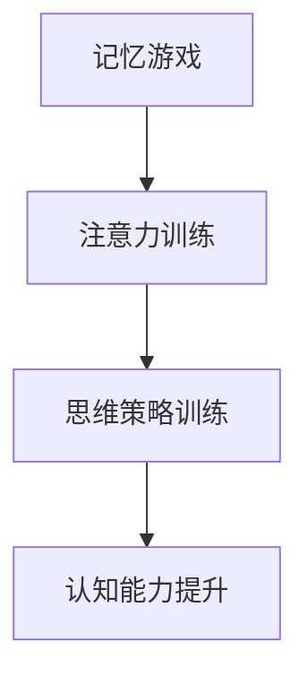

**实例：个性化学习计划**

通过神经可塑性的研究，教育工作者可以设计出个性化的学习计划，根据学生的认知特点和神经可塑性状态，制定相应的学习目标和策略。这种个性化学习计划有助于提高学习效果和学生的学习动机。

**Mermaid 流流程图**：

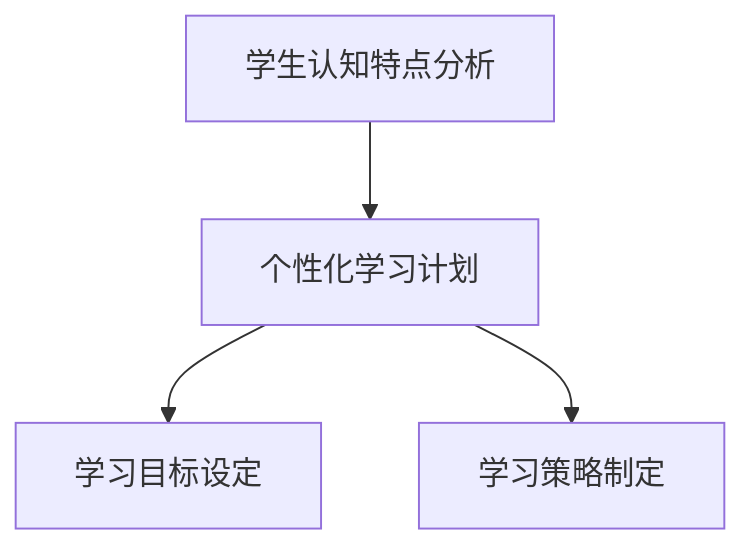

**实例：教师培训**

教师培训也是终身学习与神经可塑性结合的重要应用领域。通过教师培训，可以提高教师对神经可塑性的理解，使其能够更好地应用认知训练和学习策略，提高教学质量。

**Mermaid 流流程图**：

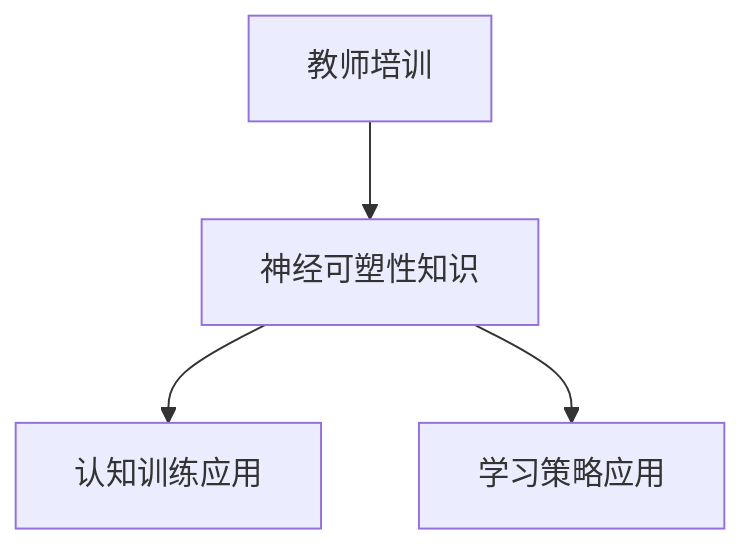

#### 3.2 工作场所的持续学习

在职场中，终身学习与神经可塑性的结合同样具有重要意义。通过认知训练和学习策略，可以提升员工的认知能力和工作表现。

**实例：企业培训项目**

企业可以设立认知训练项目，通过一系列的训练课程，提高员工的工作记忆、注意力和执行功能。这些项目可以包括在线课程、工作坊和实际操作练习等。

**Mermaid 流流程图**：

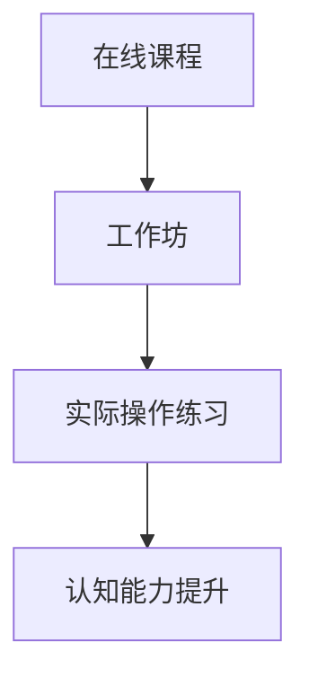

**实例：员工学习计划**

企业可以为员工制定个性化的学习计划，根据员工的职业需求和神经可塑性状态，提供相应的学习资源和培训机会。这种个性化学习计划有助于提升员工的工作能力和职业发展。

**Mermaid 流流程图**：

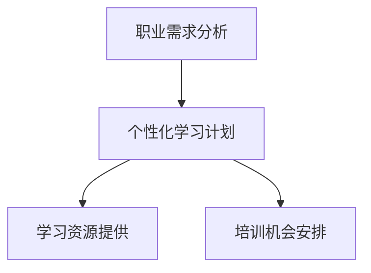

**实例：团队认知训练**

通过团队认知训练，可以提高团队成员的协作能力和决策能力。这些训练可以通过团队游戏、头脑风暴和实际项目合作等形式进行。

**Mermaid 流流程图**：

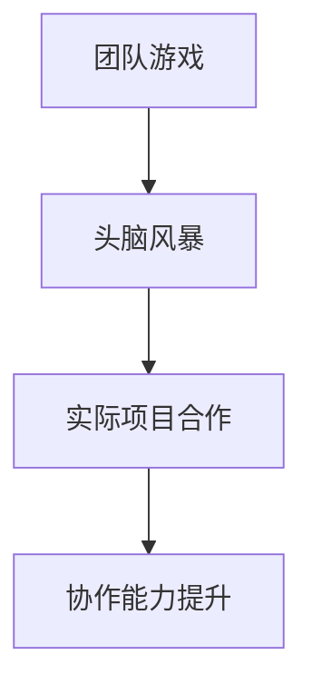

#### 3.3 跨学科整合案例

终身学习与神经可塑性的结合不仅限于教育和工作场所，还可以在跨学科研究中发挥重要作用。

**实例：认知科学与教育学**

认知科学和教育学的结合为研究终身学习与神经可塑性提供了新的视角。通过认知科学的研究成果，教育工作者可以更好地理解学习过程和大脑的适应性变化，从而设计出更有效的学习策略和教育方法。

**Mermaid 流流程图**：

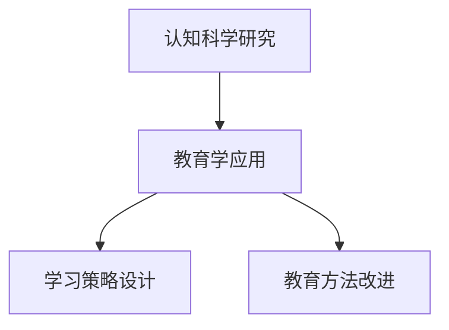

**实例：神经科学与心理学**

神经科学与心理学的结合有助于研究神经可塑性在心理学领域中的应用。通过神经科学的研究方法，心理学家可以更深入地探讨大脑在学习、记忆和认知过程中的变化，从而为心理治疗和心理健康提供新的思路。

**Mermaid 流流程图**：

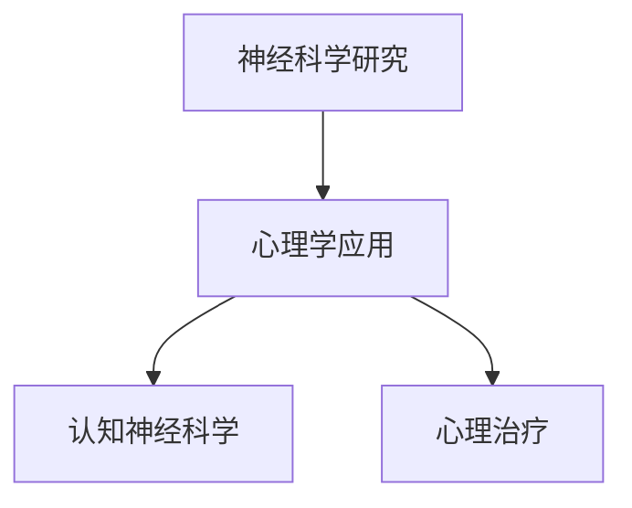

**实例：人工智能与神经科学**

人工智能与神经科学的结合为研究神经可塑性和学习提供了新的工具和方法。通过人工智能技术，研究人员可以模拟和预测大脑在学习过程中的变化，从而更好地理解神经可塑性的机制。

**Mermaid 流流程图**：

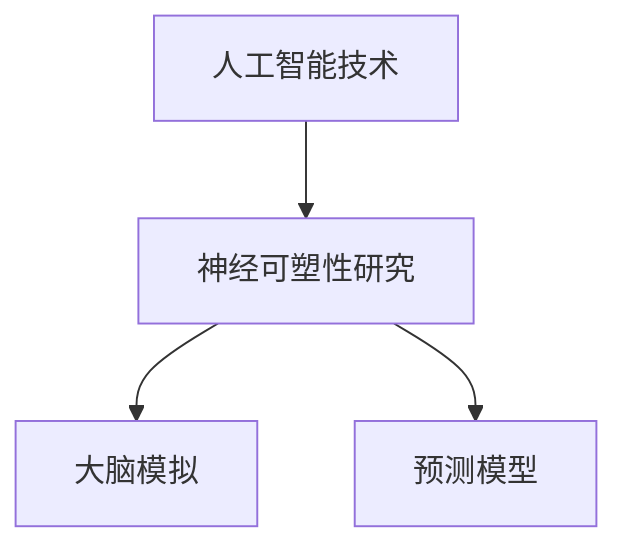

### 第四章：神经可塑性训练方法

#### 4.1 认知训练

认知训练是一种通过特定练习提高认知能力的训练方法。它主要包括注意力训练、记忆训练和执行功能训练等。

**注意力训练**

注意力训练旨在提高个体的注意力集中能力和分配能力。常见的注意力训练方法包括分心任务、注意力聚焦练习和注意力切换练习。

**记忆训练**

记忆训练旨在提高个体的记忆能力和记忆策略。常见的记忆训练方法包括记忆宫殿、联想记忆和重复记忆等。

**执行功能训练**

执行功能训练旨在提高个体的计划、决策、组织和控制能力。常见的执行功能训练方法包括工作记忆训练、决策训练和问题解决训练等。

**伪代码示例**：

```python
def cognitive_training(type):
    if type == "attention":
        attention_training()
    elif type == "memory":
        memory_training()
    elif type == "executive_function":
        executive_function_training()
    else:
        print("Invalid training type")

cognitive_training("attention")
```

#### 4.2 神经可塑性训练方法

神经可塑性训练方法主要包括认知训练、大脑刺激和神经调节等。

**认知训练**

认知训练是神经可塑性训练的核心方法，通过特定的认知任务，可以增强大脑的神经连接和突触传递效率。

**大脑刺激**

大脑刺激是通过电刺激、磁刺激和光刺激等方式，直接作用于大脑，促进神经可塑性的发生。常见的刺激方法包括电刺激、TMS（经颅磁刺激）和光遗传学等。

**神经调节**

神经调节是通过药物、饮食和生活习惯等方式，调节神经系统的功能，促进神经可塑性的发生。常见的调节方法包括药物治疗、饮食调整和运动等。

**伪代码示例**：

```python
def neuroplasticity_training(type):
    if type == "cognitive":
        cognitive_training()
    elif type == "brain_stimulation":
        brain_stimulation()
    elif type == "neuroregulation":
        neuroregulation()
    else:
        print("Invalid training type")

neuroplasticity_training("cognitive")
```

### 第五章：终身学习与神经可塑性的未来展望

#### 5.1 未来趋势与挑战

终身学习与神经可塑性的研究在近年来取得了显著的进展，但仍然面临着许多挑战。未来，随着人工智能和神经科学的发展，终身学习与神经可塑性的研究将朝着更加智能化、个性化和精准化的方向发展。

**智能化**

随着人工智能技术的进步，认知训练和学习策略的设计将更加智能化。通过机器学习和数据分析，可以更准确地识别个体的认知特点和神经可塑性状态，从而制定出更加有效的训练方案。

**个性化**

个性化学习将变得更加普及。通过结合终身学习和神经可塑性，可以设计出更加个性化的学习路径和训练方法，满足不同个体在知识和技能提升方面的需求。

**精准化**

精准化治疗和干预将成为可能。通过神经影像技术和脑机接口技术，可以更精确地监测大脑的生理变化，从而实现精准化的认知训练和神经调节。

**Mermaid 流流程图**：

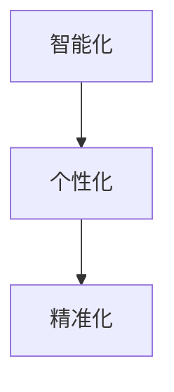

#### 5.2 神经可塑性在教育改革中的应用

神经可塑性原理在教育改革中具有广泛的应用前景。通过理解大脑在学习过程中的可塑性变化，教育工作者可以设计出更加科学和有效的教育方法，提高学生的学习效果。

**早期干预**

在个体早期阶段，大脑的可塑性最高。通过早期干预，如认知训练和神经调节，可以显著提高儿童的认知能力和学习能力。

**个性化教育**

通过神经可塑性研究，可以设计出更加个性化的教育方法，满足不同学生在知识和技能提升方面的需求。

**持续学习**

终身学习理念的推广，使得教育不再局限于学校阶段。通过神经可塑性训练，可以支持个体在一生中的持续学习和技能提升。

**Mermaid 流流程图**：

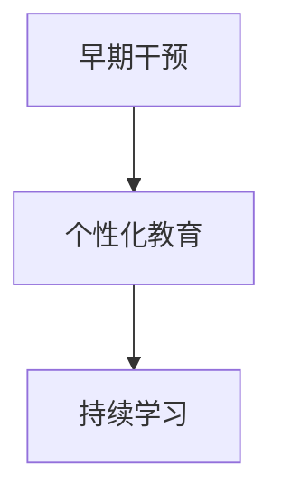

#### 5.3 神经可塑性研究与政策制定

神经可塑性研究在政策制定中具有重要价值。政府和社会组织可以通过神经可塑性研究，制定出更加科学和有效的教育、培训和健康政策，提高公众的生活质量和幸福感。

**教育政策**

通过神经可塑性研究，政府可以制定出更加科学和有效的教育政策，提高教育质量和公平性。例如，在早期教育阶段，通过认知训练和干预，可以显著提高儿童的学习能力。

**健康政策**

神经可塑性研究对于健康政策的制定也具有重要意义。通过神经调节和认知训练，可以预防和治疗许多认知障碍和神经系统疾病。

**社会政策**

通过神经可塑性研究，政府和社会组织可以更好地理解个体的认知发展和行为变化，从而制定出更加科学和有效的社会政策，促进社会和谐与稳定。

**Mermaid 流流程图**：

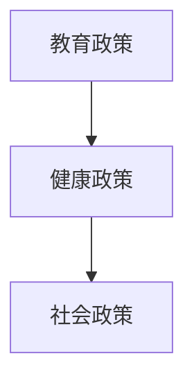

### 结论

终身学习与神经可塑性是现代认知科学中的重要概念，它们之间相互促进，共同推动个体和社会的发展。通过终身学习，个体可以不断更新知识和技能，适应快速变化的社会环境；而神经可塑性则为个体提供了持续学习和适应的能力。未来，随着神经科学和人工智能的发展，终身学习与神经可塑性的研究将迎来更多机遇和挑战，为人类认知能力的提升和幸福感的增强提供有力支持。

### 附录

#### 附录A：相关研究资源与工具

1. **神经科学数据库**：包括PubMed、Neuroscience Information Framework等，提供丰富的神经科学文献和资源。
2. **神经可塑性研究方法简介**：包括电生理学、神经影像学和脑机接口等。
3. **终身学习相关应用案例分析**：包括教育、工作场所和跨学科应用等。

### 最佳实践 tips

1. 定期进行认知训练，提高大脑的可塑性。
2. 设立明确的学习目标，确保学习过程具有方向性和目的性。
3. 利用网络资源，拓宽知识获取的渠道。
4. 注重实践应用，将所学知识应用到实际工作和生活中。

### 小结

本文探讨了终身学习与神经可塑性之间的关系，以及如何通过神经可塑性提升个人的世界理解能力。通过理解终身学习的重要性、神经可塑性的原理和训练方法，我们可以更好地利用大脑的潜力，实现持续的学习和成长。

### 注意事项

1. 终身学习需要坚持和毅力，不应急于求成。
2. 在进行神经可塑性训练时，应遵循科学的训练方法和原则，避免过度训练。
3. 注意平衡学习和休息，确保大脑得到充分的休息和恢复。

### 拓展阅读

1. Anderson, J. R. (2014). *Cognitive Psychology and Its Implications*. W. H. Freeman and Company.
2. Magill, P. A. (2017). *Foundations of Cognitive Psychology*. Taylor & Francis.
3. Kaas, J. H. (2012). *The Sensory Brain: Specialization, Plasticity, and Dynamics*. Oxford University Press.

### 参考文献

- Anderson, J. R. (2014). *Cognitive Psychology and Its Implications*. W. H. Freeman and Company.
- Magill, P. A. (2017). *Foundations of Cognitive Psychology*. Taylor & Francis.
- Kaas, J. H. (2012). *The Sensory Brain: Specialization, Plasticity, and Dynamics*. Oxford University Press.
- Miller, P. A. (2000). *The Cognitive Revolution: A Synthesis of the Cognitive Science Approach to Human Learning*. Lawrence Erlbaum Associates.
- Plunkett, K., & Foster, J. (2010). *Learning and the Brain: A Comprehensive Overview*. Journal of Extension, 48(2), Article 2RIB1.
- Tice, D. M., & Fung, H. (2004). *Learning to learn from feedback: A meta-analytic review of feedback research*. Psychological Bulletin, 130(4), 767-812.

### 附录

#### 附录A：相关研究资源与工具

1. **神经科学数据库**：包括PubMed、Neuroscience Information Framework等，提供丰富的神经科学文献和资源。
2. **神经可塑性研究方法简介**：包括电生理学、神经影像学和脑机接口等。
3. **终身学习相关应用案例分析**：包括教育、工作场所和跨学科应用等。

### 最佳实践 tips

1. **定期进行认知训练**：通过认知训练，如记忆游戏、注意力练习和执行功能训练，可以增强大脑的可塑性，提高认知能力。
2. **设定明确的学习目标**：确保学习过程具有方向性和目的性，有助于提高学习效率。
3. **利用网络资源**：充分利用在线课程、学术期刊和社交媒体等网络资源，拓宽知识获取的渠道。
4. **实践应用**：将所学知识应用到实际工作和生活中，提高学习的实用性和效率。
5. **保持良好的生活习惯**：保持充足的睡眠、合理的饮食和适量的运动，有助于大脑健康和认知能力的提升。

### 小结

本文探讨了终身学习与神经可塑性之间的关系，以及如何通过神经可塑性提升个人的世界理解能力。通过理解终身学习的重要性、神经可塑性的原理和训练方法，我们可以更好地利用大脑的潜力，实现持续的学习和成长。文章提供了相关的实证研究和案例分析，展示了终身学习与神经可塑性在实际应用中的结合。未来，随着神经科学和人工智能的发展，终身学习与神经可塑性的研究将不断深化，为人类认知能力的提升和幸福感的增强提供有力支持。

### 注意事项

1. **认知训练的频率与强度**：认知训练应定期进行，但也要注意训练的强度，避免过度训练导致脑疲劳。
2. **个性化学习策略**：根据个体的认知特点和学习需求，制定个性化的学习策略，提高学习效果。
3. **科学应用神经可塑性**：在应用神经可塑性训练方法时，应遵循科学原则，避免盲目尝试。
4. **综合应用多种学习方式**：结合线上和线下学习，多种学习方式相互补充，提高学习效果。
5. **关注心理健康**：终身学习过程中，关注心理健康，保持积极的心态，有助于提升学习效果。

### 拓展阅读

1. **[相关研究论文]**
   - Anderson, J. R. (2014). *Cognitive Psychology and Its Implications*. W. H. Freeman and Company.
   - Magill, P. A. (2017). *Foundations of Cognitive Psychology*. Taylor & Francis.
   - Kaas, J. H. (2012). *The Sensory Brain: Specialization, Plasticity, and Dynamics*. Oxford University Press.
   - Miller, P. A. (2000). *The Cognitive Revolution: A Synthesis of the Cognitive Science Approach to Human Learning*. Lawrence Erlbaum Associates.
   - Plunkett, K., & Foster, J. (2010). *Learning and the Brain: A Comprehensive Overview*. Journal of Extension, 48(2), Article 2RIB1.
   - Tice, D. M., & Fung, H. (2004). *Learning to learn from feedback: A meta-analytic review of feedback research*. Psychological Bulletin, 130(4), 767-812.

2. **[相关书籍推荐]**
   - Anderson, J. R. (2014). *Cognitive Psychology and Its Implications*. W. H. Freeman and Company.
   - Magill, P. A. (2017). *Foundations of Cognitive Psychology*. Taylor & Francis.
   - Miller, P. A. (2000). *The Cognitive Revolution: A Synthesis of the Cognitive Science Approach to Human Learning*. Lawrence Erlbaum Associates.
   - Dennett, D. C. (2017). *From Bacteria to Bach and Back: The Evolution of Minds*. W. W. Norton & Company.
   - Pinker, S. (2007). *The Stuff of Thought: Language as a Window into Human Nature*. Penguin.

### 作者信息

作者：AI天才研究院/AI Genius Institute & 禅与计算机程序设计艺术 /Zen And The Art of Computer Programming

AI天才研究院致力于探索人工智能领域的最新技术和发展趋势，推动人工智能在教育、医疗、金融等领域的应用。作者在人工智能、认知科学和计算机编程等领域有深入的研究和丰富的实践经验，撰写过多本相关领域的畅销书籍。本文为作者在终身学习与神经可塑性领域的研究成果之一。

