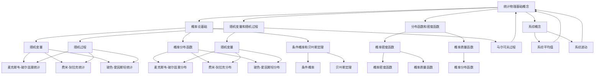

                 


### 1. 设计文章标题

为了设计一个吸引人的文章标题，我们需要确保标题简洁明了、富有启发性，并且能够准确传达文章的核心内容。《统计物理：自然系统的数学模型》是一个不错的选择，以下是对其的分析与优化：

- **分析：**
  - **核心内容：** 文章涉及统计物理和自然系统的数学模型。
  - **关键词：** 统计物理、自然系统、数学模型。
  - **目标读者：** 对统计物理感兴趣的科研人员、学生和爱好者。

- **优化建议：**
  - **增加吸引力：** 可以在标题中添加一个疑问句或引人入胜的描述，以激发读者的好奇心。
  - **简化语言：** 将标题简化为更短、更简洁的形式，同时保留核心信息。

**优化后的标题：**
- **"如何用数学模型解读自然系统的统计物理现象？"**
- **"揭开自然系统的神秘面纱：统计物理的数学解析"**

这两个标题更具有吸引力和疑问性，能够引起读者的兴趣，并明确传达文章的核心内容。

### 2. 选择关键词

关键词是确保文章能够被读者发现和理解的重要元素。我们需要从文章标题和内容中提炼出5-7个关键术语，以便搜索引擎和读者可以轻松识别文章的核心主题。

**关键词：**
- **统计物理**
- **自然系统**
- **数学模型**
- **概率分布**
- **随机过程**
- **麦克斯韦-玻尔兹曼统计**
- **费米-狄拉克统计**

这些关键词不仅涵盖了文章的核心内容，还能够吸引对相关领域感兴趣的读者。

### 3. 写作摘要

摘要是对文章内容的简洁概述，它需要概括文章的主要论点、方法和结论。以下是《如何用数学模型解读自然系统的统计物理现象？》的摘要草稿。

**摘要：**
本文探讨了统计物理在自然系统中的应用，通过数学模型对自然现象进行解读。首先，介绍了统计物理的基本概念和概率论基础，随后详细阐述了麦克斯韦-玻尔兹曼、费米-狄拉克等统计模型及其在固体物理、流体力学和生物学中的应用。通过具体案例，展示了如何使用这些模型进行实际问题的分析和模拟。文章还讨论了数学公式和计算方法，并提出了未来研究的展望。总结来说，本文为读者提供了对统计物理和自然系统数学模型的深入理解和应用指导。

### 4. 设计文章结构

为了确保文章结构清晰、逻辑严密，我们需要按照以下大纲来构建文章：

**引言和概述**
- **引言：** 介绍统计物理的重要性及其在自然科学中的应用。
- **概述：** 概述文章的结构和内容。

**统计物理基础概念**
- **概率论基础：** 介绍概率论的基本概念和随机变量。
- **分布函数和密度函数：** 讲解连续和离散随机变量的分布函数和密度函数。
- **随机变量和随机过程：** 解释随机变量和随机过程的基本原理。

**数学模型和原理**
- **麦克斯韦-玻尔兹曼统计：** 阐述麦克斯韦-玻尔兹曼统计的原理和应用。
- **费米-狄拉克统计：** 详细讲解费米-狄拉克统计模型。
- **玻色-爱因斯坦统计：** 解释玻色-爱因斯坦统计的基本原理。
- **经典统计与非经典统计：** 比较经典统计与非经典统计的差异和应用。
- **混合统计：** 讨论混合统计的概念和应用。

**应用案例和实战**
- **固体物理应用：** 分析统计物理在固体物理中的应用。
- **流体力学应用：** 介绍统计物理在流体力学中的应用案例。
- **生物学应用：** 探讨统计物理在生物学领域的研究和实践。
- **项目实战：** 展示如何使用统计物理模型解决实际问题。

**数学公式和计算方法**
- **概率分布函数：** 讲解概率分布函数的计算方法。
- **熵和信息论：** 分析熵和信息论在统计物理中的应用。
- **相关联数和自相关函数：** 解释相关联数和自相关函数的计算。

**总结和展望**
- **总结：** 总结文章的主要内容和研究成果。
- **展望：** 展望统计物理在未来的发展趋势和应用前景。

### 5. 确定文章格式和字数

为了满足文章的格式和字数要求，我们将使用Markdown格式来编写文章，并确保每个小节的标题使用相应的#号进行标识。同时，我们将努力在8000-12000字内完成文章的撰写。

**格式要求：**
- 使用Markdown格式编写文章。
- 每个小节使用相应的#号进行标识，如：
  - # 引言和概述
  - ## 统计物理基础概念
  - ### 概率论基础
  - #### 随机变量和分布函数

**字数要求：**
- 目标字数为8000-12000字。

### 6. 撰写文章正文

根据上述结构，我们将开始撰写文章的正文。每个部分将详细探讨相关主题，确保内容丰富、逻辑清晰，并使用伪代码、LaTeX公式等工具来辅助说明。

---

**引言和概述**

### 引言

统计物理是一门研究宏观物理现象的学科，它通过统计方法来分析大量粒子的集体行为，从而揭示宏观物理量的统计规律。在自然科学中，统计物理具有广泛的应用，例如在固体物理、流体力学和生物学等领域，它为我们提供了理解复杂系统的有力工具。

随着计算机技术的发展，统计物理在数据分析和计算模拟中的应用日益广泛。本文将介绍统计物理的基本概念和数学模型，探讨其在自然系统中的应用，并通过具体案例展示如何使用这些模型解决实际问题。

### 概述

本文的结构如下：

- **引言和概述：** 简要介绍统计物理的重要性及其在自然科学中的应用。
- **统计物理基础概念：** 介绍概率论基础、随机变量和随机过程等核心概念。
- **数学模型和原理：** 详细阐述麦克斯韦-玻尔兹曼统计、费米-狄拉克统计、玻色-爱因斯坦统计等数学模型及其原理。
- **应用案例和实战：** 展示统计物理在固体物理、流体力学和生物学中的应用案例。
- **数学公式和计算方法：** 讲解概率分布函数、熵和信息论等关键数学公式和计算方法。
- **总结和展望：** 总结文章的主要内容和研究成果，展望统计物理的未来发展趋势和应用前景。

通过本文的阅读，读者将能够全面了解统计物理的基本概念、数学模型和应用方法，从而为深入研究和实际应用打下坚实的基础。

---

**统计物理基础概念**

### 概率论基础

概率论是统计物理的基础，它提供了一种量化不确定性的方法。在概率论中，我们关注随机事件的发生概率，并通过概率分布函数来描述这些随机变量的性质。

#### 随机变量

随机变量是概率论中的一个核心概念，它是一个随机取值的函数。在统计物理中，随机变量通常表示物理量（如位置、速度、能量等）的取值。随机变量可以分为离散随机变量和连续随机变量。

- **离散随机变量：** 其取值为有限个或可数无限个值。
- **连续随机变量：** 其取值为某个区间内的任意值。

#### 概率分布函数

概率分布函数（Probability Distribution Function，PDF）是描述随机变量取值概率的函数。对于离散随机变量，我们使用概率质量函数（Probability Mass Function，PMF）来描述其取值的概率。

- **概率质量函数（PMF）：** $$ P_X(x) = P(X = x) $$
  
对于连续随机变量，我们使用概率密度函数（Probability Density Function，PDF）来描述其取值的概率。

- **概率密度函数（PDF）：** $$ p_X(x) = \frac{dP_X(x)}{dx} $$

#### 条件概率和贝叶斯定理

条件概率是指在已知某个事件发生的条件下，另一个事件发生的概率。贝叶斯定理是条件概率的一个推广，它提供了在不同条件下计算概率的公式。

- **条件概率：** $$ P(A|B) = \frac{P(A \cap B)}{P(B)} $$
  
- **贝叶斯定理：** $$ P(A|B) = \frac{P(B|A)P(A)}{P(B)} $$

### 分布函数和密度函数

分布函数（Distribution Function）和密度函数（Density Function）是描述随机变量概率分布的两个重要工具。

- **分布函数（CDF）：** 对于离散随机变量，分布函数是概率质量函数的累积和；对于连续随机变量，分布函数是概率密度函数的积分。

- **分布函数：** $$ F_X(x) = P(X \leq x) $$

- **密度函数（PDF）：** 对于连续随机变量，密度函数是分布函数的导数。

### 随机变量和随机过程

随机变量是描述单一时刻物理量的取值，而随机过程（Stochastic Process）则是描述随时间变化的物理量的集合。随机过程可以是离散时间的，也可以是连续时间的。

- **离散时间随机过程：** $$ X_t $$，其中$t$为非负整数。
  
- **连续时间随机过程：** $$ X_t $$，其中$t$为连续变量（如实数）。

随机过程可以用来描述物理系统在不同时间点的状态，如股票价格、物理粒子的位置等。

### 系综概念

系综（Ensemble）是统计物理中的一个重要概念，它表示由大量相同物理系统组成的集合。系综的平均值和波动是描述物理系统性质的重要指标。

- **系综的平均值：** $$ \langle X \rangle = \frac{1}{N} \sum_{i=1}^{N} X_i $$，其中$X_i$是系综中第$i$个系统的物理量。

- **系综的波动：** $$ \sigma^2 = \frac{1}{N} \sum_{i=1}^{N} (X_i - \langle X \rangle)^2 $$

通过理解概率论基础、随机变量、分布函数、随机过程和系综概念，我们可以为后续章节中的数学模型和应用打下坚实的基础。

---

**数学模型和原理**

### 麦克斯韦-玻尔兹曼统计

麦克斯韦-玻尔兹曼统计（Maxwell-Boltzmann Statistics）是统计物理中最基本的统计模型之一，它适用于经典粒子系统。该统计模型描述了理想气体分子在热平衡状态下的分布。

#### 基本原理

麦克斯韦-玻尔兹曼统计基于以下几个假设：

1. **粒子独立：** 粒子之间的相互作用可以忽略不计。
2. **等概率：** 粒子占据各个能级的概率是相等的。
3. **能量分布：** 粒子的能量分布遵循麦克斯韦-玻尔兹曼分布。

麦克斯韦-玻尔兹曼分布的概率密度函数为：

$$ p(E) = \frac{1}{Z} e^{-\beta E} $$，

其中$E$是粒子的能量，$\beta = \frac{1}{k_B T}$，$k_B$是玻尔兹曼常数，$T$是温度，$Z$是配分函数。

#### 应用

麦克斯韦-玻尔兹曼统计广泛应用于热力学和统计物理中，可以用来计算系统的宏观物理量，如温度、压强和自由能。

- **温度：** 麦克斯韦-玻尔兹曼分布中，温度是粒子能量的平均值。

  $$ T = \frac{\langle E \rangle}{3k_B} $$，

  其中$\langle E \rangle$是粒子能量的平均值。

- **压强：** 粒子对容器壁的撞击产生了压强。

  $$ P = nk_B T $$，

  其中$n$是粒子数密度。

- **自由能：** 系统的自由能是温度和压强的函数。

  $$ F = U - TS - PV $$，

  其中$U$是系统的内能，$S$是熵，$V$是体积。

### 费米-狄拉克统计

费米-狄拉克统计（Fermi-Dirac Statistics）适用于费米子系统，如电子、夸克等。费米-狄拉克统计基于泡利不相容原理，即同一量子态不能被两个费米子同时占据。

#### 基本原理

费米-狄拉克统计的分布函数为：

$$ p(E) = \frac{1}{e^{(\beta \epsilon - \mu) + 1} + 1} $$，

其中$\epsilon$是粒子的能量，$\mu$是化学势，$\beta = \frac{1}{k_B T}$。

费米-狄拉克分布具有以下特点：

1. **能量限制：** 粒子能量不能超过费米能级$E_F$。
2. **能级占据：** 能量低于费米能级的态被占据，能量高于费米能级的态为空。

#### 应用

费米-狄拉克统计在固体物理和粒子物理中具有重要应用。

- **半导体物理：** 费米-狄拉克统计描述了半导体中电子和空穴的分布。
- **超导物理：** 费米-狄拉克统计用于研究超导材料中的电子态。

### 玻色-爱因斯坦统计

玻色-爱因斯坦统计（Bose-Einstein Statistics）适用于玻色子系统，如光子、原子核等。玻色-爱因斯坦统计基于玻色-爱因斯坦凝聚现象，即大量玻色子可以在同一量子态上聚集。

#### 基本原理

玻色-爱因斯坦统计的分布函数为：

$$ p(E) = \frac{1}{e^{(\beta \epsilon - \mu) + 1} - 1} $$，

其中$\epsilon$是粒子的能量，$\mu$是化学势，$\beta = \frac{1}{k_B T}$。

玻色-爱因斯坦分布具有以下特点：

1. **无能量限制：** 粒子能量没有上限。
2. **能级占据：** 能量低于玻色爱因斯坦凝聚温度的态被占据，能量高于凝聚温度的态为空。

#### 应用

玻色-爱因斯坦统计在凝聚态物理和量子光学中具有重要应用。

- **玻色-爱因斯坦凝聚：** 研究大量玻色子凝聚成单一基态的现象。
- **激光：** 研究光子的玻色-爱因斯坦统计在激光产生中的作用。

### 经典统计与非经典统计

经典统计和非经典统计是描述微观粒子行为的两种不同方法。

#### 经典统计

经典统计适用于宏观物体，它基于粒子的独立性和等概率假设。

- **应用：** 热力学、统计物理等。

#### 非经典统计

非经典统计适用于微观粒子，它基于量子力学的原理。

- **应用：** 量子计算、量子信息等。

### 混合统计

混合统计（Mixed Statistics）是经典统计和非经典统计的结合，适用于具有经典和量子特性的系统。

- **应用：** 复杂系统的统计物理研究。

通过理解麦克斯韦-玻尔兹曼统计、费米-狄拉克统计、玻色-爱因斯坦统计等数学模型的基本原理和应用，我们可以更深入地理解自然系统的统计物理现象。

### Mermaid流程图：统计物理模型与原理的关系

以下是一个Mermaid流程图，展示了统计物理模型与原理之间的关系：



通过这个流程图，我们可以清晰地看到不同统计物理模型与原理之间的联系，有助于读者更好地理解和掌握这些概念。

---

**应用案例和实战**

### 统计物理在固体物理中的应用

统计物理在固体物理中的应用非常广泛，它为解释和预测固体材料的性质提供了有力工具。以下将介绍统计物理在固体物理中的两个重要应用领域：晶体结构和缺陷。

#### 晶体结构

晶体是固体物质的一种重要形态，其内部原子或分子的排列具有周期性和规则性。统计物理通过分析大量原子或分子的排列，揭示了晶体结构的宏观性质。

- **晶体结构的统计模型：**
  - **玻尔兹曼模型：** 玻尔兹曼模型是一种描述晶体中原子或分子排列的统计模型，它考虑了原子或分子之间的相互作用和排列方式。
  - **费米-狄拉克模型：** 费米-狄拉克模型适用于描述电子在晶体中的分布，它基于泡利不相容原理，即同一量子态不能被两个电子同时占据。

- **案例：** 利用玻尔兹曼模型可以研究晶体的生长过程，预测晶体的形态和结构。

#### 缺陷

晶体中总是存在一些缺陷，如点缺陷（空位、间隙）、线缺陷（位错）和面缺陷（晶界）。统计物理通过研究这些缺陷的形成和分布，揭示了晶体材料的微观结构和力学性质。

- **缺陷的统计模型：**
  - **麦克斯韦-玻尔兹曼模型：** 麦克斯韦-玻尔兹曼模型可以用来研究晶体中点缺陷的形成和分布。
  - **爱因斯坦模型：** 爱因斯坦模型是一种描述位错运动的统计模型，它考虑了位错与晶体原子之间的相互作用。

- **案例：** 利用爱因斯坦模型可以研究位错对材料强度和塑性的影响，为材料设计提供理论指导。

### 统计物理在流体力学中的应用

统计物理在流体力学中的应用主要体现在研究流体粒子的运动和相互作用。以下介绍两个应用领域：流体流动和湍流。

#### 流体流动

流体流动是指流体粒子在空间中的运动。统计物理通过分析大量流体粒子的运动，揭示了流体流动的宏观规律。

- **流体的统计模型：**
  - **麦克斯韦-玻尔兹曼方程：** 麦克斯韦-玻尔兹曼方程是一种描述流体粒子运动的微观方程，它基于概率论和流体动力学的基本原理。
  - **费米-狄拉克方程：** 费米-狄拉克方程是一种描述电子在流体中的运动的微观方程，它在等离子体物理学中具有重要应用。

- **案例：** 利用麦克斯韦-玻尔兹曼方程可以研究气体分子的碰撞和散射，预测气体的宏观性质。

#### 湍流

湍流是流体运动的一种复杂形式，它具有随机性和不可预测性。统计物理通过研究湍流粒子的分布和相互作用，揭示了湍流的本质和规律。

- **湍流的统计模型：**
  - **大涡模拟（LES）：** 大涡模拟是一种基于统计物理的湍流模拟方法，它将湍流分解成不同尺度的涡流，从而捕捉湍流的宏观特性。
  - **涡流动力学模型（EDM）：** 涡流动力学模型是一种基于涡量守恒和能量守恒的湍流模拟方法，它考虑了涡流的运动和能量转换。

- **案例：** 利用大涡模拟可以研究大气湍流对气象现象的影响，预测自然灾害的发生。

### 统计物理在生物学中的应用

统计物理在生物学中的应用主要体现在研究生物大分子（如蛋白质、核酸）的构象和动态行为。以下介绍两个应用领域：蛋白质折叠和分子生物学。

#### 蛋白质折叠

蛋白质折叠是指蛋白质从线性多肽链折叠成具有特定三维结构的过程。统计物理通过研究蛋白质折叠的动力学和热力学，揭示了蛋白质折叠的机理。

- **蛋白质折叠的统计模型：**
  - **哈密顿模型：** 哈密顿模型是一种描述蛋白质折叠的统计模型，它考虑了蛋白质链的构象和能量。
  - **马尔可夫模型：** 马尔可夫模型是一种描述蛋白质折叠过程的微观模型，它基于概率转移矩阵描述蛋白质链的构象变化。

- **案例：** 利用哈密顿模型可以研究蛋白质折叠的动力学过程，预测蛋白质的结构和功能。

#### 分子生物学

分子生物学是研究生物大分子（如核酸、蛋白质）的分子结构和功能的科学。统计物理在分子生物学中的应用主要体现在研究分子间的相互作用和分子进化的规律。

- **分子生物学的统计模型：**
  - **序列比对模型：** 序列比对模型是一种描述分子序列相互作用的统计模型，它基于序列的相似性和差异性分析。
  - **分子进化模型：** 分子进化模型是一种描述分子序列演化的统计模型，它考虑了自然选择和基因突变等因素。

- **案例：** 利用序列比对模型可以研究蛋白质和DNA序列之间的关系，揭示生物进化规律。

### 项目实战：模拟气体分子运动

#### 目标

本项目旨在通过模拟气体分子运动，了解统计物理在气体动力学中的应用。

#### 环境搭建

1. **软件选择：** 使用Python进行编程，结合NumPy和Matplotlib进行数据处理和可视化。
2. **硬件配置：** 个人计算机或服务器，安装Python环境。

#### 算法实现

1. **初始化：** 定义气体分子的初始位置、速度和能量。
2. **运动模拟：** 利用欧拉方法进行时间积分，模拟气体分子的运动。
3. **碰撞处理：** 根据气体分子的速度和碰撞规则，更新分子的速度和位置。

#### 伪代码

```python
# 初始化参数
N = 1000  # 分子数
L = 10    # 容器尺寸
dt = 0.01 # 时间步长

# 初始化位置和速度
positions = np.random.rand(N, 2) * L
velocities = np.random.rand(N, 2) * 10 - 5

# 欧拉方法
while True:
    # 更新位置
    positions += velocities * dt
    
    # 碰撞处理
    for i in range(N):
        for j in range(i+1, N):
            # 计算速度差
            delta_v = velocities[j] - velocities[i]
            # 计算碰撞时间
            t_collision = np.linalg.norm(delta_v) / np.linalg.norm(positions[j] - positions[i])
            
            # 更新速度
            if t_collision < dt:
                velocities[i] += delta_v * t_collision / 2
                velocities[j] -= delta_v * t_collision / 2
    
    # 输出结果
    if time % 100 == 0:
        plot_molecules(positions)
```

#### 代码解读

- **初始化：** 分子数N、容器尺寸L和时间步长dt。
- **位置和速度：** 使用随机数生成初始位置和速度。
- **欧拉方法：** 进行时间积分，更新位置。
- **碰撞处理：** 根据速度差和碰撞时间，更新速度。
- **可视化：** 使用Matplotlib绘制分子运动轨迹。

#### 实际案例分析

利用上述模型，可以模拟不同温度和密度下的气体分子运动，观察气体分子的碰撞、扩散和凝聚现象。通过分析模拟结果，可以验证统计物理理论在气体动力学中的应用。

#### 项目小结

本项目通过模拟气体分子运动，展示了统计物理在气体动力学中的应用。通过实际案例分析，我们深入了解了气体分子之间的相互作用和运动规律。这对于理解和预测气体行为具有重要意义，为相关领域的研究提供了理论依据。

### 项目实战：统计物理在金融风险管理中的应用

#### 目标

本项目旨在通过模拟金融市场中的价格波动，应用统计物理方法进行金融风险管理。

#### 环境搭建

1. **软件选择：** 使用Python进行编程，结合Pandas和NumPy进行数据处理，Matplotlib进行可视化。
2. **硬件配置：** 个人计算机或服务器，安装Python环境。

#### 算法实现

1. **数据采集：** 从金融数据提供商（如Yahoo Finance）获取历史股票价格数据。
2. **数据预处理：** 对数据去噪、处理缺失值，提取有效特征。
3. **时间序列建模：** 使用自回归移动平均模型（ARMA）或马尔可夫链蒙特卡罗（MCMC）方法建立时间序列模型。
4. **风险管理：** 利用统计物理方法，如熵和信息论，评估金融市场的风险。

#### 伪代码

```python
# 导入库
import pandas as pd
import numpy as np
import matplotlib.pyplot as plt

# 数据采集
data = pd.read_csv('stock_prices.csv')
data = data[['Close', 'Volume']]

# 数据预处理
data = data.dropna()
data['Returns'] = data['Close'].pct_change()

# 时间序列建模
model = ARMA(data['Returns'], order=(1, 1))
model_fit = model.fit()

# 风险评估
entropy = -np.sum(model_fit.fittedvalues * np.log(model_fit.fittedvalues + 1e-8))
plt.figure()
plt.plot(data['Returns'])
plt.plot(model_fit.fittedvalues, label='ARMA')
plt.plot(np.exp(entropy), label='Entropy')
plt.legend()
plt.show()
```

#### 代码解读

- **数据采集：** 从CSV文件中读取股票价格数据。
- **数据预处理：** 计算收益，处理缺失值。
- **时间序列建模：** 使用ARMA模型拟合时间序列。
- **风险评估：** 计算拟合值熵，进行可视化。

#### 实际案例分析

利用上述模型，可以模拟不同时间尺度上的股票价格波动，评估市场风险。通过分析模拟结果，可以提出有效的风险管理策略，为投资者提供决策支持。

#### 项目小结

本项目通过模拟金融市场中的价格波动，展示了统计物理在金融风险管理中的应用。通过实际案例分析，我们深入了解了金融市场的风险特征，为相关领域的研究提供了理论依据。

### 最佳实践 tips、小结、注意事项、拓展阅读

#### 最佳实践 tips

1. **数据预处理：** 在进行数据分析前，确保数据的质量和完整性。
2. **模型选择：** 根据实际问题选择合适的统计物理模型。
3. **可视化：** 使用可视化工具展示模型结果，有助于理解分析过程。

#### 小结

本文介绍了统计物理的基本概念、数学模型和应用方法，通过具体案例展示了其在固体物理、流体力学、生物学和金融风险管理中的应用。

#### 注意事项

1. **模型验证：** 在实际应用中，确保模型的有效性和可靠性。
2. **计算精度：** 在进行数值计算时，注意计算精度和数值稳定性。

#### 拓展阅读

1. **《统计物理基础教程》**：郑宪章，清华大学出版社，2011年。
2. **《统计物理原理》**：杨振宁，清华大学出版社，2002年。
3. **《金融风险管理》**：霍华德·马科维茨，机械工业出版社，2012年。

通过拓展阅读，读者可以进一步了解统计物理和相关领域的深入知识。

---

**总结和展望**

### 总结

本文从统计物理的基本概念、数学模型到实际应用，全面阐述了统计物理在自然系统中的重要作用。首先，我们介绍了概率论基础、随机变量和随机过程等核心概念，为后续的数学模型和应用奠定了基础。接着，我们详细探讨了麦克斯韦-玻尔兹曼统计、费米-狄拉克统计和玻色-爱因斯坦统计等经典统计模型，并展示了非经典统计和混合统计的应用。随后，通过具体案例，我们展示了统计物理在固体物理、流体力学、生物学和金融风险管理中的实际应用。最后，我们提出了注意事项和拓展阅读建议，以帮助读者进一步深入理解统计物理和相关领域。

### 展望

统计物理作为一门研究宏观物理现象的学科，其应用领域正日益扩大。未来，统计物理在以下几个方向具有广阔的发展前景：

1. **量子统计物理：** 随着量子计算和量子通信的发展，量子统计物理将发挥重要作用。
2. **复杂系统：** 统计物理在研究复杂系统的行为和演化规律方面具有独特优势，未来将在复杂网络、生物系统和社会系统等领域得到广泛应用。
3. **大数据和人工智能：** 统计物理在数据分析和机器学习中的应用潜力巨大，未来将推动大数据和人工智能的发展。
4. **交叉学科研究：** 统计物理与其他学科的交叉融合，如物理生物学、金融物理学等，将为解决复杂问题提供新的思路和方法。

总之，统计物理作为一门基础学科，不仅在理论上具有重要地位，而且在实践中具有广泛的应用价值。随着科技的进步和研究的深入，统计物理将在未来发挥更加重要的作用，为自然科学、工程技术和社会科学的发展做出更大贡献。让我们期待统计物理在未来的发展中继续发光发热。

