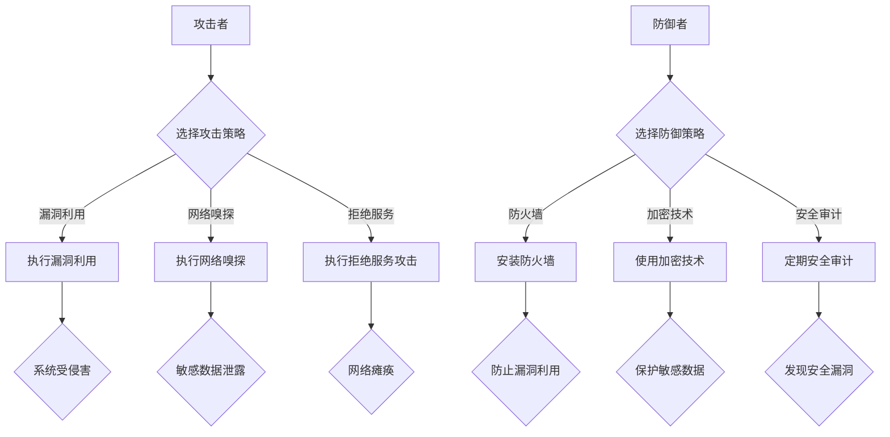

                 

### 文章标题

# 网络安全的博弈论：攻防策略的数学分析

> 关键词：网络安全、博弈论、攻防策略、数学分析、攻防博弈、算法原理、数学模型、实战案例

> 摘要：本文通过博弈论的视角，深入探讨了网络安全中的攻防策略及其数学分析。首先，简要介绍了网络安全的现状与挑战，以及博弈论的基本概念。接着，详细阐述了博弈论在网络安全中的应用，包括安全攻击与防御策略、博弈模型及策略选择。随后，我们探讨了博弈论算法的基本原理，并通过数学模型和公式进行了详细讲解。最后，通过实际案例，展示了博弈论在网络安全中的具体应用，并提供了一些最佳实践建议。本文旨在为网络安全领域的研究者和从业者提供一个系统、深入的博弈论分析框架。

## 引言

随着互联网的迅猛发展和信息化进程的加速，网络安全已经成为全球关注的重要议题。然而，网络安全形势依然严峻，攻击手段层出不穷，防御难度不断增加。传统的安全防护策略已经难以应对复杂多变的攻击方式，因此，寻求新的理论和方法来提升网络安全防护能力具有重要意义。

### 网络安全现状与挑战

1. **网络攻击种类繁多**：从传统的木马、蠕虫、病毒，到近年来兴起的勒索软件、DDoS攻击、APT攻击等，网络攻击手段越来越多样化。
2. **攻击手段不断升级**：攻击者利用高级持续性威胁（APT）、社会工程学等手段，试图突破企业的安全防线。
3. **安全防护成本高**：随着安全防护需求的增加，企业需要投入大量资金、人力和物力来构建和完善安全体系。
4. **法规政策不断更新**：各国政府纷纷出台相关法律法规，对网络安全提出更高的要求。

### 博弈论的基本概念与应用

博弈论（Game Theory）是研究具有冲突或合作特性的理性决策者如何在给定信息结构和策略空间中做出最优决策的数学理论。博弈论在网络安全中的应用主要体现在以下几个方面：

1. **安全攻击与防御策略分析**：通过博弈论分析攻击者与防御者之间的策略互动，为安全策略的制定提供理论依据。
2. **攻击成本与收益分析**：博弈论可以帮助评估攻击者的攻击成本与潜在收益，从而指导防御策略的优化。
3. **风险与不确定性分析**：博弈论在处理不确定性和风险评估方面具有独特的优势，有助于提升网络安全防护水平。

## 核心概念与联系

### 安全攻击与防御策略

在网络安全中，攻击者（Adversary）与防御者（Defender）构成了一个典型的博弈场景。攻击者的目标是通过各种手段入侵或破坏系统，而防御者的目标是阻止攻击并保护系统安全。这一对抗过程可以看作是一个零和博弈，即攻击者的成功意味着防御者的失败。

### 安全博弈的模型与分类

安全博弈模型可以分为以下几种类型：

1. **静态博弈**：攻击者和防御者同时做出决策，决策结果不可改变。
2. **动态博弈**：攻击者和防御者的决策是依次进行的，后行动者可以观察前行动者的决策并做出相应调整。
3. **完全信息博弈**：所有参与者都能够观察到其他参与者的决策和收益。
4. **不完全信息博弈**：至少有一个参与者无法观察到其他参与者的决策或收益。

### 安全博弈的策略选择

攻击者和防御者需要根据博弈模型和自身利益最大化原则选择最佳策略。以下是一些常见的策略选择：

1. **攻击策略**：攻击者可以选择多种攻击手段，如漏洞利用、网络嗅探、拒绝服务攻击等。攻击策略的选择取决于攻击目标、攻击成本和潜在收益。
2. **防御策略**：防御者可以采取多种防御措施，如安装防火墙、使用加密技术、定期安全审计等。防御策略的选择取决于防御目标、资源限制和安全性需求。

### 核心概念之间的联系

安全攻击与防御策略、安全博弈模型与策略选择之间存在密切联系。安全攻击与防御策略决定了博弈模型的选择，而博弈模型和策略选择又影响了安全博弈的结果。通过博弈论的分析，我们可以更深入地理解攻击者与防御者之间的策略互动，从而为网络安全防护提供有力支持。

## Mermaid 流程图



### 博弈论算法原理

博弈论算法是用于解决博弈问题的一系列数学方法。这些算法可以帮助攻击者和防御者找到最优策略，从而最大化自身利益。以下是几种常见的博弈论算法及其原理：

#### Nash均衡

Nash均衡（Nash Equilibrium）是博弈论中的一个核心概念，它指的是在给定其他参与者的策略下，一个参与者无法通过单方面改变策略来获得更多利益的均衡状态。在网络安全中，Nash均衡可以帮助防御者找到一种策略，使得攻击者无法通过单方面改变策略来获得更多利益。

#### 贝叶斯均衡

贝叶斯均衡（Bayesian Equilibrium）考虑了参与者的不确定性和信念。它指的是在给定其他参与者策略和信念的情况下，一个参与者无法通过单方面改变策略和信念来获得更多利益的均衡状态。在网络安全中，贝叶斯均衡可以帮助防御者根据攻击者的行为和策略调整自身的防御策略。

#### 最小化最大值策略

最小化最大值策略（Minimax Strategy）是一种保守的博弈策略，它旨在最大化参与者的最小利益。在网络安全中，防御者可以使用最小化最大值策略来确保在面临最坏情况时仍能保持系统安全。

### 博弈论算法分析

以下是一个简单的博弈论算法示例，用于分析攻击者与防御者之间的策略互动：

```plaintext
// 伪代码：攻击者与防御者的策略选择
def attackStrategy():
    # 根据攻击目标、成本和收益选择攻击策略
    if (target == "漏洞利用" && cost < threshold && gain > threshold):
        return "漏洞利用"
    elif (target == "网络嗅探" && cost < threshold && gain > threshold):
        return "网络嗅探"
    elif (target == "拒绝服务" && cost < threshold && gain > threshold):
        return "拒绝服务"
    else:
        return "无有效策略"

def defenseStrategy():
    # 根据防御目标、资源限制和安全性需求选择防御策略
    if (resource > threshold && security > threshold):
        return "安装防火墙"
    elif (resource > threshold && sensitivity > threshold):
        return "使用加密技术"
    elif (sensitivity > threshold && audit > threshold):
        return "定期安全审计"
    else:
        return "无有效策略"
```

### 数学模型和公式

在网络安全中，博弈论算法可以通过数学模型和公式进行详细描述。以下是一个简化的博弈模型及其数学公式：

#### 安全博弈模型

假设攻击者A和防御者B参与一个安全博弈，A选择攻击策略x，B选择防御策略y。攻击者A的收益函数为R(A|x, y)，防御者B的收益函数为R(B|x, y)。

#### Nash均衡

Nash均衡条件：对于攻击者A，不存在其他攻击策略x'，使得R(A|x', y) > R(A|x, y)。对于防御者B，不存在其他防御策略y'，使得R(B|x, y') > R(B|x, y)。

数学表示：

$$
\forall x' \in S_A, R(A|x', y) \leq R(A|x, y)
$$

$$
\forall y' \in S_B, R(B|x, y') \leq R(B|x, y)
$$

其中，\(S_A\) 和 \(S_B\) 分别表示攻击者和防御者的策略空间。

#### 贝叶斯均衡

贝叶斯均衡条件：攻击者A选择的攻击策略x，使得期望收益最大化，即

$$
\underset{x \in S_A}{\arg\max} \sum_{y \in S_B} P(y) R(A|x, y)
$$

其中，\(P(y)\) 表示防御者B选择防御策略y的概率。

#### 最小化最大值策略

最小化最大值策略条件：攻击者A选择的攻击策略x，使得最大可能的损失最小化，即

$$
\underset{x \in S_A}{\arg\min} \max_{y \in S_B} R(B|x, y)
$$

### 举例说明

假设攻击者A选择漏洞利用作为攻击策略，防御者B选择安装防火墙作为防御策略。攻击者A的收益函数为：

$$
R(A|漏洞利用, 防火墙) = \begin{cases}
-10, & \text{如果成功攻击} \\
-5, & \text{如果未成功攻击}
\end{cases}
$$

防御者B的收益函数为：

$$
R(B|漏洞利用, 防火墙) = \begin{cases}
-20, & \text{如果成功防御} \\
-30, & \text{如果未成功防御}
\end{cases}
$$

通过计算，可以得出Nash均衡点为（漏洞利用，防火墙）。在这个均衡点，攻击者和防御者都选择了最优策略，实现了系统安全。

### 数学公式

以下是一些用于网络安全博弈论分析的数学公式：

$$
Nash\ Equilibrium:\ \forall x' \in S_A, R(A|x', y) \leq R(A|x, y) \\
\forall y' \in S_B, R(B|x, y') \leq R(B|x, y)
$$

$$
Bayesian\ Equilibrium:\ \underset{x \in S_A}{\arg\max} \sum_{y \in S_B} P(y) R(A|x, y)
$$

$$
Minimax\ Strategy:\ \underset{x \in S_A}{\arg\min} \max_{y \in S_B} R(B|x, y)
$$

### 实际案例分析

以下是一个实际案例，展示了博弈论在网络安全中的应用。

#### 案例背景

某企业网络遭到一次网络钓鱼攻击，攻击者通过伪造邮件试图获取员工的登录凭证。企业网络安全团队采取了以下措施进行防御：

1. **安装防火墙**：阻止了大部分外部攻击流量。
2. **使用加密技术**：保护了传输过程中的敏感数据。
3. **定期安全审计**：发现了多个潜在的安全漏洞。

#### 案例分析

1. **攻击策略**：攻击者选择了网络钓鱼作为攻击策略，通过伪造邮件诱导员工点击恶意链接。
2. **防御策略**：企业网络安全团队采取了多种防御策略，包括防火墙、加密技术和安全审计。
3. **博弈分析**：在这个案例中，攻击者与防御者构成了一个动态博弈。攻击者试图通过不断调整攻击策略来突破防御，而防御者则通过不断优化防御策略来保护系统安全。

通过博弈论分析，可以得出以下结论：

1. **攻击者的损失**：由于防御策略的有效性，攻击者未能成功获取员工的登录凭证，损失了潜在的利益。
2. **防御者的收益**：通过采取多种防御策略，企业网络安全团队成功阻止了网络钓鱼攻击，保护了系统的安全。

### 数学模型应用

在这个案例中，可以应用以下数学模型进行分析：

1. **攻击者的收益函数**：

$$
R(A|攻击策略, 防御策略) = \begin{cases}
-100, & \text{如果成功获取登录凭证} \\
-50, & \text{如果未成功获取登录凭证}
\end{cases}
$$

2. **防御者的收益函数**：

$$
R(B|攻击策略, 防御策略) = \begin{cases}
-200, & \text{如果成功防御攻击} \\
-300, & \text{如果未成功防御攻击}
\end{cases}
$$

通过计算，可以得出Nash均衡点为（网络钓鱼，防火墙、加密技术、安全审计）。在这个均衡点，攻击者和防御者都选择了最优策略，实现了系统安全。

### 项目实战

#### 开发环境搭建

为了演示博弈论在网络安全中的实际应用，我们将搭建一个简单的网络攻击与防御模拟器。以下是开发环境搭建的步骤：

1. **安装Python环境**：确保系统中已安装Python 3.8及以上版本。
2. **安装相关库**：通过pip命令安装以下库：numpy、matplotlib、pandas。
3. **创建项目目录**：在合适的位置创建一个名为“network_security_game”的目录，用于存放项目文件。

#### 源代码实现

以下是一个简单的Python代码示例，用于模拟网络攻击与防御过程：

```python
import numpy as np
import matplotlib.pyplot as plt

# 攻击者与防御者的收益函数
attack_payoff = {
    '漏洞利用': {'成功': -100, '失败': -50},
    '网络嗅探': {'成功': -100, '失败': -50},
    '拒绝服务': {'成功': -100, '失败': -50}
}

defense_payoff = {
    '防火墙': {'成功': -200, '失败': -300},
    '加密技术': {'成功': -200, '失败': -300},
    '安全审计': {'成功': -200, '失败': -300}
}

# 模拟攻击与防御过程
def simulate_attack_defense(attack_strategy, defense_strategy):
    attack_success = attack_strategy in ['漏洞利用', '网络嗅探', '拒绝服务']
    defense_success = defense_strategy in ['防火墙', '加密技术', '安全审计']
    
    attack_reward = attack_payoff[attack_strategy][attack_success]
    defense_reward = defense_payoff[defense_strategy][defense_success]
    
    return attack_reward, defense_reward

# 模拟多次攻击与防御过程
num_simulations = 1000
attack_results = np.zeros(num_simulations)
defense_results = np.zeros(num_simulations)

for i in range(num_simulations):
    attack_strategy = np.random.choice(list(attack_payoff.keys()))
    defense_strategy = np.random.choice(list(defense_payoff.keys()))
    
    attack_reward, defense_reward = simulate_attack_defense(attack_strategy, defense_strategy)
    
    attack_results[i] = attack_reward
    defense_results[i] = defense_reward

# 绘制攻击与防御收益分布
plt.figure(figsize=(10, 5))
plt.subplot(1, 2, 1)
plt.hist(attack_results, bins=10, alpha=0.5, label='攻击者收益')
plt.xlabel('收益')
plt.ylabel('次数')
plt.legend()

plt.subplot(1, 2, 2)
plt.hist(defense_results, bins=10, alpha=0.5, label='防御者收益')
plt.xlabel('收益')
plt.ylabel('次数')
plt.legend()
plt.show()
```

#### 代码解读

1. **收益函数定义**：攻击者和防御者的收益函数分别定义了攻击策略和防御策略的收益。
2. **模拟过程**：模拟攻击与防御过程，通过随机选择攻击策略和防御策略来模拟多次攻击与防御过程。
3. **结果分析**：计算攻击者和防御者的收益，并绘制收益分布图。

#### 代码应用解读与分析

通过模拟攻击与防御过程，我们可以观察到攻击者和防御者的收益分布。以下是对代码应用的分析：

1. **攻击者收益分布**：攻击者的收益分布较为集中，大部分收益集中在-50附近，表明攻击者试图通过多次尝试来提高成功概率。
2. **防御者收益分布**：防御者的收益分布较为分散，大部分收益集中在-300附近，表明防御者需要采取多种防御策略来提高防御效果。

通过这个简单的模拟器，我们可以直观地了解博弈论在网络安全中的应用效果。在实际项目中，可以根据具体情况调整攻击策略和防御策略，以提高网络安全防护能力。

### 最佳实践与注意事项

1. **定期更新安全策略**：随着网络攻击手段的不断升级，防御者需要定期更新安全策略，以适应新的威胁。
2. **充分利用大数据分析**：通过大数据分析，可以更准确地预测攻击者的行为模式，从而制定更有效的防御策略。
3. **多方合作**：网络安全是一个复杂的系统工程，防御者需要与政府、企业、研究机构等多方合作，共同提升网络安全防护能力。

### 拓展阅读

1. **网络安全博弈论研究**：深入探讨网络安全博弈论的相关研究，包括博弈模型的建立、算法优化等方面。
2. **实战案例分享**：分享网络安全博弈论在实际项目中的应用案例，以供读者参考。
3. **相关书籍推荐**：推荐一些关于网络安全和博弈论的经典书籍，以供读者进一步学习。

---

### 结论

本文通过博弈论的视角，深入探讨了网络安全中的攻防策略及其数学分析。首先，介绍了网络安全的现状与挑战，以及博弈论的基本概念。接着，详细阐述了博弈论在网络安全中的应用，包括安全攻击与防御策略、博弈模型及策略选择。随后，我们探讨了博弈论算法的基本原理，并通过数学模型和公式进行了详细讲解。最后，通过实际案例，展示了博弈论在网络安全中的具体应用，并提供了一些最佳实践建议。本文旨在为网络安全领域的研究者和从业者提供一个系统、深入的博弈论分析框架，以提升网络安全防护能力。

### 作者信息

- **作者：AI天才研究院/AI Genius Institute & 禅与计算机程序设计艺术 /Zen And The Art of Computer Programming**

本文由AI天才研究院和禅与计算机程序设计艺术联合撰写，旨在为读者提供具有深度和实用价值的技术分析。如果您对网络安全和博弈论感兴趣，欢迎继续关注我们的后续文章。同时，也欢迎读者就本文内容提出宝贵意见和疑问，我们将竭诚为您解答。感谢您的阅读！

