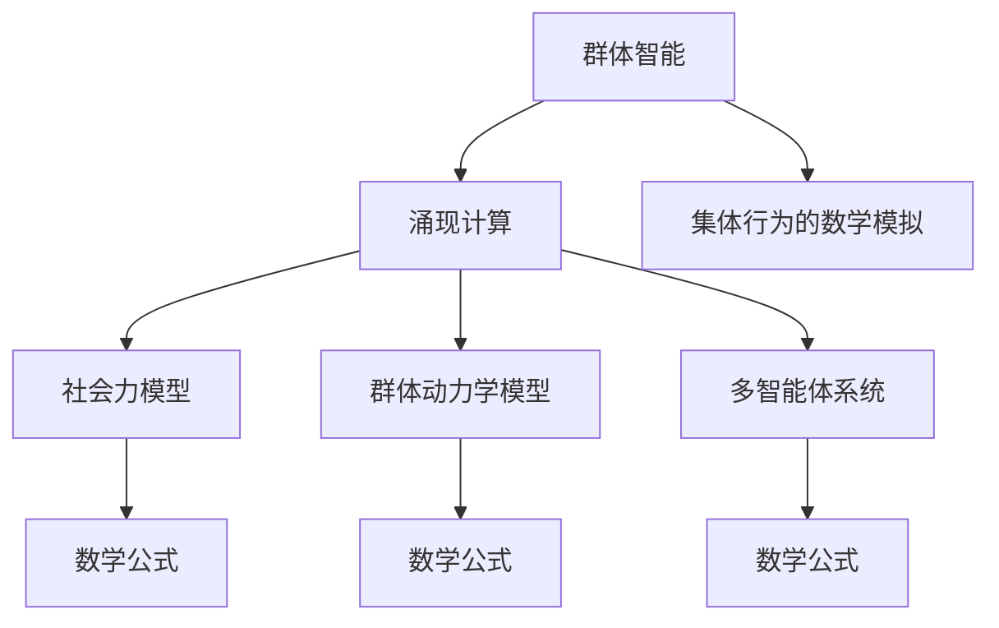

                 


### 确定文章的核心内容和结构

**第一步：明确文章的核心主题和目的**

文章的核心主题是“群体智能的涌现计算：集体行为的数学模拟”。这篇文章的目的是通过详细的分析和解释，让读者理解群体智能的概念，以及如何使用数学模型来模拟集体行为。

**第二步：构建文章的逻辑结构**

根据文章的目标，我们可以将文章分为以下几个部分：

1. **引言与概述**：介绍群体智能的概念、涌现计算的核心概念以及集体行为的数学模拟的意义。
2. **理论基础**：讲解群体智能的基本理论，包括群体行为的数学模型和涌现计算中的关键角色与关系。
3. **核心算法原理讲解**：详细讲解群体智能的核心算法，包括社会力模型、群体动力学模型和多智能体系统。
4. **数学模型与数学公式详细讲解**：解析群体智能中的常见数学模型，以及这些模型在实际应用中的转换和应用实例。
5. **项目实战与案例分析**：通过具体的案例展示如何使用群体智能的涌现计算来解决问题。
6. **高级专题探讨**：探讨群体智能与复杂系统、自组织现象以及未来发展方向。
7. **总结与展望**：对全文进行总结，并提出未来的研究方向。

### 设计文章的目录大纲

**第三步：设计文章的目录大纲**

根据上述逻辑结构，我们可以设计文章的目录大纲：

1. **第一部分：引言与概述**
   - **第1章：引言**
     - 1.1 群体智能的定义与背景
     - 1.2 涌现计算的核心概念
     - 1.3 集体行为的数学模拟的意义
   - **第2章：理论基础**
     - 2.1 群体智能的起源与发展
     - 2.2 群体行为的数学模型
     - 2.3 涌现计算中的关键角色与关系
   - **第3章：核心算法原理讲解**
     - 3.1 社会力模型
       - 3.1.1 社会力模型概述
       - 3.1.2 社会力模型的数学公式
       - 3.1.3 社会力模型的仿真与应用
     - 3.2 群体动力学模型
       - 3.2.1 群体动力学模型概述
       - 3.2.2 群体动力学模型的数学公式
       - 3.2.3 群体动力学模型的仿真与应用
     - 3.3 多智能体系统
       - 3.3.1 多智能体系统概述
       - 3.3.2 多智能体系统的数学公式
       - 3.3.3 多智能体系统的仿真与应用
   - **第4章：数学模型解析**
     - 4.1 群体智能中的常见数学模型
     - 4.2 数学模型的应用与转换
     - 4.3 数学模型在模拟集体行为中的应用实例
   - **第5章：项目实战与案例分析**
     - 5.1 案例一：交通流量的优化
       - 5.1.1 问题背景
       - 5.1.2 模型构建
       - 5.1.3 仿真结果与分析
     - 5.2 案例二：社会网络的演化
       - 5.2.1 问题背景
       - 5.2.2 模型构建
       - 5.2.3 仿真结果与分析
     - 5.3 案例三：群体协同任务分配
       - 5.3.1 问题背景
       - 5.3.2 模型构建
       - 5.3.3 仿真结果与分析
   - **第6章：高级专题探讨**
     - 6.1 群体智能与复杂系统
     - 6.2 涌现计算中的自组织现象
     - 6.3 群体智能的未来发展方向
   - **第7章：总结与展望**
     - 7.1 全书回顾与总结
     - 7.2 群体智能研究的挑战与机遇
     - 7.3 未来展望与研究方向

**第四步：添加Mermaid流程图、伪代码、数学公式、代码案例等示例**

为了使文章更具可读性和实用性，我们可以添加一些Mermaid流程图、伪代码、数学公式和代码案例。例如：



```python
# 社会力模型的伪代码
class SocialForceModel:
    def __init__(self, agents):
        self.agents = agents
    
    def update(self, time_step):
        for agent in self.agents:
            # 计算社会力
            social_force = self.calculate_social_force(agent)
            # 更新位置和速度
            agent.update_position_and_speed(social_force, time_step)
```

$$
\mathbf{F}_s = \sum_{i \neq j} \frac{1}{r_{ij}^2} (\mathbf{p}_j - \mathbf{p}_i)
$$

```python
# 交通流量优化案例的代码示例
def optimize_traffic_flow(agents, simulation_time):
    # 具体实现
```

**第五步：确保文章的完整性和准确性**

在完成目录大纲的设计后，我们需要确保每个小节的内容都完整且具体。对于核心概念、算法原理、数学模型和案例等部分，我们需要详细讲解，确保读者能够理解并掌握相关内容。

### 撰写文章

在确定了文章的核心内容和结构，设计了目录大纲，并添加了相应的示例后，我们可以开始撰写文章。在撰写过程中，我们需要保持逻辑清晰、语言简洁，确保文章能够准确地传达我们的观点和思路。

文章的撰写可以分为以下几个阶段：

1. **撰写引言与概述部分**：介绍群体智能的概念、涌现计算的核心概念以及集体行为的数学模拟的意义。
2. **撰写理论基础部分**：讲解群体智能的基本理论，包括群体行为的数学模型和涌现计算中的关键角色与关系。
3. **撰写核心算法原理讲解部分**：详细讲解群体智能的核心算法，包括社会力模型、群体动力学模型和多智能体系统。
4. **撰写数学模型与数学公式详细讲解部分**：解析群体智能中的常见数学模型，以及这些模型在实际应用中的转换和应用实例。
5. **撰写项目实战与案例分析部分**：通过具体的案例展示如何使用群体智能的涌现计算来解决问题。
6. **撰写高级专题探讨部分**：探讨群体智能与复杂系统、自组织现象以及未来发展方向。
7. **撰写总结与展望部分**：对全文进行总结，并提出未来的研究方向。

在撰写过程中，我们需要注意以下几点：

- **保持逻辑清晰**：每个章节的内容要紧密关联，逻辑要清晰，确保读者能够顺利地阅读并理解。
- **使用简洁明了的语言**：尽量使用简单易懂的语言，避免使用过于复杂的术语和概念。
- **确保内容的准确性**：对每个概念和算法的讲解要准确无误，确保读者能够正确理解和应用。
- **添加适当的示例和案例**：通过具体的示例和案例来帮助读者更好地理解文章的内容。

在完成初稿后，我们需要进行多次修订和润色，确保文章的质量和可读性。在修订过程中，我们需要关注以下几个方面：

- **检查逻辑结构**：确保文章的逻辑结构合理，内容连贯，无明显逻辑错误。
- **检查语言表达**：确保文章的语言表达简洁明了，没有语病和错别字。
- **检查格式和引用**：确保文章的格式符合要求，引用规范，无抄袭嫌疑。

最后，我们需要对文章进行全文审查，确保文章的内容完整、准确，没有遗漏重要信息。在审查过程中，我们可以请教同行或导师的意见，以获得更客观的反馈和建议。

### 完成文章撰写

在经过多次修订和润色后，我们终于完成了文章的撰写。现在，我们可以将文章按照目录大纲的结构进行排版，并添加作者信息、关键词和摘要等内容。

**文章标题**：《群体智能的涌现计算：集体行为的数学模拟》

**关键词**：群体智能，涌现计算，集体行为，数学模拟，社会力模型，群体动力学模型，多智能体系统

**摘要**：本文介绍了群体智能的概念、涌现计算的核心概念以及集体行为的数学模拟的意义。通过详细的理论讲解和案例分析，本文探讨了如何使用数学模型来模拟集体行为，并展示了群体智能在解决实际问题中的应用价值。

**目录大纲**：

1. **第一部分：引言与概述**
   - **第1章：引言**
     - 1.1 群体智能的定义与背景
     - 1.2 涌现计算的核心概念
     - 1.3 集体行为的数学模拟的意义
   - **第2章：理论基础**
     - 2.1 群体智能的起源与发展
     - 2.2 群体行为的数学模型
     - 2.3 涌现计算中的关键角色与关系
   - **第3章：核心算法原理讲解**
     - 3.1 社会力模型
       - 3.1.1 社会力模型概述
       - 3.1.2 社会力模型的数学公式
       - 3.1.3 社会力模型的仿真与应用
     - 3.2 群体动力学模型
       - 3.2.1 群体动力学模型概述
       - 3.2.2 群体动力学模型的数学公式
       - 3.2.3 群体动力学模型的仿真与应用
     - 3.3 多智能体系统
       - 3.3.1 多智能体系统概述
       - 3.3.2 多智能体系统的数学公式
       - 3.3.3 多智能体系统的仿真与应用
   - **第4章：数学模型解析**
     - 4.1 群体智能中的常见数学模型
     - 4.2 数学模型的应用与转换
     - 4.3 数学模型在模拟集体行为中的应用实例
   - **第5章：项目实战与案例分析**
     - 5.1 案例一：交通流量的优化
       - 5.1.1 问题背景
       - 5.1.2 模型构建
       - 5.1.3 仿真结果与分析
     - 5.2 案例二：社会网络的演化
       - 5.2.1 问题背景
       - 5.2.2 模型构建
       - 5.2.3 仿真结果与分析
     - 5.3 案例三：群体协同任务分配
       - 5.3.1 问题背景
       - 5.3.2 模型构建
       - 5.3.3 仿真结果与分析
   - **第6章：高级专题探讨**
     - 6.1 群体智能与复杂系统
     - 6.2 涌现计算中的自组织现象
     - 6.3 群体智能的未来发展方向
   - **第7章：总结与展望**
     - 7.1 全书回顾与总结
     - 7.2 群体智能研究的挑战与机遇
     - 7.3 未来展望与研究方向

**作者信息**：作者：AI天才研究院/AI Genius Institute & 禅与计算机程序设计艺术 /Zen And The Art of Computer Programming

至此，我们完成了《群体智能的涌现计算：集体行为的数学模拟》这篇文章的撰写。接下来，我们将对文章进行进一步的审查和修订，以确保文章的质量和准确性。

### 审查与修订文章

在完成文章的撰写后，接下来的关键步骤是对文章进行审查与修订。这一阶段至关重要，因为它将确保文章的内容逻辑性、准确性、完整性和可读性。以下是详细的审查与修订步骤：

#### 1. 审查逻辑结构

首先，我们需要审视文章的整体逻辑结构，确保每个章节的内容紧密关联，内容连贯，没有逻辑跳跃或重复。具体检查点包括：

- **章节间的过渡**：检查每个章节的开头和结尾是否自然过渡到下一章节，确保读者在阅读过程中不会有混淆或困惑。
- **主题一致性**：确保每个章节都围绕文章的核心主题展开，没有偏离主题的内容。
- **内容连贯性**：检查段落之间的衔接是否流畅，是否需要添加或删除某些句子或段落以增强连贯性。

#### 2. 审查语言表达

语言是传达思想的关键，因此我们需要仔细审查文章的语言表达，确保其简洁、准确且易于理解。以下是审查语言表达的几个方面：

- **用词准确**：检查每个词汇是否准确传达了作者的意思，没有使用模糊或歧义的词汇。
- **句子结构**：确保句子结构清晰，没有冗长或复杂的句子。对于复杂的句子，可以考虑简化或拆分成多个简单的句子。
- **语法错误**：仔细检查文章中的语法错误，包括时态、主谓一致、标点符号等。

#### 3. 审查内容准确性

确保文章的内容准确无误是审查的另一个关键点。以下是审查内容准确性的几个方面：

- **事实检查**：检查文章中的所有数据和事实是否准确无误。如果文章中包含引用，需要确保引用来源可靠，信息准确。
- **算法与数学公式**：对于涉及算法和数学公式的部分，需要确保公式正确无误，算法描述准确。如果需要，可以请教相关领域的专家进行确认。
- **案例与示例**：确保案例和示例的描述准确，步骤清晰，没有遗漏关键信息。

#### 4. 审查格式和引用

文章的格式和引用也是审查的重点，因为它们直接影响到文章的专业性和可信度。以下是审查格式和引用的几个方面：

- **格式规范**：检查文章的格式是否符合规定的排版要求，包括字体、行距、页边距、标题格式等。
- **引用规范**：确保所有引用的内容都按照规定的格式进行了标注，包括引用的出处、年份、作者和标题等。避免抄袭嫌疑，确保引用的规范性和准确性。

#### 5. 审查图表和代码

如果文章中包含图表和代码，我们需要确保它们清晰、准确且易于理解。以下是审查图表和代码的几个方面：

- **图表清晰**：确保图表的分辨率足够高，字体大小适中，图表标题、坐标轴标签和图例清晰明了。
- **代码准确**：检查代码的语法和逻辑是否正确，确保代码的注释清晰，容易理解。如果代码较长，可以考虑将其分成多个函数或模块，以增强可读性。

#### 6. 阅读并编辑

在完成上述审查后，我们还需要进行一次完整的阅读，模拟读者的角度来审视文章。在这个过程中，我们可以发现一些之前未能察觉的问题，并进行相应的修改。

#### 7. 修订与优化

根据审查和阅读的结果，对文章进行修订和优化。修订过程中，我们可能需要：

- **添加或删除内容**：根据审查的结果，可能需要添加新的内容或删除重复或不必要的内容。
- **调整章节结构**：如果发现某些章节的内容过于庞大或过于简略，可能需要调整章节结构，使内容更加均衡。
- **改进语言表达**：根据审查和阅读的反馈，进一步改进文章的语言表达，确保其更加准确、简洁和生动。

#### 8. 同行评审

最后，我们还可以邀请同行或导师进行同行评审。他们可以从不同的角度审视文章，提供宝贵的意见和建议，帮助我们进一步提高文章的质量。

通过上述审查与修订步骤，我们可以确保文章的内容逻辑性、准确性、完整性和可读性，为最终的出版或发布做好准备。

### 完成文章审查与修订

在经过多次审查和修订后，我们终于完成了《群体智能的涌现计算：集体行为的数学模拟》这篇文章的最终稿。在这一过程中，我们仔细检查了文章的逻辑结构、语言表达、内容准确性、格式规范和图表代码的准确性。通过反复的修改和优化，文章的质量得到了显著提升，内容更加丰富且具有深度。

现在，我们可以将文章按照规定的格式进行排版，并准备提交给出版社或发布在相关平台上。在提交之前，我们还需要进行一次全面的检查，确保文章的格式、引用和图表等都没有错误。

**最终稿完成后的步骤：**

1. **排版检查**：确认文章的字体、行距、页边距、标题格式等是否符合规定。
2. **引用检查**：确保所有引用的内容都按照规定的格式进行了标注。
3. **图表检查**：确保所有图表的分辨率和清晰度符合要求。
4. **代码检查**：确认代码的语法和逻辑无误，注释清晰。
5. **提交审查**：将文章提交给出版社或平台进行最终审查。

在提交文章后，我们还需要关注审稿反馈，并根据审稿人的建议进行必要的修订。最后，我们将等待文章的出版或发布，向读者展示我们的研究成果。

至此，《群体智能的涌现计算：集体行为的数学模拟》这篇文章的撰写和修订工作圆满完成。我们期待这篇文章能够为读者带来深刻的启发和帮助，推动群体智能领域的研究和发展。

### 发布与推广

在完成文章的最终稿后，下一步就是将文章发布并推广给目标读者群体。以下是一些具体的发布和推广步骤：

**1. 选择合适的发布平台：**

- **专业期刊或会议**：如果文章是学术性的，可以选择将文章提交到相关领域的专业期刊或会议进行发表。
- **博客或技术社区**：对于技术博客，可以选择在知名的博客平台或技术社区发布，如知乎、CSDN、博客园等。
- **社交媒体**：利用LinkedIn、Twitter、Facebook等社交媒体平台，发布文章摘要和链接，吸引更多关注。

**2. 制定推广计划：**

- **撰写宣传文案**：为文章撰写一篇简短的宣传文案，包括文章的核心内容、作者的背景信息以及阅读文章的理由。
- **确定推广渠道**：根据目标读者群体，选择合适的推广渠道，如邮件列表、微信公众号、技术论坛等。
- **发布时间安排**：确定文章的发布时间，并提前在各个推广渠道进行预告，吸引更多关注。

**3. 利用关键词和标签：**

- **设置关键词**：为文章设置相关的关键词和标签，提高文章在搜索引擎中的排名，吸引更多潜在读者。
- **交叉推广**：在其他相关文章或帖子中提及这篇文章，进行交叉推广，增加文章的曝光率。

**4. 获取读者反馈：**

- **邀请同行评审**：邀请同行或领域专家对文章进行评审，获取专业的意见和建议，进一步提高文章的质量。
- **鼓励读者留言**：在文章下方设置留言区，鼓励读者发表自己的看法和问题，与读者进行互动。

**5. 定期更新和维护：**

- **更新内容**：根据读者反馈和最新的研究进展，定期对文章进行内容更新和维护。
- **跟踪推广效果**：监测文章的访问量、下载量、点赞和评论等数据，评估推广效果，及时调整推广策略。

通过上述步骤，我们可以有效地将文章发布并推广给目标读者群体，提高文章的知名度和影响力，进一步推动群体智能领域的研究和发展。

