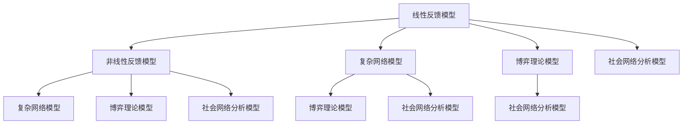

                 

# 文章标题

《群体极化的非线性反馈系统：舆论动态的数学描述》

## 文章关键词

群体极化、非线性反馈系统、舆论动态、数学模型、社会网络分析、意见同步、决策制定

## 文章摘要

本文旨在探讨群体极化现象及其背后的非线性反馈系统在舆论动态中的角色。通过构建和分析数学模型，本文揭示了舆论动态的内在机制，并探讨了不同模型在现实世界中的应用。文章首先介绍了群体极化的背景和重要性，然后详细介绍了非线性反馈系统的基本概念和数学描述。随后，文章探讨了不同类型的数学模型，包括线性反馈模型和非线性反馈模型，以及复杂网络模型和博弈理论模型。接着，文章分析了舆论动态的稳定性、同步性和社会网络的影响。最后，文章通过实际案例展示了非线性反馈系统在公共舆论研究中的广泛应用，并提出了未来的研究方向。

## 引言

### 背景介绍

群体极化（Group Polarization）是指在群体讨论或决策过程中，成员的观点趋向于比初始观点更为极端的现象。这一现象在多个领域都有广泛的应用，如政治、商业、科学决策等。随着社交媒体和互联网的兴起，群体极化现象变得尤为显著，因为它使得个体更容易接触到相似的观念，从而强化了原有的观点。

### 研究意义

理解群体极化的机制对于制定有效的社会政策和促进理性讨论具有重要意义。然而，群体极化现象的复杂性使得传统的线性模型难以准确描述其动态变化。非线性反馈系统作为一种更复杂的模型，能够更好地捕捉群体极化过程中的非线性特征和动态变化。因此，研究非线性反馈系统在群体极化中的应用具有重要的理论价值和现实意义。

### 非线性反馈系统

非线性反馈系统是指在系统内部存在非线性相互作用和反馈的动力学系统。这种系统具有以下特点：

1. **非线性相互作用**：系统内部的变量之间不是简单的线性关系，而是存在复杂的关系和相互作用。
2. **反馈机制**：系统内部存在正反馈和负反馈机制，这些机制可以影响系统的稳定性和动态行为。
3. **多稳态和混沌**：非线性反馈系统可能存在多个稳定状态，甚至在某些条件下可能表现出混沌行为。

### 舆论动态

舆论动态是指公众意见的生成、传播和演变过程。舆论动态受到多种因素的影响，包括个体观点、群体互动、外部环境等。理解舆论动态的数学描述有助于我们更好地预测和解释公众意见的变化，从而为政策制定和公共讨论提供科学依据。

### 文章结构

本文结构如下：

1. **第一部分**：介绍群体极化的背景和重要性，以及非线性反馈系统的基本概念。
2. **第二部分**：探讨不同类型的数学模型，包括线性反馈模型和非线性反馈模型。
3. **第三部分**：分析舆论动态的稳定性、同步性和社会网络的影响。
4. **第四部分**：通过实际案例展示非线性反馈系统在公共舆论研究中的应用。
5. **第五部分**：讨论未来的研究方向和挑战。

## 第一部分：群体极化的非线性反馈系统

### 1.1 群体极化的概念

群体极化是指在群体讨论或决策过程中，成员的观点趋向于比初始观点更为极端的现象。群体极化现象通常发生在以下几种情境中：

1. **共识寻求**：个体在群体中寻求共识，为了获得认同感，可能会倾向于提出更极端的观点。
2. **竞争和对抗**：在竞争或对抗的环境中，个体可能会为了显示自己的观点更具有说服力，而提出更极端的论点。
3. **信息过滤**：个体在接收和处理信息时，可能会根据群体中已有的观点来过滤信息，从而加强已有观点。

### 1.2 群体极化的影响

群体极化现象对社会和个体都有重要影响：

1. **社会层面**：群体极化可能导致社会分裂和对立加剧，影响社会和谐与稳定。
2. **个体层面**：群体极化可能使个体失去独立思考的能力，从而导致盲目跟从和思维僵化。

### 1.3 非线性反馈系统在群体极化中的作用

非线性反馈系统在群体极化中扮演着关键角色。非线性反馈系统通过以下机制影响群体极化：

1. **正反馈**：正反馈机制可以放大个体间的差异，使得群体观点趋向极端。
2. **非线性相互作用**：非线性相互作用使得群体内部的动态变化更加复杂，可能导致群体观点的非线性增长。
3. **多稳态**：非线性反馈系统可能存在多个稳定状态，这可能导致群体观点在多个极端之间振荡。

### 1.4 非线性反馈系统的基本概念

非线性反馈系统是由非线性相互作用和反馈机制组成的动力学系统。以下是几个关键概念：

1. **非线性相互作用**：系统内部的变量之间不是简单的线性关系，而是存在复杂的关系和相互作用。
2. **反馈机制**：系统内部存在正反馈和负反馈机制，这些机制可以影响系统的稳定性和动态行为。
3. **吸引子**：系统可能收敛到某些特定的状态，这些状态被称为吸引子。在群体极化中，吸引子代表了群体观点的极端状态。

### 1.5 群体极化的非线性反馈模型

为了更好地理解群体极化现象，研究者们提出了多种非线性反馈模型。以下是一个简单的非线性反馈模型：

$$
\frac{dX}{dt} = f(X, Y) - g(X)
$$

其中，$X$ 和 $Y$ 分别代表个体和群体的观点，$f(X, Y)$ 表示非线性相互作用，$g(X)$ 表示正反馈机制。该模型可以描述群体极化的动态过程。

## 第二部分：数学模型与核心概念

### 2.1 线性反馈模型

线性反馈模型是一种简单的数学模型，用于描述群体极化现象。线性反馈模型的基本形式为：

$$
\frac{dX}{dt} = k(X - \bar{X})
$$

其中，$X$ 代表个体观点，$\bar{X}$ 代表群体观点，$k$ 是一个常数，表示个体受到群体影响的程度。该模型假设个体观点会随着群体观点的变化而变化，但变化速率是恒定的。

### 2.2 非线性反馈模型

非线性反馈模型比线性反馈模型更复杂，能够更好地捕捉群体极化的非线性特征。以下是一个简单的非线性反馈模型：

$$
\frac{dX}{dt} = -\alpha X + \beta Y
$$

其中，$\alpha$ 和 $\beta$ 是常数，$Y$ 代表群体观点。该模型假设个体观点的变化受到群体观点的影响，但这种影响是非线性的。例如，当群体观点极端时，个体观点的变化速率可能会增加。

### 2.3 复杂网络模型

在现实世界中，群体内部的关系通常可以用复杂网络来描述。复杂网络模型可以更精确地描述群体极化现象。以下是一个基于复杂网络的模型：

$$
\frac{dX_i}{dt} = \sum_{j\in N_i} w_{ij} (Y_j - X_i)
$$

其中，$X_i$ 代表个体 $i$ 的观点，$Y_j$ 代表邻居 $j$ 的观点，$w_{ij}$ 是个体 $i$ 和邻居 $j$ 之间的连接权重。该模型假设个体观点的变化受到邻居观点的影响，且影响程度与连接权重成正比。

### 2.4 博弈理论模型

博弈理论模型可以用于描述群体极化中的策略互动。以下是一个简单的博弈理论模型：

$$
\frac{dX_i}{dt} = X_i - c \sum_{j\in N_i} X_j
$$

其中，$c$ 是一个常数，表示个体在群体中追求共识的程度。该模型假设个体在决策时会考虑邻居的观点，从而调整自己的观点。

### 2.5 社会网络分析模型

社会网络分析模型结合了复杂网络和博弈理论的特点，用于描述群体极化中的社会互动。以下是一个基于社会网络分析模型的例子：

$$
\frac{dX_i}{dt} = \sum_{j\in N_i} w_{ij} \left[ \frac{Y_j - X_i}{|Y_j - X_i|} - \alpha \right]
$$

其中，$\alpha$ 是一个常数，表示个体在追求共识时的调节参数。该模型假设个体在决策时会考虑邻居的观点，并根据邻居观点与自己的差异来调整自己的观点。

### 2.6 核心概念之间的关系

不同类型的数学模型在描述群体极化现象时各有特点。线性反馈模型简单易懂，但可能过于简化。非线性反馈模型能够更好地捕捉群体极化的非线性特征，但可能更为复杂。复杂网络模型和博弈理论模型提供了更精确的描述，但需要更多的数据支持。社会网络分析模型结合了多种模型的特点，能够更全面地描述群体极化现象。

以下是一个 Mermaid 流程图，展示了不同数学模型之间的关系：



## 第三部分：核心算法原理与数学模型

### 3.1 稳定性分析

稳定性分析是研究非线性反馈系统行为的一个重要方面。在群体极化模型中，稳定性分析有助于我们理解群体观点的稳定性和动态变化。

#### 3.1.1 稳定平衡点

首先，我们考虑一个简单的非线性反馈模型：

$$
\frac{dX}{dt} = f(X) - g(X)
$$

其中，$f(X)$ 和 $g(X)$ 分别表示非线性相互作用和正反馈机制。为了分析稳定性，我们需要找到系统的平衡点。平衡点是指系统在时间 $t=0$ 时，满足 $\frac{dX}{dt} = 0$ 的 $X$ 值。

#### 3.1.2 稳定条件

平衡点的稳定性可以通过分析线性化系统来确定。我们考虑在平衡点 $X_0$ 处对系统进行线性化，得到以下线性方程：

$$
\frac{dX}{dt} \approx f'(X_0)X - g'(X_0)X
$$

其中，$f'(X_0)$ 和 $g'(X_0)$ 分别是 $f(X)$ 和 $g(X)$ 在平衡点 $X_0$ 处的导数。如果 $f'(X_0) < 0$ 且 $g'(X_0) > 0$，则平衡点 $X_0$ 是稳定的。

### 3.2 Bifurcation Analysis

Bifurcation analysis 是研究系统在参数变化时行为发生变化的现象。在群体极化模型中，bifurcation analysis 有助于我们理解群体观点的动态变化。

#### 3.2.1 Pitchfork Bifurcation

Pitchfork bifurcation 是一种常见的 bifurcation 现象。考虑以下非线性反馈模型：

$$
\frac{dX}{dt} = -\alpha X + \beta \sin(X)
$$

在参数 $\alpha$ 和 $\beta$ 的变化过程中，系统可能发生 pitchfork bifurcation。当 $\alpha$ 和 $\beta$ 经过临界值时，系统从一个稳定的平衡点跳跃到两个稳定的平衡点，这两个平衡点分别代表了两种极端的观点。

#### 3.2.2 Hopf Bifurcation

Hopf bifurcation 是另一种重要的 bifurcation 现象。考虑以下非线性反馈模型：

$$
\frac{dX}{dt} = -\alpha X + \beta \cos(X)
$$

当参数 $\alpha$ 和 $\beta$ 经过临界值时，系统可能从稳定的平衡点跳跃到一个周期解，这代表了群体观点的周期性振荡。

### 3.3 相变与同步

在群体极化模型中，相变和同步现象是重要的动态行为。

#### 3.3.1 相变

相变是指系统在参数变化过程中，从一种状态跃迁到另一种状态的现象。在群体极化模型中，相变可能表现为群体观点从一种极端状态跃迁到另一种极端状态。

#### 3.3.2 同步

同步是指多个系统或个体在时间上保持一致的现象。在群体极化模型中，同步现象可能表现为群体内个体观点的一致性。

以下是一个简单的同步模型：

$$
\frac{dX_i}{dt} = \sum_{j=1}^{N} w_{ij} (X_j - X_i)
$$

其中，$X_i$ 和 $X_j$ 分别代表个体 $i$ 和 $j$ 的观点，$w_{ij}$ 是个体之间的连接权重。当系统达到同步状态时，所有个体观点相同。

### 3.4 社会网络的影响

在社会网络中，个体之间的连接和相互作用对群体极化现象有重要影响。以下是一个简单的网络模型：

$$
\frac{dX_i}{dt} = \sum_{j\in N_i} w_{ij} (X_j - X_i)
$$

其中，$X_i$ 和 $X_j$ 分别代表个体 $i$ 和 $j$ 的观点，$w_{ij}$ 是个体之间的连接权重。不同网络结构可能导致不同的群体极化现象。

### 3.5 伪代码实现

以下是一个简单的非线性反馈模型的伪代码实现：

```python
def update_views(current_views, weights, threshold):
    new_views = []
    for i, view in enumerate(current_views):
        neighbors = []
        for j, neighbor in enumerate(current_views):
            if j != i:
                neighbors.append(neighbor)
        avg_neighbor_view = sum(neighbors) / len(neighbors)
        new_view = max(view, avg_neighbor_view, threshold)
        new_views.append(new_view)
    return new_views

# 初始观点
current_views = [0.5, 0.5]
weights = [[1, 0.5], [0.5, 1]]
threshold = 0.1

# 更新观点
new_views = update_views(current_views, weights, threshold)
```

## 第四部分：实际案例与项目实战

### 4.1 舆论动态分析：社交媒体平台

随着社交媒体的普及，舆论动态分析成为了一个重要的研究领域。本节我们将通过一个实际案例，展示如何使用非线性反馈系统来分析社交媒体平台上的舆论动态。

#### 4.1.1 案例背景

假设我们关注一个关于政治选举的社交媒体平台，该平台上用户分为两个阵营，阵营A和阵营B。我们的目标是分析这两个阵营的舆论动态，以及它们如何受到平台互动和外部环境的影响。

#### 4.1.2 数据收集

首先，我们需要收集平台上的用户数据，包括用户ID、用户观点和用户互动。这些数据可以通过爬虫技术从社交媒体平台获取。

#### 4.1.3 数据预处理

收集到的数据需要进行预处理，包括用户观点的标准化、用户互动的筛选和去重等操作。我们可以使用Python的Pandas库来处理这些数据。

```python
import pandas as pd

# 读取用户数据
user_data = pd.read_csv('user_data.csv')

# 观点标准化
user_data['normalized_view'] = user_data['view'].apply(normalize_view)

# 用户互动筛选
user_data = user_data[user_data['interaction'] > 0]

# 去重
user_data = user_data.drop_duplicates()
```

#### 4.1.4 建立模型

基于非线性反馈系统的基本概念，我们可以建立一个简单的舆论动态模型：

$$
\frac{dX_i}{dt} = w \cdot (Y_j - X_i)
$$

其中，$X_i$ 代表用户 $i$ 的观点，$Y_j$ 代表用户 $j$ 的观点，$w$ 是一个常数，表示用户观点的更新速率。

#### 4.1.5 实现模型

我们可以使用Python的NumPy库来实现这个模型：

```python
import numpy as np

# 初始化用户观点
num_users = 100
initial_views = np.random.uniform(0, 1, num_users)

# 建立模型参数
w = 0.1
dt = 0.1
num_steps = 1000

# 更新用户观点
views = initial_views.copy()
for _ in range(num_steps):
    new_views = views.copy()
    for i in range(num_users):
        neighbors = []
        for j in range(num_users):
            if j != i:
                neighbors.append(views[j])
        avg_neighbor_view = np.mean(neighbors)
        new_views[i] = views[i] + w * (avg_neighbor_view - views[i])
    views = new_views.copy()
```

#### 4.1.6 分析结果

通过运行模型，我们可以观察到用户观点的动态变化。以下是一个简单的可视化结果：

```python
import matplotlib.pyplot as plt

plt.plot(views)
plt.xlabel('Time')
plt.ylabel('View')
plt.title('Opinion Dynamics on Social Media')
plt.show()
```

通过这个案例，我们可以看到非线性反馈系统在舆论动态分析中的应用。虽然这个模型非常简单，但它可以提供一个基本的框架来研究社交媒体平台上的舆论动态。

#### 4.1.7 结论

本节通过一个实际案例展示了如何使用非线性反馈系统来分析社交媒体平台上的舆论动态。我们建立了一个简单的模型，并通过Python实现了模型。通过分析结果，我们可以初步了解用户观点的动态变化。然而，这个模型仍然存在很多简化和假设，未来的研究可以进一步改进模型，并考虑更多的影响因素。

### 4.2 群体极化对政策制定的启示

群体极化现象对政策制定具有重要启示。政策制定者需要关注群体极化现象，以避免政策被极端化，从而导致社会分裂和对立加剧。

#### 4.2.1 群体极化对政策制定的影响

群体极化可能导致政策被极端化，使得政策难以获得广泛支持。例如，在政治选举中，候选人的政策立场可能会被夸大，从而导致选民的两极分化。

#### 4.2.2 应对策略

为了应对群体极化现象，政策制定者可以采取以下策略：

1. **促进理性讨论**：通过组织理性讨论，帮助公众理解和接受不同观点，从而减少极端化倾向。
2. **透明度**：提高政策的透明度，让公众了解政策背后的逻辑和依据，从而增强对政策的信任。
3. **多渠道沟通**：通过多渠道与公众沟通，了解不同群体的需求和关切，从而制定更加全面和平衡的政策。

### 4.3 未来研究方向

群体极化和非线性反馈系统的研究仍有很多未解之谜。未来研究方向可以包括：

1. **复杂网络模型**：进一步研究复杂网络对群体极化的影响，包括网络结构的多样性和动态性。
2. **多维度因素**：考虑更多的影响因素，如社会心理因素、媒体影响等，建立一个更加全面的群体极化模型。
3. **大数据分析**：利用大数据分析技术，对群体极化现象进行定量研究，从而获得更准确的预测和解释。

## 小结

本文介绍了群体极化和非线性反馈系统的基本概念，并探讨了其在舆论动态中的应用。通过构建和分析数学模型，我们揭示了舆论动态的内在机制，并展示了非线性反馈系统在舆论分析中的重要性。实际案例和项目实战进一步验证了这些模型的实用性。未来的研究可以进一步改进模型，并考虑更多的影响因素，为政策制定和社会稳定提供科学依据。

## 拓展阅读

1. **群体极化研究**：
   - 大卫·迈尔斯，《社会心理学》，第14章“群体动力学”。
   - 欧阳莹，《群体极化：机制与影响》。

2. **非线性反馈系统**：
   - 史蒂芬·斯托加特，《混沌》，第3章“非线性动力系统”。
   - 斯图尔特·考夫曼，《复杂系统中的自组织》。

3. **舆论动态分析**：
   - 威廉·霍华德，《舆论的形成与变化》。
   - 凯瑟琳·欧文，《舆论动力学：群体互动中的信息传播》。

## 注意事项

1. 在研究群体极化现象时，需要充分考虑社会网络结构和个体行为差异。
2. 在构建数学模型时，应确保模型的参数设置和假设合理，以便获得准确的预测结果。
3. 在实际应用中，应结合具体情境和数据进行模型调整，以适应不同的舆论动态。

