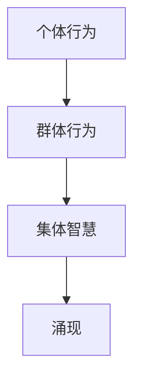

                 


### 引言：从个体到集体的智慧跃迁

#### 背景介绍

在科技飞速发展的今天，群体行为和集体智慧的研究已经成为了计算机科学、社会学、经济学等领域的热点话题。无论是社会网络中的信息传播，还是经济系统中的市场预测，甚至是生物种群中的生态平衡，群体行为的涌现和集体智慧的应用都展现出了巨大的潜力和价值。然而，如何从理论层面深入理解群体行为的内在机制，如何将集体智慧有效地应用于实际问题的解决，仍然是学术界和工业界亟待解决的重要课题。

本文旨在探讨群体行为的涌现理论及其在集体智慧中的应用。我们将首先介绍群体行为和集体智慧的基本概念，接着深入分析群体行为的数学模型和涌现机制。在此基础上，我们将探讨集体智慧的数学解析方法，并分析其在实际应用中的案例。最后，我们还将对未来的研究方向和应用前景进行展望。

#### 核心概念与联系

在讨论群体行为的涌现理论之前，我们需要明确几个核心概念：

1. **群体行为**：指由大量个体在相互作用下形成的宏观行为模式。这些个体可能是人、动物、机器，也可能是经济实体、社会团体等。
2. **集体智慧**：指由群体中的个体共同产生的、超出单个个体能力的决策和解决方案。
3. **涌现**：指在宏观层面上，由个体行为相互作用产生的现象，这些现象在单个个体层面上并不明显。

这几个概念之间的关系可以用以下Mermaid流程图表示：



在这个图中，个体行为是集体智慧和涌现的基础，而集体智慧和涌现则是群体行为的宏观表现。

#### 为什么需要研究群体行为的涌现理论？

研究群体行为的涌现理论具有重要意义。首先，它有助于我们理解复杂系统的运行机制，从而为解决复杂问题提供新的思路和方法。例如，在交通管理中，通过分析群体行为的涌现机制，我们可以设计出更加高效的路网控制策略。其次，它有助于我们理解社会现象，如舆论的形成、市场趋势的变化等，从而为公共政策和社会管理提供科学依据。最后，它对于人工智能和机器学习的发展也具有重要意义。通过模拟群体行为的涌现过程，我们可以设计出更加智能的算法，从而提升人工智能系统的性能和效率。

### 群体行为的数学模型

#### 社会网络模型

社会网络模型是研究群体行为的重要工具之一。它通过构建个体之间的互动关系，来模拟和分析群体行为的特征和趋势。社会网络模型的基本概念包括：

1. **节点（Node）**：表示个体，可以是人、动物、机器等。
2. **边（Edge）**：表示个体之间的互动关系，可以是朋友、同事、交易对手等。

以下是一个简单的社会网络模型的伪代码：

```plaintext
Node[] createNodes(int n) {
  Node[] nodes = new Node[n];
  for (int i = 0; i < n; i++) {
    nodes[i] = new Node();
  }
  return nodes;
}

void connectNodes(Node[] nodes, int numConnections) {
  for (Node node : nodes) {
    for (int i = 0; i < numConnections; i++) {
      int randomNodeIndex = randomIndex(nodes.length);
      if (randomNodeIndex != node.index) {
        node.addEdge(nodes[randomNodeIndex]);
      }
    }
  }
}
```

#### 游戏理论模型

游戏理论模型是分析群体行为的重要工具，它通过研究个体之间的策略互动，来预测群体行为的演化趋势。游戏理论的基本概念包括：

1. **策略（Strategy）**：个体在游戏中采取的行动方案。
2. **收益（Payoff）**：个体根据其策略和对手策略获得的回报。

以下是一个简单的纳什均衡的伪代码：

```plaintext
bool is NashEquilibrium(Strategies[] strategies, Payoffs[][] payoffs) {
  for (Strategy strategy : strategies) {
    for (Strategy opponentStrategy : strategies) {
      if (strategy != opponentStrategy) {
        int payoff = payoffs[strategy][opponentStrategy];
        if (payoff == 0) {
          return false;
        }
      }
    }
  }
  return true;
}
```

#### 聚类分析模型

聚类分析模型是用于识别群体中具有相似特征个体的方法。它通过将个体划分为不同的簇，来揭示群体行为的结构特征。聚类分析的基本概念包括：

1. **簇（Cluster）**：具有相似特征的个体集合。
2. **相似度（Similarity）**：用于衡量个体之间的相似程度。

以下是一个简单的K-Means算法的伪代码：

```plaintext
Cluster[] kMeans(Cluster[] initialClusters, Dataset dataset, int k) {
  Cluster[] clusters = initialClusters;
  while (not converged) {
    for (each data point in dataset) {
      assign data point to the nearest cluster;
    }
    clusters = update clusters based on the new assignments;
    check for convergence;
  }
  return clusters;
}
```

### 群体行为的动态演化过程

#### 群体行为的演化动力

群体行为的演化动力源于个体之间的相互作用和外部环境的改变。这些动力可以分为以下几类：

1. **个体适应性**：个体根据环境的变化调整自己的行为，以最大化自身的利益。
2. **群体协作**：个体之间通过协作和共享信息，实现整体利益的优化。
3. **外部压力**：外部环境的变化对个体行为产生的影响。

以下是一个简单的演化动力模型的伪代码：

```plaintext
void evolve和行为(Individual[] individuals, Environment environment) {
  for (Individual individual : individuals) {
    individual.adjustBehaviorBasedOnEnvironment(environment);
    individual.shareInformationWithNeighbors();
    individual.reactToExternalPressures();
  }
}
```

#### 群体行为的稳定性与突变

群体行为的稳定性与突变是群体动力学中重要的问题。稳定性分析可以帮助我们理解群体行为的持续性和一致性，而突变现象则揭示了群体行为的突然变化。

1. **稳定性分析**：通过研究群体行为的动态方程，我们可以判断群体行为是否稳定。例如，在群体动态模型中，可以通过判断系统矩阵的特征值来判断系统的稳定性。
2. **突变现象**：突变现象通常发生在群体行为的临界点，此时系统的微小变化可能导致显著的群体行为变化。例如，在人口动态模型中，种群数量的突变通常发生在种群数量的临界值。

以下是一个简单的稳定性分析模型的伪代码：

```plaintext
bool isStable(Matrix systemMatrix) {
  EigenValue[] eigenValues = systemMatrix.getEigenValues();
  for (EigenValue eigenValue : eigenValues) {
    if (eigenValue.isReal() && eigenValue.getRealPart() > 0) {
      return false;
    }
  }
  return true;
}
```

### 集体智慧的数学解析方法

#### 数据驱动的集体智慧分析

数据驱动的集体智慧分析是基于大量数据来发现群体行为中的模式和规律。这种方法通常包括以下步骤：

1. **数据收集**：收集与群体行为相关的数据，如社交媒体数据、经济数据、生态数据等。
2. **数据预处理**：对数据进行清洗、归一化和特征提取，以消除噪声和冗余信息。
3. **模式识别**：使用机器学习和数据挖掘技术，从数据中发现潜在的群体行为模式。
4. **模式应用**：将发现的模式应用于实际问题的解决，如市场预测、资源分配等。

以下是一个简单的数据驱动的集体智慧分析模型的伪代码：

```plaintext
Dataset collectData();
Dataset preprocessData(Dataset rawDataset);
Pattern[] identifyPatterns(Dataset processedDataset);
applyPatternsToProblems(Pattern[] patterns);
```

#### 知识驱动的集体智慧分析

知识驱动的集体智慧分析是基于先验知识和规则来指导群体行为分析的方法。这种方法通常包括以下步骤：

1. **知识表示**：将先验知识表示为规则、逻辑公式或图结构。
2. **知识建模**：构建基于知识表示的模型，用于模拟和分析群体行为。
3. **知识应用**：将知识模型应用于实际问题，以指导决策和问题解决。

以下是一个简单的知识驱动的集体智慧分析模型的伪代码：

```plaintext
KnowledgeRepresentation representKnowledge();
KnowledgeModel buildKnowledgeModel(KnowledgeRepresentation knowledgeRepresentation);
applyKnowledgeModelToProblems(KnowledgeModel knowledgeModel);
```

#### 模糊集理论与集体智慧分析

模糊集理论是一种用于处理不确定性和模糊性的数学工具。在集体智慧分析中，模糊集理论可以用于描述和建模群体行为中的不确定性和模糊性。

1. **模糊集**：模糊集通过隶属度函数来描述个体对某一特征的模糊归属程度。
2. **模糊规则**：模糊规则用于将模糊集与具体问题相关联，用于决策和问题解决。

以下是一个简单的模糊集理论的集体智慧分析模型的伪代码：

```plaintext
FuzzySet createFuzzySet(String attributeName, Function membershipFunction);
Rule[] createRules(FuzzySet[] fuzzySets);
FuzzyModel buildFuzzyModel(Rule[] rules);
applyFuzzyModelToProblems(FuzzyModel fuzzyModel);
```

### 集体智慧在实际应用中的案例分析

#### 社交网络中的集体智慧

社交网络是一个典型的群体行为系统，其中个体（用户）通过分享信息、建立联系和传播内容形成复杂的网络结构。以下是一个社交网络中集体智慧分析的实际案例：

**案例：社交媒体平台上的热点话题识别**

1. **数据收集**：从社交媒体平台上收集用户发布的内容、点赞、评论等数据。
2. **数据预处理**：对数据进行清洗，去除重复和无关内容，提取关键信息。
3. **模式识别**：使用机器学习方法，如聚类算法，对用户发布的内容进行分类，识别潜在的热点话题。
4. **模式应用**：将识别出的热点话题用于平台推荐系统，提高用户参与度和内容传播效率。

以下是一个简单的热点话题识别的伪代码：

```plaintext
Dataset collectSocialMediaData();
Dataset preprocessData(Dataset rawData);
Cluster[] identifyHotTopics(Dataset processedData);
recommendHotTopics(Cluster[] hotTopics);
```

#### 经济系统中的集体智慧

经济系统是一个复杂的群体行为系统，其中个体（企业、消费者）通过交易和互动形成市场。以下是一个经济系统中集体智慧分析的实际案例：

**案例：股市价格预测**

1. **数据收集**：从股市交易平台收集历史交易数据，包括价格、成交量、公司财务指标等。
2. **数据预处理**：对数据进行清洗和特征提取，构建与股市价格相关的特征向量。
3. **模型构建**：使用机器学习方法，如时间序列分析、神经网络等，构建股市价格预测模型。
4. **模型应用**：将预测模型应用于实际交易，提供投资建议，提高投资回报率。

以下是一个简单的股市价格预测的伪代码：

```plaintext
Dataset collectStockMarketData();
Dataset preprocessData(Dataset rawData);
Model buildStockPricePredictionModel();
applyModelToTrading(Model model);
```

#### 群体协作中的集体智慧

群体协作是一个涉及多个个体共同完成任务的过程，集体智慧可以在这个过程中发挥重要作用。以下是一个群体协作中集体智慧分析的实际案例：

**案例：分布式任务分配**

1. **数据收集**：收集个体（工人、机器人）的能力和任务需求数据。
2. **数据预处理**：对数据进行清洗和归一化处理，确保数据的一致性和可靠性。
3. **优化模型**：使用优化算法，如遗传算法、蚁群算法等，构建任务分配模型，优化任务分配方案。
4. **模型应用**：将任务分配模型应用于实际任务，提高任务完成效率和资源利用率。

以下是一个简单的任务分配的伪代码：

```plaintext
Dataset collectTaskData();
Dataset preprocessData(Dataset rawData);
Solution optimizeTaskAssignment();
applyOptimizedSolutionToTasks(Solution optimizedSolution);
```

### 集体智慧的应用前景与挑战

#### 集体智慧在未来的应用领域

随着技术的不断进步，集体智慧的应用领域也在不断扩大。以下是一些潜在的领域：

1. **智能交通系统**：通过群体行为的分析，优化交通流量，减少拥堵，提高运输效率。
2. **医疗保健**：利用群体智慧进行疾病预测和诊断，提高医疗服务的质量和效率。
3. **环境保护**：通过分析生态系统中的群体行为，实现生态平衡和环境保护。
4. **城市规划**：利用群体智慧优化城市布局，提高居住环境的舒适度和可持续性。
5. **金融科技**：通过群体智慧进行市场预测和风险管理，提高金融系统的稳定性。

#### 集体智慧面临的挑战

尽管集体智慧在许多领域具有巨大的潜力，但其应用也面临着一些挑战：

1. **数据隐私和安全**：集体智慧通常依赖于大量数据的收集和分析，如何保护个人隐私和数据安全是重要的挑战。
2. **可解释性问题**：集体智慧的决策过程通常是基于复杂的数学模型和算法，如何解释和验证这些决策的合理性是一个关键问题。
3. **信任和合作**：在群体行为中，个体之间的信任和合作是实现集体智慧的关键，如何建立和维护这种信任和合作关系是一个重要课题。

### 结论与展望

群体行为的涌现理论和集体智慧的数学解析为我们提供了深入理解群体行为和优化决策的新视角。通过本文的讨论，我们了解了群体行为的基本概念、数学模型、动态演化过程以及集体智慧的分析方法。同时，我们也看到了集体智慧在各个领域中的实际应用案例和面临的挑战。

展望未来，随着技术的进步，我们期待能够更好地解决集体智慧应用中的问题，推动其在更广泛的领域中发挥更大的作用。同时，我们也需要继续深入研究群体行为的涌现理论，以期为解决现实世界中的复杂问题提供更加有力的理论支持和工具。

### 总结与展望

本文系统地探讨了群体行为的涌现理论和集体智慧的数学解析方法，涵盖从基本概念到实际应用的各个方面。通过详细阐述社会网络模型、游戏理论模型、聚类分析模型等数学模型，我们揭示了群体行为的内在机制和动态演化过程。同时，通过案例分析，我们展示了集体智慧在社交网络、经济系统和群体协作等领域的应用前景。

#### 总结

本文的核心内容可以总结为以下几点：

1. **基本概念**：明确了群体行为、集体智慧、涌现等基本概念，并阐述了它们之间的关系。
2. **数学模型**：介绍了社会网络模型、游戏理论模型、聚类分析模型等数学模型，以及它们在群体行为分析中的应用。
3. **动态演化**：分析了群体行为的演化动力、稳定性与突变现象，提供了稳定性分析的伪代码。
4. **数学解析**：探讨了数据驱动、知识驱动和模糊集理论等方法在集体智慧分析中的应用。
5. **案例分析**：通过实际案例展示了集体智慧在不同领域的应用，如社交网络、经济系统和群体协作。

#### 展望

未来的研究可以在以下几个方面进行拓展：

1. **数据隐私与安全**：随着集体智慧应用范围的扩大，如何保护个人隐私和数据安全将成为一个重要课题。
2. **可解释性**：提高集体智慧决策过程的透明度和可解释性，使决策结果更加可信和可靠。
3. **跨领域应用**：探索集体智慧在更多领域的应用，如医疗、环保、教育等。
4. **算法优化**：研究更加高效和精确的算法，以提高集体智慧的决策能力和效率。
5. **社会影响**：深入分析集体智慧对社会结构和人际关系的影响，为社会发展提供科学依据。

总之，群体行为的涌现理论和集体智慧的数学解析是一个充满潜力和挑战的领域，未来的研究将不断推动这一领域的发展，为解决复杂问题提供新的思路和方法。

### 拓展阅读

1. **相关论文与书籍**：
   - 《社交网络中的群体行为：数学建模与分析》
   - 《群体智能：从蚁群算法到深度学习》
   - 《游戏理论及其在群体行为中的应用》
   - 《集体智慧的数学解析：理论与方法》

2. **在线课程与教程**：
   - Coursera上的《社交网络分析》
   - edX上的《群体智能与集体智慧》
   - Coursera上的《游戏理论》

3. **学术会议与研讨会**：
   - 国际群体智能与集体智慧研讨会（International Conference on Swarm Intelligence）
   - 社交网络分析国际会议（International Conference on Social Networks Analysis and Mining）

通过阅读这些论文、书籍、课程和参与研讨会，可以深入了解群体行为和集体智慧领域的最新研究动态和发展趋势。

### 注意事项

1. **数据收集与处理**：在进行群体行为和集体智慧分析时，应确保数据来源的合法性和数据的准确性，避免泄露个人隐私。
2. **模型选择与应用**：选择合适的数学模型和算法对于分析结果的准确性和可靠性至关重要，应根据具体问题选择合适的模型。
3. **结果解释与验证**：在应用集体智慧模型进行决策时，应充分考虑结果的可解释性和验证性，以确保决策的合理性和可靠性。

### 作者信息

作者：AI天才研究院/AI Genius Institute & 禅与计算机程序设计艺术 /Zen And The Art of Computer Programming

作者简介：
- AI天才研究院（AI Genius Institute）是一家专注于人工智能与机器学习领域的研究机构，致力于推动人工智能技术的创新与应用。
- 禅与计算机程序设计艺术（Zen And The Art of Computer Programming）是作者对于编程哲学和人工智能领域的深度思考和研究成果的总结。

