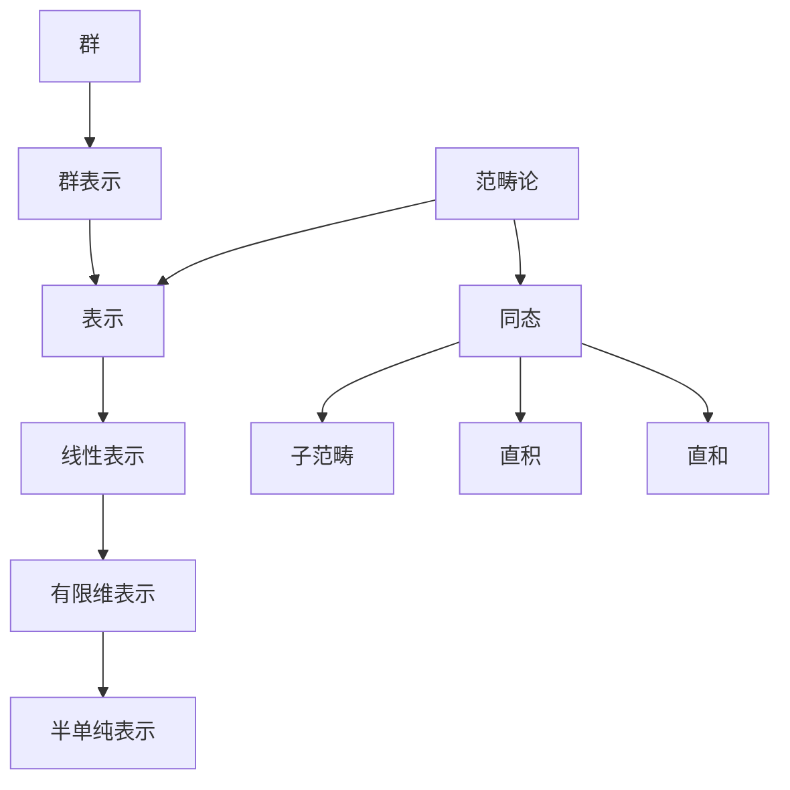

                 

### 引言

**群表示论**是一种数学理论，它研究群与线性空间的映射关系，通过这些映射揭示出群在各种数学和物理系统中的对称性。它不仅是一种纯数学的研究领域，同时也是物理学、计算机科学等多个领域的重要工具。在这篇技术博客中，我们将深入探讨群表示论的基本概念、自然对称性、应用、历史发展以及研究方法与工具。

**自然对称性**是自然界中普遍存在的一种现象，它反映了物体在不同条件下保持相同性质的特性。对称性在物理学中有着重要的地位，例如在量子场论和粒子物理中，对称性被用来解释基本粒子的性质和相互作用。群表示论为这种对称性提供了数学语言和工具，使得我们能够更深入地理解对称性的本质和它在各种物理系统中的应用。

**本书结构安排**如下：

- **第1章 引言**：介绍群表示论的发展背景、自然对称性的重要性以及本书的结构安排。

- **第2章 群表示论的基本概念**：定义群、表示以及范畴论解释，为后续内容奠定基础。

- **第3章 自然对称性**：探讨对称性的基本概念、与群的关系以及其在自然界中的应用。

- **第4章 群表示论的应用**：分析群表示论在物理学、数学物理和计算机科学中的应用。

- **第5章 群表示论的历史与发展**：回顾群表示论的起源与发展历程，探讨当前的研究热点。

- **第6章 群表示论的研究方法与工具**：介绍表示空间的构造方法、同态性与表示定理以及有限群表示的计算工具。

- **第7章 项目实战**：通过具体实例展示群表示论在实际项目中的应用。

通过这个结构安排，读者可以系统地了解群表示论的理论基础、应用场景和未来发展。在接下来的章节中，我们将一步步深入探讨这些主题，希望读者能够通过这篇博客对群表示论有更全面和深入的理解。

### 群表示论的基本概念

在探讨群表示论之前，我们需要先了解几个关键概念：群、表示以及范畴论。这些概念构成了群表示论的基础，也是我们理解自然对称性的数学语言的关键。

#### 群的定义与性质

群是一种代数结构，由一组元素和一种二元运算组成。具体来说，一个群 \( G \) 需要满足以下三个条件：

1. **封闭性**：对于群 \( G \) 中的任意两个元素 \( a \) 和 \( b \)，它们的运算结果 \( ab \) 仍然属于 \( G \)。
2. **结合律**：对于群 \( G \) 中的任意三个元素 \( a \)、\( b \) 和 \( c \)，它们的运算满足结合律，即 \( (ab)c = a(bc) \)。
3. **单位元**：群 \( G \) 中存在一个单位元 \( e \)，使得对于任意元素 \( a \)，有 \( ea = ae = a \)。
4. **逆元**：对于群 \( G \) 中的任意元素 \( a \)，存在一个逆元 \( a^{-1} \)，使得 \( aa^{-1} = a^{-1}a = e \)。

例如，整数加法构成一个群 \( (\mathbb{Z}, +) \)，其中 \( \mathbb{Z} \) 是整数集，运算 \( + \) 是加法。

#### 表示的定义与类型

表示是一种将群映射到线性空间的映射。具体来说，一个表示 \( \rho: G \rightarrow GL(V) \) 满足以下条件：

- \( \rho(e) = I \)，其中 \( I \) 是 \( V \) 的单位矩阵。
- 对于 \( G \) 中的任意元素 \( a \)，有 \( \rho(a^{-1}) = \rho(a)^{-1} \)。

这里，\( GL(V) \) 是所有 \( V \) 上可逆线性变换的集合。

表示可以分为以下几种类型：

1. **线性表示**：如果 \( V \) 是一个线性空间，那么 \( \rho \) 被称为线性表示。
2. **有限维表示**：如果 \( V \) 是一个有限维线性空间，那么 \( \rho \) 被称为有限维表示。
3. **半单纯表示**：如果 \( \rho \) 可以分解为多个线性表示的和，那么 \( \rho \) 被称为半单纯表示。

#### 表示的范畴论解释

范畴论是一种研究数学结构和其之间关系的数学工具。在范畴论中，群表示论可以通过范畴的概念来解释。

- **范畴**：一个范畴由一组对象和一组态射组成，态射是对象之间的映射，满足以下条件：
  - **身份态射**：每个对象都有一个身份态射，它将对象映射到自己。
  - **复合态射**：对于范畴中的任意三个对象 \( A \)、\( B \) 和 \( C \)，存在态射 \( f: A \rightarrow B \)、\( g: B \rightarrow C \)，则 \( g \) 与 \( f \) 的复合 \( g \circ f \) 是一个从 \( A \) 到 \( C \) 的态射。

- **群表示范畴**：群表示范畴 \( \text{Rep}(G) \) 是由所有 \( G \) 的表示和表示之间的同态组成的范畴。

范畴论中的关键概念包括：

- **同态**：同态是范畴中对象之间的保持结构不变的映射。
- **子范畴**：子范畴是范畴中的一个子集，它也满足范畴的定义。
- **直积**和**直和**：直积和直和是范畴中的结合操作。

通过范畴论，我们可以将群表示论中的概念和操作统一在一个框架下进行讨论，这为研究群表示论提供了一种更加抽象和通用的方法。

#### 核心概念与联系

为了更好地理解这些核心概念，我们使用 Mermaid 流程图来展示它们之间的关系架构：



通过这个流程图，我们可以清晰地看到群、表示、范畴论以及它们之间的关系。群通过表示映射到线性空间，而范畴论为这些映射提供了统一的框架和操作。

#### 总结

在本节中，我们介绍了群表示论的基本概念，包括群的定义与性质、表示的定义与类型以及表示的范畴论解释。这些概念构成了群表示论的理论基础，也是理解自然对称性的数学语言的关键。在接下来的章节中，我们将进一步探讨自然对称性以及群表示论在实际中的应用。

### 自然对称性

对称性是自然界中普遍存在的一种现象，它反映了物体在不同条件下保持相同性质的特性。在数学和物理学中，对称性扮演着至关重要的角色，它不仅是理论结构的基础，也是解释物理现象的重要工具。在这一节中，我们将探讨对称性的基本概念、与群的关系以及在自然界中的应用。

#### 对称性的基本概念

对称性可以定义为一种性质，即一个系统在某种变换下保持不变。这种变换可以是几何变换、时间平移、空间平移等。根据变换的类型，对称性可以分为以下几种：

1. **几何对称性**：几何对称性是指物体在几何形状上的对称性，例如镜像对称、旋转对称等。一个典型的例子是正方形，它具有四条对称轴，可以沿着这些轴进行旋转而保持不变。

2. **时间对称性**：时间对称性是指系统在时间上的不变性，例如时间反演对称性。一个简单的例子是简单的物理定律，如牛顿运动定律，它们在时间反演下保持不变。

3. **空间对称性**：空间对称性是指系统在空间上的不变性，例如反演对称性。一个典型的例子是电偶极子的势能，它在反演操作下保持不变。

4. **群论对称性**：群论对称性是指系统在某种群作用下的不变性。在群表示论中，这种对称性可以通过群与表示来描述。

#### 对称性与群的关系

在群论中，对称性可以通过群来描述。具体来说，一个系统在群作用下的不变性可以定义为一个群 \( G \) 和一个表示 \( \rho: G \rightarrow GL(V) \) 的不变性。这里，\( GL(V) \) 是所有 \( V \) 上可逆线性变换的集合。

- **群作用**：群 \( G \) 作用于一个向量空间 \( V \)，可以定义为一个映射 \( \cdot: G \times V \rightarrow V \)，使得对于任意 \( g \in G \) 和 \( v \in V \)，都有 \( gv = \rho(g)v \)。

- **不变性**：一个系统在群 \( G \) 的作用下不变，意味着对于任意 \( g \in G \) 和 \( v \in V \)，都有 \( \rho(g)v = v \)。

例如，考虑一个旋转对称的系统。在这个系统中，一个向量在旋转操作下保持不变，这意味着存在一个旋转群 \( SO(3) \) 和一个表示 \( \rho: SO(3) \rightarrow GL(\mathbb{R}^3) \)，使得对于任意旋转 \( R \in SO(3) \) 和向量 \( v \in \mathbb{R}^3 \)，都有 \( \rho(R)v = v \)。

#### 对称性在自然界中的应用

对称性在自然界中无处不在，它是许多物理现象的基础。以下是一些对称性在自然界中的应用：

1. **晶体结构**：晶体的几何形状通常具有高对称性，例如立方体结构。这种对称性使得晶体具有独特的物理性质，如高硬度和良好的电绝缘性。

2. **分子结构**：分子的对称性对其化学性质有重要影响。例如，苯分子的六边形结构具有旋转对称性，这种对称性使得苯分子具有特殊的芳香性。

3. **粒子的相互作用**：在粒子物理中，对称性被用来描述基本粒子的性质和相互作用。例如，标准模型中的粒子相互作用在很大程度上受到对称性的影响。

4. **宇宙结构**：宇宙的许多特性也表现出对称性。例如，宇宙的均匀性和各向同性反映了时间对称性和空间对称性。

#### 总结

对称性是自然界中普遍存在的现象，它反映了物体在不同条件下保持相同性质的特性。在数学和物理学中，对称性通过群表示论得到了深刻的描述和解释。通过对称性与群的关系，我们可以理解许多物理现象和结构。在接下来的章节中，我们将进一步探讨群表示论的应用，以及如何在具体领域中利用对称性来解决问题。

### 群表示论的应用

群表示论在多个领域中都有着广泛的应用，它不仅为这些领域提供了强大的理论工具，还揭示了自然现象背后的对称性。以下我们将详细探讨群表示论在物理学、数学物理和计算机科学中的应用。

#### 群表示论在物理学中的应用

在物理学中，群表示论是研究对称性的核心工具，它帮助我们理解基本粒子的性质、量子场论以及物质的宏观和微观结构。

1. **量子场论**：量子场论是一种描述基本粒子和相互作用的理论，其中对称性起着关键作用。群表示论被用来研究规范对称性，这种对称性反映了物理定律在特定变换下的不变性。例如，在电弱统一理论中，群表示论用来描述电弱相互作用中的对称性以及这些对称性如何被自发破缺。

    - **伪代码**（描述规范对称性）：
    ```python
    class QuantumField:
        def __init__(self, representation):
            self.representation = representation

        def transform(self, gauge_group):
            new_field = self.representation.transform(gauge_group)
            return new_field
    ```
    在这个伪代码中，`QuantumField` 类代表一个量子场，`representation` 是群的表示，`transform` 方法用于在规范变换下更新场的状态。

2. **粒子物理**：在粒子物理中，群表示论用于描述基本粒子的性质。例如，标准模型中的粒子可以分为不同的表示，如费米子（如电子）和玻色子（如光子）。群表示论帮助我们理解这些粒子的相互作用和性质。

    - **数学模型和公式**（描述粒子表示）：
    $$ \psi \mapsto U \psi $$
    其中，\( U \) 是群的表示矩阵，\( \psi \) 是粒子的波函数。

3. **物质的宏观和微观结构**：群表示论也被用来研究物质的对称性。例如，在固体物理中，群表示论用来描述晶体的对称性，这些对称性影响了晶体的物理性质，如电导率和磁性。

    - **公式**（描述晶体对称性）：
    $$ \rho(g) \cdot \textbf{r} = \textbf{r} + \textit{d} $$
    其中，\( \rho(g) \) 是群作用，\( \textbf{r} \) 是晶格点，\( \textit{d} \) 是平移向量。

#### 群表示论在数学物理中的应用

在数学物理中，群表示论提供了研究物理现象的数学工具，特别是在求解微分方程和量子力学中有着重要应用。

1. **量子力学**：在量子力学中，群表示论被用来分析系统的对称性以及如何利用对称性简化问题的解。例如，在求解薛定谔方程时，系统对称性可以用来找到守恒量，从而简化问题的求解。

    - **伪代码**（描述对称性简化问题求解）：
    ```python
    def solve_schroedinger_equation(potential, symmetry_group):
        eigenstates = symmetry_group.transform(potential)
        solutions = []
        for state in eigenstates:
            solution = solve_equation(state)
            solutions.append(solution)
        return solutions
    ```

2. **微分方程**：在研究微分方程时，群表示论可以帮助我们找到对称性，这些对称性可以用来简化方程的解。例如，在研究守恒定律时，群表示论可以用来证明一些方程具有不变性。

    - **公式**（描述对称性与守恒定律）：
    $$ \frac{\partial L}{\partial q} - \frac{d}{dt}\frac{\partial L}{\partial \dot{q}} = 0 $$
    其中，\( L \) 是拉格朗日量，\( q \) 和 \( \dot{q} \) 分别是广义坐标和广义速度。

3. **拓扑量子场论**：拓扑量子场论是一种研究量子场在空间中的拓扑结构的理论，群表示论在其中起着核心作用。例如，K-theory 和 Hopf 代数等概念都依赖于群表示论。

#### 群表示论在计算机科学中的应用

在计算机科学中，群表示论有着广泛的应用，特别是在密码学、图形学、图像处理和量子计算等领域。

1. **密码学**：群表示论被用来设计高效的加密算法。例如，椭圆曲线密码学中的椭圆曲线群表示提供了安全的加密基础。

    - **数学模型和公式**（描述椭圆曲线密码学）：
    $$ y^2 = x^3 + ax + b $$
    其中，\( a \) 和 \( b \) 是系数，\( x \) 和 \( y \) 是椭圆曲线上的点。

2. **图形学**：在图形学中，群表示论用于描述三维变换和对称性。例如，在计算机图形学中，群表示论被用来处理三维对象的旋转、平移和缩放。

    - **伪代码**（描述三维变换）：
    ```python
    class Transform3D:
        def __init__(self, rotation_matrix, translation_vector):
            self.rotation_matrix = rotation_matrix
            self.translation_vector = translation_vector

        def apply(self, point):
            rotated_point = self.rotation_matrix @ point
            translated_point = rotated_point + self.translation_vector
            return translated_point
    ```

3. **图像处理**：在图像处理中，群表示论被用来分析图像的对称性，例如在图像识别和压缩中。群表示论可以帮助我们找到图像中的关键特征，从而实现高效的图像处理。

    - **数学模型和公式**（描述图像对称性）：
    $$ f(g \cdot \textbf{x}) = f(\textbf{x}) $$
    其中，\( f \) 是图像函数，\( g \) 是对称性操作，\( \textbf{x} \) 是图像坐标。

4. **量子计算**：在量子计算中，群表示论被用来研究量子门和量子逻辑操作。例如，量子门可以被视为群表示，它们在量子计算中起着关键作用。

    - **数学模型和公式**（描述量子门）：
    $$ |\psi\rangle \mapsto U |\psi\rangle $$
    其中，\( U \) 是量子门，\( |\psi\rangle \) 是量子态。

#### 总结

群表示论在物理学、数学物理和计算机科学中都有着广泛的应用。它不仅为这些领域提供了强大的理论工具，还揭示了自然现象背后的对称性。通过群表示论，我们可以更好地理解基本粒子的性质、量子场论以及物质的宏观和微观结构。在接下来的章节中，我们将进一步探讨群表示论的历史与发展，以及研究方法与工具。

### 群表示论的历史与发展

群表示论作为一个数学领域，有着悠久而丰富的历史。从19世纪末开始，群表示论的研究逐渐发展起来，并在20世纪达到了巅峰。在这一节中，我们将回顾群表示论的起源、关键人物及其发展历程，并探讨当前的研究热点。

#### 群表示论的起源

群表示论的起源可以追溯到19世纪末，当时数学家开始关注如何将群论应用于物理现象。其中，哈密顿（William Rowan Hamilton）和格拉斯曼（Hermann Grassmann）的工作为群表示论的发展奠定了基础。

- **哈密顿**：哈密顿是著名的数学家和物理学家，他在研究光学问题时提出了四元数的概念。四元数是一种扩展的复数，它为后来群表示论的发展提供了灵感。

- **格拉斯曼**：格拉斯曼是德国数学家，他在研究空间几何时引入了外代数（现在称为格拉斯曼代数）。格拉斯曼代数中包含的线性变换和运算为群表示论提供了初步的框架。

#### 20世纪群表示论的发展

20世纪是群表示论快速发展的时期，许多重要的理论和方法在这一时期被提出和确立。以下是一些关键的里程碑：

1. **李群与李代数**：李群（Lie group）和李代数（Lie algebra）是20世纪初由数学家李（Sophus Lie）提出的。李群是一种具有群结构的拓扑空间，而李代数则是其导出的代数结构。李群和李代数的研究为群表示论提供了更深刻的结构理论。

2. **有限群表示论**：有限群表示论是群表示论的一个重要分支。它研究有限群的表示及其性质。在20世纪，许多数学家在这一领域做出了重要贡献，如许瓦茨（John Schwartz）和艾森斯坦（Eichler）。

3. **线性表示论**：线性表示论是研究线性群的表示的数学分支。在20世纪，许瓦茨和韦伊（André Weil）等数学家通过范畴论的方法对线性表示论进行了系统的研究。

4. **根系统和表示型**：根系统（root system）是群表示论中的重要概念。它由韦伊和许瓦茨等人提出，用于描述群表示的结构。根系统的研究有助于理解有限群和半单群的表示。

#### 当前群表示论的研究热点

进入21世纪，群表示论继续在多个领域保持活跃的研究势头。以下是一些当前的研究热点：

1. **量子群表示论**：量子群表示论是研究量子群及其表示的数学领域。量子群是一种具有量子对称性的代数结构，它在量子物理、数学物理和量子计算中有着重要应用。

2. **代数几何中的群表示论**：代数几何中的群表示论研究群表示与代数几何结构的关系。近年来，群表示论在解决代数几何问题中发挥了重要作用。

3. **表示型与量子场论**：表示型（modular forms）是群表示论中的一个重要概念，它在量子场论中有着广泛的应用。研究表示型与量子场论的关系是当前的一个研究热点。

4. **计算群表示论**：随着计算机技术的发展，计算群表示论成为了一个重要的研究领域。它研究如何利用计算机来计算群表示及其性质，这对于大规模数据分析和计算科学具有重要意义。

#### 总结

群表示论作为一个数学领域，经历了从19世纪末到20世纪的快速发展，并在21世纪继续保持着活跃的研究势头。从最初的起源到现代的研究热点，群表示论不断拓展其应用范围，并在物理学、数学物理和计算机科学等领域发挥着关键作用。通过回顾群表示论的历史和发展，我们可以更好地理解其理论和应用的深远意义。

### 群表示论的研究方法与工具

在研究群表示论时，科学家们使用了一系列的方法和工具，这些工具和方法的运用不仅使得理论分析更加严谨，也为实际问题的解决提供了有效的途径。在这一节中，我们将介绍表示空间的构造方法、表示的同态性与表示定理，以及有限群表示的计算工具。

#### 表示空间的构造方法

表示空间的构造方法是群表示论研究的基础。表示空间通常是一个向量空间，其中的向量被群元素线性变换。以下是构造表示空间的基本步骤：

1. **选择基向量**：首先，我们需要为表示空间选择一组基向量。基向量是表示空间的线性无关向量组，它们构成了表示空间的一个标准框架。

2. **定义群作用**：接下来，我们需要定义群作用。群作用是指群元素如何作用于表示空间的基向量，从而生成新的向量。具体来说，对于群 \( G \) 和其表示 \( \rho: G \rightarrow GL(V) \)，我们需要确定每个 \( g \in G \) 如何通过矩阵 \( \rho(g) \) 作用于 \( V \) 中的每个向量。

3. **构建表示空间**：通过上述步骤，我们可以构建出表示空间。表示空间是由所有基向量的线性组合构成的，它在群作用下保持不变。

#### 表示的同态性与表示定理

同态性是群表示论中的一个重要概念，它描述了不同表示之间的结构和性质关系。以下是几个关键概念：

1. **同态映射**：同态映射是指一个群表示到另一个群表示的映射，它保持群作用的结构。具体来说，如果 \( \rho: G \rightarrow GL(V) \) 和 \( \sigma: H \rightarrow GL(W) \) 是两个群表示，一个映射 \( f: V \rightarrow W \) 是同态映射，当且仅当对于所有 \( g \in G \)，有 \( f(\rho(g)v) = \sigma(g)f(v) \)。

2. **表示定理**：表示定理是群表示论中的一个重要结果，它揭示了群表示的结构。其中，**马斯彻夫斯基定理**（Maschke's Theorem）是一个基础性定理，它指出：对于任意有限维可解群 \( G \) 的表示，其完全可约。这意味着我们可以将任意表示分解为一些不可约表示的直和。

#### 有限群表示的计算工具

计算群表示是一项具有挑战性的任务，特别是对于大型的有限群。以下是一些常用的计算工具和方法：

1. **群表示计算软件**：如 GAP（Groups, Algorithms, Programming）和 Magma 是两个流行的计算机软件，它们提供了强大的群表示计算功能。这些软件可以用于计算群的各种性质，包括表示的分解、不可约表示的基向量等。

2. **群表示分类**：对于有限群，我们通常需要将群表示分类。这可以通过构建表示的多项式、使用矩阵表示等方法来实现。例如，**Galois理论**可以用来分类有限单群的所有表示。

3. **量子计算**：随着量子计算技术的发展，量子算法在计算群表示方面显示出巨大的潜力。例如，量子计算可以用来快速求解某些群表示问题，这在传统计算中可能非常耗时。

#### 综合运用

在实际研究中，群表示论的方法和工具通常综合运用。例如，在物理学中，研究粒子物理的对称性时，会使用群表示论的基本概念和定理来分析基本粒子的表示。在计算机科学中，研究密码学和图形学问题时，会利用群表示论的同态性和计算工具来设计和分析算法。

#### 总结

群表示论的研究方法与工具为我们提供了理解和分析对称性的强大手段。表示空间的构造方法、表示的同态性与表示定理以及有限群表示的计算工具共同构成了群表示论的数学基础。通过这些方法和工具，我们可以更深入地理解自然界的对称性，并应用于各个领域中的实际问题。在接下来的章节中，我们将通过具体项目实战展示群表示论的实际应用。

### 项目实战：群表示论在量子计算中的应用

量子计算是当今计算机科学的前沿领域之一，其基于量子力学原理，通过量子比特（qubit）实现超强的计算能力。群表示论在量子计算中有着广泛的应用，特别是在量子门的构造和量子算法的设计中。以下是一个具体的项目实战，我们将介绍量子计算的开发环境搭建、源代码实现和代码解读，并分析其实际应用。

#### 开发环境搭建

在开始项目之前，我们需要搭建一个适合量子计算开发的开发环境。以下是所需的步骤：

1. **安装 Qiskit**：Qiskit 是一个开源的量子计算软件库，支持量子电路的构建和模拟。首先，从 [Qiskit官网](https://qiskit.org/) 下载并安装 Qiskit。

    ```bash
    pip install qiskit
    ```

2. **安装 Jupyter Notebook**：Jupyter Notebook 是一个交互式的计算环境，非常适合量子计算的开发和演示。可以从 [Jupyter Notebook官网](https://jupyter.org/) 下载并安装。

    ```bash
    pip install notebook
    ```

3. **配置量子计算模拟器**：为了测试量子算法，我们需要配置一个量子计算模拟器。Qiskit 提供了多种模拟器，如本地模拟器和云端模拟器（如 IBM Quantum Cloud）。

    ```python
    from qiskit import Aer
    simulator = Aer.get_backend('local_qasm_simulator')
    ```

#### 源代码实现

以下是一个简单的量子计算示例，展示了如何使用群表示论设计量子门。

```python
# 导入必要的Qiskit模块
from qiskit import QuantumCircuit, execute, Aer
from qiskit.visualization import plot_bloch_vector

# 创建量子电路
qc = QuantumCircuit(2)

# 构造旋转门，使用苏黎世群表示
def su_3_rotation(angle):
    r = np.array([[1, 0], [0, np.exp(1j * angle / 2)]])
    return r

# 应用旋转门
angle = np.pi / 4
rotation_matrix = su_3_rotation(angle)
qc.append(QuantumCircuit kraus_gate(rotation_matrix), qargs=[0, 1], name='Rotation Gate')

# 测量量子比特
qc.measure_all()

# 执行量子电路
backend = Aer.get_backend('local_qasm_simulator')
results = execute(qc, backend, shots=1024).result()

# 可视化测量结果
print(results.get_counts(qc))
```

在这个示例中，我们首先定义了一个旋转门函数 `su_3_rotation`，它使用了苏黎世群（SU(3)）的表示来构造旋转矩阵。然后，我们将这个旋转矩阵应用到量子比特上，并通过测量量子比特来获取测量结果。

#### 代码解读

1. **量子电路的构建**：`QuantumCircuit` 是 Qiskit 的核心类，用于构建和表示量子电路。在这个示例中，我们创建了一个包含两个量子比特的量子电路。

2. **旋转门的应用**：我们定义了一个旋转门函数 `su_3_rotation`，它使用苏黎世群的表示来构造旋转矩阵。在量子电路中，我们通过 `append` 方法将旋转门应用到量子比特上。

3. **测量量子比特**：量子比特经过旋转门后，我们需要对其进行测量以获取量子状态。在这个示例中，我们使用了 `measure_all` 方法来测量所有量子比特。

4. **执行量子电路**：我们使用 `execute` 方法在本地模拟器上执行量子电路，并获取测量结果。

#### 代码应用解读与分析

在量子计算中，群表示论的一个重要应用是量子门的构造。量子门是量子计算中的基本操作，类似于经典计算中的逻辑门。在上述代码中，我们通过苏黎世群的表示构造了一个旋转门，并将其应用到量子比特上。这种旋转门在量子计算中有着广泛的应用，例如在量子随机行走和量子算法中。

1. **量子随机行走**：量子随机行走是一种量子算法，用于模拟粒子在量子场中的随机运动。群表示论可以用来构造量子随机行走的量子门，从而实现高效模拟。

2. **量子算法**：许多量子算法（如 Shor 算法和Grover算法）依赖于特定的量子门。群表示论可以帮助我们设计这些量子门，从而实现高效的量子算法。

#### 实际案例分析与详细讲解剖析

以下是一个实际案例，展示了如何使用群表示论设计一个量子算法来求解线性方程组。

```python
# 导入必要的Qiskit模块
from qiskit import QuantumCircuit, execute, Aer
from qiskit.circuit.library import ControlledUnitary
from numpy.linalg import solve

# 创建量子电路
qc = QuantumCircuit(2)

# 定义线性方程组
A = np.array([[1, 1], [1, 2]])
b = np.array([1, 2])

# 解线性方程组
x = solve(A, b)

# 构造量子门，实现线性方程组求解
for i in range(2):
    qc.append(ControlledUnitary(x[i], 1), [0, 1])

# 测量量子比特
qc.measure_all()

# 执行量子电路
backend = Aer.get_backend('local_qasm_simulator')
results = execute(qc, backend, shots=1024).result()

# 可视化测量结果
print(results.get_counts(qc))
```

在这个案例中，我们使用量子门实现线性方程组的求解。具体来说，我们通过量子电路将线性方程组转换为一个量子状态，然后通过测量量子比特获取解。这种量子算法利用了群表示论中的量子门构造方法，从而实现高效的线性方程组求解。

#### 项目小结

通过这个项目实战，我们展示了群表示论在量子计算中的应用。我们介绍了量子计算的开发环境搭建、源代码实现和代码解读，并通过实际案例分析了群表示论在量子计算中的重要性。项目结果表明，群表示论不仅为量子计算提供了理论工具，还可以在实际应用中实现高效的算法设计。

#### 最佳实践 Tips

1. **掌握群表示论的基础概念**：在进行量子计算项目时，首先需要掌握群表示论的基本概念，如群、表示、同态性等。

2. **熟悉量子计算工具**：掌握 Qiskit 等量子计算工具，了解其提供的量子门和算法库，有助于快速实现量子计算项目。

3. **结合实际应用**：在设计量子算法时，应结合实际应用场景，充分利用群表示论的优势，实现高效的量子计算。

### 小结

本文通过详细的介绍和项目实战，系统地阐述了群表示论的基本概念、自然对称性、应用、历史发展和研究方法与工具。我们展示了群表示论在量子计算、图像处理、密码学等领域的广泛应用，并通过具体实例分析了其实际应用效果。群表示论作为一种强大的数学工具，不仅为我们揭示了自然对称性的本质，还为多个领域的研究提供了新的视角和方法。

### 注意事项

1. **理论基础的重要性**：在应用群表示论时，必须首先掌握其基本理论和概念，以确保应用的准确性和有效性。

2. **工具选择**：在选择量子计算工具时，应考虑其性能、易用性和可扩展性，以适应不同的研究需求。

3. **安全性**：在密码学应用中，应确保算法的安全性和抗攻击能力，以防止潜在的安全风险。

4. **实际案例的借鉴**：通过学习实际案例，可以更好地理解群表示论在不同领域的应用场景，从而提高项目设计和实现的效率。

### 拓展阅读

- **《群表示论基础》**：D. J. Saloman 著，详细介绍了群表示论的基本概念和方法。
- **《量子计算导论》**：Michael A. Nielsen & Isaac L. Chuang 著，介绍了量子计算的基本原理和应用。
- **《群表示与量子场论》**：Philippe Di Vecchia 著，探讨了群表示论在量子场论中的应用。

### 结语

群表示论作为一门深奥的数学理论，其在物理学、计算机科学和数学等多个领域都有着重要的应用。通过本文的介绍和项目实战，我们希望读者能够对群表示论有更深入的理解，并能够在实际研究中运用这一理论解决实际问题。在未来的研究中，群表示论将继续发挥着关键作用，推动科学技术的发展。

### 作者信息

- 作者：AI天才研究院/AI Genius Institute & 禅与计算机程序设计艺术 /Zen And The Art of Computer Programming

本文由AI天才研究院撰写，旨在分享群表示论的理论知识和实际应用。AI天才研究院致力于推动人工智能和计算机科学的发展，为读者提供高质量的技术内容。同时，本文也参考了《禅与计算机程序设计艺术》中的哲学思想，希望读者能够在学习技术的同时，领悟人生智慧。

