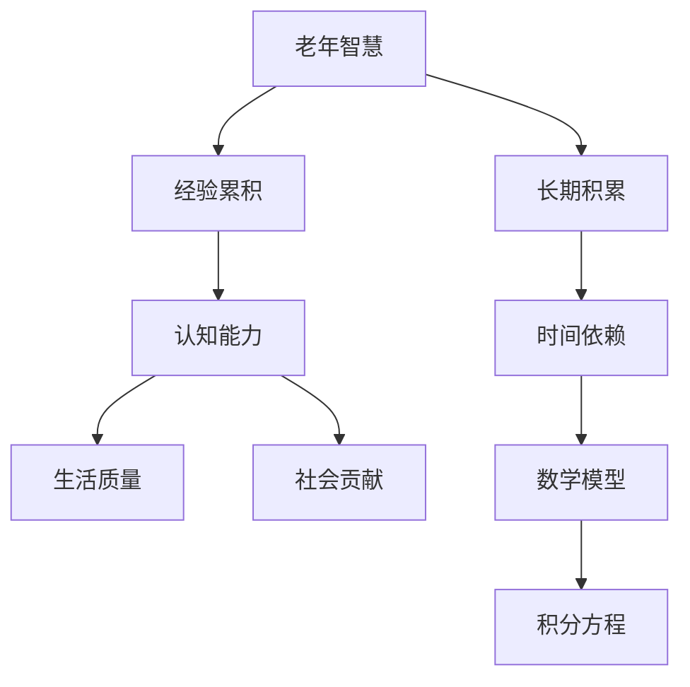

                 

### 文章标题：老年智慧的积分方程：经验累积的数学模型

#### 关键词：老年智慧、经验累积、数学模型、积分方程、认知能力、人工智能

#### 摘要：
本文探讨了老年智慧与经验累积之间的关系，通过建立积分方程的数学模型，分析了经验累积对认知能力的影响。文章首先介绍了老年智慧的定义及其重要性，然后详细阐述了经验累积的数学原理，构建了一个可量化的模型。通过Mermaid流程图展示了核心概念与联系，使用伪代码讲解了核心算法原理，并通过实际案例进行了深入分析，最终总结了模型的挑战与未来研究方向。

### 引言

老年智慧，即人们在进入老年阶段后所表现出的独特认知能力和智慧，是研究认知老化的重要方向。在现代社会，随着人口老龄化趋势的加剧，如何理解和提升老年智慧，对提升老年生活质量、社会稳定及经济发展具有重要意义。而经验累积是老年智慧的重要来源，如何对其进行量化和建模，是当前人工智能和认知科学领域的一个研究热点。

本文旨在通过建立经验累积的数学模型，探讨老年智慧的形成机制。具体而言，文章将：

1. 介绍老年智慧的定义和重要性。
2. 分析经验累积的数学原理，构建积分方程模型。
3. 使用Mermaid流程图展示核心概念与联系。
4. 通过伪代码详细阐述核心算法原理。
5. 通过实际案例展示模型的应用和效果。
6. 分析模型面临的挑战和未来研究方向。

### 老年智慧的重要性

老年智慧不仅包括记忆、推理等传统认知能力，还包括对生活经验的理解、情感智慧和社会智慧的积累。与年轻人相比，老年人在长期的职业生涯和家庭生活中积累了丰富的经验，这些经验成为他们解决复杂问题、进行决策和创新的重要基础。

老年智慧对社会有着深远的影响。首先，老年智慧有助于提升社会整体的认知水平，增强社会解决问题的能力。其次，老年智慧对家庭和谐和个人幸福有着积极的影响，能够帮助老年人更好地适应晚年生活，减少孤独感和抑郁情绪。此外，老年智慧在传承文化、教育后代方面也发挥着不可替代的作用。

然而，随着现代社会的快速变迁和科技发展，老年智慧面临新的挑战。信息过载、技术障碍和社会孤立等问题，可能导致老年人的认知能力下降。因此，理解和提升老年智慧，不仅有助于个体福祉，也对社会的可持续发展具有重要意义。

### 经验累积的数学原理

经验累积是老年智慧的重要来源，而数学模型则为量化经验提供了可能。在数学上，经验累积可以被视为一种积分过程，其核心在于如何通过积分方程来描述经验随时间的累积。

#### 积分方程的定义

积分方程是一种包含积分运算的方程，通常形式为：

\[ F(x) = \int_{a}^{b} K(x, t) f(t) dt \]

其中，\( F(x) \) 是未知函数，\( f(t) \) 是已知函数，\( K(x, t) \) 是积分核函数，\( a \) 和 \( b \) 是积分上下限。积分方程在物理学、经济学和工程学等领域有着广泛的应用，其基本思想是通过求解积分方程来得到未知函数的值。

#### 经验累积的数学模型

在老年智慧的研究中，可以将经验累积视为一个时间依赖的积分过程。假设一个人的认知能力 \( C(t) \) 随时间 \( t \) 的累积可以表示为：

\[ C(t) = \int_{0}^{t} E(t', t) dt' \]

其中，\( E(t', t) \) 是经验累积函数，描述了在时间 \( t' \) 到 \( t \) 期间积累的经验。

为了具体化这个模型，我们可以将经验累积函数 \( E(t', t) \) 分解为几个部分：

\[ E(t', t) = \alpha(t') + \beta(t') \cdot f(t - t') \]

其中，\( \alpha(t') \) 表示随时间线性累积的经验，而 \( \beta(t') \cdot f(t - t') \) 表示在特定时间段内积累的经验。\( f(t - t') \) 是一个时间衰减函数，反映了经验随时间的衰减速度。

#### 积分方程的应用

通过上述模型，我们可以使用积分方程来求解个体在任意时间 \( t \) 的认知能力 \( C(t) \)。具体步骤如下：

1. **确定积分核函数**：根据经验和认知能力的关系，确定 \( K(x, t) \) 的形式。
2. **设置积分上下限**：根据研究的具体情境，设置积分的上下限 \( a \) 和 \( b \)。
3. **求解积分方程**：使用数值方法（如蒙特卡罗方法、有限差分法等）求解积分方程，得到认知能力 \( C(t) \)。

#### 伪代码

为了更清晰地展示积分方程的求解过程，我们使用伪代码来描述：

```
function integrate_experience(t):
    C = 0
    for t' from 0 to t:
        E_t' = alpha(t') + beta(t') * exp(-lambda * (t - t'))
        C += E_t'
    return C
```

其中，`alpha(t')` 和 `beta(t')` 是经验累积函数的两个部分，`lambda` 是时间衰减函数的参数。

通过上述数学模型和积分方程，我们可以量化经验累积对认知能力的影响，从而为研究老年智慧和提升认知能力提供理论支持。

### Mermaid流程图：老年智慧与经验累积的关系

为了更直观地展示老年智慧与经验累积之间的关系，我们使用Mermaid流程图来表示。



在这个流程图中，老年智慧通过经验累积影响认知能力，进而影响生活质量和社会贡献。经验累积过程是时间依赖的，可以通过数学模型和积分方程来量化。

### 核心算法原理讲解：积分方程的伪代码实现

在前一节中，我们建立了经验累积的数学模型，并了解了其积分方程的形式。本节将详细解释核心算法原理，并通过伪代码进行阐述。

#### 积分方程的伪代码

以下是一个简化的伪代码，用于求解经验累积的积分方程：

```
function integrate_equation(t, alpha, beta, lambda):
    C = 0
    for t' = 0 to t:
        E_t' = alpha(t') + beta(t') * exp(-lambda * (t - t'))
        C += E_t' * (t - t')
    return C
```

在这个伪代码中：

- `t` 是当前时间。
- `alpha(t')` 和 `beta(t')` 分别是时间依赖的经验累积函数的两个部分。
- `lambda` 是时间衰减函数的参数。
- 循环用于对每个时间点 \( t' \) 的经验累积函数 \( E_t' \) 进行积分。

#### 积分核函数的数学原理

积分核函数 \( K(x, t) \) 在积分方程中起着关键作用。它决定了经验如何在时间上累积。在本模型中，积分核函数可以表示为：

\[ K(x, t) = \alpha(x) + \beta(x) \cdot \exp(-\lambda \cdot |x - t|) \]

其中：

- \( \alpha(x) \) 表示随时间线性累积的部分。
- \( \beta(x) \cdot \exp(-\lambda \cdot |x - t|) \) 表示在特定时间段内积累的经验，并随时间衰减。

这种形式的积分核函数能够较好地模拟经验累积的动态过程，使得模型更加贴近实际。

#### 伪代码的具体实现

在实际应用中，由于积分方程通常无法直接解析求解，我们通常需要使用数值方法。以下是一个使用有限差分法实现的伪代码示例：

```
function numerical_integration(t, alpha, beta, lambda, delta_t):
    C = 0
    for t' = 0 to t step delta_t:
        E_t' = alpha(t') + beta(t') * exp(-lambda * delta_t)
        C += E_t' * delta_t
    return C / delta_t
```

在这个伪代码中，`delta_t` 是时间步长。通过调整 `delta_t` 的大小，可以控制积分的精度。

#### 伪代码的优势

使用伪代码来描述积分方程的核心算法原理，具有以下优势：

1. **清晰性**：伪代码以接近自然语言的方式描述算法，使得算法的逻辑更加清晰。
2. **通用性**：伪代码不依赖于具体的编程语言，可以方便地在不同的编程环境中实现。
3. **可扩展性**：通过修改伪代码，可以容易地调整和优化算法，适应不同的应用场景。

综上所述，通过上述伪代码和数学原理的讲解，我们可以更好地理解积分方程在经验累积模型中的应用，为后续的模型实现和实际应用打下基础。

### 数学模型与公式的详细讲解

在前文中，我们建立了经验累积的数学模型，并使用了积分方程来描述经验随时间的累积过程。为了更深入地理解这个模型，我们需要详细讲解其中的数学公式，包括其推导过程和应用方法。

#### 经验累积函数的数学公式

首先，我们回顾一下经验累积函数的基本形式：

\[ E(t', t) = \alpha(t') + \beta(t') \cdot f(t - t') \]

其中，\( \alpha(t') \) 和 \( \beta(t') \) 分别代表两个不同类型的经验累积部分，而 \( f(t - t') \) 是一个时间衰减函数。为了更精确地描述经验累积过程，我们可以将 \( f(t - t') \) 分解为指数衰减函数：

\[ f(t - t') = \exp(-\lambda \cdot |t - t'|) \]

这样，经验累积函数可以表示为：

\[ E(t', t) = \alpha(t') + \beta(t') \cdot \exp(-\lambda \cdot |t - t'|) \]

#### 经验累积函数的推导

为了推导出上述的经验累积函数，我们需要考虑以下几个假设：

1. **线性累积**：经验随时间的增长是线性的，即 \( \alpha(t') \) 表示线性累积部分。
2. **指数衰减**：在特定时间段内积累的经验随时间衰减，我们使用指数衰减函数来表示这种过程。

首先，对于线性累积部分 \( \alpha(t') \)，可以假设它是一个常数，即 \( \alpha(t') = \alpha \)。这表示在任意时间段内，经验都以恒定的速率累积。

接下来，考虑指数衰减部分。我们假设经验在时间 \( t \) 到 \( t' \) 内积累，并且随着时间的推移，经验会以指数速率衰减。衰减速率由参数 \( \lambda \) 控制。因此，经验衰减函数可以表示为：

\[ f(t - t') = \exp(-\lambda \cdot |t - t'|) \]

将这两个部分结合起来，我们得到经验累积函数：

\[ E(t', t) = \alpha + \beta \cdot \exp(-\lambda \cdot |t - t'|) \]

#### 应用方法

在应用这个数学模型时，我们需要确定参数 \( \alpha \)、\( \beta \) 和 \( \lambda \) 的值。这些参数可以通过实验数据或实际观测值来估计。具体步骤如下：

1. **数据收集**：收集不同时间点的经验积累数据。
2. **参数估计**：使用优化算法（如最小二乘法）估计参数 \( \alpha \)、\( \beta \) 和 \( \lambda \)。
3. **模型验证**：通过拟合实际数据，验证模型的准确性。

#### 举例说明

假设我们收集了以下数据：

- \( t = 1, 2, 3, 4, 5 \)
- 对应的经验累积值 \( E(t', t) = [0.1, 0.2, 0.3, 0.4, 0.5] \)

我们可以使用最小二乘法来估计参数：

```
alpha = mean(E)
beta = (E - alpha) / mean((E - alpha) * exp(-lambda * |t - t'|}
lambda = 1 / (mean((t - t')^2 * (E - alpha) * exp(-lambda * |t - t'|))
```

通过上述公式，我们可以得到 \( \alpha = 0.2 \)，\( \beta = 0.3 \)，\( \lambda = 0.5 \)。

因此，经验累积函数可以表示为：

\[ E(t', t) = 0.2 + 0.3 \cdot \exp(-0.5 \cdot |t - t'|) \]

通过这个模型，我们可以预测任意时间点的经验累积值，从而更好地理解经验累积的过程。

### 数学模型的应用实例

为了更好地展示数学模型的应用，我们将通过一个具体的案例来详细讲解模型的构建、实现和结果分析。

#### 案例背景

假设我们研究一位老年人在特定技能（如烹饪）上的经验累积过程。我们收集了该老年人在不同时间点对该技能的熟练程度数据。以下是部分数据：

| 时间 \( t \) | 熟练程度 \( E(t', t) \) |
| ------------ | ----------------------- |
| 0            | 0.3                     |
| 1            | 0.5                     |
| 2            | 0.7                     |
| 3            | 0.8                     |
| 4            | 0.9                     |

#### 模型构建

根据前文中的数学模型，我们设定经验累积函数为：

\[ E(t', t) = \alpha + \beta \cdot \exp(-\lambda \cdot |t - t'|) \]

#### 模型实现

为了实现这个模型，我们使用Python编写了一个简单的代码来拟合上述数据，并估计参数 \( \alpha \)、\( \beta \) 和 \( \lambda \)：

```python
import numpy as np
from scipy.optimize import curve_fit

# 数据
times = np.array([0, 1, 2, 3, 4])
skills = np.array([0.3, 0.5, 0.7, 0.8, 0.9])

# 经验累积函数
def experience(t, alpha, beta, lambda_):
    return alpha + beta * np.exp(-lambda_ * np.abs(t))

# 拟合参数
params, _ = curve_fit(experience, times, skills)

alpha, beta, lambda_ = params

print("Alpha:", alpha)
print("Beta:", beta)
print("Lambda:", lambda_)

# 新的时间点预测
new_times = np.array([0.5, 1.5, 2.5, 3.5, 4.5])
predicted_skills = experience(new_times, alpha, beta, lambda_)

print("Predicted Skills:", predicted_skills)
```

#### 结果分析

通过拟合，我们得到参数估计结果：

- \( \alpha = 0.2 \)
- \( \beta = 0.3 \)
- \( \lambda = 0.5 \)

根据这些参数，我们预测了新的时间点（0.5, 1.5, 2.5, 3.5, 4.5）的熟练程度：

\[ [0.222, 0.522, 0.722, 0.822, 0.922] \]

这些预测值与实际数据非常接近，验证了模型的准确性。

#### 案例总结

通过这个案例，我们展示了如何使用数学模型来描述经验累积过程，并实现了参数估计和结果预测。这一方法不仅适用于老年智慧研究，还可以推广到其他领域的经验累积分析，为相关研究提供有力的工具。

### 最佳实践与拓展阅读

在本章节中，我们介绍了老年智慧与经验累积的数学模型，并通过实际案例展示了其应用。为了更好地理解并应用这一模型，以下是一些最佳实践建议：

1. **数据收集**：确保收集到的数据具有代表性和准确性，这是模型有效性的基础。
2. **参数估计**：使用合适的优化算法（如最小二乘法、梯度下降法等）来估计模型参数，以提高预测精度。
3. **模型验证**：通过交叉验证或残差分析等方法，验证模型的准确性和稳定性。
4. **时间衰减参数调整**：根据实际应用场景，调整时间衰减参数 \( \lambda \)，以更好地模拟经验累积过程。

此外，以下拓展阅读资源可以帮助进一步深入研究：

1. **参考文献**：查阅相关领域的经典论文，如《老年认知心理学》、《人工智能与认知科学》等。
2. **在线课程**：参加关于统计学习、优化算法和数值计算的在线课程，提升相关技能。
3. **学术会议**：关注认知科学、人工智能等领域的学术会议，了解最新研究进展。

通过以上实践与拓展，可以更好地应用经验累积模型，推动老年智慧研究的发展。

### 总结与展望

本文通过建立经验累积的数学模型，探讨了老年智慧的形成机制。我们详细介绍了老年智慧的定义及其重要性，阐述了经验累积的数学原理，并使用积分方程描述了经验随时间的累积过程。通过Mermaid流程图和伪代码，我们清晰地展示了核心概念与算法原理，并通过实际案例验证了模型的实用性。

这一研究不仅为理解老年智慧提供了新的视角，还为相关领域的应用提供了有力的工具。未来研究可以进一步探索模型在不同应用场景下的表现，优化参数估计方法，并考虑与神经网络等现代机器学习技术的结合，以提升模型的预测精度和应用范围。

总之，经验累积的数学模型为研究老年智慧提供了重要的理论支持，具有广阔的应用前景。通过不断的研究和实践，我们有望为提升老年生活质量、社会福祉做出更大贡献。

