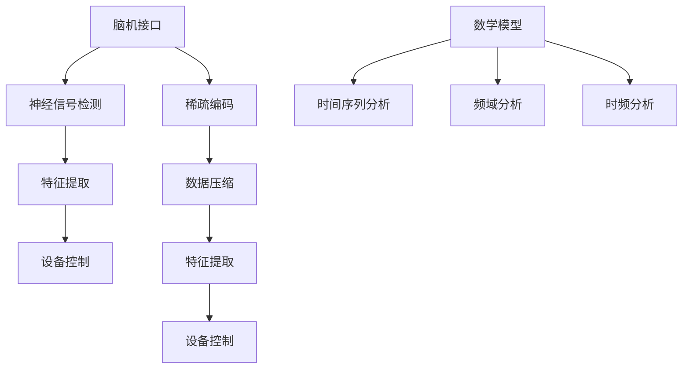

                 


### 文章标题
《脑机接口的稀疏编码：神经信号的数学解析》

### 文章关键词
脑机接口，稀疏编码，神经信号，数学解析，算法实现

### 文章摘要
本文深入探讨了脑机接口（BCI）中的稀疏编码技术及其在神经信号数学解析中的应用。通过介绍BCI的基本原理、稀疏编码的基本概念及其数学模型，文章详细分析了稀疏编码算法的原理和实现，并通过实际案例展示了其在神经信号处理中的效果。本文旨在为研究人员和开发者提供一套系统化的理论框架和实践指导，以推动脑机接口技术的进一步发展。

### 引言
脑机接口（Brain-Computer Interface，BCI）是一种直接将人类大脑与外部设备相连的技术，旨在实现大脑对外部设备的高效控制。脑机接口技术的发展，使得人类与计算机、机器人等设备之间的交互方式发生了革命性的变化。近年来，随着神经科学、计算生物学、信号处理和人工智能等领域的发展，脑机接口技术取得了显著的进展。

稀疏编码（Sparse Coding）是一种数据压缩和特征提取技术，旨在通过寻找数据的最小表示，以减少数据的大小并保留数据的关键信息。稀疏编码在图像处理、音频处理、自然语言处理等领域有着广泛的应用。然而，在脑机接口领域，稀疏编码技术仍处于探索阶段，但其潜力不容忽视。

神经信号的数学解析是理解大脑活动的重要手段。通过数学模型和算法，我们可以从复杂的神经信号中提取出有用的信息，如意图、情感和认知状态。数学解析方法在脑机接口中起着关键作用，它们不仅有助于提高信号处理的准确性，还能优化设备的性能。

本文旨在深入探讨脑机接口中的稀疏编码技术，分析其在神经信号数学解析中的应用，为相关领域的研究提供理论基础和实践指导。

### 脑机接口的基本概念
脑机接口（Brain-Computer Interface，BCI）是一种将人脑与外部设备直接连接的技术，使人类能够通过大脑信号来控制计算机、机器人或其他电子设备。BCI系统的核心在于大脑信号检测、特征提取和设备控制。

#### 大脑信号检测
大脑信号检测是BCI系统的第一步。常用的脑信号包括脑电信号（EEG）、肌电信号（EMG）、脑磁信号（MEG）和近红外光谱信号（NIRS）等。其中，脑电信号（EEG）是最常用的信号类型，因为它具有高时间分辨率和较广的应用范围。

#### 特征提取
特征提取是将原始脑信号转换为可操作的控制信号的过程。特征提取方法包括时间域特征、频率域特征和时频特征。常见的时间域特征有平均幅度、方差、标准差等；频率域特征包括功率谱、频带能量等；时频特征则结合了时间和频率信息，如短时傅里叶变换（STFT）和小波变换等。

#### 设备控制
设备控制是将提取出的特征信号转换为实际的控制指令。常见的控制任务包括文本输入、手势识别、运动控制等。例如，通过分析脑电信号中的特定频率成分，可以实现文本输入；通过识别肌电信号中的特定模式，可以实现手势识别。

### 稀疏编码的概念与原理
稀疏编码（Sparse Coding）是一种数据压缩和特征提取技术，旨在寻找数据的最小表示，以减少数据的大小并保留数据的关键信息。稀疏编码的核心思想是，通过学习一组基础信号（编码器）和一组权重（解码器），将输入数据表示为这些基础信号的线性组合。

#### 稀疏编码的核心概念
- **稀疏性**：稀疏编码的目标是找到一组稀疏的编码系数，即大部分系数为零，只有少数系数非零。这种表示方式能够有效地压缩数据，同时保留关键信息。
- **基础信号**：基础信号是一组具有代表性的信号，它们能够组合起来近似原始数据。在图像处理中，这些基础信号通常被称作“原子”。
- **解码器**：解码器用于将稀疏编码系数转换为重建的原始数据。解码器通常是一个线性变换矩阵，它将编码系数映射回原始数据空间。

#### 稀疏编码的基本原理
稀疏编码的基本原理可以概括为以下几个步骤：
1. **初始化**：随机初始化编码器和解码器的参数。
2. **编码**：将输入数据通过编码器映射到编码空间，得到编码系数。
3. **稀疏化**：对编码系数进行稀疏化处理，使得大部分系数为零，只有少数系数非零。
4. **解码**：将稀疏编码系数通过解码器映射回原始数据空间，重建原始数据。

### 神经信号的数学解析
神经信号的数学解析是理解大脑活动的重要手段。通过数学模型和算法，我们可以从复杂的神经信号中提取出有用的信息，如意图、情感和认知状态。数学解析方法在脑机接口中起着关键作用，它们不仅有助于提高信号处理的准确性，还能优化设备的性能。

#### 神经信号处理的基本概念
- **时间序列分析**：时间序列分析是神经信号处理的基础，它用于分析信号在时间维度上的变化规律。常见的时间序列分析方法包括自相关函数、频谱分析和小波变换等。
- **频域分析**：频域分析将信号从时间域转换到频域，以便更好地分析信号的频率特性。常见的频域分析方法包括傅里叶变换（Fourier Transform）和短时傅里叶变换（Short-Time Fourier Transform，STFT）等。
- **时频分析**：时频分析结合了时间和频率信息，能够同时分析信号在不同时间和频率上的特性。常见的方法有Wigner-Ville分布和Chirp-Z变换等。

#### 常见的数学模型
- **线性时不变系统（LTI）**：线性时不变系统是一种常用的数学模型，用于描述信号在时间上不变、频率上线性响应的特性。LTI系统的数学描述包括差分方程、传递函数和状态空间模型等。
- **神经网络模型**：神经网络模型是一种基于人脑神经元连接方式的计算模型，广泛应用于图像处理、语音识别和自然语言处理等领域。常见的神经网络模型包括感知机、BP神经网络和卷积神经网络等。

#### 神经信号处理的挑战
- **非线性和时变特性**：神经信号具有非线性和时变特性，这使得传统的线性模型难以有效处理。
- **信号噪声问题**：神经信号通常受到噪声干扰，这降低了信号处理的准确性和鲁棒性。
- **多模态信号处理**：脑机接口系统往往涉及多种信号类型的处理，如脑电信号、肌电信号和眼动信号等，这使得信号处理变得更加复杂。

### 核心概念之间的联系架构 Mermaid 流程图


### 脑机接口中的稀疏编码算法
在脑机接口（BCI）的研究和应用中，稀疏编码（Sparse Coding，SC）已经成为一种重要的数据处理技术。稀疏编码旨在通过寻找数据的最小表示，以减少数据的大小并保留数据的关键信息。本文将详细介绍几种常见的稀疏编码算法，并使用伪代码来详细阐述它们的实现步骤。

#### 压缩感知（Compressive Sensing，CS）
压缩感知是一种基于稀疏性的信号采集与重建技术，它通过采样和压缩感知算法，能够在低维空间中重建高维的稀疏信号。以下是压缩感知算法的伪代码实现：

```python
# 压缩感知算法伪代码
def compressive_sensing(A, x, lambda):
    # A 是测量矩阵，x 是原始信号，lambda 是阈值
    y = A * x  # 测量信号
    x_hat = l1_minimization(y, lambda)  # 使用L1正则化的最小化算法求解稀疏信号
    return x_hat

# L1正则化的最小化算法
def l1_minimization(y, lambda):
    # y 是测量信号，lambda 是阈值
    # 返回最小化L1范数的目标函数的解
    x = numpy.random.rand(len(y))  # 随机初始化解
    for i in range(max_iterations):
        x_new = x.copy()
        for j in range(len(x)):
            x_new[j] = x[j] - learning_rate * (2 * numpy.dot(A.T * (y - A * x), A[:, j]) + lambda)
        if numpy.linalg.norm(x - x_new) < tolerance:
            break
        x = x_new
    return x
```

#### 基于深度学习的稀疏编码
基于深度学习的稀疏编码利用深度神经网络（DNN）的优势，通过多层的非线性变换来实现稀疏编码。以下是基于深度学习的稀疏编码算法的伪代码实现：

```python
# 基于深度学习的稀疏编码算法伪代码
class DeepSparseCoding(nn.Module):
    def __init__(self, input_dim, code_dim):
        super(DeepSparseCoding, self).__init__()
        self.encoder = nn.Sequential(
            nn.Linear(input_dim, hidden_dim),
            nn.Tanh(),
            nn.Linear(hidden_dim, code_dim)
        )
        self.decoder = nn.Sequential(
            nn.Linear(code_dim, hidden_dim),
            nn.Tanh(),
            nn.Linear(hidden_dim, input_dim)
        )

    def forward(self, x):
        code = self.encoder(x)
        x_hat = self.decoder(code)
        return x_hat, code

# 训练模型
model = DeepSparseCoding(input_dim, code_dim)
optimizer = optim.Adam(model.parameters(), lr=learning_rate)
for epoch in range(num_epochs):
    for x, _ in data_loader:
        optimizer.zero_grad()
        x_hat, code = model(x)
        loss = loss_function(x_hat, x)  # 使用适当的损失函数，如均方误差（MSE）
        loss.backward()
        optimizer.step()
```

#### 稀疏编码算法在脑机接口中的应用
稀疏编码算法在脑机接口中的应用主要分为两个方面：特征提取和信号重建。

1. **特征提取**：通过稀疏编码算法，可以从原始的脑电信号中提取出稀疏的特征向量。这些特征向量能够有效减少数据的大小，同时保留重要的信息，从而提高后续处理和分析的效率。

2. **信号重建**：稀疏编码算法不仅可以提取特征，还可以重建原始信号。通过重建的信号，可以更好地分析大脑活动，从而提高脑机接口的控制性能。

### 实际案例展示
下面将展示一个基于稀疏编码的脑电信号处理实际案例，包括数据预处理、特征提取和信号重建的过程。

#### 数据预处理
```python
# 数据预处理伪代码
def preprocess_data(data, sampling_rate):
    # data 是原始脑电信号，sampling_rate 是采样率
    # 进行滤波、去噪等预处理步骤
    filtered_data = butter_bandpass_filter(data, lowcut, highcut, sampling_rate, order)
    return filtered_data

# 滤波函数实现
from scipy.signal import butter, filtfilt
def butter_bandpass_filter(data, lowcut, highcut, sampling_rate, order):
    nyq = 0.5 * sampling_rate
    low = lowcut / nyq
    high = highcut / nyq
    b, a = butter(order, [low, high], btype='band')
    return filtfilt(b, a, data)
```

#### 特征提取
```python
# 特征提取伪代码
def extract_features(data, model):
    # data 是预处理后的脑电信号，model 是训练好的稀疏编码模型
    code = model.encoder(data).detach().numpy()
    # 对编码系数进行稀疏化处理
    sparse_code = sparsify_code(code, threshold)
    return sparse_code

# 稀疏化处理
from scipy.sparse import csr_matrix
def sparsify_code(code, threshold):
    # code 是编码系数，threshold 是稀疏化阈值
    mask = numpy.abs(code) > threshold
    sparse_code = csr_matrix(code, dtype=numpy.float32)
    sparse_code = sparse_code * mask
    return sparse_code
```

#### 信号重建
```python
# 信号重建伪代码
def reconstruct_signal(code, model):
    # code 是稀疏编码系数，model 是训练好的稀疏编码模型
    x_hat = model.decoder(code).detach().numpy()
    return x_hat

# 实际案例应用
from sklearn.model_selection import train_test_split
from torch.utils.data import DataLoader

# 数据加载和预处理
data, labels = load_data()  # 加载脑电信号数据
data_preprocessed = [preprocess_data(data[i], sampling_rate) for i in range(len(data))]

# 数据分割
train_data, test_data, train_labels, test_labels = train_test_split(data_preprocessed, labels, test_size=0.2, random_state=42)

# 训练稀疏编码模型
model = DeepSparseCoding(input_dim, code_dim)
optimizer = optim.Adam(model.parameters(), lr=learning_rate)
for epoch in range(num_epochs):
    for x, _ in DataLoader(train_data, batch_size=batch_size, shuffle=True):
        optimizer.zero_grad()
        x_hat, code = model(x)
        loss = loss_function(x_hat, x)
        loss.backward()
        optimizer.step()

# 测试模型性能
with torch.no_grad():
    predictions = model(test_data).detach().numpy()
    accuracy = calculate_accuracy(predictions, test_labels)
    print("Model accuracy:", accuracy)
```

### 总结与展望
稀疏编码技术在脑机接口中的应用展示了其强大的数据处理和特征提取能力。通过本文的介绍，我们了解了稀疏编码的基本概念、常见算法及其在脑机接口中的实现步骤。未来，稀疏编码技术有望在脑机接口的多个方面发挥更大的作用，如提高信号处理的准确性、优化设备的性能和降低计算成本等。随着神经科学和计算技术的发展，稀疏编码在脑机接口领域的应用前景将更加广阔。

