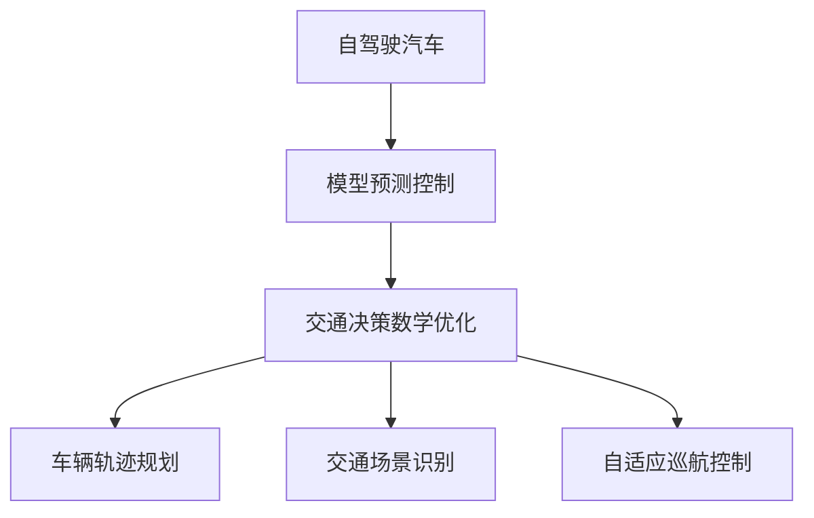

                 

## 文章标题

# 自动驾驶的模型预测控制：交通决策的数学优化

> 关键词：自动驾驶、模型预测控制、交通决策、数学优化

> 摘要：本文将探讨自动驾驶中的模型预测控制技术，以及其在交通决策中的数学优化方法。通过详细分析模型预测控制的基本概念、核心算法和系统设计，本文旨在为自动驾驶技术的发展提供理论基础和实际指导。

## 目录大纲

## 第1章 引言

### 1.1 自驾驶汽车与模型预测控制

### 1.2 模型预测控制在自驾驶中的应用

### 1.3 本书结构与内容安排

## 第2章 自驾驶技术概述

### 2.1 自驾驶汽车的发展历程

### 2.2 自驾驶汽车的技术体系

### 2.3 模型预测控制在自动驾驶中的应用场景

## 第3章 模型预测控制基础

### 3.1 模型预测控制的基本概念

### 3.2 模型预测控制的核心算法

### 3.3 模型预测控制的系统设计

## 第4章 交通决策数学优化基础

### 4.1 交通决策的基本概念

### 4.2 交通流的数学模型

### 4.3 交通决策的优化方法

## 第5章 自驾驶中的模型预测控制应用

### 5.1 自驾驶车辆轨迹规划

### 5.2 交通场景识别与决策

### 5.3 自适应巡航控制

## 第6章 模型预测控制算法在自驾驶中的优化

### 6.1 模型预测控制的优化方法

### 6.2 模型预测控制中的实时性能优化

### 6.3 模型预测控制的未来发展趋势

## 第7章 自驾驶模型预测控制的案例分析

### 7.1 案例背景

### 7.2 模型预测控制方案设计

### 7.3 案例分析与评价

## 第8章 总结与展望

### 8.1 本书内容的总结

### 8.2 自驾驶模型预测控制的发展趋势

### 8.3 未来工作展望

## 绘制核心概念和架构的 Mermaid 流程图



### 第1章 引言

#### 1.1 自驾驶汽车与模型预测控制

自动驾驶汽车，又称无人驾驶汽车，是指通过车载传感器、人工智能算法和控制系统，实现车辆自主行驶的智能交通工具。自动驾驶技术的发展历程可以追溯到20世纪50年代，随着计算机技术的进步和人工智能研究的深入，自动驾驶技术逐渐走向成熟。

模型预测控制（Model Predictive Control，MPC）是一种基于数学优化算法的控制策略，通过对系统未来行为进行预测，并在当前时刻优化控制策略，以实现系统性能的最优。MPC在自动驾驶中的应用，主要是通过优化车辆轨迹、识别交通场景和实现自适应巡航控制等，提高自动驾驶的稳定性和安全性。

#### 1.2 模型预测控制在自驾驶中的应用

模型预测控制技术在自动驾驶中的应用，主要包括以下几个方面：

1. **车辆轨迹规划**：通过MPC算法，预测车辆的未来行为，并确定最优行驶轨迹，以实现车辆的稳定行驶。

2. **交通场景识别**：利用传感器采集的实时数据，通过MPC算法分析交通场景，为自动驾驶车辆提供决策依据。

3. **自适应巡航控制**：通过MPC算法，实时调整车辆的行驶速度和加速度，实现自适应巡航控制，提高行驶舒适性。

#### 1.3 本书结构与内容安排

本书将按照以下结构进行展开：

1. **第1章 引言**：介绍自动驾驶汽车与模型预测控制的基本概念，以及模型预测控制在自驾驶中的应用。

2. **第2章 自驾驶技术概述**：详细分析自动驾驶技术的发展历程、技术体系和模型预测控制在自动驾驶中的应用场景。

3. **第3章 模型预测控制基础**：讲解模型预测控制的基本概念、核心算法和系统设计。

4. **第4章 交通决策数学优化基础**：介绍交通决策的基本概念、交通流的数学模型和优化方法。

5. **第5章 自驾驶中的模型预测控制应用**：分析车辆轨迹规划、交通场景识别和自适应巡航控制中的模型预测控制应用。

6. **第6章 模型预测控制算法在自驾驶中的优化**：探讨模型预测控制的优化方法、实时性能优化和未来发展趋势。

7. **第7章 自驾驶模型预测控制的案例分析**：通过实际案例，分析模型预测控制方案的设计和实现。

8. **第8章 总结与展望**：总结本书的主要内容，探讨自动驾驶模型预测控制的发展趋势和未来工作展望。

通过以上章节的详细讲解，本文旨在为自动驾驶领域的模型预测控制提供理论基础和实际指导。

### 第2章 自驾驶技术概述

#### 2.1 自驾驶汽车的发展历程

自动驾驶技术的发展可以追溯到20世纪50年代，当时美国和苏联在太空竞赛中竞相研发自动驾驶技术。早期的自动驾驶研究主要集中在军事领域，如导弹和坦克的自动驾驶。随着计算机技术的进步，自动驾驶技术逐渐向民用领域扩展。

20世纪80年代，人工智能领域的快速发展为自动驾驶技术注入了新的活力。1980年代中期，美国卡内基梅隆大学的研究团队开发出世界上第一辆无人驾驶汽车——Carnegie Mellon Navlab。这标志着自动驾驶技术进入了新纪元。

进入21世纪，随着传感器技术、人工智能算法和计算能力的迅速提升，自动驾驶技术取得了重大突破。谷歌、特斯拉、百度等科技巨头纷纷投入大量资源进行自动驾驶研发。2010年代，自动驾驶汽车开始在美国和部分国家进行道路测试，逐步走向商业化。

#### 2.2 自驾驶汽车的技术体系

自动驾驶汽车的技术体系主要包括以下几个方面：

1. **传感器技术**：传感器是自动驾驶汽车获取环境信息的关键设备。常见的传感器包括激光雷达（LiDAR）、摄像头、雷达、超声波传感器等。激光雷达主要用于精确测量车辆周围物体的距离和形状；摄像头用于捕捉道路标志、交通信号灯等视觉信息；雷达和超声波传感器主要用于检测车辆周围的障碍物和距离。

2. **人工智能算法**：人工智能算法是实现自动驾驶的核心技术。其中，计算机视觉、机器学习和深度学习算法在自动驾驶中得到了广泛应用。计算机视觉算法主要用于图像处理和目标检测；机器学习算法主要用于模式识别和决策；深度学习算法则通过模拟人脑神经网络，实现更高级的智能决策。

3. **控制系统**：自动驾驶汽车的控制系统包括车辆控制系统、决策系统和执行系统。车辆控制系统主要负责车辆的动力控制、制动控制和转向控制；决策系统基于传感器数据和人工智能算法，生成行驶决策；执行系统将决策转化为具体的控制指令，实现车辆的自动驾驶。

4. **通信技术**：自动驾驶汽车需要与其他车辆、道路基础设施进行实时通信，以获取交通信息、交换驾驶意图等。车联网（V2X）技术是实现自动驾驶通信的关键。V2X通信技术主要包括车辆与车辆（V2V）、车辆与基础设施（V2I）、车辆与行人（V2P）等通信方式。

#### 2.3 模型预测控制在自动驾驶中的应用场景

模型预测控制技术在自动驾驶中的应用场景主要包括以下几个方面：

1. **车辆轨迹规划**：模型预测控制通过优化算法，预测车辆的未来行为，并确定最优行驶轨迹，以实现车辆的稳定行驶。在车辆轨迹规划中，模型预测控制可以实时调整车辆的行驶速度和加速度，避免碰撞和偏离车道。

2. **交通场景识别**：模型预测控制通过分析传感器数据，识别交通场景，为自动驾驶车辆提供决策依据。例如，识别前方车辆、行人、交通信号灯等，为自动驾驶车辆制定合理的驾驶策略。

3. **自适应巡航控制**：模型预测控制通过实时调整车辆的行驶速度和加速度，实现自适应巡航控制。在自适应巡航控制中，模型预测控制可以应对复杂的交通状况，保持车辆与前方车辆的安全距离。

4. **智能泊车**：模型预测控制技术在智能泊车中的应用，可以实现车辆的自动泊车功能。通过传感器和摄像头感知停车位信息，模型预测控制生成最优泊车轨迹，实现自动泊车。

总之，模型预测控制技术在自动驾驶中的应用，有助于提高车辆的行驶稳定性、安全性和舒适性，推动自动驾驶技术的快速发展。

### 第3章 模型预测控制基础

#### 3.1 模型预测控制的基本概念

模型预测控制（Model Predictive Control，MPC）是一种先进的过程控制策略，它通过在线优化算法，在当前时刻预测系统未来的行为，并确定最优控制策略。MPC的核心思想是利用系统模型和优化算法，对系统未来的行为进行预测，并在此基础上进行控制策略的优化。

MPC的基本概念包括以下几个方面：

1. **系统模型**：系统模型是MPC的基础，它描述了系统的动态特性。常见的系统模型包括线性时不变模型（LTI）、非线性模型等。系统模型通常由状态方程和输出方程组成，描述系统状态和输入输出之间的关系。

2. **预测**：MPC通过系统模型预测系统未来的行为。预测模型用于预测系统未来一段时间内的状态和输出。预测模型的精度直接影响MPC的性能。

3. **优化**：MPC在预测模型的基础上，通过优化算法确定当前时刻的最优控制策略。优化目标通常是最小化某个性能指标，如系统输出误差、控制能量消耗等。优化算法可以是线性规划、二次规划、非线性规划等。

4. **反馈**：MPC通过反馈机制，将当前时刻的预测结果和实际系统状态进行比较，并更新控制策略。反馈机制是MPC实现闭环控制的关键。

#### 3.2 模型预测控制的核心算法

模型预测控制的核心算法主要包括线性规划（Linear Programming，LP）、二次规划（Quadratic Programming，QP）和非线性规划（Nonlinear Programming，NLP）等。

1. **线性规划（LP）**

线性规划是一种常见的优化算法，适用于目标函数和约束条件都是线性的情况。线性规划的目标是最小化目标函数，并满足一系列线性约束条件。

伪代码如下：

```plaintext
输入：目标函数 c^T * x，约束条件 A * x <= b

输出：最优解 x*

1. 求解线性方程组 A * x = b
2. 最小化目标函数 c^T * x
```

2. **二次规划（QP）**

二次规划是一种用于解决二次目标函数和线性约束条件的优化算法。与线性规划相比，二次规划能够处理更复杂的优化问题。

伪代码如下：

```plaintext
输入：目标函数 1/2 * x^T * Q * x + c^T * x，约束条件 A * x <= b

输出：最优解 x*

1. 对目标函数进行拉格朗日乘子法转换
2. 求解线性方程组 (Q + P^T * A^T * P) * x = -P^T * c - A^T * P * b
```

3. **非线性规划（NLP）**

非线性规划是一种用于解决非线性目标函数和约束条件的优化算法。非线性规划通常比线性规划和二次规划更复杂，但能够处理更广泛的优化问题。

伪代码如下：

```plaintext
输入：目标函数 f(x)，约束条件 g(x) <= 0

输出：最优解 x*

1. 选择合适的非线性优化算法（如梯度下降、牛顿法等）
2. 迭代求解，直至满足停止条件
```

#### 3.3 模型预测控制的系统设计

模型预测控制的系统设计主要包括以下几个方面：

1. **预测模型**：预测模型用于预测系统未来的行为。预测模型的精度直接影响MPC的性能。在设计预测模型时，需要考虑系统的动态特性、环境变化等因素。

2. **优化算法**：优化算法用于确定当前时刻的最优控制策略。选择合适的优化算法，可以提高MPC的计算效率和性能。

3. **控制器**：控制器根据预测模型和优化算法，生成最优控制策略。控制器的设计需要考虑控制系统的实时性、稳定性和鲁棒性。

4. **反馈机制**：反馈机制用于将当前时刻的预测结果和实际系统状态进行比较，并更新控制策略。反馈机制的精度和响应速度，对MPC的性能有重要影响。

5. **计算资源**：MPC的计算复杂度较高，对计算资源的要求较高。在实际应用中，需要合理分配计算资源，以确保MPC的实时性和稳定性。

通过以上系统设计，模型预测控制可以实现系统性能的最优化，为自动驾驶技术提供稳定、高效的解决方案。

### 第4章 交通决策数学优化基础

#### 4.1 交通决策的基本概念

交通决策是指基于实时交通信息，对车辆的速度、加速度、车道选择等行为进行决策，以实现交通流的最优化。交通决策的基本概念包括以下几个方面：

1. **交通状态**：交通状态是指车辆在某一时刻所处的行驶状态，包括速度、加速度、位置和方向等。交通状态是交通决策的重要依据。

2. **交通信息**：交通信息是指用于支持交通决策的各种数据，包括实时路况信息、交通流量、交通信号状态等。交通信息的获取对交通决策的准确性至关重要。

3. **决策目标**：决策目标是指交通决策需要实现的目标，如最小化行驶时间、减少交通拥堵、提高行驶舒适性等。决策目标的选择会影响交通决策的策略。

4. **决策策略**：决策策略是指实现决策目标的策略和方法。常见的决策策略包括速度控制、加速度控制、车道选择和交通信号控制等。

5. **约束条件**：约束条件是指交通决策过程中需要满足的限制条件，如速度限制、车道限制、交通信号限制等。约束条件会影响决策策略的选择和实施。

#### 4.2 交通流的数学模型

交通流的数学模型用于描述车辆在道路上的运动规律和交通流特性。常见的交通流数学模型包括以下几种：

1. **流量-速度模型**：流量-速度模型描述了车辆速度与流量之间的关系。常见的流量-速度模型有线性模型、指数模型和对数模型等。例如，线性模型可以表示为：

   $$ q = v * k $$

   其中，\( q \) 是流量，\( v \) 是速度，\( k \) 是模型参数。

2. **流量-密度模型**：流量-密度模型描述了车辆流量与道路密度之间的关系。常见的流量-密度模型有线性模型、指数模型和对数模型等。例如，线性模型可以表示为：

   $$ q = k * \frac{1}{1 + \rho * s} $$

   其中，\( q \) 是流量，\( \rho \) 是密度，\( s \) 是模型参数。

3. **速度-密度模型**：速度-密度模型描述了车辆速度与道路密度之间的关系。常见的速度-密度模型有线性模型、指数模型和对数模型等。例如，线性模型可以表示为：

   $$ v = \frac{1}{k * \rho + s} $$

   其中，\( v \) 是速度，\( \rho \) 是密度，\( k \) 和 \( s \) 是模型参数。

4. **流量-速度-密度模型**：流量-速度-密度模型综合描述了车辆流量、速度和密度之间的关系。常见的流量-速度-密度模型有线性模型、指数模型和对数模型等。例如，线性模型可以表示为：

   $$ q = v * \frac{1}{1 + \rho * s} $$

   其中，\( q \) 是流量，\( v \) 是速度，\( \rho \) 是密度，\( k \) 和 \( s \) 是模型参数。

#### 4.3 交通决策的优化方法

交通决策的优化方法是指基于数学优化理论，对交通状态、交通信息和决策目标进行优化，以实现交通流的最优化。常见的交通决策优化方法包括以下几种：

1. **线性规划**：线性规划是一种用于求解线性优化问题的方法。在交通决策中，线性规划可以用于求解速度控制、加速度控制和车道选择等优化问题。线性规划的基本形式如下：

   $$ minimize \sum_{i=1}^{n} c_i * x_i $$
   $$ subject \ to $$
   $$ A * x \leq b $$
   $$ x \geq 0 $$

   其中，\( x \) 是决策变量，\( c_i \) 是目标函数系数，\( A \) 和 \( b \) 是约束条件系数。

2. **二次规划**：二次规划是一种用于求解二次优化问题的方法。在交通决策中，二次规划可以用于求解更复杂的优化问题，如多目标优化和约束优化等。二次规划的基本形式如下：

   $$ minimize \frac{1}{2} x^T * Q * x + c^T * x $$
   $$ subject \ to $$
   $$ A * x \leq b $$
   $$ x \geq 0 $$

   其中，\( x \) 是决策变量，\( Q \) 是目标函数系数矩阵，\( c \) 是目标函数系数向量，\( A \) 和 \( b \) 是约束条件系数矩阵和向量。

3. **非线性规划**：非线性规划是一种用于求解非线性优化问题的方法。在交通决策中，非线性规划可以用于求解复杂的非线性优化问题。非线性规划的基本形式如下：

   $$ minimize f(x) $$
   $$ subject \ to $$
   $$ g(x) \leq 0 $$
   $$ h(x) = 0 $$

   其中，\( x \) 是决策变量，\( f(x) \) 是目标函数，\( g(x) \) 是不等式约束函数，\( h(x) \) 是等式约束函数。

通过以上数学优化方法，交通决策可以实现交通流的最优化，提高交通运行效率和安全性。

### 第5章 自驾驶中的模型预测控制应用

#### 5.1 自驾驶车辆轨迹规划

自动驾驶车辆轨迹规划是模型预测控制技术在自动驾驶中的一项重要应用。轨迹规划旨在确定车辆在未来一段时间内的行驶路径，以确保车辆安全、高效地行驶。轨迹规划的过程可以概括为以下步骤：

1. **环境感知**：车辆通过车载传感器（如激光雷达、摄像头、雷达等）收集道路、车辆、行人等信息，构建环境模型。环境模型包括道路形状、交通标志、车道线、其他车辆和行人等。

2. **状态预测**：根据环境模型和车辆当前状态（速度、加速度、位置等），利用车辆模型预测车辆在未来一段时间内的状态变化。车辆模型通常是一个线性或非线性动态系统模型。

3. **轨迹生成**：利用预测模型和环境模型，生成一系列可能的车辆轨迹。这些轨迹通常是通过优化算法（如线性规划、二次规划等）来确定的，优化目标是最小化轨迹成本或最大化轨迹安全性。

4. **轨迹评估**：对生成的轨迹进行评估，筛选出最优轨迹。评估标准通常包括轨迹的平滑性、安全性、舒适性等。

5. **轨迹跟踪**：车辆根据最优轨迹，实时调整控制策略，确保车辆沿着轨迹行驶。轨迹跟踪过程中，需要不断更新环境模型和车辆状态，以应对道路变化和障碍物。

#### 5.2 交通场景识别与决策

交通场景识别与决策是模型预测控制技术在自动驾驶中的另一项重要应用。交通场景识别旨在分析车辆周围的环境信息，识别不同的交通场景（如行驶在高速公路、城市道路、交叉路口等）。决策过程如下：

1. **场景识别**：通过车载传感器（如摄像头、激光雷达等）收集环境信息，利用计算机视觉和机器学习算法，识别车辆周围的交通场景。常见的交通场景包括车道线、交通标志、交通信号灯、其他车辆和行人等。

2. **场景理解**：对识别出的交通场景进行理解，提取关键信息，如车道位置、行驶方向、速度、距离等。场景理解有助于车辆确定当前所处的交通环境，为后续决策提供依据。

3. **决策生成**：基于场景理解和车辆模型，生成相应的决策。决策包括车辆的速度、加速度、转向等。决策生成的优化目标通常是最小化行驶成本、最大化行驶安全性等。

4. **决策执行**：车辆根据生成的决策，调整控制策略，执行相应的驾驶动作。决策执行过程中，需要实时监测车辆状态和环境变化，确保决策的有效性和实时性。

#### 5.3 自适应巡航控制

自适应巡航控制（Adaptive Cruise Control，ACC）是模型预测控制技术在自动驾驶中的另一项重要应用。ACC旨在通过实时调整车辆的速度和加速度，保持与前车的安全距离，提高行驶舒适性和安全性。自适应巡航控制的过程如下：

1. **速度调整**：车辆通过车载传感器（如雷达、摄像头等）检测前车的位置和速度，根据设定的安全距离，实时调整自身的速度。速度调整的优化目标是最小化与前车的距离，同时确保车辆在合理速度范围内行驶。

2. **加速度调整**：在需要加速或减速的情况下，车辆根据设定的加速度和当前状态（如速度、加速度、坡度等），实时调整加速度。加速度调整的优化目标是最小化加速度变化，提高行驶平稳性。

3. **控制策略更新**：自适应巡航控制过程中，车辆需要不断更新控制策略，以应对环境变化（如前车减速、紧急刹车等）。控制策略的更新依赖于车辆模型、环境模型和优化算法。

4. **实时监测与调整**：车辆在自适应巡航控制过程中，需要实时监测自身状态和环境变化，并根据监测结果调整控制策略。实时监测与调整有助于确保自适应巡航控制的稳定性和安全性。

通过以上应用，模型预测控制技术在自动驾驶中发挥了重要作用，提高了车辆的行驶稳定性和安全性，推动了自动驾驶技术的发展。

### 第6章 模型预测控制算法在自驾驶中的优化

#### 6.1 模型预测控制的优化方法

在自动驾驶中，模型预测控制（MPC）算法的性能直接影响车辆的稳定性和安全性。优化MPC算法的方法主要包括以下几个方面：

1. **优化算法的选择**：选择合适的优化算法是提高MPC性能的关键。常见的优化算法包括线性规划（LP）、二次规划（QP）和非线性规划（NLP）。线性规划适用于目标函数和约束条件都是线性的情况，而二次规划适用于目标函数是二次的、约束条件是线性的情况。非线性规划适用于更复杂的优化问题，但计算复杂度较高。

   - **线性规划**：

     ```plaintext
     minimize c^T * x
     subject to
     Ax <= b
     x >= 0
     ```

   - **二次规划**：

     ```plaintext
     minimize 1/2 * x^T * Q * x + c^T * x
     subject to
     Ax <= b
     x >= 0
     ```

   - **非线性规划**：

     ```plaintext
     minimize f(x)
     subject to
     g(x) <= 0
     h(x) = 0
     ```

2. **优化问题的简化**：通过简化优化问题，降低MPC的计算复杂度。例如，将高维问题分解为多个低维子问题，或者将非线性问题线性化。

3. **实时性优化**：MPC算法需要实时计算，以确保车辆控制策略的实时性和稳定性。优化实时性通常包括以下几个方面：

   - **算法优化**：选择计算效率高的优化算法，如迭代法、Krylov子空间方法等。
   - **计算资源调度**：合理分配计算资源，确保MPC算法在有限时间内完成计算。

4. **鲁棒性优化**：考虑实际驾驶环境中的不确定性（如道路条件、车辆状态等），优化MPC算法的鲁棒性。方法包括：

   - **自适应控制**：根据环境变化，动态调整控制参数。
   - **鲁棒优化**：考虑不确定性因素，优化MPC算法的目标函数和约束条件。

#### 6.2 模型预测控制中的实时性能优化

实时性能优化是模型预测控制（MPC）在自动驾驶中的一个重要课题。实时性能优化旨在确保MPC算法能够在预定的时间内完成计算，以满足自动驾驶系统的实时性要求。以下是一些实时性能优化的方法：

1. **算法加速**：通过改进MPC算法的计算效率，降低计算时间。常用的加速方法包括：

   - **子问题分解**：将高维MPC问题分解为多个低维子问题，分别求解，降低计算复杂度。
   - **迭代求解**：使用迭代求解方法，如内点法、外点法等，逐步逼近最优解。
   - **并行计算**：利用多核处理器、GPU等硬件资源，实现并行计算。

2. **计算资源优化**：合理配置计算资源，确保MPC算法的实时性。方法包括：

   - **任务调度**：根据MPC算法的计算需求，动态调整计算任务的优先级，确保关键任务得到及时处理。
   - **资源预留**：预留足够的计算资源，避免资源竞争和冲突。

3. **模型简化**：通过简化MPC模型，降低计算复杂度。方法包括：

   - **线性化**：将非线性模型线性化，降低计算复杂度。
   - **状态空间简化**：通过降维或忽略次要因素，简化状态空间模型。

4. **硬件加速**：利用硬件加速技术，提高MPC算法的计算速度。方法包括：

   - **FPGA**：使用FPGA实现MPC算法，提高计算速度和效率。
   - **ASIC**：设计专用集成电路（ASIC），实现MPC算法的高效计算。

通过以上实时性能优化方法，可以有效提高MPC算法在自动驾驶中的实时性，确保车辆的稳定行驶和安全。

#### 6.3 模型预测控制的未来发展趋势

模型预测控制（MPC）作为自动驾驶技术的重要一环，未来发展趋势主要包括以下几个方面：

1. **算法复杂度降低**：随着人工智能和机器学习技术的发展，MPC算法的计算复杂度有望降低。通过算法优化、模型简化等手段，提高MPC算法的计算效率，满足自动驾驶系统的实时性要求。

2. **鲁棒性增强**：在实际驾驶环境中，车辆面临各种不确定性和动态变化。未来MPC算法将更加注重鲁棒性优化，提高算法在面对不确定性和异常情况时的稳定性和可靠性。

3. **多模态融合**：未来MPC算法将融合多种传感器数据，如摄像头、激光雷达、雷达等，实现更精确的环境感知和更智能的决策。多模态数据融合有助于提高自动驾驶系统的安全性和稳定性。

4. **实时性能提升**：通过硬件加速、计算资源优化等手段，进一步提升MPC算法的实时性能，确保在复杂交通环境下的稳定行驶。

5. **自主决策能力提升**：未来MPC算法将具备更强的自主决策能力，能够应对更复杂的交通场景和动态变化。通过深度学习和强化学习等先进算法，MPC算法将实现更高级的驾驶决策。

6. **协同控制**：在自动驾驶车队和智能交通系统中，MPC算法将实现协同控制，优化整体交通流。通过多车协同控制，提高道路利用率和行驶安全性。

总之，未来MPC算法的发展将推动自动驾驶技术的进步，为实现安全、高效、智能的自动驾驶提供有力支持。

### 第7章 自驾驶模型预测控制的案例分析

#### 7.1 案例背景

本案例选取一家知名自动驾驶公司开发的自动驾驶出租车项目作为研究对象。该项目旨在实现自动驾驶出租车在城市道路上的商业化运营，提供便捷的出行服务。自动驾驶出租车项目采用了先进的模型预测控制（MPC）技术，通过实时优化车辆轨迹、交通场景识别和自适应巡航控制，提高行驶稳定性、安全性和舒适性。

#### 7.2 模型预测控制方案设计

在自动驾驶出租车项目中，模型预测控制方案的设计主要包括以下几个方面：

1. **车辆轨迹规划**：车辆轨迹规划是自动驾驶系统的核心环节。项目采用了基于MPC的轨迹规划算法，通过实时预测车辆的未来行为，并确定最优行驶轨迹。轨迹规划算法包括以下步骤：

   - **环境感知**：通过车载激光雷达、摄像头等传感器，实时采集道路、车辆、行人等信息，构建环境模型。
   - **状态预测**：根据环境模型和车辆当前状态，利用车辆动力学模型，预测车辆在未来一段时间内的状态变化。
   - **轨迹生成**：利用MPC算法，生成一系列可能的行驶轨迹，优化目标是最小化轨迹成本（如行驶时间、能耗等）。
   - **轨迹评估**：对生成的轨迹进行评估，筛选出最优轨迹，作为车辆的控制指令。

2. **交通场景识别与决策**：交通场景识别与决策是自动驾驶系统应对复杂交通环境的重要手段。项目采用了基于MPC的交通场景识别与决策算法，包括以下步骤：

   - **场景识别**：通过计算机视觉算法，识别道路标志、交通信号灯、车道线等交通场景元素。
   - **场景理解**：对识别出的交通场景进行理解，提取关键信息，如车道位置、行驶方向、速度、距离等。
   - **决策生成**：基于场景理解和车辆模型，生成相应的驾驶决策，如速度控制、转向控制、车道保持等。

3. **自适应巡航控制**：自适应巡航控制是自动驾驶系统提高行驶舒适性和安全性的关键功能。项目采用了基于MPC的自适应巡航控制算法，包括以下步骤：

   - **速度调整**：通过车载雷达、摄像头等传感器，实时监测前车距离，调整自身速度，保持安全距离。
   - **加速度调整**：根据当前速度、前车速度和设定的加速度目标，实时调整车辆加速度，确保平稳行驶。
   - **控制策略更新**：根据车辆状态和环境变化，动态更新控制策略，确保自适应巡航控制的稳定性和安全性。

#### 7.3 案例分析与评价

在自动驾驶出租车项目的实际运营过程中，模型预测控制方案表现出良好的性能，具体分析如下：

1. **轨迹规划性能**：通过MPC算法的轨迹规划，车辆能够实时调整行驶路径，避开障碍物和危险区域，确保行驶稳定性。同时，轨迹规划优化了行驶时间，提高了行驶效率。

2. **交通场景识别与决策**：基于MPC的交通场景识别与决策算法，能够准确识别道路标志、交通信号灯等交通场景元素，并生成合理的驾驶决策。在实际行驶过程中，车辆能够遵循交通规则，避免交通违法行为。

3. **自适应巡航控制性能**：基于MPC的自适应巡航控制算法，能够根据前车距离和速度，实时调整车辆速度和加速度，保持安全距离和平稳行驶。在实际行驶过程中，车辆的行驶平稳性得到显著提升。

4. **系统稳定性与安全性**：通过MPC算法的实时优化和反馈机制，车辆能够在复杂交通环境中保持稳定行驶，确保行驶安全性。同时，MPC算法的鲁棒性优化，提高了系统在面对不确定性和动态变化时的稳定性。

综上所述，自动驾驶模型预测控制方案在轨迹规划、交通场景识别与决策、自适应巡航控制等方面表现出良好的性能，为自动驾驶技术的发展提供了有力支持。

### 第8章 总结与展望

#### 8.1 本书内容的总结

本文围绕自动驾驶中的模型预测控制技术，详细介绍了其基本概念、核心算法、系统设计以及在自动驾驶中的具体应用。通过分析自动驾驶技术的发展历程、技术体系和模型预测控制在自动驾驶中的应用场景，本文为自动驾驶技术的发展提供了理论基础和实际指导。

在模型预测控制基础部分，本文讲解了基本概念、核心算法和系统设计，为后续应用提供了理论支持。在交通决策数学优化基础部分，本文介绍了交通决策的基本概念、交通流的数学模型和优化方法，为交通决策提供了理论依据。

在自动驾驶中的模型预测控制应用部分，本文分析了车辆轨迹规划、交通场景识别与决策、自适应巡航控制等实际应用案例，展示了模型预测控制技术在自动驾驶中的重要作用。最后，本文探讨了模型预测控制算法的优化方法、实时性能优化和未来发展趋势，为自动驾驶技术的发展提供了方向。

#### 8.2 自驾驶模型预测控制的发展趋势

自动驾驶模型预测控制技术的发展趋势主要包括以下几个方面：

1. **算法复杂度降低**：随着人工智能和机器学习技术的发展，MPC算法的计算复杂度有望降低。通过算法优化、模型简化等手段，提高MPC算法的计算效率，满足自动驾驶系统的实时性要求。

2. **鲁棒性增强**：在实际驾驶环境中，车辆面临各种不确定性和动态变化。未来MPC算法将更加注重鲁棒性优化，提高算法在面对不确定性和异常情况时的稳定性和可靠性。

3. **多模态融合**：未来MPC算法将融合多种传感器数据，如摄像头、激光雷达、雷达等，实现更精确的环境感知和更智能的决策。多模态数据融合有助于提高自动驾驶系统的安全性和稳定性。

4. **实时性能提升**：通过硬件加速、计算资源优化等手段，进一步提升MPC算法的实时性能，确保在复杂交通环境下的稳定行驶。

5. **自主决策能力提升**：未来MPC算法将具备更强的自主决策能力，能够应对更复杂的交通场景和动态变化。通过深度学习和强化学习等先进算法，MPC算法将实现更高级的驾驶决策。

6. **协同控制**：在自动驾驶车队和智能交通系统中，MPC算法将实现协同控制，优化整体交通流。通过多车协同控制，提高道路利用率和行驶安全性。

总之，未来自动驾驶模型预测控制技术将在算法优化、实时性能提升、多模态融合、自主决策能力等方面取得重要突破，为自动驾驶技术的发展提供有力支持。

#### 8.3 未来工作展望

在未来工作中，以下几个方面值得深入研究和探索：

1. **算法优化**：针对自动驾驶模型预测控制算法，进一步优化算法结构，提高计算效率。特别是对于复杂的非线性优化问题，研究更高效的求解方法和算法优化策略。

2. **多模态融合**：研究多传感器数据融合方法，实现更高精度和鲁棒性的环境感知。结合深度学习、强化学习等技术，提高自动驾驶系统的自主决策能力和稳定性。

3. **实时性能优化**：探索硬件加速、计算资源优化等实时性能优化方法，确保MPC算法在复杂交通环境下的实时性和稳定性。

4. **协同控制**：研究自动驾驶车队和智能交通系统中的协同控制策略，优化整体交通流。通过多车协同控制，提高道路利用率和行驶安全性。

5. **数据驱动方法**：利用大规模自动驾驶数据集，研究数据驱动方法，如深度学习、强化学习等，提高MPC算法的自主决策能力和实时性能。

6. **安全性验证**：针对自动驾驶模型预测控制系统的安全性，研究相应的验证方法和工具，确保系统在实际运行中的安全性和可靠性。

通过以上未来工作的研究和探索，有望进一步提升自动驾驶模型预测控制技术的性能和实用性，推动自动驾驶技术的快速发展。

### 核心概念和架构的 Mermaid 流程图

```mermaid
graph TB
    A[自动驾驶汽车] --> B[模型预测控制(MPC)]
    B --> C[交通决策数学优化]
    C --> D[车辆轨迹规划]
    C --> E[交通场景识别]
    C --> F[自适应巡航控制]
    G[传感器技术] --> B
    H[人工智能算法] --> B
    I[控制系统] --> B
    J[通信技术] --> B
```

### 核心算法原理讲解

#### 3.1 模型预测控制的基本概念

模型预测控制（Model Predictive Control，MPC）是一种先进的过程控制策略，它通过在线优化算法，在当前时刻预测系统未来的行为，并确定最优控制策略。MPC的核心思想是利用系统模型和优化算法，对系统未来的行为进行预测，并在此基础上进行控制策略的优化。

MPC的基本概念包括以下几个方面：

1. **系统模型**：系统模型是MPC的基础，它描述了系统的动态特性。常见的系统模型包括线性时不变模型（LTI）、非线性模型等。系统模型通常由状态方程和输出方程组成，描述系统状态和输入输出之间的关系。

2. **预测**：MPC通过系统模型预测系统未来的行为。预测模型用于预测系统未来一段时间内的状态和输出。预测模型的精度直接影响MPC的性能。

3. **优化**：MPC在预测模型的基础上，通过优化算法确定当前时刻的最优控制策略。优化目标通常是最小化某个性能指标，如系统输出误差、控制能量消耗等。优化算法可以是线性规划、二次规划、非线性规划等。

4. **反馈**：MPC通过反馈机制，将当前时刻的预测结果和实际系统状态进行比较，并更新控制策略。反馈机制是MPC实现闭环控制的关键。

#### 伪代码：

```plaintext
输入：当前状态x, 预测模型G, 控制目标Q, 控制约束A, B, C, D

输出：最优控制策略u

1. 对系统未来进行预测：
   for t = 1 to T_f:
       x_next = G * x + B * u

2. 在预测轨迹上寻找最优控制：
   [使用优化算法（如线性规划、二次规划）]
   minimize J = Q * x + R * u
   subject to A * x + B * u <= C

3. 更新当前状态：
   x = x_next

4. 输出最优控制策略：
   u = optimal_solution
```

#### 4.1 交通决策的基本概念

交通决策是指基于实时交通信息，对车辆的速度、加速度、车道选择等行为进行决策，以实现交通流的最优化。交通决策的基本概念包括以下几个方面：

1. **交通状态**：交通状态是指车辆在某一时刻所处的行驶状态，包括速度、加速度、位置和方向等。交通状态是交通决策的重要依据。

2. **交通信息**：交通信息是指用于支持交通决策的各种数据，包括实时路况信息、交通流量、交通信号状态等。交通信息的获取对交通决策的准确性至关重要。

3. **决策目标**：决策目标是指交通决策需要实现的目标，如最小化行驶时间、减少交通拥堵、提高行驶舒适性等。决策目标的选择会影响交通决策的策略。

4. **决策策略**：决策策略是指实现决策目标的策略和方法。常见的决策策略包括速度控制、加速度控制、车道选择和交通信号控制等。

5. **约束条件**：约束条件是指交通决策过程中需要满足的限制条件，如速度限制、车道限制、交通信号限制等。约束条件会影响决策策略的选择和实施。

#### 伪代码：

```plaintext
输入：当前交通状态，预测模型，目标函数，约束条件

输出：车辆速度v，加速度a，车道l

1. 采集实时交通数据
2. 预测未来交通状态
3. 构建目标函数
   J = f(v, a, l)
4. 确定约束条件
   g(v, a, l) <= 0
5. 在约束条件下优化目标函数
6. 输出最优速度v，加速度a，车道l
```

#### 6.1 模型预测控制的优化方法

优化方法的选择取决于控制问题本身的特性。常见的优化方法包括线性规划、二次规划、非线性规划等。

1. **线性规划（LP）**

线性规划是一种常见的优化算法，适用于目标函数和约束条件都是线性的情况。线性规划的目标是最小化目标函数，并满足一系列线性约束条件。

伪代码如下：

```plaintext
输入：目标函数 c^T * x，约束条件 A * x <= b

输出：最优解 x*

1. 求解线性方程组 A * x = b
2. 最小化目标函数 c^T * x
```

2. **二次规划（QP）**

二次规划是一种用于解决二次目标函数和线性约束条件的优化算法。与线性规划相比，二次规划能够处理更复杂的优化问题。

伪代码如下：

```plaintext
输入：目标函数 1/2 * x^T * Q * x + c^T * x，约束条件 A * x <= b

输出：最优解 x*

1. 对目标函数进行拉格朗日乘子法转换
2. 求解线性方程组 (Q + P^T * A^T * P) * x = -P^T * c - A^T * P * b
```

3. **非线性规划（NLP）**

非线性规划是一种用于解决非线性目标函数和约束条件的优化算法。非线性规划通常比线性规划和二次规划更复杂，但能够处理更广泛的优化问题。

伪代码如下：

```plaintext
输入：目标函数 f(x)，约束条件 g(x) <= 0

输出：最优解 x*

1. 选择合适的非线性优化算法（如梯度下降、牛顿法等）
2. 迭代求解，直至满足停止条件
```

#### 6.2 模型预测控制中的实时性能优化

实时性能优化是模型预测控制（MPC）中一个重要的课题。通常，通过算法的优化和计算资源的合理分配来实现。

1. **算法优化**

   选择高效的优化算法是提高MPC实时性能的关键。常用的优化算法包括线性规划（LP）、二次规划（QP）和非线性规划（NLP）等。针对不同的优化问题，选择合适的算法可以提高计算效率。

   - **线性规划（LP）**：适用于目标函数和约束条件都是线性的情况，计算效率较高。
   - **二次规划（QP）**：适用于目标函数是二次的、约束条件是线性的情况，计算效率中等。
   - **非线性规划（NLP）**：适用于更复杂的非线性优化问题，计算复杂度较高。

2. **计算资源调度**

   合理分配计算资源，确保MPC算法在有限时间内完成计算，是提高实时性能的关键。以下是一些计算资源调度的策略：

   - **任务优先级**：根据MPC算法的计算需求，动态调整任务优先级，确保关键任务得到及时处理。
   - **计算资源预留**：预留足够的计算资源，避免资源竞争和冲突。
   - **并行计算**：利用多核处理器、GPU等硬件资源，实现并行计算，提高计算速度。

#### 伪代码：

```plaintext
输入：优化算法，计算资源限制

输出：实时性能最优化的控制策略u

1. 选择高效的优化算法
2. 优化算法参数调整
3. 计算资源调度策略
4. 在
```

