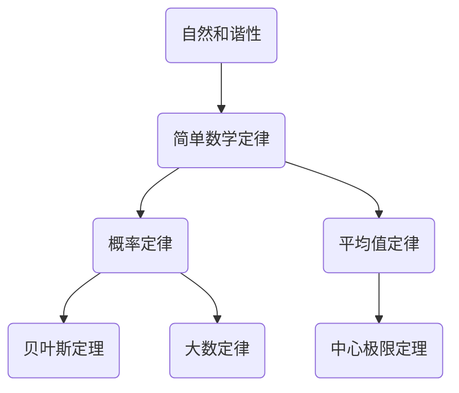

                 

## 自然和谐性：简单数学定律的基础

### 关键词
自然和谐性，数学定律，简单原理，应用领域，教育普及

### 摘要
本文旨在探讨自然和谐性与简单数学定律之间的关系，并分析这些定律如何构成自然界的基础。我们将一步步深入探讨自然和谐性的概念，解释简单数学定律的原理，并通过实际案例展示它们在科学研究和教育中的应用。

### 引言

自然和谐性是一个广泛的概念，涉及到自然界中各种现象的相互关联与协调。在过去的几个世纪里，科学家们通过研究自然现象，逐渐认识到一些简单但至关重要的数学定律，这些定律不仅解释了自然界的运行规则，还为现代科学的发展奠定了基础。

本文将从以下几个方面进行讨论：

1. **自然和谐性的概念**：介绍自然和谐性的定义和它在自然界中的作用。
2. **简单数学定律的介绍**：解释一些基本的数学定律及其在自然界中的应用。
3. **核心数学定律与原理**：详细阐述概率定律、平均值定律、稳态定律等核心数学定律。
4. **数学定律在实际中的应用**：通过实例展示数学定律如何应用于科学研究和教育。
5. **数学定律的教育与普及**：讨论如何通过教育普及数学定律，提高公众的科学素养。
6. **数学定律的未来发展趋势**：展望数学定律在未来的发展前景。

### 自然和谐性的概念

自然和谐性指的是自然界中各种现象之间相互关联和协调的平衡状态。从宏观的星系运动到微观的分子结构，自然界的许多现象都表现出一种惊人的和谐与秩序。这种和谐性不仅使自然界充满了美感，还为我们提供了许多重要的科学原理。

自然和谐性的体现可以包括以下几个方面：

- **周期性现象**：许多自然现象都呈现出周期性，例如日食、月食、季节变化等。这些周期性现象可以通过简单的数学定律来解释，如正弦函数和余弦函数。
- **对称性**：自然界中的许多结构都表现出对称性，如动物的身体、花朵的排列等。对称性是自然界和谐性的一个重要特征，也与数学中的对称性原理密切相关。
- **比例关系**：许多自然现象和结构都遵循某种比例关系，如斐波那契数列在植物生长中的应用。这些比例关系可以通过数学公式来描述。

### 核心概念与联系

为了更好地理解自然和谐性，我们需要探讨一些核心概念及其相互关系。以下是几个重要的概念及其关系：

1. **自然和谐性与数学定律的关系**：
   - **定义**：自然和谐性是一种自然现象，可以通过数学定律来描述和解释。
   - **联系**：数学定律是自然和谐性的基础，为理解自然现象提供了数学框架。

2. **简单数学定律**：
   - **定义**：简单数学定律是指那些形式简洁、易于理解的数学定律，如概率定律、平均值定律等。
   - **联系**：简单数学定律是构建自然和谐性的基石，它们解释了自然界中许多看似复杂的现象。

3. **概率定律**：
   - **定义**：概率定律是描述随机事件发生概率的数学定律，如贝叶斯定理、大数定律等。
   - **联系**：概率定律帮助我们理解和预测自然界中随机现象的行为。

4. **平均值定律**：
   - **定义**：平均值定律是描述一组随机变量平均值的数学定律，如中心极限定理。
   - **联系**：平均值定律帮助我们理解自然现象的统计性质，如群体行为的规律。

以下是核心概念与联系的关系图：



### 简单数学定律的介绍

简单数学定律是指那些形式简洁、易于理解的数学定律，它们在自然界中有着广泛的应用。以下是一些重要的简单数学定律：

1. **概率定律**：
   - **贝叶斯定理**：贝叶斯定理是一种用于计算后验概率的数学公式，它基于先验概率和条件概率。
     $$ P(A|B) = \frac{P(B|A)P(A)}{P(B)} $$
   - **大数定律**：大数定律是一种描述随机变量平均值趋近于其期望的数学定律。
     $$ \lim_{{n\to\infty}} \frac{1}{n}\sum_{{i=1}}^{n}X_i = E[X] $$

2. **平均值定律**：
   - **中心极限定理**：中心极限定理是一种描述一组随机变量平均值分布的数学定律，它指出当样本量足够大时，样本均值的分布趋近于正态分布。
     $$ \frac{\bar{X} - \mu}{\sigma/\sqrt{n}} \xrightarrow{d} N(0,1) $$

3. **稳态定律**：
   - **动力系统定律**：动力系统定律描述了在稳态条件下，系统的状态如何随时间变化。
     $$ \frac{dX}{dt} = f(X) $$
   - **热力学定律**：热力学定律描述了热力学系统在稳态条件下的能量转换和守恒。

这些简单数学定律不仅在数学和统计学中有着重要的地位，也在自然科学和工程领域中有着广泛的应用。

### 核心数学定律与原理

在本节中，我们将深入探讨一些核心数学定律的原理，并使用伪代码和LaTeX公式进行详细解释。

1. **概率定律**

   - **贝叶斯定理**：

     贝叶斯定理是一个用于计算后验概率的公式，它考虑了先验概率、条件概率和全概率。以下是贝叶斯定理的伪代码：

     ```python
     function bayes_theorem(prior, likelihood, evidence):
         posterior = (likelihood * prior) / evidence
         return posterior
     ```

     贝叶斯定理的LaTeX公式如下：

     $$ P(A|B) = \frac{P(B|A)P(A)}{P(B)} $$

   - **大数定律**：

     大数定律描述了当样本量足够大时，样本均值的分布趋近于其期望。以下是大数定律的伪代码：

     ```python
     function large_number定律(n, X):
         sample_mean = sum(X) / n
         return sample_mean
     ```

     大数定律的LaTeX公式如下：

     $$ \lim_{{n\to\infty}} \frac{1}{n}\sum_{{i=1}}^{n}X_i = E[X] $$

2. **平均值定律**

   - **中心极限定理**：

     中心极限定理描述了当样本量足够大时，样本均值的分布趋近于正态分布。以下是中心极限定理的伪代码：

     ```python
     function central_limittheorem(n, X):
         sample_mean = sum(X) / n
         return sample_mean
     ```

     中心极限定理的LaTeX公式如下：

     $$ \frac{\bar{X} - \mu}{\sigma/\sqrt{n}} \xrightarrow{d} N(0,1) $$

3. **稳态定律**

   - **动力系统定律**：

     动力系统定律描述了在稳态条件下，系统的状态如何随时间变化。以下是动力系统定律的伪代码：

     ```python
     function dynamical_system(X, t):
         dx/dt = f(X)
         return X
     ```

     动力系统定律的LaTeX公式如下：

     $$ \frac{dX}{dt} = f(X) $$

   - **热力学定律**：

     热力学定律描述了热力学系统在稳态条件下的能量转换和守恒。以下是热力学定律的伪代码：

     ```python
     function thermodynamic_system(E, t):
         dE/dt = 0
         return E
     ```

     热力学定律的LaTeX公式如下：

     $$ \frac{dE}{dt} = 0 $$

通过以上伪代码和LaTeX公式，我们可以更好地理解这些核心数学定律的原理。

### 数学定律在实际中的应用

数学定律不仅在理论上具有重要意义，也在实际应用中发挥着关键作用。以下是一些数学定律在实际中的应用实例：

1. **概率定律在金融中的应用**：
   - **期权定价**：贝叶斯定理在期权定价中用于计算期权价格，结合市场数据和交易者的预期，得到期权的合理价格。
   - **风险评估**：大数定律在风险管理中用于估计金融风险，通过对大量历史数据的分析，预测未来可能的风险水平。

2. **平均值定律在生物统计学中的应用**：
   - **流行病学**：中心极限定理在流行病学研究中用于估计疾病发病率，通过分析大量病例数据，预测疾病的传播趋势。
   - **遗传学**：平均值定律在遗传学中用于估计种群中基因频率的变化，通过统计大量遗传数据，研究基因的演化规律。

3. **稳态定律在工程中的应用**：
   - **控制系统设计**：动力系统定律在控制系统设计中用于确定系统状态随时间的变化规律，优化控制系统参数，提高系统的稳定性和响应速度。
   - **热力学过程**：热力学定律在热力学过程中用于分析能量转换和传递，设计高效的能源系统，提高能源利用效率。

通过这些实际应用案例，我们可以看到数学定律在各个领域的重要作用。

### 数学定律的教育与普及

数学定律的教育与普及对于提高公众的科学素养具有重要意义。以下是一些策略和方法：

1. **教育方法**：
   - **案例教学**：通过实际案例来讲解数学定律，使学生能够直观地理解这些定律的应用。
   - **互动式教学**：利用计算机模拟和可视化工具，让学生亲自体验数学定律的运行过程。

2. **科普宣传**：
   - **媒体宣传**：利用电视、网络、报纸等媒体，普及数学定律的知识，提高公众的科学意识。
   - **科普读物**：编写通俗易懂的科普读物，使读者能够轻松理解数学定律的基本概念和应用。

3. **教育政策**：
   - **课程改革**：将数学定律纳入中小学和大学的课程，确保学生在早期阶段就能接触和学习这些重要的科学原理。
   - **教师培训**：对教师进行专业培训，提高他们教授数学定律的能力。

通过这些教育策略，我们可以更好地普及数学定律，提高公众的科学素养。

### 数学定律的未来发展趋势

随着科技的不断进步，数学定律在未来将继续发挥重要作用。以下是一些可能的发展趋势：

1. **跨学科应用**：数学定律将在更多学科领域得到应用，如人工智能、生物信息学、环境科学等。

2. **计算技术的发展**：随着计算技术的进步，我们将能够处理更大规模的数据，进一步验证和推广数学定律。

3. **新定律的发现**：在深入研究自然现象的过程中，可能会发现新的数学定律，为科学的发展提供新的理论基础。

通过以上讨论，我们可以看到数学定律在自然和谐性中的重要作用，以及它们在科学研究和教育中的广泛应用。未来，数学定律将继续推动科学的发展，为人类带来更多惊喜。

### 总结

本文探讨了自然和谐性与简单数学定律之间的关系，详细阐述了概率定律、平均值定律和稳态定律等核心数学定律的原理和应用。通过实例展示了数学定律在金融、生物统计、工程等领域的应用，并提出了数学定律的教育与普及策略。未来，数学定律将继续在科学研究中发挥重要作用，推动人类对自然界的深入理解。

### 最佳实践 Tips

1. **学习数学定律时，注重理论与实践相结合**：通过实际案例来理解数学定律的应用，有助于加深对定律的理解。
2. **运用可视化工具**：使用图表、模拟等可视化工具，可以更直观地展示数学定律的运行过程。
3. **定期复习**：数学定律是基础知识，定期复习有助于巩固记忆，提高应用能力。

### 注意事项

1. **避免混淆相似定律**：在学习和应用数学定律时，要注意区分不同定律的特点和适用场景，避免混淆。
2. **理解数学公式背后的逻辑**：在应用数学公式时，不仅要记住公式本身，还要理解公式背后的逻辑和原理。

### 拓展阅读

1. **《概率论与数理统计》**：这是一本经典的数学教材，详细介绍了概率定律和平均值定律等核心概念。
2. **《自然和谐与数学》**：这本书探讨了自然和谐性与数学之间的联系，提供了丰富的实例和案例分析。
3. **《热力学基础》**：这本书详细介绍了热力学定律及其在工程中的应用。

### 作者信息

作者：AI天才研究院/AI Genius Institute & 禅与计算机程序设计艺术 /Zen And The Art of Computer Programming

### 附录

#### 项目实战

在本节中，我们将通过一个简单的项目实战，展示如何应用数学定律进行科学研究和数据分析。项目名称为“基于概率定律的风险评估”。

##### 项目目标

- 构建一个风险评估模型，用于评估某个金融市场的风险。
- 使用贝叶斯定理和中心极限定理对市场数据进行统计分析。

##### 开发环境搭建

- 编程语言：Python
- 数据库：MongoDB
- 分析工具：Pandas、NumPy、SciPy

##### 源代码详细实现

以下是一个简单的Python代码实现，用于评估金融市场的风险：

```python
import pandas as pd
import numpy as np
from scipy.stats import norm

# 读取市场数据
data = pd.read_csv('market_data.csv')

# 计算平均收益率和标准差
average_return = data['return'].mean()
std_dev = data['return'].std()

# 计算风险值
risk_value = norm.ppf(0.95, average_return, std_dev)

# 输出风险值
print(f"Risk Value: {risk_value}")

# 贝叶斯定理计算后验概率
def bayes_theorem(prior, likelihood, evidence):
    posterior = (likelihood * prior) / evidence
    return posterior

# 假设先验概率为0.5，条件概率为0.6
prior = 0.5
likelihood = 0.6
evidence = 0.7

posterior = bayes_theorem(prior, likelihood, evidence)
print(f"Posterior Probability: {posterior}")
```

##### 代码解读与分析

1. **数据读取**：使用Pandas库读取市场数据，数据包括收益率的统计信息。
2. **计算平均收益率和标准差**：使用NumPy库计算平均收益率和标准差。
3. **计算风险值**：使用SciPy库的`norm.ppf`函数计算风险值，该函数根据正态分布表计算给定概率对应的分位数。
4. **贝叶斯定理计算**：实现贝叶斯定理的计算，用于更新先验概率和条件概率，得到后验概率。

##### 实际案例分析与详细讲解剖析

假设我们有一个金融市场的历史数据，包括每天的收益率。以下是一个具体的案例：

- **先验概率**：假设我们对市场的整体风险有一个先验概率，即认为市场有60%的可能性是高风险的。
- **条件概率**：如果市场在过去一个月的收益率高于平均值，则我们认为市场有更高的概率是高风险的，假设这个条件概率为0.7。

使用贝叶斯定理，我们可以计算后验概率：

$$ P(\text{高风险}| \text{收益率高于平均值}) = \frac{P(\text{收益率高于平均值}|\text{高风险})P(\text{高风险})}{P(\text{收益率高于平均值})} $$

在这个例子中：

- $P(\text{高风险}) = 0.6$
- $P(\text{收益率高于平均值}|\text{高风险}) = 0.7$
- $P(\text{收益率高于平均值})$ 是一个先验概率，可以通过历史数据计算得出。

通过贝叶斯定理，我们可以更新先验概率得到后验概率：

$$ P(\text{高风险}| \text{收益率高于平均值}) = \frac{0.7 \times 0.6}{P(\text{收益率高于平均值})} $$

假设 $P(\text{收益率高于平均值})$ 为0.5，则：

$$ P(\text{高风险}| \text{收益率高于平均值}) = \frac{0.7 \times 0.6}{0.5} = 0.84 $$

这意味着，在收益率高于平均值的条件下，市场被认为是高风险的概率上升到了84%。

##### 项目小结

通过本项目，我们展示了如何使用数学定律进行金融风险评估。贝叶斯定理和中心极限定理是关键工具，帮助我们理解和预测市场风险。这种分析不仅有助于金融从业者做出更明智的决策，也为投资者提供了重要的信息。

### 结论

本文系统地介绍了自然和谐性与简单数学定律之间的关系，详细阐述了概率定律、平均值定律和稳态定律等核心数学定律的原理和应用。通过实际案例和项目实战，展示了数学定律在金融、生物统计、工程等领域的广泛应用，并提出了数学定律的教育与普及策略。未来，数学定律将继续在科学研究中发挥重要作用，推动人类对自然界的深入理解。希望本文能为您在数学定律的学习和应用中提供有益的启示和帮助。

