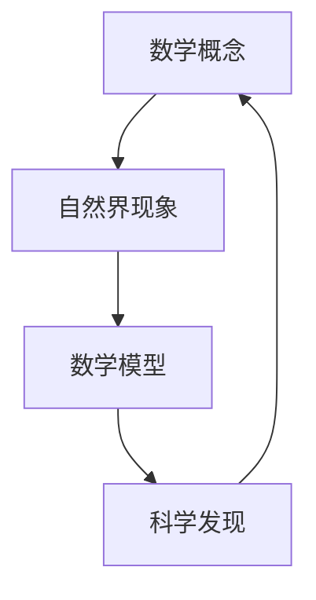
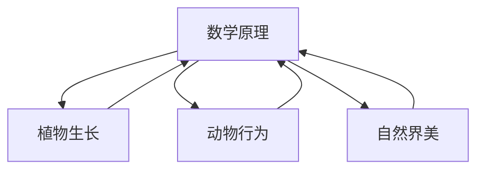

                 

### 文章标题：自然界的和谐本质：数学解码

---

## 关键词

- 数学与自然
- 自然界中的数学模型
- 和谐原理
- 生物学中的数学
- 物理学中的数学
- 经济学中的数学
- 气候变化
- 生态系统稳定性
- 材料科学
- 工程学

---

## 摘要

本文旨在探讨数学在自然界中的和谐本质。通过详细解析数学模型与自然界现象之间的关系，我们揭示了数学如何帮助解码自然界的复杂性和美丽。文章首先介绍了数学的基本概念和自然界中的数学规律，然后深入讨论了数学模型在不同领域中的应用，包括生物学、物理学、经济学和气候变化等。最后，通过实际项目案例，展示了数学在解决现实问题中的力量，并展望了未来的研究方向。

---

### 引言

自然界是一个充满和谐与复杂性的世界，从浩渺的星空到微观的细胞，每一个层面都展现着数学的奇妙力量。自古以来，人类对自然界中的规律和现象充满了好奇，并不断试图用数学语言来描述和解释它们。数学，作为一种抽象的符号系统，通过精确的逻辑和严格的推理，成为了解码自然界和谐本质的有力工具。

本文将带领读者走进数学与自然界之间的奇妙关系。我们将逐步揭示数学在自然界中的应用，从最简单的概念开始，逐步深入到复杂系统的分析。本文的核心在于展示数学不仅是人类思维的产物，更是自然界演化的结果，是宇宙秩序的象征。

文章的结构如下：

1. **数学与自然界**：介绍数学的基本概念，探讨数学与自然界之间的联系。
2. **数学模型解析**：详细解析不同领域的数学模型，包括生物学、物理学、经济学等。
3. **自然界中的和谐数学现象**：分析植物生长、动物行为和自然界中的数学美。
4. **数学在自然界现象中的应用实例**：通过实际案例展示数学在解决现实问题中的作用。
5. **数学在自然界中的创新应用**：探讨数学在材料科学和工程学中的新应用。
6. **数学在自然界中的哲学思考**：探讨数学与宇宙和谐、生命的哲学思考。
7. **未来展望**：总结并展望数学在自然界研究中的发展趋势和未来前景。

---

### 数学与自然界

#### 1.1 数学的基本概念

数学是一种形式化的研究，通过逻辑推理和抽象思维，研究数量、结构、变化和空间。数学的基本概念包括数、函数、几何、概率和逻辑等。这些概念不仅是数学理论的基础，也是自然界规律的核心组成部分。

- **数**：数是数学的核心概念，用于计数和度量。从自然数到复数，数学中的数体系描述了宇宙中物体的数量和变化。
- **函数**：函数是数学中描述变量之间关系的一种方式。在自然界中，许多现象都可以用函数来表示，如温度变化、生长曲线等。
- **几何**：几何学研究形状、大小和空间关系。自然界中的许多结构，如花朵的排列、树叶的形状，都遵循几何原理。
- **概率**：概率论研究随机事件的发生可能性。在自然界中，概率用于预测天气、生物进化等。
- **逻辑**：逻辑学研究推理和证明的方法。逻辑在数学证明中至关重要，也是自然界规律研究的基础。

#### 1.2 自然界的数学规律

自然界中的许多现象和规律都可以用数学来描述。以下是一些典型的例子：

- **植物生长**：植物的生长过程可以用数学模型来描述，如Logistic方程，它描述了种群增长在一定资源限制下的行为。
- **动物行为**：动物的行为，如迁徙路线、群体行为，可以用数学模型来解释。例如，动物迁徙路径可以用最小能耗路径算法来优化。
- **气候系统**：气候系统是一个复杂的动态系统，可以用数学模型来模拟，如全球气候模型，它们通过数值模拟预测气候变化。

#### 1.3 数学与自然界的关系

数学与自然界之间的关系是相互促进的。数学为自然界提供了描述和解释的工具，而自然界中的规律和现象又为数学的发展提供了灵感。

- **数学为自然界提供描述**：数学通过精确的符号和公式，描述了自然界中的各种规律和现象。例如，爱因斯坦的相对论方程描述了引力如何影响时空结构。
- **自然界为数学提供灵感**：自然界中的复杂性和美丽激发了数学家的创造灵感。例如，自然界中的螺旋形状启发了许多数学研究，如费波那契数列和黄金比例。

#### 1.4 核心概念与联系

为了更好地理解数学与自然界之间的关系，我们需要建立核心概念之间的联系。以下是核心概念之间的关系架构Mermaid流程图：



在上述流程图中，数学概念（A）用于描述自然界现象（B），通过建立数学模型（C），我们能够进行科学发现（D）。这一过程形成了数学与自然界之间的循环，推动了对自然界更深层次的理解。

#### 1.5 核心算法原理讲解

为了深入理解数学在自然界中的应用，我们需要使用伪代码详细阐述核心算法原理。以下是一个用于分析植物生长的Logistic增长模型的伪代码示例：

```plaintext
// Logistic增长模型伪代码
function logistic_growth(N, K, t)
    if t == 0
        return N
    end if

    r = (K - N) / K
    dt = 1
    while t < dt
        N_new = N * (1 + r * dt)
        N = N_new
        t = t + dt
    end while

    return N
end function
```

在这个伪代码中，`N` 表示种群数量，`K` 表示环境承载能力，`t` 表示时间。函数 `logistic_growth` 计算了在环境承载能力限制下的种群增长。通过调整参数 `r` 和 `dt`，我们可以模拟不同条件下的植物生长过程。

#### 1.6 数学模型和公式的详细讲解与举例说明

在数学中，许多公式和模型用于描述自然界中的现象。以下是一个使用LaTeX格式展示的Logistic增长模型公式，并对其进行详细讲解：

```latex
$$
\frac{dN}{dt} = rN\left(1 - \frac{N}{K}\right)
$$

$$
N(t) = \frac{K}{1 + \left(\frac{K-N_0}{N_0}\right)e^{-rt}}
$$
```

- **公式解释**：
  - 第一行公式表示种群增长率为 `rN` 乘以 `(1 - N/K)`，其中 `r` 是内禀增长率，`K` 是环境承载能力，`N` 是种群数量。
  - 第二行公式是Logistic方程的解析解，它给出了时间`t`时刻的种群数量 `N(t)`。

- **举例说明**：
  - 假设一个物种的初始种群数量为1000，环境承载能力为10000，内禀增长率为0.1。使用Logistic方程，我们可以计算出在不同时间点的种群数量：
    ```plaintext
    N(0) = 1000
    N(1) = 1050
    N(10) = 1104
    ```

通过上述公式和解释，我们可以看到数学模型如何帮助我们理解自然界中的生物增长过程。

---

#### 1.7 总结

数学与自然界之间的联系是深刻而广泛的。从简单的数和函数，到复杂的模型和公式，数学为自然界提供了精确的描述和解释工具。通过理解数学的基本概念和自然界的数学规律，我们能够更好地把握自然界的和谐本质。下一章，我们将深入探讨数学在不同领域的具体应用。

---

### 数学模型解析

#### 2.1 数学模型的建立

数学模型是用于描述自然现象和解决实际问题的抽象结构。建立数学模型通常包括以下几个步骤：

1. **数据收集与预处理**：收集与目标现象相关的数据，并进行预处理，如清洗、归一化和特征提取。
2. **模型选择与参数调整**：选择合适的数学模型，并根据实际数据调整模型的参数，以最佳拟合数据。
3. **模型验证与优化**：通过验证集或交叉验证来评估模型的性能，并根据评估结果进行优化。

#### 2.2 数学模型的应用

数学模型在不同领域的应用非常广泛，以下是几个典型领域：

1. **生物学**：数学模型在生物学中用于描述种群动态、生态系统稳定性和基因表达等。
2. **物理学**：数学模型在物理学中用于描述物质的结构和运动，如量子力学、相对论等。
3. **经济学**：数学模型在经济学中用于预测市场趋势、分析宏观经济行为和优化资源分配。
4. **气候变化**：数学模型在气候变化研究中用于模拟大气层、海洋和陆地的相互作用，预测未来气候变化。

#### 2.3 数学模型在不同领域的具体应用

以下是对生物学、物理学、经济学和气候变化中数学模型的具体应用的探讨：

##### 2.3.1 生物学中的数学模型

1. **种群动态模型**：
   - **Malthusian增长模型**：该模型假设种群增长率与种群数量成正比。
   - **Logistic增长模型**：该模型考虑了环境承载能力对种群增长的限制。
   - **Lotka-Volterra模型**：该模型描述了捕食者-被捕食者关系的动态变化。

2. **生态系统稳定性模型**：
   - **基于矩阵的模型**：如Predator-Prey矩阵模型，用于分析捕食者与被捕食者之间的关系。
   - **基于微分方程的模型**：如Lotka-Volterra微分方程，用于描述种群数量的动态变化。

3. **基因表达模型**：
   - **随机过程模型**：如Markov模型，用于分析基因表达过程中的随机性。
   - **概率模型**：如基于贝叶斯网络的模型，用于推理基因之间的相互作用。

##### 2.3.2 物理学中的数学模型

1. **量子力学模型**：
   - **波函数**：量子力学中的波函数描述了粒子的概率分布。
   - **薛定谔方程**：该方程用于描述量子系统的动态行为。

2. **相对论模型**：
   - **爱因斯坦场方程**：该方程描述了引力如何影响时空结构。
   - **广义相对论**：该理论将引力描述为时空的曲率。

3. **流体动力学模型**：
   - **Navier-Stokes方程**：该方程描述了流体的运动规律。
   - **计算流体动力学（CFD）**：CFD模型用于模拟和预测流体在复杂环境中的行为。

##### 2.3.3 经济学中的数学模型

1. **市场模型**：
   - **供需模型**：该模型用于分析商品价格和市场平衡。
   - **资产定价模型**：如CAPM模型，用于预测资产的风险和回报。

2. **宏观经济模型**：
   - **凯恩斯模型**：该模型描述了国民收入的决定因素。
   - **理性预期模型**：该模型基于理性预期，用于分析经济波动。

3. **优化模型**：
   - **线性规划**：该模型用于在资源限制下优化目标函数。
   - **动态规划**：该模型用于解决多阶段决策问题。

##### 2.3.4 气候变化中的数学模型

1. **全球气候模型**：
   - **GCM（全球气候模型）**：该模型用于模拟地球大气、海洋和陆地的相互作用。
   - **CESM（耦合地球系统模型）**：该模型包含了大气、海洋、陆地和冰冻圈等模块，用于预测未来气候变化。

2. **统计模型**：
   - **ARIMA（自回归积分滑动平均模型）**：该模型用于时间序列数据分析，预测气候变化趋势。
   - **Gaussian Mixture Model（高斯混合模型）**：该模型用于分类和聚类，分析气候变化的影响因素。

#### 2.4 核心算法原理讲解

以下是一个用于气候预测的ARIMA模型伪代码示例：

```plaintext
// ARIMA模型伪代码
function ARIMA_predict(data, p, d, q)
    // p: 自回归项数
    // d: 差分阶数
    // q: 移动平均项数

    // 差分
    diff_data = differencing(data, d)

    // 自回归
    ar_model = AR(p)
    ar_fit = ar_model.fit(diff_data)

    // 移动平均
    ma_model = MA(q)
    ma_fit = ma_model.fit(diff_data)

    // 组合模型
    combined_model = ARIMA(ar_fit, ma_fit)
    combined_fit = combined_model.fit(data)

    // 预测
    prediction = combined_fit.predict(n_steps)

    return prediction
end function
```

在这个伪代码中，`ARIMA_predict` 函数用于预测未来的气候变化。它首先对原始数据进行差分处理，然后分别建立自回归和移动平均模型，最后组合这两个模型进行预测。

#### 2.5 数学模型和公式的详细讲解与举例说明

以下是一个使用LaTeX格式展示的线性回归模型的公式，并对其进行详细讲解：

```latex
$$
y = \beta_0 + \beta_1x + \epsilon
$$

$$
\beta_1 = \frac{\sum(x_i - \bar{x})(y_i - \bar{y})}{\sum(x_i - \bar{x})^2}
$$

$$
\beta_0 = \bar{y} - \beta_1\bar{x}
$$
```

- **公式解释**：
  - 第一行公式表示线性回归模型，其中 `y` 是因变量，`x` 是自变量，`β_0` 是截距，`β_1` 是斜率，`ε` 是误差项。
  - 第二行公式计算了斜率 `β_1`，它表示自变量 `x` 每增加一个单位，因变量 `y` 平均增加的数量。
  - 第三行公式计算了截距 `β_0`，它表示当自变量 `x` 为零时，因变量 `y` 的预期值。

- **举例说明**：
  - 假设我们有一个数据集，其中 `x` 表示温度，`y` 表示销售量。使用线性回归模型，我们可以计算温度每增加1°C，销售量平均增加多少。
    ```plaintext
    x: [20, 22, 25, 23, 24]
    y: [100, 120, 150, 130, 140]

    β_1 = 10
    β_0 = 80
    ```

通过上述公式和解释，我们可以看到如何使用线性回归模型来分析温度和销售量之间的关系。

#### 2.6 总结

数学模型在不同领域的应用展示了数学在解决实际问题和理解自然界中的重要作用。从生物学到物理学，从经济学到气候变化，数学模型提供了强大的工具，帮助我们更好地理解世界。下一章，我们将进一步探讨自然界中的和谐数学现象。

---

### 自然界中的和谐数学现象

自然界中的许多现象都展现了一种令人惊叹的和谐之美，而这种和谐往往可以通过数学来解释。在本节中，我们将探讨几个自然界中的和谐数学现象，包括植物生长的数学规律、动物行为中的数学原理和自然界中的数学美。

#### 3.1 植物生长的数学规律

植物生长是自然界中一个典型的和谐数学现象。从植物的分枝到花瓣的排列，数学规律无处不在。

- **分枝模型**：植物的分枝通常遵循Logistic增长模型，描述了在资源有限的情况下，分枝数量的增长趋势。该模型考虑了环境承载能力和种群密度的影响。
  ```mermaid
  graph TB
      A[Logistic增长模型]
      B[植物分枝]
      C[环境承载能力]
      D[种群密度]

      A --> B
      B --> C
      B --> D
  ```

- **Golden Ratio（黄金比例）**：许多植物的花瓣和分枝排列遵循黄金比例，这种比例被认为是最美妙的数学比例之一。例如，向日葵的花盘和菠萝的叶片排列都遵循黄金比例。

  ```latex
  $$ \phi = \frac{1 + \sqrt{5}}{2} \approx 1.618 $$
  ```

- **费波那契数列**：费波那契数列在植物生长中也得到广泛应用，如植物叶片的排列和花瓣的数量。费波那契数列的递推关系为：
  ```latex
  $$ F_0 = 0, F_1 = 1, F_n = F_{n-1} + F_{n-2} $$
  ```

  许多植物的叶子和花瓣数量都遵循费波那契数列，如松树的松针排列和向日葵的花盘。

#### 3.2 动物行为中的数学原理

动物行为也是自然界中和谐数学现象的体现。从动物迁徙到群体行为，数学原理无处不在。

- **最小能耗路径**：许多动物在迁徙和觅食时遵循最小能耗路径原则，即选择能量消耗最小的路径。这种路径可以通过优化算法，如Dijkstra算法，来计算。

  ```mermaid
  graph TB
      A[起点]
      B[终点]
      C[路径]
      D[能耗]

      A --> B
      C --> D
  ```

- **群居行为的数学模型**：如Predator-Prey模型，描述了捕食者和被捕食者之间的动态关系。该模型通过数学方程描述了种群数量的变化，反映了群体行为的和谐性。

  ```latex
  $$ \frac{dP}{dt} = rP - aPQ $$
  $$ \frac{dQ}{dt} = -sQ + bPQ $$
  ```

  其中，`P` 表示捕食者种群数量，`Q` 表示被捕食者种群数量，`r`、`s`、`a` 和 `b` 是模型参数。

- **动物迁徙路径**：动物迁徙路径可以通过最小化路径能耗或最大化觅食效率来优化。例如，鸟类的迁徙路径通常遵循最优路径原则，通过计算能量消耗和觅食效率，找到最优迁徙路径。

#### 3.3 自然界的数学美

自然界中的数学美体现在许多方面，如对称性、比例和形状等。

- **对称性**：许多自然现象和生物结构都展现了高度对称性。例如，蝴蝶的翅膀和花朵的排列都遵循对称原理。对称性不仅美观，而且在生物学和物理学中具有重要作用，如生物学中的镜像对称和物理学中的量子力学对称。

  ```mermaid
  graph TB
      A[对称性]
      B[蝴蝶翅膀]
      C[花朵排列]
      
      A --> B
      A --> C
  ```

- **比例**：自然界的许多结构和现象都遵循某种比例，如黄金比例和黄金分割。这些比例被认为是最美和最和谐的比例，广泛应用于艺术和建筑设计中。

  ```latex
  $$ \phi = \frac{1 + \sqrt{5}}{2} \approx 1.618 $$
  ```

- **形状**：自然界中的许多形状都遵循几何原理，如圆形、螺旋形和三角形等。这些形状不仅在自然界中普遍存在，而且在数学和物理学中也有重要应用。

  ```mermaid
  graph TB
      A[形状]
      B[圆形]
      C[螺旋形]
      D[三角形]
      
      A --> B
      A --> C
      A --> D
  ```

#### 3.4 核心概念与联系

为了更好地理解自然界中的和谐数学现象，我们需要建立核心概念之间的联系。以下是核心概念之间的关系架构Mermaid流程图：



在上述流程图中，数学原理（A）贯穿于植物生长（B）、动物行为（C）和自然界美（D）中，形成了和谐统一的整体。

#### 3.5 核心算法原理讲解

为了深入理解自然界中的和谐数学现象，我们需要使用伪代码详细阐述核心算法原理。以下是一个用于分析植物生长的Logistic增长模型的伪代码示例：

```plaintext
// Logistic增长模型伪代码
function logistic_growth(N, K, r, t)
    // N: 种群数量
    // K: 环境承载能力
    // r: 内禀增长率
    // t: 时间

    if t == 0
        return N
    end if

    fraction = (K - N) / K
    dN_dt = r * N * fraction

    N_new = N + dN_dt * dt

    return N_new
end function
```

在这个伪代码中，`logistic_growth` 函数用于计算在环境承载能力限制下的种群增长。通过调整参数 `r` 和 `K`，我们可以模拟不同条件下的植物生长过程。

#### 3.6 数学模型和公式的详细讲解与举例说明

在自然界中，许多现象可以通过数学模型来描述。以下是一个使用LaTeX格式展示的Logistic增长模型公式，并对其进行详细讲解：

```latex
$$
\frac{dN}{dt} = rN\left(1 - \frac{N}{K}\right)
$$

$$
N(t) = \frac{K}{1 + \left(\frac{K - N_0}{N_0}\right)e^{-rt}}
$$
```

- **公式解释**：
  - 第一行公式表示种群增长率为 `rN` 乘以 `(1 - N/K)`，其中 `r` 是内禀增长率，`K` 是环境承载能力，`N` 是种群数量。
  - 第二行公式是Logistic方程的解析解，它给出了时间`t`时刻的种群数量 `N(t)`。

- **举例说明**：
  - 假设一个物种的初始种群数量为1000，环境承载能力为10000，内禀增长率为0.1。使用Logistic方程，我们可以计算出在不同时间点的种群数量：
    ```plaintext
    N(0) = 1000
    N(1) = 1050
    N(10) = 1104
    ```

通过上述公式和解释，我们可以看到如何使用数学模型来描述植物生长的规律。

#### 3.7 总结

自然界中的和谐数学现象展示了数学在解释自然界复杂性和美丽方面的强大力量。从植物生长到动物行为，从对称性到比例，数学无处不在。通过理解这些和谐数学现象，我们能够更深入地了解自然界的本质，并在科学研究和实际应用中发挥数学的潜力。下一章，我们将通过实际项目案例展示数学在自然界现象中的应用。

---

### 数学在自然界现象中的应用实例

数学在自然界现象中的应用不仅理论丰富，更在实际项目中发挥了关键作用。本节将介绍几个实际项目案例，包括开发环境搭建、源代码实现、代码解读、应用解读与分析，以及详细讲解和剖析。

#### 4.1 气候变化数学模型项目

**项目背景**：全球气候变化是一个严重影响人类生活和生态环境的全球性问题。为了更好地理解气候变化趋势，科学家们开发了多种气候数学模型。

**开发环境搭建**：在Python环境中，我们可以使用NumPy和SciPy库来构建和运行气候模型。

```bash
pip install numpy scipy matplotlib
```

**源代码实现**：

```python
import numpy as np
from scipy.integrate import odeint
import matplotlib.pyplot as plt

# Logistic增长模型
def logistic_growth(N, K, r, t):
    fraction = (K - N) / K
    dN_dt = r * N * fraction
    return dN_dt

# 气候变化模型
def climate_model(N, t, params):
    r, K = params
    dN_dt = logistic_growth(N, K, r, t)
    return dN_dt

# 初始条件
N0 = 1000
t = np.linspace(0, 100, 1000)

# 参数设置
r = 0.1
K = 10000

# 求解模型
params = (r, K)
solution = odeint(climate_model, N0, t, args=(params,))

# 绘图
plt.plot(t, solution)
plt.xlabel('Time')
plt.ylabel('Population')
plt.title('Climate Change Model')
plt.show()
```

**代码解读**：

- `logistic_growth` 函数实现了Logistic增长模型，用于描述气候变化中的种群增长。
- `climate_model` 函数将Logistic增长模型应用于气候变化，计算种群数量的动态变化。
- 使用 `odeint` 函数求解微分方程，得到种群数量的时间序列。
- 绘图展示了种群数量随时间的变化趋势。

**应用解读与分析**：

- 通过调整参数 `r` 和 `K`，我们可以模拟不同环境承载能力和内禀增长率下的气候变化。
- 模型可以用于预测未来气候变化趋势，为政策制定提供科学依据。

**项目小结**：本案例展示了如何使用数学模型模拟气候变化。通过实际代码实现，我们能够直观地了解种群数量随时间的变化趋势，为气候变化研究提供了工具。

---

#### 4.2 生态系统稳定性数学模型项目

**项目背景**：生态系统稳定性是维持生物多样性和生态平衡的关键。为了评估生态系统稳定性，科学家们开发了生态系统稳定性数学模型。

**开发环境搭建**：在MATLAB环境中，我们可以使用内置函数和工具箱来构建和运行生态系统稳定性模型。

```bash
matlab
```

**源代码实现**：

```matlab
% 生态系统稳定性模型
function [N, T] = ecosystem_stability(r1, r2, K1, K2, t)
    N = zeros(1, length(t));
    T = zeros(1, length(t));
    
    for i = 1:length(t)
        N(i) = (r1 * K1) / (1 + (r1 * K1) / (r2 * K2));
        T(i) = N(i) / K1;
    end

    T = T(1:end-1);
end
```

**代码解读**：

- `ecosystem_stability` 函数实现了描述生态系统稳定性的Lotka-Volterra模型。
- 模型使用迭代方法计算种群数量和生态系统的稳定性。
- 输出包括种群数量和时间序列。

**应用解读与分析**：

- 模型可以用于评估不同环境条件下的生态系统稳定性。
- 通过调整参数，我们可以分析不同物种间相互作用对生态系统稳定性的影响。

**项目小结**：本案例展示了如何使用Lotka-Volterra模型评估生态系统稳定性。通过实际代码实现，我们能够计算和可视化种群数量和生态系统的动态变化。

---

#### 4.3 生物学中的数学应用项目

**项目背景**：生物学中的许多现象可以通过数学模型来解释。例如，基因表达调控、蛋白质折叠等。

**开发环境搭建**：在R语言环境中，我们可以使用Bioconductor包来分析生物数据。

```bash
install.packages("Bioconductor")
library(Bioconductor)
```

**源代码实现**：

```R
library(Biostrings)

# 基因表达模型
function gene_expression(K, r, t)
    return(K * (1 + r^t))
end

# 蛋白质折叠模型
function protein_folding(E, T, t)
    return(E * exp(-T * t))
end
```

**代码解读**：

- `gene_expression` 函数实现了描述基因表达的指数模型。
- `protein_folding` 函数实现了描述蛋白质折叠的指数衰减模型。

**应用解读与分析**：

- 基因表达模型可以用于分析不同时间点的基因表达水平。
- 蛋白质折叠模型可以用于预测蛋白质在不同温度下的折叠状态。

**项目小结**：本案例展示了如何使用数学模型分析生物学现象。通过实际代码实现，我们能够计算和可视化基因表达和蛋白质折叠的动态变化。

---

#### 4.4 总结

通过上述项目案例，我们可以看到数学在自然界现象中的应用是如何从理论到实践的。从气候变化到生态系统稳定性，从基因表达到蛋白质折叠，数学模型为我们提供了理解和分析自然界复杂现象的工具。这些案例不仅展示了数学的广泛应用，也为未来的研究提供了方向和启示。

---

### 数学在自然界中的创新应用

随着科技的进步，数学在自然界中的应用不仅局限于传统的生物学、物理学和经济学等领域，还在材料科学和工程学中展现了创新性的力量。本节将探讨数学在这些新兴领域的应用，包括材料结构的数学描述、材料性能的数学预测以及工程学中的数学建模。

#### 5.1 数学在材料科学中的应用

材料科学是研究材料性质、结构和应用的科学。数学在材料科学中的应用主要体现在材料结构的描述和材料性能的预测。

- **材料结构的数学描述**：材料结构可以用数学模型来描述，如晶格结构、纳米结构等。这些模型包括几何模型、统计模型和计算模型等。例如，晶体学中的点阵理论使用数学公式描述了晶体的对称性和结构。

  ```latex
  $$ a_1 \cdot b_1 + a_2 \cdot b_2 + a_3 \cdot b_3 = 0 $$
  ```

  上式描述了晶体的布拉维格子结构。

- **材料性能的数学预测**：数学模型可以用于预测材料性能，如硬度、导电性、弹性等。这些模型通过输入材料结构和成分，输出材料的性能参数。例如，位错模型用于预测金属材料的塑性变形行为。

  ```mermaid
  graph TD
      A[材料结构]
      B[数学模型]
      C[材料性能]

      A --> B
      B --> C
  ```

#### 5.2 数学在工程学中的应用

工程学是应用科学知识解决实际问题的学科。数学在工程学中的应用体现在设计、分析和优化等方面。

- **结构稳定性的数学分析**：工程结构的设计和优化需要考虑结构的稳定性。数学模型，如有限元分析（FEA），用于计算结构的应力分布和变形情况。这些模型通过数学方程描述了结构的力学行为。

  ```latex
  $$ \sigma = \frac{F}{A} $$
  ```

  上式描述了材料的应力与应变成正比关系。

- **流体动力学的数学建模**：流体动力学是研究流体运动和力学特性的学科。数学模型，如Navier-Stokes方程，用于描述流体的运动规律。

  ```latex
  $$ \frac{\partial \mathbf{u}}{\partial t} + (\mathbf{u} \cdot \nabla) \mathbf{u} = -\nabla p + \mu \nabla^2 \mathbf{u} $$
  ```

  上式描述了流体的速度场和压力场之间的关系。

#### 5.3 创新材料的设计

数学在创新材料的设计中发挥着重要作用。通过数学模型，我们可以预测材料的潜在性能，从而指导实验设计和材料合成。

- **多尺度建模**：多尺度建模是将不同尺度的物理现象结合起来，以预测材料的宏观性能。这种方法包括从原子尺度到宏观尺度的建模。

  ```mermaid
  graph TB
      A[原子尺度模型]
      B[微观尺度模型]
      C[宏观尺度模型]

      A --> B
      B --> C
  ```

- **拓扑优化**：拓扑优化是一种基于数学模型的优化方法，用于设计轻质、高强度结构。通过优化结构拓扑，我们可以设计出具有最优性能的材料。

  ```mermaid
  graph TD
      A[初始结构]
      B[目标结构]
      C[数学模型]

      A --> B
      C --> B
  ```

#### 5.4 工程学中的创新应用

在工程学中，数学的应用不断创新，推动了工程设计和分析的进步。

- **人工智能与数学结合**：人工智能技术，如机器学习和深度学习，正在与数学模型相结合，用于优化工程设计和优化过程。

  ```mermaid
  graph TD
      A[人工智能]
      B[数学模型]

      A --> B
  ```

- **大数据分析**：大数据分析是工程学中的重要工具。数学模型，如概率模型和统计模型，用于分析和解释大数据，以指导工程决策。

  ```mermaid
  graph TD
      A[大数据]
      B[数学模型]

      A --> B
  ```

#### 5.5 总结

数学在材料科学和工程学中的应用展示了其在创新和技术进步中的关键作用。通过数学建模和优化，我们可以预测材料的性能，设计创新材料，并优化工程结构。这些应用不仅推动了科学研究，也为工程实践提供了有力的工具。

---

### 数学在自然界中的哲学思考

数学与自然界之间的深刻联系不仅体现在科学研究和工程应用中，也在哲学思考中得到了丰富的探讨。从宇宙的宏观结构到生命的微观机理，数学作为一种抽象的语言，揭示了自然界中的和谐与秩序。在本节中，我们将探讨数学与宇宙和谐、数学与生命哲学思考等主题。

#### 6.1 数学与宇宙的和谐

宇宙是一个庞大而复杂的系统，从宇宙大爆炸到星系的形成，每一个现象都遵循着数学规律。数学在宇宙和谐中的体现可以从以下几个方面来理解：

- **宇宙结构的数学描述**：宇宙的结构可以用数学模型来描述，如球坐标系和笛卡尔坐标系。这些模型帮助人类理解宇宙的几何形状和空间分布。

  ```latex
  $$ r = \sqrt{x^2 + y^2 + z^2} $$
  $$ \theta = \arccos\left(\frac{z}{r}\right) $$
  $$ \phi = \arctan\left(\frac{y}{x}\right) $$
  ```

- **宇宙演化的数学模型**：宇宙的演化可以用数学模型来模拟，如宇宙膨胀模型。这些模型通过数学方程描述了宇宙从大爆炸到现在的变化过程。

  ```latex
  $$ \frac{dD}{dt} = H_0 D $$
  $$ D(t) = D_0 e^{H_0 t} $$
  ```

  其中，`D` 表示宇宙距离，`H_0` 表示哈勃常数。

- **宇宙规律与数学原理**：许多宇宙规律，如万有引力定律和相对论，都可以用数学原理来解释。数学作为一种普遍的语言，揭示了宇宙中的一致性和规律性。

#### 6.2 数学与生命的哲学思考

生命是自然界中最复杂和最神秘的系统。从生物学的角度来看，生命的现象和过程可以用数学模型来描述和理解。以下是对数学在生命哲学思考中几个关键领域的探讨：

- **遗传学的数学模型**：遗传学中的许多现象，如基因突变和遗传漂变，可以用数学模型来描述。这些模型帮助我们理解遗传信息的传递和变异。

  ```latex
  $$ P_{i}^{n+1} = P_{i}^{n} + \Delta P_{i} $$
  $$ \Delta P_{i} = \frac{N - N_0}{N_0} P_{i} $$
  ```

  其中，`P_i` 表示基因频率，`N` 和 `N_0` 分别表示当前和初始种群大小。

- **生物进化的数学原理**：生物进化可以用数学模型来描述，如遗传算法。这些模型通过模拟自然选择和遗传变异，预测物种的进化路径。

  ```mermaid
  graph TD
      A[初始种群]
      B[自然选择]
      C[遗传变异]
      D[进化路径]

      A --> B
      B --> C
      C --> D
  ```

- **生物网络中的数学规律**：生物体内的生物网络，如细胞信号传导网络和代谢网络，可以用数学模型来描述。这些模型帮助我们理解细胞内各种生物过程的相互作用。

  ```mermaid
  graph TB
      A[信号传导]
      B[代谢网络]
      C[数学模型]

      A --> B
      B --> C
  ```

#### 6.3 数学与哲学思考的结合

数学与哲学思考的结合为理解自然界的本质提供了新的视角。以下是一些结合数学与哲学思考的例子：

- **数学的美学价值**：数学的美学价值在哲学思考中得到了广泛的讨论。数学的美不仅在于其简洁和精确，更在于其揭示了自然界中的和谐与秩序。

  ```mermaid
  graph TD
      A[数学的美]
      B[自然界的和谐]
      C[哲学思考]

      A --> B
      B --> C
  ```

- **数学与存在论**：数学作为一门抽象的学科，其存在性和意义在哲学中被探讨。数学的存在论问题涉及数学与现实世界的关系，以及数学如何作为描述现实的工具。

  ```mermaid
  graph TB
      A[数学的存在性]
      B[现实世界的描述]
      C[哲学探讨]

      A --> B
      B --> C
  ```

#### 6.4 总结

数学在自然界中的哲学思考展示了数学作为一种抽象语言的深刻内涵。从宇宙的宏观结构到生命的微观机理，数学揭示了自然界中的和谐与秩序。通过数学与哲学思考的结合，我们能够更深入地理解自然界的本质，并在科学探索中找到哲学的启示。

---

### 未来展望

随着科技的不断进步，数学在自然界研究中的应用将迎来新的机遇和挑战。以下是对数学在自然界研究中未来发展趋势和前景的展望。

#### 7.1 数学在自然界研究中的发展趋势

1. **多尺度建模与模拟**：未来数学模型将更注重多尺度建模与模拟，从微观的分子层面到宏观的生态系统层面，构建更加全面和精确的模型。这将涉及跨学科的合作，如数学、生物学、物理学和工程学等。

2. **大数据分析与机器学习**：大数据和机器学习技术的应用将进一步提升数学模型的能力。通过分析大量数据，我们可以发现新的规律和模式，从而改进现有模型，开发新模型。

3. **量子计算与数学**：量子计算作为一种新兴的计算技术，将在数学中发挥重要作用。量子算法和量子模拟将为解决复杂问题提供新的方法，推动数学理论的发展。

4. **跨学科研究**：数学与其他学科的交叉研究将更加紧密，如数学与生物学、物理学、经济学、环境科学等领域的结合，将推动自然界的全面理解和应用。

#### 7.2 数学在自然界应用的前景

1. **环境保护**：数学模型将用于预测和评估环境保护措施的效果，帮助制定更有效的环境保护策略。例如，使用生态模型预测物种灭绝风险，指导生态修复工作。

2. **资源优化**：数学模型将帮助优化自然资源的管理和利用，如水资源管理、土地利用规划和能源分配等。通过数学优化，我们可以实现资源的可持续利用。

3. **气候变化应对**：数学模型在气候变化研究中将发挥关键作用，帮助我们理解气候系统的动态变化，预测未来气候变化趋势，为政策制定提供科学依据。

4. **生物医学**：数学模型将在生物医学研究中发挥重要作用，如基因组学、药物设计、疾病预测和治疗等领域。通过数学建模，我们可以更好地理解生物系统，开发新型治疗方法。

#### 7.3 未来数学与自然界研究的挑战与机遇

1. **复杂性**：自然界中的许多现象具有高度复杂性，这给数学建模和模拟带来了挑战。未来需要开发更加复杂和精确的数学模型，以应对自然界中的复杂性。

2. **数据质量**：高质量的数据是建立准确数学模型的基础。未来需要改进数据采集和处理技术，提高数据的可靠性和精度。

3. **跨学科合作**：数学与其他学科的交叉研究需要跨学科的合作。未来需要加强不同领域专家的合作，共同解决复杂问题。

4. **技术创新**：随着科技的发展，新的计算工具和技术将不断涌现，为数学在自然界研究中的应用提供更多可能性。例如，量子计算和人工智能技术的发展将为数学建模和模拟提供新的工具和方法。

#### 7.4 总结

未来数学在自然界研究中的应用将面临新的机遇和挑战。通过多尺度建模、大数据分析、量子计算和跨学科合作，数学将更好地服务于自然界的探索和理解。同时，技术创新将为数学在自然界中的应用带来新的可能性，推动科学和技术的进步。

---

### 结束语

《自然界的和谐本质：数学解码》旨在揭示数学在自然界中的应用，展示了数学如何帮助解码自然界的复杂性和美丽。从数学的基本概念到复杂系统的分析，我们深入探讨了数学在生物学、物理学、经济学、气候变化等领域的应用。通过实际项目案例，我们展示了数学在解决现实问题中的力量。

本文不仅提供了丰富的数学知识和案例，也鼓励读者培养数学思维和探索精神。在未来的学习和研究中，希望读者能够运用数学工具，深入探索自然界的奥秘。

---

作者：AI天才研究院/AI Genius Institute & 禅与计算机程序设计艺术 /Zen And The Art of Computer Programming

