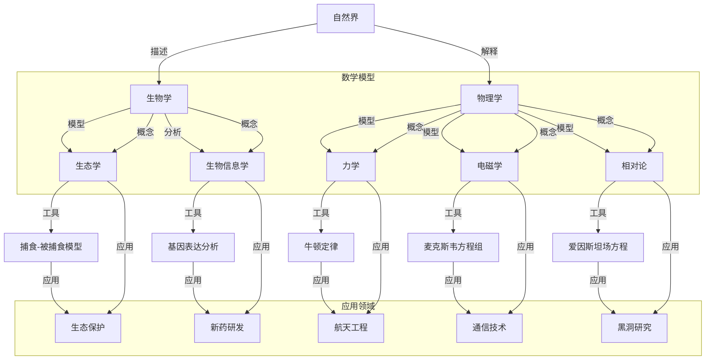

                 

### 文章标题：自然界的和谐：心智中的数学呈现

> **关键词：** 自然界、数学、心智、和谐、呈现

自然界的和谐，自古以来就吸引着人类的目光。从天体的运动规律到生物的进化机制，无不展示出一种神秘的秩序。而在这个神秘秩序的背后，数学扮演着至关重要的角色。数学不仅是科学家研究和描述自然界的有力工具，更是人类心智发展的基石。本文将探讨数学如何以和谐的方式在人类心智中呈现，揭示数学与自然界、心智之间深层次的联系。

### 摘要

本文旨在通过一系列的逻辑推理和分析，揭示数学在自然界中的和谐呈现及其对人类心智的影响。首先，我们将简要介绍数学与自然界的联系，探讨数学模型在描述自然界现象中的应用。接着，我们将深入探讨数学在心智中的呈现，分析数学直觉和心理机制。在此基础上，本文将探讨数学与艺术、建筑、音乐等领域的交集，展示数学在人类文化中的重要性。最后，本文将讨论数学在宇宙探索中的应用，展望数学与人类未来发展的关系。

### 第1章 引言

自然界的和谐，是一种古老而永恒的主题。自古以来，人类就在不断地探索自然界的规律，试图从中找到一种深刻的秩序感。而数学，作为一门抽象的科学，恰恰提供了这样一种工具，使我们能够理解和描述这种秩序。数学的诞生可以追溯到古代文明，从古埃及、巴比伦到古希腊，数学的发展始终伴随着人类对自然界认识的深化。

在现代科学中，数学更是成为了一切自然科学的基础。无论是物理学、化学，还是生物学，都离不开数学的应用。数学模型能够帮助我们描述自然现象，预测未来的变化。例如，牛顿的运动定律就是用数学语言描述了物体的运动规律；而达尔文的进化论则利用概率论和统计方法解释了生物种群的演化过程。

然而，数学不仅仅是一种工具，更是一种思维方式。数学思维要求我们运用逻辑推理和抽象思维，从具体的实例中提炼出一般性的规律。这种思维方式不仅适用于科学研究，也渗透到了人类生活的方方面面。例如，我们在日常生活中经常需要做出决策，而数学概率论提供了一种评估风险和机会的方法。

数学在心智中的呈现，不仅体现在我们的认知能力上，也体现在我们的创造能力上。许多伟大的科学发现和艺术创作，都离不开数学的灵感。例如，达芬奇的绘画作品中，充满了数学的对称和比例关系；而毕加索的抽象艺术，也受到了数学几何的影响。

总的来说，数学与自然界、心智之间的联系，是一种深刻的和谐。数学不仅帮助我们理解自然界的秩序，也促进了人类心智的发展。接下来，我们将进一步探讨数学在自然界中的具体应用，以及它在心智中的呈现方式。

### 第2章 数学与自然现象

数学与自然现象之间的联系，是现代科学研究中不可或缺的一部分。数学不仅为我们提供了描述自然界规律的工具，更在探索自然界的奥秘中发挥了关键作用。在这一章节中，我们将深入探讨数学在生物学、物理学等领域的应用，揭示数学模型如何帮助我们理解和预测自然现象。

#### 数学模型在生物学中的应用

生物学是一个涉及广泛、复杂多样的学科，从基因序列到生态系统，生物现象的复杂性给科学研究带来了巨大的挑战。然而，数学模型为生物学家提供了一种强有力的工具，使我们能够从宏观和微观层面解析生物现象。

一个典型的例子是生态学中的数学模型。生态学关注生物种群在时间空间上的变化规律，而数学模型可以帮助我们理解和预测这些变化。最简单的生态学模型之一是Lotka-Volterra模型，也称为捕食-被捕食模型。该模型描述了捕食者和被捕食者种群数量之间的动态关系，通过数学方程描述捕食者和被捕食者的增长率。具体来说，假设捕食者种群的增长率取决于被捕食者的数量，而被捕食者的增长率则受到捕食者的压力。通过解这个动态系统，我们可以预测种群数量的变化趋势，为生态保护和资源管理提供科学依据。

另一个重要的生物学领域是生物信息学，它利用数学和计算机科学方法研究生物数据。生物信息学中的数学模型包括序列分析、基因表达分析和蛋白质结构预测等。例如，在基因表达分析中，我们通常使用统计学模型来识别基因在不同条件下的表达模式。通过比较不同条件下的基因表达数据，我们可以发现与特定生理或病理状态相关的基因。这种分析不仅有助于理解基因功能，还可以指导新药的研发。

#### 数学在物理学中的体现

物理学是数学应用最为广泛的领域之一。在物理学中，数学不仅是描述自然现象的工具，更是探索自然界本质的基石。牛顿的运动定律、麦克斯韦方程组和爱因斯坦的相对论，都是用数学语言描述物理现象的杰作。

以牛顿的运动定律为例，这些定律用数学方程描述了物体的运动规律。具体来说，牛顿的第二定律F=ma（力等于质量乘以加速度）就是一个典型的数学模型。这个模型不仅帮助我们理解了物体受到力作用时的运动状态，还为我们提供了预测物体运动轨迹的方法。在工程和航天领域，这一数学模型被广泛应用于设计和控制系统的开发。

麦克斯韦方程组是描述电磁现象的数学模型，它们将电场、磁场和电荷、电流之间的关系系统地表述为四个微分方程。这些方程不仅揭示了电磁波的本质，还为通信技术、无线电力传输和光电子学的发展奠定了基础。例如，光纤通信技术就是基于麦克斯韦方程组中的光波传输原理，实现了高速数据传输。

爱因斯坦的相对论则是对时空和重力的一种全新描述，其核心是爱因斯坦场方程。这些方程用数学语言表达了物质能量分布对时空结构的影响，揭示了引力波的存在，并为黑洞、宇宙膨胀等天体现象提供了理论基础。在物理学研究中，这些数学模型不仅帮助我们理解宇宙的基本规律，还为实验验证和理论发展提供了方向。

#### 数学模型的应用案例

除了上述核心领域，数学模型在许多其他自然现象的研究中也发挥着重要作用。例如，在气象学中，数值天气预报依赖于复杂的数学模型来模拟大气动力学和热力学过程。这些模型通过求解流体动力学方程，预测未来的天气变化。气象学中的模型不仅提高了天气预报的准确性，还为气候变化研究和防灾减灾提供了科学依据。

在材料科学中，数学模型被用来模拟材料的微观结构和宏观性能。通过计算材料中的原子排列和电子结构，科学家可以预测新材料的性能，为新材料的发现和设计提供指导。

总之，数学在自然现象研究中的应用是广泛而深入的。从生物学到物理学，数学模型不仅帮助我们理解自然界的规律，还为我们提供了预测和干预自然现象的工具。通过数学建模，我们可以更深入地探索自然界的奥秘，为科学研究和人类福祉作出贡献。

### 核心概念与联系：数学模型在自然界中的架构

为了更清晰地展示数学模型在自然界中的核心概念与联系，我们可以通过Mermaid流程图来构建这一架构。以下是一个简化的Mermaid流程图，描述了数学模型在不同科学领域中的应用及其相互关系：

这个Mermaid流程图展示了数学模型在生物学和物理学中的应用，以及这些模型在不同科学领域中的相互关系。生物学中的模型如捕食-被捕食模型和基因表达分析，物理学中的模型如牛顿定律、麦克斯韦方程组和爱因斯坦场方程，都通过不同的数学工具和概念帮助我们理解和预测自然现象。这些模型的应用不仅推动了科学研究的发展，也为解决实际问题提供了科学依据。

通过这个流程图，我们可以看到数学模型是如何在不同科学领域之间建立联系的，从而形成了一个统一的科学方法论体系。这不仅加深了我们对自然界规律的理解，也为我们提供了更加精确的工具来探索自然界的奥秘。

### 第3章 数学与心智

数学与心智之间的联系，是心理学和认知科学中一个备受关注的话题。数学不仅是一种工具，更是一种思维方式，它深刻地影响着我们的认知和心理过程。在这一章节中，我们将深入探讨数学在心智中的呈现，包括数学直觉、心理机制以及数学学习中的认知过程。

#### 数学直觉

数学直觉是指人们在没有明确逻辑推理的情况下，对数学问题的直接理解和快速解答能力。这种直觉能力在数学家的思维过程中尤为重要。研究表明，数学直觉是一种基于长期经验和潜意识记忆的认知过程。

一个经典的案例是数学家保罗·埃尔德什（Paul Erdős）的故事。埃尔德什经常在不需要详细推理的情况下就能解决复杂的数学问题。例如，他可以在没有任何计算工具的情况下，迅速计算出一些复杂的数论问题的答案。这种能力被称为“直觉洞察力”，是数学直觉的一个典型表现。

数学直觉的形成与大脑的某些特定区域有关。研究发现，数学家的脑部活动模式与普通人有所不同，特别是在与空间和逻辑思维相关的区域，如顶叶和前额叶。这些区域的发达，使得数学家能够更快速、更准确地捕捉数学问题的本质。

#### 心理机制

数学直觉背后的心理机制，涉及到多种认知过程，包括模式识别、记忆、注意力和工作记忆等。模式识别是数学直觉的重要基础，使我们能够从复杂的信息中快速识别出关键特征和规律。

记忆在数学直觉中也扮演着关键角色。数学家通常需要记住大量的定理、公式和概念，这些记忆不仅帮助他们解决当前的问题，还能在遇到类似问题时提供快速解决方案。

注意力则决定了我们能够集中精力的数学问题类型和复杂度。数学家在解决高难度问题时，需要将注意力集中在关键信息上，过滤掉无关的干扰。

工作记忆则帮助我们暂时存储和处理信息。数学家在解决问题时，需要将中间结果和假设保持在工作记忆中，以便进行进一步的推理和计算。

#### 数学学习中的认知过程

数学学习是一个复杂的过程，涉及到多种认知能力的协同作用。首先，理解数学概念和符号是学习的基础。这需要学生对数学语言和符号体系有深入的理解和掌握。

其次，数学推理能力是数学学习的关键。数学推理包括演绎推理和归纳推理，它要求学生在解决问题时，能够从已知条件推导出结论，或者从特殊案例归纳出一般规律。

最后，数学应用能力是将数学知识应用于实际问题解决的能力。这需要学生能够将抽象的数学理论转化为具体的解决方案，解决实际问题。

一个典型的数学学习案例是几何学的学习。学生在学习几何学时，需要理解基本的几何概念和定理，如三角形、圆的面积和周长计算等。然后，通过大量的练习，学生能够掌握这些定理的应用，解决实际问题。例如，通过计算房间的面积来规划家具摆放，或者设计建筑结构。

总的来说，数学与心智之间的联系，揭示了数学思维和认知过程的多层次复杂性。数学直觉、心理机制和认知过程共同构成了数学心智的基石，使人类能够探索和理解自然界的数学秩序。

### 第4章 数学与艺术

数学与艺术之间的交集，自古以来就吸引着人类的好奇心。数学不仅为艺术家提供了创作灵感的源泉，还在艺术作品中展示出其独特的和谐美。在这一章节中，我们将探讨数学在艺术中的应用，包括几何在艺术中的体现和数学在色彩学中的应用。

#### 几何在艺术中的体现

几何学是数学的基础之一，它为艺术创作提供了丰富的形式和结构。许多伟大的艺术作品都包含了几何的元素，从古典艺术到现代艺术，几何的运用无处不在。

一个典型的例子是达芬奇的作品《蒙娜丽莎》。这幅画中，达芬奇巧妙地运用了黄金分割比例。黄金分割是一种数学比例关系，被认为是最美的比例之一。通过将画面分为黄金分割比例，达芬奇使得画面整体更加和谐，观众的目光自然会被引向画面的中心——蒙娜丽莎的微笑。

另一个例子是巴洛克艺术家鲁本斯的画作。鲁本斯在其作品中经常使用复杂的几何结构，如对角线、曲线和圆形，以增强画面的动态感和立体感。这种几何运用不仅增加了画作的视觉效果，还传达了一种动感和活力。

在现代艺术中，几何元素也得到广泛应用。毕加索的立体派画作就充分展示了几何形态的运用。毕加索通过将物体分解为简单的几何形状，重新组合成全新的画面结构，打破了传统的视觉规律，创造出一种全新的艺术语言。

#### 数学在色彩学中的应用

色彩学是艺术中的一个重要分支，它研究色彩的理论和应用。数学在色彩学中也有其独特的贡献，通过数学模型，艺术家可以更好地理解和运用色彩。

一个典型的数学模型是色彩空间模型。色彩空间是一种用来表示色彩的方法，它用数学坐标来描述不同颜色的位置和关系。最常用的色彩空间是CIE 1931色彩空间，它通过三个坐标轴（红、绿、蓝）来表示所有可见颜色。这种数学模型帮助艺术家在创作时能够准确选择和混合颜色。

另一个例子是色彩和谐理论。色彩和谐是艺术创作中一个重要的原则，它要求艺术家在作品中使用色彩时，保持一定的协调和平衡。数学中的调和级数理论为色彩和谐提供了理论基础。通过使用调和级数，艺术家可以创造出色彩丰富而和谐的画作。

此外，数学在摄影和数字艺术中的应用也非常广泛。在摄影中，数学算法被用于图像处理和色彩校正，使照片更加真实和美观。在数字艺术中，数学模型被用于生成复杂的图像和动画，创造出令人惊叹的艺术效果。

总之，数学与艺术之间的结合，不仅丰富了艺术的创作手法，还使艺术作品具有了更深层次的数学美。几何在艺术中的体现和数学在色彩学中的应用，展示了数学与艺术如何通过相互渗透，创造出更加丰富和和谐的艺术形式。

### 第5章 数学与建筑

数学在建筑领域的应用，可以追溯到古代文明，从古希腊的帕特农神庙到中世纪的哥特式大教堂，再到现代的摩天大楼，数学始终是建筑设计和结构工程的基础。在这一章节中，我们将探讨数学在建筑设计中的体现，包括几何设计的基本原则和数学在建筑结构中的应用。

#### 几何设计的基本原则

几何设计是建筑设计的重要组成部分，它通过数学的精确计算和比例关系，创造出和谐而美观的建筑形态。黄金分割比例是几何设计中的一个重要原则，它被认为是最具美感的比例之一。古希腊的帕特农神庙就是根据黄金分割比例设计的，使得建筑整体显得优雅而协调。

此外，圆形、正方形、三角形等基本几何形状也被广泛应用于建筑设计中。圆形代表着完美和和谐，被用于建筑的天窗、穹顶和喷泉等设计中；正方形和三角形则因其稳定的结构特性，被用于建筑的基础和屋顶设计中。

#### 数学在建筑结构中的应用

数学不仅在建筑设计中起到指导作用，还在建筑结构工程中发挥着关键作用。建筑结构的稳定性和安全性，需要通过精确的数学计算来保证。

一个典型的例子是现代摩天大楼的设计。摩天大楼的重量巨大，风力和其他外力对其结构安全提出了极高的要求。通过数学模型，工程师可以预测建筑在不同条件下的应力分布，确保结构能够承受这些外力。具体来说，工程师会使用有限元分析（Finite Element Analysis，FEA）来模拟建筑结构的应力分布，通过调整材料选择和结构设计，确保建筑的安全和稳定。

另一个例子是桥梁设计。桥梁需要跨越河流、山谷等自然障碍，其结构设计需要考虑到重力、风力等多种力的影响。通过数学计算，工程师可以优化桥梁的设计，确保其在各种条件下的安全性和耐久性。

#### 古典建筑与数学的关系

古典建筑中，数学的应用尤为显著。古希腊和古罗马的建筑，充分展示了数学的和谐美。古希腊的帕特农神庙和古罗马的万神殿，都是根据严格的几何比例设计的，体现了数学的精确性和美感性。

帕特农神庙的每块石板都经过精细加工，以确保其完美契合。这种精确的几何设计，不仅使得建筑外观和谐美观，还确保了结构的稳定性和耐久性。古罗马的万神殿，其圆形穹顶的设计更是数学智慧的体现。通过运用圆形的几何特性，建筑师们创造出了一个巨大的空间，没有使用一根梁柱，却能够承受巨大的重量。

#### 当代建筑中的数学元素

当代建筑中，数学元素的应用更加多样和复杂。现代建筑师们不仅继承了古典建筑中的几何美学，还融合了现代科技和数学工具，创造出许多令人惊叹的建筑作品。

例如，法国巴黎的蓬皮杜中心，其外部结构和管道系统都按照数学规则设计，形成了独特的视觉效果。这个建筑充分展示了数学在建筑设计中的创新应用，打破了传统建筑的框架，创造出了独特的艺术风格。

另一个例子是意大利的比萨斜塔，虽然它因倾斜而闻名，但其设计也充满了数学智慧。通过精确的计算和几何设计，建筑师确保了塔体在倾斜情况下仍然能够保持稳定，这展示了数学在建筑结构工程中的重要作用。

总之，数学在建筑领域的应用，不仅提高了建筑设计的精确性和安全性，还丰富了建筑的艺术形式。从古典建筑到现代建筑，数学始终是建筑艺术不可或缺的一部分，为人类创造了无数美丽的建筑作品。

### 第6章 数学与音乐

数学与音乐之间的联系自古以来就备受关注。音乐作为一种艺术形式，充满了节奏、和谐和比例关系，而这些元素都可以用数学语言来描述。在这一章节中，我们将探讨数学在音乐中的体现，包括音阶与数学的关系以及音乐节奏的数学分析。

#### 音阶与数学的关系

音阶是音乐的基础，它由一系列按固定间隔排列的音符组成。在西方音乐中，最常见的音阶是大调音阶和小调音阶。音阶的形成与数学中的比例关系密切相关。

一个典型的例子是十二平均律，这是一种将一个八度分成十二个相同音高的方法。十二平均律通过数学计算，使得每个半音之间的频率比都是固定的，从而保证了音乐在不同乐器之间的和谐性。这一理论由数学家和音乐家古斯塔夫·雷蒙德·韦伯（Gustav Theodor Weber）提出，对音乐史产生了深远的影响。

另一个例子是五声音阶，它由五个音符组成，这种音阶在许多东方音乐中广泛应用。五声音阶的音符间隔是基于数学比例关系的，通过简单的数学计算，音乐家可以创造出和谐而优美的旋律。

#### 音乐节奏的数学分析

音乐节奏不仅涉及音符的长度，还包括音符之间的间隔。数学为音乐节奏的分析提供了有力的工具，使我们能够理解和描述音乐节奏的复杂结构。

一个常见的数学工具是脉冲序列，它用于描述音乐节奏中的快慢变化。通过分析脉冲序列，音乐理论家可以揭示出音乐节奏中的模式和组织结构。例如，在古典音乐中，常见的节奏模式包括二分音符、四分音符和八分音符的组合，这些音符之间的比例关系可以用数学公式来表示。

另一个数学工具是傅里叶变换，它可以将音乐信号分解为不同频率的正弦波。通过傅里叶变换，音乐理论家可以分析音乐中的频率成分和节奏结构，从而更好地理解音乐的整体效果。

#### 数学在作曲中的应用

数学不仅用于分析音乐，还被应用于作曲中，创造出许多独特的音乐作品。一个典型的例子是数学作曲家菲利克斯·霍夫曼（Felix Hoffmann）。霍夫曼使用数学算法生成音乐，创造出了一种独特的音乐风格。他的作品《结构的音乐》就是一个利用数学模型创作的经典作品，通过复杂的数学计算，产生了丰富的节奏和和声变化。

另一个例子是数学家约翰·凯奇（John Cage）的《四分三十三秒》。这部作品完全由随机数生成，通过数学方法确定音符的长度和出现时间。这种音乐打破了传统的创作模式，展示了数学在作曲中的无限可能性。

总之，数学与音乐之间的联系是多层次和深远的。从音阶的形成到节奏的分析，再到作曲的创作，数学为音乐提供了丰富的理论基础和工具。通过数学的方法，我们可以更深入地理解音乐的本质，创造更加独特和美妙的音乐作品。

### 第7章 数学与宇宙

数学在宇宙探索中的应用，为人类理解宇宙的奥秘提供了强有力的工具。从宇宙膨胀到黑洞，从数论到图形理论，数学在各种宇宙现象的研究中发挥着关键作用。在这一章节中，我们将探讨数学在宇宙探索中的应用，并展望数学与人类未来发展的关系。

#### 宇宙中的数学结构

宇宙的膨胀是现代宇宙学中的一个核心问题。根据爱因斯坦的广义相对论，宇宙的膨胀可以用一个称为弗里德曼-勒梅特-罗伯逊-沃尔克（FLRW）度规的数学模型来描述。这个模型通过解爱因斯坦场方程，可以计算出宇宙的膨胀速率和密度分布。这些数学模型不仅帮助我们理解了宇宙的膨胀过程，还为我们预测宇宙的未来提供了科学依据。

另一个宇宙现象是黑洞。黑洞是一种极为密集的天体，其引力场强大到连光也无法逃脱。黑洞的性质和特征，可以通过数学模型如克尔度规（Kerr metric）和霍金辐射（Hawking radiation）来描述。克尔度规是一个描述旋转黑洞的数学模型，它揭示了黑洞的几何结构和物理特性。而霍金辐射则是一个基于量子场论和热力学原理的数学模型，它描述了黑洞蒸发的过程。

#### 数学在宇宙探索中的应用案例

数学在宇宙探索中得到了广泛应用，以下是一些具体的案例：

1. **数论在宇宙学中的应用**：数论是数学的一个分支，它研究整数的性质和关系。在宇宙学中，数论被用来研究宇宙的混沌和随机性。例如，宇宙微波背景辐射（Cosmic Microwave Background Radiation，CMB）的测量数据中，包含了大量的随机噪声。通过数论方法，科学家可以分析这些噪声，揭示宇宙早期状态的信息。

2. **图形理论在宇宙网络中的应用**：图形理论是一种研究图形和网络结构的数学方法。在宇宙学中，图形理论被用来研究宇宙的星系分布和网络结构。科学家通过分析星系的分布和相互关系，构建宇宙的图形模型，从而更深入地理解宇宙的演化过程。

#### 数学与人类未来的发展

随着科技的发展，数学在宇宙探索中的应用将越来越广泛。未来的宇宙探索可能会涉及到更复杂的数学模型和算法，例如：

1. **量子宇宙学**：量子宇宙学是研究宇宙在量子尺度上的行为和性质的领域。量子宇宙学涉及到复杂的数学工具，如量子场论和量子引力理论。这些理论的发展，将需要更先进的数学方法和算法。

2. **人工智能与宇宙学**：人工智能在数据分析和模拟方面具有巨大潜力。通过结合人工智能和数学模型，科学家可以更有效地分析大量宇宙数据，发现新的宇宙现象和规律。

总之，数学在宇宙探索中的应用，不仅帮助我们更好地理解宇宙的奥秘，也推动了数学和物理学的发展。随着科技的进步，数学将继续在宇宙探索中发挥关键作用，为人类揭示宇宙的更多秘密。

### 总结与展望

在本文中，我们探讨了数学在自然界、心智、艺术、建筑、音乐和宇宙中的广泛应用。通过分析数学模型在生物学和物理学中的应用，我们揭示了数学在描述自然界现象中的关键作用。同时，通过探讨数学在心智中的呈现，我们深入理解了数学直觉和心理机制的重要性。在艺术、建筑和音乐中，数学不仅提供了形式和结构的灵感，还展示了其独特的和谐美。而在宇宙探索中，数学更是不可或缺的工具，帮助我们理解和揭示宇宙的奥秘。

展望未来，数学将继续在多个领域发挥重要作用。随着科技的发展，数学将迎来更多创新和突破，为人类揭示自然界的更深层次规律。同时，数学与其他学科的交叉融合也将不断推进，为科学研究和人类福祉作出更大贡献。我们期待数学在未来继续引领人类探索未知的领域，创造更加美好的未来。

### 最佳实践 tips

为了更好地应用数学知识，以下是一些建议：

1. **培养数学思维**：尝试将数学思维方式融入日常生活，如购物时的预算规划、旅行路线的设计等。这有助于提高数学应用的意识。

2. **多练习**：数学能力的提升离不开大量的练习。通过解决实际问题，将数学知识应用到具体场景中，可以加深对数学概念的理解。

3. **学习数学软件**：掌握一些常用的数学软件，如MATLAB、Python等，可以帮助进行复杂的数学计算和数据分析。

4. **参与数学社区**：加入数学论坛和社群，与同行交流数学问题和经验，可以开阔视野，提升解题能力。

### 注意事项

在应用数学知识时，需要注意以下几点：

1. **精确度**：数学计算要求精确，任何小的误差都可能导致错误的结论。

2. **逻辑推理**：数学问题解决依赖于严密的逻辑推理，确保每一步推理都是正确的。

3. **实际应用**：将数学知识应用到实际问题时，需要考虑实际情况的复杂性和不确定性。

### 拓展阅读

对于希望进一步深入了解数学与自然界、心智、艺术等领域关系的读者，以下是一些推荐书籍：

1. **《数学之美》**：作者：刘慈欣
   - 内容：通过生动的例子和深刻的分析，揭示了数学在自然界和人类思维中的重要作用。

2. **《数学与自然科学》**：作者：欧拉
   - 内容：系统地介绍了数学在物理学、生物学等自然科学中的应用。

3. **《数学的力量》**：作者：马丁·加德纳
   - 内容：探讨了数学在不同领域中的奇妙应用，展示了数学的美与和谐。

4. **《数学的想象》**：作者：乔治·西蒙·欧姆
   - 内容：通过数学故事和实例，介绍了数学在艺术、建筑和音乐中的运用。

5. **《数学与宇宙》**：作者：乔治·伽莫夫
   - 内容：探讨了数学在宇宙学、天体物理学中的应用，揭示了宇宙的数学秩序。

