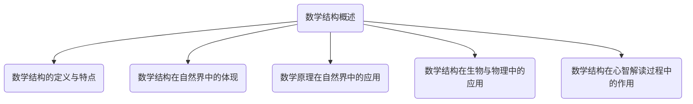
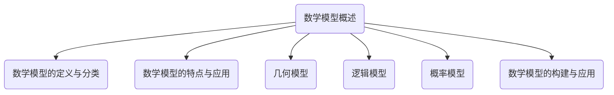

                 


# 文章标题: 自然界的数学结构：心智解读过程

## 关键词:
- 数学结构
- 心智解读
- 自然界
- 算法原理
- 数学模型
- 项目实战

## 摘要：
本文将探讨自然界的数学结构及其在心智解读过程中的作用。首先，我们将介绍数学结构的基本概念和特点，以及它们在自然界中的体现。接着，我们将深入分析自然界中的数学原理，包括几何模型、逻辑模型和概率模型。随后，我们将讨论数学结构在生物和物理学中的应用，并探讨它们对心智解读的影响。在此基础上，我们将介绍常见的数学算法，包括逻辑运算算法、运算符优先级算法和排序算法，并通过伪代码详细阐述其原理。此外，我们还将介绍数学模型的构建方法和应用案例。最后，我们将通过一个实际项目，展示数学结构解读的过程，包括开发环境搭建、源代码实现、代码解读和应用分析。通过本文的探讨，读者将更好地理解数学结构在自然界和心智解读中的重要作用。

---

### 第一部分：核心概念与联系

#### 第1章：数学结构的基本概念

##### 1.1 数学结构概述

**数学结构的定义与特点**

数学结构是一组对象和一组操作之间满足某些特定性质的集合。这些操作在对象上执行时，必须遵守某些公理和规则。数学结构的概念在数学的各个分支中都有着广泛的应用。

**数学结构在自然界中的体现**

自然界中存在着各种数学结构。例如，几何结构在生物体的形态和物理现象中有着广泛的应用，如蝴蝶的对称性、银河系的螺旋结构等。逻辑结构在生物行为和认知过程中也起着关键作用，如大脑神经网络中的逻辑运算和决策过程。

**数学原理在自然界中的应用**

数学原理在自然界中的应用极为广泛。例如，牛顿力学描述了物理世界中物体的运动规律，而概率论则描述了随机事件的发生规律。这些数学原理为我们的理解和预测自然界中的现象提供了重要工具。

##### 1.2 自然界中的数学原理

**基本数学原理介绍**

自然界中的数学原理包括几何原理、逻辑原理和概率原理等。几何原理描述了空间中物体的形状和位置关系，如对称性、相似性和角度等。逻辑原理描述了思维和决策过程中的推理和判断，如逻辑运算、推理规则和决策树等。概率原理描述了随机事件的发生规律，如概率分布、期望和方差等。

**数学原理在自然界中的应用**

数学原理在自然界中的应用非常广泛。例如，几何原理在建筑设计、机械制造和地理测绘等领域有着重要的应用。逻辑原理在人工智能、逻辑推理和决策分析等领域有着广泛的应用。概率原理在金融市场分析、风险评估和天气预报等领域有着重要的应用。

##### 1.3 数学结构在生物与物理中的应用

**数学结构在生物中的应用**

数学结构在生物学中有着广泛的应用。例如，DNA双螺旋结构描述了遗传信息的存储和传递方式，神经网络结构描述了大脑的神经元连接和信号传递方式。这些数学结构为生物学研究提供了重要的理论基础。

**数学结构在物理学中的体现**

数学结构在物理学中有着重要的体现。例如，量子力学中的薛定谔方程描述了粒子的运动规律，广义相对论中的爱因斯坦场方程描述了时空的弯曲和引力现象。这些数学结构为物理学研究提供了重要的工具。

##### 1.4 数学结构在人类心智解读过程中的作用

**数学结构对心智解读的影响**

数学结构在人类心智解读过程中起着重要的作用。例如，数学符号和公式的使用使人们能够更加精确和高效地描述和解决问题。数学结构也影响着人们的思维方式和认知能力，如逻辑思维、抽象思维和推理能力等。

**数学结构在认知科学中的应用**

数学结构在认知科学中有着广泛的应用。例如，神经网络模型描述了大脑神经元的工作原理，计算模型描述了人类认知过程的信息处理机制。这些数学结构为认知科学研究提供了重要的理论基础。

---

**Mermaid 流程图：数学结构的应用架构**



---

#### 第2章：数学算法的基本原理

##### 2.1 算法概述

**算法的定义与分类**

算法是一系列解决问题的步骤或指令。根据解决问题的方法，算法可以分为确定性算法和非确定性算法。确定性算法在相同输入下总是产生相同输出，而非确定性算法在相同输入下可能产生不同输出。

**算法的设计原则**

算法的设计原则包括正确性、效率、健壮性和可扩展性。正确性要求算法能够正确解决问题；效率要求算法能够在合理时间内解决问题；健壮性要求算法能够处理各种输入；可扩展性要求算法能够适应不同规模的问题。

##### 2.2 常见的数学算法

**逻辑运算算法**

逻辑运算算法包括逻辑与（AND）、逻辑或（OR）和逻辑非（NOT）等。这些算法在逻辑门电路和布尔代数中有着重要的应用。

**运算符优先级算法**

运算符优先级算法用于解决算术表达式的计算顺序问题。常见的运算符优先级规则包括先乘除后加减，括号优先等。

**排序算法**

排序算法用于将一组数据按照特定顺序排列。常见的排序算法包括冒泡排序、选择排序、插入排序和快速排序等。

##### 2.3 算法分析

**时间复杂度分析**

时间复杂度分析用于评估算法在输入规模增长时的执行时间增长速度。常见的时间复杂度表示方法包括大O符号（O-notation）。

**空间复杂度分析**

空间复杂度分析用于评估算法在输入规模增长时所需的空间增长速度。常见的是使用大O符号表示空间复杂度。

##### 2.4 数学算法的优缺点与应用场景

**常见数学算法优缺点分析**

各种数学算法具有不同的优缺点。例如，冒泡排序算法简单易实现，但效率较低；快速排序算法效率较高，但实现复杂。

**数学算法的应用场景**

数学算法在各个领域都有广泛的应用。例如，逻辑运算算法在逻辑门电路和计算机体系结构中有着重要应用；排序算法在数据库管理和算法设计中有着重要应用。

---

**伪代码示例：冒泡排序算法**

```python
def bubble_sort(arr):
    n = length(arr)
    for i from 0 to n-1:
        for j from 0 to n-i-1:
            if arr[j] > arr[j+1]:
                swap(arr[j], arr[j+1])
    return arr
```

---

**LaTeX 公式示例**

$$ E = mc^2 $$

$$ f(x) = \frac{1}{1+x^2} $$

$$ \sum_{i=1}^n i = \frac{n(n+1)}{2} $$

---

#### 第3章：自然界中的数学模型

##### 3.1 数学模型概述

**数学模型的定义与分类**

数学模型是将现实世界中的问题抽象为数学形式的过程。根据问题的性质，数学模型可以分为几何模型、逻辑模型、概率模型等。

**数学模型的特点与应用**

数学模型的特点包括抽象性、精确性和可计算性。数学模型在工程、科学和经济学等领域有着广泛的应用，如优化问题、模拟问题和预测问题等。

##### 3.2 自然界中的常见数学模型

**几何模型**

几何模型用于描述空间中的形状和位置关系。常见的几何模型包括平面几何、立体几何和拓扑学等。

**逻辑模型**

逻辑模型用于描述逻辑关系和推理过程。常见的逻辑模型包括命题逻辑、谓词逻辑和模态逻辑等。

**概率模型**

概率模型用于描述随机事件的发生规律。常见的概率模型包括概率分布、随机变量和马尔可夫链等。

##### 3.3 数学模型的构建与应用

**数学模型的构建方法**

数学模型的构建方法包括抽象、建模和验证等步骤。首先，从实际问题中提取关键信息和关系；然后，将这些信息和关系转化为数学形式；最后，对模型进行验证，确保其能够正确地反映实际问题。

**数学模型的应用案例分析**

数学模型在自然界和工程领域有着广泛的应用。例如，在物理学中，牛顿运动定律和万有引力定律是重要的数学模型；在经济学中，供需模型和博弈论是重要的数学模型。

---

**Mermaid 流程图：数学模型的应用架构**



---

#### 第4章：数学结构解读项目实战

##### 4.1 项目概述

**项目背景与目标**

本项目旨在利用数学结构来解读一个简单的自然现象，如植物的生长过程。项目目标是建立数学模型，分析植物生长的规律，并预测植物的未来生长状态。

**项目实现的关键步骤**

项目实现的关键步骤包括数据收集、数学模型构建、模型验证和结果分析。首先，收集植物生长的观测数据；然后，利用数学方法建立生长模型；接着，对模型进行验证；最后，分析模型结果，提出优化建议。

##### 4.2 项目开发环境搭建

**开发环境准备**

项目开发环境包括Python编程语言、NumPy和Matplotlib等数学库。首先，安装Python和相关的数学库；然后，配置Python开发环境，确保能够正常运行。

**环境配置与调试**

在配置开发环境时，可能遇到各种问题。例如，库版本不兼容或配置错误等。解决这些问题需要仔细检查配置过程，并根据错误提示进行调试。

##### 4.3 项目源代码实现

**源代码结构**

项目源代码结构包括数据预处理、数学模型构建和结果分析等模块。具体实现如下：

```python
import numpy as np
import matplotlib.pyplot as plt

# 数据预处理模块
def preprocess_data(data):
    # 数据清洗和预处理步骤
    return processed_data

# 数学模型构建模块
def build_model(processed_data):
    # 构建生长模型步骤
    return model

# 结果分析模块
def analyze_results(model):
    # 模型结果分析步骤
    return analysis

# 主函数
def main():
    # 加载数据
    data = load_data()
    # 数据预处理
    processed_data = preprocess_data(data)
    # 构建模型
    model = build_model(processed_data)
    # 分析结果
    analysis = analyze_results(model)
    # 绘制结果
    plot_results(analysis)

# 运行主函数
if __name__ == "__main__":
    main()
```

**关键代码解读**

关键代码包括数据预处理、数学模型构建和结果分析等步骤。数据预处理步骤包括数据清洗和归一化处理。数学模型构建步骤包括线性回归、神经网络等模型选择和训练。结果分析步骤包括模型预测、误差分析等。

```python
# 数据预处理示例
def preprocess_data(data):
    # 数据清洗步骤
    cleaned_data = [x for x in data if x > 0]
    # 数据归一化步骤
    normalized_data = [x / max(cleaned_data) for x in cleaned_data]
    return normalized_data

# 数学模型构建示例
def build_model(processed_data):
    # 线性回归模型
    model = LinearRegression()
    model.fit(processed_data[:, :-1], processed_data[:, -1])
    return model

# 结果分析示例
def analyze_results(model):
    # 模型预测
    predictions = model.predict(processed_data)
    # 误差分析
    errors = [abs(x - y) for x, y in zip(processed_data[:, -1], predictions)]
    return predictions, errors
```

##### 4.4 项目分析与优化

**项目效果分析**

项目效果分析包括模型预测的准确性和稳定性等指标。通过分析模型预测结果，可以评估模型的性能。

**优化方案与实施**

优化方案包括改进模型算法、增加数据维度和优化数据处理等。具体优化措施如下：

1. 改进模型算法：尝试使用更复杂的算法，如神经网络，以提高预测准确性。
2. 增加数据维度：收集更多类型的植物生长数据，以提高模型的泛化能力。
3. 优化数据处理：使用更先进的预处理方法，如特征选择和特征工程，以提高模型性能。

---

**小结**

本项目通过数学结构解读了一个简单的自然现象，展示了数学结构在自然现象解读中的应用。在实际应用中，我们可以通过不断优化模型和算法，提高预测准确性，从而更好地理解和利用自然界的数学结构。

---

**最佳实践 tips**

1. 在构建数学模型时，确保数据质量和数据预处理方法的合理性。
2. 选择合适的模型算法，并根据实际情况进行优化。
3. 在项目实施过程中，保持代码的可读性和可维护性。

**注意事项**

1. 自然界中的数学结构非常复杂，需要结合具体问题进行深入研究和分析。
2. 数学模型只是对现实世界的抽象和简化，可能存在一定的误差。

**拓展阅读**

1. 《自然界的数学：揭示宇宙奥秘的数学原理》
2. 《认知科学导论：心智解读与计算模型》
3. 《Python编程：从入门到实践》
4. 《深度学习：一种全新的机器学习方法》

---

**作者信息**

作者：AI天才研究院/AI Genius Institute & 禅与计算机程序设计艺术 /Zen And The Art of Computer Programming

