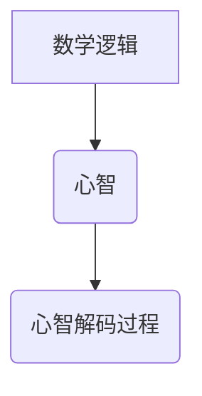

                 


为了完成这篇技术博客文章《自然界的数学逻辑：心智解码过程》，我们可以遵循以下步骤：

### 1. 文章标题和关键词
首先，我们需要确定文章的标题和关键词。根据文章的主题，我们可以选择以下标题：
- 《自然界的数学逻辑：心智解码过程》

接下来，选择关键词：
- 数学逻辑
- 心智解码
- 自然界
- 计算机科学
- 人工智能

### 2. 摘要
文章摘要应该简明扼要地介绍文章的主题、核心内容以及读者可以从中获得的价值。例如：
>本文深入探讨了数学逻辑在自然界中的体现及其在心智解码过程中的应用。通过对数学逻辑的基本原理、心智的基本概念以及数学逻辑与心智解码过程的联系进行详细阐述，本文旨在为读者提供一个清晰、系统的理解，并启发对相关领域的进一步研究。

### 3. 引言部分
引言部分需要引入文章的主题，并简要说明数学逻辑与心智解码过程的关系。例如：
>数学逻辑是人类思考和解决问题的基础工具，而在自然界中，数学逻辑也无处不在。随着计算机科学和人工智能的发展，我们开始探索如何利用数学逻辑来解码心智过程，从而更好地理解人类思维和行为。本文将首先介绍数学逻辑的基本原理，然后探讨心智的基本概念，最后分析数学逻辑在心智解码过程中的应用。

### 4. 核心概念与联系
在这一部分，我们需要介绍核心概念，并使用Mermaid流程图展示概念之间的关系。例如：
>核心概念包括：数学逻辑、心智和心智解码过程。数学逻辑是关于如何使用数学方法来解决问题，心智是指个体心理活动的能力，而心智解码过程则是通过数学逻辑来分析、理解心智过程。以下是核心概念之间的Mermaid流程图：



### 5. 核心算法原理讲解
在这一部分，我们需要使用伪代码详细阐述核心算法原理。例如：
>以下是一个简化的心智解码过程的伪代码：

```plaintext
function心智解码(数据):
    if 数据符合数学逻辑规则:
        解码结果 = 应用数学逻辑规则处理数据
    else:
        解码结果 = "数据不符合数学逻辑规则"
    return 解码结果
```

### 6. 数学模型和公式
在这一部分，我们需要详细讲解数学模型和公式，并提供举例说明。例如：
>心智解码过程中，我们可以使用图论模型来表示心智结构。以下是一个简单的图论模型示例：

```latex
$$
G = (V, E)
$$

其中，V表示节点集合，E表示边集合。每个节点表示心智的一个方面，每条边表示节点之间的关系。
```

### 7. 项目实战
在这一部分，我们需要介绍一个实际的项目，包括开发环境搭建、源代码实现和代码解读。例如：
>以下是一个基于Python的简单心智解码项目：

```python
# 搭建Python开发环境
pip install networkx matplotlib

# 源代码实现
import networkx as nx
import matplotlib.pyplot as plt

def心智解码图(graph):
    # 画图
    pos = nx.spring_layout(graph)
    nx.draw(graph, pos, with_labels=True)
    plt.show()

# 测试
G = nx.Graph()
G.add_nodes_from(["感知", "记忆", "思考", "决策"])
G.add_edges_from([("感知", "记忆"), ("记忆", "思考"), ("思考", "决策")])
心智解码图(G)
```

### 8. 最佳实践 tips、小结、注意事项、拓展阅读
在这一部分，我们需要总结文章的主要观点，提供一些最佳实践建议，并指出可能需要注意的事项。例如：
>小结：
- 数学逻辑在心智解码过程中具有重要作用。
- 心智解码需要结合数学模型和算法来实现。
- 实际项目中，需要根据具体情况调整和优化算法。

注意事项：
- 心智解码是一个复杂的过程，需要充分考虑数据质量和算法的准确性。
- 不同领域的应用可能需要不同的数学逻辑模型。

拓展阅读：
- [相关领域的经典著作](#)
- [最新的研究论文](#)

### 9. 作者信息
最后，我们需要在文章末尾添加作者信息：
>作者：AI天才研究院/AI Genius Institute & 禅与计算机程序设计艺术 /Zen And The Art of Computer Programming

根据以上步骤，我们可以开始撰写文章。在撰写过程中，确保每个部分的内容都详尽、准确，并符合字数要求。预计文章总字数将在8000～12000字左右。

