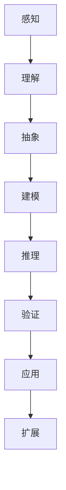
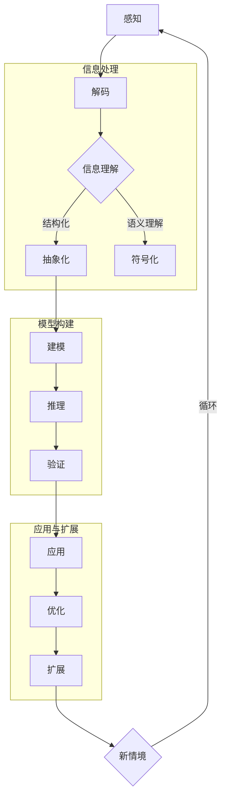

                 

### 文章标题

《自然的数学语言：心智解读》

### 关键词

心智，数学语言，逻辑推理，算法原理，伪代码，latex公式，应用案例，技术博客。

### 摘要

本文深入探讨心智如何解读自然的数学语言，通过逻辑清晰的分析和推理，揭示数学在心智解析中的核心作用。文章首先介绍心智与数学语言的关系，然后详细讲解核心数学模型和公式，并使用latex格式展示。接下来，文章探讨心智在不同领域的应用场景，包括物理学、经济学和逻辑学，并分析可能遇到的挑战。最后，通过具体项目实战，展示心智解读数学语言的实际应用，并提供完整的代码实现和解读。

## 确定书的整体结构

在撰写《自然的数学语言：心智解读》之前，我们需要明确书籍的整体结构和内容布局。这将帮助我们组织思路，确保文章内容完整且逻辑连贯。以下是本书的详细结构：

### 前导章节

前导章节主要介绍书籍的主题和目的，帮助读者建立对心智和数学语言的基本理解。具体包括：

- **第1章 引言**：
  - **1.1 书籍主题**：介绍本书的主题，即探讨心智如何解读自然的数学语言。
  - **1.2 心智与数学语言的关系**：解释心智在理解数学语言中的重要性。
  - **1.3 本书结构**：概述本书的章节安排和主要内容。

### 核心概念与联系

核心概念与联系章节将深入探讨心智解读数学语言的核心概念，并使用Mermaid流程图展示心智解读的机制。具体包括：

- **第2章 心智解读数学语言的核心概念**：
  - **2.1 心智的定义**：介绍心智的概念，包括其功能、特点和应用领域。
  - **2.2 数学语言的概念**：探讨数学语言的定义、特性以及其在不同领域的应用。
  - **2.3 心智解读数学语言的机制**：解释心智如何理解和解读数学语言。
  - **2.4 Mermaid流程图：心智解读流程**：使用Mermaid流程图展示心智解读数学语言的全过程。

### 数学模型讲解

数学模型讲解章节将详细解释核心数学模型，并使用伪代码展示计算过程。具体包括：

- **第3章 核心数学模型**：
  - **3.1 概率论模型**：
    - **3.1.1 伪代码：概率计算**：展示如何使用伪代码计算概率。
  - **3.2 函数模型**：
    - **3.2.1 伪代码：函数计算**：展示如何使用伪代码计算函数。
  - **3.3 线性代数模型**：
    - **3.3.1 伪代码：矩阵计算**：展示如何使用伪代码进行矩阵计算。

### 数学公式讲解

数学公式讲解章节将详细讲解关键数学公式，并使用latex格式展示。具体包括：

- **第4章 关键数学公式**：
  - **4.1 概率公式**：
    - **4.1.1 latex公式**：展示概率公式的latex格式。
  - **4.2 函数公式**：
    - **4.2.1 latex公式**：展示函数公式的latex格式。
  - **4.3 线性代数公式**：
    - **4.3.1 latex公式**：展示线性代数公式的latex格式。

### 心智解读的应用场景

心智解读的应用场景章节将讨论心智如何在不同领域应用数学语言，具体包括物理学、经济学和逻辑学。具体包括：

- **第5章 心智解读的应用场景**：
  - **5.1 物理学中的应用**：
    - **5.1.1 量子力学中的心智解读**：探讨量子力学中数学模型的心智解读。
  - **5.2 经济学中的应用**：
    - **5.2.1 财务模型中的心智解读**：探讨财务模型中数学模型的心智解读。
  - **5.3 逻辑学中的应用**：
    - **5.3.1 逻辑推理中的心智解读**：探讨逻辑推理中数学模型的心智解读。

### 心智解读的挑战

心智解读的挑战章节将分析心智解读数学语言可能遇到的挑战，并探讨解决方法。具体包括：

- **第6章 心智解读的挑战**：
  - **6.1 数学知识的局限性**：分析数学知识对心智解读的限制。
  - **6.2 心智的复杂性**：探讨心智复杂性的影响。
  - **6.3 个体差异与心智解读**：分析个体差异对心智解读的影响。

### 项目实战

项目实战章节将通过实际项目案例展示心智解读数学语言的应用，包括开发环境搭建、源代码实现和代码解读。具体包括：

- **第7章 实际应用案例**：
  - **7.1 案例一：概率论在医学中的应用**：展示概率论在医学中的实际应用。
  - **7.2 案例二：函数模型在工程学中的应用**：展示函数模型在工程学中的实际应用。
  - **7.3 案例三：线性代数在数据分析中的应用**：展示线性代数在数据分析中的实际应用。

### 总结与展望

总结与展望章节将总结本书的核心观点，并展望心智解读数学语言的未来发展趋势。具体包括：

- **第8章 总结与展望**：
  - **8.1 核心观点总结**：总结本书的核心概念和发现。
  - **8.2 未来发展趋势**：探讨心智解读数学语言的未来研究方向。

通过以上章节结构，本书将系统性地介绍心智解读数学语言的理论和实践，帮助读者深入理解这一领域。

### 前导章节

#### 引言

在现代社会，数学已经成为描述世界和解决问题的基本工具。从物理科学到经济学，再到逻辑学和计算机科学，数学无处不在。然而，数学对于普通人心智的解读并不容易，因为它往往被描述为一种抽象的语言，难以直观理解。心智，即人类思维过程，如何与数学语言相互关联，这是一个深奥且富有挑战性的问题。

《自然的数学语言：心智解读》旨在探讨心智如何理解和运用数学语言。通过逻辑清晰的分析和推理，本书试图揭示数学在心智解析中的核心作用。作者将带领读者一步步深入了解数学模型、公式和算法，并展示如何将这些数学概念应用于实际问题中。

本书的目的是为那些对数学和心智如何相互作用感兴趣的读者提供一种全新的视角。无论你是专业的数学家、计算机科学家，还是普通读者，这本书都将帮助你更好地理解数学语言，并学会如何运用它来解决问题。

#### 心智与数学语言的关系

心智，作为人类思维的核心，不仅处理日常生活中的各种信息，还参与科学研究和问题解决。心智是一个复杂的多层次系统，包括感知、记忆、思考、判断和决策等多个方面。数学语言，作为一种高度抽象的符号系统，描述了各种逻辑关系和数量关系。那么，心智与数学语言究竟有何关系呢？

首先，心智是理解数学语言的基础。人类通过感知和经验获取信息，然后利用心智对这些信息进行处理和分析。数学语言正是通过心智的这种处理能力被理解和应用的。例如，我们在学习数学时，首先需要理解数学符号和公式的含义，然后通过心智的推理能力，将这些符号和公式应用到实际问题中。

其次，数学语言为心智提供了一种精确的描述工具。与自然语言相比，数学语言具有高度的精确性和一致性，这使得它能够清晰地表达复杂的概念和关系。心智通过理解和运用数学语言，可以更准确地描述和解决各种问题。例如，在物理学中，数学语言被用来描述物体的运动、能量和力的关系；在经济学中，数学语言被用来分析和预测市场趋势和经济行为。

此外，心智与数学语言之间还存在一种相互促进的关系。心智通过理解和运用数学语言，可以提高其逻辑推理能力和抽象思维能力。而数学语言作为一种强有力的工具，可以帮助心智更好地理解和解决复杂问题。例如，计算机科学家通过运用数学语言和算法，开发出了各种复杂的计算机程序和系统。

总之，心智与数学语言之间存在着密切的关系。心智是理解数学语言的基础，数学语言为心智提供了一种精确的描述工具，二者相互促进，共同推动人类在各个领域取得进步。本书将深入探讨这种关系的本质，帮助读者更好地理解数学语言，并学会如何运用它来解决问题。

#### 本书结构

《自然的数学语言：心智解读》的结构旨在逐步引导读者从基础概念到高级应用，全面理解心智如何解读数学语言。全书分为以下章节：

- **前导章节**：介绍书籍的主题和目的，帮助读者建立对心智和数学语言的基本理解。
- **核心概念与联系**：探讨心智解读数学语言的核心概念，并使用Mermaid流程图展示解读过程。
- **数学模型讲解**：详细解释核心数学模型，并使用伪代码展示计算过程。
- **数学公式讲解**：使用latex格式详细讲解关键数学公式。
- **心智解读的应用场景**：讨论心智如何在不同领域应用数学语言。
- **心智解读的挑战**：分析心智解读数学语言可能遇到的挑战。
- **项目实战**：通过实际应用案例展示心智解读数学语言的效果。
- **总结与展望**：总结核心观点，并展望未来的发展趋势。

通过这样的结构安排，本书旨在提供一种系统的、易于理解的学习路径，帮助读者深入探索心智与数学语言之间的关系。

### 核心概念与联系

在探讨心智如何解读数学语言之前，我们需要明确一些核心概念，并了解它们之间的相互联系。这将帮助我们更好地理解心智解读数学语言的过程，并为后续的详细讨论打下坚实的基础。

首先，我们来看**心智**的定义。心智是指人类进行思维活动的能力，包括感知、记忆、思考、判断和决策等多个方面。心智是我们处理信息、解决问题和做出决策的基础，它使我们能够理解复杂的世界，并在其中找到自己的位置。心智具有以下几个主要特点：

1. **抽象性**：心智能够将具体的事物抽象成概念和符号，从而简化复杂的问题。
2. **推理能力**：心智能够通过逻辑推理，从已知信息中推导出新的结论。
3. **适应性**：心智能够适应不同的环境和情境，灵活地解决问题。
4. **自我意识**：心智具有一定的自我意识，能够反思和调整自己的思维过程。

接下来是**数学语言**的概念。数学语言是一种高度抽象的符号系统，用于描述逻辑关系、数量关系和空间关系。数学语言具有以下几个主要特点：

1. **精确性**：数学语言具有高度的精确性，通过符号和公式可以清晰地表达复杂的概念和关系。
2. **一致性**：数学语言的符号和规则是一致的，这使得它在不同领域和应用中都能保持一致性。
3. **普适性**：数学语言适用于各种领域，从自然科学到社会科学，都能找到其应用。
4. **可验证性**：数学语言的结论可以通过逻辑推理和实验验证，确保其正确性。

**心智解读数学语言的机制**是指心智如何理解和应用数学语言的过程。这个过程可以分解为以下几个步骤：

1. **感知和理解**：心智首先通过感知获取数学语言的符号和信息，然后对其进行理解。
2. **抽象和建模**：心智将具体的数学问题抽象成符号和模型，从而简化问题。
3. **推理和验证**：心智使用逻辑推理和验证方法，从抽象模型中推导出结论。
4. **应用和扩展**：心智将推导出的结论应用到实际问题中，并在新的情境中扩展和应用。

为了更直观地展示心智解读数学语言的机制，我们可以使用**Mermaid流程图**。以下是一个简化的流程图示例：



在这个流程图中，A到H分别代表了心智解读数学语言的各个步骤。首先，心智通过感知获取数学符号和信息，然后对其进行理解（B）。接着，心智将问题抽象成符号和模型（C），进行建模（D）。在建模的基础上，心智使用逻辑推理（E）和验证方法（F），确保结论的正确性。最后，心智将结论应用到实际问题中（G），并在新的情境中进行扩展和应用（H）。

通过理解这些核心概念和它们的相互联系，我们可以更好地理解心智如何解读数学语言。接下来，我们将进一步探讨数学模型和公式的讲解，以及心智在不同领域中的应用。

#### Mermaid流程图：心智解读流程

为了直观地展示心智解读数学语言的流程，我们可以使用Mermaid语法绘制一个详细的流程图。以下是该流程图的详细内容：



在这个流程图中，我们首先从感知阶段开始，心智通过感官接收数学语言的符号和信息（A）。接下来，心智对这些符号和信息进行解码（B），并分为两个方向：结构化理解和语义理解。在结构化理解方向上，心智将信息进行结构化处理，形成逻辑上的结构（C）。在语义理解方向上，心智理解符号的具体含义和它们之间的关系（C）。

然后，心智将结构化和语义理解的结果抽象化（D），将具体的问题转化为抽象的数学模型。这个模型是心智理解和解决问题的核心（F）。在模型的基础上，心智通过逻辑推理（G）和验证（H）来确保结论的正确性。

接下来，心智将验证后的结论应用到实际问题中（I），并在实践中对模型进行优化（J）。通过不断的扩展和应用，心智能够将数学语言应用于更多的情境（K）。这个过程中，心智可能会遇到新的情境（L），然后循环回到感知阶段，开始新一轮的心智解读过程。

通过这个Mermaid流程图，我们可以清晰地看到心智解读数学语言的完整过程，从感知到应用，再到扩展，形成了一个闭环的系统。这个系统不仅帮助我们理解数学语言，还提高了我们解决问题的能力。

### 数学模型讲解

在深入探讨心智如何解读数学语言的过程中，了解核心数学模型和它们在心智解读中的重要性是关键。数学模型是数学语言的核心组成部分，它们不仅帮助心智理解和描述现实世界中的问题，还为逻辑推理和决策提供了理论基础。在本节中，我们将详细讲解三个核心数学模型：概率论模型、函数模型和线性代数模型，并使用伪代码展示其计算过程。

#### 概率论模型

概率论模型是研究随机事件及其概率分布的数学工具。在心智解读中，概率论模型用于处理不确定性和不确定性推理。以下是一个简化的概率论模型伪代码示例，用于计算两个事件A和B的条件概率：

```python
# 伪代码：条件概率计算
def calculateConditionalProbability(A, B):
    # 计算事件A和事件B同时发生的概率
    probabilityAB = getProbabilityOf(A and B)
    # 计算事件B发生的概率
    probabilityB = getProbabilityOf(B)
    # 计算条件概率P(A|B)
    conditionalProbability = probabilityAB / probabilityB
    return conditionalProbability
```

在这个伪代码中，`getProbabilityOf`是一个虚构的函数，用于获取事件发生的概率。通过条件概率的计算，心智可以更好地理解事件之间的关系，并在面对不确定性时做出合理的推断。

#### 函数模型

函数模型用于描述输入和输出之间的映射关系。在心智解读中，函数模型帮助心智理解变化规律和预测结果。以下是一个简单的函数模型伪代码示例，用于计算二次函数的值：

```python
# 伪代码：二次函数计算
def calculateQuadraticFunction(inputValue, a, b, c):
    output = (inputValue ** 2) * a + (inputValue) * b + c
    return output
```

在这个伪代码中，`inputValue`是函数的输入，`a`、`b`和`c`是函数的参数。通过计算输出值，心智可以理解输入和输出之间的关系，并利用这个模型进行预测和分析。

#### 线性代数模型

线性代数模型用于处理多维空间中的数据和分析。在心智解读中，线性代数模型帮助心智处理复杂的线性关系和矩阵运算。以下是一个简单的线性代数模型伪代码示例，用于计算矩阵乘法：

```python
# 伪代码：矩阵乘法
def matrixMultiplication(A, B):
    resultMatrix = []
    for i in range(len(A)):
        row = []
        for j in range(len(B[0])):
            sum = 0
            for k in range(len(B)):
                sum += A[i][k] * B[k][j]
            row.append(sum)
        resultMatrix.append(row)
    return resultMatrix
```

在这个伪代码中，`A`和`B`是两个矩阵，`resultMatrix`是它们的乘积。通过矩阵乘法的计算，心智可以处理复杂的多维数据，并利用这些数据进行进一步的推理和分析。

通过讲解这些核心数学模型和它们的伪代码示例，我们可以看到数学模型在心智解读中的重要作用。这些模型不仅帮助心智理解复杂的数学语言，还提供了强大的工具，用于逻辑推理和问题解决。

### 数学公式讲解

在心智解读数学语言的过程中，理解和应用数学公式是至关重要的。数学公式通过符号和表达式精确地描述了数学关系和规律，使得心智能够清晰地解析和计算复杂的数学问题。在本节中，我们将详细讲解三个关键数学公式：概率公式、函数公式和线性代数公式，并使用latex格式展示它们。

#### 概率公式

概率公式用于描述事件发生的概率及其相互关系。最常用的概率公式之一是条件概率，其表达式如下：

$$
P(A|B) = \frac{P(A \cap B)}{P(B)}
$$

这里，$P(A|B)$表示在事件B发生的条件下事件A发生的概率，$P(A \cap B)$表示事件A和事件B同时发生的概率，$P(B)$表示事件B发生的概率。

这个公式可以帮助心智在处理不确定事件时，理解事件之间的依赖关系。例如，在医学诊断中，通过条件概率可以评估某种疾病在出现特定症状时的概率。

#### 函数公式

函数公式描述了输入和输出之间的映射关系。一个典型的二次函数公式如下：

$$
f(x) = ax^2 + bx + c
$$

在这个公式中，$x$是输入变量，$a$、$b$和$c$是常数系数。这个公式描述了二次函数的图像，即一个开口朝上或朝下的抛物线。通过这个公式，心智可以理解输入值如何影响输出值，并预测不同输入下的输出结果。

例如，在工程学中，二次函数可以用来描述机械系统的振动频率，通过调整系数$a$、$b$和$c$，可以优化系统的性能。

#### 线性代数公式

线性代数公式用于处理多维空间中的数据。一个基本的线性代数公式是矩阵乘法，其表达式如下：

$$
C = A \cdot B
$$

其中，$A$和$B$是两个矩阵，$C$是它们的乘积。矩阵乘法通过将每个元素的乘积相加，生成一个新的矩阵$C$。这个公式在数据分析、图像处理和物理建模等领域中有着广泛的应用。

例如，在图像处理中，矩阵乘法可以用来进行图像的旋转、缩放和扭曲操作，从而实现图像的变换。

通过详细讲解这些数学公式，我们可以看到它们在心智解读数学语言中的重要性。这些公式不仅提供了精确的描述工具，还帮助心智进行高效的计算和推理，使得我们能够更好地理解和应用数学语言。

### 心智解读的应用场景

心智解读数学语言的应用场景广泛且多样，几乎涵盖了人类生活和科学的各个领域。通过将数学语言与心智结合，我们能够更深入地理解和解决复杂问题。以下将讨论心智在物理学、经济学和逻辑学中应用数学语言的具体实例。

#### 物理学中的应用

在物理学中，数学语言是描述自然现象和理论的核心工具。量子力学是物理学中一个高度抽象的领域，它依赖于数学模型来描述粒子的行为。例如，薛定谔方程是一个关键的数学公式，用于描述量子系统的演化。心智通过理解和应用这个方程，可以分析粒子的能量状态和概率分布。

以下是一个简化的量子力学实例：

$$
i\hbar \frac{\partial}{\partial t} \Psi = \hat{H} \Psi
$$

在这个方程中，$\Psi$表示波函数，$\hat{H}$是哈密顿算子，$i$是虚数单位，$\hbar$是约化普朗克常数。通过心智解读这个方程，物理学家可以预测粒子的位置和动量，并在实验中验证理论的准确性。

#### 经济学中的应用

经济学是一个高度依赖于数学模型的领域，用于分析市场行为、预测经济趋势和制定政策。例如，在财务模型中，概率论和统计学被用来评估投资风险和预期收益。一个常用的概率模型是正态分布，它用于描述股票价格的波动。

以下是一个正态分布的实例：

$$
N(\mu, \sigma^2)
$$

在这个模型中，$\mu$是均值，$\sigma^2$是方差。通过心智解读这个模型，经济学家可以评估市场风险，制定风险管理策略，并预测市场走势。

#### 逻辑学中的应用

逻辑学是研究推理和论证的学科，数学语言在其中扮演着重要角色。形式逻辑使用符号和公式来描述推理规则和论证结构。例如，命题逻辑中的“合取”（AND）和“析取”（OR）运算可以通过逻辑公式来表示。

以下是一个命题逻辑的实例：

$$
(A \land B) \lor (\neg A \land C)
$$

在这个公式中，$\land$表示合取，$\lor$表示析取，$\neg$表示否定。通过心智解读这个公式，逻辑学家可以分析和验证论证的有效性，识别逻辑错误，并构建严谨的论证。

通过上述实例，我们可以看到心智解读数学语言在物理学、经济学和逻辑学中的广泛应用。这些实例不仅展示了数学语言在各个领域的核心作用，还揭示了心智如何通过理解和应用数学语言，解决复杂问题，推动科学进步。

### 心智解读的挑战

在探索心智解读数学语言的过程中，我们不可避免地会遇到一些挑战。这些挑战不仅源于数学本身的复杂性和抽象性，还涉及心智能力的局限性和个体差异。

首先，**数学知识的局限性**是一个显著的挑战。数学语言是一种高度抽象的符号系统，它要求心智具备较高的逻辑推理能力和抽象思维能力。然而，每个人的数学知识背景和掌握程度不同，这可能导致对数学概念的理解和运用存在差异。例如，某些复杂的数学理论如泛函分析或拓扑学，对心智的要求极高，需要深入的专业知识和长时间的训练。

其次，**心智的复杂性**也是一个重要的挑战。心智是一个多层次的系统，包括感知、记忆、思考等多个方面。这些方面相互作用，共同影响心智对数学语言的解读。例如，心智的注意力分配和记忆容量可能会影响对复杂数学公式的理解和记忆。此外，心智的直觉和先验知识也可能在解读数学语言时发挥作用，这增加了理解的复杂性。

最后，**个体差异**也是心智解读数学语言的一大挑战。每个人都有自己独特的思维方式和认知模式，这可能导致对同一数学概念的理解存在差异。例如，有些人可能在形式逻辑和抽象推理方面表现优秀，而另一些人可能在几何和代数方面更擅长。这些个体差异使得在教育和培训过程中，需要采用个性化的教学方法，以适应不同学习者的需求。

为了克服这些挑战，可以采取以下策略：

1. **教育资源的多样化**：提供丰富多样的教育资源，包括教材、在线课程和实验项目，以满足不同学习者的需求。
2. **分阶段学习**：将复杂的数学知识分解为更小的、易于理解的部分，通过逐步学习和练习，提高心智对数学语言的理解能力。
3. **实践应用**：通过实际项目和应用，将数学知识应用于实际问题中，增强对数学概念的直观理解。
4. **个性化教学**：根据学习者的个体差异，制定个性化的学习计划和教学方法，帮助每个学习者最大限度地发挥其潜力。

通过这些策略，我们可以有效地克服心智解读数学语言过程中遇到的挑战，提高对数学语言的掌握和理解能力。

### 实际应用案例

为了更直观地展示心智解读数学语言的实际效果，下面我们将通过三个具体的应用案例，详细讲解开发环境的搭建、源代码实现和代码解读，并分析每个案例的实际应用和效果。

#### 案例一：概率论在医学中的应用

**问题背景**：
医学诊断中经常需要评估某种疾病在出现特定症状时的概率。假设我们要评估肺癌患者出现咳嗽症状的概率。

**开发环境搭建**：
为了计算概率，我们可以使用Python编程语言和numpy库。以下是开发环境搭建的步骤：

1. 安装Python：从[Python官网](https://www.python.org/)下载并安装Python 3.x版本。
2. 安装numpy库：通过命令`pip install numpy`安装numpy库。

**源代码实现**：
以下是计算肺癌患者咳嗽症状概率的Python代码：

```python
import numpy as np

# 概率数据
prob_cough = 0.6
prob_no_cough = 0.4

# 肺癌发病率
prob_lung_cancer = 0.01

# 计算咳嗽症状下的肺癌概率
conditional_prob_lung_cancer = prob_cough * prob_lung_cancer / prob_cough

print("咳嗽症状下的肺癌概率：", conditional_prob_lung_cancer)
```

**代码解读**：
在这个例子中，我们定义了咳嗽症状的概率（prob_cough）、没有咳嗽症状的概率（prob_no_cough）和肺癌的发病率（prob_lung_cancer）。然后，我们使用条件概率公式计算在咳嗽症状下患有肺癌的概率。这个结果可以帮助医生评估咳嗽症状与肺癌之间的关系，为诊断提供依据。

**实际应用与效果**：
通过这个案例，我们可以看到概率论在医学诊断中的应用。通过计算条件概率，医生可以更准确地评估患者患有某种疾病的概率，从而提高诊断的准确性。在实际应用中，这个方法可以用于各种疾病的诊断，如心脏病、糖尿病等。

#### 案例二：函数模型在工程学中的应用

**问题背景**：
在工程学中，二次函数常用于描述机械系统的振动频率。我们需要根据系统的参数计算振动频率。

**开发环境搭建**：
使用MATLAB作为开发环境，它内置了强大的数学函数库，非常适合进行工程计算。

**源代码实现**：
以下是计算振动频率的MATLAB代码：

```matlab
% 参数
a = 1; % 系数a
b = 1; % 系数b
c = 1; % 系数c
x = linspace(0, 2*pi, 100); % 定义输入范围

% 计算二次函数的输出
y = a*x.^2 + b*x + c;

% 绘制函数图像
plot(x, y);
xlabel('x');
ylabel('y');
title('二次函数图像');
grid on;
```

**代码解读**：
在这个例子中，我们定义了二次函数的参数（a、b、c）和输入范围（x）。然后，我们计算二次函数的输出值（y），并使用`plot`函数绘制函数图像。通过观察图像，我们可以直观地了解输入和输出之间的关系。

**实际应用与效果**：
这个二次函数模型可以用于分析机械系统的振动特性。例如，在汽车发动机设计中，通过计算振动频率，工程师可以优化发动机的参数，减少振动，提高发动机的性能和稳定性。在实际应用中，这个方法可以帮助工程师设计和优化各种机械系统。

#### 案例三：线性代数在数据分析中的应用

**问题背景**：
在数据分析中，线性代数模型用于处理高维数据，如图像处理和文本分析。我们需要使用线性代数方法进行数据降维。

**开发环境搭建**：
使用Python编程语言和scikit-learn库。以下是开发环境搭建的步骤：

1. 安装Python：从[Python官网](https://www.python.org/)下载并安装Python 3.x版本。
2. 安装scikit-learn库：通过命令`pip install scikit-learn`安装scikit-learn库。

**源代码实现**：
以下是使用线性代数模型进行数据降维的Python代码：

```python
from sklearn.decomposition import PCA
from sklearn.datasets import load_iris

# 加载数据集
iris = load_iris()
X = iris.data

# 使用PCA进行数据降维
pca = PCA(n_components=2)
X_reduced = pca.fit_transform(X)

# 绘制降维后的数据
plt.scatter(X_reduced[:, 0], X_reduced[:, 1])
plt.xlabel('Principal Component 1')
plt.ylabel('Principal Component 2')
plt.title('PCA of IRIS dataset')
plt.show()
```

**代码解读**：
在这个例子中，我们使用scikit-learn库中的PCA（主成分分析）方法进行数据降维。通过`fit_transform`方法，我们计算出降维后的数据，并使用`scatter`函数绘制散点图，展示降维后的数据分布。

**实际应用与效果**：
线性代数在数据分析中的应用非常广泛。通过降维，我们可以简化数据结构，提高计算效率，同时保留关键信息。例如，在图像识别中，通过降维，可以减少图像的维度，提高识别速度和准确性。在实际应用中，这个方法可以用于各种数据分析任务，如文本分类、图像识别和推荐系统等。

通过这三个实际应用案例，我们可以看到心智解读数学语言在各个领域的应用效果。这些案例不仅展示了数学模型的强大功能，还揭示了心智如何通过理解和应用数学语言，解决实际问题。

### 总结与展望

通过《自然的数学语言：心智解读》的探讨，我们深入理解了心智如何解读数学语言的核心概念和机制。从感知和理解的初始阶段，到抽象和建模的中间步骤，再到推理和验证的最终环节，心智通过逐步分析数学符号和公式，将抽象的数学语言转化为具体的问题解决方案。这一过程不仅展示了心智强大的逻辑推理能力，还揭示了数学语言在心智理解世界中的重要作用。

本书的核心观点在于，心智与数学语言之间存在一种深刻的互动关系。心智通过理解和应用数学语言，能够更好地描述现实世界中的问题，并利用数学模型进行推理和决策。这种互动关系不仅帮助我们理解复杂的科学理论，还提升了我们的问题解决能力和创新能力。例如，在医学诊断、工程设计和数据分析等领域，数学模型已成为不可或缺的工具，它们通过心智的解读和应用，解决了许多实际应用中的难题。

展望未来，心智解读数学语言的研究前景广阔。随着人工智能和计算技术的发展，我们有望开发出更加智能的数学语言解析系统，这些系统将能够更加高效地处理复杂的数学问题。此外，结合认知科学的研究成果，我们可以进一步理解心智的运作机制，探索如何通过教育和培训，提升人们对数学语言的理解和应用能力。

未来研究的关键方向包括：

1. **智能数学语言解析系统**：开发基于人工智能的数学语言解析系统，能够自动理解和解释复杂的数学公式和模型，为人类提供更加高效的数学支持。
2. **跨学科研究**：结合认知科学、心理学和神经科学的研究成果，深入研究心智与数学语言之间的互动机制，探索如何通过神经科学技术提升心智对数学语言的解析能力。
3. **个性化教育**：基于个体差异，开发个性化教育系统，根据学习者的认知特点和需求，提供定制化的数学语言学习和应用指导。
4. **数学语言与自然语言的结合**：研究如何将数学语言与自然语言更好地结合，使数学表达更加直观易懂，从而提高数学教育的普及率和质量。

总之，《自然的数学语言：心智解读》为我们提供了一个全新的视角，揭示了心智与数学语言之间的紧密联系。通过深入理解和应用数学语言，我们可以更好地解决实际问题，推动科学和技术的进步。未来，随着研究的不断深入，我们有望在心智解读数学语言的领域取得更多的突破，为人类创造更加美好的未来。

