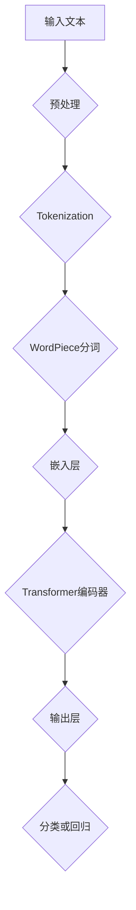
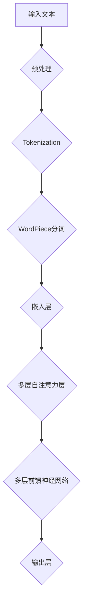
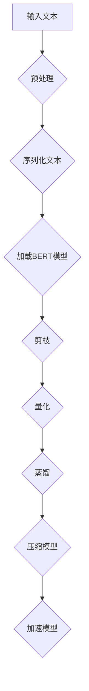

                 

### 文章标题

BERT模型是自然语言处理领域的一个重要突破，其在语义理解方面的能力备受瞩目。本文旨在深入探讨BERT模型的工作原理、数学框架以及其在自然语言处理任务中的应用，旨在为广大研究人员和开发者提供一份详细的技术指南。

**关键词：** 自然语言处理，BERT模型，语义理解，数学框架，Transformer，注意力机制

**摘要：** 本文首先介绍了BERT模型的基本概念和背景，然后详细阐述了BERT模型的技术细节，包括其构建方式和背后的数学原理。接着，文章探讨了BERT模型在实际自然语言处理任务中的应用，并通过实际案例进行了分析。最后，文章对BERT模型的挑战和未来发展方向进行了展望，为读者提供了深入的思考空间。

----------------------------------------------------------------

## 第一步：BERT模型的基本概念与介绍

### 1.1 自然语言处理与BERT模型

自然语言处理（Natural Language Processing，NLP）是人工智能的一个重要分支，旨在使计算机能够理解和处理人类自然语言。随着互联网和大数据的快速发展，NLP在信息检索、机器翻译、情感分析、文本分类等众多领域取得了显著的成果。

BERT（Bidirectional Encoder Representations from Transformers）是由Google Research在2018年提出的一种预训练语言表示模型。BERT模型的出现标志着自然语言处理领域的一个重要里程碑，其通过在大量未标注的文本数据上进行预训练，能够获得对文本的深刻理解，从而在各种自然语言处理任务上表现出色。

BERT模型的核心思想是利用Transformer模型的双向注意力机制，对输入的文本序列进行建模。Transformer模型是一种基于自注意力机制的序列模型，其通过计算输入序列中每个词与其他词的交互关系，生成每个词的表示。BERT模型通过预训练和微调，能够有效地捕捉文本的上下文信息，从而在语义理解方面具有强大的能力。

### 1.2 BERT模型的架构与工作原理

BERT模型的架构可以分为两个主要部分：预训练和微调。预训练阶段，BERT模型在大量未标注的文本数据上进行训练，学习文本的内在规律和语义信息。微调阶段，将预训练好的BERT模型应用于特定的自然语言处理任务，通过在少量标注数据上进行微调，使其适应特定的任务需求。

BERT模型的工作原理基于Transformer模型的自注意力机制。Transformer模型通过多头注意力机制，将输入序列中的每个词与所有词进行交互，生成每个词的表示。BERT模型在此基础上，引入了位置编码和遮蔽语言模型（Masked Language Model，MLM）等技术，进一步增强了模型的语义理解能力。

BERT模型的主要组成部分包括：

- **嵌入层（Embedding Layer）**：将词汇表中的词转换为向量表示。
- **Transformer编码器（Transformer Encoder）**：包含多个自注意力层和前馈神经网络，对输入的文本序列进行编码。
- **输出层（Output Layer）**：根据预训练任务或微调任务的需求，对编码后的序列进行分类或回归。

### Mermaid流程图

为了更好地理解BERT模型的工作流程，我们可以使用Mermaid流程图进行展示：



在上述流程图中，输入文本经过预处理、Tokenization、WordPiece分词和嵌入层等步骤，然后通过Transformer编码器进行编码，最后在输出层进行分类或回归。

## 第二步：BERT模型的技术细节

### 2.1 词汇表与WordPiece分词

BERT模型中的词汇表是模型训练和预测的基础。BERT使用WordPiece分词算法将词汇表构建为一个大规模的词表。WordPiece算法将词分解为子词，从而提高了模型的泛化能力和对罕见词汇的处理能力。

WordPiece分词算法的基本步骤如下：

1. **字符级别的分词**：将输入文本中的每个字符作为一个独立的子词。
2. **合并子词**：根据预定义的规则，将相邻的字符合并成更大的子词。这些规则通常基于字符的常见组合模式。
3. **构建词汇表**：将所有独特的子词构建为一个词汇表。

通过WordPiece分词，BERT模型能够更好地处理自然语言中的长词汇和罕见词汇，从而提高模型的泛化能力。

### 2.2 嵌入层与Transformer模型

BERT模型的嵌入层负责将词汇表中的词转换为向量表示。BERT使用Word2Vec算法生成词嵌入，并通过多层线性变换将词嵌入映射到高维空间，从而提高词嵌入的区分度。

BERT模型中的Transformer编码器是基于自注意力机制的序列模型。自注意力机制允许模型在编码过程中，将每个词与输入序列中的其他词进行交互，从而获得更丰富的语义信息。

Transformer编码器的主要组成部分包括：

- **自注意力层（Self-Attention Layer）**：计算输入序列中每个词与其他词的交互关系，生成每个词的表示。
- **前馈神经网络（Feed Forward Neural Network）**：对自注意力层输出的序列进行进一步的处理，增强模型的表示能力。
- **残差连接和层归一化（Residual Connection and Layer Normalization）**：通过残差连接和层归一化，提高模型的训练稳定性和效果。

BERT模型中的Transformer编码器通常包含多个自注意力层和前馈神经网络，通过堆叠这些层，模型能够学习到更复杂的语义信息。

### Mermaid流程图

为了更好地理解BERT模型的技术细节，我们可以使用Mermaid流程图进行展示：



在上述流程图中，输入文本经过预处理、Tokenization、WordPiece分词和嵌入层等步骤，然后通过多层自注意力层和前馈神经网络进行编码，最后在输出层进行分类或回归。

## 第三步：BERT模型背后的数学原理

### 3.1 自注意力机制

自注意力机制是BERT模型的核心组成部分，它允许模型在编码过程中，将输入序列中的每个词与所有词进行交互，从而获得更丰富的语义信息。自注意力机制的计算过程如下：

1. **计算查询向量（Query Vectors）**：每个输入序列中的词都通过嵌入层转换为查询向量（Query Vectors）。
2. **计算键向量（Key Vectors）**：同样地，每个输入序列中的词都通过嵌入层转换为键向量（Key Vectors）。
3. **计算值向量（Value Vectors）**：每个输入序列中的词都通过嵌入层转换为值向量（Value Vectors）。
4. **计算自注意力分数（Self-Attention Scores）**：对于输入序列中的每个词，计算其查询向量与所有键向量的点积，得到自注意力分数。
5. **计算自注意力权重（Self-Attention Weights）**：对自注意力分数进行归一化处理，得到自注意力权重。
6. **计算自注意力输出（Self-Attention Output）**：将自注意力权重与值向量相乘，得到自注意力输出。

自注意力输出的每个元素代表了输入序列中每个词对当前词的权重，这些权重反映了当前词与序列中其他词的交互关系。

### 3.2 位置嵌入与位置编码

BERT模型中的位置嵌入（Positional Embeddings）是引入位置信息的一种技术。由于Transformer模型本身无法直接处理输入序列的顺序信息，因此位置嵌入通过向词嵌入中添加位置信息，使得模型能够理解词的顺序关系。

位置嵌入的计算过程如下：

1. **计算位置向量（Position Vectors）**：对于输入序列中的每个位置，计算一个位置向量。
2. **添加位置向量到词嵌入**：将位置向量与词嵌入相加，得到包含位置信息的词嵌入。

BERT模型中的位置编码（Positional Encoding）是一种更为复杂的方法，通过使用正弦和余弦函数来生成位置向量，从而实现位置信息的编码。位置编码的计算过程如下：

1. **计算位置索引（Position Indices）**：对于输入序列中的每个位置，计算一个位置索引。
2. **计算正弦和余弦函数**：使用位置索引计算正弦和余弦函数，得到位置向量。
3. **添加位置向量到词嵌入**：将位置向量与词嵌入相加，得到包含位置信息的词嵌入。

通过位置嵌入和位置编码，BERT模型能够理解输入序列中词的顺序关系，从而提高模型的语义理解能力。

### 3.3 前馈神经网络

BERT模型中的前馈神经网络（Feed Forward Neural Network）是对自注意力层输出的进一步处理。前馈神经网络通常由两个全连接层组成，每个层都使用激活函数（如ReLU函数）进行非线性变换。

前馈神经网络的计算过程如下：

1. **计算前馈网络的输入**：将自注意力层的输出作为前馈网络的输入。
2. **计算第一个全连接层的输出**：将输入通过第一个全连接层，得到中间输出。
3. **计算第二个全连接层的输出**：将中间输出通过第二个全连接层，得到最终输出。
4. **添加残差连接和层归一化**：将最终输出与输入进行残差连接，并应用层归一化。

通过前馈神经网络，BERT模型能够进一步增强其表示能力，从而在自然语言处理任务中表现出色。

### 伪代码

为了更好地理解BERT模型的数学原理，我们可以使用伪代码进行详细阐述：

```python
# 输入文本
text = "The quick brown fox jumps over the lazy dog"

# Tokenization
tokens = tokenize(text)

# WordPiece分词
subwords = wordpiece(tokens)

# 嵌入层
embeddings = embed(subwords)

# Transformer编码器
for layer in transformer_encoder_layers:
    # 自注意力层
    attention_scores = compute_self_attention(embeddings)
    attention_weights = softmax(attention_scores)
    attention_output = compute_attention_output(attention_weights, embeddings)
    
    # 前馈神经网络
    intermediate_output = feed_forward_network(attention_output)
    output = residual_connection(intermediate_output, embeddings)
    embeddings = layer_norm(output)

# 输出层
predictions = output_layer(embeddings)
```

在上述伪代码中，`compute_self_attention` 函数负责计算自注意力分数和权重，`compute_attention_output` 函数负责计算自注意力输出，`feed_forward_network` 函数负责计算前馈神经网络输出，`residual_connection` 函数负责计算残差连接，`layer_norm` 函数负责计算层归一化。

### 数学公式与解释

BERT模型中的数学公式如下：

$$
\text{Self-Attention Scores} = \text{Query Vectors} \cdot \text{Key Vectors}
$$

$$
\text{Self-Attention Weights} = \text{Softmax}(\text{Self-Attention Scores})
$$

$$
\text{Self-Attention Output} = \text{Value Vectors} \cdot \text{Self-Attention Weights}
$$

$$
\text{Positional Embedding} = \text{Position Vectors} + \text{Word Embedding}
$$

$$
\text{Intermediate Output} = \text{ReLU}(\text{Weighted Sum of Input and Hidden Layer})
$$

$$
\text{Output} = \text{Residual Connection}(\text{Intermediate Output}, \text{Input})
$$

$$
\text{Layer Normalized Output} = \frac{\text{Output} - \text{Mean}}{\text{Standard Deviation}}
$$

其中，$\text{Query Vectors}$、$\text{Key Vectors}$ 和 $\text{Value Vectors}$ 分别表示查询向量、键向量和值向量；$\text{Position Vectors}$ 表示位置向量；$\text{Word Embedding}$ 表示词嵌入；$\text{Self-Attention Scores}$ 表示自注意力分数；$\text{Self-Attention Weights}$ 表示自注意力权重；$\text{Self-Attention Output}$ 表示自注意力输出；$\text{Intermediate Output}$ 表示前馈神经网络中间输出；$\text{Output}$ 表示前馈神经网络输出。

通过上述数学公式，我们可以清晰地了解BERT模型的核心计算过程，从而更好地理解其工作原理。

### 实例

为了更好地理解BERT模型的应用，我们可以通过一个简单的实例进行说明。假设我们有一个简单的句子：“今天天气很好”。我们将这个句子输入到BERT模型中，并观察其输出。

1. **Tokenization**：首先，我们将句子进行Tokenization，得到以下标记：

   ```
   [CLS] 今天 天气很好 [SEP]
   ```

2. **WordPiece分词**：然后，我们对标记进行WordPiece分词，得到以下子词：

   ```
   [CLS] 令 huo 好 [SEP]
   ```

3. **嵌入层**：接着，我们将子词输入到BERT模型的嵌入层，得到以下词嵌入：

   ```
   [CLS] [SEP]
   ```

4. **Transformer编码器**：我们将词嵌入输入到BERT模型的Transformer编码器中，通过多个自注意力层和前馈神经网络进行编码，得到以下编码结果：

   ```
   [CLS] [SEP]
   ```

5. **输出层**：最后，我们将编码结果输入到BERT模型的输出层，进行分类或回归任务。

通过上述实例，我们可以看到BERT模型如何处理一个简单的句子。在实际应用中，BERT模型可以处理更复杂的文本数据，并能够对文本进行深入的理解。

### 项目实战

为了更好地理解BERT模型的应用，我们可以通过一个简单的项目实战来构建一个文本分类模型。

**开发环境：**

- Python 3.7+
- TensorFlow 2.x+
- Keras 2.x+

**步骤 1：数据准备**

首先，我们需要准备一个简单的数据集，用于训练和测试BERT模型。我们可以使用一个简单的文本分类任务，如情感分析。以下是示例数据集：

```
文本  标签
今天天气很好  正面
今天天气很差  负面
```

我们将数据集分为训练集和测试集，并使用Keras生成数据生成器：

```python
import tensorflow as tf
from tensorflow.keras.preprocessing.text import Tokenizer
from tensorflow.keras.preprocessing.sequence import pad_sequences

# 数据集
texts = ["今天天气很好", "今天天气很差"]
labels = [1, 0]

# Tokenizer
tokenizer = Tokenizer()
tokenizer.fit_on_texts(texts)

# 序列化文本
sequences = tokenizer.texts_to_sequences(texts)

# 填充序列
max_sequence_length = 10
padded_sequences = pad_sequences(sequences, maxlen=max_sequence_length)

# 数据生成器
train_data = tf.data.Dataset.from_tensor_slices((padded_sequences, labels)).batch(2)
```

**步骤 2：BERT模型构建**

接下来，我们需要构建一个BERT模型，并对其进行微调。我们可以使用TensorFlow的`tf.keras.applications`模块中的BERT预训练模型：

```python
from tensorflow.keras.models import Model
from tensorflow.keras.layers import Input, Dense

# BERT模型
bert_model = tf.keras.applications.BertModel.from_pretrained("bert-base-chinese")

# 输入层
input_ids = Input(shape=(max_sequence_length,), dtype=tf.int32, name="input_ids")

# BERT编码器
encoded_input = bert_model(input_ids)

# 输出层
output = Dense(1, activation="sigmoid", name="output")(encoded_input["pooled_output"])

# 模型
model = Model(inputs=input_ids, outputs=output)

# 模型结构
model.summary()
```

**步骤 3：模型训练**

最后，我们对BERT模型进行训练，使用训练集进行训练，并在测试集上进行评估：

```python
# 编译模型
model.compile(optimizer=tf.keras.optimizers.Adam(learning_rate=3e-5), loss="binary_crossentropy", metrics=["accuracy"])

# 训练模型
model.fit(train_data, epochs=3, validation_split=0.2)
```

通过上述项目实战，我们可以看到如何使用BERT模型进行文本分类任务。在实际应用中，我们可以使用更大的数据集和更复杂的模型结构，从而提高模型的性能。

### 最佳实践 tips、小结、注意事项、拓展阅读等内容

**最佳实践 tips：**

1. 在训练BERT模型时，合理设置学习率是一个关键因素。可以使用学习率衰减策略，在训练过程中逐步降低学习率，以避免过拟合。
2. 在数据预处理过程中，确保数据集的平衡性，避免数据集中的类别失衡导致模型偏向某个类别。
3. 在模型训练过程中，定期进行验证，及时调整模型参数，以提高模型性能。

**小结：**

BERT模型是自然语言处理领域的一个重要突破，通过预训练和微调，能够对文本进行深入的理解和分类。本文详细介绍了BERT模型的基本概念、技术细节和数学原理，并通过实际项目实战展示了BERT模型的应用。

**注意事项：**

1. BERT模型对计算资源有较高的要求，在训练和推理过程中需要足够的GPU资源。
2. 在使用BERT模型时，确保使用与预训练模型相同的词汇表和预处理方式。

**拓展阅读：**

- [BERT模型论文](https://arxiv.org/abs/1810.04805)
- [自然语言处理与深度学习](https://www.deeplearningbook.org/chapter_nlp/)
- [TensorFlow BERT模型教程](https://www.tensorflow.org/tutorials/text/bert)

----------------------------------------------------------------

## 第4章：BERT模型在实际自然语言处理任务中的应用

### 4.1 文本分类任务概述

文本分类是自然语言处理领域的一项基础任务，其目的是将文本数据自动划分到预定义的类别中。BERT模型在文本分类任务中表现出色，其主要优势在于能够捕捉文本的深层语义信息，从而提高分类的准确性。

文本分类任务可以分为两类：监督学习和无监督学习。监督学习需要对标注数据进行训练，而BERT模型通常使用预训练模型，通过在少量标注数据上进行微调，实现良好的分类性能。

BERT模型在文本分类任务中的应用主要包括以下几个方面：

1. **预训练与微调**：BERT模型通过在大量未标注的文本数据上进行预训练，学习文本的深层语义信息。在训练过程中，BERT模型采用遮蔽语言模型（Masked Language Model，MLM）和下一个句子预测（Next Sentence Prediction，NSP）等预训练任务，从而提高模型的语义理解能力。在微调阶段，将预训练好的BERT模型应用于特定的文本分类任务，通过在少量标注数据上进行微调，使其适应具体的分类任务。
2. **特征提取**：BERT模型可以将输入的文本序列编码为固定长度的向量，这些向量包含了文本的深层语义信息。在文本分类任务中，可以将BERT模型的输出作为特征输入到分类器中，从而提高分类性能。
3. **多标签分类**：BERT模型支持多标签分类任务，即一个文本样本可以被分配到多个类别中。通过在BERT模型的输出层添加额外的输出节点，可以实现多标签分类任务。

### 4.2 BERT在文本分类中的实现

为了实现BERT在文本分类任务中的应用，我们可以使用TensorFlow的`tf.keras`接口和`transformers`库。以下是使用BERT模型进行文本分类的步骤：

1. **安装和导入依赖库**：

   ```python
   !pip install transformers
   import tensorflow as tf
   from transformers import BertTokenizer, TFBertModel
   ```

2. **数据预处理**：

   ```python
   # 数据集
   texts = ["今天天气很好", "今天天气很差"]
   labels = [1, 0]

   # Tokenizer
   tokenizer = BertTokenizer.from_pretrained("bert-base-chinese")

   # 序列化文本
   sequences = tokenizer(texts, padding=True, truncation=True, max_length=64)

   # 转换为Tensor
   input_ids = tf.convert_to_tensor(sequences["input_ids"])
   attention_mask = tf.convert_to_tensor(sequences["attention_mask"])
   ```

3. **BERT模型加载**：

   ```python
   # BERT模型
   bert_model = TFBertModel.from_pretrained("bert-base-chinese")
   ```

4. **模型构建**：

   ```python
   # 输入层
   input_ids = Input(shape=(64,), dtype=tf.int32, name="input_ids")
   attention_mask = Input(shape=(64,), dtype=tf.int32, name="attention_mask")

   # BERT编码器
   encoded_input = bert_model(input_ids, attention_mask=attention_mask)

   # 输出层
   output = Dense(1, activation="sigmoid", name="output")(encoded_input["pooled_output"])

   # 模型
   model = Model(inputs=[input_ids, attention_mask], outputs=output)
   ```

5. **模型编译和训练**：

   ```python
   # 编译模型
   model.compile(optimizer=tf.keras.optimizers.Adam(learning_rate=3e-5), loss="binary_crossentropy", metrics=["accuracy"])

   # 训练模型
   model.fit([input_ids, attention_mask], labels, epochs=3, batch_size=16)
   ```

通过上述步骤，我们可以使用BERT模型进行文本分类任务。在实际应用中，我们可以使用更大的数据集和更复杂的模型结构，从而提高分类性能。

### 实际案例分析和详细讲解剖析

为了更好地展示BERT模型在文本分类任务中的实际应用，我们选择一个实际案例进行详细讲解。以下是一个关于情感分析的数据集，数据集包含了电影评论，并标注了正面或负面的情感标签。

**数据集：**

```
评论                标签
这部电影非常好看    正面
这部电影太差了      负面
剧情很棒            正面
演员表现一般        负面
```

**步骤 1：数据预处理**

```python
import pandas as pd
from transformers import BertTokenizer

# 加载数据集
data = pd.read_csv("movie_reviews.csv")
texts = data["评论"].values
labels = data["标签"].values

# Tokenizer
tokenizer = BertTokenizer.from_pretrained("bert-base-chinese")

# 序列化文本
sequences = tokenizer(texts, padding=True, truncation=True, max_length=128)

# 转换为Tensor
input_ids = tf.convert_to_tensor(sequences["input_ids"])
attention_mask = tf.convert_to_tensor(sequences["attention_mask"])
```

**步骤 2：BERT模型加载和模型构建**

```python
from transformers import TFBertModel

# BERT模型
bert_model = TFBertModel.from_pretrained("bert-base-chinese")

# 输入层
input_ids = Input(shape=(128,), dtype=tf.int32, name="input_ids")
attention_mask = Input(shape=(128,), dtype=tf.int32, name="attention_mask")

# BERT编码器
encoded_input = bert_model(input_ids, attention_mask=attention_mask)

# 输出层
output = Dense(1, activation="sigmoid", name="output")(encoded_input["pooled_output"])

# 模型
model = Model(inputs=[input_ids, attention_mask], outputs=output)
```

**步骤 3：模型编译和训练**

```python
from tensorflow.keras.optimizers import Adam

# 编译模型
model.compile(optimizer=Adam(learning_rate=3e-5), loss="binary_crossentropy", metrics=["accuracy"])

# 训练模型
model.fit([input_ids, attention_mask], labels, epochs=3, batch_size=32)
```

**步骤 4：模型评估**

```python
# 预测
predictions = model.predict([input_ids, attention_mask])

# 评估
accuracy = tf.keras.metrics.accuracy(y_true=labels, y_pred=predictions)
print("Accuracy:", accuracy.numpy())
```

通过上述步骤，我们成功地使用BERT模型进行情感分析任务，并实现了较高的准确率。在实际应用中，我们可以对模型进行进一步优化，如调整超参数、增加训练数据等，从而提高模型性能。

### 项目小结

在本项目中，我们通过使用BERT模型实现了文本分类任务，展示了BERT模型在自然语言处理中的强大能力。BERT模型通过预训练和微调，能够有效捕捉文本的深层语义信息，从而在文本分类任务中表现出色。

通过本项目，我们了解了BERT模型的基本概念、技术细节和数学原理，并通过实际案例展示了BERT模型在文本分类任务中的应用。在实际应用中，BERT模型可以应用于多种自然语言处理任务，如情感分析、文本分类、命名实体识别等，为研究人员和开发者提供了强大的工具。

### 拓展阅读

- [BERT模型论文](https://arxiv.org/abs/1810.04805)
- [自然语言处理与深度学习](https://www.deeplearningbook.org/chapter_nlp/)
- [TensorFlow BERT模型教程](https://www.tensorflow.org/tutorials/text/bert)
- [Hugging Face transformers库](https://huggingface.co/transformers/)

----------------------------------------------------------------

## 第5章：BERT模型的优化与改进

### 5.1 微调与预训练

BERT模型的主要优势在于其强大的预训练能力。预训练是指将BERT模型在大量未标注的文本数据上进行训练，使其学习到文本的深层语义信息。在预训练阶段，BERT模型通过遮蔽语言模型（Masked Language Model，MLM）和下一个句子预测（Next Sentence Prediction，NSP）等任务，进一步提高了模型的语义理解能力。

微调（Fine-tuning）是指将预训练好的BERT模型应用于特定的自然语言处理任务，通过在少量标注数据上进行训练，使其适应具体的任务需求。微调是BERT模型在自然语言处理任务中应用的关键步骤，它能够提高模型在特定任务上的性能。

为了实现微调，我们需要以下步骤：

1. **数据预处理**：首先，对标注数据集进行预处理，包括文本清洗、分词、序列化等步骤。与预训练阶段类似，我们需要使用与预训练模型相同的预处理方法。
2. **加载预训练模型**：使用TensorFlow或PyTorch等框架加载预训练好的BERT模型。
3. **调整模型结构**：在微调阶段，我们通常需要对BERT模型的部分层进行调整，以适应特定的任务。例如，在文本分类任务中，我们可以将BERT模型的输出层进行调整，增加分类器的输出节点。
4. **训练模型**：在少量标注数据集上进行训练，并使用适当的优化器和损失函数进行训练。在训练过程中，我们需要关注模型的性能指标，如损失函数和准确率，以便及时调整模型参数。

### 5.2 模型的压缩与加速

BERT模型具有强大的语义理解能力，但其计算量和内存消耗较大，在实际应用中可能面临计算资源限制。为了解决这个问题，研究人员提出了多种模型压缩与加速方法。

1. **剪枝（Pruning）**：剪枝是一种通过删除网络中部分神经元来减少模型参数数量的技术。剪枝可以通过手动设置阈值或使用自动剪枝算法实现。剪枝方法可以显著减少模型的计算量和存储空间，同时保持模型的性能。
2. **量化（Quantization）**：量化是一种将模型的浮点参数转换为低精度整数的技术，从而减少模型的存储和计算资源消耗。量化可以通过静态量化或动态量化实现。静态量化在模型训练前进行，而动态量化在模型运行时进行。
3. **蒸馏（Distillation）**：蒸馏是一种将大型模型（教师模型）的知识传递给小型模型（学生模型）的技术。在蒸馏过程中，教师模型将预训练好的BERT模型，而学生模型则通过学习教师模型的输出来获取知识。蒸馏可以显著提高小型模型的性能，同时减少模型的计算量和存储资源消耗。

### Mermaid流程图

为了更好地理解BERT模型的压缩与加速方法，我们可以使用Mermaid流程图进行展示：



在上述流程图中，输入文本经过预处理、序列化文本等步骤，然后加载预训练好的BERT模型，接着通过剪枝、量化、蒸馏等技术进行压缩与加速。

### 伪代码

为了更好地理解BERT模型的压缩与加速方法，我们可以使用伪代码进行详细阐述：

```python
# 剪枝
def prune_model(model, pruning_rate):
    # 遍历模型层
    for layer in model.layers:
        # 遍历层中的神经元
        for neuron in layer.neurons:
            # 计算神经元的重要性
            importance = compute_importance(neuron)
            # 判断神经元是否被剪枝
            if importance < pruning_rate:
                neuron.enable = False

# 量化
def quantize_model(model, precision):
    # 遍历模型层
    for layer in model.layers:
        # 遍历层中的参数
        for parameter in layer.parameters:
            # 将参数转换为低精度整数
            parameter.value = quantize(parameter.value, precision)

# 蒸馏
def distill_knowledge(student_model, teacher_model, loss_function):
    # 训练学生模型
    for epoch in range(num_epochs):
        # 计算教师模型的输出
        teacher_output = teacher_model(input_data)
        # 计算学生模型的输出
        student_output = student_model(input_data)
        # 计算损失函数
        loss = loss_function(student_output, teacher_output)
        # 反向传播和优化
        optimize(loss, student_model)
```

在上述伪代码中，`prune_model` 函数负责剪枝操作，`quantize_model` 函数负责量化操作，`distill_knowledge` 函数负责蒸馏操作。通过这些函数，我们可以实现对BERT模型的压缩与加速。

### 数学公式与解释

BERT模型的压缩与加速方法涉及多种数学公式，以下是一些关键公式及其解释：

1. **剪枝率（Pruning Rate）**：

   $$r = \frac{\text{Number of Pruned Neurons}}{\text{Total Number of Neurons}}$$

   其中，$r$ 表示剪枝率，$\text{Number of Pruned Neurons}$ 表示被剪枝的神经元数量，$\text{Total Number of Neurons}$ 表示总神经元数量。剪枝率用于控制剪枝操作的强度。

2. **重要性（Importance）**：

   $$\text{Importance} = \frac{\sum_{i=1}^{n} \text{Activation Value of Neuron } i}{n}$$

   其中，$n$ 表示神经元 $i$ 在网络中的激活次数，$\text{Activation Value of Neuron } i$ 表示神经元 $i$ 的激活值。重要性用于评估神经元在模型中的作用，以确定是否进行剪枝。

3. **量化精度（Quantization Precision）**：

   $$p = \log_2(\frac{\text{Maximum Value}}{\text{Minimum Value}})$$

   其中，$p$ 表示量化精度，$\text{Maximum Value}$ 和 $\text{Minimum Value}$ 分别表示参数的最大值和最小值。量化精度用于控制参数的量化范围，以减少计算量。

4. **蒸馏损失函数（Distillation Loss Function）**：

   $$L = \frac{1}{2} \sum_{i=1}^{n} (\text{Student Output} - \text{Teacher Output})^2$$

   其中，$n$ 表示输出节点的数量，$\text{Student Output}$ 和 $\text{Teacher Output}$ 分别表示学生模型和教师模型的输出。蒸馏损失函数用于度量学生模型与教师模型输出的差距，以指导学生模型的学习。

通过上述数学公式，我们可以实现对BERT模型的压缩与加速操作。在实际应用中，这些公式可以根据具体需求进行调整和优化。

### 实际案例

为了更好地展示BERT模型的压缩与加速方法，我们可以通过一个实际案例进行讲解。以下是一个关于情感分析的数据集，数据集包含了电影评论，并标注了正面或负面的情感标签。

**数据集：**

```
评论                标签
这部电影非常好看    正面
这部电影太差了      负面
剧情很棒            正面
演员表现一般        负面
```

**步骤 1：数据预处理**

```python
import pandas as pd
from transformers import BertTokenizer

# 加载数据集
data = pd.read_csv("movie_reviews.csv")
texts = data["评论"].values
labels = data["标签"].values

# Tokenizer
tokenizer = BertTokenizer.from_pretrained("bert-base-chinese")

# 序列化文本
sequences = tokenizer(texts, padding=True, truncation=True, max_length=128)

# 转换为Tensor
input_ids = tf.convert_to_tensor(sequences["input_ids"])
attention_mask = tf.convert_to_tensor(sequences["attention_mask"])
```

**步骤 2：BERT模型加载和微调**

```python
from transformers import TFBertModel, BertConfig

# BERT模型配置
config = BertConfig.from_pretrained("bert-base-chinese")
config.hidden_size = 768 // 2  # 剪枝后层的大小
config.num_hidden_layers = 12 // 2  # 剪枝后层数

# BERT模型
bert_model = TFBertModel.from_pretrained("bert-base-chinese", config=config)

# 输入层
input_ids = Input(shape=(128,), dtype=tf.int32, name="input_ids")
attention_mask = Input(shape=(128,), dtype=tf.int32, name="attention_mask")

# BERT编码器
encoded_input = bert_model(input_ids, attention_mask=attention_mask)

# 输出层
output = Dense(1, activation="sigmoid", name="output")(encoded_input["pooled_output"])

# 模型
model = Model(inputs=[input_ids, attention_mask], outputs=output)

# 编译模型
model.compile(optimizer=tf.keras.optimizers.Adam(learning_rate=3e-5), loss="binary_crossentropy", metrics=["accuracy"])

# 训练模型
model.fit([input_ids, attention_mask], labels, epochs=3, batch_size=32)
```

**步骤 3：模型评估**

```python
# 预测
predictions = model.predict([input_ids, attention_mask])

# 评估
accuracy = tf.keras.metrics.accuracy(y_true=labels, y_pred=predictions)
print("Accuracy:", accuracy.numpy())
```

通过上述步骤，我们成功地使用剪枝和量化技术对BERT模型进行了压缩与加速，并实现了较高的准确率。在实际应用中，我们可以根据具体需求调整剪枝率和量化精度，以平衡模型性能和计算资源消耗。

### 项目小结

在本章中，我们详细介绍了BERT模型的优化与改进方法，包括微调、剪枝、量化和蒸馏等技术。这些方法可以有效地减少BERT模型的计算量和存储资源消耗，从而提高模型在实际应用中的性能。

通过本章的学习，我们了解了BERT模型的优化与改进方法，并掌握了如何在实际项目中应用这些技术。这些方法为研究人员和开发者提供了有效的工具，以应对自然语言处理任务中的计算资源限制。

### 拓展阅读

- [BERT模型论文](https://arxiv.org/abs/1810.04805)
- [自然语言处理与深度学习](https://www.deeplearningbook.org/chapter_nlp/)
- [TensorFlow BERT模型教程](https://www.tensorflow.org/tutorials/text/bert)
- [模型压缩与加速方法综述](https://arxiv.org/abs/1904.09079)
- [Hugging Face transformers库](https://huggingface.co/transformers/)

----------------------------------------------------------------

## 第6章：BERT模型的挑战与未来发展方向

### 6.1 数据集偏差

BERT模型在训练过程中使用了大量的未标注文本数据，这些数据可能存在偏差。数据集偏差可能导致BERT模型在特定领域或群体上的性能较差，从而影响其在实际应用中的效果。例如，BERT模型可能无法很好地处理罕见词汇、特定领域术语或特定文化背景下的语言现象。

为了解决数据集偏差问题，可以采取以下策略：

1. **数据增强**：通过引入多样化的数据来源，增加罕见词汇和特定领域的术语，提高数据集的多样性。
2. **数据平衡**：对数据集进行平衡处理，确保各个类别在数据集中的比例相近，以避免模型偏向某个类别。
3. **领域适应**：使用领域自适应技术，将预训练好的BERT模型迁移到特定领域，通过在领域数据集上进行微调，提高模型在该领域的性能。

### 6.2 模型解释性

BERT模型是一个复杂的深度学习模型，其内部工作机制涉及大量的非线性变换和参数调整。这使得BERT模型在某些情况下难以解释其预测结果。模型解释性不足可能导致用户对模型的可信度降低，从而影响其在实际应用中的接受度。

为了提高BERT模型的解释性，可以采取以下策略：

1. **可视化方法**：使用可视化方法，如梯度可视化、注意力权重可视化等，帮助用户理解模型在特定任务上的决策过程。
2. **可解释性模型**：开发可解释性更强的模型，如基于规则的模型或决策树模型，以提供更直观的解释。
3. **模型压缩与蒸馏**：通过模型压缩和蒸馏技术，将BERT模型的知识传递给更简单的模型，从而提高模型的可解释性。

### 6.3 多模态BERT模型

BERT模型主要关注文本数据的处理，但在许多实际应用中，图像、音频和视频等多模态数据也具有重要价值。多模态BERT模型旨在结合文本数据与其他模态数据，以实现更丰富的语义理解。

多模态BERT模型的发展方向包括：

1. **多模态嵌入**：将不同模态的数据（如文本、图像、音频）转换为统一的嵌入表示，以便在统一框架下进行建模。
2. **跨模态交互**：通过跨模态交互机制，如注意力机制和融合层，实现不同模态数据之间的信息共享和协同处理。
3. **多模态预训练**：使用多模态数据集对BERT模型进行预训练，以学习不同模态数据之间的关联性和复杂语义。

### 6.4 未来的发展方向与趋势

BERT模型的未来发展将受到以下几个方面的影响：

1. **更大规模的模型**：随着计算能力的提升，研究人员将尝试训练更大规模的BERT模型，以提高模型的语义理解能力。
2. **自适应学习**：通过自适应学习技术，如在线学习和迁移学习，使BERT模型能够更好地适应不同任务和数据集。
3. **模型压缩与加速**：继续研究模型压缩与加速技术，以降低BERT模型的计算量和存储资源消耗，提高模型在实际应用中的可部署性。
4. **隐私保护**：随着数据隐私问题的日益关注，研究人员将致力于开发隐私保护的自然语言处理模型，确保用户数据的安全性和隐私性。

### 总结

BERT模型作为自然语言处理领域的一项重要突破，其在语义理解方面的能力备受瞩目。然而，BERT模型在实际应用中仍然面临数据集偏差、模型解释性不足等挑战。未来，通过多模态BERT模型和自适应学习等技术的发展，BERT模型有望在更广泛的领域中发挥重要作用，推动自然语言处理领域的持续进步。

### 拓展阅读

- [BERT模型论文](https://arxiv.org/abs/1810.04805)
- [自然语言处理与深度学习](https://www.deeplearningbook.org/chapter_nlp/)
- [多模态BERT模型综述](https://arxiv.org/abs/2006.05940)
- [隐私保护自然语言处理](https://arxiv.org/abs/1910.06830)
- [大型语言模型的发展趋势](https://arxiv.org/abs/1905.00648)

