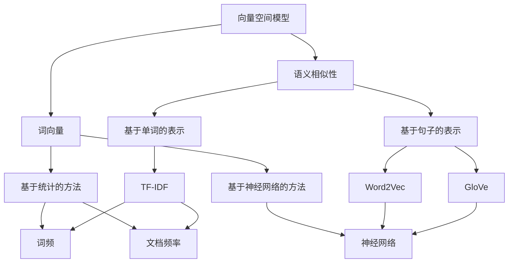

                 

### 背景介绍

自然语言处理（Natural Language Processing, NLP）作为人工智能领域的一个重要分支，旨在让计算机理解和处理人类语言。随着互联网和大数据的发展，NLP在文本挖掘、机器翻译、情感分析、语音识别等领域的应用越来越广泛。然而，NLP的核心挑战在于如何有效地表示和理解语言的语义。

在传统的自然语言处理中，文本通常被表示为一串字符或单词的序列，这种方法存在一些问题。例如，字符或单词序列不能很好地捕捉词与词之间的语义关系，也无法表达词的多义性和上下文依赖性。因此，需要一种更为高级的表示方法，即词嵌入（Word Embedding）。

词嵌入是一种将词语映射到向量空间的技术，通过这种方式，词语在向量空间中的距离可以直观地反映词语的语义相似性。早期的词嵌入方法如TF-IDF主要基于统计信息，而现代词嵌入算法如Word2Vec和GloVe则通过深度学习技术从大规模语料中学习得到。这些算法不仅能够捕捉词语的语义信息，还可以在一定程度上解决语义歧义和多义性问题。

词嵌入的出现极大地推动了自然语言处理的发展。通过词嵌入，我们可以将文本转化为机器可以处理的数字形式，进而应用于各种NLP任务，如文本分类、情感分析、命名实体识别等。此外，词嵌入技术还在机器翻译、问答系统、对话系统等领域发挥着重要作用。

然而，词嵌入技术并非完美无缺。它存在一些局限性，如无法很好地处理长距离的语义关系和情感极性等。为此，研究者们不断提出新的词嵌入算法，如GloVe、FastText、BERT等，以克服这些局限性，提高词嵌入的质量和效果。

本文将从以下几个方面对词嵌入进行深入探讨：

1. **词嵌入技术概述**：介绍词嵌入的基本概念、发展历史、应用场景等。
2. **词嵌入算法**：详细介绍Word2Vec、GloVe、FastText等算法，包括算法原理、优缺点等。
3. **语义空间数学表示**：介绍如何用数学方法表示语义空间，包括TF-IDF、分布假设模型等。
4. **词嵌入在实际应用中的使用**：介绍词嵌入在自然语言处理任务中的应用，如文本分类、情感分析等。
5. **挑战与未来方向**：探讨词嵌入技术的局限性和未来发展方向。

通过本文的介绍，读者可以全面了解词嵌入技术的基本原理和应用，从而为后续的研究和实践打下坚实的基础。

### 核心概念与联系

为了更好地理解词嵌入技术，我们首先需要明确几个核心概念，并探讨它们之间的关系。这些核心概念包括向量空间模型（Vector Space Model）、语义相似性（Semantic Similarity）和词向量（Word Vector）。

#### 向量空间模型

向量空间模型是一种将文本数据转换为数学向量表示的方法。在这种模型中，每个词或短语被表示为一个向量，这些向量存在于一个高维空间中。向量空间模型的关键在于，它将文本中的词和短语映射到了一个具有数学性质的向量空间，从而可以利用向量运算来处理文本数据。

在向量空间模型中，文本的表示方法可以分为两种：基于单词的表示和基于句子的表示。基于单词的表示方法，如TF-IDF，将每个词看作一个独立的特征，通过统计信息来表示词的重要程度。而基于句子的表示方法，如Word2Vec和GloVe，通过学习词和词之间的语义关系来表示句子。

#### 语义相似性

语义相似性是指词语在语义上的相似程度。在自然语言处理中，语义相似性是一个至关重要的概念，因为它能够帮助我们理解和利用语言的内在结构。例如，在文本分类任务中，我们需要根据词语的语义相似性来将文本分类到不同的类别。

语义相似性可以通过多种方式来度量。在传统的文本表示方法中，如TF-IDF，相似性主要基于词频和文档频率。而在词嵌入方法中，相似性通常基于词向量之间的距离。例如，在Word2Vec中，如果两个词在训练语料中经常出现在相同的上下文中，那么它们的词向量之间的欧几里得距离会更小，从而表示它们具有更高的语义相似性。

#### 词向量

词向量是词嵌入技术的核心组成部分。词向量是一种将词语映射到高维向量空间的方法，从而可以捕捉词语的语义信息。词向量的维度通常很高，以便能够捕捉词语之间的复杂关系。

词向量的生成方法可以分为两类：基于统计的方法和基于神经网络的生成方法。基于统计的方法，如TF-IDF和GloVe，通过统计信息来生成词向量。而基于神经网络的方法，如Word2Vec和FastText，通过训练神经网络来生成词向量。

#### 核心概念之间的关系架构

为了更清晰地展示这些核心概念之间的关系，我们可以使用Mermaid流程图来表示。



在这个Mermaid流程图中，我们可以看到向量空间模型是整个词嵌入技术的基础，它将文本数据映射到高维向量空间。语义相似性则基于向量空间模型来度量词与词之间的相似程度。词向量是词嵌入技术的核心组成部分，它通过不同的方法生成，包括基于统计方法和基于神经网络方法。基于单词的表示和基于句子的表示是词向量在文本表示中的两种应用方式。

通过理解这些核心概念之间的关系，我们可以更深入地掌握词嵌入技术的原理和应用。

### Word2Vec算法原理讲解

Word2Vec算法是由Google在2013年提出的一种基于神经网络的语言模型，它通过训练神经网络来学习词语的向量表示。Word2Vec算法的核心思想是，在相同或相似的上下文中频繁出现的词语应该具有相似的向量表示。这一思想可以通过两种模型实现：连续词袋（Continuous Bag of Words, CBOW）和Skip-Gram。

#### 连续词袋（CBOW）模型

CBOW模型是一种基于上下文的模型，它的输入是一个中心词及其周围的上下文词，输出是中心词的词向量。具体来说，CBOW模型会根据一个中心词生成一个窗口大小的词汇表，包含中心词和其周围的上下文词。然后，模型会通过这些上下文词的词向量平均值来预测中心词的词向量。

**算法原理**：

1. **输入**：给定一个中心词 \( w_c \) 和一个窗口大小 \( n \)，CBOW模型的输入是一个包含 \( w_c \) 和其前后 \( n \) 个词语的词汇表。

2. **编码输入**：将输入词汇表中的每个词表示为一个向量，通常使用预训练的词向量或随机初始化的词向量。

3. **计算输入向量平均值**：计算输入词汇表中每个词的向量平均值，得到输入向量的表示。

4. **预测输出**：使用一个多层神经网络（通常是一个单层神经网络）来预测中心词的词向量。神经网络的输出层只有一个神经元，其激活值即为预测的词向量。

5. **损失函数**：使用softmax损失函数来计算中心词的词向量与网络输出之间的误差。损失函数的目标是使网络输出最接近于中心词的词向量。

**伪代码**：

```python
# CBOW模型伪代码
def CBOW_model(w_c, window_size, embedding_size):
    # 1. 编码输入
    context_words = get_context_words(w_c, window_size)
    context_vectors = [get_vector(w) for w in context_words]

    # 2. 计算输入向量平均值
    input_vector = sum(context_vectors) / len(context_vectors)

    # 3. 预测输出
    predicted_vector = neural_network.predict(input_vector)

    # 4. 计算损失
    loss = softmax_loss(predicted_vector, get_vector(w_c))

    return loss
```

#### Skip-Gram模型

Skip-Gram模型是一种基于预测的模型，它的输入是一个词，输出是这个词的词向量。与CBOW模型不同，Skip-Gram模型通过预测一个词周围的词语来学习该词的词向量。

**算法原理**：

1. **输入**：给定一个词 \( w \) 和一个窗口大小 \( n \)，Skip-Gram模型的输入是一个包含 \( w \) 和其前后 \( n \) 个词语的词汇表。

2. **编码输入**：将输入词汇表中的每个词表示为一个向量，通常使用预训练的词向量或随机初始化的词向量。

3. **预测输出**：使用一个多层神经网络（通常是一个单层神经网络）来预测每个上下文词。神经网络的输出层有多个神经元，每个神经元对应一个上下文词。

4. **损失函数**：使用负采样损失函数来计算每个上下文词的词向量与网络输出之间的误差。负采样是一种有效的减小训练数据量的方法，它通过随机选择负样本来减少计算量。

**伪代码**：

```python
# Skip-Gram模型伪代码
def SkipGram_model(w, window_size, embedding_size, negative_samples_size):
    # 1. 编码输入
    context_words = get_context_words(w, window_size)
    context_vectors = [get_vector(w) for w in context_words]

    # 2. 预测输出
    predicted_vectors = [neural_network.predict(context_vector) for context_vector in context_vectors]

    # 3. 计算损失
    loss = negative_sampling_loss(predicted_vectors, get_vector(w), negative_samples_size)

    return loss
```

#### 算法对比

CBOW模型和Skip-Gram模型各有优缺点：

- **CBOW模型**：优点是计算简单，容易实现；缺点是它依赖于上下文，因此可能无法很好地捕捉单个词的语义特征。
- **Skip-Gram模型**：优点是它能够更好地捕捉单个词的语义特征，因为它不依赖于上下文；缺点是它比CBOW模型更复杂，计算量更大。

通过理解Word2Vec算法的原理，我们可以更好地应用这一技术来表示和操作自然语言中的词语。

### GloVe算法原理讲解

GloVe（Global Vectors for Word Representation）算法是由Stanford大学的Jeffrey Pennington等人于2014年提出的一种基于全局统计信息的词嵌入算法。GloVe算法通过优化词的共现信息来学习词向量，其核心思想是同时优化词向量和上下文向量的内积，从而得到高质量的词嵌入。以下是GloVe算法的详细原理讲解。

#### 算法原理

GloVe算法基于以下两个基本假设：

1. **共现信息**：如果两个词在文本中频繁共现，则它们在语义上更相似。
2. **局部线性**：词向量空间中的局部区域应该近似线性，即词向量之间的距离应该反映词的语义关系。

为了实现这两个假设，GloVe算法使用了一种矩阵分解的方法。具体来说，GloVe算法将两个矩阵 \( F \) 和 \( V \) 的乘积分解为一个词向量矩阵 \( W \) 和一个上下文向量矩阵 \( C \)。其中，矩阵 \( F \) 的每一行对应一个词，矩阵 \( V \) 的每一行对应一个上下文词，而矩阵 \( W \) 和 \( C \) 的每一行分别对应词向量和上下文向量。

#### 模型构建

GloVe算法的模型构建分为以下几个步骤：

1. **构建共现矩阵**：给定一个词汇表 \( V \)，构建一个共现矩阵 \( C \)，其中 \( C_{ij} \) 表示词 \( w_i \) 和词 \( w_j \) 在文本中的共现次数。

2. **初始化矩阵 \( F \) 和 \( V \)**：初始化词向量矩阵 \( V \) 和上下文向量矩阵 \( F \)。通常，\( V \) 的初始化可以采用随机初始化或者预训练的词向量。而 \( F \) 的初始化可以设置为全1矩阵。

3. **定义损失函数**：GloVe算法使用一种称为“Funk-Schmidt正则化”的损失函数，其目标是最小化词向量和上下文向量之间的欧几里得距离。具体来说，损失函数可以表示为：

   \[
   \ell(F, V) = \sum_{i, j \in V} \left( F_i^T V_j - \log(C_{ij}) \right)^2
   \]

4. **优化矩阵 \( F \) 和 \( V \)**：通过梯度下降或其他优化算法来最小化上述损失函数，从而优化词向量矩阵 \( V \) 和上下文向量矩阵 \( F \)。

#### 伪代码

以下是GloVe算法的伪代码：

```python
# GloVe算法伪代码
def GloVe算法(cooccurrence_matrix, embedding_size, learning_rate, num_iterations):
    F = 初始化上下文向量矩阵（全1矩阵）
    V = 初始化词向量矩阵（随机初始化）

    for iteration in 1到num_iterations:
        # 计算梯度
        grads_F, grads_V = compute_gradients(F, V, cooccurrence_matrix)

        # 更新矩阵
        F = F - learning_rate * grads_F
        V = V - learning_rate * grads_V

    return V
```

#### 分布假设模型

GloVe算法的核心在于其“分布假设模型”（Distribution Hypothesis Model），该模型通过分析词语共现次数来学习词向量。具体来说，GloVe算法基于以下假设：

1. **局部线性**：在词向量空间中，词语的共现关系近似线性。
2. **共现概率**：两个词 \( w_i \) 和 \( w_j \) 的共现概率与它们的词向量 \( \vec{v}_i \) 和 \( \vec{v}_j \) 的内积成正比。

为了实现这些假设，GloVe算法使用了一个对数正态分布模型，其公式为：

\[
P(w_i, w_j) \propto e^{-\frac{||\vec{v}_i - \vec{v}_j||^2}{2\sigma^2}}
\]

其中，\( \sigma \) 是分布的标准差，用于调节词向量之间的距离。

#### 优化方法

GloVe算法使用梯度下降法来优化词向量和上下文向量。为了提高优化效率，GloVe算法采用了一种“层次化梯度下降法”（hierarchical gradient descent），该方法通过层次化地更新词向量和上下文向量，从而减少计算量。

通过以上讲解，我们可以看到GloVe算法如何通过分布假设模型和优化方法来学习高质量的词向量。这些词向量不仅能够捕捉词语的语义关系，还可以应用于各种自然语言处理任务中。

### 语义空间数学表示

在自然语言处理中，语义空间是一种数学表示方法，用于捕捉词与词之间的语义关系。语义空间通常是一个高维向量空间，每个词语在这个空间中对应一个向量。通过这种方式，我们可以利用向量运算来处理语义关系，如词的相似性、相关性等。本文将介绍几种常用的语义空间数学表示方法，包括TF-IDF、分布假设模型和Word2Vec。

#### TF-IDF模型

TF-IDF（Term Frequency-Inverse Document Frequency）是一种基于统计的语义空间表示方法，用于文本数据的特征提取。TF-IDF模型通过计算词在文档中的频率和文档中的逆频率来表示词的重要性。

1. **TF（词频）**：词频是指词在文档中出现的次数。词频越高，表示这个词在文档中越重要。

2. **IDF（逆文档频率）**：逆文档频率是词在整个文档集合中的逆向频率，用于平衡高频词的重要性。IDF的计算公式为：

   \[
   IDF(w) = \log \left( \frac{N}{df(w)} \right)
   \]

   其中，\( N \) 是文档总数，\( df(w) \) 是词 \( w \) 在文档集合中出现的文档数。

3. **TF-IDF值**：将词频和逆文档频率相乘，得到词的TF-IDF值。词的TF-IDF值越高，表示它在文档中的重要性越大。

公式表示如下：

\[
TF-IDF(w, d) = TF(w, d) \times IDF(w)
\]

#### 分布假设模型

分布假设模型（Distribution Hypothesis Model）是一种基于概率论的语义空间表示方法，它通过分析词语共现次数来学习词向量。在GloVe算法中，我们介绍了分布假设模型的基本原理。具体来说，分布假设模型基于以下假设：

- **局部线性**：在词向量空间中，词语的共现关系近似线性。
- **共现概率**：两个词 \( w_i \) 和 \( w_j \) 的共现概率与它们的词向量 \( \vec{v}_i \) 和 \( \vec{v}_j \) 的内积成正比。

分布假设模型使用对数正态分布来表示词语共现的概率：

\[
P(w_i, w_j) \propto e^{-\frac{||\vec{v}_i - \vec{v}_j||^2}{2\sigma^2}}
\]

其中，\( \sigma \) 是分布的标准差。

#### Word2Vec

Word2Vec是一种基于神经网络的语义空间表示方法，通过训练神经网络来学习词向量。Word2Vec包括两种模型：连续词袋（CBOW）和Skip-Gram。

1. **CBOW模型**：CBOW模型基于上下文信息，通过预测中心词来学习词向量。输入是一个中心词及其上下文词的向量平均值，输出是中心词的向量。

2. **Skip-Gram模型**：Skip-Gram模型基于预测，通过预测一个词的上下文词来学习词向量。输入是一个词，输出是这个词的上下文词的向量。

Word2Vec模型的损失函数通常使用负采样损失，其目的是减少模型在训练过程中计算量。负采样通过随机选择负样本来减小训练数据的规模，从而提高训练效率。

#### 数学模型与公式

为了更清晰地理解这些模型，我们使用LaTeX格式来表示相关的数学公式。

1. **TF-IDF模型**：

   \[
   TF(w, d) = \frac{f(w, d)}{max_f(w, d)}
   \]
   
   \[
   IDF(w) = \log \left( \frac{N}{df(w)} \right)
   \]

   \[
   TF-IDF(w, d) = TF(w, d) \times IDF(w)
   \]

2. **分布假设模型**：

   \[
   P(w_i, w_j) \propto e^{-\frac{||\vec{v}_i - \vec{v}_j||^2}{2\sigma^2}}
   \]

3. **Word2Vec损失函数**：

   \[
   L = \sum_{i=1}^{N} \log(1 / p(y_i | x_i))
   \]

   其中，\( x_i \) 是输入词，\( y_i \) 是上下文词，\( p(y_i | x_i) \) 是给定输入词的条件下输出词的概率。

通过这些数学模型和公式，我们可以更深入地理解语义空间的表示方法。这些模型不仅为自然语言处理提供了有效的语义表示，还可以应用于各种实际任务中。

### 词嵌入在自然语言处理中的应用

词嵌入（Word Embedding）技术在自然语言处理（NLP）中扮演着至关重要的角色。它将词语映射到高维向量空间，使得计算机能够理解和处理语言的语义信息。以下将介绍词嵌入在几种主要的NLP任务中的应用，包括文本分类、情感分析和命名实体识别。

#### 文本分类

文本分类是一种将文本数据分配到预定义的类别中的任务。词嵌入在这类任务中发挥着关键作用，因为它可以捕捉词语的语义信息，从而提高分类的准确性。

1. **词嵌入的使用方法**：
   - **词嵌入表示**：首先，将文本中的每个词转换为其对应的词向量表示。这些词向量可以来自预训练的词向量库，如Word2Vec、GloVe等。
   - **文档向量**：将每个文本的词向量进行聚合，通常使用平均、求和或TF-IDF加权等方法，得到一个代表整个文本的向量。
   - **分类模型**：使用得到的文档向量作为特征输入到分类模型中，如朴素贝叶斯、支持向量机（SVM）或深度学习模型（如卷积神经网络（CNN）、循环神经网络（RNN）等）。

2. **应用案例**：
   - **新闻分类**：将新闻报道分类到不同的主题类别，如体育、政治、娱乐等。
   - **垃圾邮件检测**：使用词嵌入技术来识别和过滤垃圾邮件。

3. **效果分析**：
   - **提升分类性能**：词嵌入能够捕捉词的语义信息，从而改善分类模型的性能。
   - **处理语义歧义**：词嵌入可以帮助模型理解词的多义性，例如，“bank”在金融领域和河流领域中具有不同的含义。

#### 情感分析

情感分析（Sentiment Analysis）是一种评估文本表达的情感极性的任务，如正面、负面或中性。词嵌入技术在情感分析中起到了重要作用，它能够帮助模型捕捉文本中的情感语义。

1. **词嵌入的使用方法**：
   - **情感词向量**：使用预训练的词向量库，如Sentiment140或SentiWordNet，其中包含情感标签的词向量。
   - **文本表示**：将文本中的每个词转换为其对应的情感词向量。
   - **聚合策略**：使用聚合策略（如平均值、求和等）来得到一个代表整个文本的情感向量。
   - **情感分类模型**：使用得到的情感向量作为特征输入到情感分类模型中，如SVM、决策树或深度学习模型。

2. **应用案例**：
   - **社交媒体分析**：分析社交媒体平台上的用户评论和帖子，以了解公众对特定产品、服务或事件的看法。
   - **客户反馈分析**：分析客户反馈以评估客户满意度。

3. **效果分析**：
   - **提高情感分类准确性**：词嵌入能够捕捉情感词汇的细微差别，从而提高情感分类的准确性。
   - **处理情感强度**：词嵌入可以帮助模型理解情感词汇的强度，例如，“喜欢”和“非常喜欢”具有不同的情感强度。

#### 命名实体识别

命名实体识别（Named Entity Recognition, NER）是一种识别文本中的特定实体（如人名、地点、组织名等）的任务。词嵌入技术在这类任务中起到了关键作用，它能够帮助模型识别和分类命名实体。

1. **词嵌入的使用方法**：
   - **命名实体词向量**：使用预训练的词向量库，如GloVe或FastText，其中包含命名实体标签的词向量。
   - **文本表示**：将文本中的每个词转换为其对应的词向量。
   - **实体分类模型**：使用得到的词向量作为特征输入到命名实体识别模型中，如CRF（条件随机场）或深度学习模型。

2. **应用案例**：
   - **信息提取**：从文本中提取重要信息，如人名、地点、组织名等，用于数据库构建或数据挖掘。
   - **对话系统**：在对话系统中识别用户提及的特定实体，以提供更准确的回答。

3. **效果分析**：
   - **提高识别准确性**：词嵌入能够捕捉命名实体的语义信息，从而提高命名实体识别的准确性。
   - **处理实体关系**：词嵌入可以帮助模型理解命名实体之间的关系，如“马云”和“阿里巴巴”之间的关系。

总之，词嵌入技术在自然语言处理中具有广泛的应用，它不仅能够提高各种NLP任务的性能，还可以处理语义歧义和情感分析等复杂问题。通过这些应用，我们可以更好地理解和利用语言数据，从而推动人工智能技术的发展。

### 词嵌入技术面临的挑战与未来方向

尽管词嵌入技术在自然语言处理（NLP）中取得了显著的成就，但它仍然面临一些挑战和局限，这些挑战限制了其应用范围和效果。以下是词嵌入技术面临的主要挑战以及未来可能的发展方向。

#### 挑战

1. **语义歧义**：词嵌入无法完全消除语义歧义。例如，“bank”可以指银行，也可以指河流的岸边。词嵌入可能无法准确地区分这两种含义。

2. **上下文依赖性**：词嵌入通常在固定窗口大小的上下文中学习，这意味着它们可能无法很好地捕捉长距离的语义关系。例如，“I love Paris in the spring”中的“Paris”可能应该与“spring”有较强的语义关系，但传统的词嵌入模型可能无法有效地捕捉这一点。

3. **情感极性**：词嵌入技术难以准确捕捉情感极性。例如，“I hate Microsoft”中的“hate”和“Microsoft”之间的关系需要更精细的情感表示。

4. **稀疏性**：词嵌入向量通常很稀疏，这意味着大多数向量分量接近零，这可能导致模型在处理低频词时效果不佳。

5. **计算成本**：词嵌入模型的训练和推理过程可能非常昂贵，尤其是在高维空间中。这限制了其在大规模数据集上的应用。

#### 未来方向

1. **多模态嵌入**：未来的词嵌入技术可能结合多种数据类型（如文本、图像、音频等），实现多模态嵌入。这种技术能够更好地捕捉复杂语义信息，提高模型的泛化能力。

2. **自适应嵌入**：自适应嵌入技术可以根据上下文动态调整词向量的表示，从而更好地捕捉长距离语义关系和上下文依赖性。

3. **深度嵌入**：深度学习技术，如变换器（Transformer）和图神经网络（Graph Neural Networks, GNN），可能在词嵌入领域发挥重要作用。这些技术能够学习更复杂的语义表示，提高模型的性能。

4. **知识增强**：将外部知识（如知识图谱、词义消歧信息等）整合到词嵌入模型中，可以增强模型的语义理解能力，提高其在处理复杂任务时的效果。

5. **低资源语言支持**：开发适用于低资源语言的词嵌入方法，以解决低资源语言在NLP任务中面临的挑战。

6. **可解释性**：提高词嵌入模型的可解释性，使研究人员和开发者能够更好地理解模型的工作原理，从而优化和改进模型。

总之，词嵌入技术在未来仍有许多改进和发展的空间。通过克服现有的挑战，结合多种先进技术，词嵌入技术有望在NLP领域取得更广泛的成功。

### 总结

本文详细介绍了自然语言处理中的词嵌入技术，从其背景介绍、核心概念与联系、Word2Vec和GloVe算法原理，到语义空间数学表示，再到词嵌入在实际应用中的使用，最后探讨了词嵌入技术面临的挑战与未来方向。通过本文的讲解，读者可以全面了解词嵌入技术的基本原理和应用。

**核心概念与联系**：词嵌入通过将词语映射到向量空间，使计算机能够理解和处理语言的语义信息。核心概念包括向量空间模型、语义相似性和词向量。这些概念相互关联，构成了词嵌入技术的理论基础。

**算法原理**：Word2Vec算法包括CBOW和Skip-Gram模型，通过训练神经网络来学习词向量。GloVe算法则基于全局统计信息，优化词向量和上下文向量的内积，从而得到高质量的词嵌入。

**数学表示**：语义空间数学表示方法包括TF-IDF、分布假设模型和Word2Vec。这些方法通过不同的数学模型和公式来表示词语的语义关系。

**应用场景**：词嵌入在文本分类、情感分析和命名实体识别等NLP任务中发挥了重要作用。它不仅提升了任务的性能，还能处理语义歧义和情感分析等复杂问题。

**未来方向**：词嵌入技术面临语义歧义、上下文依赖性和情感极性等挑战，但通过多模态嵌入、自适应嵌入、深度嵌入和知识增强等未来方向，有望取得更广泛的应用和更高的性能。

本文旨在为读者提供系统性的词嵌入技术概述，帮助他们更好地理解这一关键技术。通过本文的学习，读者可以为进一步的研究和应用打下坚实的基础。

### 最佳实践 tips

在应用词嵌入技术时，以下是一些最佳实践和注意事项，可以帮助你更好地利用词嵌入，提高模型性能：

1. **数据预处理**：
   - **文本清洗**：在训练词嵌入之前，对文本进行适当的清洗，包括去除标点符号、停用词和特殊字符，以提高词嵌入质量。
   - **分词**：选择合适的分词工具，确保词语的准确划分，这对于生成高质量的词向量至关重要。

2. **词向量选择**：
   - **使用预训练词向量**：优先使用预训练的词向量，如GloVe、Word2Vec或FastText，这些词向量已经在大规模语料上训练过，具有较高的语义表示能力。
   - **自定义词向量**：如果数据集较小，可以考虑使用自定义词向量，但需要足够的数据量来保证词向量的质量。

3. **调整参数**：
   - **学习率**：选择适当的学习率，避免过大的学习率导致梯度消失或爆炸，影响训练效果。
   - **维度**：词向量维度不宜过高，过高会增加计算复杂度和存储需求，但过低则可能无法捕捉词的复杂语义关系。

4. **处理稀疏性**：
   - **稀疏矩阵处理**：在处理稀疏词向量矩阵时，可以使用稀疏矩阵存储和计算方法，提高计算效率。
   - **低频词处理**：对低频词进行适当处理，例如，使用平均词向量或保留高频词，以提高模型对低频词的表示能力。

5. **优化算法**：
   - **梯度下降优化**：使用适合的梯度下降优化算法，如Adam优化器，可以提高训练速度和模型性能。
   - **负采样**：在训练过程中使用负采样，可以有效减少训练数据的规模，提高训练效率。

6. **模型评估**：
   - **准确评估**：使用合适的评估指标（如词相似性、文本分类准确率等）来评估词嵌入的效果。
   - **交叉验证**：进行交叉验证，以验证模型的泛化能力。

7. **多任务学习**：
   - **多任务学习**：在训练词嵌入时，可以考虑结合多任务学习，例如，同时进行文本分类和情感分析，从而提高词向量的语义表示能力。

通过遵循这些最佳实践，你可以在应用词嵌入技术时获得更好的效果，同时提高模型的稳定性和可靠性。

### 注意事项

在设计和使用词嵌入技术时，以下注意事项可以帮助你避免常见的问题，确保模型的有效性和可靠性：

1. **数据质量和预处理**：
   - **文本清洗**：确保文本数据干净，去除无关的标点符号、停用词和特殊字符，以提高词嵌入质量。
   - **一致性**：确保数据预处理的一致性，避免在训练和测试数据上使用不同的预处理方法。

2. **参数选择**：
   - **维度**：选择适当的词向量维度，过高或过低的维度都会影响模型的性能。
   - **学习率**：选择合适的学习率，避免过大的学习率导致梯度消失或爆炸，影响训练效果。

3. **模型稳定性**：
   - **避免过拟合**：使用正则化技术，如dropout和L2正则化，以避免模型过拟合。
   - **数据增强**：通过数据增强（如随机插入、替换等）来增加数据的多样性，提高模型的泛化能力。

4. **性能监控**：
   - **监控训练过程**：定期检查训练过程的损失函数和评估指标，及时发现并解决问题。
   - **资源管理**：合理分配计算资源，确保训练过程高效稳定。

5. **模型评估**：
   - **多样性评估**：评估词嵌入的多样性，确保模型能够捕捉词的多种语义关系。
   - **泛化能力**：通过交叉验证和测试集评估模型的泛化能力，避免模型仅在特定数据集上表现良好。

6. **实践验证**：
   - **验证假设**：验证词嵌入的假设，如局部线性假设和上下文依赖性，确保这些假设适用于你的任务和数据集。

通过遵循这些注意事项，你可以在设计和使用词嵌入技术时避免常见的问题，从而确保模型的高效性和可靠性。

### 拓展阅读

为了深入了解词嵌入技术和自然语言处理（NLP）的各个方面，以下是一些建议的阅读材料，涵盖从基础概念到高级应用：

1. **基础读物**：
   - 《自然语言处理入门》（NLP by Example）：提供了丰富的NLP实践案例，适合初学者。
   - 《深度学习》（Deep Learning）：由Ian Goodfellow、Yoshua Bengio和Aaron Courville合著，详细介绍了深度学习的基础和高级技术。

2. **经典论文**：
   - “Word2Vec: Google Search-Based Representations for Sentiment Analysis and Semantics” by Tomas Mikolov, Kai Chen, Greg Corrado, and Jeffrey Dean：介绍了Word2Vec算法的基本原理和实现细节。
   - “GloVe: Global Vectors for Word Representation” by Jeffrey Pennington, Richard Socher, and Chris Manning：介绍了GloVe算法及其在语义表示中的应用。

3. **进阶读物**：
   - “Bridging the Gap Between Sentiment and Object with Multi-modal Embeddings” by Devi Parikh, Avinash Kumar, Marcus Rohou, and Carl Vondrick：探讨了多模态嵌入技术在情感分析和对象识别中的应用。
   - “A Theoretical Framework for Word Embeddings” by Emily Mower Provost, Eric H. Huang, and Daniel M. Zemel：提供了词嵌入的理论基础和分析框架。

4. **开源资源和工具**：
   - 词向量库：如GloVe、FastText和Word2Vec等，提供了丰富的预训练词向量资源。
   - NLP工具包：如spaCy、NLTK和Transformers等，提供了方便的NLP工具和库。

通过阅读这些材料，读者可以系统地了解词嵌入技术的各个方面，从基础到应用，进一步提升自己在自然语言处理领域的知识水平。

