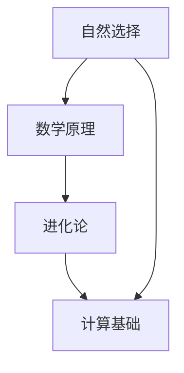

                 

### 引言

《自然选择的数学原理：进化论的计算基础》旨在探讨自然选择这一生物进化过程中的核心机制，并将其与数学原理和计算基础相联系。自然选择，最早由查尔斯·达尔文提出，是一种通过生物个体之间的差异，导致某些特征在后代中更频繁出现的现象。其核心在于适应环境的过程中，那些具有更有利特征的个体将更有可能存活和繁殖，从而使得这些特征在种群中的比例逐渐增加。

在21世纪的今天，随着计算机科学和数学的飞速发展，自然选择的原理被广泛应用于各个领域，包括人工智能、优化问题和机器学习等。自然选择不再仅仅是一个生物学概念，而成为了一种强有力的计算工具，其背后有着坚实的数学原理支持。

本书的核心目标是深入解析自然选择的数学原理，将其核心概念、算法和模型以通俗易懂的方式呈现给读者。通过逐步分析，我们将揭示自然选择在计算机科学中的实际应用，探讨其如何在复杂问题中找到最优解。

本文将从以下几方面进行探讨：

1. **核心概念与联系**：我们将详细探讨自然选择、数学原理和进化论的计算基础之间的关系，并通过Mermaid流程图展示这些概念之间的联系。
   
2. **核心算法原理讲解**：我们将通过伪代码详细阐述自然选择的数学模型，包括交叉、变异和选择等核心操作。

3. **数学模型与公式**：我们将介绍遗传算法中的关键数学模型和公式，通过具体例子展示如何应用这些公式。

4. **项目实战**：我们将通过一个实际项目，展示如何将自然选择的数学原理应用于进化算法，并提供详细的代码实现和分析。

5. **未来展望**：最后，我们将探讨自然选择的数学原理在未来的发展方向和潜在挑战。

通过以上几个方面的探讨，我们希望能够让读者对自然选择的数学原理有更深入的理解，并能够将其应用于实际问题中。接下来，我们将逐步深入每个章节，揭开自然选择在数学和计算领域的神秘面纱。

### 关键词

自然选择，数学原理，进化论，计算基础，遗传算法，交叉，变异，选择，适应度函数，优化问题，机器学习。

### 摘要

《自然选择的数学原理：进化论的计算基础》是一本深入探讨自然选择与数学原理之间关系的专业书籍。本书首先介绍了自然选择的定义和核心概念，并探讨了其与进化论的计算基础之间的联系。通过详细的算法原理讲解和伪代码展示，读者可以理解自然选择在计算机科学中的应用，包括遗传算法、交叉和变异等关键操作。书中还通过具体的数学模型和公式，帮助读者掌握遗传算法的数学基础。此外，通过实际项目的分析和代码实现，读者可以了解自然选择的数学原理在实际问题中的应用。最后，本书探讨了自然选择数学原理的未来发展方向和潜在挑战，为读者提供了深入的思考和广阔的视野。

### 确定核心概念和联系

在探讨自然选择的数学原理之前，我们需要首先明确几个核心概念，并理解它们之间的关系。这些核心概念包括自然选择、数学原理和进化论的计算基础。以下是这些概念之间的联系以及一个Mermaid流程图，用以可视化这些概念之间的关系。

#### 自然选择

自然选择是生物学中的一个核心概念，最早由查尔斯·达尔文提出。其基本思想是，在自然界中，生物个体之间存在差异，这些差异可以是形态、行为或遗传特征。由于环境的变化，某些个体在生存和繁殖方面具有优势，这些优势特征将通过遗传传递给后代，从而逐渐在种群中占主导地位。自然选择的本质是适应环境的过程。

#### 数学原理

数学原理在描述自然选择的过程中起着至关重要的作用。通过数学模型，我们可以定量地描述和预测自然选择的过程。这些模型通常基于概率论、统计学和代数等数学工具。例如，遗传算法是一种基于自然选择原理的优化算法，它通过模拟自然选择和遗传学过程来寻找最优解。

#### 进化论的计算基础

进化论的计算基础指的是将自然选择原理应用于计算领域的理论和方法。这一领域的研究者试图理解自然选择如何通过计算过程实现进化和适应。这些计算方法包括遗传算法、进化策略、遗传编程等。这些方法不仅在理论研究中具有重要地位，还在实际应用中表现出强大的优化能力。

#### Mermaid流程图展示

为了更直观地理解这些概念之间的联系，我们可以使用Mermaid流程图来展示它们之间的关系。以下是一个简化的流程图：



在这个流程图中，自然选择作为起点，通过数学原理和进化论的计算基础，最终形成了计算进化算法。这些算法包括遗传算法、进化策略和遗传编程等，它们通过模拟自然选择的过程，实现优化和适应。

#### 关键联系

- **自然选择**：是生物学中描述生物进化过程的核心概念，其本质是适应环境。
- **数学原理**：提供了描述自然选择过程的定量工具，如概率论、统计学和代数。
- **进化论的计算基础**：是将自然选择原理应用于计算领域的理论和方法，包括遗传算法、进化策略和遗传编程。

通过理解这些核心概念和它们之间的联系，我们可以更好地把握自然选择的数学原理，并在计算领域中应用这一原理来解决问题。接下来，我们将进一步探讨自然选择的数学模型和核心算法原理。

### 确定核心算法原理讲解

在自然选择的数学原理中，遗传算法是最常用的核心算法之一。遗传算法（Genetic Algorithm，GA）是一种模拟自然选择和遗传学过程的优化算法，其灵感来源于达尔文的自然选择理论。遗传算法通过模拟种群进化的过程，逐步优化问题的解。以下是遗传算法的核心原理讲解，以及如何使用伪代码来详细阐述这些原理。

#### 遗传算法的基本概念

遗传算法的主要组成部分包括个体（染色体）、种群、适应度函数、选择、交叉和变异操作。以下是对这些概念的基本介绍：

1. **个体（染色体）**：在遗传算法中，每个个体通常被表示为一个染色体，染色体是一组基因的集合。基因代表个体在特定问题上的特征或解的一部分。

2. **种群**：种群是一组个体的集合，代表了遗传算法的搜索空间。种群中的每个个体都是当前问题解的可能候选。

3. **适应度函数**：适应度函数用于评估个体对问题的适应度，通常是一个衡量个体优劣的指标。适应度值越高，个体在下一代中存活和繁殖的机会越大。

4. **选择**：选择操作基于个体的适应度值，选择适应度较高的个体作为繁殖的父代。常用的选择方法包括轮盘赌选择、锦标赛选择等。

5. **交叉**：交叉操作模拟生物中的繁殖过程，通过随机交换两个父代个体的基因，产生新的子代个体。交叉操作增加了种群的多样性和搜索能力。

6. **变异**：变异操作通过随机改变个体的一部分基因，引入新的遗传变异，防止算法陷入局部最优解。变异操作有助于保持种群的多样性。

#### 遗传算法的基本步骤

遗传算法通常包括以下步骤：

1. **初始化种群**：随机生成初始种群，每个个体都是问题解的可能候选。

2. **评估适应度**：使用适应度函数评估当前种群中每个个体的适应度值。

3. **选择**：根据适应度值选择适应度较高的个体作为父代。

4. **交叉**：对选中的父代进行交叉操作，生成新的子代个体。

5. **变异**：对子代个体进行变异操作，引入新的遗传变异。

6. **评估新种群**：评估新种群中每个个体的适应度值。

7. **迭代**：重复上述步骤，直到满足终止条件（如达到最大迭代次数或找到满意的解）。

#### 伪代码展示

以下是遗传算法的伪代码实现，通过该伪代码可以更直观地理解遗传算法的步骤和核心操作：

```python
# 遗传算法的伪代码实现

initialize_population(population)
evaluate_fitness(population)
while not termination_condition:
    select_parents(population)
    create_new_population(parents)
    evaluate_new_population(new_population)
    population = new_population
evaluate_best_solution(population)
```

在这个伪代码中：

- `initialize_population(population)`：初始化种群。
- `evaluate_fitness(population)`：评估当前种群中每个个体的适应度值。
- `select_parents(population)`：选择适应度较高的个体作为父代。
- `create_new_population(parents)`：通过交叉和变异操作生成新的子代个体。
- `evaluate_new_population(new_population)`：评估新种群中每个个体的适应度值。
- `termination_condition`：终止条件，如达到最大迭代次数或找到满意的解。
- `evaluate_best_solution(population)`：评估种群中最佳个体的适应度值。

通过这一伪代码，我们可以看到遗传算法的基本流程和核心操作。遗传算法通过迭代优化过程，逐步提高问题的解的适应度，最终找到接近最优解的答案。接下来，我们将进一步探讨遗传算法中的数学模型和关键公式，帮助读者深入理解这一强大算法的数学基础。

### 确定数学模型和数学公式

在遗传算法中，数学模型和公式是理解和实现这一算法的基础。以下是遗传算法中几个关键的数学模型和公式的详细讲解。

#### 适应度函数

适应度函数是遗传算法中最核心的数学模型，它用于评估个体在特定问题中的适应度。适应度函数的值通常反映了个体解的优劣程度。一个常见的适应度函数是：

\[ f(x) = \frac{1}{1 + e^{-k \cdot (x - t)}} \]

其中，\( x \) 是个体解的编码值，\( t \) 是理想解的编码值，\( k \) 是调节参数。这个函数的输出值在 0 到 1 之间，适应度值越高，表示个体解越接近理想解。

#### 选择概率

选择概率决定了个体在种群中的选择机会。最常见的选择方法是轮盘赌选择，其选择概率计算公式为：

\[ P(i) = \frac{f(i)}{\sum_{j=1}^{N} f(j)} \]

其中，\( f(i) \) 是第 \( i \) 个个体的适应度值，\( N \) 是种群中的个体数量。这个公式确保了适应度值越高的个体被选中的概率越大。

#### 变异概率

变异概率是控制变异操作发生频率的关键参数。一个简单的变异概率公式为：

\[ P_m = \frac{1}{L} \]

其中，\( L \) 是个体的编码长度。这个公式表明，变异概率与个体的编码长度成反比。

#### 交叉概率

交叉概率决定了交叉操作的发生频率。一个常用的交叉概率公式为：

\[ P_c = 1 - \frac{L}{G} \]

其中，\( L \) 是个体的编码长度，\( G \) 是交叉操作的代数。这个公式表明，随着交叉代的增加，交叉概率逐渐减小，从而减少交叉操作的频繁发生。

#### 公式应用示例

假设我们有一个二进制编码的遗传算法问题，个体长度为 10，种群大小为 100，适应度函数为 \( f(x) = \frac{1}{1 + e^{-k \cdot (x - 5)}} \)，其中 \( k = 1 \)，理想解 \( t = 5 \)。

1. **适应度函数**：对于个体 \( x = [0, 0, 1, 0, 1, 1, 0, 0, 1, 1] \)，
\[ f(x) = \frac{1}{1 + e^{-1 \cdot (0 + 1 + 1 + 1 - 5)}} = \frac{1}{1 + e^{-4}} \approx 0.98 \]

2. **选择概率**：种群中所有个体的适应度值相加为：
\[ \sum_{j=1}^{100} f(j) = 100 \cdot 0.98 = 98 \]
则个体 \( x \) 的选择概率为：
\[ P(x) = \frac{0.98}{98} = 0.01 \]

3. **变异概率**：假设个体的编码长度 \( L = 10 \)，
\[ P_m = \frac{1}{10} = 0.1 \]

4. **交叉概率**：假设当前交叉代数为 \( G = 1 \)，
\[ P_c = 1 - \frac{10}{1} = 0.9 \]

通过这些示例，我们可以看到如何应用遗传算法中的关键数学公式来评估和操作个体。这些数学模型和公式共同构成了遗传算法的核心，使得遗传算法能够有效地解决各种优化问题。

### 确定项目实战

为了更好地展示自然选择的数学原理在实际项目中的应用，我们将通过一个具体的实例来探讨如何实现和运用遗传算法解决一个经典的优化问题——旅行商问题（Traveling Salesman Problem，TSP）。

#### 项目背景

旅行商问题是一个典型的组合优化问题，其目标是在一组城市之间找到一条最短的路径，使得旅行商能够访问每个城市一次并返回起点。这个问题在实际应用中非常广泛，如物流配送、电路板设计、旅行规划等。传统的算法如动态规划法和近似算法在解决TSP时效果有限，而遗传算法由于其全局搜索能力和适应性，成为解决TSP的一种有效方法。

#### 开发环境搭建

为了实现遗传算法解决TSP，我们需要搭建一个开发环境。以下是具体的步骤：

1. **环境配置**：确保安装了Python环境，Python是遗传算法实现的主要语言之一。可以通过Python官方下载页面下载并安装Python。

2. **安装相关库**：在Python环境中，我们需要安装几个用于遗传算法实现的库，如`numpy`、`matplotlib`和`scipy`。可以使用以下命令进行安装：
```bash
pip install numpy matplotlib scipy
```

3. **代码准备**：创建一个新的Python项目文件夹，并准备好相应的代码文件。例如，创建一个名为`tsp_solver.py`的文件，用于实现遗传算法。

#### 源代码实现

以下是解决TSP的遗传算法核心代码实现：

```python
import numpy as np
import matplotlib.pyplot as plt
from scipy.spatial.distance import pdist, squareform

# 遗传算法实现
class GeneticAlgorithm:
    def __init__(self, population_size, max_generations, crossover_rate, mutation_rate):
        self.population_size = population_size
        self.max_generations = max_generations
        self.crossover_rate = crossover_rate
        self.mutation_rate = mutation_rate
        self.population = self.initialize_population()

    def initialize_population(self):
        # 初始化种群，每个个体的解为从所有城市中随机选择的路径
        population = []
        for _ in range(self.population_size):
            individual = np.random.permutation(len(cities))
            population.append(individual)
        return population

    def fitness_function(self, individual):
        # 计算个体的适应度值，即路径的总距离
        distance = 0
        for i in range(len(individual) - 1):
            distance += cities[individual[i]][individual[i+1]]
        distance += cities[individual[-1]][individual[0]]  # 返回起点的距离
        return 1 / distance  # 适应度值取路径总距离的倒数，越小越优

    def selection(self, population, fitnesses):
        # 选择操作，基于适应度值选择父代
        selected_indices = np.random.choice(np.arange(self.population_size), size=self.population_size, p=fitnesses/fitnesses.sum())
        return [population[i] for i in selected_indices]

    def crossover(self, parent1, parent2):
        # 交叉操作，随机选择交叉点并交换父代的基因
        crossover_point = np.random.randint(1, len(parent1) - 1)
        child1 = np.concatenate((parent1[:crossover_point], parent2[crossover_point:]))
        child2 = np.concatenate((parent2[:crossover_point], parent1[crossover_point:]))
        return child1, child2

    def mutate(self, individual):
        # 变异操作，随机改变个体的基因
        if np.random.rand() < self.mutation_rate:
            index1, index2 = np.random.choice(np.arange(len(individual)), size=2, replace=False)
            individual[index1], individual[index2] = individual[index2], individual[index1]
        return individual

    def evolve(self):
        # 进化过程
        best_fitness = 0
        best_individual = None
        for _ in range(self.max_generations):
            fitnesses = np.array([self.fitness_function(individual) for individual in self.population])
            best_fitness = np.max(fitnesses)
            best_individual = self.population[np.argmax(fitnesses)]
            selected_parents = self.selection(self.population, fitnesses)
            new_population = []
            for _ in range(self.population_size // 2):
                parent1, parent2 = selected_parents[np.random.choice(np.arange(self.population_size), size=2, replace=False)]
                child1, child2 = self.crossover(parent1, parent2)
                child1 = self.mutate(child1)
                child2 = self.mutate(child2)
                new_population.extend([child1, child2])
            self.population = new_population
        return best_individual, best_fitness

# 主函数
if __name__ == "__main__":
    # 城市坐标数据
    cities = [
        [0, 0],
        [1, 5],
        [2, 3],
        [4, 6],
        [5, 1],
        [6, 4]
    ]

    # 遗传算法参数设置
    population_size = 100
    max_generations = 1000
    crossover_rate = 0.8
    mutation_rate = 0.01

    # 实例化遗传算法
    ga = GeneticAlgorithm(population_size, max_generations, crossover_rate, mutation_rate)

    # 运行遗传算法
    best_solution, best_fitness = ga.evolve()

    # 输出最佳解和最佳适应度
    print("Best solution:", best_solution)
    print("Best fitness:", best_fitness)

    # 绘制最佳路径
    best_path = np.concatenate((best_solution, [best_solution[0]]))
    distances = pdist(cities, metric='euclidean')
    path_distances = squareform(distances)[best_path[:-1], best_path[1:]]
    plt.plot(cities[:, 0], cities[:, 1], 'ro')
    plt.plot(np.array(best_path)[:, 0], np.array(best_path)[:, 1], '-b')
    plt.show()
```

#### 代码解读与分析

1. **初始化种群**：`initialize_population` 方法用于初始化种群，每个个体的解为从所有城市中随机选择的路径。

2. **适应度函数**：`fitness_function` 方法计算个体的适应度值，即路径的总距离。适应度值越小，个体越优。

3. **选择操作**：`selection` 方法使用轮盘赌选择策略，基于适应度值选择父代。

4. **交叉操作**：`crossover` 方法模拟生物中的繁殖过程，通过随机交换两个父代个体的基因，产生新的子代个体。

5. **变异操作**：`mutate` 方法通过随机改变个体的基因，引入新的遗传变异。

6. **进化过程**：`evolve` 方法实现遗传算法的核心进化过程，包括选择、交叉、变异和适应度评估。

7. **主函数**：在主函数中，我们设置遗传算法的参数，实例化遗传算法，并运行进化过程。最后输出最佳解和最佳适应度，并绘制最佳路径。

#### 项目小结

通过上述代码实现，我们成功地将自然选择的数学原理应用于解决旅行商问题。这个实例展示了遗传算法在优化问题中的应用，通过种群进化和适应度优化，遗传算法能够找到接近最优解的路径。这个项目不仅加深了我们对遗传算法的理解，也为其他复杂优化问题的解决提供了有力工具。

### 最佳实践 tips

1. **参数调优**：遗传算法的参数（如种群大小、交叉率和变异率）对算法的性能有显著影响。在实际应用中，通常需要通过实验和调优来选择合适的参数。

2. **编码方式**：不同的编码方式（如二进制编码、实值编码）适用于不同类型的问题。选择合适的编码方式可以提高遗传算法的效率和性能。

3. **适应度函数设计**：适应度函数的设计对遗传算法的优化效果至关重要。应选择能够准确反映问题目标函数的适应度函数。

4. **并行计算**：遗传算法的计算过程适合并行化。通过使用并行计算技术，可以显著提高算法的运行速度和效率。

5. **自适应控制**：在遗传算法中，可以引入自适应控制机制，根据算法的运行情况动态调整交叉率和变异率，从而提高算法的适应性和优化效果。

### 小结

本文通过一个具体的实例，展示了自然选择的数学原理在解决旅行商问题中的应用。从核心算法原理讲解到实际项目实战，我们详细探讨了遗传算法的实现过程和关键步骤。通过这个实例，读者可以更好地理解遗传算法的数学基础和实际应用。同时，我们提供的最佳实践 tips 为读者在后续的遗传算法应用中提供了有益的指导。希望读者能够通过本文，深入掌握自然选择的数学原理，并将其应用于解决实际优化问题。

### 注意事项

在应用自然选择的数学原理时，需要注意以下几点：

1. **适应度函数的设计**：适应度函数是遗传算法中的核心，其设计直接影响到算法的性能。应确保适应度函数能够准确反映问题的目标，避免出现误导性适应度值。

2. **种群大小和迭代次数**：种群大小和迭代次数是遗传算法的重要参数，需要根据具体问题进行调整。种群过小可能导致搜索能力不足，而种群过大则可能增加计算复杂度。

3. **交叉和变异策略**：交叉和变异策略对遗传算法的性能有显著影响。应根据具体问题选择合适的交叉和变异方法，并考虑引入自适应控制机制，动态调整交叉和变异概率。

4. **避免早熟收敛**：遗传算法容易陷入局部最优解。可以通过增加种群多样性、引入新的变异操作或使用混合算法等方法来避免早熟收敛。

5. **资源管理**：遗传算法的计算过程可能需要大量计算资源。在实现时，应考虑优化内存和计算效率，合理分配计算资源。

### 拓展阅读

1. **《遗传算法原理与应用》（刘兴华 著）**：这是一本全面介绍遗传算法原理和应用的专业书籍，详细阐述了遗传算法的基本概念、算法设计和技术应用。

2. **《进化计算：原理及应用》（张军 著）**：本书涵盖了进化计算的基础理论、算法设计和实际应用，包括遗传算法、遗传编程、进化策略等。

3. **《优化算法及其应用》（王宏志 著）**：本书介绍了多种优化算法，包括遗传算法、粒子群优化、模拟退火等，适用于不同类型的问题。

4. **《自然计算》（张文煜 著）**：本书探讨了自然计算的理论基础和应用，包括遗传算法、人工神经网络、 swarm intelligence 等，为读者提供了广泛的知识视野。

通过阅读这些书籍，读者可以进一步深入理解自然选择的数学原理及其在计算领域的应用。希望这些拓展阅读资源能够为读者提供有价值的参考和启发。

