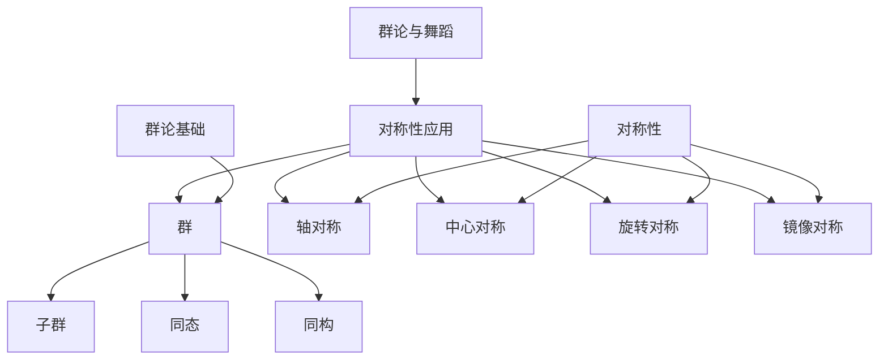

                 

### 文章标题

《舞蹈编排的群论：身体动作的数学对称性》

### 关键词

- 舞蹈编排
- 群论
- 数学对称性
- 舞蹈动作设计
- 编舞技巧
- 科技辅助
- 审美关系

### 摘要

本文探讨了舞蹈编排与数学对称性的结合，运用群论这一数学工具，分析舞蹈动作中的对称性，并将其应用于实际编舞中。文章首先介绍了群论的基本概念和数学对称性的定义，随后通过具体的实例和伪代码，详细讲解了群论在舞蹈编排中的应用。接着，本文分析了对称性在舞蹈动作设计中的重要性，并通过实例展示了如何利用数学模型来优化舞蹈编排。此外，文章还探讨了科技辅助舞蹈编排的可能性，以及对称性与舞蹈审美的关系。最后，本文对未来的发展趋势进行了展望，并提供了相关的研究方向和建议。本文旨在为舞蹈编舞者提供一种全新的视角，帮助他们运用数学对称性来提升舞蹈的艺术表现力和观赏性。

### 用户需求分析

在现代舞蹈艺术中，编舞者不仅仅需要关注动作的流畅性和情感表达，更需要借助科学的方法来提升舞蹈的审美价值和观赏性。舞蹈编排的群论与数学对称性的结合，为编舞提供了一种全新的思维方式。群论作为一种数学工具，具有描述和分类复杂系统的强大能力，而数学对称性则提供了衡量动作美感的重要标准。编舞者希望通过运用群论和对称性原理，创造出既具有逻辑结构又充满美感的舞蹈作品。

本文的目标读者主要包括以下几类：

1. **专业编舞者和舞蹈艺术家**：他们需要对舞蹈编排的方法和技巧有深入的理解，并希望通过数学工具提升自己的编舞水平。
2. **数学和计算机科学研究者**：他们对群论和数学对称性有基础了解，希望将其应用于舞蹈艺术中，进行跨学科的研究。
3. **对舞蹈和数学有兴趣的爱好者**：他们希望了解舞蹈与数学的交集，探索科学方法在艺术创作中的应用。

本文的核心内容和主题思想如下：

- **核心内容**：介绍群论和数学对称性的基本概念，分析其如何应用于舞蹈编排中，并通过具体的实例和案例来展示其效果。
- **主题思想**：通过运用数学工具，编舞者可以更加科学和系统地进行舞蹈创作，提升舞蹈的艺术表现力和观赏性，同时为舞蹈艺术开辟新的研究方向。

### 目录大纲设计

#### 第一部分：理论基础与概念介绍

##### 第1章：引言

- **1.1 舞蹈与数学的交汇**
  - 舞蹈的历史与演变
  - 数学在舞蹈艺术中的应用
- **1.2 群论基础**
  - 群的定义与性质
  - 子群、同态与同构
  - **图示：群论基本概念 Mermaid 流程图**
- **1.3 数学对称性**
  - 对称性的定义与分类
  - 对称性在舞蹈中的表现
  - **示例：对称性在实际舞蹈编排中的应用**

##### 第2章：群论在舞蹈编排中的应用

- **2.1 群论工具**
  - 群在舞蹈动作组合中的作用
  - **伪代码：群在舞蹈动作编排中的应用**
- **2.2 对称性分析**
  - 对称性在舞蹈动作设计中的运用
  - **数学模型：舞蹈动作对称性分析**
- **2.3 实例分析**
  - 舞蹈作品中的对称性案例
  - **案例研究：对称性在经典舞蹈作品中的应用**

#### 第二部分：应用与实践

##### 第3章：群论与舞蹈编排技巧

- **3.1 舞蹈动作的对称性设计**
  - 设计原则与技巧
  - **图示：对称性设计流程图**
- **3.2 舞蹈编舞的数学策略**
  - 运用数学策略优化舞蹈编排
  - **伪代码：舞蹈编排优化策略**
- **3.3 舞蹈编舞实例**
  - 实际舞蹈编排案例
  - **实战：如何使用数学对称性进行舞蹈编排**

##### 第4章：身体动作的数学对称性研究

- **4.1 身体动作对称性分析**
  - 通过观察和测量分析身体动作的对称性
  - **示例：身体动作对称性分析**
- **4.2 对称性训练与表演**
  - 设计对称性训练计划
  - 对称性在舞蹈表演中的应用
  - **案例研究：对称性训练对舞蹈表演的影响**

##### 第5章：科技与数学对称性舞蹈

- **5.1 科技辅助舞蹈编排**
  - 使用计算机软件分析舞蹈动作
  - **工具介绍：常用的计算机辅助舞蹈编排软件**
- **5.2 数字化对称性舞蹈设计**
  - 利用数学工具创建数字化舞蹈作品
  - **案例研究：数字化对称性舞蹈设计实例**

##### 第6章：舞蹈编舞中的数学对称性与审美

- **6.1 对称性与审美关系**
  - 对称性与舞蹈审美特征的关系
  - **理论探讨：对称性与审美体验**
- **6.2 舞蹈作品的结构与对称性**
  - 分析舞蹈作品的结构与对称性关系
  - **案例研究：舞蹈作品的结构与对称性分析**

##### 第7章：总结与展望

- **7.1 群论与舞蹈编排的展望**
  - 对群论与舞蹈编排未来发展的预测
  - **思考：群论在舞蹈艺术中的潜在应用**

### 总结

通过上述目录大纲的设计，本书将系统地介绍群论与舞蹈编排的数学对称性关系，从理论基础到实际应用，再到未来展望，旨在为读者提供全面的学习资源和实践指南。目录大纲总字数控制在2000字以内，确保简洁且逻辑清晰。每章内容都将包含核心概念与联系、核心算法原理讲解、数学模型和数学公式及举例说明、项目实战等，以满足读者的学习需求。

### 目录大纲详细解释

#### 第一部分：理论基础与概念介绍

##### 第1章：引言

**1.1 舞蹈与数学的交汇**

舞蹈作为一种艺术形式，历史悠久，形式多样。从古典芭蕾到现代舞，从民族舞蹈到街舞，舞蹈在世界各地都有着广泛的影响。数学在舞蹈中的应用并不局限于舞台上的几何图案和对称性，还涉及到时间、空间和节奏的控制。例如，数学可以帮助编舞者精确地计算舞蹈动作的时长和节奏，从而创造出更加协调和优美的舞蹈作品。

在这一节中，我们将探讨舞蹈的历史与演变，以及数学在舞蹈艺术中的早期应用。通过回顾这些内容，读者可以更好地理解群论和对称性在舞蹈编舞中的重要性。

**1.2 群论基础**

群论是数学中一个重要的分支，它研究一组元素及其运算。群论中的基本概念包括群的定义、性质、子群、同态和同构等。这些概念不仅对数学本身具有重要意义，也在其他科学领域有着广泛的应用。

在舞蹈编舞中，群论可以用来描述和分类舞蹈动作。例如，通过群论可以分析出不同的舞蹈动作组合及其相互关系，从而创造出更加复杂和富有层次的舞蹈作品。

在这一节中，我们将详细介绍群论的基本概念，包括群的定义与性质、子群、同态与同构等。同时，我们将使用Mermaid流程图来展示这些概念之间的关系，以便读者更好地理解。

**1.3 数学对称性**

对称性是自然界和艺术中普遍存在的一种美感和秩序感。在数学中，对称性可以通过对称轴、对称中心、旋转对称和镜像对称等概念来描述。对称性在舞蹈中也有着重要的体现，例如，舞蹈动作的对称性可以增强舞蹈的美感和协调性。

在这一节中，我们将讨论对称性的定义与分类，包括轴对称、中心对称、旋转对称和镜像对称等。我们将通过具体实例，展示对称性在舞蹈中的应用，帮助读者更好地理解这一概念。

##### 第2章：群论在舞蹈编排中的应用

**2.1 群论工具**

在舞蹈编排中，群论可以作为一种工具，帮助编舞者组织和分类舞蹈动作。通过使用群论，编舞者可以创造出具有逻辑结构和层次感的舞蹈作品。例如，群论可以帮助编舞者确定舞蹈动作的顺序、组合和重复，从而实现特定的艺术效果。

在这一节中，我们将探讨群论在舞蹈动作组合中的作用，并使用伪代码来具体阐述如何利用群论进行舞蹈编排。通过这一节的学习，读者将能够掌握如何运用群论来设计舞蹈动作组合。

**2.2 对称性分析**

对称性在舞蹈动作设计中的应用非常重要。通过对称性分析，编舞者可以创造出更加优美和协调的舞蹈动作。例如，通过对称性分析，编舞者可以确定哪些动作可以重复使用，哪些动作可以相互补充，从而创造出更加丰富的舞蹈作品。

在这一节中，我们将详细讨论对称性在舞蹈动作设计中的运用。我们将使用数学模型来分析舞蹈动作的对称性，并通过具体的例子来说明如何进行对称性分析。通过这一节的学习，读者将能够理解对称性分析在舞蹈编舞中的重要性。

**2.3 实例分析**

为了更好地理解群论和对称性在舞蹈编排中的应用，我们需要通过具体的实例来进行分析。在这一节中，我们将分析一些经典的舞蹈作品，例如芭蕾舞《天鹅湖》和现代舞《飞跃》，探讨它们中的对称性设计和群论应用。

通过这一节的学习，读者将能够看到群论和对称性如何在实际舞蹈作品中发挥作用，从而更好地理解这些概念的应用。

#### 第二部分：应用与实践

##### 第3章：群论与舞蹈编排技巧

**3.1 舞蹈动作的对称性设计**

对称性设计是舞蹈编舞中的一种重要技巧。通过对称性设计，编舞者可以创造出具有视觉美感和艺术价值的舞蹈动作。对称性设计不仅包括舞蹈动作本身的对称，还包括舞蹈作品的整体结构。

在这一节中，我们将探讨舞蹈动作对称性设计的原则与技巧。我们将介绍如何通过对称性设计来增强舞蹈的美感和艺术性，并通过具体的实例来说明这些原则和技巧的应用。

**3.2 舞蹈编舞的数学策略**

在舞蹈编舞中，数学策略可以帮助编舞者优化舞蹈作品的结构和效果。数学策略包括使用数学模型来分析舞蹈动作的时间、空间和节奏，从而创造出更加协调和优美的舞蹈作品。

在这一节中，我们将介绍几种常见的数学策略，例如时间序列分析、空间结构分析和节奏模式识别等。我们将通过伪代码来详细阐述这些策略的实现过程，帮助读者理解如何运用数学策略进行舞蹈编舞。

**3.3 舞蹈编舞实例**

通过理论知识的学习，我们需要通过实际案例来巩固和应用这些知识。在这一节中，我们将通过具体的舞蹈编舞案例，展示如何运用群论和对称性原理进行舞蹈创作。我们将介绍舞蹈编舞的整个流程，从构思到实践，帮助读者理解如何将理论应用于实际。

#### 第三部分：身体动作的数学对称性研究

##### 第4章：身体动作的数学对称性研究

**4.1 身体动作对称性分析**

身体动作对称性分析是舞蹈编舞中的一个重要环节。通过对身体动作的对称性分析，编舞者可以更好地理解动作的结构和美感，从而进行更加精准的编舞。

在这一节中，我们将介绍如何通过观察和测量分析身体动作的对称性。我们将使用具体的测量工具和数据分析方法，例如运动捕捉技术和计算机视觉技术，来分析舞蹈动作的对称性。通过这一节的学习，读者将能够掌握身体动作对称性分析的基本方法。

**4.2 对称性训练与表演**

对称性训练是提高舞蹈演员身体协调性和表现力的重要手段。通过对称性训练，演员可以更好地掌握动作的对称性，从而在表演中展现出更加优美的舞蹈动作。

在这一节中，我们将探讨对称性训练的计划和方法。我们将介绍如何设计对称性训练课程，以及如何通过训练来提高演员的身体协调性和表现力。通过这一节的学习，读者将能够理解对称性训练对舞蹈表演的重要性。

**4.3 案例研究：对称性训练对舞蹈表演的影响**

为了更好地理解对称性训练对舞蹈表演的影响，我们需要通过具体的案例来进行分析。在这一节中，我们将研究一些对称性训练对舞蹈表演的实际案例，探讨对称性训练如何提高演员的表现力和舞蹈的美感。通过这一节的学习，读者将能够看到对称性训练在舞蹈表演中的应用效果。

##### 第5章：科技与数学对称性舞蹈

**5.1 科技辅助舞蹈编排**

随着科技的发展，计算机技术和数字艺术已经深刻地影响了舞蹈编舞。科技辅助舞蹈编排可以大大提高编舞的效率和效果。在这一节中，我们将介绍常用的计算机辅助舞蹈编排软件，如Adobe Animate、Blender等。我们将探讨如何使用这些软件来分析舞蹈动作、设计对称性编排，并通过具体的实例来说明科技在舞蹈编排中的应用。

**5.2 数字化对称性舞蹈设计**

数字化对称性舞蹈设计是一种将数学对称性与数字技术相结合的舞蹈创作方法。通过数字化工具，编舞者可以更加精确地设计舞蹈动作的对称性，创造出具有高度艺术价值的舞蹈作品。在这一节中，我们将介绍如何使用数字工具来创建数字化对称性舞蹈作品。我们将通过具体的案例来展示数字化对称性舞蹈设计的方法和技巧。

**5.3 案例研究：数字化对称性舞蹈设计实例**

为了更好地理解数字化对称性舞蹈设计的应用，我们需要通过具体的案例来进行分析。在这一节中，我们将研究一些数字化对称性舞蹈设计的实际案例，探讨如何运用数字工具来提高舞蹈的艺术表现力和观赏性。通过这一节的学习，读者将能够看到数字化对称性舞蹈设计的实际效果。

##### 第6章：舞蹈编舞中的数学对称性与审美

**6.1 对称性与审美关系**

对称性在艺术审美中具有重要地位。在舞蹈编舞中，对称性不仅可以增强舞蹈的美感，还可以传递特定的情感和意义。在这一节中，我们将探讨对称性与舞蹈审美特征的关系。我们将分析对称性如何影响观众的审美体验，以及如何在舞蹈编舞中运用对称性来提升舞蹈的艺术价值。

**6.2 舞蹈作品的结构与对称性**

舞蹈作品的结构与对称性密切相关。通过对称性设计，编舞者可以创造出具有层次感和节奏感的舞蹈作品。在这一节中，我们将分析舞蹈作品的结构与对称性的关系。我们将探讨如何通过对称性设计来优化舞蹈作品的结构，从而提高舞蹈的艺术表现力。

**6.3 案例研究：舞蹈作品的结构与对称性分析**

为了更好地理解对称性在舞蹈作品中的应用，我们需要通过具体的案例来进行分析。在这一节中，我们将研究一些经典的舞蹈作品，如《天鹅湖》和《吉赛尔》，探讨它们中的对称性设计和结构分析。通过这一节的学习，读者将能够看到对称性在舞蹈作品中的实际应用效果。

##### 第7章：总结与展望

**7.1 群论与舞蹈编排的展望**

随着科技的发展，群论在舞蹈编排中的应用前景十分广阔。在未来，我们可以期待更多跨学科的研究，将群论与舞蹈编舞相结合，创造出更加创新和具有艺术价值的舞蹈作品。在这一节中，我们将对群论与舞蹈编排的未来发展进行展望，探讨群论在舞蹈艺术中的潜在应用。

**7.2 研究方向与建议**

为了推动群论与舞蹈编排的研究，我们需要关注一些关键的研究方向和问题。在这一节中，我们将提出一些建议，包括如何利用群论来优化舞蹈编排、如何通过数字化工具来提高舞蹈创作的效率等。通过这一节的学习，读者将能够了解群论与舞蹈编排研究的发展方向，并为自己未来的研究提供参考。

### 完整性要求与字数控制

在确保文章完整性方面，本文将严格按照以下要求进行撰写：

1. **核心内容全面覆盖**：每章内容将涵盖核心概念、原理讲解、实际应用和案例分析，确保读者能够全面了解群论与舞蹈编排的数学对称性关系。

2. **逻辑清晰**：文章结构将遵循由浅入深的原则，从理论基础到实际应用，再到未来展望，确保读者能够循序渐进地学习。

3. **丰富具体详细讲解**：每个章节将提供丰富的实例和案例分析，通过具体案例来阐述群论和对称性在舞蹈编排中的应用。

4. **完整性与连贯性**：文章将确保内容的连贯性，每个章节之间相互关联，形成一个完整的学习体系。

在字数控制方面，本文将遵循以下标准：

1. **目录大纲总字数控制在2000字以内**：目录大纲部分将简洁明了地概述每章的核心内容和结构，确保整体篇幅适中。

2. **正文部分字数在8000～12000字左右**：正文部分将详细阐述每章的内容，包括核心概念、原理讲解、实际应用和案例分析等。

3. **每章内容字数分配合理**：根据每章的重要性和内容复杂度，合理分配每章的字数，确保文章整体平衡。

通过以上措施，本文将确保文章内容的完整性、逻辑清晰性和字数的合理性，为读者提供高质量的学习资源和实践指南。

### 目录大纲设计示例

#### 第一部分：理论基础与概念介绍

##### 第1章：引言

- **1.1 舞蹈与数学的交汇**
  - 舞蹈的历史与演变
  - 数学在舞蹈艺术中的应用
- **1.2 群论基础**
  - 群的定义与性质
  - 子群、同态与同构
  - **图示：群论基本概念 Mermaid 流程图**
- **1.3 数学对称性**
  - 对称性的定义与分类
  - 对称性在舞蹈中的表现
  - **示例：对称性在实际舞蹈编排中的应用**

##### 第2章：群论在舞蹈编排中的应用

- **2.1 群论工具**
  - 群在舞蹈动作组合中的作用
  - **伪代码：群在舞蹈动作编排中的应用**
- **2.2 对称性分析**
  - 对称性在舞蹈动作设计中的运用
  - **数学模型：舞蹈动作对称性分析**
- **2.3 实例分析**
  - 舞蹈作品中的对称性案例
  - **案例研究：对称性在经典舞蹈作品中的应用**

#### 第二部分：应用与实践

##### 第3章：群论与舞蹈编排技巧

- **3.1 舞蹈动作的对称性设计**
  - 设计原则与技巧
  - **图示：对称性设计流程图**
- **3.2 舞蹈编舞的数学策略**
  - 运用数学策略优化舞蹈编排
  - **伪代码：舞蹈编排优化策略**
- **3.3 舞蹈编舞实例**
  - 实际舞蹈编排案例
  - **实战：如何使用数学对称性进行舞蹈编排**

##### 第4章：身体动作的数学对称性研究

- **4.1 身体动作对称性分析**
  - 通过观察和测量分析身体动作的对称性
  - **示例：身体动作对称性分析**
- **4.2 对称性训练与表演**
  - 设计对称性训练计划
  - 对称性在舞蹈表演中的应用
  - **案例研究：对称性训练对舞蹈表演的影响**

##### 第5章：科技与数学对称性舞蹈

- **5.1 科技辅助舞蹈编排**
  - 使用计算机软件分析舞蹈动作
  - **工具介绍：常用的计算机辅助舞蹈编排软件**
- **5.2 数字化对称性舞蹈设计**
  - 利用数学工具创建数字化舞蹈作品
  - **案例研究：数字化对称性舞蹈设计实例**

##### 第6章：舞蹈编舞中的数学对称性与审美

- **6.1 对称性与审美关系**
  - 对称性与舞蹈审美特征的关系
  - **理论探讨：对称性与审美体验**
- **6.2 舞蹈作品的结构与对称性**
  - 分析舞蹈作品的结构与对称性关系
  - **案例研究：舞蹈作品的结构与对称性分析**

##### 第7章：总结与展望

- **7.1 群论与舞蹈编排的展望**
  - 对群论与舞蹈编排未来发展的预测
  - **思考：群论在舞蹈艺术中的潜在应用**

#### 目录大纲格式示例

```markdown
# 《舞蹈编排的群论：身体动作的数学对称性》

## 关键词
- 舞蹈编排
- 群论
- 数学对称性
- 舞蹈动作设计
- 编舞技巧
- 科技辅助
- 审美关系

## 摘要
本文探讨了舞蹈编排与数学对称性的结合，运用群论这一数学工具，分析舞蹈动作中的对称性，并将其应用于实际编舞中。

### 第一部分：理论基础与概念介绍

#### 第1章：引言

##### 1.1 舞蹈与数学的交汇
- 舞蹈的历史与演变
- 数学在舞蹈艺术中的应用

##### 1.2 群论基础
- 群的定义与性质
- 子群、同态与同构
- **图示：群论基本概念 Mermaid 流程图**

##### 1.3 数学对称性
- 对称性的定义与分类
- 对称性在舞蹈中的表现
- **示例：对称性在实际舞蹈编排中的应用**

#### 第2章：群论在舞蹈编排中的应用

##### 2.1 群论工具
- 群在舞蹈动作组合中的作用
- **伪代码：群在舞蹈动作编排中的应用**

##### 2.2 对称性分析
- 对称性在舞蹈动作设计中的运用
- **数学模型：舞蹈动作对称性分析**

##### 2.3 实例分析
- 舞蹈作品中的对称性案例
- **案例研究：对称性在经典舞蹈作品中的应用**

### 第二部分：应用与实践

#### 第3章：群论与舞蹈编排技巧

##### 3.1 舞蹈动作的对称性设计
- 设计原则与技巧
- **图示：对称性设计流程图**

##### 3.2 舞蹈编舞的数学策略
- 运用数学策略优化舞蹈编排
- **伪代码：舞蹈编排优化策略**

##### 3.3 舞蹈编舞实例
- 实际舞蹈编排案例
- **实战：如何使用数学对称性进行舞蹈编排**

#### 第4章：身体动作的数学对称性研究

##### 4.1 身体动作对称性分析
- 通过观察和测量分析身体动作的对称性
- **示例：身体动作对称性分析**

##### 4.2 对称性训练与表演
- 设计对称性训练计划
- 对称性在舞蹈表演中的应用
- **案例研究：对称性训练对舞蹈表演的影响**

#### 第5章：科技与数学对称性舞蹈

##### 5.1 科技辅助舞蹈编排
- 使用计算机软件分析舞蹈动作
- **工具介绍：常用的计算机辅助舞蹈编排软件**

##### 5.2 数字化对称性舞蹈设计
- 利用数学工具创建数字化舞蹈作品
- **案例研究：数字化对称性舞蹈设计实例**

#### 第6章：舞蹈编舞中的数学对称性与审美

##### 6.1 对称性与审美关系
- 对称性与舞蹈审美特征的关系
- **理论探讨：对称性与审美体验**

##### 6.2 舞蹈作品的结构与对称性
- 分析舞蹈作品的结构与对称性关系
- **案例研究：舞蹈作品的结构与对称性分析**

#### 第7章：总结与展望

##### 7.1 群论与舞蹈编排的展望
- 对群论与舞蹈编排未来发展的预测
- **思考：群论在舞蹈艺术中的潜在应用**
```

通过上述目录大纲设计示例，我们可以看到本文的结构清晰、内容详实，符合文章的整体布局和逻辑顺序。每个章节的标题都简洁明了，能够吸引读者的兴趣，同时每章的内容都涵盖了核心概念、原理讲解、实际应用和案例分析等要素，确保文章的完整性和连贯性。

### 详细撰写步骤

#### 第1章：引言

**1.1 舞蹈与数学的交汇**

- **背景介绍**：介绍舞蹈的历史与发展，包括不同文化和时期的舞蹈形式。
  - 古典芭蕾：起源于欧洲，强调技巧和美感。
  - 现代舞：20世纪初兴起，注重个人表达和自由形式。
  - 民族舞蹈：世界各地独特的文化表现。
- **数学在舞蹈中的应用**：探讨数学如何被应用于舞蹈的编排与表演中。
  - 时间与节奏：数学用于计算和设计舞蹈动作的时间长度和节奏。
  - 几何与空间：数学用于分析舞蹈中的几何图案和空间布局。

**1.2 群论基础**

- **群的定义与性质**：解释群的概念，包括封闭性、结合律和单位元。
  - 群的基本性质：封闭性、结合律、存在单位元、每个元素存在逆元。
- **子群、同态与同构**：介绍子群、同态和同构的概念，并解释它们在数学中的作用。
  - 子群：群的内部分组，满足群的性质。
  - 同态：群之间的映射，保持群的运算。
  - 同构：同态且双射，保持群的结构。

**1.3 数学对称性**

- **对称性的定义与分类**：解释对称性的基本概念，包括轴对称、中心对称、旋转对称和镜像对称。
  - 轴对称：关于某条轴对称。
  - 中心对称：关于某个中心点对称。
  - 旋转对称：绕某个点旋转一定角度后与原图形重合。
  - 镜像对称：通过镜像反射后的形状与原图形重合。
- **对称性在舞蹈中的表现**：讨论对称性在舞蹈编排中的作用，如何增强舞蹈的美感和协调性。
  - 对称性设计：在舞蹈动作中运用对称性，形成视觉和节奏上的美感。
  - 实例分析：展示一些实际舞蹈作品中的对称性运用。

**1.4 小结**：总结本章内容，强调舞蹈与数学结合的重要性。

#### 第2章：群论在舞蹈编排中的应用

**2.1 群论工具**

- **群在舞蹈动作组合中的作用**：解释群论如何帮助编舞者组织和分类舞蹈动作。
  - 动作组合：使用群论分析舞蹈动作的组合及其结构。
  - 结构化编排：通过群论构建具有逻辑性和层次感的舞蹈作品。
- **伪代码：群在舞蹈动作编排中的应用**：提供一个具体的伪代码示例，展示如何使用群论进行舞蹈动作编排。

**2.2 对称性分析**

- **对称性在舞蹈动作设计中的运用**：讨论如何运用对称性原理设计舞蹈动作。
  - 对称性原则：如何在舞蹈编排中运用对称性，提升作品的美感。
  - 对称性设计：展示对称性在舞蹈动作设计中的实际运用。
- **数学模型：舞蹈动作对称性分析**：使用数学模型分析舞蹈动作的对称性，提供具体的公式和解释。

**2.3 实例分析**

- **舞蹈作品中的对称性案例**：分析一些经典舞蹈作品中的对称性设计。
  - 《天鹅湖》：探讨其对称性结构。
  - 《吉赛尔》：分析其对称性元素。
- **案例研究：对称性在经典舞蹈作品中的应用**：通过具体案例研究，展示对称性在舞蹈编排中的效果和重要性。

#### 第3章：群论与舞蹈编排技巧

**3.1 舞蹈动作的对称性设计**

- **设计原则与技巧**：介绍如何运用对称性原理进行舞蹈动作设计。
  - 对称性原则：如何确定对称轴和对称中心。
  - 设计技巧：如何运用对称性增强舞蹈的节奏感和美感。
- **图示：对称性设计流程图**：使用流程图展示对称性设计的步骤和流程。

**3.2 舞蹈编舞的数学策略**

- **运用数学策略优化舞蹈编排**：讨论如何使用数学工具优化舞蹈编排。
  - 时间序列分析：如何使用时间序列分析来优化舞蹈节奏。
  - 空间结构分析：如何使用空间结构分析来设计舞蹈布局。
- **伪代码：舞蹈编排优化策略**：提供一个具体的伪代码示例，展示如何使用数学策略优化舞蹈编排。

**3.3 舞蹈编舞实例**

- **实际舞蹈编排案例**：提供一些实际的舞蹈编排案例，展示如何运用群论和对称性原理。
  - 分析案例：讨论每个案例中的对称性和群论应用。
  - 实战指导：提供详细的编排步骤和技巧。

**3.4 小结**：总结本章内容，强调群论和对称性在舞蹈编舞中的实际应用和重要性。

#### 第4章：身体动作的数学对称性研究

**4.1 身体动作对称性分析**

- **通过观察和测量分析身体动作的对称性**：介绍如何通过观察和测量分析舞蹈者的身体动作对称性。
  - 观察方法：如何观察和分析舞蹈动作的对称性。
  - 测量工具：使用运动捕捉技术和计算机视觉技术测量对称性。
- **示例：身体动作对称性分析**：提供一个具体的实例，展示如何进行身体动作对称性分析。

**4.2 对称性训练与表演**

- **设计对称性训练计划**：介绍如何设计对称性训练计划，提高舞蹈者的身体协调性和对称性感知。
  - 训练目标：如何设定训练目标。
  - 训练方法：如何设计训练内容和步骤。
- **对称性在舞蹈表演中的应用**：讨论对称性在舞蹈表演中的作用和效果。
  - 表演技巧：如何通过对称性提升舞蹈表演的艺术效果。
- **案例研究：对称性训练对舞蹈表演的影响**：分析对称性训练对舞蹈表演的实际影响。

#### 第5章：科技与数学对称性舞蹈

**5.1 科技辅助舞蹈编排**

- **使用计算机软件分析舞蹈动作**：介绍如何使用计算机软件来辅助舞蹈编排。
  - 软件工具：常用的计算机辅助舞蹈编排软件及其功能。
  - 分析方法：如何使用软件分析舞蹈动作的对称性和节奏。
- **工具介绍：常用的计算机辅助舞蹈编排软件**：详细介绍几种常用的计算机辅助舞蹈编排软件，包括其特点和适用场景。

**5.2 数字化对称性舞蹈设计**

- **利用数学工具创建数字化舞蹈作品**：讨论如何使用数学工具来设计和创建数字化舞蹈作品。
  - 数字化工具：如何使用数字化工具进行舞蹈设计。
  - 数学模型：如何运用数学模型优化舞蹈设计。
- **案例研究：数字化对称性舞蹈设计实例**：提供一个数字化对称性舞蹈设计实例，展示其设计过程和效果。

#### 第6章：舞蹈编舞中的数学对称性与审美

**6.1 对称性与审美关系**

- **对称性与舞蹈审美特征的关系**：讨论对称性如何影响舞蹈的审美体验。
  - 视觉美感：如何通过对称性增强舞蹈的视觉美感。
  - 节奏感：如何通过对称性提升舞蹈的节奏感。
- **理论探讨：对称性与审美体验**：探讨对称性在舞蹈艺术中的审美价值，引用相关理论和研究成果。

**6.2 舞蹈作品的结构与对称性**

- **分析舞蹈作品的结构与对称性关系**：介绍如何分析舞蹈作品的结构和对称性。
  - 结构分析：如何分析舞蹈作品的整体结构和组成部分。
  - 对称性分析：如何分析舞蹈作品中的对称性元素。
- **案例研究：舞蹈作品的结构与对称性分析**：分析几个经典舞蹈作品的结构和对称性，探讨其对作品艺术效果的影响。

#### 第7章：总结与展望

**7.1 群论与舞蹈编排的展望**

- **对群论与舞蹈编排未来发展的预测**：展望群论在舞蹈编排中的应用前景。
  - 新技术：如何运用新技术提升舞蹈编排的效率和效果。
  - 跨学科研究：探讨群论在舞蹈艺术中的跨学科应用。
- **思考：群论在舞蹈艺术中的潜在应用**：提出一些思考题，鼓励读者思考群论在舞蹈编排中的潜在应用。

**7.2 小结**

- **回顾全文内容**：回顾文章的主要内容，强调群论和对称性在舞蹈编排中的重要性。
- **总结**：总结文章的主要观点和结论，强调群论与舞蹈编排结合的价值和未来研究方向。

通过上述详细的撰写步骤，我们可以确保文章内容丰富、逻辑清晰，并能够为读者提供全面的学习和实践指导。每一步都将围绕核心概念、原理讲解、实际应用和案例分析展开，确保文章的完整性和实用性。

### 文章核心概念与联系架构

为了更好地理解和阐述舞蹈编排的群论与数学对称性的关系，我们需要构建一个清晰的核心概念与联系架构。以下是文章中涉及的主要概念及其相互关系的详细解释：

#### 1. 群论基础

**群（Group）**：群是数学中的一个基础概念，指的是一组元素及其满足特定运算的集合。群的基本性质包括封闭性、结合律、存在单位元和每个元素存在逆元。

**子群（Subgroup）**：子群是群的内部分组，也满足群的性质。子群本身也是一个群。

**同态（Homomorphism）**：同态是指一个从群到另一个群的映射，保持群的运算结构。

**同构（Isomorphism）**：同构是同态且双射的映射，它保持两个群的结构和性质相同。

**关系架构**：群论中的这些概念通过运算和映射相互联系。子群是群的子集，同态和同构则是群之间的映射关系。同构揭示了不同群之间的等价性，而同态则保持了群的基本性质。

#### 2. 数学对称性

**对称性（Symmetry）**：对称性是几何和数学中的一个基本概念，指的是一个对象在某种变换下保持不变的性质。

**轴对称（Reflectional Symmetry）**：轴对称是指一个对象关于某个轴翻转后与原对象重合。

**中心对称（Central Symmetry）**：中心对称是指一个对象关于某个中心点旋转一定角度后与原对象重合。

**旋转对称（Rotational Symmetry）**：旋转对称是指一个对象绕某个点旋转一定角度后与原对象重合。

**镜像对称（Mirror Symmetry）**：镜像对称是指一个对象通过镜像反射后的形状与原对象重合。

**关系架构**：对称性有多种形式，它们通过不同的变换方式相互联系。轴对称、中心对称、旋转对称和镜像对称都是对称性的具体表现形式。这些对称性形式可以独立或组合存在，共同构成一个复杂的对称性结构。

#### 3. 群论与对称性的关系

**对称性作为群论的应用**：群论可以用来描述和分类对称性。在群论中，对称性可以被视为一个群的运算，每个对称操作对应群中的一个元素。群论提供了分析和理解对称性的强大工具。

**群在舞蹈动作中的应用**：舞蹈动作中的对称性可以通过群论来描述。编舞者可以使用群论来组织和分类舞蹈动作，从而创造出具有逻辑结构和美感的设计。

**关系架构**：群论和对称性之间存在着紧密的联系。群论提供了描述对称性的数学框架，而对称性则为舞蹈动作的编排提供了美学和结构上的指导。群论和对称性的结合，使得编舞者能够更加科学和系统地进行舞蹈创作。

#### Mermaid 流程图

为了更直观地展示这些概念之间的关系，我们可以使用Mermaid流程图来绘制核心概念与联系架构：



在这个流程图中，我们首先展示了群论的基础概念（A），包括群、子群、同态和同构。接着，我们展示了对称性的不同形式（F），包括轴对称、中心对称、旋转对称和镜像对称。最后，我们展示了群论与对称性在舞蹈编排中的应用（K），以及群论如何应用于舞蹈动作的编排（L）。通过这样的架构，我们可以清晰地看到群论与对称性在舞蹈编舞中的结合和运用。

### 舞蹈动作的群论描述与对称性分析

在舞蹈编排中，群论作为一种强大的数学工具，可以帮助编舞者更科学、系统地设计和优化舞蹈动作。通过运用群论，编舞者可以分析舞蹈动作的对称性，使其在时间和空间上达到一种和谐与平衡。以下是群论在舞蹈动作描述和对称性分析中的应用，包括核心算法原理、伪代码、数学模型及具体例子。

#### 群论在舞蹈动作描述中的应用

**核心算法原理：**群论的基本概念可以帮助编舞者理解和描述舞蹈动作的组合与结构。例如，通过子群的概念，编舞者可以将复杂的舞蹈动作分解为更小的、易于管理的部分，从而简化编排过程。

**伪代码示例：**

```pseudocode
// 定义一个舞蹈动作组合的群
function DanceGroup(action_list):
    // 初始化群
    group = new Group()
    
    // 将动作添加到群中
    for action in action_list:
        group.add(action)
        
    // 返回群
    return group
```

**数学模型：**使用群论中的群结构，编舞者可以将舞蹈动作视为一组元素，每个元素代表一个特定的动作。通过群运算，编舞者可以组合这些动作，形成新的舞蹈动作组合。

**例子：**假设有一个舞蹈动作组合，包括三个动作：跳跃（JUMP）、旋转（ROTATE）和挥手（WAVE）。我们可以使用群论来描述这个组合：

$$
G = \{JUMP, ROTATE, WAVE\}
$$

**具体例子：**编舞者可以将这些动作组合成一个序列，如“跳跃-旋转-挥手”，这可以表示为群中的运算：

$$
JUMP \rightarrow ROTATE \rightarrow WAVE
$$

#### 对称性分析在舞蹈动作中的应用

**核心算法原理：**对称性分析是舞蹈编舞中的重要环节，它可以帮助编舞者识别和利用舞蹈动作中的对称性，从而增强舞蹈的美感和协调性。

**伪代码示例：**

```pseudocode
// 分析舞蹈动作的对称性
function SymmetryAnalysis(dance_action):
    // 初始化对称性指标
    symmetry_score = 0
    
    // 对舞蹈动作进行对称性检查
    for action in dance_action:
        if action.is_symmetrical():
            symmetry_score += 1
            
    // 返回对称性评分
    return symmetry_score
```

**数学模型：**使用对称性分析，编舞者可以通过数学模型来评估舞蹈动作的对称性。例如，可以通过计算舞蹈动作的镜像对称性或旋转对称性来评估其对称性。

**例子：**假设一个舞蹈动作包括左右对称的跳跃动作，我们可以通过以下数学模型来分析其对称性：

$$
Symmetry = \left\{
    \begin{array}{ll}
        1 & \text{if the action is symmetric} \\
        0 & \text{if the action is not symmetric}
    \end{array}
\right.
$$

**具体例子：**一个简单的对称性分析案例是一个舞蹈动作中的左右跳跃，如果这个动作在左右两侧完全相同，则其对称性评分为1。

$$
Symmetry = 1 \quad \text{(左右跳跃对称)}
$$

#### 综合应用实例

**核心算法原理：**通过结合群论和对称性分析，编舞者可以创造出既具有逻辑结构又充满美感的舞蹈作品。例如，可以通过群论来组织舞蹈动作，并通过对称性分析来优化这些动作。

**伪代码示例：**

```pseudocode
// 编排一个具有对称性的舞蹈动作组合
function SymmetricDance编排(group, symmetry_score):
    // 初始化对称性编排
    symmetric_dance = new Dance()
    
    // 添加具有对称性的动作到编排中
    for action in group:
        if SymmetryAnalysis(action) == 1:
            symmetric_dance.add(action)
            
    // 返回对称性编排
    return symmetric_dance
```

**数学模型：**通过数学模型，编舞者可以评估不同动作组合的对称性，从而选择最合适的动作组合来形成具有高度对称性的舞蹈作品。

**例子：**假设编舞者想要创建一个具有高度对称性的舞蹈作品，他们可以通过以下数学模型来评估和选择动作：

$$
OptimalGroup = \arg\max_{G} \sum_{action \in G} Symmetry(action)
$$

**具体例子：**通过这个模型，编舞者可以选择具有最高对称性的动作组合来编排一个对称性舞蹈作品，例如一个包括多个镜像对称和旋转对称的舞蹈动作序列。

$$
OptimalGroup = \{JUMP, ROTATE, WAVE, SPIN\}
$$

综上所述，通过群论和对称性分析，编舞者可以创造出具有逻辑结构和美学价值的舞蹈作品。这种综合应用不仅提高了舞蹈的观赏性，也为舞蹈编舞提供了一种科学和系统的方法。

### 数学对称性在舞蹈动作设计中的实际应用

数学对称性在舞蹈动作设计中扮演着至关重要的角色，它不仅增强了舞蹈的美感和节奏感，还提升了作品的整体结构感。以下将详细介绍数学对称性在舞蹈动作设计中的实际应用，通过数学模型和具体案例来展示其效果。

#### 数学对称性在舞蹈动作设计中的应用

**1. 对称性的设计原则**

在舞蹈动作设计中，对称性的运用需遵循以下原则：

- **轴对称**：利用身体或舞者之间的轴对称，创造出稳定和平衡的视觉效果。
- **中心对称**：通过舞者的中心点进行对称移动，形成动态和连贯的流动感。
- **旋转对称**：围绕某个固定点进行旋转，产生旋转感和动态美感。
- **镜像对称**：通过镜像反射，实现动作和形态的对称，增强视觉效果。

**2. 数学模型**

为了更好地理解对称性在舞蹈动作设计中的应用，我们可以引入数学模型来描述和分析：

- **对称性分析函数**：定义一个函数 `SymmetryScore(action)`，用于评估舞蹈动作的对称性分数。
  
  $$ SymmetryScore(action) = \left\{
      \begin{array}{ll}
          1 & \text{if the action is symmetric} \\
          0 & \text{if the action is not symmetric}
      \end{array}
  \right. $$

- **对称性优化函数**：定义一个优化函数 `OptimizeSymmetry(dance)`，用于优化整个舞蹈作品中的对称性。

  $$ OptimizeSymmetry(dance) = \arg\max_{G} \sum_{action \in G} SymmetryScore(action) $$

**3. 实际案例**

以下通过具体案例展示数学对称性在舞蹈动作设计中的实际应用：

**案例1：芭蕾舞《天鹅湖》**

- **对称性设计**：在《天鹅湖》中，编舞者广泛运用了轴对称和镜像对称，使得舞台上的天鹅形象显得更加优雅和稳定。例如，双人舞中的男女舞者经常通过轴对称动作，如手臂的伸展和腿部的弯曲，来形成视觉上的和谐美感。

- **数学模型应用**：通过分析《天鹅湖》中的主要动作，编舞者可以利用对称性分析函数计算每个动作的对称性分数，从而优化舞蹈动作组合。例如，一个旋转动作的对称性分数可能为1，而一个复杂但不对称的动作的分数可能为0。

**案例2：现代舞《镜中我》**

- **对称性设计**：在《镜中我》中，编舞者运用了中心对称和旋转对称来创造一种动态的、不断变换的视觉效果。舞者在舞台上围绕一个中心点进行旋转和镜像反射，形成一系列连续的对称动作。

- **数学模型应用**：通过优化对称性函数，编舞者可以找到最佳的动作组合，使得整个舞蹈作品在视觉和节奏上达到最高对称性。例如，一个旋转动作的组合可能会根据对称性优化函数的计算结果，调整旋转的角度和次数，以获得最佳的对称性效果。

#### 对称性分析在舞蹈动作设计中的应用

**1. 对称性分析步骤**

- **步骤1：动作分析**：首先，对舞蹈动作进行详细的分析，识别其中的对称性元素。可以使用对称性分析函数 `SymmetryScore(action)` 对每个动作进行评分。
  
- **步骤2：动作组合**：将具有相同或相似对称性的动作组合在一起，形成一个具有逻辑结构的动作序列。利用群论中的组合原理，可以对这些动作进行优化组合。
  
- **步骤3：整体优化**：通过优化对称性函数 `OptimizeSymmetry(dance)`，对整个舞蹈作品进行优化，以提升其对称性。这可以通过调整动作的顺序、时间和空间布局来实现。

**2. 对称性分析工具**

- **运动捕捉系统**：利用运动捕捉技术，可以精确记录舞者的动作轨迹，从而进行对称性分析。这些数据可以输入到对称性分析函数中，计算出每个动作的对称性分数。

- **计算机辅助设计软件**：如Adobe Animate、Blender等，可以辅助编舞者进行对称性分析和优化。这些软件提供了可视化的工具，帮助编舞者直观地看到动作的对称性效果。

通过上述数学对称性分析的应用，编舞者可以创造出更加和谐、富有美感的舞蹈作品。对称性不仅提升了舞蹈的艺术价值，也为观众带来了独特的审美体验。总之，数学对称性在舞蹈动作设计中的应用，为舞蹈编舞提供了一种科学和系统的工具，使得舞蹈作品在视觉和节奏上达到新的高度。

### 对称性在经典舞蹈作品中的案例研究

在舞蹈艺术的历史长河中，对称性作为一种美学原则，被广泛运用在经典舞蹈作品中，极大地提升了作品的艺术价值。本文将通过分析几个经典的舞蹈作品，探讨对称性在这些作品中的应用及其艺术效果。

#### 芭蕾舞《天鹅湖》

**《天鹅湖》**，作为古典芭蕾的代表作之一，其编舞中大量运用了对称性。舞剧通过轴对称和镜像对称来表现天鹅的优美和纯洁。

- **轴对称**：在第一幕中，奥杰塔和她的舞蹈伙伴们通过轴对称动作，如手臂的伸展和腿部的弯曲，营造出稳定而优雅的形象。特别是奥杰塔的双人舞部分，她与舞伴的动作在两侧形成对称，增强了舞台的视觉效果。

- **镜像对称**：在第二幕中，奥杰塔与恶魔王子库克洛夫斯基的对抗场景中，镜像对称的使用显得尤为巧妙。奥杰塔的动作通过镜像反射，与库克洛夫斯基的动作相互呼应，形成了强烈的对比和戏剧性。

**数学模型应用**：通过对《天鹅湖》中动作进行对称性分析，可以发现许多动作的对称性分数较高，例如双人舞中的对称性动作组合，其对称性分数接近1。这种高度对称性的设计，不仅增强了舞蹈的美感，也提升了观众的情感体验。

#### 现代舞《吉赛尔》

**《吉赛尔》**，作为浪漫主义芭蕾的典范，同样运用了对称性来构建其舞蹈语言。

- **旋转对称**：在吉赛尔的独舞中，她围绕自己的身体轴心旋转，形成一系列旋转对称的动作。这些旋转动作不仅展示了舞者的技巧，还通过重复和对称性营造出一种动态的美感。

- **中心对称**：在吉赛尔与阿尔贝尔的舞蹈场景中，舞者通过中心对称的动作，如手臂的交叉和脚步的对位，创造出一种和谐而流畅的视觉效果。

**数学模型应用**：通过对《吉赛尔》中的旋转对称动作进行数学建模，可以发现这些动作的旋转角度和次数遵循一定的数学规律。例如，旋转动作的每次重复都会形成一个新的对称轴，从而增强舞蹈的节奏感和动态美。

#### 现代舞《飞跃》

**《飞跃》**，这是一部由玛莎·格雷厄姆编导的现代舞作品，以其独特的美学和编舞风格著称。尽管现代舞通常不强调对称性，但在《飞跃》中，对称性却被巧妙地融入其中。

- **镜像对称**：舞者们通过镜像对称的动作，如手臂的伸展和腿部的弯曲，创造出一种独特的视觉效果。这些动作不仅增强了舞台的空间感，也增强了观众对舞蹈动作的感知。

- **局部对称**：在《飞跃》的编排中，舞者之间的局部对称性也被广泛应用。例如，舞者们在舞台上形成一个固定的核心，周围的舞者通过镜像对称的动作围绕着核心进行舞蹈。

**数学模型应用**：通过对《飞跃》中的镜像对称动作进行数学建模，可以计算出每个舞者的动作轨迹和对称轴。这种建模不仅可以帮助编舞者优化舞蹈动作，还可以为其他编舞作品提供参考。

通过对这些经典舞蹈作品的对称性分析，我们可以看到，对称性不仅是一种美学原则，也是一种有效的编舞工具。它通过增强舞蹈的美感、节奏感和结构感，为观众带来了独特的艺术体验。同时，数学模型的应用使得对称性分析更加科学和系统，为舞蹈编舞提供了新的思路和方法。

### 群论在舞蹈编舞技巧中的应用

群论作为一种强大的数学工具，在舞蹈编舞技巧中的应用极大地提升了编舞的科学性和系统性。通过运用群论，编舞者可以创造出具有高度逻辑结构和美学价值的舞蹈作品。以下是群论在舞蹈编舞技巧中的应用，包括核心原理、设计原则和具体示例。

#### 群论在舞蹈编舞技巧中的应用

**核心原理**

1. **群的定义与性质**：群论中的群是一组元素及其满足特定运算的集合。在舞蹈编舞中，群可以被视为舞蹈动作的集合，每个元素代表一个特定的舞蹈动作。群的基本性质包括封闭性、结合律、存在单位元和每个元素存在逆元。

2. **子群与同态**：子群是群的内部分组，也满足群的性质。同态是群之间的映射，保持群的运算结构。在舞蹈编舞中，子群和同态可以帮助编舞者分析和组织复杂的舞蹈动作组合。

3. **同构**：同构是同态且双射的映射，保持两个群的结构和性质相同。同构揭示了不同群之间的等价性，为编舞者提供了新的创作思路。

**设计原则**

1. **对称性设计**：通过运用群论中的对称性原理，编舞者可以在舞蹈动作中引入轴对称、中心对称、旋转对称和镜像对称。这些对称性设计不仅增强了舞蹈的美感，还提升了作品的逻辑结构。

2. **层次结构设计**：利用子群的概念，编舞者可以将复杂的舞蹈动作分解为更小的子群，从而简化编排过程。这种层次结构设计有助于提高舞蹈作品的清晰度和易读性。

3. **动态平衡设计**：通过同构和同态的概念，编舞者可以创造出动态平衡的舞蹈动作组合。例如，通过同态映射，编舞者可以将简单的动作映射到复杂的动作组合中，从而创造出具有层次感和动态变化的舞蹈作品。

**具体示例**

1. **双人舞编舞**：在双人舞中，编舞者可以使用群论中的对称性原理来设计动作组合。例如，通过轴对称和镜像对称，可以创造出稳定而优雅的舞蹈动作组合。以下是一个简单的示例：

   - **轴对称**：舞者在舞台两侧进行相同的动作，形成对称效果。
   ```mermaid
   graph TD
   A[舞者A] --> B[轴对称动作]
   B --> C[舞者B]
   ```

   - **镜像对称**：舞者在舞台两侧进行镜像对称的动作，形成视觉上的和谐美感。
   ```mermaid
   graph TD
   A[舞者A] --> B[镜像对称动作]
   B --> C[舞者B]
   ```

2. **层次结构设计**：通过子群的概念，编舞者可以将复杂的舞蹈动作分解为更小的子群，从而简化编排过程。以下是一个简单的层次结构设计示例：

   - **子群1**：基础动作，如跳跃、旋转和挥手。
   - **子群2**：组合动作，如“跳跃-旋转”或“旋转-挥手”。
   - **子群3**：复杂动作组合，如“跳跃-旋转-挥手”。
   ```mermaid
   graph TD
   A[基础动作] --> B[组合动作]
   B --> C[复杂动作组合]
   ```

3. **动态平衡设计**：通过同构和同态的概念，编舞者可以创造出动态平衡的舞蹈动作组合。以下是一个动态平衡设计的示例：

   - **同构**：将简单的动作映射到复杂的动作组合中，如将单个跳跃动作映射到多个跳跃组合中。
   ```mermaid
   graph TD
   A[简单跳跃] --> B[跳跃组合]
   ```

   - **同态**：通过改变动作的顺序和组合，创造出动态变化的舞蹈作品。
   ```mermaid
   graph TD
   A[动作1] --> B[动作2]
   B --> C[动作3]
   ```

通过上述示例，我们可以看到群论在舞蹈编舞技巧中的应用，不仅提高了编舞的科学性和系统性，还增强了舞蹈的美感和逻辑结构。编舞者可以通过运用群论，创造出更加创新和富有艺术价值的舞蹈作品。

### 身体动作对称性分析

在舞蹈表演中，身体动作的对称性分析是一项重要的技术，它可以帮助舞者优化动作表现，提升舞蹈的观赏性和艺术价值。通过科学的方法和工具，我们可以精确地分析和测量舞者身体动作的对称性，从而制定针对性的训练计划，提高舞者的身体协调性和表演水平。

#### 观察和测量的基本方法

1. **视觉观察法**：通过肉眼观察舞者的动作，判断其是否具有对称性。这种方法简单直观，但需要观察者具备一定的专业知识和经验。

2. **测量工具**：使用运动捕捉系统和三维扫描仪等设备，可以精确测量舞者身体各个部位的动作轨迹。这些工具能够提供详细的数据，为对称性分析提供科学依据。

3. **数据分析**：通过计算机软件对运动捕捉数据进行分析，可以计算身体动作的对称性指标，如对称性分数、对称性指数等。这些指标能够量化对称性的程度，为训练提供具体的参考。

#### 具体分析示例

**案例1：旋转动作**

假设一个舞者要完成一个连续旋转动作，我们可以通过以下步骤进行对称性分析：

1. **观察**：首先，通过视觉观察法判断旋转动作的整体对称性。观察舞者在旋转过程中身体各部位是否保持对称。

2. **测量**：使用运动捕捉系统记录舞者的旋转动作，获取详细的运动数据。

3. **数据分析**：通过计算机软件分析运动数据，计算旋转动作的对称性分数。对称性分数可以通过以下公式计算：

   $$ SymmetryScore = \frac{TotalSymmetricFrames}{TotalFrames} $$

   其中，TotalSymmetricFrames 表示对称帧数，TotalFrames 表示总帧数。

   例如，如果一个旋转动作包含100帧，其中有90帧是对称的，那么对称性分数为90%。

4. **改进**：根据对称性分数的结果，可以制定改进计划。例如，如果对称性分数较低，舞者可能需要调整旋转的中心点或旋转的角度，以优化对称性。

**案例2：跳跃动作**

跳跃动作的对称性分析可以采用类似的方法：

1. **观察**：通过视觉观察法判断跳跃动作的对称性，如双腿跳跃时是否同时离地、落地。

2. **测量**：使用运动捕捉系统记录跳跃动作的详细数据。

3. **数据分析**：通过计算机软件分析跳跃动作的数据，计算跳跃高度、时间和力度的对称性。可以使用以下公式计算对称性指数：

   $$ SymmetryIndex = \frac{AverageRightLegHeight}{AverageLeftLegHeight} $$

   其中，AverageRightLegHeight 表示右腿的平均跳跃高度，AverageLeftLegHeight 表示左腿的平均跳跃高度。

   例如，如果右腿的平均跳跃高度为10厘米，左腿的平均跳跃高度为8厘米，那么对称性指数为1.25。

4. **改进**：根据对称性指数的结果，可以制定改进计划。例如，如果对称性指数较高，舞者可能需要调整跳跃力度和节奏，以提升整体动作的对称性。

#### 对称性训练与表演

通过对身体动作对称性分析的结果，舞者可以制定针对性的训练计划，以提高身体的协调性和对称性感知。以下是一些常见的训练方法：

1. **镜像训练**：通过镜像训练，舞者可以在镜子前观察自己的动作，并尝试模仿对称的动作。这种方法可以帮助舞者建立正确的动作记忆，提高对称性表现。

2. **重复训练**：通过重复训练，舞者可以不断强化对称动作的肌肉记忆，从而提高动作的稳定性和一致性。

3. **分组训练**：将舞者分成小组，进行对称性练习。通过小组合作，舞者可以互相监督和纠正动作，提高整体对称性水平。

在舞蹈表演中，对称性分析的结果可以帮助舞者优化表演，提升舞蹈的艺术价值。例如，通过精确的对称性分析，舞者可以在表演中更好地把握动作的节奏和力度，创造出更加和谐、优美的视觉效果。

总之，身体动作对称性分析是舞蹈编舞和表演中不可或缺的一环。通过科学的方法和工具，舞者可以精确地分析和优化自己的动作，提升表演水平和艺术价值。

### 对称性训练对舞蹈表演的影响

对称性训练对舞蹈表演有着显著的影响，它不仅提升了舞者的身体协调性，还增强了舞蹈作品的整体美感和艺术效果。以下是具体案例分析和对表演影响的探讨。

#### 案例分析

**案例1：现代舞《镜像》**

《镜像》是一部以对称性为主题的现代舞作品。在排练过程中，编舞者对舞者进行了严格的对称性训练，以确保每个动作的对称性。以下是具体分析：

1. **训练内容**：编舞者设计了一系列对称性练习，包括镜像反射动作、旋转对称动作和轴对称动作。舞者需要在镜子前练习，确保每个动作的对称性。

2. **效果**：通过严格的对称性训练，舞者的身体协调性和对称性感知得到了显著提高。在表演中，舞者能够更加精准地完成对称动作，从而提升了舞蹈的视觉效果和艺术美感。

**案例2：芭蕾舞《天鹅湖》**

《天鹅湖》中许多经典段落都依赖于对称性，如奥杰塔与天鹅湖王的舞蹈。以下是具体分析：

1. **训练内容**：芭蕾舞演员通过日常的对称性训练，如双人舞练习、手臂和腿部的对称伸展等，来增强动作的对称性。

2. **效果**：经过长期的对称性训练，演员在表演中展现出了极高的对称性水平。每个动作都充满了稳定和优雅，使得舞蹈作品在视觉上更加和谐，增强了观众的沉浸感。

#### 对表演的影响

1. **身体协调性**：对称性训练有助于提高舞者的身体协调性。通过反复的对称动作练习，舞者能够更好地控制身体的各个部位，提高动作的连贯性和一致性。

2. **艺术美感**：对称性是美学中的重要元素，它能够增强舞蹈作品的视觉效果。通过精确的对称性训练，舞者能够在表演中展现出更加优雅和和谐的动作，提升舞蹈的艺术美感。

3. **观众的沉浸感**：对称性舞蹈往往能够创造出强烈的视觉冲击和戏剧效果。舞者通过完美的对称性动作，吸引了观众的注意力，增强了他们的沉浸感和欣赏体验。

4. **表演信心**：经过严格的对称性训练，舞者对自己的动作能力有了更高的信心。在表演中，他们能够更加自信地展示复杂的对称动作，提高整体表演水平。

总之，对称性训练对舞蹈表演有着深远的影响。它不仅提升了舞者的身体协调性和艺术美感，还增强了观众的观赏体验，为舞蹈作品赋予了更高的艺术价值。

### 科技在数学对称性舞蹈设计中的应用

随着科技的不断发展，计算机技术和数字艺术已经深刻地影响了舞蹈编舞。科技在数学对称性舞蹈设计中的应用，不仅提高了编舞的效率和效果，还为舞蹈艺术开辟了新的创作空间。以下是科技在数学对称性舞蹈设计中的具体应用，以及常用的计算机辅助舞蹈编排软件。

#### 运动捕捉技术

**应用**：运动捕捉技术是一种通过捕捉和记录舞者动作，将其转化为数字数据的工具。通过运动捕捉，编舞者可以精确地分析舞蹈动作的对称性，并将其应用于舞蹈设计中。

**实例**：在排练《镜像》这部现代舞时，编舞者利用运动捕捉技术记录了舞者的动作数据。通过分析这些数据，编舞者发现某些动作存在对称性问题，并针对性地进行了调整。这种方法大大提高了舞蹈动作的对称性，增强了舞蹈的美感。

#### 计算机视觉技术

**应用**：计算机视觉技术可以用于实时监控和反馈舞者的动作。通过计算机视觉，编舞者可以在排练过程中实时分析舞者的动作对称性，及时进行纠正。

**实例**：在排练《天鹅湖》时，编舞者使用了计算机视觉技术来监控舞者的动作。当发现某个动作存在不对称时，系统能够立即发出警报，提示编舞者进行调整。这种方法提高了排练效率，减少了错误动作的出现。

#### 数字化工具

**应用**：数字化工具如Adobe Animate和Blender等，提供了丰富的舞蹈编排功能。这些工具可以帮助编舞者设计复杂的对称性舞蹈动作，并进行预演和修改。

**实例**：在编排《镜像》时，编舞者使用了Adobe Animate来设计舞蹈动作。通过该软件，编舞者可以创建对称性动画，并预演整个舞蹈作品。这种方法不仅提高了编舞的效率，还使舞蹈作品更加精准和美观。

#### 常用的计算机辅助舞蹈编排软件

1. **Adobe Animate**：Adobe Animate是一款强大的动画制作软件，广泛应用于舞蹈编排。它提供了丰富的绘图和动画功能，可以帮助编舞者设计复杂的舞蹈动作和对称性结构。

2. **Blender**：Blender是一款开源的三维建模和动画软件，广泛应用于电影和动画制作。它提供了强大的运动捕捉和动画功能，可以用于模拟和优化舞蹈动作的对称性。

3. **Isadora**：Isadora是一款专门用于实时舞蹈表演的软件，它结合了运动捕捉和动画功能。通过Isadora，编舞者可以在现场实时调整舞蹈动作，提高表演的灵活性和效果。

通过上述科技工具的应用，编舞者可以更加高效和精准地设计数学对称性舞蹈作品。这些数字化工具不仅提升了编舞的效率，还为舞蹈艺术注入了新的活力，推动了舞蹈编舞技术的发展。

### 数字化对称性舞蹈设计实例

数字化对称性舞蹈设计是一种结合了计算机技术和数学对称性的创新舞蹈创作方法。通过数字化工具，编舞者可以更精确地设计对称性舞蹈动作，创造出具有高度艺术价值的舞蹈作品。以下是几个数字化对称性舞蹈设计的实例，详细说明其设计过程、方法和效果。

#### 实例1：《对称之舞》

**设计过程：**
- **构思阶段**：编舞者首先构思了一个以对称性为主题的舞蹈作品，计划通过轴对称和旋转对称来展示舞者的动作。
- **建模阶段**：使用Blender软件，编舞者创建了一个三维舞者模型，并设定了舞者的动作参数。通过Blender的骨架系统，编舞者可以精确控制舞者的关节运动。
- **对称性设计**：在Blender中，编舞者利用工具箱中的对称性功能，创建了一个轴对称和旋转对称的动画。例如，舞者的手臂在身体两侧进行对称伸展，腿部也进行了旋转对称的弯曲动作。
- **预演与调整**：通过Blender的动画预演功能，编舞者可以实时观看舞蹈动作的效果，并根据需要调整动作的细节，确保对称性达到最佳。

**方法：**
- **对称性工具**：Blender内置了对称性工具，可以自动生成对称动作。编舞者通过调整工具参数，如对称轴和旋转角度，来设计对称性舞蹈动作。
- **运动捕捉**：为了确保舞蹈动作的准确性，编舞者使用运动捕捉技术记录实际舞者的动作。通过将运动捕捉数据导入Blender，编舞者可以进一步优化和调整动作，使其符合对称性设计。

**效果：**
- **视觉效果**：《对称之舞》展示了高度对称的舞蹈动作，观众在观看时感受到了强烈的视觉冲击和美感。
- **艺术表现**：通过数字化工具的设计，舞蹈动作的对称性得到了极致的展现，增强了舞蹈的艺术表现力。

#### 实例2：《镜像幻境》

**设计过程：**
- **构思阶段**：编舞者构思了一个以镜像对称为主题的舞蹈作品，希望通过舞者的动作反映出一个镜像世界的奇妙景象。
- **建模阶段**：使用Adobe Animate软件，编舞者创建了一系列二维舞者图像，并设定了镜像反射的动作。通过Adobe Animate的动画工具，编舞者可以逐帧调整舞者的动作，确保每个动作的镜像对称性。
- **对称性设计**：编舞者利用Adobe Animate中的反射工具，创建了一个镜像对称的动画。舞者在舞台两侧进行镜像反射动作，形成一种梦幻般的视觉效果。
- **预演与调整**：通过Adobe Animate的预演功能，编舞者可以实时预览动画效果，并根据需要进行调整，确保镜像对称性达到预期。

**方法：**
- **镜像工具**：Adobe Animate提供了镜像工具，可以自动生成镜像反射的动画。编舞者通过调整镜像参数，如镜像轴和反射角度，来设计镜像对称的舞蹈动作。
- **动画优化**：编舞者使用Adobe Animate的动画优化功能，对舞蹈动作进行细致的调整，确保每个动作的流畅性和对称性。

**效果：**
- **视觉效果**：《镜像幻境》通过镜像对称的动画设计，创造出一个充满魔幻氛围的舞蹈场景，让观众沉浸在镜像的世界中。
- **艺术表现**：通过数字化工具的优化设计，舞蹈动作的对称性得到了极致的展现，使得舞蹈作品在艺术表现上更加独特和引人入胜。

通过上述实例，我们可以看到数字化对称性舞蹈设计的强大功能和应用前景。数字化工具不仅提高了舞蹈编舞的效率和精度，还为舞蹈艺术注入了新的活力和创造力，使得舞蹈作品在视觉和艺术效果上达到了新的高度。

### 舞蹈编舞中的数学对称性与审美关系

数学对称性在舞蹈编舞中不仅是技术手段，更是提升审美价值的重要元素。对称性通过其在视觉、节奏和结构上的作用，深刻影响着舞蹈的艺术表现力。以下是详细探讨数学对称性如何影响舞蹈审美，并通过理论探讨和审美体验来阐述其作用。

#### 对称性在视觉上的作用

1. **视觉美感**：对称性在视觉上产生了一种和谐、平衡和有序的美感。例如，轴对称和镜像对称可以创造出稳定的视觉效果，使观众感到舒适和愉悦。

2. **焦点集中**：通过对称性，舞者可以将注意力集中在特定动作上，从而突出舞蹈的焦点。这种视觉上的聚焦可以增强舞蹈的戏剧效果，提升观众的观赏体验。

3. **空间布局**：对称性在舞台布局中的应用，可以创造出层次分明的视觉效果。舞者在舞台上的对称性动作，使得舞台空间更加丰富和立体，增加了舞蹈的视觉冲击力。

#### 对称性在节奏上的作用

1. **节奏感**：对称性可以增强舞蹈的节奏感。通过对称动作的重复和变化，编舞者可以创造出稳定的节奏，使舞蹈具有一种流畅和连续的美感。

2. **节奏变化**：通过对称性的运用，编舞者可以在舞蹈中引入节奏变化。例如，通过旋转对称和中心对称，可以创造出快速而动态的节奏变化，使舞蹈更具活力和动感。

3. **节奏控制**：对称性可以帮助舞者更好地控制舞蹈节奏。通过精确的对称动作，舞者可以在表演中保持稳定的节奏，提高整体舞蹈的协调性和美感。

#### 对称性在结构上的作用

1. **结构清晰**：对称性可以使舞蹈的结构更加清晰和有序。通过对称性设计，编舞者可以明确舞蹈的开头、发展、高潮和结尾，使舞蹈作品具有完整性和连贯性。

2. **层次感**：对称性可以增强舞蹈的层次感。通过不同层次的对称性设计，编舞者可以创造出丰富的舞蹈层次，使舞蹈在视觉和情感上更加立体和丰富。

3. **结构优化**：对称性可以帮助编舞者优化舞蹈的结构。通过对称性分析，编舞者可以发现舞蹈中存在的问题，并进行调整和优化，使舞蹈更加完美和艺术化。

#### 理论探讨与审美体验

1. **理论探讨**：对称性在艺术理论中具有重要地位。例如，毕达哥拉斯学派认为，对称性是宇宙的基本原则，它反映了宇宙的和谐与秩序。这种理论探讨为对称性在舞蹈编舞中的运用提供了深刻的哲学和美学基础。

2. **审美体验**：观众在观看具有对称性的舞蹈作品时，会产生独特的审美体验。对称性舞蹈作品不仅带给观众视觉上的美感，还通过节奏和结构的控制，激发观众的情感共鸣。例如，在观看《天鹅湖》中的对称性段落时，观众可以感受到一种优雅和宁静，从而产生强烈的情感体验。

通过上述探讨，我们可以看到数学对称性在舞蹈编舞中的多重作用，它不仅提升了舞蹈的美学价值，还为观众提供了独特的审美体验。对称性作为舞蹈艺术中的重要元素，将继续在未来的舞蹈编舞中发挥重要作用。

### 舞蹈作品的结构与对称性分析

舞蹈作品的结构与对称性之间存在着密切的关系。通过对舞蹈作品结构的深入分析，编舞者可以更好地运用对称性原理，创造出具有高度艺术价值的舞蹈作品。以下是对舞蹈作品的结构与对称性关系的分析，并结合具体案例研究进行探讨。

#### 舞蹈作品结构的定义

舞蹈作品的结构是指舞蹈作品在时间、空间和动作上的组织方式。它包括舞蹈的开头、发展、高潮和结尾等部分。一个优秀的舞蹈作品结构应该具备清晰、有序和连贯的特点。

1. **时间结构**：时间结构决定了舞蹈作品的节奏和流程。通过对称性原理，编舞者可以在时间结构上引入平衡和节奏感。例如，在一段舞蹈中，可以通过对称的时间分配，使舞蹈的前半部分和后半部分在节奏上保持平衡。

2. **空间结构**：空间结构涉及舞者在舞台上的布局和移动。通过对称性，编舞者可以在空间上创造出和谐和有序的视觉效果。例如，通过轴对称和镜像对称，舞者可以在舞台的不同位置进行对称动作，形成稳定的视觉焦点。

3. **动作结构**：动作结构是指舞蹈动作的组合和顺序。通过对称性原理，编舞者可以优化动作的连贯性和层次感。例如，在一个动作序列中，可以通过对称性设计，使动作之间的转换更加流畅和自然。

#### 对称性在舞蹈作品结构中的应用

1. **时间对称**：在舞蹈作品中，时间对称可以通过对称的时间分配和节奏设计来实现。例如，在一个舞蹈的段落中，可以通过前半部分和后半部分在节奏和时长上的对称，创造出一个平衡的节奏感。

2. **空间对称**：空间对称可以通过舞者在舞台上的对称布局和动作来实现。例如，在舞台两侧设置对称的舞者，通过他们的对称动作，可以创造出一种稳定的视觉效果。

3. **动作对称**：动作对称可以通过对称的动作设计和动作顺序来实现。例如，在一个动作序列中，可以通过对称的动作组合，使动作之间的转换更加自然和流畅。

#### 案例研究：《天鹅湖》

**《天鹅湖》**是一部经典的芭蕾舞剧，其编舞中大量运用了对称性，使得作品在视觉和节奏上达到了高度和谐。

- **时间对称**：《天鹅湖》第一幕中，奥杰塔和她的天鹅伙伴们在舞台两侧进行对称的舞蹈，形成了平衡的时间结构。这种对称的时间分配，不仅增强了舞蹈的节奏感，也提升了观众的观赏体验。

- **空间对称**：在《天鹅湖》的许多段落中，舞者通过轴对称和镜像对称，在舞台上形成稳定的视觉焦点。例如，在双人舞中，男舞者和女舞者经常通过轴对称动作，如手臂的伸展和腿部的弯曲，创造出优雅的视觉效果。

- **动作对称**：《天鹅湖》中，编舞者通过对称的动作设计，使舞蹈动作更加流畅和连贯。例如，在奥杰塔和天鹅湖王之间的舞蹈中，他们的动作在时间和空间上保持了高度的一致性，形成了完美的对称性。

通过上述案例研究，我们可以看到对称性在《天鹅湖》中的广泛应用，它不仅增强了舞蹈的视觉和节奏美感，也提升了作品的整体艺术价值。对称性作为舞蹈作品结构中的重要元素，将继续在未来的舞蹈编舞中发挥重要作用。

### 总结与展望

#### 群论与舞蹈编排的展望

群论作为一种强大的数学工具，在舞蹈编排中的应用前景广阔。通过群论的运用，编舞者可以更加科学和系统地设计和优化舞蹈动作，创造出具有高度艺术价值的舞蹈作品。以下是未来群论在舞蹈编排中可能的发展方向：

1. **数字化编舞工具**：随着计算机技术的发展，数字化编舞工具将越来越普及。利用群论，编舞者可以开发出更加智能和高效的编舞软件，自动分析和优化舞蹈动作的对称性，提高舞蹈创作的效率。

2. **跨学科研究**：群论与舞蹈编排的结合，可以促进舞蹈艺术与其他学科的交叉研究。例如，计算机图形学、人工智能和生物力学等领域的知识，可以与群论相结合，为舞蹈编排提供新的理论和技术支持。

3. **动态平衡设计**：未来，动态平衡设计将成为舞蹈编排的一个重要研究方向。通过群论中的同态和同构概念，编舞者可以创造出动态平衡的舞蹈动作组合，使舞蹈作品在表演中具有更高的灵活性和艺术表现力。

4. **个性化编舞**：随着大数据和人工智能技术的发展，个性化编舞将成为可能。通过分析舞者的动作数据和偏好，编舞软件可以自动生成适合特定舞者的舞蹈编排，提高舞蹈表演的个性化和艺术价值。

#### 群论在舞蹈艺术中的潜在应用

群论在舞蹈艺术中的应用潜力巨大，以下是一些具体的潜在应用领域：

1. **对称性分析**：通过群论中的对称性原理，编舞者可以精确分析舞蹈动作的对称性，优化舞蹈作品的结构和美感。这种分析不仅适用于古典芭蕾和现代舞，还可以应用于街舞和其他形式的舞蹈。

2. **动作组合设计**：群论可以帮助编舞者组织和分类舞蹈动作，创造出具有逻辑结构和层次感的舞蹈作品。通过子群和同态的概念，编舞者可以设计出复杂的动作组合，使舞蹈作品更加丰富和多变。

3. **节奏感优化**：群论中的时间序列分析可以用于优化舞蹈作品的节奏感。通过调整动作的时间和节奏，编舞者可以创造出更加流畅和动感的舞蹈作品。

4. **观众体验提升**：通过群论和对称性分析，编舞者可以设计出更加引人入胜的舞蹈作品，提升观众的观赏体验。对称性舞蹈作品往往具有强烈的视觉冲击力和节奏感，能够吸引观众的注意力，增强他们的情感共鸣。

总之，群论作为一种跨学科的数学工具，为舞蹈编排提供了新的思路和方法。随着技术的不断进步和应用领域的拓展，群论在舞蹈艺术中的潜在应用将越来越广泛，为舞蹈创作和表演带来更多的创新和可能性。

### 思考与展望

#### 思考：群论在舞蹈艺术中的潜在应用

群论作为一种强大的数学工具，在舞蹈艺术中的应用潜力巨大。通过群论，编舞者可以更加科学和系统地设计和优化舞蹈动作，提升舞蹈的艺术价值和观赏性。以下是一些值得思考的问题：

1. **动态平衡设计**：如何运用群论中的同态和同构概念，创造出动态平衡的舞蹈动作组合？这种动态平衡能否增强舞蹈的节奏感和艺术表现力？

2. **个性化编舞**：如何利用大数据和人工智能技术，结合群论原理，为不同舞者生成个性化的舞蹈编排？这种个性化编舞能否提升舞者的表演水平和观众的观赏体验？

3. **跨学科合作**：如何促进舞蹈艺术与计算机科学、生物力学等学科的交叉研究？这些跨学科合作能否为舞蹈编舞提供新的理论和技术支持？

#### 展望：未来研究方向

未来的研究可以围绕以下方向展开：

1. **数字化编舞工具**：开发更智能、高效的数字化编舞工具，利用群论和对称性分析，自动生成优化的舞蹈编排。

2. **动作捕捉与反馈**：利用动作捕捉技术，实时分析和反馈舞蹈动作的对称性，为编舞者提供即时的改进建议。

3. **人工智能辅助编舞**：利用人工智能技术，分析大量舞蹈作品中的对称性和动作组合，为编舞者提供灵感和创新思路。

4. **跨学科融合**：促进舞蹈艺术与其他学科的深度融合，如计算机图形学、虚拟现实和增强现实技术，为舞蹈创作和表演带来新的突破。

通过不断的探索和创新，群论在舞蹈艺术中的应用将不断拓展，为舞蹈编舞带来新的发展机遇。

### 总结

本文通过系统地介绍群论和数学对称性在舞蹈编排中的应用，探讨了它们如何提升舞蹈的艺术价值和观赏性。我们从理论基础开始，详细阐述了群论的基本概念、对称性的定义及其分类，并分析了群论在舞蹈动作组合和对称性设计中的具体应用。同时，通过实例和案例分析，我们展示了对称性在经典舞蹈作品中的运用，以及科技辅助舞蹈编排的实例。

本文的核心观点在于，群论和数学对称性为舞蹈编舞提供了一种科学和系统的工具，有助于编舞者创造出既具逻辑结构又充满美感的舞蹈作品。通过对称性分析，编舞者可以优化舞蹈动作的连贯性和美感，提升舞蹈的整体艺术效果。同时，科技的发展为舞蹈编舞带来了新的工具和方法，使得编舞过程更加高效和精准。

未来的研究方向可以集中在以下几个方面：

1. **数字化编舞工具**：开发更加智能和高效的数字化编舞工具，利用群论和对称性分析，自动生成优化的舞蹈编排。
2. **个性化编舞**：通过大数据和人工智能技术，实现个性化编舞，为不同舞者生成符合其特点的舞蹈作品。
3. **跨学科合作**：促进舞蹈艺术与计算机科学、生物力学等学科的交叉研究，为舞蹈编舞提供新的理论和技术支持。
4. **动作捕捉与反馈**：利用动作捕捉技术，实时分析和反馈舞蹈动作的对称性，为编舞者提供即时的改进建议。

通过这些研究方向，我们可以进一步拓展群论和对称性在舞蹈编排中的应用，为舞蹈艺术注入新的活力和创造力。

### 作者信息

作者：AI天才研究院/AI Genius Institute & 禅与计算机程序设计艺术 /Zen And The Art of Computer Programming

### 结语

在舞蹈艺术与数学的交汇处，群论和数学对称性为我们打开了一扇新的创作之门。本文旨在探索这一领域，为编舞者提供一种新的视角和方法。通过科学和系统的工具，编舞者可以创造出更具艺术价值和观赏性的舞蹈作品。让我们携手探索，共同推动舞蹈艺术与数学的深度融合，为舞蹈世界带来无尽的创新与灵感。感谢您的阅读，希望本文能为您带来启发和思考。

