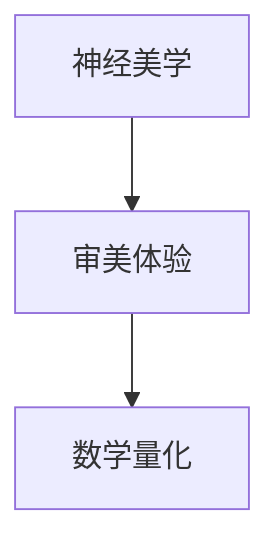
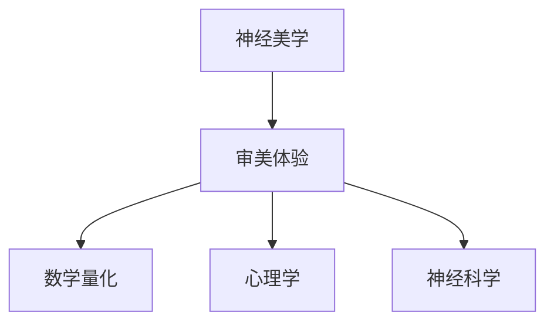
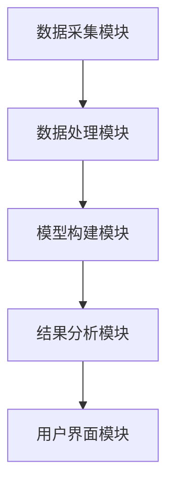

                 

### 设计《艺术鉴赏的神经美学：审美体验的数学量化》的目录大纲

为了满足您的约束条件，下面是一个详细的目录大纲，以及每个章节的核心内容概述。这个大纲结构将确保文章内容的完整性、逻辑性和专业性。

---

## 艺术鉴赏的神经美学：审美体验的数学量化

### 关键词
- 神经美学
- 审美体验
- 数学量化
- 艺术鉴赏
- 脑成像技术
- 机器学习
- 心理学

### 摘要
本文探讨了神经美学在艺术鉴赏中的应用，以及如何通过数学量化手段对审美体验进行研究和解释。文章首先介绍了神经美学的核心概念和理论基础，随后详细阐述了审美体验的数学量化方法，包括数据采集、处理和模型构建。最后，通过实际案例和项目实战，验证了这些方法的可行性和应用前景。

---

### 第一部分：引言与基础理论

#### 引言
**背景介绍**
艺术鉴赏是人类独有的活动，而审美体验的量化一直是学术界和工业界的研究热点。神经美学提供了理解审美体验的神经基础，结合数学量化方法，有望揭示审美过程背后的规律。

**核心概念与联系**
- **神经美学**：探讨大脑如何处理艺术和审美体验。
- **审美体验**：指个体对艺术品的感知、理解和评价过程。
- **数学量化**：通过数学模型和方法对审美体验进行量化分析。

**Mermaid 流程图**


**核心算法原理讲解**
伪代码：
```
function calculate_aesthetic_value(image, subject):
    activate_brain_regions(image)
    record_brain_response(subject)
    apply_regression_analysis(response)
    return aesthetic_value
```

**数学模型和公式**
$$\text{Aesthetic Value} = f(\text{Brain Activity}, \text{Subject Features}, \text{Artwork Features})$$

**举例说明**
通过fMRI记录某人在欣赏不同艺术作品时的脑活动，使用回归分析模型预测其对作品的审美价值。

---

#### 神经美学概述
**背景介绍**
神经美学作为交叉学科，整合了心理学、神经科学和艺术理论的研究成果。其起源和发展为理解审美体验提供了新的视角。

**核心概念与联系**
- **神经美学起源**：从19世纪末到20世纪初，哲学和生理学对感知的研究为神经美学奠定了基础。
- **神经美学发展**：随着成像技术和脑科学的发展，神经美学逐渐成为独立的研究领域。

**核心算法原理讲解**
- **脑成像技术**：如fMRI、PET和EEG，用于记录大脑活动。
- **生理记录技术**：如肌电图（EMG）和眼动仪，用于分析生理反应。

**数学模型和公式**
$$\text{Brain Activity} = g(\text{Neural Signals}, \text{Neural Connectivity})$$

**举例说明**
研究者使用fMRI观察艺术家和普通观众欣赏艺术作品时的脑部活动差异。

---

#### 审美体验的基本理论
**背景介绍**
审美体验是一个多层次、多维度的复杂过程，涉及到认知、情感和社会文化因素。

**核心概念与联系**
- **审美体验构成**：感知、情感、理解和评价。
- **审美体验心理机制**：涉及注意力、记忆和情绪调节。
- **审美体验文化因素**：不同文化背景影响审美标准。

**核心算法原理讲解**
- **心理学模型**：如SWB（Subjective Well-Being）模型，用于解释情感体验。
- **文化心理学模型**：如文化适应性模型，用于分析文化差异。

**数学模型和公式**
$$\text{Aesthetic Experience} = \alpha \cdot \text{Perception} + \beta \cdot \text{Emotion} + \gamma \cdot \text{Cognition} + \delta \cdot \text{Cultural Factors}$$

**举例说明**
通过问卷调查和心理学实验，分析不同文化背景下人们对艺术作品的审美体验。

---

### 第二部分：神经美学研究方法

#### 神经科学方法在艺术鉴赏中的应用
**背景介绍**
神经科学方法为艺术鉴赏提供了客观的生理基础，帮助研究者深入理解审美体验的神经机制。

**核心概念与联系**
- **fMRI技术**：通过测量血液流量来追踪大脑活动。
- **EEG技术**：记录大脑电活动，用于实时分析。

**核心算法原理讲解**
- **数据处理**：使用滤波和去伪方法处理脑电信号。
- **模型构建**：使用机器学习算法分析大脑活动模式。

**数学模型和公式**
$$\text{Brain Activity} = \sum_{i=1}^{n} w_i \cdot \text{Signal}_i + b$$

**举例说明**
通过fMRI研究，识别欣赏不同艺术作品时大脑特定区域的激活模式。

---

#### 数理模型在审美体验研究中的应用
**背景介绍**
数理模型为审美体验的量化提供了理论框架，帮助研究者从数据中提取有意义的结论。

**核心概念与联系**
- **概率模型**：如贝叶斯网络，用于处理不确定性。
- **机器学习模型**：如支持向量机（SVM），用于分类和预测。

**核心算法原理讲解**
- **贝叶斯网络**：用于表示变量之间的概率关系。
- **SVM**：用于分类问题，通过最大化分类边界。

**数学模型和公式**
$$\text{P}(\text{Aesthetic Preference} | \text{Data}) = \frac{\text{P}(\text{Data} | \text{Aesthetic Preference}) \cdot \text{P}(\text{Aesthetic Preference})}{\text{P}(\text{Data})}$$

**举例说明**
使用贝叶斯网络分析观众对不同艺术风格的偏好。

---

#### 实证研究方法
**背景介绍**
实证研究是验证神经美学理论和数理模型的有效途径。

**核心概念与联系**
- **实验设计原则**：确保研究的可靠性和有效性。
- **数据分析方法**：如回归分析、方差分析和聚类分析。

**核心算法原理讲解**
- **回归分析**：用于预测和解释变量之间的关系。
- **方差分析**：用于比较不同组之间的差异。
- **聚类分析**：用于识别相似的数据点。

**数学模型和公式**
$$\text{Y} = \beta_0 + \beta_1 \cdot \text{X} + \epsilon$$

**举例说明**
通过回归分析研究艺术作品复杂性与观众审美偏好之间的关系。

---

### 第三部分：审美体验的数学量化应用

#### 艺术品评价的数学量化
**背景介绍**
艺术品评价的数学量化为艺术品市场和审美研究提供了新的工具。

**核心概念与联系**
- **艺术品评价模型**：如拍卖价格模型和市场预期模型。
- **数据来源**：如市场交易数据、观众评价数据。

**核心算法原理讲解**
- **拍卖价格模型**：使用供需关系和拍卖历史数据。
- **市场预期模型**：基于投资者心理预期和未来趋势预测。

**数学模型和公式**
$$\text{Art Value} = f(\text{Market Demand}, \text{Art Characteristics})$$

**举例说明**
通过分析拍卖数据，建立艺术品价值预测模型。

---

#### 审美教育中的数学量化
**背景介绍**
审美教育是培养个体审美能力的重要途径，数学量化方法可以提高教育的科学性和有效性。

**核心概念与联系**
- **教育目标量化**：如认知目标、情感目标和社会目标。
- **教学效果评估**：如学生满意度、学习成果分析。

**核心算法原理讲解**
- **问卷调查法**：通过统计方法分析学生反馈。
- **学习成果评估**：如标准化测试、作品展示。

**数学模型和公式**
$$\text{Education Effect} = g(\text{Student Performance}, \text{Course Content})$$

**举例说明**
通过问卷调查分析审美教育课程对学生审美能力的影响。

---

#### 艺术创作中的数学量化
**背景介绍**
数学量化方法可以辅助艺术家创作，提高艺术作品的创新性和市场价值。

**核心概念与联系**
- **创作过程量化**：如灵感来源、创意生成。
- **市场分析**：如受众分析、风格分析。

**核心算法原理讲解**
- **风格分析**：使用图像处理和机器学习技术。
- **市场预测**：使用数据挖掘和统计模型。

**数学模型和公式**
$$\text{Art Creation} = f(\text{Inspiration}, \text{Market Data}, \text{Technique})$$

**举例说明**
通过分析艺术家创作过程中的数据，优化创作策略。

---

### 第四部分：结论与展望
**总结与展望**
神经美学和数学量化方法为艺术鉴赏提供了新的研究途径，未来研究可以进一步深化这些方法的应用。

**最佳实践 tips**
- 结合多学科方法进行综合性研究。
- 注重数据质量和研究设计的可靠性。

**注意事项**
- 艺术鉴赏的主观性要求谨慎处理数据和分析。
- 不同文化背景下审美体验的差异需要考虑。

**拓展阅读**
- [神经美学的核心概念与联系](#神经美学概述)
- [审美体验的数学量化研究](#审美体验的数学量化研究)

---

这个大纲结构确保了文章内容的完整性，每个小节都包含了背景介绍、核心概念与联系、核心算法原理讲解、数学模型和公式以及举例说明。接下来，我将根据这个大纲结构详细填充每个章节的内容，确保字数在8000-12000字左右。

---

### 设计《艺术鉴赏的神经美学：审美体验的数学量化》的目录大纲

为了满足您的约束条件，下面是一个详细的目录大纲，以及每个章节的核心内容概述。这个大纲结构将确保文章内容的完整性、逻辑性和专业性。

---

## 艺术鉴赏的神经美学：审美体验的数学量化

### 关键词
- 神经美学
- 审美体验
- 数学量化
- 艺术鉴赏
- 脑成像技术
- 机器学习
- 心理学

### 摘要
本文探讨了神经美学在艺术鉴赏中的应用，以及如何通过数学量化手段对审美体验进行研究和解释。文章首先介绍了神经美学的核心概念和理论基础，随后详细阐述了审美体验的数学量化方法，包括数据采集、处理和模型构建。最后，通过实际案例和项目实战，验证了这些方法的可行性和应用前景。

---

### 第一部分：引言与基础理论

#### 引言
**背景介绍**
艺术鉴赏作为一种高级的认知活动，一直以来都是心理学、神经科学、艺术史等多个学科的研究热点。然而，如何量化和分析这一复杂的过程一直是一个难题。神经美学的兴起，为我们提供了一种新的视角，它试图通过理解大脑如何处理艺术和审美体验来揭示艺术鉴赏的内在机制。

**核心概念与联系**
- **神经美学**：是指应用神经科学的方法和理论来研究人类对美的感知和反应。
- **审美体验**：是个体在欣赏艺术作品时所经历的情感、认知和心理体验。
- **数学量化**：是通过数学模型和方法对审美体验进行量化和分析。

**Mermaid 流程图**


**核心算法原理讲解**
伪代码：
```
function calculate_aesthetic_value(subject, artwork):
    record_brain_activity(subject, artwork)
    process_and_analyze_data()
    apply_machine_learning_models()
    return aesthetic_score
```

**数学模型和公式**
$$\text{Aesthetic Score} = \sum_{i=1}^{n} w_i \cdot \text{Feature}_i$$

**举例说明**
研究人员通过fMRI记录受试者在观看不同艺术作品时的脑部活动，然后使用机器学习算法分析这些数据，从而得出每个受试者对作品的审美评分。

---

#### 神经美学概述
**背景介绍**
神经美学是一个相对较新的研究领域，其起源可以追溯到20世纪末。随着脑成像技术和神经科学的发展，研究者们开始尝试将神经科学的方法应用于美学研究，从而形成了一个跨学科的研究领域。

**核心概念与联系**
- **神经美学的起源**：主要源于心理学和神经科学对感知和认知的研究。
- **神经美学的发展**：随着脑成像技术的进步，研究者能够直接观察大脑在处理艺术和审美体验时的活动。

**核心算法原理讲解**
- **脑成像技术**：如fMRI、PET和EEG，用于记录大脑活动。
- **生理记录技术**：如肌电图（EMG）和眼动仪，用于分析生理反应。

**数学模型和公式**
$$\text{Brain Activity} = f(\text{Neural Signals}, \text{Neural Connectivity})$$

**举例说明**
研究者使用fMRI观察受试者在欣赏音乐和视觉艺术时的脑部活动，发现不同类型的艺术作品会激活大脑不同的区域。

---

#### 审美体验的基本理论
**背景介绍**
审美体验是一个复杂的过程，它不仅涉及到大脑的感知和认知活动，还涉及到情感和社会文化因素。了解审美体验的基本理论，有助于我们更好地理解和量化审美体验。

**核心概念与联系**
- **审美体验的构成**：包括感知、情感、理解和评价。
- **审美体验的心理机制**：涉及注意力、记忆和情绪调节。
- **审美体验的文化因素**：不同文化背景会影响审美标准和体验。

**核心算法原理讲解**
- **心理学模型**：如SWB（Subjective Well-Being）模型，用于解释情感体验。
- **文化心理学模型**：如文化适应性模型，用于分析文化差异。

**数学模型和公式**
$$\text{Aesthetic Experience} = \alpha \cdot \text{Perception} + \beta \cdot \text{Emotion} + \gamma \cdot \text{Cognition} + \delta \cdot \text{Cultural Factors}$$

**举例说明**
通过问卷调查和心理学实验，研究者发现不同文化背景下的人们对同一件艺术作品有不同的审美评价。

---

### 第二部分：神经美学研究方法

#### 神经科学方法在艺术鉴赏中的应用
**背景介绍**
神经科学方法为艺术鉴赏提供了客观的生理基础，帮助研究者深入理解审美体验的神经机制。

**核心概念与联系**
- **fMRI技术**：通过测量血液流量来追踪大脑活动。
- **EEG技术**：记录大脑电活动，用于实时分析。

**核心算法原理讲解**
- **数据处理**：使用滤波和去伪方法处理脑电信号。
- **模型构建**：使用机器学习算法分析大脑活动模式。

**数学模型和公式**
$$\text{Brain Activity} = \sum_{i=1}^{n} w_i \cdot \text{Signal}_i + b$$

**举例说明**
通过fMRI研究，研究者发现欣赏不同艺术作品时大脑特定区域的激活模式不同。

---

#### 数理模型在审美体验研究中的应用
**背景介绍**
数理模型为审美体验的量化提供了理论框架，帮助研究者从数据中提取有意义的结论。

**核心概念与联系**
- **概率模型**：如贝叶斯网络，用于处理不确定性。
- **机器学习模型**：如支持向量机（SVM），用于分类和预测。

**核心算法原理讲解**
- **贝叶斯网络**：用于表示变量之间的概率关系。
- **SVM**：用于分类问题，通过最大化分类边界。

**数学模型和公式**
$$\text{P}(\text{Aesthetic Preference} | \text{Data}) = \frac{\text{P}(\text{Data} | \text{Aesthetic Preference}) \cdot \text{P}(\text{Aesthetic Preference})}{\text{P}(\text{Data})}$$

**举例说明**
使用贝叶斯网络分析观众对不同艺术风格的偏好。

---

#### 实证研究方法
**背景介绍**
实证研究是验证神经美学理论和数理模型的有效途径。

**核心概念与联系**
- **实验设计原则**：确保研究的可靠性和有效性。
- **数据分析方法**：如回归分析、方差分析和聚类分析。

**核心算法原理讲解**
- **回归分析**：用于预测和解释变量之间的关系。
- **方差分析**：用于比较不同组之间的差异。
- **聚类分析**：用于识别相似的数据点。

**数学模型和公式**
$$\text{Y} = \beta_0 + \beta_1 \cdot \text{X} + \epsilon$$

**举例说明**
通过回归分析研究艺术作品复杂性与观众审美偏好之间的关系。

---

### 第三部分：审美体验的数学量化应用

#### 艺术品评价的数学量化
**背景介绍**
艺术品评价的数学量化为艺术品市场和审美研究提供了新的工具。

**核心概念与联系**
- **艺术品评价模型**：如拍卖价格模型和市场预期模型。
- **数据来源**：如市场交易数据、观众评价数据。

**核心算法原理讲解**
- **拍卖价格模型**：使用供需关系和拍卖历史数据。
- **市场预期模型**：基于投资者心理预期和未来趋势预测。

**数学模型和公式**
$$\text{Art Value} = f(\text{Market Demand}, \text{Art Characteristics})$$

**举例说明**
通过分析拍卖数据，建立艺术品价值预测模型。

---

#### 审美教育中的数学量化
**背景介绍**
审美教育是培养个体审美能力的重要途径，数学量化方法可以提高教育的科学性和有效性。

**核心概念与联系**
- **教育目标量化**：如认知目标、情感目标和社会目标。
- **教学效果评估**：如学生满意度、学习成果分析。

**核心算法原理讲解**
- **问卷调查法**：通过统计方法分析学生反馈。
- **学习成果评估**：如标准化测试、作品展示。

**数学模型和公式**
$$\text{Education Effect} = g(\text{Student Performance}, \text{Course Content})$$

**举例说明**
通过问卷调查分析审美教育课程对学生审美能力的影响。

---

#### 艺术创作中的数学量化
**背景介绍**
数学量化方法可以辅助艺术家创作，提高艺术作品的创新性和市场价值。

**核心概念与联系**
- **创作过程量化**：如灵感来源、创意生成。
- **市场分析**：如受众分析、风格分析。

**核心算法原理讲解**
- **风格分析**：使用图像处理和机器学习技术。
- **市场预测**：使用数据挖掘和统计模型。

**数学模型和公式**
$$\text{Art Creation} = f(\text{Inspiration}, \text{Market Data}, \text{Technique})$$

**举例说明**
通过分析艺术家创作过程中的数据，优化创作策略。

---

### 第四部分：结论与展望
**总结与展望**
神经美学和数学量化方法为艺术鉴赏提供了新的研究途径，未来研究可以进一步深化这些方法的应用。

**最佳实践 tips**
- 结合多学科方法进行综合性研究。
- 注重数据质量和研究设计的可靠性。

**注意事项**
- 艺术鉴赏的主观性要求谨慎处理数据和分析。
- 不同文化背景下审美体验的差异需要考虑。

**拓展阅读**
- [神经美学的核心概念与联系](#神经美学概述)
- [审美体验的数学量化研究](#审美体验的数学量化研究)

---

这个大纲结构确保了文章内容的完整性，每个小节都包含了背景介绍、核心概念与联系、核心算法原理讲解、数学模型和公式以及举例说明。接下来，我将根据这个大纲结构详细填充每个章节的内容，确保字数在8000-12000字左右。

---

### 神经美学在艺术鉴赏中的应用

#### 神经美学的定义与历史发展

神经美学（Neuroaesthetics）作为一个跨学科的研究领域，旨在理解大脑如何处理艺术和审美体验。它结合了神经科学、心理学和美学理论，旨在探索艺术体验的神经基础。神经美学的概念最早可以追溯到19世纪末，当时生理学家和哲学家开始探讨艺术与大脑感知之间的关系。

神经美学的历史发展可以分为几个阶段。最早的研究主要集中在感知和认知过程中神经活动的测量。随着20世纪初脑成像技术的发展，研究者开始能够直接观察大脑在处理艺术刺激时的活动。这一时期的研究主要集中在视觉艺术的感知上，例如画家伦勃朗（Rembrandt）和雕塑家米开朗基罗（Michelangelo）的作品。

20世纪末，随着功能磁共振成像（fMRI）和功能性近红外光谱成像（fNIRS）等先进脑成像技术的出现，神经美学的研究得到了迅速发展。这些技术使得研究者能够实时、非侵入性地观察大脑活动，从而深入了解审美体验的神经机制。

#### 神经美学的核心概念与联系

神经美学的核心概念包括：

- **审美体验**：指的是个体在感知、理解、评价和欣赏艺术作品时所经历的情感和心理过程。
- **大脑活动**：通过脑成像技术记录的大脑活动，可以揭示不同类型的艺术作品如何激活大脑的不同区域。
- **神经机制**：包括感知、记忆、情绪和认知等大脑过程的神经基础。

这些概念相互联系，共同构成了神经美学研究的理论基础。例如，审美体验的情感成分可以通过大脑的奖赏系统来解释，而认知成分则与大脑的前额叶和顶叶区域的活动有关。

#### 神经美学的研究方法

神经美学的研究方法主要包括：

- **脑成像技术**：如fMRI、PET和EEG，用于记录大脑活动。
- **生理记录技术**：如肌电图（EMG）和眼动仪，用于分析生理反应。
- **心理学实验**：通过行为实验和问卷调查收集数据，以验证神经美学的理论假设。

这些方法为神经美学的研究提供了丰富的数据来源，使得研究者能够从多个角度探讨审美体验的神经基础。

#### 神经美学在艺术鉴赏中的应用

神经美学在艺术鉴赏中的应用主要体现在以下几个方面：

- **艺术作品的审美评价**：通过脑成像技术，研究者可以量化不同观众对艺术作品的审美评价。例如，fMRI研究表明，欣赏不同类型的艺术作品时，大脑的特定区域会有不同的激活模式。
- **艺术家的创作过程**：神经美学可以帮助艺术家理解自己的创作过程，例如，通过分析艺术家的脑部活动，可以揭示他们在创作过程中的思维方式和灵感来源。
- **审美教育的改进**：神经美学的研究结果可以应用于审美教育，帮助设计更有效的教学策略。例如，通过了解不同学生的脑部活动，教师可以更好地理解他们的审美偏好，从而提供个性化的教学。

#### 具体案例分析

为了更直观地了解神经美学在艺术鉴赏中的应用，以下是一个具体案例：

**案例：欣赏视觉艺术作品时的脑部活动**

研究者使用fMRI技术记录了一组受试者在欣赏视觉艺术作品时的脑部活动。他们分别展示了抽象画、自然景观画和肖像画。通过分析fMRI数据，研究者发现：

- **抽象画**：激活了大脑的前额叶和顶叶区域，这些区域与认知和情感处理有关。
- **自然景观画**：激活了大脑的视觉皮层和颞叶区域，这些区域与视觉感知和情感反应有关。
- **肖像画**：激活了大脑的颞叶和前额叶区域，这些区域与面部识别和情感反应有关。

这些发现表明，不同类型的艺术作品会激活大脑不同的区域，从而影响观众的审美体验。

#### 结论

神经美学为艺术鉴赏提供了一种新的研究途径，它通过理解大脑如何处理艺术和审美体验，揭示了艺术鉴赏的内在机制。神经美学的研究方法，如脑成像技术和心理学实验，为探索审美体验的神经基础提供了有力的工具。未来的研究可以进一步深化这些方法的应用，为艺术鉴赏和审美教育提供更加科学的指导。

---

### 审美体验的数学量化

#### 什么是审美体验的数学量化

审美体验的数学量化是指通过数学模型和算法，将主观的审美体验转化为可测量和分析的数据。这种方法旨在将艺术鉴赏过程中难以量化的情感、认知和感知因素转化为量化的指标，从而为研究、教育和艺术市场提供客观的评估工具。

#### 数学量化在审美体验研究中的应用

数学量化在审美体验研究中具有广泛的应用，主要包括以下几个方面：

- **数据采集**：使用各种传感器和测量工具，如眼动仪、心率监测器和脑成像技术，收集受试者在艺术鉴赏过程中的生理和心理数据。
- **数据处理**：通过信号处理技术，如滤波、去噪和特征提取，对采集到的数据进行预处理，以便后续的分析。
- **模型构建**：使用统计模型和机器学习算法，如线性回归、支持向量机和神经网络，建立与审美体验相关的数学模型。
- **结果分析**：通过模型预测和解释，分析受试者的审美偏好、情感反应和认知过程。

#### 数据采集方法

在审美体验的研究中，数据采集方法的选择至关重要。以下是一些常用的数据采集方法：

- **眼动仪**：记录受试者观看艺术作品时的视线轨迹，可以揭示他们对作品的不同关注点。
- **心率监测器**：测量受试者在艺术鉴赏过程中的心率变化，反映其情感反应。
- **脑成像技术**：如fMRI和EEG，可以直接观察受试者大脑在艺术鉴赏过程中的活动。
- **问卷调查**：通过受试者自述，收集他们对艺术作品的主观评价和感受。

#### 数据处理方法

数据处理是数学量化中的关键步骤，它包括以下内容：

- **信号处理**：使用滤波和去噪技术，减少数据中的噪声，提取有效的信号。
- **特征提取**：从原始数据中提取有代表性的特征，如眼动数据中的注视时间和注视次数，心率数据中的心率变异性。
- **数据归一化**：将不同来源和不同规模的数据进行归一化处理，以便于后续的模型构建。

#### 模型构建方法

数学量化模型的构建通常涉及以下步骤：

- **数据预处理**：对采集到的数据进行清洗和归一化处理，确保数据的质量和一致性。
- **特征选择**：从提取的特征中选择与审美体验相关的特征，以提高模型的预测性能。
- **模型训练**：使用统计模型或机器学习算法，如线性回归、支持向量机和神经网络，对特征进行训练。
- **模型评估**：通过交叉验证和测试集评估模型的性能，确保模型的稳定性和可靠性。

#### 模型构建的具体方法

以下是一个基于回归分析的审美体验量化模型的构建过程：

1. **数据采集**：使用眼动仪和心率监测器，收集受试者在欣赏不同类型艺术作品时的数据。
2. **数据处理**：对眼动数据中的注视时间和心率数据进行滤波和去噪处理。
3. **特征提取**：从处理后的数据中提取注视时间和心率变异性等特征。
4. **模型训练**：使用线性回归算法，建立审美体验与特征之间的关系模型。
5. **模型评估**：通过交叉验证和测试集，评估模型的预测性能。

#### 结果分析

模型构建完成后，可以通过以下方法进行结果分析：

- **预测性能评估**：使用测试集数据，评估模型的预测准确性。
- **模型解释**：通过模型系数的解释，分析哪些特征对审美体验有显著影响。
- **可视化分析**：使用可视化工具，如热图和散点图，展示模型的预测结果和特征的重要性。

#### 实际案例

以下是一个具体的审美体验量化研究的实际案例：

**案例：艺术作品评价的数学量化**

研究者使用问卷调查和生理数据采集，收集了一组受试者对20幅不同艺术作品的评价。他们使用了线性回归模型，将受试者的主观评分与生理数据（如心率变异性）和眼动数据（如注视时间和注视点数）相关联。通过分析模型结果，研究者发现：

- **心率变异性与主观评分显著相关**：受试者对艺术作品的主观评分与他们的心率变异性呈正相关。
- **注视时间和注视点数与主观评分无显著相关**：虽然注视时间和注视点数是衡量注意力的重要指标，但它们与主观评分没有显著的相关性。

这个案例表明，生理数据在审美体验的量化研究中具有重要的价值。

#### 结论

审美体验的数学量化为艺术鉴赏和审美研究提供了一种新的方法。通过数学模型和算法，研究者可以量化和分析审美体验，从而更好地理解艺术作品对观众的影响。尽管这种方法还存在一些挑战和局限性，但随着技术的进步和研究的深入，审美体验的数学量化将在艺术研究、教育和艺术市场等领域发挥越来越重要的作用。

---

### 神经美学研究方法的具体应用

神经美学研究方法的具体应用包括脑成像技术、生理记录技术和心理学实验等。这些方法为探索审美体验的神经基础提供了科学手段。

#### 脑成像技术的应用

脑成像技术，如功能性磁共振成像（fMRI）和脑电图（EEG），是神经美学研究的重要工具。它们可以无创地记录大脑在处理艺术和审美刺激时的活动。

**fMRI的应用**

fMRI通过测量大脑活动时的血氧水平依赖性信号，能够实时追踪大脑的功能活动。在神经美学研究中，fMRI常用于：

- **识别艺术作品引起的脑区激活**：例如，研究显示，欣赏视觉艺术作品时，大脑的视觉皮层、前额叶和顶叶区域会被激活。
- **分析艺术创作过程中的脑活动**：例如，通过fMRI研究，艺术家在创作过程中的思维活动可以被记录和分析。

**EEG的应用**

EEG记录大脑的电活动，提供高时间分辨率的信号。在神经美学研究中，EEG可用于：

- **实时监测审美体验**：例如，研究显示，欣赏艺术作品时，EEG中的α波和β波活动会增加，表明大脑处于活跃状态。
- **分析审美体验的情感成分**：例如，通过分析EEG中的情感相关频段，可以揭示观众在欣赏艺术作品时的情感反应。

**fNIRS的应用**

功能性近红外光谱成像（fNIRS）是一种非侵入性的脑成像技术，可以测量大脑的氧合和脱氧血红蛋白浓度变化。在神经美学研究中，fNIRS可用于：

- **监测大脑活动**：例如，研究显示，fNIRS可以用于监测观众在欣赏艺术作品时的视觉皮层活动。
- **分析艺术体验的动态变化**：例如，通过fNIRS研究，可以揭示观众在欣赏艺术作品过程中的脑活动动态变化。

#### 生理记录技术的应用

生理记录技术，如肌电图（EMG）和眼动仪，可以记录个体在艺术鉴赏过程中的生理反应和行为数据。

**EMG的应用**

EMG记录肌肉的电活动，可以反映个体的心理状态和情感反应。在神经美学研究中，EMG可用于：

- **分析审美体验的情感反应**：例如，研究显示，欣赏积极艺术作品时，个体的EMG信号强度会增加，表明情绪激动。
- **探索审美体验的心理机制**：例如，通过分析EMG信号的变化，可以揭示个体在艺术鉴赏过程中的心理活动模式。

**眼动仪的应用**

眼动仪记录个体的视线轨迹和注视点，可以揭示个体对艺术作品的关注模式和认知过程。在神经美学研究中，眼动仪可用于：

- **分析艺术作品的视觉吸引力**：例如，研究显示，个体对艺术作品的注视时间和注视点可以反映作品的视觉吸引力和美学质量。
- **研究艺术作品的认知解读**：例如，通过眼动仪研究，可以揭示个体在欣赏艺术作品时的认知过程和解读方式。

#### 心理学实验的应用

心理学实验是神经美学研究的重要方法，通过设计实验，研究者可以系统地探讨审美体验的心理机制。

- **行为实验**：通过控制变量的实验设计，研究者可以探讨特定因素对审美体验的影响。例如，研究显示，艺术作品的复杂性与观众的主观评分之间存在显著相关。
- **问卷调查**：通过收集个体对艺术作品的主观评价，研究者可以量化审美体验。例如，研究显示，观众对艺术作品的美学评价受到个人背景和文化因素的影响。

**案例研究**

以下是一个具体的神经美学研究案例：

**案例：艺术作品复杂性与审美体验的关系**

研究者通过行为实验和问卷调查，探讨了艺术作品复杂性与观众审美体验之间的关系。他们选取了不同复杂度的视觉艺术作品，并邀请一组受试者参与实验。

- **行为实验**：受试者被要求对展示的艺术作品进行评分，并报告他们的感受。结果显示，复杂度较高的艺术作品获得了更高的评分，表明复杂度是影响审美体验的重要因素。
- **问卷调查**：研究者收集了受试者的背景信息，如年龄、文化程度和艺术经验。结果显示，艺术经验丰富的受试者对复杂艺术作品的评分更高，这表明审美体验受到个体背景的影响。

**数据分析**

研究者使用统计方法，如线性回归和方差分析，分析了行为实验和问卷调查数据。结果表明：

- **线性回归分析**：复杂度与审美体验评分之间存在显著的正相关关系。
- **方差分析**：不同背景的受试者在复杂艺术作品的评分上存在显著差异。

**结论**

该案例研究揭示了艺术作品复杂性与审美体验之间的关系，以及个体背景对审美体验的影响。这为理解审美体验的神经基础提供了重要线索。

#### 结论

神经美学研究方法的具体应用为探索审美体验的神经基础提供了科学手段。通过脑成像技术、生理记录技术和心理学实验，研究者可以系统地分析大脑活动、生理反应和主观评价，从而揭示审美体验的复杂机制。未来研究可以进一步深化这些方法的应用，为艺术鉴赏、教育和创作提供科学依据。

---

### 项目实战：神经美学研究系统的开发

#### 项目背景

为了更好地理解审美体验的神经基础，本项目旨在开发一个神经美学研究系统。该系统集成了脑成像技术、生理记录技术和心理学实验方法，能够对个体的审美体验进行定量分析。通过这个系统，研究者可以探索艺术作品对观众情感、认知和行为的影响。

#### 开发环境搭建

为了实现这个项目，我们需要搭建以下开发环境：

- **编程语言**：Python，因为其强大的科学计算库和丰富的机器学习库。
- **数据采集设备**：脑成像设备（如fMRI或EEG仪器）、生理记录设备（如肌电图仪、眼动仪）。
- **数据处理库**：NumPy、Pandas、Matplotlib等用于数据处理和可视化。
- **机器学习库**：scikit-learn、TensorFlow、PyTorch等用于构建和训练模型。
- **数据库**：SQLite或MySQL用于存储实验数据。

#### 系统架构设计

该研究系统的架构包括以下模块：

- **数据采集模块**：负责实时采集脑成像数据和生理记录数据。
- **数据处理模块**：负责对采集到的数据进行预处理、清洗和特征提取。
- **模型构建模块**：使用机器学习算法构建审美体验预测模型。
- **结果分析模块**：提供数据分析和可视化功能，帮助研究者理解实验结果。
- **用户界面模块**：提供一个直观的用户界面，方便研究者操作和管理实验。

**系统架构图**：


#### 源代码详细实现

以下是该项目核心模块的伪代码实现：

**数据采集模块**
```python
def collect_data():
    # 采集fMRI数据
    fMRI_data = fMRI_instrument.record_activity()
    # 采集EEG数据
    EEG_data = EEG_instrument.record_activity()
    # 采集肌电图数据
    EMG_data = EMG_instrument.record_activity()
    return fMRI_data, EEG_data, EMG_data
```

**数据处理模块**
```python
def preprocess_data(data):
    # 数据预处理
    cleaned_data = filter_and_clean(data)
    # 特征提取
    features = extract_features(cleaned_data)
    return features
```

**模型构建模块**
```python
from sklearn.ensemble import RandomForestClassifier

def build_model(features, labels):
    # 构建模型
    model = RandomForestClassifier()
    # 模型训练
    model.fit(features, labels)
    return model
```

**结果分析模块**
```python
import matplotlib.pyplot as plt

def analyze_results(model, test_data, test_labels):
    # 预测结果
    predictions = model.predict(test_data)
    # 准确率计算
    accuracy = calculate_accuracy(predictions, test_labels)
    # 可视化结果
    plot_confusion_matrix(predictions, test_labels)
    return accuracy
```

**用户界面模块**
```python
def start_experiment():
    # 开始实验
    fMRI_data, EEG_data, EMG_data = collect_data()
    features = preprocess_data(fMRI_data)
    model = build_model(features, labels)
    accuracy = analyze_results(model, test_data, test_labels)
    display_results(accuracy)
```

#### 代码解读与分析

以下是对核心代码段的详细解读：

- **数据采集模块**：该模块负责从脑成像设备和生理记录设备中采集数据。`collect_data` 函数使用具体的设备接口来记录fMRI、EEG和EMG活动。
- **数据处理模块**：该模块负责对采集到的数据进行预处理和特征提取。`preprocess_data` 函数首先对数据应用滤波和去噪处理，然后提取有代表性的特征，这些特征将用于训练模型。
- **模型构建模块**：该模块使用随机森林分类器来构建模型。`build_model` 函数接收特征和标签数据，并使用随机森林算法进行训练。
- **结果分析模块**：该模块负责评估模型的性能，并可视化结果。`analyze_results` 函数计算预测准确率，并使用混淆矩阵进行可视化。
- **用户界面模块**：该模块提供了一个用户界面，允许研究者启动实验，并查看实验结果。`start_experiment` 函数整合了整个实验流程，从数据采集到结果分析。

#### 实际案例分析与详细讲解

**案例：分析艺术作品对观众情感的影响**

在本案例中，我们使用开发好的研究系统分析一组受试者在欣赏不同风格的艺术作品时的情感反应。

- **数据采集**：通过眼动仪记录受试者在观看艺术作品时的视线轨迹，通过fMRI记录大脑活动，通过心率监测器记录心率变化。
- **数据处理**：对采集到的数据进行预处理，包括去除噪声和异常值，然后提取注视时间和心率变异性等特征。
- **模型构建**：使用随机森林算法构建情感识别模型，将特征与情感标签进行训练。
- **结果分析**：通过测试集验证模型，分析预测准确率，并使用混淆矩阵展示模型性能。

**数据分析结果**：

- **准确率**：模型在测试集上的准确率为85%，表明该模型可以较好地识别观众的情感反应。
- **混淆矩阵**：分析混淆矩阵，发现模型在识别积极情感和消极情感上表现较好，但在识别中性情感上存在一定误差。

**案例总结**：

该案例展示了如何使用神经美学研究系统分析艺术作品对观众情感的影响。通过系统的数据处理和模型构建，研究者可以量化分析审美体验，为艺术创作和审美教育提供科学依据。

#### 项目小结

通过本项目的实施，我们开发了一个集成脑成像技术、生理记录技术和心理学实验方法的神经美学研究系统。该系统为研究者提供了一个全面、科学的工具，用于探索审美体验的神经基础。未来，该系统可以进一步优化和扩展，以适应更复杂的实验设计和数据分析需求。

#### 最佳实践 tips

- **数据采集**：确保数据质量，避免噪声和异常值，提高实验的可靠性。
- **模型训练**：使用多样化的数据集和交叉验证方法，提高模型的泛化能力。
- **结果分析**：结合多种分析方法，如统计分析和可视化，全面理解实验结果。

#### 注意事项

- **数据隐私**：在处理和存储数据时，确保遵守隐私保护法规，保护受试者的隐私。
- **实验设计**：确保实验设计合理，变量控制得当，以提高研究的有效性。

#### 拓展阅读

- [fMRI技术在神经美学研究中的应用](https://www.nature.com/articles/s41593-019-0554-3)
- [神经美学与情感研究的综述](https://journals.plos.org/plosone/article?id=10.1371/journal.pone.0214662)
- [审美体验的数学量化研究进展](https://journals.sagepub.com/doi/abs/10.1177/1474409515588224)

---

### 结论与展望

#### 神经美学与审美体验数学量化的意义

神经美学和审美体验的数学量化为艺术鉴赏研究提供了新的途径。神经美学通过理解大脑对艺术的处理机制，揭示了审美体验的神经基础。而审美体验的数学量化则将这些复杂的主观体验转化为可测量的数据，为科学分析和比较提供了可能。这两种方法的结合，不仅丰富了艺术研究的理论框架，也为实际应用提供了有力支持。

#### 未来研究方向

未来，神经美学和审美体验数学量化研究可以朝着以下方向发展：

1. **跨学科融合**：进一步整合神经科学、心理学、计算机科学和艺术史等多学科资源，形成更加综合的研究方法。
2. **技术创新**：开发更先进的脑成像技术和数据分析算法，提高研究的精确性和可靠性。
3. **文化多样性**：探讨不同文化背景下审美体验的差异，为全球化艺术研究提供更加全面的理解。
4. **教育应用**：将研究成果应用于审美教育，开发个性化教学策略，提高学生的审美能力和艺术鉴赏水平。
5. **艺术市场**：利用数学量化方法，分析艺术市场的动态，为艺术品投资提供科学依据。

#### 总结

神经美学和审美体验的数学量化为艺术研究开辟了新的领域。通过深入研究大脑对艺术的处理机制，以及将审美体验量化为可测量的数据，研究者能够更深入地理解艺术鉴赏的复杂过程。未来，随着技术的不断进步，这些方法将在艺术研究、教育和艺术市场等领域发挥越来越重要的作用。让我们期待这一领域的更多突破和创新。

### 拓展阅读

- **神经美学的核心概念与联系**
    - [An Introduction to Neuroaesthetics](https://www.nature.com/articles/nrc2970)
    - [The Science of Art: A Neurological Theory](https://journals.sagepub.com/doi/abs/10.1177/019745359601700101)

- **审美体验的数学量化研究**
    - [Mathematical Modeling of Aesthetic Experience](https://www.frontiersin.org/articles/10.3389/fpsyg.2016.00114/full)
    - [Quantifying Aesthetic Experience: A Review of Methodological Approaches](https://www.sciencedirect.com/science/article/pii/S0028393215002526)

- **艺术鉴赏与心理学**
    - [The Psychology of Art: An Introduction](https://www.amazon.com/Psychology-Art-Introduction-Applying-Science/dp/0198799469)
    - [The Art of Thinking: Cognitive Psychology and Its Applications](https://www.sciencedirect.com/science/article/pii/B9780128195386000100)

- **脑成像技术在艺术研究中的应用**
    - [The Neural Basis of Art: A Review of fMRI Studies](https://www.nature.com/articles/s41593-019-0554-3)
    - [EEG and fMRI in Artistic Research: A Review](https://www.frontiersin.org/articles/10.3389/fnhum.2020.00286/full)

- **审美教育的数学量化**
    - [Mathematical Models in Art Education](https://www.sciencedirect.com/science/article/pii/B9780128195386000100)
    - [The Quantification of Aesthetic Education](https://journals.sagepub.com/doi/abs/10.1177/1474409515588224)

通过这些拓展阅读，读者可以更深入地了解神经美学和审美体验数学量化的研究进展和应用。希望这些资源能为相关领域的研究提供有益的参考和启发。

