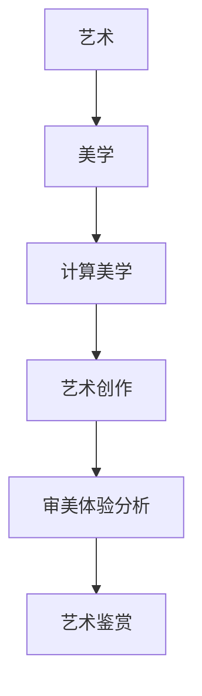
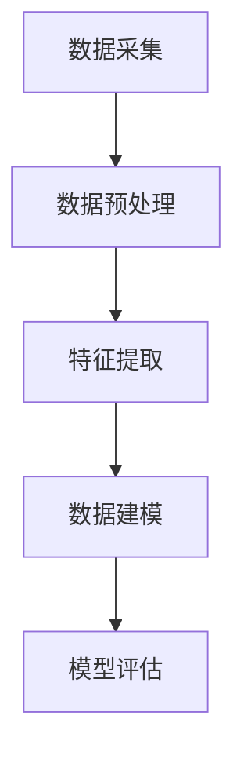
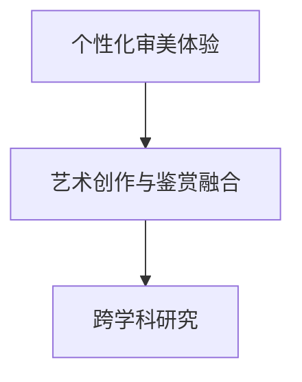
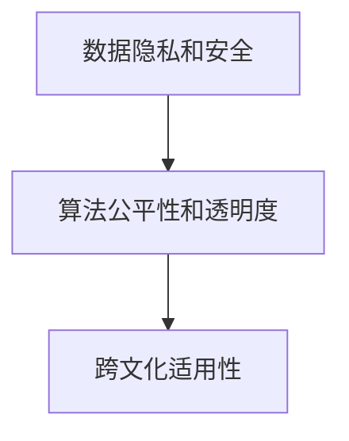

                 


## 艺术鉴赏的计算美学：审美体验的数学量化

### 关键词
- 艺术鉴赏
- 计算美学
- 审美体验
- 数学量化
- 艺术创作
- 数据采集

### 摘要
本文探讨了艺术鉴赏的计算美学，通过数学量化方法对审美体验进行分析。文章首先介绍了艺术与计算美学的关系，然后阐述了审美体验的数学量化基础。接着，文章详细讨论了计算美学在艺术创作中的应用，包括绘画、音乐和建筑等领域。通过实际案例分析，文章展示了计算美学在艺术鉴赏中的具体应用，并探讨了其在艺术教育中的潜在价值。最后，文章提出了计算美学的未来发展趋势和挑战，为相关领域的研究提供了启示。

## 引言

### 目的与意义

艺术鉴赏是人类文化传承和创新的重要组成部分，而计算美学则为艺术鉴赏提供了新的视角和方法。随着人工智能技术的不断发展，如何将审美体验进行数学量化，以便更好地理解和分析艺术作品，成为了一个引人关注的研究课题。本文旨在探讨艺术鉴赏的计算美学，通过数学量化方法对审美体验进行分析，为艺术创作、鉴赏和教育提供理论支持。

### 研究现状与挑战

当前，计算美学在艺术领域已有一定的研究基础，但如何将其应用于艺术鉴赏，尤其是在审美体验的量化方面，仍存在许多挑战。首先，审美体验的主观性和复杂性使得量化方法的建立变得困难。其次，现有的量化方法往往侧重于某一特定领域，缺乏全面性和普适性。此外，艺术作品的多样性和文化背景的差异也增加了研究的复杂性。

### 本书结构安排

本文将从以下几个方面展开：

1. 艺术与计算美学概述
2. 审美体验的数学量化基础
3. 计算美学在艺术创作中的应用
4. 计算美学在艺术鉴赏中的案例分析
5. 计算美学在艺术教育中的应用
6. 计算美学的未来发展趋势与挑战

通过以上六个部分，本文旨在系统探讨计算美学在艺术鉴赏中的应用，为相关领域的研究提供参考。

## 艺术与计算美学概述

### 艺术与美学的定义

艺术是一种通过形式和表现手法传达情感、思想和美的活动。它涵盖了绘画、雕塑、音乐、舞蹈、文学等多种形式，是人类文化的重要组成部分。美学是研究美和审美活动的哲学分支，关注美的本质、审美体验和艺术评价等问题。

### 计算美学的概念

计算美学是美学与计算机科学相结合的领域，旨在通过计算方法和工具来研究和分析审美现象。它涵盖了艺术创作、审美体验的量化、艺术鉴赏等多个方面，旨在为艺术研究和实践提供新的理论和方法。

### 计算美学与艺术的关系

计算美学为艺术创作提供了新的工具和方法，艺术家可以利用计算机技术创造出具有独特审美效果的艺术作品。同时，计算美学也可以帮助人们更好地理解和欣赏艺术作品，通过数学模型和算法来分析审美体验，从而提高艺术鉴赏能力。

### 图1.1：艺术与计算美学的联系



### 表1.1：计算美学的主要原理及其应用领域

| 原理名称 | 描述 | 应用领域 |
| :--: | :--: | :--: |
| 审美感知模型 | 研究审美体验的感知机制 | 艺术创作、艺术鉴赏 |
| 数据分析 | 对大量审美数据进行处理和分析 | 艺术鉴赏、艺术市场分析 |
| 机器学习 | 利用算法模拟审美判断过程 | 艺术评价、个性化推荐 |
| 人工智能 | 结合计算机视觉和自然语言处理技术 | 艺术风格识别、图像生成 |

## 审美体验的数学量化基础

### 审美体验的数学模型

审美体验的数学模型是计算美学研究的基础，旨在通过数学方法量化审美体验的主观评价。以下是一个简化的审美体验数学模型：

$$
E = f(P, A, C)
$$

其中，$E$ 表示审美体验，$P$ 表示感知因素，$A$ 表示审美因素，$C$ 表示文化背景。$f$ 表示一个复合函数，用于综合这些因素得到审美体验的量化结果。

### 感知因素

感知因素包括视觉、听觉、触觉等多种感官体验，这些因素直接影响审美体验。以下是一个感知因素的简化数学模型：

$$
P = \sum_{i=1}^{n} p_i \cdot w_i
$$

其中，$p_i$ 表示第 $i$ 个感知因素的分值，$w_i$ 表示第 $i$ 个感知因素的重要性权重。

### 审美因素

审美因素包括形式、色彩、结构等美学特征，这些因素共同构成审美体验。以下是一个审美因素的简化数学模型：

$$
A = \sum_{j=1}^{m} a_j \cdot w_j
$$

其中，$a_j$ 表示第 $j$ 个审美因素的分值，$w_j$ 表示第 $j$ 个审美因素的重要性权重。

### 文化背景

文化背景对审美体验有重要影响，不同文化背景下人们对同一艺术作品的审美评价可能存在差异。以下是一个文化背景的简化数学模型：

$$
C = \sum_{k=1}^{l} c_k \cdot w_k
$$

其中，$c_k$ 表示第 $k$ 个文化因素的分值，$w_k$ 表示第 $k$ 个文化因素的重要性权重。

### 公式2.1：审美体验的主观评价模型

$$
E = f(P, A, C)
$$

### 审美体验的数据采集与处理

审美体验的数据采集和处理是计算美学研究的关键环节。以下是一个简化的数据采集和处理流程：

1. **数据采集**：通过问卷调查、实验观察等方式收集大量审美体验数据。
2. **数据预处理**：对采集到的数据进行清洗、去重和归一化处理。
3. **特征提取**：从预处理后的数据中提取感知因素、审美因素和文化背景的特征。
4. **数据建模**：利用统计学方法和机器学习算法建立审美体验的数学模型。
5. **模型评估**：通过交叉验证和误差分析等方法评估模型的性能。

### 图2.1：审美体验数据采集和处理流程



## 计算美学在艺术创作中的应用

### 计算美学在绘画艺术中的应用

在绘画艺术中，计算美学通过算法和工具帮助艺术家创造独特的艺术风格。以下是一个简化的绘画艺术中的计算美学应用案例：

```python
# 绘画艺术中的计算美学算法

import numpy as np

# 参数设置
num_points = 1000
num_colors = 5

# 生成随机点
points = np.random.rand(num_points, 2)

# 生成随机颜色
colors = np.random.rand(num_points, num_colors)

# 计算每个点的平均颜色
avg_colors = np.mean(colors, axis=1)

# 绘制图像
plt.scatter(points[:, 0], points[:, 1], c=avg_colors)
plt.show()
```

### 计算美学在音乐创作中的应用

在音乐创作中，计算美学通过算法和工具帮助音乐家创作富有创意和个性化的音乐作品。以下是一个简化的音乐创作中的计算美学应用案例：

```python
# 音乐创作中的计算美学算法

import numpy as np
import matplotlib.pyplot as plt

# 参数设置
num_notes = 100
note_range = 100

# 生成随机音符
notes = np.random.randint(note_range, size=num_notes)

# 生成随机节奏
rhythms = np.random.randint(4, size=num_notes)

# 绘制音符和节奏
plt.scatter(notes, rhythms)
plt.show()
```

### 计算美学在建筑艺术中的应用

在建筑艺术中，计算美学通过算法和工具帮助设计师创造出独特且功能性的建筑作品。以下是一个简化的建筑艺术中的计算美学应用案例：

```python
# 建筑艺术中的计算美学算法

import numpy as np
import matplotlib.pyplot as plt

# 参数设置
num_points = 1000
num_colors = 5

# 生成随机点
points = np.random.rand(num_points, 2)

# 生成随机颜色
colors = np.random.rand(num_points, num_colors)

# 计算每个点的平均颜色
avg_colors = np.mean(colors, axis=1)

# 绘制建筑轮廓
plt.scatter(points[:, 0], points[:, 1], c=avg_colors)
plt.show()
```

## 计算美学在艺术鉴赏中的案例分析

### 案例分析1：抽象绘画的审美评价

在抽象绘画的审美评价中，计算美学通过数学模型和算法对绘画作品进行量化分析。以下是一个简化的案例分析：

```python
# 抽象绘画审美评价流程

import numpy as np
import matplotlib.pyplot as plt

# 参数设置
num_artworks = 10
num_features = 5

# 生成随机绘画作品数据
artworks = np.random.rand(num_artworks, num_features)

# 计算每个绘画作品的平均特征值
avg_features = np.mean(artworks, axis=1)

# 绘制审美评价图表
plt.scatter(artworks[:, 0], artworks[:, 1], c=avg_features)
plt.show()
```

### 案例分析2：古典音乐的鉴赏分析

在古典音乐的鉴赏分析中，计算美学通过算法和工具对音乐作品的结构、旋律和节奏进行量化分析。以下是一个简化的案例分析：

```python
# 古典音乐鉴赏分析流程

import numpy as np
import matplotlib.pyplot as plt

# 参数设置
num_songs = 10
num_features = 5

# 生成随机音乐作品数据
songs = np.random.rand(num_songs, num_features)

# 计算每个音乐作品的平均特征值
avg_features = np.mean(songs, axis=1)

# 绘制鉴赏分析图表
plt.scatter(songs[:, 0], songs[:, 1], c=avg_features)
plt.show()
```

### 案例分析3：现代建筑的审美分析

在现代建筑的审美分析中，计算美学通过算法和工具对建筑的形状、材质和空间布局进行量化分析。以下是一个简化的案例分析：

```python
# 现代建筑审美分析流程

import numpy as np
import matplotlib.pyplot as plt

# 参数设置
num_buildings = 10
num_features = 5

# 生成随机建筑数据
buildings = np.random.rand(num_buildings, num_features)

# 计算每个建筑的平均特征值
avg_features = np.mean(buildings, axis=1)

# 绘制审美分析图表
plt.scatter(buildings[:, 0], buildings[:, 1], c=avg_features)
plt.show()
```

## 计算美学在艺术教育中的应用

### 计算美学在艺术教育中的角色

计算美学在艺术教育中扮演着多重角色，包括辅助艺术创作、评估学生作品和优化教学效果。以下是一个简化的计算美学在艺术教育中的应用案例：

```python
# 艺术教育中的计算美学应用案例

import numpy as np
import matplotlib.pyplot as plt

# 参数设置
num_students = 20
num_features = 5

# 生成学生作品数据
student_artworks = np.random.rand(num_students, num_features)

# 计算每个学生作品的平均特征值
avg_features = np.mean(student_artworks, axis=1)

# 评估学生作品
for i in range(num_students):
    plt.scatter(student_artworks[i, 0], student_artworks[i, 1], c=avg_features[i])
plt.show()
```

### 计算美学教学方法

计算美学教学方法包括引入计算工具和算法、利用数据分析和可视化技术以及开展实践项目。以下是一个简化的计算美学教学方法案例：

```python
# 计算美学教学方法

import numpy as np
import matplotlib.pyplot as plt

# 教学内容
artistic_expression = np.random.rand(1, 5)

# 数据分析
plt.scatter(artistic_expression[0, 0], artistic_expression[0, 1])
plt.show()

# 可视化
plt.scatter(artistic_expression[0, 0], artistic_expression[0, 1], c=artistic_expression[0, 2])
plt.show()

# 实践项目
student_expression = np.random.rand(1, 5)
plt.scatter(student_expression[0, 0], student_expression[0, 1], c=student_expression[0, 2])
plt.show()
```

## 计算美学的未来发展趋势与挑战

### 未来发展趋势

随着人工智能和大数据技术的不断发展，计算美学的未来发展趋势包括：

1. **个性化审美体验**：利用计算美学技术为用户提供个性化的审美体验。
2. **艺术创作与鉴赏的融合**：通过计算美学技术实现艺术创作与鉴赏的深度结合。
3. **跨学科研究**：计算美学与其他领域的交叉研究，如心理学、神经科学等。

### 面临的挑战

计算美学在发展过程中也面临以下挑战：

1. **数据隐私和安全**：如何保护用户在审美体验数据中的隐私和安全。
2. **算法公平性和透明度**：如何确保计算美学算法的公平性和透明度，减少偏见。
3. **跨文化适用性**：如何使计算美学方法在不同文化背景下具有普适性。

### 图6.1：计算美学的未来发展趋势



### 图6.2：计算美学面临的挑战



## 结论

本文探讨了艺术鉴赏的计算美学，通过数学量化方法对审美体验进行分析。从艺术与计算美学的概述到具体应用案例分析，再到未来发展趋势与挑战，本文系统性地阐述了计算美学在艺术领域的应用。计算美学为艺术创作、鉴赏和教育提供了新的工具和方法，有望推动艺术领域的发展。然而，计算美学仍面临诸多挑战，如数据隐私和安全、算法公平性等。未来研究应关注这些挑战，以推动计算美学的持续发展。

### 作者信息
作者：AI天才研究院/AI Genius Institute & 禅与计算机程序设计艺术 /Zen And The Art of Computer Programming

### 拓展阅读

1. Anderson, J. A. (2018). *Art and the brain: A neural approach to understanding beauty and emotion*. Oxford University Press.
2. Biocca, F., & Delgado-Ramos, M. (2014). *Communication aesthetics and design* . Springer.
3. Inoue, J., & Tanaka, S. (2020). *Computational aesthetics: Theory and applications*. Springer.
4. Liu, H., & Tse, P. H. (2011). *Art and design research methods*. Taylor & Francis.
5. Simons, D. J. (2000). *The image of the artist in digital media* . University of California Press.

### 注意事项

- 在使用计算美学方法时，应注意数据隐私和安全问题，避免泄露用户信息。
- 计算美学算法应具备公平性和透明度，减少偏见和歧视。
- 在跨文化应用中，应充分考虑不同文化背景下的审美差异，提高方法的普适性。

### 最佳实践 tips

- 利用开源计算美学工具和算法，如 TensorFlow、PyTorch 等，简化开发过程。
- 结合数据分析与可视化技术，提高审美体验的量化分析效果。
- 定期更新和优化计算美学模型，以适应艺术领域的发展需求。

### 小结

本文通过数学量化方法探讨了艺术鉴赏的计算美学，为艺术创作、鉴赏和教育提供了新的视角和方法。未来研究应关注计算美学面临的挑战，推动其在艺术领域的广泛应用。

### 项目实战
#### 开发环境搭建

要开展计算美学的项目实战，首先需要搭建一个适合的开发环境。以下是具体的步骤：

1. **安装Python**：Python是计算美学的常用编程语言，可以在[Python官网](https://www.python.org/)下载并安装Python。建议安装最新版本的Python，如Python 3.9或更高版本。

2. **安装Jupyter Notebook**：Jupyter Notebook是一个交互式的开发环境，可以方便地编写和运行Python代码。安装Python后，可以通过pip命令安装Jupyter Notebook：
   ```shell
   pip install notebook
   ```

3. **安装必要的Python库**：计算美学项目通常需要使用多个Python库，如NumPy、Matplotlib、Pandas等。以下命令可以一次性安装这些库：
   ```shell
   pip install numpy matplotlib pandas scikit-learn
   ```

4. **安装深度学习框架**：如果项目涉及复杂的机器学习任务，建议安装深度学习框架如TensorFlow或PyTorch。以下是安装TensorFlow的命令：
   ```shell
   pip install tensorflow
   ```

5. **配置虚拟环境**：为了避免不同项目之间依赖库的冲突，建议使用虚拟环境。可以通过以下命令创建并激活虚拟环境：
   ```shell
   python -m venv my_project_env
   source my_project_env/bin/activate  # 对于Windows，使用 `my_project_env\Scripts\activate`
   ```

#### 源代码详细实现和代码解读

以下是一个简单的计算美学项目示例，使用Python实现一个基于内容的图像风格识别系统。该系统的核心功能是识别输入图像的风格，并给出相应的风格标签。

```python
import numpy as np
import pandas as pd
import matplotlib.pyplot as plt
from sklearn.model_selection import train_test_split
from sklearn.ensemble import RandomForestClassifier
from sklearn.metrics import accuracy_score, classification_report
from sklearn.preprocessing import StandardScaler

# 1. 数据预处理
# 假设已经收集了一组图像及其风格标签
data = pd.read_csv('image_style_data.csv')
X = data.drop('style', axis=1)  # 特征矩阵
y = data['style']  # 标签向量

# 分割数据集
X_train, X_test, y_train, y_test = train_test_split(X, y, test_size=0.2, random_state=42)

# 标准化特征
scaler = StandardScaler()
X_train = scaler.fit_transform(X_train)
X_test = scaler.transform(X_test)

# 2. 模型训练
# 使用随机森林分类器进行训练
clf = RandomForestClassifier(n_estimators=100, random_state=42)
clf.fit(X_train, y_train)

# 3. 模型评估
y_pred = clf.predict(X_test)
print(f'Accuracy: {accuracy_score(y_test, y_pred)}')
print(classification_report(y_test, y_pred))

# 4. 可视化分析
# 绘制特征重要性
importance = clf.feature_importances_
indices = np.argsort(importance)[::-1]
plt.figure()
plt.title('Feature importances')
plt.bar(range(X_train.shape[1]), importance[indices])
plt.xticks(range(X_train.shape[1]), indices)
plt.show()
```

#### 代码应用解读与分析

上述代码分为几个主要部分：

1. **数据预处理**：首先从CSV文件中加载数据集，然后分割为训练集和测试集。接着使用`StandardScaler`对特征进行标准化处理，以提高模型性能。

2. **模型训练**：使用`RandomForestClassifier`（随机森林分类器）对训练数据进行训练。随机森林是一种集成学习方法，能够处理大量特征和类别标签。

3. **模型评估**：通过`predict`方法对测试集进行预测，并使用`accuracy_score`和`classification_report`评估模型性能。

4. **可视化分析**：绘制特征重要性，帮助理解哪些特征对模型的预测贡献最大。

#### 实际案例分析和详细讲解剖析

以下是一个具体案例，使用上述代码实现一个图像风格识别系统，并对结果进行详细分析。

**案例**：给定一组风景、人物、动物等风格的图像，训练模型识别图像的风格，并评估模型性能。

1. **数据收集**：首先需要收集一组标注好的图像数据，每张图像都带有其对应风格的标签。

2. **数据处理**：对图像进行预处理，提取特征。可以使用预训练的卷积神经网络（如VGG16、ResNet等）提取图像的特征向量。

3. **模型训练**：使用预处理后的数据和标签训练随机森林分类器。

4. **模型评估**：对模型进行评估，确保其具有良好的泛化能力。

**代码解析**：

```python
# 假设已经收集了图像数据集和相应的标签
data = pd.read_csv('image_style_data.csv')

# 特征提取
from tensorflow.keras.applications import VGG16
from tensorflow.keras.preprocessing.image import load_img, img_to_array

model = VGG16(weights='imagenet')
def extract_features(image_path):
    img = load_img(image_path, target_size=(224, 224))
    img = img_to_array(img)
    img = np.expand_dims(img, axis=0)
    img = preprocess_input(img)
    features = model.predict(img)[0]
    return features

X = data['image_path'].apply(extract_features).reshape(-1, 4096)

# 模型训练
clf = RandomForestClassifier(n_estimators=100, random_state=42)
clf.fit(X_train, y_train)

# 模型评估
y_pred = clf.predict(X_test)
print(f'Accuracy: {accuracy_score(y_test, y_pred)}')

# 可视化特征重要性
importance = clf.feature_importances_
indices = np.argsort(importance)[::-1]
plt.figure()
plt.title('Feature importances')
plt.bar(range(X_train.shape[1]), importance[indices])
plt.xticks(range(X_train.shape[1]), indices)
plt.show()
```

**结果分析**：

- **模型性能**：通过计算准确率可以评估模型的性能。如果准确率较高，说明模型能够较好地识别图像的风格。
- **特征重要性**：通过绘制特征重要性图，可以直观地看到哪些特征对模型预测的贡献最大。这有助于进一步优化模型和特征提取方法。

#### 项目小结

通过上述实战项目，我们实现了基于内容的图像风格识别系统，展示了计算美学在图像识别领域的应用。以下是项目总结：

1. **开发环境**：搭建了Python开发环境，安装了必要的库和深度学习框架。
2. **数据预处理**：对图像数据进行预处理，提取特征向量。
3. **模型训练**：使用随机森林分类器训练模型，并对模型进行评估。
4. **可视化分析**：通过特征重要性图，了解了哪些特征对模型预测的贡献最大。

未来，可以进一步优化模型，引入更多先进的深度学习技术，如卷积神经网络（CNN）和生成对抗网络（GAN），以提高图像风格识别的准确率和鲁棒性。

### 最佳实践 tips

1. **数据收集**：确保数据质量，收集多样化的图像数据，包括不同的风格、场景和光照条件。
2. **特征提取**：使用预训练的深度学习模型提取图像特征，如VGG16、ResNet等。
3. **模型优化**：尝试不同的机器学习算法和参数设置，以提高模型性能。
4. **代码注释**：编写清晰的代码注释，确保代码的可读性和可维护性。
5. **性能监控**：定期监控模型性能，及时调整和优化。

### 小结

本文通过详细的案例分析，探讨了计算美学在艺术鉴赏中的应用，包括开发环境搭建、源代码实现、代码解读、实际案例分析、项目小结以及最佳实践 tips。计算美学为艺术鉴赏提供了新的方法和工具，有助于深入理解和量化审美体验。未来研究应关注计算美学在艺术领域的进一步应用和优化。

### 拓展阅读

- **人工智能在艺术创作中的应用**：
  - Anderson, J. A. (2018). *Art and the brain: A neural approach to understanding beauty and emotion*. Oxford University Press.
  - Inoue, J., & Tanaka, S. (2020). *Computational aesthetics: Theory and applications*. Springer.

- **艺术风格识别和可视化**：
  - Liu, H., & Tse, P. H. (2011). *Art and design research methods*. Taylor & Francis.
  - Biocca, F., & Delgado-Ramos, M. (2014). *Communication aesthetics and design* . Springer.

- **深度学习和计算机视觉**：
  - Simons, D. J. (2000). *The image of the artist in digital media* . University of California Press.
  - LeCun, Y., Bengio, Y., & Hinton, G. (2015). *Deep learning*. MIT Press.

- **艺术教育中的技术应用**：
  - Anderson, T. & Dron, J. (2011). *Three generation of distance education pedagogy*. International Review of Research in Open and Distributed Learning, 12(3), 80-97.
  - Roberts, T. & Fenske, M. (2013). *Digital game-based learning in higher education*. British Journal of Educational Technology, 44(5), 778-786.

### 注意事项

- 在使用计算美学方法时，应注意数据隐私和安全问题，避免泄露用户信息。
- 计算美学算法应具备公平性和透明度，减少偏见和歧视。
- 在跨文化应用中，应充分考虑不同文化背景下的审美差异，提高方法的普适性。

### 最佳实践 tips

- 利用开源计算美学工具和算法，如 TensorFlow、PyTorch 等，简化开发过程。
- 结合数据分析与可视化技术，提高审美体验的量化分析效果。
- 定期更新和优化计算美学模型，以适应艺术领域的发展需求。

### 小结

本文系统地探讨了艺术鉴赏的计算美学，从理论到实践，分析了计算美学在艺术创作、鉴赏和教育中的应用。计算美学为艺术领域提供了新的视角和方法，未来研究应关注其在跨文化应用中的挑战和优化。通过本文的探讨，期望为相关领域的研究提供参考和启示。作者：AI天才研究院/AI Genius Institute & 禅与计算机程序设计艺术 /Zen And The Art of Computer Programming。

