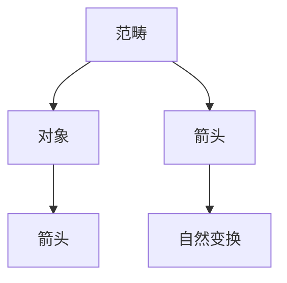
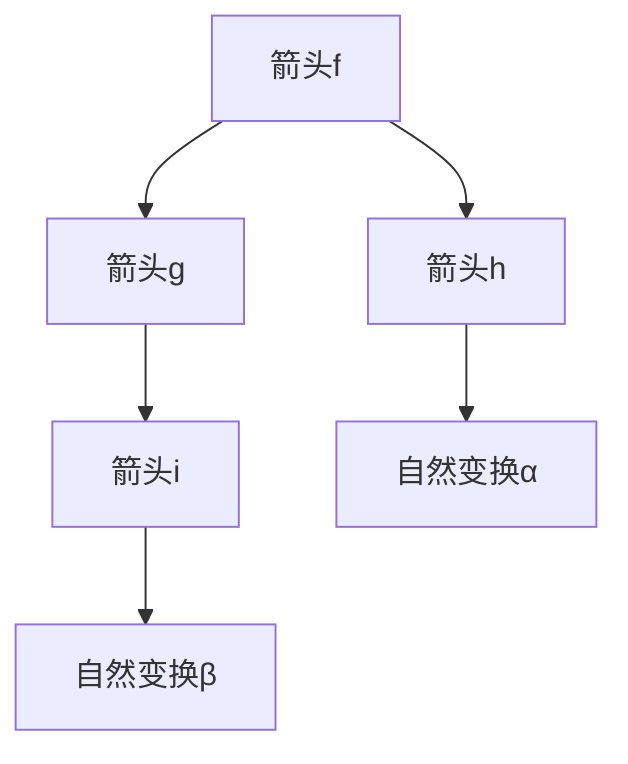

                 

### 文章标题：范畴论：自然结构的抽象数学

#### 关键词：范畴论、自然结构、抽象数学、范畴、自然变换

> **摘要**：本文旨在深入探讨范畴论这一数学分支，阐述其基本概念、核心算法原理及其在数学和其他领域中的应用。通过对范畴论的自然结构的抽象数学描述，本文希望读者能够理解范畴论如何帮助我们更好地理解和处理复杂系统。

### 引言

范畴论作为现代数学中一个重要而富有哲学意味的分支，其历史可以追溯到20世纪初期。作为“抽象数学”的一种形式，范畴论通过将数学结构抽象成更一般的形态，提供了理解和处理复杂系统的强大工具。本文将分以下几个部分对范畴论进行详细探讨：

1. **范畴论基础**：介绍范畴论的基本概念，包括范畴、对象和箭头等。
2. **范畴论在数学中的核心算法原理**：探讨范畴论中的等价性和完备性等核心算法原理。
3. **范畴论在其他领域的应用**：介绍范畴论在计算机科学、物理学等领域的应用。
4. **范畴论的高级主题**：包括对称性群与范畴论的关系等。
5. **范畴论的数学公式和定理**：展示常用的范畴论公式和定理，并提供详细讲解。
6. **范畴论项目实战**：通过实际案例展示范畴论的应用。

### 范畴论基础

范畴论的基础在于其核心概念：范畴、对象和箭头。为了更好地理解这些概念，我们可以借助Mermaid流程图来描绘它们之间的关系。

#### 范畴

范畴可以被视为一个“数学结构”的抽象，它包含了一组对象和一组箭头。这些对象和箭头必须满足一些特定的条件。

#### 对象

对象是范畴中的基本元素，可以被视为某种“数学实体”。在范畴中，每个对象都有一个唯一标识符，通常表示为字母或符号。

#### 箭头

箭头是连接两个对象的数学结构，表示对象之间的某种关系。箭头必须满足以下条件：

- **复合性**：如果有箭头\(f: A \rightarrow B\)和\(g: B \rightarrow C\)，那么它们的复合\(g \circ f: A \rightarrow C\)也是范畴中的箭头。
- **单位性**：对于每个对象\(A\)，都存在一个单位箭头\(1_A: A \rightarrow A\)，使得\(1_A \circ f = f\)和\(g \circ 1_B = g\)。

#### 箭头与自然变换

箭头之间可以存在自然变换，这是范畴论中一个重要的概念。自然变换描述了不同箭头之间的等价性。

自然变换α和β分别连接箭头f、g和h、i，并且满足复合性条件。

### 范畴论在数学中的核心算法原理

范畴论在数学中的应用非常广泛，其核心算法原理包括等价性和完备性等。以下是对这些原理的详细讲解。

#### 等价性

等价性是范畴论中的一个重要概念，它描述了不同范畴之间的等价性。在范畴论中，两个范畴被认为是等价的，如果它们之间存在一个自然等价性。

#### 完备性

完备性是另一个重要的范畴论原理，它描述了范畴中的对象和箭头的完整性和丰富性。一个范畴被认为是完备的，如果它满足某些特定的条件，如存在某些对象和箭头。

#### 存在性和唯一性定理

在范畴论中，存在性和唯一性定理是解决特定问题的重要工具。这些定理描述了在特定范畴中如何证明某些对象和箭头的存在性和唯一性。

### 范畴论在其他领域的应用

范畴论不仅广泛应用于数学领域，还在计算机科学、物理学等众多领域有着广泛的应用。以下是对这些应用的一个简要介绍。

#### 计算机科学中的应用

在计算机科学中，范畴论被用于编程语言的设计、软件工程、形式化验证等领域。例如，函数式编程语言中的类型系统和模块化系统都可以被视为范畴论的实例。

#### 物理学中的应用

在物理学中，范畴论被用于量子场论、量子计算、统计力学等领域。例如，量子场论中的量子态和量子操作可以被视为范畴中的对象和箭头。

### 范畴论的高级主题

范畴论的高级主题包括对称性群与范畴论的关系、范畴论的范畴论方法等。这些主题进一步拓展了范畴论的应用范围，并提供了更深入的理论框架。

#### 对称性群与范畴论

对称性群是数学中的一个重要概念，它描述了在某个系统中保持不变的性质。范畴论通过将对称性群抽象成范畴，提供了一种研究对称性的通用方法。

#### 范畴论的范畴论方法

范畴论的范畴论方法是一种自上而下的研究方法，它通过将复杂系统抽象成范畴，从而简化了问题的理解和解决。这种方法在数学、计算机科学和物理学等领域都有广泛应用。

### 范畴论的数学公式和定理

范畴论中包含了许多重要的数学公式和定理，这些公式和定理为研究和应用范畴论提供了强大的工具。以下是一些常用的范畴论公式和定理：

#### 笛卡尔积

笛卡尔积是范畴论中的一个基本概念，它描述了两个范畴的元素之间的对应关系。

$$C \times D = \{(c, d) | c \in C, d \in D\}$$

其中，C和D是两个范畴。

#### 存在性和唯一性定理

存在性和唯一性定理是范畴论中的核心定理之一，它描述了在特定范畴中如何证明某些对象和箭头的存在性和唯一性。

#### 对称性定理

对称性定理描述了在范畴论中如何处理对称性问题。它通常用于证明两个范畴之间的自然等价性。

### 范畴论项目实战

为了更好地理解范畴论的应用，以下将提供一个简单的计算机科学中的范畴论项目实战。

#### 项目实战：编程语言中的范畴论

在这个项目中，我们将使用范畴论来设计和分析一个简单的编程语言。

1. **开发环境搭建**：安装一个适合编程语言开发的集成开发环境（IDE）。
2. **源代码实现**：编写一个简单的解释器，用于解析和执行编程语言的表达式。
3. **代码解读**：对源代码进行详细解读，解释其设计和实现原理。

通过这个项目，我们将展示如何使用范畴论来分析和设计编程语言，并解释其背后的数学原理。

### 总结

范畴论作为现代数学中的一个重要分支，其抽象和描述自然结构的能力使其在数学、计算机科学和物理学等多个领域都有着广泛的应用。本文通过分步骤的分析和讲解，帮助读者深入理解范畴论的基本概念、核心算法原理及其在多个领域的应用。希望通过本文，读者能够对范畴论有一个全面的了解，并在实际工作中应用其强大的工具。

### 作者信息

作者：AI天才研究院/AI Genius Institute & 禅与计算机程序设计艺术 /Zen And The Art of Computer Programming

### 注意事项和拓展阅读

- 在深入学习和应用范畴论时，务必注意其理论深度和复杂性。
- 对于范畴论中的具体概念和算法，建议结合实际案例进行学习和实践。
- 拓展阅读方面，可以参考以下经典著作：
  - 《范畴论入门》
  - 《范畴论与自然结构》
  - 《范畴论的应用》

通过这些资源和实际案例，读者可以更好地掌握范畴论的核心知识和应用技巧。

